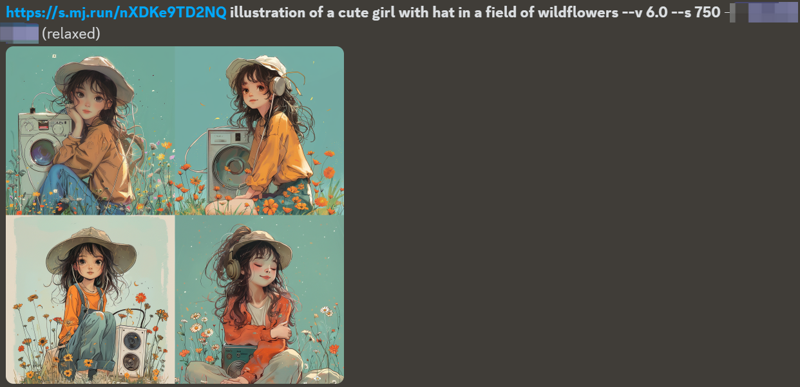
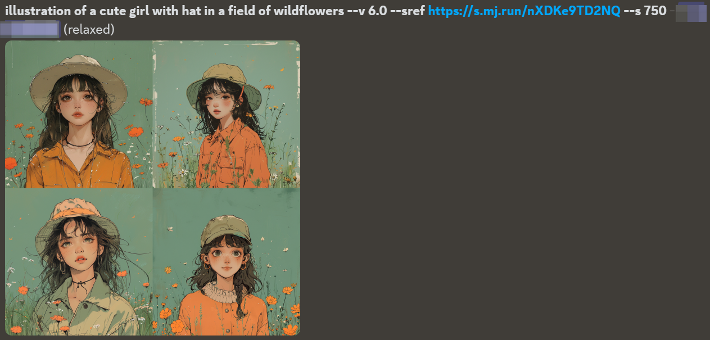

---sref指令全称为“风格参考”（Style References），旨在帮助用户复刻和保持图片风格的一致性。其主要作用是允许用户上传一张或多张图片作为风格参考，以指导Midjourney生成与这些参考图风格一致的图像。这个指令在你看到一个非常喜欢的图片，想尝试生成类似或相同风格的图片、而又不知道这是什么风格时特别有用。

## 适用版本
Midjourney V6 和 Niji V6

## 基础使用方法
```prompt提示词 --sref 图片URL```


有以下三种获得图片URL的方法：
1. 鼠标移动到之前生成过的图片，单击右键，选择“复制消息链接”，然后即可粘贴到prompt中
2. 直接将之前生成过的图片拖拽到输入框中
3. 从本地上传图片

MJ会将图片URL视作一个风格参考，并尝试制作类似风格的内容。

本文将以[Midjourney官网的这张图片](https://www.midjourney.com/jobs/8e07eed2-5e4c-4cea-bbd3-fb07da784f43?index=0)进行演示：


先将图片上传到Midjourney中，然后输入以下prompt：
```
a cute girl with hat --sref https://s.mj.run/XRxNtTBjwcs --style raw --s 750 --niji 6
```

可以看到Midjourney根据我们提供的图片风格，绘制了4个戴帽子的小女孩的图片：


### ---sref v.s style tuner
style tuner可以通过prompt生成一系列的图，然后根据你选择的内容来确定这个模型的风格和方向。可以将style tuner生成的图片作为sref参数的参考URL，下面为prompt示例：

Style tuner生成的图片：


依据style tuner的风格，利用sref参数生成的图片：


### ---sref v.s 垫图
--sref参数和垫图的prompt格式不同：
- 垫图：
/imagine URL prompt text --v 6

- Style reference：
/imagine prompt text --v 6 --sref URL

我们用下面这张[参考图片](https://www.midjourney.com/jobs/a94d3836-b446-45b7-8a0c-33c41fda1869?index=0)来看看生成图片的区别：


使用相同的描述文本和参考图片，**垫图更加关注语义内容（如人物、地点、物品等），会参考一小部分风格**：


而**sref参数则更加关注色彩和风格**：



## 进阶使用方法

### 设置图片参考的总权重
---sw（Style weight）参数可用来调节风格强度。--sw默认值为100，数值范围为0到1000。数值越高，生成的图片与参考图片的风格就越相似；数值越低，画面就越接近提示词直出的效果。经过测试，至少要15-20才能看出效果，数值在200左右效果较好，超过700画面容易出现扭曲变形。


### 使用多个图片作为风格参考

提示词如下：
```
prompt提示词 --sref 图片一URL 图片二URL 图片三URL ...
```

例如同时参考上述两张图片的风格生成一张图片：


### 设置单个参考图片的权重
使用多张参考图片时，每张图片的参考权重是相同的。可以使用::来指定单张图片的权重，权重数值区间为0到100，例如：


### 结合垫图使用
通过垫图让Midjourney学习图片中的元素、构图、内容，--sref指令让Midjourney学习图片风格。注意：中间一定要加文字提示内容，否则会无法生成。
提示词如下：
```
图片URL prompt提示词 --sref 图片URL
```

两者同时使用则可兼顾语义内容与风格：


