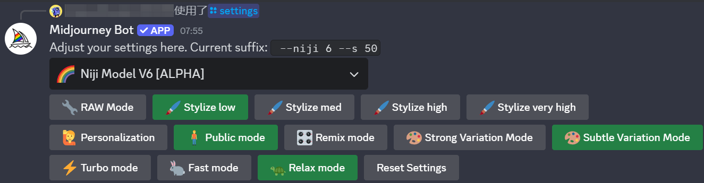
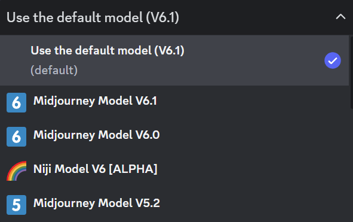
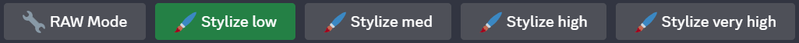
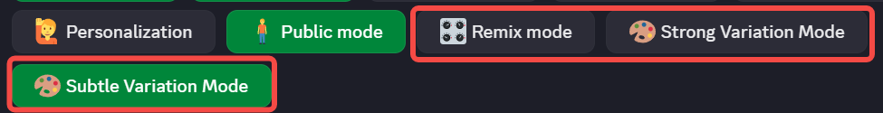
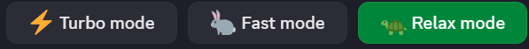
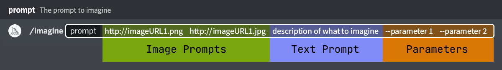
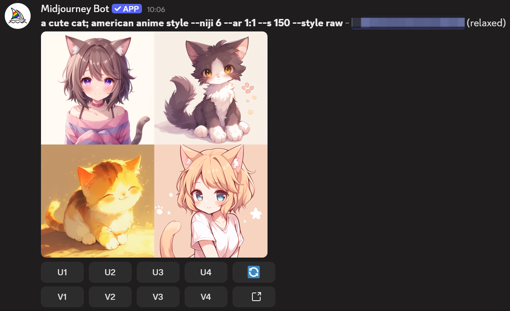
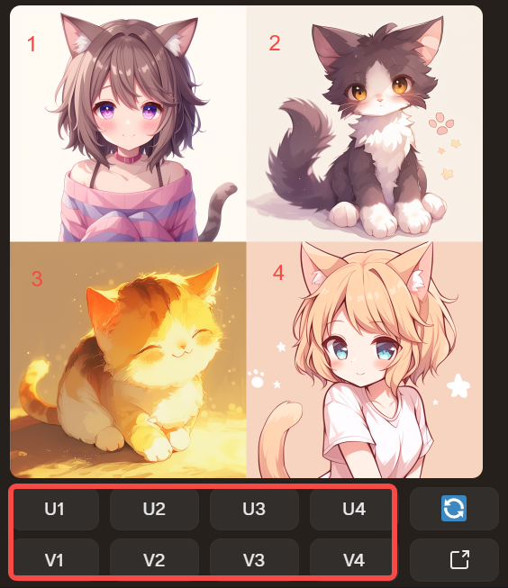
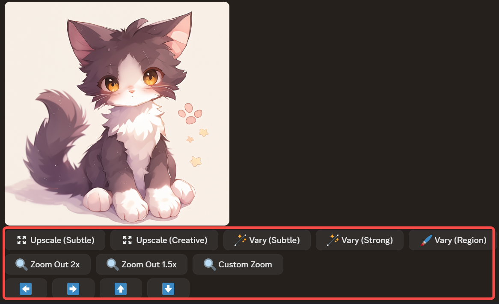

## 基础设置
向Midjourney Bot发送 /settings 命令，会得到Midjourney可配置的设置：


### 模型版本控制

在第一行的下拉框中，可以选择Midjourney不同版本的绘图模型，在绘图倾向和参数数值方面会有差异。主要分为Midjourney Model和Niji Model两类：
- Midjourney Model：Midjourney自身的模型，风格多变、擅长绘制写实图片、风格化图片。目前已更新到V6.1，也是默认模型版本。
- Niji Model：Midjourney和SpellBrush的合作模型，更擅长绘制二次元动漫和插图。目前已更新到V6。

### 风格化控制


第二行的五个按钮控制生成图片的风格。风格化越强，代表生成图片的艺术感和失控感越强：
- RAW Mode：原始图像模式，作用等同于参数 --style raw。风格相对简洁，减少AI自动的风格化处理。只在Midjourney Model V5.1和V5.2中支持。
- Stylize low：弱风格化，作用等同于参数 --style 50。
- Stylize med：中风格化，作用等同于参数 --style 100。是默认风格化等级。
- Stylize high：强风格化，作用等同于参数 --style 250。
- Stylize very high：超强风格化，作用等同于参数 --style 750。

### 个性化设置
Personalization（个性化）功能便于让AI模型学习创作者的喜好来制作图片，避免在prompt里反复说明自己想要的风格或效果。
启用这个功能的前提是，你需要到官网去给至少200张图片进行投票，模型才能了解你的偏好。
在开启个性化功能后，你在prompt结尾加上 --p 即可直接使用该功能。

### 隐私设置
在Public mode（公开模式）下，用户让Midjourney生成的图片都会公开在Midjourney社区中。只有Pro Plan的用户可以关闭此模式。

### 混合设置

混合设置包含三个按钮：
- Remix mode：混合模式。允许用户在做V操作（Upscale和Variaiton）和Reroll（重绘）时重新编辑prompt。关闭该模式则默认使用原始的prompt再生成图片。
- Strong Variation Mode：高变差模式，在Remix时倾向以更大的变化完成重绘。仅在Remix mode开启时生效。
- Subtle Variation Mode：低变差模式，在Remix时倾向以更小的变化完成重绘。仅在Remix mode开启时生效。

### GPU生成模式

Midjourney可用两种GPU模式，分别对应不同的速度：
- Fast mode：快速生成模式。消耗订阅中的Fast时间，每幅图的生成时间约几秒到十几秒。
- Relax mode：慢速生成模式。不消耗Fast时间，在队列中等待GPU可用时生成图片，平均一幅图几秒到十分钟。
- Turbo mode：超频模式。消耗的也是Fast时间，但速度比Fast mode 快四倍，耗时计算是Fast mode的两倍。

## 命令介绍
### 基础命令
- `/settings`：查看和修改Midjourney设置
- `/help`：显示帮助信息
- `/info`：显示当前版本信息
- `/about`：显示关于Midjourney的信息
- `/quit`：退出Midjourney

### 生成图像命令
- `/imagine`：生成图像
- `/prompt`：指定图像描述
- `/seed`：指定随机种子
- `/variations`：生成图像变体
- `/upscale`：提高图像分辨率
- `/style`：指定图像风格
- `/quality`：指定图像质量
- `/aspect`：指定图像宽高比
- `/mask`：使用遮罩生成图像

### 高级命令
- `/blend`：混合两张图像
- `/inpaint`：修复图像
- `/edit`：编辑图像
- `/animate`：生成动画
- `/loop`：生成循环动画
- `/slerp`：生成图像插值
- `/checkpoint`：保存模型检查点
- `/restore`：恢复模型检查点

### 其它命令
- `/join`：加入聊天室
- `/leave`：离开聊天室
- `/mute`：把聊天室静音
- `/unmute`：取消聊天室静音
- `/clear`：清楚聊天记录

### 使用命令时的注意事项
- 命令区分大小写
- 命令可以组合使用
- 命令的具体效果取决于图像描述以及各个指令的位置

## Prompt实操
### Prompt基础结构

Midjoureny中完整的Prompt由三部分组成：
- 命令 Commands：后面可以接prompt的命令只有`/imagine`
- 提示词 Prompt：向模型描述你想要的图片时所用的短语、句子、图片链接。
- 参数 Parameters：以`--参数类型 数值`为格式的后缀参数，可以控制图像的长宽比、模型版本、风格化等。

其中命令和提示词是必须要写的，参数可选。如果不写参数，会调用Midjourney的默认参数设置。

以下面这个prompt为例，发送给Midjourney Bot后，Bot会返回四张图片，图片从模糊状态逐渐变清晰：
```
a cute cat; american anime style --niji 6 --ar 1:1 --s 150
```


### Prompt参数介绍
参数的基本格式：在prompt后添加一个空格，然后输入`--参数 值`。参数和值之间需要添加空格。
有些参数不需要值，只要输入参数就意味着开启该选项，如 --fast。

#### 通用参数
- `--seed`：指定随机种子。范围为0到4294967295
- `--chaos`：控制图片的混乱程度。范围为0到100，数值越高，图片越混乱
- `--quality`：控制图片质量。范围为0.25到1，数值越高，图片质量越高，但渲染时间越长
- `--aspect`：控制图片宽高比。默认值为1:1
- `--style`：控制图片风格。可以指定具体的艺术家或风格名称
- `--no`：排除某些元素，如`--no 人脸`可以生成没有人脸的图片

#### 高级参数
- `--iw`：控制图片权重。范围为0到2，数值越高，图片权重越高
- `--fast`：使用快速模式生成图片，但质量可能较低
- `--repeat`：重复生成图片，可指定重复次数
- `--relax`：使用放松模式生成图片，可以提高图片质量，但渲染时间更长
- `--stylize`：控制图片风格化程度。范围为0到1，数值越高，图片风格化程度越高
- `--mask`：使用遮罩生成图片，可以指定遮罩图片路径

#### 其它参数
- `--promptw`：指定图片描述。可以包含文本、表情符号、特殊符号等
- `--v`：指定模型版本
- `--upscaler`：指定图片放大器，默认值为“ESRGAN”
- `--prompt_weights`：指定文本权重。可以为不同文本块指定不同权重
- `--cfg_scale`：控制配置文件缩放比例。用于调整图片的整体风格

### Upscale和Variation
Midjourney Bot返回四张图片后，下面会有两排按钮，同时按钮会带数字，数字分别对应图片四宫格中的四张图片：


按钮的作用如下：
- U：Upscale，放大。把对应数字的图片放大到更高分辨率的版本。
- V：Variation，变体。把对应数字的图片作为图片prompt，搭配原始prompt再次生成新图片
- Reroll：用原始prompt重新生成图片

还可以对Upscale后的图片进行进一步处理：


- Upscale (Subtle,Creative)：在原图基础上继续放大。Upscale (Subtle)完全按照原图放大，细节不会有太多改变。Upscale (Creative)在放大原图的同时，构图不变，但会用AI优化细节
- Vary (Subtle)：类似Subtle Variation Mode，根据原图重新生成低变差的图片
- Vary (Strong)：类似Strong Variation Mode，根据原图重新生成高变差的图片
- Vary (Region)：针对某个区域进行编辑，并重新生成图片。如删除途中的某个元素
- Zoom Out (2x, 1.5x)：缩放，将镜头远离2倍、1.5倍
- Custom Zoom：自定义缩放
- 上下左右箭头：上下左右移动镜头


更多进阶使用方法可以查看[《Midjourney进阶教程》](https://chloevolution.com/zh-cn/posts/midjourney-advanced-tutorial/)