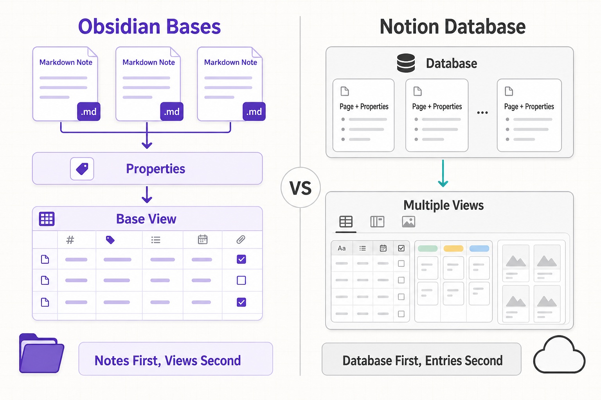
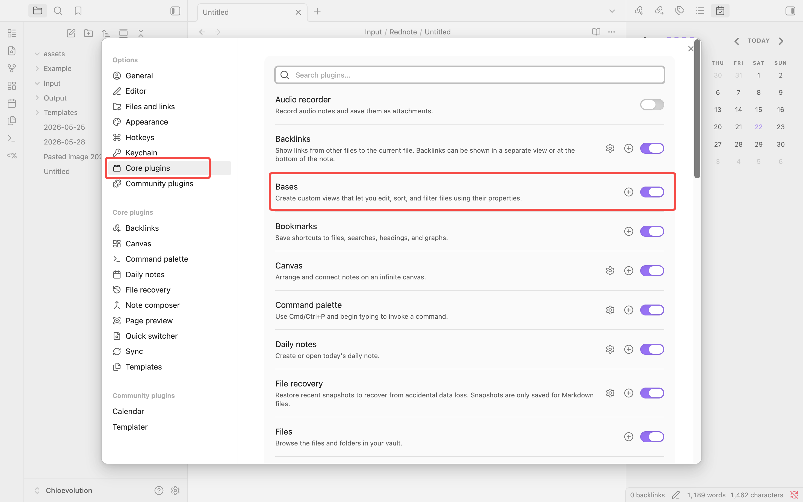
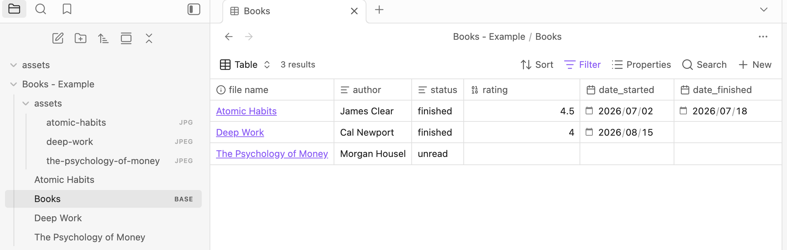
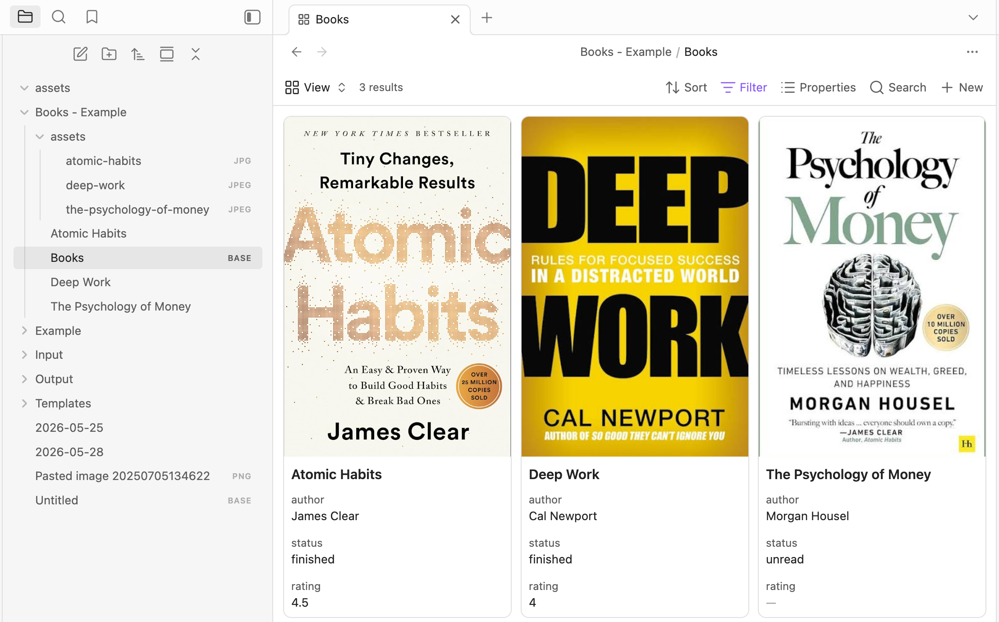
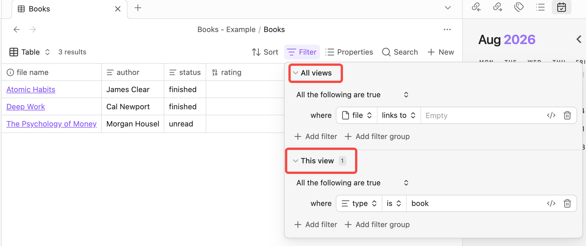
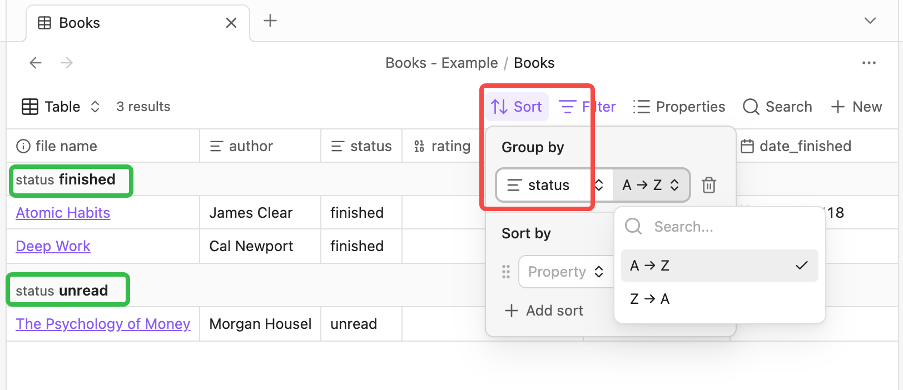
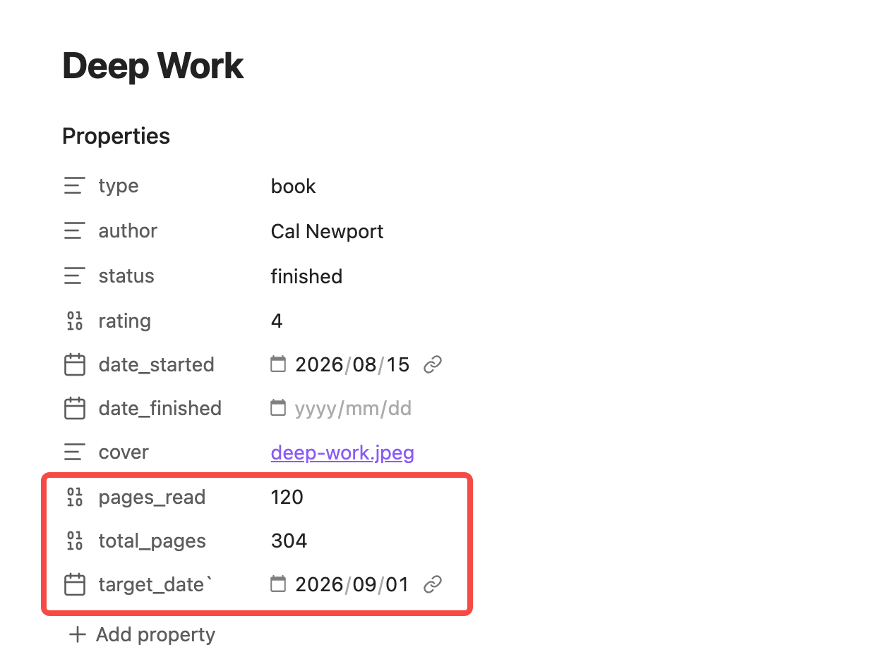
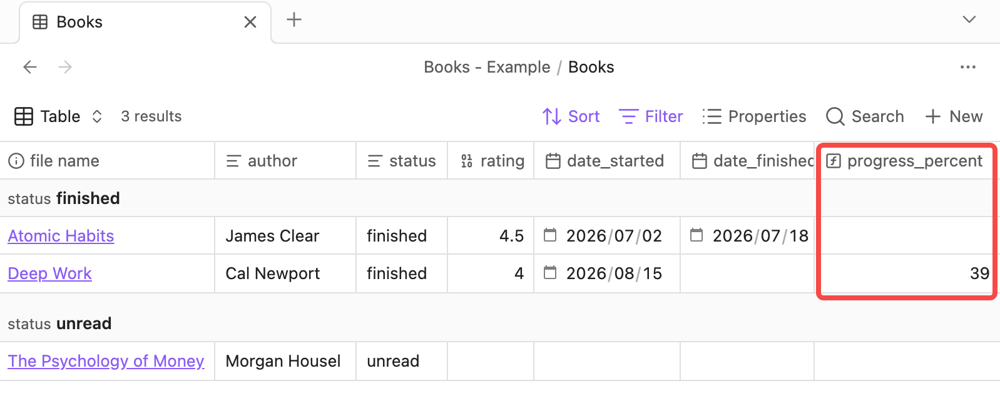

When your Obsidian vault contains only a few dozen notes, folders and tags are usually enough. As your collection grows, however, you may start asking questions like these: Which books have I not finished? Which projects are approaching their deadlines? Which Daily Notes did I write in the last 30 days?

You could open notes one by one to find the answers, but that is inefficient. What you really need is a way to organize notes automatically by status, date, rating, and other criteria.

Obsidian Bases is designed for exactly this kind of work. It brings Properties scattered across Markdown files into tables, cards, or lists, letting you filter, sort, and edit notes as if you were working with a database—while retaining Obsidian's local-storage model.

Before creating your first Base, however, you need to understand one essential idea: **Bases displays and organizes data; Properties are the data itself.**

## What Is Obsidian Bases?

[Obsidian Bases](https://help.obsidian.md/bases) is a core Obsidian plugin for creating database-like views of your notes. It reads Properties from notes and uses that structured information to display, filter, sort, and edit files.

Suppose you have a `Books` folder containing dozens of reading notes. Each note records the author, reading status, rating, and completion date. A Base can display those notes as a table:

| File name | Author | Reading status | Rating | Date finished |
|---|---|---|---|---|
| Atomic Habits | James Clear | Finished | 4.5 | 2026-07-18 |
| Deep Work | Cal Newport | Reading |  |  |
| The Psychology of Money | Morgan Housel | Unread |  |  |

You can also create multiple views in the same Base, such as “Currently Reading,” “Finished,” “Four Stars and Up,” and “Cover Gallery.” All of these views read the same notes; only their filters and layouts differ.

### Bases Is Not a Separate Database

Bases may resemble databases in tools such as Notion, but it does not move your notes into a closed data system.

It works more like a dynamic window onto your files:

- Each row still represents a file in your vault.
- Each column usually represents a file name, path, or Property.
- Editing a property value in a Base updates that property in the original Markdown note.
- View settings such as filters, sorting, and column layout do not rewrite the note body.
- Deleting a `.base` file does not delete the Markdown notes it displays.

Everything remains stored in local files. Note data lives in the Properties section at the top of each Markdown file. View configuration can be saved in a standalone `.base` file or embedded in a regular note with a `base` code block.

Bases therefore does not replace Markdown. It helps you view and manage Markdown files from another angle.

### How Do Obsidian Bases and Notion Databases Differ?

If you have used Notion, it is easy to assume that its databases and the table or card views in Bases are the same kind of tool. Both can organize content with properties, filters, sorting, and multiple views, but their underlying models are different.

The clearest distinction is where the data originates:

```text
Obsidian: Markdown notes → Properties → Base reads them and generates views
Notion:   Notion database → Create database entries (pages) → Display them in different views
```



In Obsidian, notes exist first and a Base reads those files afterward. Even without a Base, you can still open and edit the Markdown notes and their Properties normally.

In Notion, [a database is itself a collection of pages](https://www.notion.com/help/intro-to-databases). Each database entry is a Notion page, and its properties, page content, and database views all live in the Notion workspace.

| Comparison | Obsidian Bases | Notion databases |
|---|---|---|
| Data source | Existing Markdown files and Properties in your vault | Pages and properties inside a Notion database |
| Storage | Data is stored directly in local Markdown files | Content is stored in the Notion workspace; selected pages can be downloaded for offline use |
| Outside the database | Delete the `.base` file and the original notes remain | Entries belong to the database, so deleting it affects the pages it contains |
| Views | Table, List, Cards, and Map, with more available through community plugins | Table, Board, Timeline, Calendar, List, Gallery, and more |
| Property capabilities | Covers common needs such as text, numbers, dates, lists, checkboxes, and formulas | Also offers richer database properties such as Relation, Rollup, Person, and Button |
| Portability | Markdown files open directly in other text editors | Content can be exported as Markdown and CSV, but everyday editing remains centered on the Notion workspace |
| Best suited to | People who value local files, personal knowledge management, and long-term control | People who value team collaboration, relational data, and an integrated workspace |

This does not mean that Bases is always better or that Notion is necessarily more powerful. They start from different assumptions: **Bases adds database-like views on top of local notes, while Notion uses the database itself as an important container for organizing pages.**

If your priority is keeping ordinary Markdown files in your own hands for the long term, Bases will feel more natural. If your work depends on team members, permissions, Relations, and Rollups, Notion is generally more mature. For existing Obsidian users, the main value of Bases is not that it reproduces Notion. It gives you clearer data-management tools without changing your local-file workflow.

### What Is Bases Good For?

Bases works especially well for groups of notes whose content differs but whose fields are consistent. For example:

- **Reading lists:** author, status, rating, start date, finish date
- **Project management:** owner, priority, deadline, progress
- **Content calendars:** content type, keyword, publication status, publish date
- **Daily Notes indexes:** date, mood, energy, exercise, daily summary
- **Papers and research libraries:** author, year, topic, reading status
- **Movie or creative-work collections:** genre, rating, cover, viewing status

If you frequently ask, “Which notes match these conditions?”, Bases is usually more convenient than browsing folders manually.

### When Do You Not Need Bases?

Not every vault needs Bases. If you have only a small number of notes, or mainly find content through full-text search and backlinks, folders and tags may already be enough.

You may also want to postpone using Bases if:

- You do not want to maintain consistent Properties across similar notes.
- You need complex relational-database constraints or multi-user business workflows.
- You want highly customized JavaScript queries and automation.
- You have not identified a concrete problem and simply want to build a complex system in advance.

The best starting point is not a “universal database” with dozens of columns. Choose a real use case—such as a reading list—and add only the fields you will genuinely use.

## Understand Properties Before Using Bases

[Properties](https://help.obsidian.md/properties) are structured pieces of information attached to a note. They usually appear at the top of a note as property-name and property-value pairs.

For example, a reading note might contain these Properties:

```yaml
---
type: book
author: James Clear
status: reading
rating: 4
finished: false
date_started: 2026-08-01
tags:
  - books
  - productivity
---
```

You can edit this information directly in the Obsidian interface; in the Markdown source file, it is stored as YAML. Once Bases reads these fields, it can filter books with a `status` of `reading`, sort books by `rating`, or display the notes you started most recently based on `date_started`.

In other words, inconsistent Properties produce an inconsistent Base. Before creating one, designing a small set of clear and consistent properties is usually more important than learning complex formulas.

### Which Property Types Does Obsidian Support?

Obsidian currently supports these property types:

| Property type | Example | Typical uses |
|---|---|---|
| Text | `reading` | Status, author, category, short description |
| List | `books, productivity` | Multiple authors, topics, or people |
| Number | `4.5` | Rating, amount, quantity, progress |
| Checkbox | `true` | Completed, favorite, archived |
| Date | `2026-08-22` | Start date, deadline, publish date |
| Date & time | `2026-08-22T10:30:00` | Meetings, reminders, event records |
| Tags | `books` | Add tags to a note with the `tags` property |

A property type affects not only how you edit it in the interface but also how Bases filters, sorts, and calculates it. Numbers can be compared by magnitude, dates can be ordered chronologically, and checkboxes have only checked and unchecked states.

One important detail is that a property name shares one type across the entire vault. If `rating` is already a Number, you should not use it as free-form text in another note.

### How Should You Name Properties?

Obsidian does not enforce a naming convention, but consistency matters. These fields may look similar, yet Obsidian recognizes them as different properties:

```yaml
status: reading
Status: reading
book-status: reading
book_status: reading
```

To avoid splitting one concept across several fields, adopt a few simple rules for your vault:

- Use lowercase property names.
- Choose either English or another language and avoid switching back and forth.
- Use underscores or hyphens consistently between multiple words.
- Keep only one property name for each concept.
- Use the `YYYY-MM-DD` date format consistently.
- Use fixed status values such as `unread`, `reading`, and `finished`.

I recommend short English property names such as `status`, `rating`, and `date_finished`. Bases does not require them, but they are generally easier to reuse in formulas, templates, and other plugins.

### What Belongs in Properties—and What Does Not?

Properties are best for short, atomic information that you need to filter or sort, such as status, dates, and ratings. Long summaries, reading reflections, and meeting notes still belong in the note body.

A simple test is: **Will I want to filter, sort, group, or calculate with this information later?** If yes, it is a good candidate for a Property. If it is continuous prose meant primarily for reading, the note body is usually more natural.

Properties are also not well suited to Markdown content that needs to be rendered, and the interface does not directly manage complex nested properties. Keep the structure flat and simple when you begin.

### Use Templates to Keep Properties Consistent

Repeatedly entering properties by hand makes inconsistent spelling, types, and formats more likely. A safer approach is to create separate templates for reading notes, project notes, or Daily Notes so every note of the same kind begins with the same fields.

A basic reading-note template might contain only:

```yaml
---
type: book
author:
status: unread
rating:
date_started:
date_finished:
cover:
---
```

You do not need a dozen properties at the start. Begin with five to seven fields you genuinely need, use them for a while, and then adjust them based on your filtering and display requirements.

If you have not used templates before, see the [Obsidian Templates guide](https://chloevolution.com/posts/obsidian-templates/) to establish a consistent Properties structure. Next, we will use this reading-note structure to create our first Obsidian Base.

## Create Your First Obsidian Base

We will use a reading list to build a practical Base from scratch. By the end, you will have a table containing book titles, authors, reading statuses, ratings, and dates, and you will be able to edit those properties directly in the table.

The process has five steps:

1. Enable the Bases core plugin.
2. Prepare three reading notes with consistent Properties.
3. Create a standalone `.base` file.
4. Add a filter to define the Base's data scope.
5. Choose which Properties to display in the Base.

### Step 1: Enable the Bases Core Plugin

Bases is an official core plugin, so you do not need to download it from the community plugin marketplace.

1. Open Obsidian and go to Settings.
2. Select Core plugins in the left sidebar.
3. Search for `Bases`.
4. Turn on the switch next to Bases.



Once enabled, options for creating a Base will appear in the command palette and file explorer. If you cannot find Bases at all, update Obsidian first. Table and Cards require Obsidian 1.9 or later, while List requires 1.10 or later.

### Step 2: Prepare Three Reading Notes

Create a `Books` folder in your vault, add three Markdown notes, and use an `assets` subfolder for their cover images:

```text
Books/
├── assets/
│   ├── atomic-habits.jpg
│   ├── deep-work.jpg
│   └── the-psychology-of-money.jpg
├── Atomic Habits.md
├── Deep Work.md
└── The Psychology of Money.md
```

Add the same Properties to all three notes. You can use the following sample data directly:

> When copying, copy only the content inside the code block—from the first `---` through the final `---`—and paste it at the very top of the note. The `yaml` label above the block is only a syntax-highlighting marker used in this article and is not part of the note. Do not copy the three backticks surrounding the code block either.

**Atomic Habits.md**

```yaml
---
type: book
author: James Clear
status: finished
rating: 4.5
date_started: 2026-07-02
date_finished: 2026-07-18
cover: "[[assets/atomic-habits.jpg]]"
---
```

**Deep Work.md**

```yaml
---
type: book
author: Cal Newport
status: reading
rating:
date_started: 2026-08-15
date_finished:
cover: "[[assets/deep-work.jpg]]"
---
```

**The Psychology of Money.md**

```yaml
---
type: book
author: Morgan Housel
status: unread
rating:
date_started:
date_finished:
cover: "[[assets/the-psychology-of-money.jpg]]"
---
```

Cover images are not required to create a Base. If you do not have images yet, leave `cover` empty and add them later when you configure the Cards view.

The key is that all three notes use the same property names and status values. `type: book` identifies the files that belong to the reading list, `status` distinguishes unread, reading, and finished books, and the remaining fields support display and sorting.

### Step 3: Create Books.base

According to the [official Obsidian documentation](https://help.obsidian.md/bases/create-base), there are three common ways to create a Base:

- **File explorer:** Right-click the target folder and select New base.
- **Command palette:** Run “Bases: Create new base.”
- **Left ribbon:** Click the Create new base button.

For this example, right-click the `Books` folder, choose New base, and name the file:

```text
Books.base
```

When you open the file, you will see the default Table view. The `.base` file stores filters, displayed properties, sort order, and view settings—not the reading notes themselves.

If you do not want a standalone file, you can run “Bases: Insert new base” to embed a Base directly in the current Markdown note. For a first exercise, however, a standalone `Books.base` is easier to understand and manage.

### Step 4: Define the Base's Data Scope

A new Base may display files from your entire vault. This is not an error; it simply has no filter yet.

Open Filter in the Base toolbar and add this condition under All views:

```text
type is book
```

This filter reads each note's `type` property and keeps only files whose value is `book`. Because it lives under All views, every table, card, or list view you create later will inherit this data scope.

You can also define the scope by folder—for example, by showing only files in `Books`. The two approaches differ as follows:

| Filter method | Advantage | Best when |
|---|---|---|
| `type is book` | Notes remain identifiable after being moved to another folder | You mainly organize notes with Properties |
| File is in the `Books` folder | Simple and intuitive; does not depend on a `type` property | Every reading note always stays in one folder |

I recommend `type is book`. If you later move a note into an author folder or archive, it remains in the reading list as long as its `type` property does not change.

> Note: All views filters determine which files the entire Base can use. This view filters affect only the current view. Put foundational scope conditions under All views, and local conditions such as “currently reading only” under This view.

### Step 5: Choose the Properties to Display

Open the Properties menu in the toolbar and keep these fields in this order:

- File name
- author
- status
- rating
- date_started
- date_finished

Hide `type` and `cover` for now. `type` is used only for filtering and does not need to occupy table space; we will use `cover` later in the Cards view.

You should now see a reading list containing three books. Try entering `4` as the `rating` for `Deep Work`, or change its `status` from `reading` to `finished`, then open the original note and inspect its Properties. The edit has been written back to the corresponding Markdown file.

Your first Base is now complete. It is not a separate table that you must maintain twice; it is a live view of the three reading notes.



## Use Different Bases Views

A Base can contain multiple views, each with its own layout, displayed fields, filters, and sort order. The same `Books.base`, for example, can include “All Books,” “Currently Reading,” “Finished,” and “Cover Gallery.”

Click the view name in the upper-left corner and select Add view. You can also run “Bases: Add view” from the command palette.

According to the current [official Views documentation](https://help.obsidian.md/bases/views), Obsidian provides Table, Cards, List, and Map layouts, and community plugins can add more. For most personal knowledge bases, the first three are the most useful.

### Table: Best for Viewing and Editing Structured Data

Table is the default Base view. Each row represents a file, while each column displays file information or a Property.

It is particularly useful when you need to:

- Compare multiple properties across many notes.
- Edit statuses, ratings, dates, and other data in one place.
- Sort by numbers or dates.
- Review project progress, content plans, or reading lists.

In `Books.base`, rename the default view “All Books” and configure it to:

- Display `author`, `status`, `rating`, `date_started`, and `date_finished`.
- Group by `status`.
- Sort each group by `rating` from highest to lowest.

You can also adjust row height. Short works well for compact data lists, while Medium or Tall displays more content. To count books with ratings or calculate an average rating, right-click a column header, choose Summarize, and add a summary such as Filled or Average at the bottom of the column.

Table offers high information density and convenient editing, but it does not emphasize covers and other visual content. Use Table when you need to process data quickly and Cards when you want to browse images.

### Cards: Best for Covers, Images, and Portfolios

Cards displays files in a gallery and can show a cover image at the top of each card. It works well for:

- Book and movie lists.
- Image libraries and portfolios.
- Travel locations and inspiration collections.
- Any collection where visual recognition matters.

Choose Add view, select the Cards layout, and name it “Cover Gallery.” Then open the view settings:

1. Set Image property to `cover`.
2. Choose Cover or Contain based on the image proportions.
3. Adjust the card size and image aspect ratio.
4. Keep `author`, `status`, and `rating` in the Properties menu.

The `cover` property can use an internal link to a local attachment or an external image URL. For example:

```yaml
cover: "[[assets/atomic-habits.jpg]]"
```

Cover fills the image area and crops the edges when necessary. Contain shows the entire image but may leave empty space around it. Book covers usually work well with Contain; photos with consistent dimensions and proportions often work better with Cover.

Cards is designed for browsing, not for comparing many fields at once. Too many properties dilute the visual focus, so the title, author, status, and rating are usually enough.



### List: Best for Lightweight Indexes and Mobile Browsing

List displays files as a bulleted or numbered list. It is simpler than Table and more compact than Cards, making it useful for:

- Recently updated notes.
- Simple article or research indexes.
- Quick browsing on mobile devices.
- Lists that need only a title and one or two supporting properties.

After creating a List view, you can choose bullets, numbers, or no markers. With Indent properties enabled, secondary properties appear indented beneath the main item. When it is disabled, multiple properties appear on the same line with commas or another separator.

For example, create a List view called “Currently Reading” and add this filter under This view:

```text
status is reading
```

Place File name first in the Properties menu and keep only `author` and `date_started` beneath it. The Base will then show what you are reading and when you started at a glance.

List requires Obsidian 1.10 or later. If your view menu contains only Table and Cards, check your Obsidian version instead of recreating the Base.

### Map: Best for Notes with Location Data

Map displays files as markers on an interactive map. It suits travel notes, place collections, customer locations, and similar use cases. It requires Obsidian 1.10 or later and the relevant Maps plugin.

A reading list does not need a map, so this guide does not cover its setup. If your notes do not contain coordinates or location properties, there is no reason to add Map simply to use every available view.

### How Should You Design Multiple Reading-List Views?

After the preceding setup, `Books.base` can contain four complementary views:

| View name | Layout | This view filter | Primary purpose |
|---|---|---|---|
| All Books | Table | None | View and edit every reading note |
| Currently Reading | List | `status is reading` | Review current reading tasks quickly |
| Finished | Table | `status is finished` | Revisit books by rating or completion date |
| Cover Gallery | Cards | None | Browse the library by cover |

All four views share the `type is book` filter under All views, so they read only book notes. Each view then uses its own filter and layout to solve a different problem.

More views are not automatically better. A useful rule is: **Table manages data, Cards supports visual browsing, and List enables quick lookup.** Keep a new view only when it meaningfully reduces the work required.

## Filter, Sort, and Group Notes

With only three sample notes, manual browsing is easy. Once the reading list grows to dozens or hundreds of books, however, filtering, sorting, and grouping become much more valuable.

Each feature solves a different problem:

- **Filter:** Determines which files appear in the result.
- **Sort:** Determines the order of those files.
- **Group:** Places files with the same property value into the same section.

You can filter first to narrow the scope, then sort or group the result. For example, show only finished books, sort them from highest to lowest rating, and finally group them by completion year.

### What Is the Difference Between All Views and This View?

Open Filter in the Base toolbar and you will see two sections: All views and This view.



- Filters under **All views** apply to the entire Base.
- Filters under **This view** apply only to the current view.

The `type is book` condition we added earlier defines the fundamental data scope, so it belongs under All views. Every Table, Cards, and List view will then show only reading notes.

Conditions such as “currently reading,” “four stars and up,” or “recently finished” belong under This view. They serve one view without affecting the others in the same Base.

If a view suddenly returns no results, check both sections. Global and current-view filters apply together; a file disappears whenever it fails either set of conditions.

### How Do You Add a Filter?

A standard filter has three parts:

1. **Property:** The note or file property to inspect.
2. **Operator:** The comparison, such as equals, contains, greater than, or earlier than.
3. **Value:** The value to compare against.

Available operators depend on the property type. Text supports tests such as equals or contains, Number supports numerical comparisons, Date supports earlier or later, and Checkbox supports checked or unchecked.

These are common reading-list filters:

| Goal | Filter | Recommended location |
|---|---|---|
| Show only book notes | `type is book` | All views |
| Show only books in progress | `status is reading` | This view |
| Show books rated at least 4 | `rating is greater than or equal to 4` | This view |
| Exclude books not yet started | `status is not unread` | This view |
| Show only a particular folder | File is in `Books` | All views or This view |
| Show notes with the `books` tag | Tags contains `books` | All views or This view |

The wording in the interface varies with your Obsidian language and property type, but the logic is always “property + comparison + value.”

### Filter by Date and File Information

In addition to Properties you create, Bases can read built-in file information such as path, creation time, modification time, and tags.

You might create views for:

- Reading notes modified in the last seven days.
- Books finished in the last 30 days.
- Files in the `Books` folder and its subfolders.
- Every note with the `books` tag.

For ordinary conditions, use the visual filter menu first. If it cannot express the logic you need, click the code icon to open the Advanced filter editor. Here are several useful expressions:

```text
file.inFolder("Books")
file.hasTag("books")
file.mtime > now() - "7d"
date_finished >= today() - "30d"
```

They mean, respectively: the file is in `Books` or one of its subfolders; the file has the `books` tag; the file was modified within the last seven days; and the completion date falls within the last 30 days.

Advanced filters are flexible, but a misspelled property, incorrect quotation mark, or mismatched type can easily return no results. Beginners should use the visual menu for most filters and turn to expressions only when necessary.

### Combine Multiple Filter Conditions

When one condition is not enough, you can combine filters in three ways:

- **All the following are true (AND):** Every condition must match.
- **Any of the following are true (OR):** At least one condition must match.
- **None of the following are true (NOT):** Exclude files that match the conditions.

To create a “Highly Rated Finished Books” view, choose All the following are true and add:

```text
status is finished
rating is greater than or equal to 4
```

To create a “To Read” view, choose Any of the following are true and add:

```text
status is reading
status is unread
```

When combining filters, verify that each one returns the expected result on its own before putting them into one group. This makes an empty result much easier to diagnose.

### How Do You Sort Notes?

Open Sort in the top toolbar, choose a Property, and then choose a direction:

- Text sorts A→Z or Z→A.
- Number sorts from smallest to largest or largest to smallest.
- Date sorts from oldest to newest or newest to oldest.

Common reading-list arrangements include:

- Sort `rating` from high to low to see top-rated books first.
- Sort `date_started` from newest to oldest to see recently started books.
- Sort `date_finished` from newest to oldest to review recently completed books.
- Sort File name alphabetically for a stable catalog.

A view can have multiple sort conditions. Conditions higher in the list take priority. If you sort first by `status` and then by `rating` from high to low, books are ordered by reading status and then by rating within each status.

If the order looks wrong, check the property type. A `rating` stored as Text is ordered by characters rather than numeric value.

### How Do You Group Notes?

Grouping divides results into collapsible sections based on a Property value. For a reading list, grouping by `status` is especially useful:

```text
finished
reading
unread
```

Open Sort, choose `status`, and set it to Group. You can then distinguish finished, current, and unread books in one table without creating three separate views.



A view currently supports grouping by one Property, but you can still add multiple sorts afterward. For example, group by `status`, then sort the books within each group by `rating` from highest to lowest.

Grouping helps reveal the shape of your data. If a property has dozens of distinct values, such as author names, however, it will create too many sections; filtering or sorting is usually more useful in that situation.

## Use Formulas and Summaries in Bases

Properties store data that you enter manually. A Formula calculates a new result from that data automatically.

For example, `pages_read` and `total_pages` can record your current and total page counts, and a formula can turn them into reading progress. A `target_date` can record when you plan to finish and let a formula calculate how many days remain.

According to the [official Obsidian Formula documentation](https://obsidian.md/help/formulas), formula properties can perform arithmetic, text processing, date calculations, conditional logic, and list operations. Their results remain in the Base configuration and are not written to each Markdown note as new Properties.

### Prepare Three Properties Before Adding a Formula

To continue the reading-list example, add three properties to `Deep Work.md`. Because the note already has Properties, the easiest method is to use the property editor at the top of the note:

1. Open `Deep Work.md`.
2. Click Add property at the bottom of the Properties area, or run the “Add file property” command.
3. Add `pages_read`, set its type to Number, and enter `120`.
4. Add `total_pages`, set its type to Number, and enter `304`.
5. Add `target_date`, set its type to Date, and choose `2026-09-01`.

If a property name already appears in the selector, choose it directly. Otherwise, type the complete name and create it. The note should then have these three additional fields:

| Property | Type | Example value |
|---|---|---|
| `pages_read` | Number | `120` |
| `total_pages` | Number | `304` |
| `target_date` | Date | `2026-09-01` |



If you prefer to edit YAML directly, switch to Source Mode from the menu in the note's upper-right corner and add the following three lines **before the closing `---` of the existing Properties block**:

```yaml
pages_read: 120
total_pages: 304
target_date: 2026-09-01
```

> Add only these three property lines. Do not add another pair of `---` delimiters, and do not copy the `yaml` language label or the surrounding backticks. A note needs only one Properties block at the top.

You can leave the other two notes without these fields for now. Formulas calculate each row from the data that is actually present in that note.

### How Do You Create a Formula Property?

1. Open Properties in the Base toolbar.
2. Click Add formula at the bottom of the menu.
3. Enter a formula name.
4. Enter an expression in the Formula field.
5. When the editor shows a green check mark, close the window.

The formula will then appear in the Properties menu like a regular Property. You can add it to Table or Cards, and you can filter or sort by its result.

A formula can reference three kinds of data:

- **Note properties:** Properties stored in the note, such as `rating` and `pages_read`.
- **File properties:** Information about the file itself, such as `file.name` and `file.mtime`.
- **Formula properties:** Other formulas in the same Base, referenced as `formula.formula_name`.

### Formula Example 1: Calculate Reading Progress

Create a formula named `progress_percent` and enter:

```text
if(total_pages > 0, ((pages_read / total_pages) * 100).round(0), "")
```

When `pages_read` is 120 and `total_pages` is 304, the result is approximately `39`, meaning that you have read 39% of the book.



The formula does not append `%` directly because keeping the result as a Number lets you sort by progress, filter for books whose progress is greater than 50, or calculate average progress across the view. You can rename the displayed column “Reading Progress (%).”

### Formula Example 2: Calculate Days Until a Target Date

Create a formula named `remaining_days`:

```text
if(target_date, ((target_date - today()) / 86400000).ceil(), "")
```

Subtracting two dates produces a value in milliseconds, and `86400000` is the number of milliseconds in one day. The formula converts the result to days and rounds upward:

- A positive number is the number of days remaining.
- `0` means the target date is today.
- A negative number means the target date has passed.

The same formula works for project deadlines, article publication dates, and task due dates.

If you need only a readable relative date rather than a number you can calculate or sort, use:

```text
if(target_date, target_date.relative(), "")
```

It returns text such as “in 3 days” or “2 days ago.”

### What Is the Difference Between a Formula and a Summary?

Both Formula and Summary calculate data, but at different scopes:

| Feature | Scope | Example |
|---|---|---|
| Formula | Calculates a result separately for each note | Reading progress or remaining days for each book |
| Summary | Aggregates an entire column in the current view | Average rating, number of books, or total pages |

A formula produces one result per row. A summary appears only at the bottom of a column in Table and includes only the files visible after filtering.

For example, Average on the `rating` column in the Finished view gives you the average rating of completed books. The All Books view can use a different summary configuration.

### How Do You Add a Summary?

1. Right-click a column header in Table.
2. Select Summarize…
3. Choose a summary supported by that property type.

Common summaries include:

| Property type | Available summaries | Example use |
|---|---|---|
| Any type | Empty, Filled, Unique | Count blanks, filled values, or distinct values |
| Number | Average, Sum, Min, Max, Median | Average rating, total pages, highest rating |
| Date | Earliest, Latest, Range | Earliest and latest completion dates |
| Checkbox | Checked, Unchecked | Count completed and incomplete items |

In a reading list, use Filled on File name to count visible books, Average on `rating` to calculate the mean rating, and Sum on `total_pages` to calculate the total page count.

If the view is grouped by `status`, summaries appear at the top of each group, making it easy to compare finished, current, and unread books.

### What Should You Check When a Formula Returns No Result?

If a formula is blank or reports an error, check whether:

- The property name exactly matches the spelling in the note.
- A Number property was accidentally set to Text.
- A Date property uses the correct date type.
- Text values are enclosed in single or double quotation marks.
- A field used by the calculation is empty.
- Two formulas reference each other and create a cycle.

The formula editor autocompletes available properties and functions and displays a green check mark when the syntax is valid. Selecting properties from autocomplete reduces typing mistakes.

For most beginners, reading progress and remaining days cover the most common needs. Start with a formula that solves a real problem, then add complexity only when necessary; this is much easier to maintain than copying a large collection of formulas at once.

## What Is the Difference Between Obsidian Bases and Dataview?

Before Bases, many Obsidian users relied on [Dataview](https://blacksmithgu.github.io/obsidian-dataview/) to turn notes into dynamic tables, lists, or task views. Both tools read metadata from Markdown notes, and both can filter, sort, group, and calculate it. This naturally raises a question: Do you still need Dataview now that Bases exists?

There is no simple yes-or-no answer. Bases and Dataview overlap, but their workflows and capabilities differ.

### Core Differences Between Bases and Dataview

| Comparison | Obsidian Bases | Dataview |
|---|---|---|
| Type | Obsidian core plugin | Community plugin |
| Installation | Included with Obsidian; simply enable it | Install and enable it from Community plugins |
| Main workflow | Graphical interface, with optional `.base` syntax editing | Dataview Query Language (DQL), inline queries, or DataviewJS |
| Data sources | Note Properties and file information | YAML frontmatter, inline fields, tags, tasks, lists, and file information |
| Common output | Table, Cards, List, Map, and other views | TABLE, LIST, TASK, CALENDAR, and custom JavaScript output |
| Editing data | Edit note Properties directly in a Base view | Primarily for querying and display; ordinary results generally cannot edit source-note properties |
| Query capabilities | Well suited to common filters, formulas, sorting, and grouping | DQL is more flexible, while DataviewJS supports complex logic and custom output |
| Learning curve | Lower; configure it gradually through the interface | Requires query syntax, plus JavaScript knowledge for DataviewJS |
| Maintenance | Updated as part of Obsidian's core features | Depends on a community plugin, its query syntax, and compatibility |
| Best suited to | Beginners, visual management, and direct Properties editing | Complex queries, task aggregation, inline fields, and custom automated output |

The most important difference is this: **Bases is a visual management interface in which you can edit data; Dataview is a query engine that reads notes and generates results.**

Dataview's official documentation likewise positions it as a display and calculation tool rather than a metadata editor. One notable exception is checkboxes in TASK query results: checking a task there updates its state in the original note.

### The Same Reading List in Both Tools

Suppose you need to:

- Show only notes in `Books` whose `type` is `book`.
- Keep only books whose `status` is `finished`.
- Display the author and rating.
- Sort from highest to lowest rating.

In Bases, you can do everything through the interface:

1. Add `type is book` under All views.
2. Add `status is finished` to the current view.
3. Display `author` and `rating` under Properties.
4. Sort `rating` from highest to lowest.

In Dataview, insert this DQL code block in a regular Markdown note:

````markdown
```dataview
TABLE author AS "Author", rating AS "Rating"
FROM "Books"
WHERE type = "book" AND status = "finished"
SORT rating DESC
```
````

The results are similar, but the experience differs. Bases exposes configuration in the interface and works well for visual, incremental adjustments. Dataview keeps the logic in a code block, which makes queries convenient to copy, reuse, and modify, but requires you to understand syntax such as `FROM`, `WHERE`, and `SORT`.

### When Should You Prefer Bases?

Try Bases first when you:

- Do not want to install a community plugin or learn a query language.
- Want to edit statuses, ratings, and dates directly in a table.
- Need a visual Cards view for covers and images.
- Mainly need conventional filtering, sorting, grouping, and formulas.
- Prefer discovering and adjusting fields through an interface instead of maintaining code blocks.

If you are new to database-style features in Obsidian, Bases is usually the more natural starting point. It covers common use cases such as reading lists, project lists, content calendars, and simple dashboards.

### When Is Dataview Still the Better Choice?

Dataview remains valuable when you:

- Need to query inline fields from note bodies.
- Need to aggregate individual tasks across notes rather than only file-level Properties.
- Need TABLE, LIST, TASK, or CALENDAR query types.
- Need complex transformations, multi-layer logic, or highly customized output.
- Already have many stable DQL or DataviewJS queries.
- Need the DataviewJS query API to generate custom content.

DataviewJS is highly flexible, but it executes JavaScript in your notes. Before copying someone else's DataviewJS, understand what the code reads or runs, and do not execute scripts from untrusted sources.

### Can You Use Bases and Dataview Together?

Yes. They are not mutually exclusive.

The `author`, `status`, `rating`, and `date_finished` Properties created earlier are stored in the Markdown file's YAML frontmatter, so both Bases and Dataview can read them. You do not need to maintain a second data set for the other tool.

A practical combination is to:

- Use Bases to edit and review Properties in one place.
- Use Dataview to aggregate tasks, inline fields, or complex query results.
- Prefer Bases for straightforward views and use Dataview only when Bases cannot express the requirement clearly.

This keeps everyday maintenance low without giving up Dataview's flexibility for complex queries.

### Do Existing Dataview Workflows Need to Be Migrated?

If your Dataview queries are stable, there is no reason to rewrite all of them just to adopt a newer feature.

Start by recreating one simple query—such as a reading list or project list—in Bases and compare the actual experience:

- If you frequently edit properties, Bases may be more convenient.
- If the query includes tasks, inline fields, or complex transformations, keeping it in Dataview will usually save time.
- If each tool has advantages, let them coexist in the same vault.

For new users, I recommend learning Properties and Bases first. Learn DQL later when you encounter a real need that Bases cannot handle. For experienced Dataview users, Bases is best treated as a new visual editing surface rather than a mandatory replacement for existing queries.

---

The most important value of Obsidian Bases is not that it turns Obsidian into another Notion. It adds a clearer way to manage local Markdown notes.

You need to remember only three layers:

1. **Properties store data:** Authors, statuses, ratings, and dates remain in your Markdown notes.
2. **A Base organizes data:** Filters, sorting, grouping, and formulas determine how the information is processed.
3. **A View displays data:** Table is best for editing, Cards for browsing, and List for quick review.

You do not need to design a complex system before following this guide. Begin with the shortest practical path:

1. Choose a real use case, such as a reading list.
2. Define five to seven Properties you genuinely need.
3. Create three sample notes with consistent property names and types.
4. Create a Base and define its data scope under All views.
5. Keep one Table view first and confirm that you can display and edit the data.
6. Add Cards or List only when needed.
7. After using the system for a while, add filters, formulas, and summaries.

Do not begin with dozens of properties, a dozen views, or a large formula library. More fields mean more maintenance. A useful Base usually keeps only information that helps you make decisions or reduces repetitive work.

Once the reading list is stable, apply the same method to project management, content calendars, Daily Notes indexes, or research libraries. The core process does not change: standardize Properties, define the data scope, and then choose views for the use case.

To strengthen the rest of your workflow, continue with the [Obsidian Templates guide](https://chloevolution.com/posts/obsidian-templates/) to standardize Properties, the [complete Obsidian Daily Notes guide](https://chloevolution.com/posts/obsidian-daily-notes/) to create a data source for a Bases dashboard, and the [complete Obsidian Plugins guide](https://chloevolution.com/posts/obsidian-plugins/) to learn about community plugins such as Dataview.

A Base does not need to be finished in one sitting. Use it to solve one concrete problem, keep using it, and adjust it in response to real needs. That is usually more effective than pursuing a “perfect knowledge-management system.”
