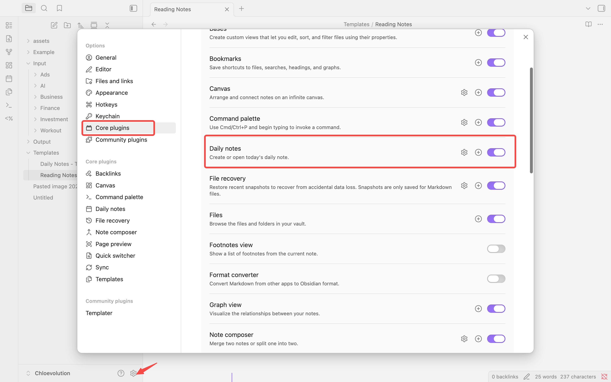
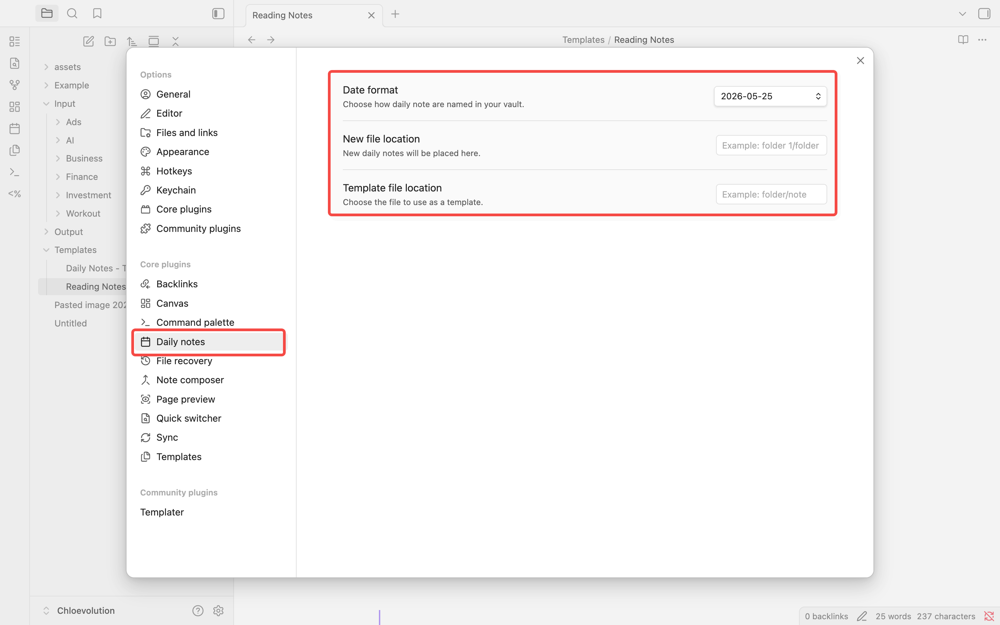
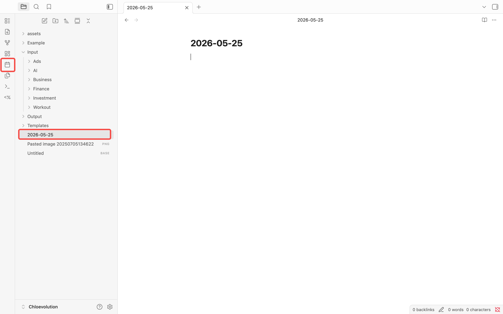
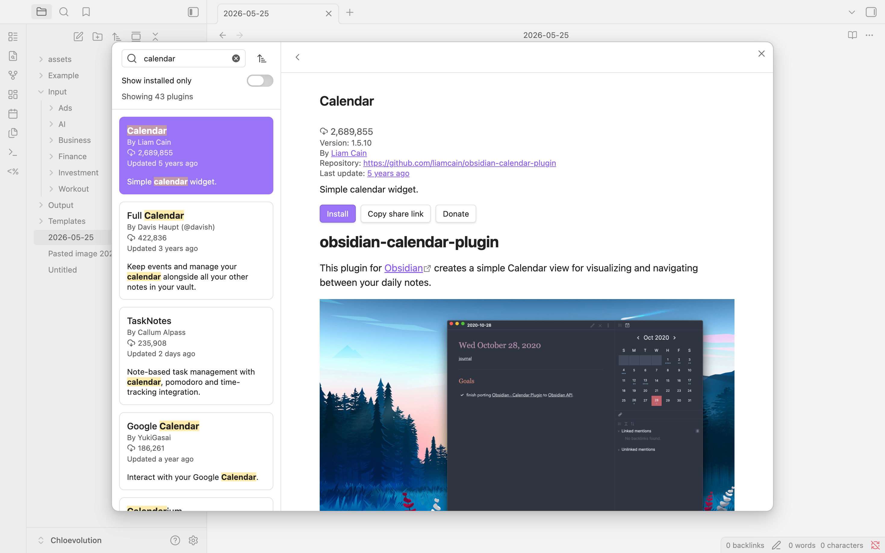

打开一个空白笔记，盯着光标闪烁，却不知道该写什么——这种感觉你熟悉吗？

我刚开始用Obsidian时也是这样。每天想着"应该记点什么"，但真正打开笔记时，又觉得无从下手。有时候是不知道该记什么，有时候是觉得"这点小事不值得专门开个笔记"，结果就是：想法在脑子里转一圈，然后就忘了。

直到我开始用Daily Notes，这个问题才彻底解决。

Daily Notes的核心思路很简单：每天都有一个专属的笔记，自动创建，随时打开。不需要想"这个想法值不值得记"，也不需要纠结"应该放在哪个笔记里"。打开今天的Daily Note，写下来就行。

在这篇指南里，我会分享：
- 如何在5分钟内设置好Daily Notes
- 5个我实际在用的模板（可以直接拿去用）
- 从"不知道写什么"到"每天都想记点东西"的习惯养成方法
- 几个让Daily Notes更好用的插件
- 20个常见问题的解决方案

无论你是刚开始用Obsidian，还是用了一段时间但Daily Notes功能一直没用起来，这篇文章都能帮到你。


## 什么是Daily Notes？

简单来说，Daily Notes就是每天自动创建的一个笔记。

听起来好像没什么特别的，对吧？但这个"自动创建"其实解决了一个很大的问题：**降低了记录的门槛**。

你不需要想"这个想法值不值得开一个新笔记"，也不需要纠结"应该把这条笔记放在哪个文件夹里"。每天早上打开Obsidian，今天的Daily Note已经在那里等着你了。点开，写下来，就这么简单。

**Daily Notes和普通笔记的区别是什么？**

普通笔记通常是围绕一个主题或项目的——比如"项目A的会议记录"、"读书笔记：《原则》"。它们是永久性的，需要你主动创建和组织。

而Daily Notes是以**时间为锚点**的。它不关心主题，只关心"今天发生了什么"。你可以在里面记录任何东西：
- 早上的待办清单
- 下午的会议笔记
- 晚上突然冒出来的想法
- 甚至只是"今天心情不错"

这种"什么都能记"的特性，反而让你更容易开始记录。因为没有压力，没有"这个笔记必须写得完美"的负担。

**为什么Daily Notes这么有用？**

因为它建立了一条**时间线索**。

三个月后，当你想起"那个想法是什么时候冒出来的？"，你可以回到那天的Daily Note，看到当时的上下文——那天你在做什么项目，遇到了什么问题，和谁聊了天。这些信息会帮你重新连接起当时的思路。

更重要的是，Daily Notes让记笔记变成了一个**低摩擦的习惯**。不需要思考太多，打开今天的笔记，写下来，关掉。日复一日，你会发现自己积累了大量有价值的信息——而这些信息，如果没有Daily Notes，可能早就忘在脑后了。


## 快速开始：5分钟设置Daily Notes

好了，理论说够了。现在让我们动手，用5分钟把Daily Notes设置好。

**前置要求**：确保你已经[安装好Obsidian](https://chloevolution.com/zh-cn/posts/how-to-install-obsidian/)并创建了一个vault。如果还没有，先去完成安装，然后再回来继续。

整个过程只需要3个步骤，跟着做就行。

### 步骤1：启用Daily Notes插件

Obsidian的Daily Notes功能其实是一个内置插件，默认是关闭的。我们需要先把它打开。你可以在[Obsidian官方文档](https://help.obsidian.md/Plugins/Daily+notes)中了解更多关于这个插件的信息。

1. 打开Obsidian，点击左下角的**设置图标**（齿轮）
2. 在左侧菜单找到**Core plugins**（核心插件）
3. 往下滚动，找到**Daily notes**
4. 点击右边的开关，把它打开

就这么简单。你会看到开关变成蓝色，说明Daily Notes已经启用了。



### 步骤2：配置Daily Notes设置

启用插件后，我们需要做一些基础配置。

1. 在设置页面的左侧菜单，找到**Daily notes**（在Core plugins下面会出现）
2. 点击进入，你会看到几个设置项

这里有3个最重要的设置：

**Date format（日期格式）**
- 默认是`YYYY-MM-DD`，比如`2026-05-25`
- 我建议保持默认，这个格式最清晰，而且方便排序
- 如果你喜欢其他格式（比如`2026年5月25日`），也可以改

**New file location（文件存储位置）**
- 这是Daily Notes存放的文件夹
- 默认是根目录，但我建议创建一个专门的文件夹，比如`Daily Notes`或`日记`
- 点击文件夹图标，选择或创建一个文件夹

**Template file location（模板文件位置）**
- 这个暂时可以留空，我们后面会讲模板
- 如果你已经有模板文件，可以在这里指定



配置好后，点击设置页面外的任何地方，设置会自动保存。

### 步骤3：创建你的第一个Daily Note

现在，激动人心的时刻到了——创建第一个Daily Note！

有两种方法：

**方法1：点击按钮**
- 看左侧边栏，你会发现多了一个**日历图标**（📅）
- 点击它，今天的Daily Note就会自动创建并打开

**方法2：使用命令**
- 按`Ctrl/Cmd + P`打开命令面板
- 输入`daily`，你会看到`Open today's daily note`
- 回车，搞定

第一次打开，你会看到一个空白的笔记，标题是今天的日期（比如`2026-05-25`）。




现在，试着写下第一句话吧。可以是任何东西：
- "今天开始用Daily Notes了"
- "待办：回复邮件"
- "想法：周末去爬山"

写完后，关闭笔记。明天再打开Obsidian，点击那个日历图标，你会发现Obsidian自动为你创建了明天的Daily Note。就是这么智能。

💡 **小技巧**：想要更快速地访问Daily Notes？可以给它设置一个快捷键。进入设置 → Hotkeys，搜索`Open today's daily note`，设置成`Ctrl/Cmd + D`。以后一个快捷键就能打开今天的笔记。


## 实用工作流：让Daily Notes真正用起来

设置好了，然后呢？

这是很多人卡住的地方。Daily Notes功能开启了，但每天打开还是不知道该写什么，用了几天就放弃了。

我刚开始也是这样。后来慢慢摸索出一套工作流，现在Daily Notes已经成了我每天必开的笔记。

分享给你，希望能帮你也把这个习惯建立起来。

### 早晨例程：用10分钟开启一天

我的习惯是早上第一件事（甚至在查看邮件之前）就打开今天的Daily Note。

这个10分钟的早晨例程帮我理清思路，知道今天要做什么。

**第1步：大脑倾倒（5分钟）**

打开Daily Note，把脑子里所有的想法都写下来。不需要组织，不需要完美，想到什么写什么。

比如：
```
- 昨天的会议提到要改方案，今天得跟进
- 记得回复张三的邮件
- 周末想去爬山
- 那个bug还没修好，有点担心
- 晚上要买菜
```

这个过程很神奇。把想法写出来，脑子就清空了，不会一直在后台运行这些"待办事项"。

**第2步：确定今天的3个优先事项（3分钟）**

从刚才的大脑倾倒中，挑出3件最重要的事。

为什么是3个？因为如果你列了10个优先事项，那就等于没有优先事项。3个刚刚好，既有重点，又不会让人觉得压力太大。

```
## 今日优先
1. 修改项目方案并发给团队
2. 修复那个登录bug
3. 回复张三关于合作的邮件
```

**第3步：快速浏览日程（2分钟）**

如果今天有会议或约会，也记在Daily Note里。这样你对一天的安排就有了全局视角。

```
## 今日日程
- 10:00 团队周会
- 14:00 和客户电话沟通
- 18:00 健身房
```

就这样，10分钟，你已经为今天做好了准备。

### 日间使用：随时捕捉想法

Daily Note最大的价值，就是它永远在那里，随时可以记录。

**快速笔记**

工作中突然冒出一个想法？按`Ctrl/Cmd + D`，打开今天的Daily Note，写下来。

```
## 随手记
- 想法：可以用这个方法优化数据库查询
- 提醒：下周要准备季度总结
- 灵感：周末可以写篇关于XX的文章
```

不需要思考"这个想法应该放在哪个笔记里"，先记下来再说。以后如果这个想法重要，再提取成独立笔记。

**会议笔记**

开会时，我也直接在Daily Note里记。

```
## 14:00 客户沟通会议
- 客户对新功能很满意
- 提出了3个改进建议：
  1. 希望增加导出功能
  2. 界面颜色能否调整
  3. 需要移动端支持
- 下一步：整理需求文档，下周一前发给他们
```

会议结束后，如果内容很重要，我会把这段笔记提取到项目笔记里。但大多数会议，留在Daily Note里就够了。

**使用双链建立连接**

当你提到某个项目或某个人时，用`[[双括号]]`链接起来。

```
今天和 [[张三]] 讨论了 [[项目A]] 的进度，他提到了一个不错的想法。
```

这样做的好处是，以后你打开"项目A"的笔记，能看到所有提到它的Daily Notes。时间线索就这样建立起来了。

### 晚间回顾：5分钟收尾

一天结束前，花5分钟回顾一下今天的Daily Note。

**第1步：勾选完成的任务（1分钟）**

把今天完成的事情打勾。这个动作很有成就感。

```
## 今日优先
- [x] 修改项目方案并发给团队
- [x] 修复那个登录bug
- [ ] 回复张三关于合作的邮件（没来得及）
```

**第2步：处理未完成的任务（2分钟）**

没完成的任务怎么办？

- 如果明天要做，复制到明天的Daily Note
- 如果不紧急，移到项目笔记的待办列表
- 如果不重要了，直接删掉

不要让未完成的任务一直堆在那里，会产生心理负担。

**第3步：写一两句反思（2分钟）**

最后，写一两句今天的感受或收获。不需要长篇大论。

```
## 今日反思
今天效率还不错，早上的优先事项都完成了。那个bug修起来比想象中简单，原来是配置问题。明天记得回复张三。
```

这个习惯看起来不起眼，但坚持一段时间后，你会发现这些反思很有价值。它们记录了你的成长轨迹。

### 如何养成Daily Notes习惯

说实话，刚开始用Daily Notes时，我也断断续续的。后来总结了几个让习惯坚持下来的方法：

**从超级简单开始**

第一周，不要给自己太大压力。每天只写一句话都行。

"今天开始用Daily Notes了。"——这就够了。

等习惯养成了，再慢慢增加内容。

**固定时间触发**

把Daily Notes和某个固定时间绑定。比如：
- 早上喝咖啡时打开Daily Note
- 午饭后花5分钟写写上午的事
- 睡前做晚间回顾

有了固定的时间锚点，习惯更容易坚持。

**允许自己"不完美"**

有些天你会忘记写，有些天只写了一两句，有些天写了一大堆。

都没关系。

Daily Notes不是打卡任务，不需要追求"连续XX天不间断"。重要的是，当你需要记录时，它在那里。

**30天小挑战**

如果你想认真建立这个习惯，可以试试30天挑战：

- 第1-7天：每天至少写一句话
- 第8-14天：尝试早晨例程（3个优先事项）
- 第15-21天：加入晚间回顾
- 第22-30天：完整工作流

30天后，Daily Notes就会成为你的自然习惯。


## 5种Daily Notes模板：找到适合你的风格

前面说的工作流，可能对你来说太复杂了，也可能太简单了。

每个人的需求不一样。有人喜欢极简，有人喜欢详细记录。

这里分享5种不同风格的Daily Notes模板，你可以直接用，也可以根据自己的需求调整。

### 模板1：极简主义者（适合刚开始的人）

如果你刚开始用Daily Notes，或者不喜欢复杂的结构，这个模板最适合你。

```markdown
# {{date}}

## 今天要做的3件事
-
-
-

## 随手记

```

就这么简单。3件事 + 一个随手记区域。够用了。

### 模板2：职场人士（适合上班族）

如果你的工作涉及很多会议、任务和项目，这个模板能帮你理清头绪。

```markdown
# {{date}}

## 🎯 今日优先
- [ ]
- [ ]
- [ ]

## 📅 日程安排
-

## 💼 会议笔记

### [会议名称] - [时间]
-

## 💡 想法 & 灵感

## 📝 今日总结
- 完成了什么：
- 遇到的问题：
- 明天要做：
```

这个模板的好处是，所有工作相关的内容都在一个地方，不会遗漏。

### 模板3：学生党（适合学习和考试）

如果你是学生，或者正在学习新技能，这个模板能帮你追踪学习进度。

```markdown
# {{date}}

## 📚 今日学习目标
- [ ]
- [ ]

## 📖 学习笔记

### [科目/主题]
-

## ❓ 疑问 & 待解决
-

## ✅ 今日收获
-

## 📌 复习提醒
-
```

这个模板的重点是"疑问"和"收获"两个部分。把不懂的记下来，把学会的也记下来，学习效果会更好。

### 模板4：项目管理者（适合多项目并行）

如果你同时在做多个项目，需要清楚地追踪每个项目的进度，试试这个。

```markdown
# {{date}}

## 项目进度

### [[项目A]]
- 今日进展：
- 待办事项：
- 阻碍问题：

### [[项目B]]
- 今日进展：
- 待办事项：
- 阻碍问题：

## 🔥 紧急事项
-

## 📞 沟通记录
-

## 💭 反思
```

用双链`[[项目名]]`链接到项目笔记，这样在项目笔记里就能看到所有相关的Daily Notes。

### 模板5：生活日记型（适合全方位记录）

如果你不只想记录工作，还想记录生活、情绪、健康，这个全面的模板适合你。

```markdown
# {{date}}

## 🌅 早晨
- 起床时间：
- 早餐：
- 心情：

## 💼 工作 & 学习
-

## 🏃 健康 & 运动
-

## 🎨 兴趣 & 爱好
-

## 👥 社交 & 关系
-

## 🌙 晚间反思
- 今天最开心的事：
- 今天学到的：
- 明天想做的：
```

这个模板比较详细，适合想要全面记录生活的人。

### 如何使用模板？

在前面的"快速开始"部分，我们提到了模板文件的设置。现在你可以：

1. 选择上面任意一个模板（或者混合几个模板的元素）
2. 在你的vault里创建一个模板文件，比如`Templates/Daily Note Template.md`
3. 把模板内容复制进去
4. 在Daily Notes设置里，把"Template file location"指向这个文件
5. 以后每次创建Daily Note，都会自动套用这个模板

💡 **小技巧**：`{{date}}`是Obsidian的变量，会自动替换成当天日期。如果你想要不同的日期格式，可以用`{{date:YYYY-MM-DD}}`这样的格式。

记住，模板不是死的。用一段时间后，你会发现哪些部分有用，哪些部分用不上。随时调整，找到最适合自己的版本。


## 必备插件推荐：让Daily Notes更强大

Obsidian的Daily Notes功能本身已经很好用了，但如果你想要更强大的功能，可以试试这几个插件。

### Calendar插件：可视化你的Daily Notes

**必要性：⭐⭐⭐⭐⭐**

这是我认为最必备的插件。装了它，你会在右侧边栏看到一个日历，点击任意日期就能打开对应的Daily Note。

**为什么需要它？**
- 可视化查看哪些天写了笔记（有笔记的日期会有标记）
- 快速跳转到过去或未来的Daily Note
- 一眼看出自己的记录习惯

**如何安装？**
1. 打开设置 → Community plugins
2. 点击"Browse"，搜索"Calendar"
3. 安装并启用

装完后，右侧边栏会出现一个日历。试着点击不同的日期，你会发现导航变得超级方便。



### Templater插件：让模板更智能

**必要性：⭐⭐⭐⭐**

如果你想要更高级的模板功能，Templater是必装的。

Obsidian自带的模板功能比较基础，只能插入固定的文本。而Templater可以：
- 自动插入昨天/明天的日期链接
- 根据星期几显示不同内容
- 自动计算日期（比如"7天后是几号"）

**实用示例：**

在模板里加入这段代码，就能自动生成"昨天-今天-明天"的导航链接：

```
[[<% tp.date.now("YYYY-MM-DD", -1) %>|← 昨天]] | [[<% tp.date.now("YYYY-MM-DD", 1) %>|明天 →]]
```

每次创建Daily Note，这些链接会自动生成，方便你在不同日期之间跳转。

### Periodic Notes插件：周笔记、月笔记

**必要性：⭐⭐⭐**

如果你想要更系统的时间管理，Periodic Notes可以帮你创建周笔记、月笔记，甚至年笔记。

**为什么需要它？**
- 每周回顾：总结这周做了什么
- 每月规划：设定下个月的目标
- 多层次时间管理：日-周-月-年，形成完整体系

**如何使用？**

安装后，你可以设置：
- 周笔记模板（比如"本周完成的3件大事"）
- 月笔记模板（比如"本月目标达成情况"）

然后在Daily Note里链接到本周/本月笔记，形成层级结构。

### 可选插件：进阶用户的选择

如果你已经熟练使用Daily Notes，可以考虑这些进阶插件：

**Tasks插件**
- 功能：强大的任务管理
- 适合：需要跨笔记追踪任务的人
- 难度：⭐⭐⭐

**Dataview插件**
- 功能：查询和汇总所有Daily Notes的数据
- 适合：想要统计分析的人（比如"这个月完成了多少任务"）
- 难度：⭐⭐⭐⭐

**Day Planner插件**
- 功能：时间块规划，把Daily Note变成日程表
- 适合：需要精确时间管理的人
- 难度：⭐⭐⭐

### 我的建议

不要一次装太多插件。

从Calendar开始，用一段时间，习惯了再考虑Templater。等你真的觉得"我需要周笔记"的时候，再装Periodic Notes。

插件装多了，反而会增加复杂度，让你觉得Daily Notes"太麻烦了"。

记住：工具是为了让生活更简单，不是更复杂。

## 进阶技巧：把Daily Notes用到极致

如果你已经熟练使用Daily Notes，这里有几个进阶技巧，能让你的笔记系统更强大。

### 技巧1：用标签分类内容

在Daily Note里，用标签标记不同类型的内容。

```markdown
## 随手记
- #想法 可以用这个方法优化数据库查询
- #提醒 下周要准备季度总结
- #灵感 周末可以写篇关于XX的文章
```

这样做的好处是，以后你可以搜索`#想法`，找到所有标记为"想法"的内容，不管它们分散在哪天的Daily Note里。

### 技巧2：建立MOC（Map of Content）

如果你的Daily Notes积累了几个月，内容会很多。这时候可以创建一个"Daily Notes索引"笔记，把重要的Daily Notes链接起来。

```markdown
# Daily Notes 索引

## 重要决策
- [[2026-03-15]] - 决定换工作
- [[2026-04-20]] - 确定新项目方向

## 重要想法
- [[2026-02-10]] - 关于产品改进的想法
- [[2026-05-01]] - 新的写作主题

## 里程碑
- [[2026-01-01]] - 新年目标设定
- [[2026-06-15]] - 项目上线
```

这个索引就像一本目录，帮你快速找到重要的Daily Notes。

### 技巧3：用Dataview自动汇总

如果你装了Dataview插件，可以在项目笔记里自动显示所有提到这个项目的Daily Notes。

在项目笔记里加入这段代码：

```dataview
LIST
FROM "Daily Notes"
WHERE contains(file.content, "[[项目A]]")
SORT file.name DESC
LIMIT 10
```

这样你就能看到最近10条提到"项目A"的Daily Notes，自动追踪项目进展。

### 技巧4：创建"每周回顾"流程

每周日晚上，花15分钟回顾这周的Daily Notes：

1. 打开这周的7个Daily Notes
2. 把重要内容提取到周笔记
3. 把未完成的任务整理到下周
4. 写一段周总结

这个习惯能让你对时间的流逝更有感知，也能发现自己的成长轨迹。

### 技巧5：与其他笔记系统整合

Daily Notes不是孤立的，它应该和你的整个笔记系统连接起来。

**项目笔记 ← Daily Notes**
在Daily Note里提到项目时，用`[[项目名]]`链接。这样在项目笔记里能看到所有相关的Daily Notes。

**人物笔记 ← Daily Notes**
提到某个人时，也用双链。比如`今天和[[张三]]讨论了合作方案`。以后打开"张三"的笔记，能看到所有和他相关的互动记录。

**知识笔记 ← Daily Notes**
学到新知识时，先记在Daily Note里，等积累到一定程度，再提取成独立的知识笔记。

这样，Daily Notes就成了你整个知识系统的"入口"，所有想法都先记在这里，然后慢慢整理到合适的地方。

## 常见问题FAQ

使用Daily Notes时，你可能会遇到这些问题。

### Q1: Daily Notes会不会越积越多，很难管理？

不会。Daily Notes的优势就是"按时间自动组织"。

你不需要主动管理它们。想找某天的笔记，直接用Calendar插件点击日期就行。想搜索内容，用Obsidian的全局搜索。

如果真的担心文件太多，可以按年份或月份创建子文件夹：
```
Daily Notes/
  2026/
    01/
    02/
  2025/
```

在Daily Notes设置里，把"New file location"设置成`Daily Notes/{{date:YYYY}}/{{date:MM}}`，就能自动按年月分类。

### Q2: 我有时候会忘记写，怎么办？

完全正常。我也经常忘。

Daily Notes不是打卡任务，不需要强迫自己每天都写。重要的是，当你需要记录时，它在那里。

如果你想养成习惯，试试这个方法：不要追求"每天都写"，而是追求"每周写3次"。压力小很多，更容易坚持。

### Q3: Daily Notes和日记有什么区别？

Daily Notes更像是"工作日志"，日记更像是"情感记录"。

Daily Notes的重点是：
- 记录事实（今天做了什么）
- 捕捉想法（突然想到的点子）
- 追踪任务（待办事项）

日记的重点是：
- 情感表达（今天的感受）
- 自我反思（为什么会这样）
- 生活记录（有意义的时刻）

当然，你也可以把两者结合起来。在Daily Note里既记录工作，也记录生活和情感。没有固定规则，适合自己就好。

### Q4: 我应该在Daily Notes里写多少内容？

没有标准答案。

有些天你可能只写一句话，有些天可能写几千字。都可以。

我的建议是：不要给自己压力。Daily Notes的目的是让记录变简单，不是变成负担。

如果某天真的没什么可写的，那就不写。或者就写一句"今天没什么特别的"。这也是一种记录。

### Q5: Daily Notes里的内容需要整理吗？

看情况。

大部分内容不需要整理，留在Daily Notes里就好。它们的价值就是"记录当时的状态"。

但如果某些内容很重要，值得长期保存，那就提取出来：
- 重要想法 → 提取到专门的想法笔记
- 项目进展 → 提取到项目笔记
- 学习内容 → 提取到知识笔记

我的习惯是每周回顾时做一次提取。平时不管，让Daily Notes自由生长。

### Q6: 可以在Daily Notes里放图片吗？

当然可以。

直接把图片拖进Daily Note，或者用`![[图片名.png]]`插入。想了解更多关于在Obsidian中管理图片的技巧，可以查看的[图片管理完整指南](https://chloevolution.com/zh-cn/posts/managing-images-in-obsidian/)。

有些人会在Daily Note里记录：
- 今天的工作截图
- 灵感的手绘草图
- 有意思的网页截图

图片也是记录的一部分。

### Q7: 手机上怎么用Daily Notes？

Obsidian有手机App（iOS和Android都有）。

装好后，同步你的vault（可以用iCloud、Dropbox或Obsidian Sync），就能在手机上打开Daily Notes了。

手机上的使用场景：
- 通勤路上记录想法
- 开会时快速记笔记
- 睡前写晚间反思

虽然手机打字没有电脑快，但记录总比不记录好。

### Q8: Daily Notes会不会和其他笔记混乱？

不会，只要你把Daily Notes放在专门的文件夹里。

我的建议是：
```
vault/
  Daily Notes/        ← 所有Daily Notes
  Projects/           ← 项目笔记
  Knowledge/          ← 知识笔记
  People/             ← 人物笔记
  Templates/          ← 模板
```

这样分类清晰，不会混乱。

---

Daily Notes是Obsidian里最简单、也最实用的功能。

它不需要复杂的设置，不需要学习高深的技巧。你只需要：
1. 打开Obsidian
2. 点击日历图标
3. 开始写

就这么简单。

很多人觉得"笔记"是一件很正式的事情，要有完整的结构，要写得很漂亮。但Daily Notes告诉我们：笔记可以很随意。

今天的想法、今天的任务、今天的心情，都可以记下来。不需要完美，不需要整理，只需要记录。

三个月后，当你回头看这些Daily Notes，你会发现：
- 原来我那时候在想这个问题
- 原来这个项目是这样开始的
- 原来我已经成长了这么多

这就是Daily Notes的价值。它不是让你变得更有条理，而是让你看见自己的轨迹。

所以，从今天开始吧。

打开Obsidian，创建今天的Daily Note，写下第一句话。可以是今天的计划，可以是刚才的想法，也可以只是一句"今天开始用Daily Notes了"。

不要想太多，先开始。习惯会慢慢养成，系统会慢慢完善。

你的故事，从今天的这一页开始。

