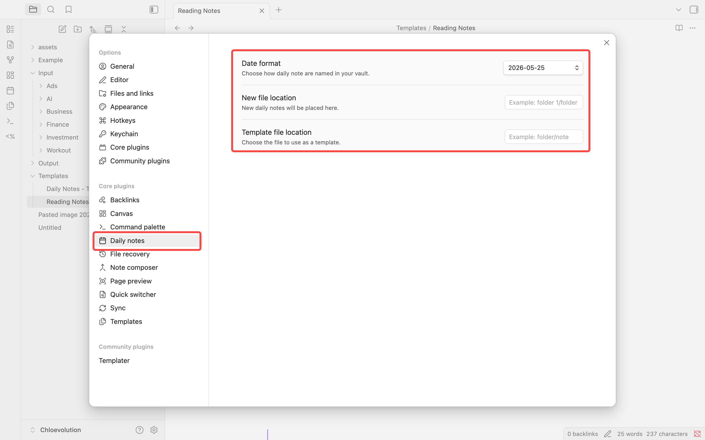
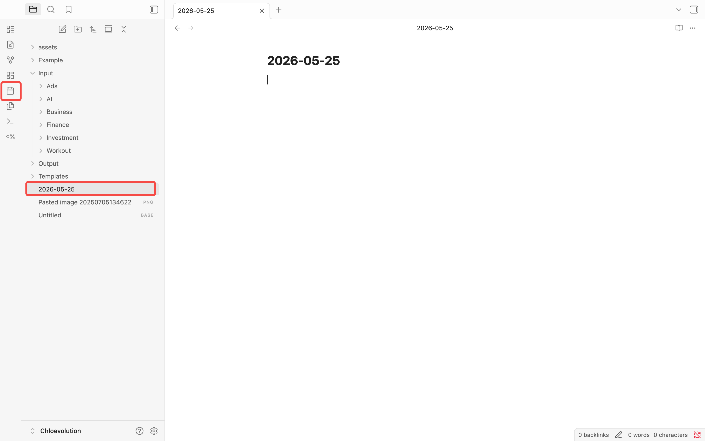
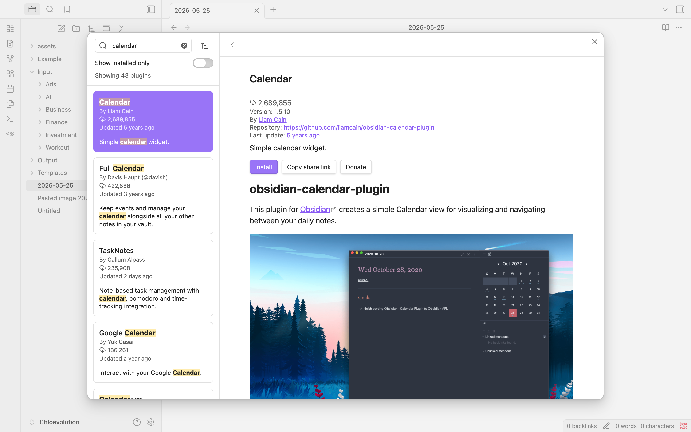

打开一个空白笔记，盯着光标闪烁，却不知道该写什么——这种感觉你熟悉吗？

我刚开始用Obsidian时也是这样。每天想着“应该记点什么”，但真正打开笔记时，又觉得无从下手。有时候是不知道该记什么，有时候是觉得“这点小事不值得专门开个笔记”，结果就是：想法在脑子里转一圈，然后就忘了。

直到我开始用Daily Notes，这个问题才彻底解决。

Daily Notes的核心思路很简单：每天都有一个专属的笔记，自动创建，随时打开。不需要想“这个想法值不值得记”，也不需要纠结"应该放在哪个笔记里"。打开今天的Daily Note，写下来就行。

在这篇指南里，我会分享：
- 如何在5分钟内设置好Daily Notes
- 5个我实际在用的模板（可以直接拿去用）
- 从“不知道写什么”到“每天都想记点东西”的习惯养成方法
- 几个让Daily Notes更好用的插件
- 20个常见问题的解决方案

无论你是刚开始用Obsidian，还是用了一段时间但Daily Notes功能一直没用起来，这篇文章都能帮到你。


## 什么是Daily Notes？

简单来说，Daily Notes就是每天自动创建的一个笔记。

听起来好像没什么特别的，对吧？但这个“自动创建”其实解决了一个很大的问题：**降低了记录的门槛**。

你不需要想“这个想法值不值得开一个新笔记”，也不需要纠结“应该把这条笔记放在哪个文件夹里”。每天早上打开Obsidian，今天的Daily Note已经在那里等着你了。点开，写下来，就这么简单。

**Daily Notes和普通笔记的区别是什么？**

普通笔记通常是围绕一个主题或项目的——比如“项目A的会议记录”、“读书笔记：《原则》”。它们是永久性的，需要你主动创建和组织。

而Daily Notes是以**时间为锚点**的。它不关心主题，只关心“今天发生了什么”。你可以在里面记录任何东西：
- 早上的待办清单
- 下午的会议笔记
- 晚上突然冒出来的想法
- 甚至只是“今天心情不错”

这种“什么都能记”的特性，反而让你更容易开始记录。因为没有压力，没有“这个笔记必须写得完美”的负担。

**为什么Daily Notes这么有用？**

因为它建立了一条**时间线索**。

三个月后，当你想起“那个想法是什么时候冒出来的？”，你可以回到那天的Daily Note，看到当时的上下文——那天你在做什么项目，遇到了什么问题，和谁聊了天。这些信息会帮你重新连接起当时的思路。

更重要的是，Daily Notes让记笔记变成了一个**低摩擦的习惯**。不需要思考太多，打开今天的笔记，写下来，关掉。日复一日，你会发现自己积累了大量有价值的信息——而这些信息，如果没有Daily Notes，可能早就忘在脑后了。


## 快速开始：5分钟设置Daily Notes

好了，理论说够了。现在让我们动手，用5分钟把Daily Notes设置好。

**前置要求**：确保你已经[安装好Obsidian](https://chloevolution.com/zh-cn/posts/how-to-install-obsidian/)并创建了一个vault。如果还没有，先去完成安装，然后再回来继续。

整个过程只需要3个步骤，跟着做就行。

### 步骤1：启用Daily Notes插件

Obsidian的Daily Notes功能其实是一个内置插件，默认是关闭的。我们需要先把它打开。你可以在[Obsidian官方文档](https://help.obsidian.md/Plugins/Daily+notes)中了解更多关于这个插件的信息。

1. 打开Obsidian，点击左下角的**设置图标**（齿轮）
2. 在左侧菜单找到**Core plugins**（核心插件）
3. 往下滚动，找到**Daily notes**
4. 点击右边的开关，把它打开

就这么简单。你会看到开关变成蓝色，说明Daily Notes已经启用了。


### 步骤2：配置Daily Notes设置

启用插件后，我们需要做一些基础配置。

1. 在设置页面的左侧菜单，找到**Daily notes**（在Core plugins下面会出现）
2. 点击进入，你会看到几个设置项

这里有3个最重要的设置：

**Date format（日期格式）**
- 默认是`YYYY-MM-DD`，比如`2026-05-25`
- 我建议保持默认，这个格式最清晰，而且方便排序
- 如果你喜欢其他格式（比如`2026年5月25日`），也可以改

**New file location（文件存储位置）**
- 这是Daily Notes存放的文件夹
- 默认是根目录，但我建议创建一个专门的文件夹，比如`Daily Notes`或`日记`
- 点击文件夹图标，选择或创建一个文件夹

**Template file location（模板文件位置）**
- 这个暂时可以留空，我们后面会讲模板
- 如果你已经有模板文件，可以在这里指定



配置好后，点击设置页面外的任何地方，设置会自动保存。

### 步骤3：创建你的第一个Daily Note

有两种方法：

**方法1：点击按钮**
- 看左侧边栏，你会发现多了一个**日历图标**（📅）
- 点击它，今天的Daily Note就会自动创建并打开

**方法2：使用命令**
- 按`Ctrl/Cmd + P`打开命令面板
- 输入`daily`，你会看到`Open today's daily note`
- 回车，搞定

第一次打开，你会看到一个空白的笔记，标题是今天的日期（比如`2026-05-25`）。




现在，试着写下第一句话吧。可以是任何东西：
- "今天开始用Daily Notes了"
- "待办：回复邮件"
- "想法：周末去爬山"

写完后，关闭笔记。明天再打开Obsidian，点击那个日历图标，你会发现Obsidian自动为你创建了明天的Daily Note。就是这么智能。

💡 **小技巧**：想要更快速地访问Daily Notes？可以给它设置一个快捷键。进入设置 → Hotkeys，搜索`Open today's daily note`，设置成`Ctrl/Cmd + D`。以后一个快捷键就能打开今天的笔记。

### 进阶设置：启动时自动打开Daily Note

如果你每天打开Obsidian的第一件事就是查看Daily Note，那么可以设置成启动时自动打开。这样省去了每次手动点击的步骤，打开Obsidian就能直接开始记录。

**为什么需要这个功能？**

早上打开电脑，启动Obsidian，然后还要点击日历图标或者按快捷键才能打开今天的笔记。虽然只是多了一步，但时间久了，这个小摩擦可能会让你懒得打开Daily Note。

而如果Obsidian一启动，今天的Daily Note就已经在那里等着你了，记录的门槛就更低了。

**方法1：使用Workspace功能（推荐）**

Obsidian的Workspace（工作区）功能可以保存你的窗口布局和打开的笔记。这是最简单的方法。

1. 先打开今天的Daily Note
2. 如果你还想同时显示其他面板（比如Calendar插件），也一起打开
3. 按`Ctrl/Cmd + P`打开命令面板
4. 输入`Manage workspace layouts`，回车
5. 点击`Save current layout`（保存当前布局）
6. 给它起个名字，比如"Daily Note Workspace"
7. 再次打开命令面板，输入`Manage workspace layouts`
8. 在列表中找到你刚才保存的工作区，点击右边的三个点
9. 选择`Load on startup`（启动时加载）

完成！下次打开Obsidian，就会自动加载这个工作区，今天的Daily Note会自动打开。

**方法2：使用Commander插件（更灵活）**

如果你想要更多控制，可以用Commander插件。这个插件可以让你自定义Obsidian启动时执行的命令。

1. 安装Commander插件（设置 → Community plugins → Browse → 搜索“Commander”）
2. 启用插件后，进入Commander设置
3. 找到"Startup commands"（启动命令）部分
4. 点击"Add command"
5. 搜索并添加`Open today's daily note`
6. 保存设置

这样每次启动Obsidian，都会自动执行“打开今天的Daily Note”这个命令。

**方法3：结合Templater实现更智能的启动**

如果你装了Templater插件，可以做得更高级。比如：
- 启动时不仅打开Daily Note，还自动插入模板
- 根据时间不同，自动打开不同的笔记（早上打开Daily Note，晚上打开回顾笔记）

这个需要一些代码知识，如果你对Templater熟悉，可以在启动时运行自定义脚本。

**注意事项**

1. **不要设置得太复杂**：启动时自动打开一个笔记就够了。如果设置太多自动操作，Obsidian启动会变慢。

2. **考虑你的使用场景**：如果你用Obsidian不只是写Daily Note，还会频繁查看项目笔记或知识笔记，那么每次启动都打开Daily Note可能反而不方便。这个功能适合把Daily Note作为"工作中心"的人。

3. **移动端的区别**：移动端的Obsidian启动行为和桌面端不完全一样。如果你主要在手机上用，可能需要手动打开Daily Note，或者使用特定的移动端插件。

**替代方案：使用主页插件**

还有一个思路是安装Homepage插件，把Daily Note设置为Obsidian的"主页"。这样每次打开Obsidian或者点击"回到主页"按钮，都会跳转到今天的Daily Note。

这个方法的好处是更灵活——不是强制每次启动都打开Daily Note，而是给了你一个快速回到Daily Note的方式。

**我的建议**

刚开始用Daily Notes时，不用急着设置自动启动。先用一段时间，确认Daily Note真的是你每天必开的笔记，再来设置这个功能。

对大多数人来说，**方法1（Workspace功能）**最简单实用。设置一次，以后就不用管了。


## 实用工作流：让Daily Notes真正用起来

设置好了，然后呢？

这是很多人卡住的地方。Daily Notes功能开启了，但每天打开还是不知道该写什么，用了几天就放弃了。

我刚开始也是这样。后来慢慢摸索出一套工作流，现在Daily Notes已经成了我每天必开的笔记。

分享给你，希望能帮你也把这个习惯建立起来。

### 早晨例程：用10分钟开启一天

我的习惯是早上第一件事（甚至在查看邮件之前）就打开今天的Daily Note。

这个10分钟的早晨例程帮我理清思路，知道今天要做什么。

**第1步：大脑倾倒（5分钟）**

打开Daily Note，把脑子里所有的想法都写下来。不需要组织，不需要完美，想到什么写什么。

比如：
```
- 昨天的会议提到要改方案，今天得跟进
- 记得回复张三的邮件
- 周末想去爬山
- 那个bug还没修好，有点担心
- 晚上要买菜
```

这个过程很神奇。把想法写出来，脑子就清空了，不会一直在后台运行这些"待办事项"。

**第2步：确定今天的3个优先事项（3分钟）**

从刚才的大脑倾倒中，挑出3件最重要的事。

为什么是3个？因为如果你列了10个优先事项，那就等于没有优先事项。3个刚刚好，既有重点，又不会让人觉得压力太大。

```
## 今日优先
1. 修改项目方案并发给团队
2. 修复那个登录bug
3. 回复张三关于合作的邮件
```

**第3步：快速浏览日程（2分钟）**

如果今天有会议或约会，也记在Daily Note里。这样你对一天的安排就有了全局视角。

```
## 今日日程
- 10:00 团队周会
- 14:00 和客户电话沟通
- 18:00 健身房
```

就这样，10分钟，你已经为今天做好了准备。

### 日间使用：随时捕捉想法

Daily Note最大的价值，就是它永远在那里，随时可以记录。

**快速笔记**

工作中突然冒出一个想法？按`Ctrl/Cmd + D`，打开今天的Daily Note，写下来。

```
## 随手记
- 想法：可以用这个方法优化数据库查询
- 提醒：下周要准备季度总结
- 灵感：周末可以写篇关于XX的文章
```

不需要思考"这个想法应该放在哪个笔记里"，先记下来再说。以后如果这个想法重要，再提取成独立笔记。

**会议笔记**

开会时，我也直接在Daily Note里记。

```
## 14:00 客户沟通会议
- 客户对新功能很满意
- 提出了3个改进建议：
  1. 希望增加导出功能
  2. 界面颜色能否调整
  3. 需要移动端支持
- 下一步：整理需求文档，下周一前发给他们
```

会议结束后，如果内容很重要，我会把这段笔记提取到项目笔记里。但大多数会议，留在Daily Note里就够了。

**使用双链建立连接**

当你提到某个项目或某个人时，用`[[双括号]]`链接起来。

```
今天和 [[张三]] 讨论了 [[项目A]] 的进度，他提到了一个不错的想法。
```

这样做的好处是，以后你打开"项目A"的笔记，能看到所有提到它的Daily Notes。时间线索就这样建立起来了。

### 晚间回顾：5分钟收尾

一天结束前，花5分钟回顾一下今天的Daily Note。

**第1步：勾选完成的任务（1分钟）**

把今天完成的事情打勾。这个动作很有成就感。

```
## 今日优先
- [x] 修改项目方案并发给团队
- [x] 修复那个登录bug
- [ ] 回复张三关于合作的邮件（没来得及）
```

**第2步：处理未完成的任务（2分钟）**

没完成的任务怎么办？

- 如果明天要做，复制到明天的Daily Note
- 如果不紧急，移到项目笔记的待办列表
- 如果不重要了，直接删掉

不要让未完成的任务一直堆在那里，会产生心理负担。

**第3步：写一两句反思（2分钟）**

最后，写一两句今天的感受或收获。不需要长篇大论。

```
## 今日反思
今天效率还不错，早上的优先事项都完成了。那个bug修起来比想象中简单，原来是配置问题。明天记得回复张三。
```

这个习惯看起来不起眼，但坚持一段时间后，你会发现这些反思很有价值。它们记录了你的成长轨迹。

### 如何养成Daily Notes习惯

说实话，刚开始用Daily Notes时，我也断断续续的。后来总结了几个让习惯坚持下来的方法：

**从超级简单开始**

第一周，不要给自己太大压力。每天只写一句话都行。

"今天开始用Daily Notes了。"——这就够了。

等习惯养成了，再慢慢增加内容。

**固定时间触发**

把Daily Notes和某个固定时间绑定。比如：
- 早上喝咖啡时打开Daily Note
- 午饭后花5分钟写写上午的事
- 睡前做晚间回顾

有了固定的时间锚点，习惯更容易坚持。

**允许自己"不完美"**

有些天你会忘记写，有些天只写了一两句，有些天写了一大堆。

都没关系。

Daily Notes不是打卡任务，不需要追求"连续XX天不间断"。重要的是，当你需要记录时，它在那里。

**30天小挑战**

如果你想认真建立这个习惯，可以试试30天挑战：

- 第1-7天：每天至少写一句话
- 第8-14天：尝试早晨例程（3个优先事项）
- 第15-21天：加入晚间回顾
- 第22-30天：完整工作流

30天后，Daily Notes就会成为你的自然习惯。


## 5种Daily Notes模板：找到适合你的风格

前面说的工作流，可能对你来说太复杂了，也可能太简单了。

每个人的需求不一样。有人喜欢极简，有人喜欢详细记录。

这里分享5种不同风格的Daily Notes模板，你可以直接用，也可以根据自己的需求调整。

### 模板1：极简主义者（适合刚开始的人）

如果你刚开始用Daily Notes，或者不喜欢复杂的结构，这个模板最适合你。

```markdown
# {{date}}

## 今天要做的3件事
-
-
-

## 随手记

```

就这么简单。3件事 + 一个随手记区域。够用了。

### 模板2：职场人士（适合上班族）

如果你的工作涉及很多会议、任务和项目，这个模板能帮你理清头绪。

```markdown
# {{date}}

## 🎯 今日优先
- [ ]
- [ ]
- [ ]

## 📅 日程安排
-

## 💼 会议笔记

### [会议名称] - [时间]
-

## 💡 想法 & 灵感

## 📝 今日总结
- 完成了什么：
- 遇到的问题：
- 明天要做：
```

这个模板的好处是，所有工作相关的内容都在一个地方，不会遗漏。

### 模板3：学生党（适合学习和考试）

如果你是学生，或者正在学习新技能，这个模板能帮你追踪学习进度。

```markdown
# {{date}}

## 📚 今日学习目标
- [ ]
- [ ]

## 📖 学习笔记

### [科目/主题]
-

## ❓ 疑问 & 待解决
-

## ✅ 今日收获
-

## 📌 复习提醒
-
```

这个模板的重点是"疑问"和"收获"两个部分。把不懂的记下来，把学会的也记下来，学习效果会更好。

### 模板4：项目管理者（适合多项目并行）

如果你同时在做多个项目，需要清楚地追踪每个项目的进度，试试这个。

```markdown
# {{date}}

## 项目进度

### [[项目A]]
- 今日进展：
- 待办事项：
- 阻碍问题：

### [[项目B]]
- 今日进展：
- 待办事项：
- 阻碍问题：

## 🔥 紧急事项
-

## 📞 沟通记录
-

## 💭 反思
```

用双链`[[项目名]]`链接到项目笔记，这样在项目笔记里就能看到所有相关的Daily Notes。

### 模板5：生活日记型（适合全方位记录）

如果你不只想记录工作，还想记录生活、情绪、健康，这个全面的模板适合你。

```markdown
# {{date}}

## 🌅 早晨
- 起床时间：
- 早餐：
- 心情：

## 💼 工作 & 学习
-

## 🏃 健康 & 运动
-

## 🎨 兴趣 & 爱好
-

## 👥 社交 & 关系
-

## 🌙 晚间反思
- 今天最开心的事：
- 今天学到的：
- 明天想做的：
```

这个模板比较详细，适合想要全面记录生活的人。

### 如何使用模板？

在前面的"快速开始"部分，我们提到了模板文件的设置。现在你可以：

如果你还没有配置模板文件夹，或者想比较核心Templates与Templater的区别，可以先查看[Obsidian模板设置与实用模板指南](https://chloevolution.com/zh-cn/posts/obsidian-templates/)。

1. 选择上面任意一个模板（或者混合几个模板的元素）
2. 在你的vault里创建一个模板文件，比如`Templates/Daily Note Template.md`
3. 把模板内容复制进去
4. 在Daily Notes设置里，把"Template file location"指向这个文件
5. 以后每次创建Daily Note，都会自动套用这个模板

💡 **小技巧**：`{{date}}`是Obsidian的变量，会自动替换成当天日期。如果你想要不同的日期格式，可以用`{{date:YYYY-MM-DD}}`这样的格式。

记住，模板不是死的。用一段时间后，你会发现哪些部分有用，哪些部分用不上。随时调整，找到最适合自己的版本。


## 必备插件推荐：让Daily Notes更强大

Obsidian的Daily Notes功能本身已经很好用了，但如果你想要更强大的功能，可以试试这几个插件。

下面只介绍与每日笔记直接相关的扩展；如果你还需要任务管理、绘图、搜索或表格插件，可以参考[完整的Obsidian插件推荐与管理指南](https://chloevolution.com/zh-cn/posts/obsidian-plugins/)。

### Calendar插件：可视化你的Daily Notes

**必要性：⭐⭐⭐⭐⭐**

这是我认为最必备的插件。装了它，你会在右侧边栏看到一个日历，点击任意日期就能打开对应的Daily Note。

**为什么需要它？**
- 可视化查看哪些天写了笔记（有笔记的日期会有标记）
- 快速跳转到过去或未来的Daily Note
- 一眼看出自己的记录习惯

**如何安装？**
1. 打开设置 → Community plugins
2. 点击"Browse"，搜索"Calendar"
3. 安装并启用

装完后，右侧边栏会出现一个日历。试着点击不同的日期，你会发现导航变得超级方便。



### Templater插件：让模板更智能

**必要性：⭐⭐⭐⭐**

如果你想要更高级的模板功能，Templater是必装的。

Obsidian自带的模板功能比较基础，只能插入固定的文本。而Templater可以：
- 自动插入昨天/明天的日期链接
- 根据星期几显示不同内容
- 自动计算日期（比如"7天后是几号"）

**实用示例：**

在模板里加入这段代码，就能自动生成"昨天-今天-明天"的导航链接：

```
[[<% tp.date.now("YYYY-MM-DD", -1) %>|← 昨天]] | [[<% tp.date.now("YYYY-MM-DD", 1) %>|明天 →]]
```

每次创建Daily Note，这些链接会自动生成，方便你在不同日期之间跳转。

### Periodic Notes插件：周笔记、月笔记

**必要性：⭐⭐⭐**

如果你想要更系统的时间管理，Periodic Notes可以帮你创建周笔记、月笔记，甚至年笔记。

**为什么需要它？**
- 每周回顾：总结这周做了什么
- 每月规划：设定下个月的目标
- 多层次时间管理：日-周-月-年，形成完整体系

**如何使用？**

安装后，你可以设置：
- 周笔记模板（比如"本周完成的3件大事"）
- 月笔记模板（比如"本月目标达成情况"）

然后在Daily Note里链接到本周/本月笔记，形成层级结构。

### Natural Language Dates插件：自然语言创建笔记

**必要性：⭐⭐⭐**

这个插件让你可以用自然语言快速创建未来或过去的Daily Notes。

**为什么需要它？**
- 想提前写明天的待办清单
- 需要规划下周某天的安排
- 想回顾上周某天发生了什么

安装后，你可以输入"明天"、"下周一"、"3天后"这样的自然语言，插件会自动转换成对应的日期。

**如何使用？**
1. 安装Natural Language Dates插件
2. 按`Ctrl/Cmd + P`打开命令面板
3. 输入`Natural Language Dates: Date`
4. 输入"明天"或"next Monday"
5. 插件会自动创建对应日期的Daily Note

### 可选插件：进阶用户的选择

如果你已经熟练使用Daily Notes，可以考虑这些进阶插件：

**Tasks插件**
- 功能：强大的任务管理
- 适合：需要跨笔记追踪任务的人
- 难度：⭐⭐⭐

**Dataview插件**
- 功能：查询和汇总所有Daily Notes的数据
- 适合：想要统计分析的人（比如"这个月完成了多少任务"）
- 难度：⭐⭐⭐⭐

如果每篇Daily Note都包含日期、心情、精力或运动等统一Properties，也可以使用[Obsidian Bases](https://chloevolution.com/zh-cn/posts/obsidian-bases/)创建无需编写查询代码的每日笔记索引和统计视图。

**Day Planner插件**
- 功能：时间块规划，把Daily Note变成日程表
- 适合：需要精确时间管理的人
- 难度：⭐⭐⭐

### 我的建议

不要一次装太多插件。

从Calendar开始，用一段时间，习惯了再考虑Templater。等你真的觉得"我需要周笔记"的时候，再装Periodic Notes。

插件装多了，反而会增加复杂度，让你觉得Daily Notes"太麻烦了"。

记住：工具是为了让生活更简单，不是更复杂。

## 进阶技巧：把Daily Notes用到极致

如果你已经熟练使用Daily Notes，这里有几个进阶技巧，能让你的笔记系统更强大。

### 技巧1：创建未来日期的Daily Note

有时候你需要提前规划——比如明天的待办清单，或者下周一的会议准备。但是Daily Notes默认只能创建“今天”的笔记，怎么办？

**方法1：使用Calendar插件（最简单）**

如果你已经装了Calendar插件，这个问题超级简单。

1. 看右侧边栏的日历
2. 点击你想创建笔记的那个日期（比如明天、下周三）
3. Obsidian会自动为那天创建Daily Note
4. 开始写内容就行

这是最直观的方法。想创建哪天的笔记，直接点日历上的日期。

**方法2：使用命令面板**

不想装插件？可以用命令面板。

1. 按`Ctrl/Cmd + P`打开命令面板
2. 输入`Open daily note`，你会看到一个命令叫`Daily notes: Open daily note`
3. 选择它，然后会出现一个日期选择器
4. 输入你想要的日期，比如`2026-08-25`
5. 回车，对应日期的Daily Note就创建好了

**方法3：使用Natural Language Dates插件**

想用更自然的方式？试试Natural Language Dates插件。

安装这个插件后，你可以：
1. 按`Ctrl/Cmd + P`打开命令面板
2. 输入`NLD: Date`（Natural Language Dates的缩写）
3. 在弹出的输入框里输入自然语言：
   - "明天" → 创建明天的笔记
   - "下周一" → 创建下周一的笔记
   - "3天后" → 创建3天后的笔记
   - "next Friday" → 创建下周五的笔记

插件会自动识别日期并创建对应的Daily Note。

**方法4：手动创建（不推荐但能用）**

如果什么插件都不想装，也可以手动创建：

1. 在你的Daily Notes文件夹里，新建一个笔记
2. 文件名按照你设置的日期格式命名，比如`2026-08-25.md`
3. 如果你有模板，手动插入模板内容

这个方法比较笨，但不需要任何插件。

**实际使用场景**

什么时候需要创建未来的Daily Note？

**场景1：周末规划下周**
周日晚上，我会提前创建下周一到周五的Daily Notes，把每天的重点任务写进去。这样周一早上一打开，就知道该做什么。

```markdown
# 2026-08-25（周一）

## 今日优先
- [ ] 完成项目方案第一版
- [ ] 和客户电话沟通需求
- [ ] 团队周会准备材料

## 日程安排
- 10:00 团队周会
- 14:00 客户电话
```

**场景2：准备重要会议**
三天后有个重要演讲，我会提前创建那天的Daily Note，把准备事项列出来：

```markdown
# 2026-08-28（周四）

## 演讲准备
- [ ] 检查PPT最后一遍
- [ ] 演练一次完整流程
- [ ] 准备备用案例

## 注意事项
- 提前30分钟到场
- 带上U盘备份
- 充好笔记本电脑电量
```

**场景3：记录未来的约会**
朋友约了下周六见面，我会在那天的Daily Note里先记下来：

```markdown
# 2026-08-30（周六）

## 约会
- 15:00 和李四在咖啡厅见面
- 讨论合作项目的事
- 记得带上那份资料
```

**注意事项**

1. **不要提前创建太多**
   
   我见过有人一次性创建了未来一个月的Daily Notes。这没必要。通常提前创建1周就够了，太远的事情很可能会变。

2. **提前创建的笔记可能会空着**
   
   有时候计划赶不上变化，提前创建的Daily Note到了那天可能根本没用上。没关系，空着就空着，不影响什么。

3. **和今天的Daily Note要区分清楚**
   
   提前创建是为了"规划"，今天的Daily Note才是"执行"。不要把所有想法都塞到未来的笔记里，今天的事情应该记在今天。

**与Templater结合：自动化创建**

如果你用Templater插件，可以设置一个自定义命令，一键创建本周剩余天数的Daily Notes：

```javascript
<%*
const today = tp.date.now("YYYY-MM-DD");
const daysToCreate = 7; // 创建未来7天的笔记

for (let i = 1; i <= daysToCreate; i++) {
    const futureDate = tp.date.now("YYYY-MM-DD", i);
    // 创建笔记逻辑
}
%>
```

这个比较高级，如果你对Templater熟悉，可以研究一下。

**我的建议**

如果你只是偶尔需要创建明天或后天的笔记，**Calendar插件**完全够用，点一下日历就搞定。

如果你经常需要提前规划一周的内容，可以试试**Natural Language Dates插件**，输入“下周一”比点日历还快。

不要为了“创建未来笔记”这个功能专门去学复杂的工具。保持简单，够用就好。

### 技巧2：用标签分类内容

在Daily Note里，用标签标记不同类型的内容。

```markdown
## 随手记
- #想法 可以用这个方法优化数据库查询
- #提醒 下周要准备季度总结
- #灵感 周末可以写篇关于XX的文章
```

这样做的好处是，以后你可以搜索`#想法`，找到所有标记为"想法"的内容，不管它们分散在哪天的Daily Note里。

### 技巧3：建立MOC（Map of Content）

如果你的Daily Notes积累了几个月，内容会很多。这时候可以创建一个"Daily Notes索引"笔记，把重要的Daily Notes链接起来。

```markdown
# Daily Notes 索引

## 重要决策
- [[2026-03-15]] - 决定换工作
- [[2026-04-20]] - 确定新项目方向

## 重要想法
- [[2026-02-10]] - 关于产品改进的想法
- [[2026-05-01]] - 新的写作主题

## 里程碑
- [[2026-01-01]] - 新年目标设定
- [[2026-06-15]] - 项目上线
```

这个索引就像一本目录，帮你快速找到重要的Daily Notes。

### 技巧3：用Dataview自动汇总

如果你装了Dataview插件，可以在项目笔记里自动显示所有提到这个项目的Daily Notes。

在项目笔记里加入这段代码：

```dataview
LIST
FROM "Daily Notes"
WHERE contains(file.content, "[[项目A]]")
SORT file.name DESC
LIMIT 10
```

这样你就能看到最近10条提到"项目A"的Daily Notes，自动追踪项目进展。

### 技巧4：创建"每周回顾"流程

每周日晚上，花15分钟回顾这周的Daily Notes：

1. 打开这周的7个Daily Notes
2. 把重要内容提取到周笔记
3. 把未完成的任务整理到下周
4. 写一段周总结

这个习惯能让你对时间的流逝更有感知，也能发现自己的成长轨迹。

### 技巧5：与其他笔记系统整合

Daily Notes不是孤立的，它应该和你的整个笔记系统连接起来。

**项目笔记 ← Daily Notes**
在Daily Note里提到项目时，用`[[项目名]]`链接。这样在项目笔记里能看到所有相关的Daily Notes。

**人物笔记 ← Daily Notes**
提到某个人时，也用双链。比如`今天和[[张三]]讨论了合作方案`。以后打开"张三"的笔记，能看到所有和他相关的互动记录。

**知识笔记 ← Daily Notes**
学到新知识时，先记在Daily Note里，等积累到一定程度，再提取成独立的知识笔记。

这样，Daily Notes就成了你整个知识系统的"入口"，所有想法都先记在这里，然后慢慢整理到合适的地方。

## 常见问题FAQ

使用Daily Notes时，你可能会遇到这些问题。

### Q1: Daily Notes会不会越积越多，很难管理？

不会。Daily Notes的优势就是"按时间自动组织"。

你不需要主动管理它们。想找某天的笔记，直接用Calendar插件点击日期就行。想搜索内容，用Obsidian的全局搜索。

如果真的担心文件太多，可以按年份或月份创建子文件夹：
```
Daily Notes/
  2026/
    01/
    02/
  2025/
```

在Daily Notes设置里，把"New file location"设置成`Daily Notes/{{date:YYYY}}/{{date:MM}}`，就能自动按年月分类。

### Q2: 我有时候会忘记写，怎么办？

完全正常。我也经常忘。

Daily Notes不是打卡任务，不需要强迫自己每天都写。重要的是，当你需要记录时，它在那里。

如果你想养成习惯，试试这个方法：不要追求"每天都写"，而是追求"每周写3次"。压力小很多，更容易坚持。

### Q3: Daily Notes和日记有什么区别？

Daily Notes更像是"工作日志"，日记更像是"情感记录"。

Daily Notes的重点是：
- 记录事实（今天做了什么）
- 捕捉想法（突然想到的点子）
- 追踪任务（待办事项）

日记的重点是：
- 情感表达（今天的感受）
- 自我反思（为什么会这样）
- 生活记录（有意义的时刻）

当然，你也可以把两者结合起来。在Daily Note里既记录工作，也记录生活和情感。没有固定规则，适合自己就好。

### Q4: 我想要一个长文件记录所有日子，而不是每天一个文件，可以吗？

可以！虽然Obsidian的Daily Notes设计是“每天一个文件”，但有些人更喜欢传统日记本的感觉——所有内容在一个长文件里，按日期往下写。

这两种方式各有优劣，我们来详细说说。

**为什么有人想要单个长文件？**

这种需求很常见，特别是：

1. **习惯了传统日记本**：纸质日记都是翻页往下写的，一个文件更符合这种直觉
2. **不喜欢文件太多**：看到文件夹里几百个Daily Notes文件，觉得很乱
3. **想快速浏览所有记录**：一个文件可以直接滚动查看，不用点来点去
4. **方便导出和分享**：一个Markdown文件就是完整的日记，导出更方便

**单个长文件 vs 多个Daily Notes：对比**

| 特性 | 单个长文件 | 多个Daily Notes（默认） |
|------|-----------|----------------------|
| **文件管理** | 简单，只有一个文件 | 需要文件夹组织 |
| **查找特定日期** | 需要滚动或搜索 | 直接打开对应文件 |
| **加载速度** | 文件大了会变慢 | 每个文件小，加载快 |
| **备份和同步** | 一个大文件，冲突风险高 | 多个小文件，冲突少 |
| **与其他笔记链接** | 只能链接到文件，不能链到某天 | 可以精确链接到某天的笔记 |
| **回顾体验** | 连续阅读体验好 | 需要切换文件 |
| **插件兼容性** | Calendar等插件不支持 | 完全兼容 |

**如何实现“单个长文件”日记？**

Obsidian的Daily Notes插件不支持这种模式，但你可以用其他方法实现。

**方法1：手动管理一个日记文件**

最简单的方法就是不用Daily Notes插件，自己维护一个日记文件。

1. 创建一个笔记，比如叫`我的日记.md`或`2026年日记.md`
2. 每天手动添加新的日期标题
3. 在标题下写当天的内容

```markdown
# 我的日记

## 2026-08-20 星期三

今天完成了项目方案的初稿。下午和客户开会，他们对新功能很满意。
明天要记得回复张三的邮件。

---

## 2026-08-21 星期四

早上修改了方案中的几个细节。那个登录bug终于修好了，原来是配置问题。

---

## 2026-08-22 星期五

本周总结：完成了3个优先事项，整体进度不错。周末准备去爬山放松一下。
```

**优点**：
- 超级简单，不需要任何插件
- 完全掌控格式
- 一个文件包含所有内容

**缺点**：
- 需要手动输入日期
- 文件会越来越大
- 不能用Calendar插件等工具

**方法2：使用Templater自动追加内容**

如果你装了Templater插件，可以设置一个快捷键，自动在文件末尾追加今天的日期。

1. 创建一个Templater模板文件，比如`Templates/Append Daily.md`：

```markdown
---

## <% tp.date.now("YYYY-MM-DD dddd") %>

<% tp.file.cursor() %>
```

2. 在Templater设置里，设置这个模板为"追加模板"
3. 给"追加到当前文件"命令设置一个快捷键，比如`Ctrl/Cmd + Shift + D`
4. 每天按快捷键，就会在文件末尾自动添加今天的日期标题

**优点**：
- 自动插入日期，省去手动输入
- 保持单文件的简洁性
- 可以自定义模板格式

**缺点**：
- 需要学习Templater
- 还是需要手动触发
- 文件大了加载慢

**方法3：按年份创建长文件**

折中方案：不是"所有日子一个文件"，而是"每年一个文件"。

```
Journal/
  2025年日记.md
  2026年日记.md
  2027年日记.md
```

每年创建一个新文件，在里面按日期往下写。这样既保持了长文件的连续感，又不至于文件太大。

**方法4：用Periodic Notes插件创建月笔记**

更进一步的折中：每月一个文件。

装上Periodic Notes插件后，设置月笔记模板，每个月的记录都在一个文件里。既不会文件太大，又保持了一定的连续性。

**我的建议**

坦白说，我曾经也尝试过“单个长文件”模式，但最后还是回到了“每天一个文件”。

**为什么？**

1. **Obsidian的强项是链接**：当你把某天的笔记链接到项目笔记里，`[[2026-08-20]]`这样的链接非常清晰。如果是长文件，只能链接到整个文件，丢失了精确性。

2. **文件大了真的会卡**：我见过有人的日记文件超过1MB，打开要等好几秒，体验很糟糕。

3. **Calendar插件太好用了**：点日历就能跳转到那天的笔记，这个体验是长文件无法替代的。

4. **备份和同步更安全**：多个小文件分散了风险，不会因为一个文件损坏就丢失所有记录。

**如果你真的想要长文件的感觉**，我建议用**按年创建文件**的方式。一年一个文件，既有连续感，又不会太大。

但如果你刚开始用Obsidian，建议先试试默认的“每天一个文件”模式。用一个月，看看是不是真的不习惯，再考虑换成长文件。很可能你会发现，多文件模式其实挺好用的。

### Q5: 我应该在Daily Notes里写多少内容？

没有标准答案。

有些天你可能只写一句话，有些天可能写几千字。都可以。

我的建议是：不要给自己压力。Daily Notes的目的是让记录变简单，不是变成负担。

如果某天真的没什么可写的，那就不写。或者就写一句“今天没什么特别的”。这也是一种记录。

### Q6: Daily Notes里的内容需要整理吗？

看情况。

大部分内容不需要整理，留在Daily Notes里就好。它们的价值就是“记录当时的状态”。

但如果某些内容很重要，值得长期保存，那就提取出来：
- 重要想法 → 提取到专门的想法笔记
- 项目进展 → 提取到项目笔记
- 学习内容 → 提取到知识笔记

我的习惯是每周回顾时做一次提取。平时不管，让Daily Notes自由生长。

### Q7: 可以在Daily Notes里放图片吗？

当然可以。

直接把图片拖进Daily Note，或者用`![[图片名.png]]`插入。想了解附件目录、图片尺寸和孤立图片清理方法，可以查看[Obsidian图片管理完整指南](https://chloevolution.com/zh-cn/posts/manage-images-in-obsidian/)。

有些人会在Daily Note里记录：
- 今天的工作截图
- 灵感的手绘草图
- 有意思的网页截图

图片也是记录的一部分。

### Q8: 手机上怎么用Daily Notes？

Obsidian有手机App（iOS和Android都有）。

装好后，同步你的vault（可以用iCloud、Dropbox或Obsidian Sync），就能在手机上打开Daily Notes了。

手机上的使用场景：
- 通勤路上记录想法
- 开会时快速记笔记
- 睡前写晚间反思

虽然手机打字没有电脑快，但记录总比不记录好。

### Q9: Daily Notes会不会和其他笔记混乱？

不会，只要你把Daily Notes放在专门的文件夹里。

我的建议是：
```
vault/
  Daily Notes/        ← 所有Daily Notes
  Projects/           ← 项目笔记
  Knowledge/          ← 知识笔记
  People/             ← 人物笔记
  Templates/          ← 模板
```

这样分类清晰，不会混乱。

---

Daily Notes是Obsidian里最简单、也最实用的功能。

它不需要复杂的设置，不需要学习高深的技巧。你只需要：
1. 打开Obsidian
2. 点击日历图标
3. 开始写

就这么简单。

很多人觉得"笔记"是一件很正式的事情，要有完整的结构，要写得很漂亮。但Daily Notes告诉我们：笔记可以很随意。

今天的想法、今天的任务、今天的心情，都可以记下来。不需要完美，不需要整理，只需要记录。

三个月后，当你回头看这些Daily Notes，你会发现：
- 原来我那时候在想这个问题
- 原来这个项目是这样开始的
- 原来我已经成长了这么多

这就是Daily Notes的价值。它不是让你变得更有条理，而是让你看见自己的轨迹。

所以，从今天开始吧。

打开Obsidian，创建今天的Daily Note，写下第一句话。可以是今天的计划，可以是刚才的想法，也可以只是一句"今天开始用Daily Notes了"。

不要想太多，先开始。习惯会慢慢养成，系统会慢慢完善。

你的故事，从今天的这一页开始。
