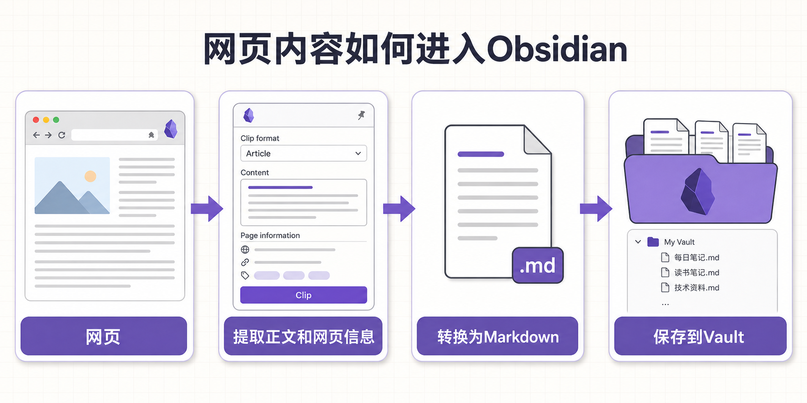
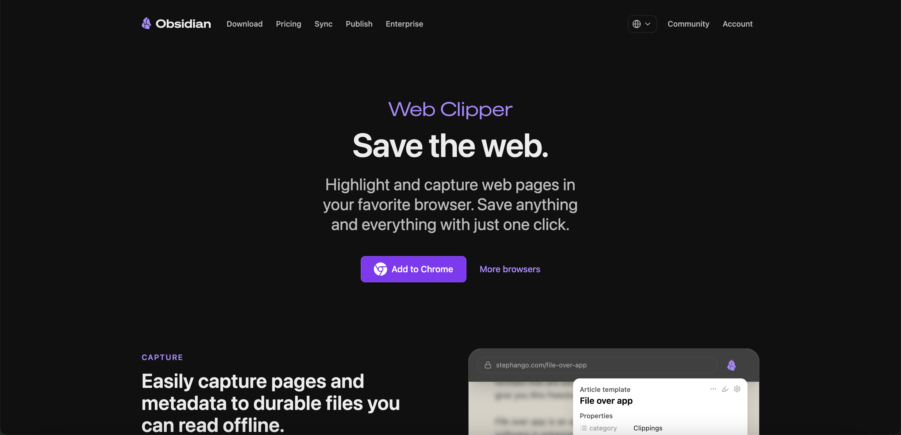
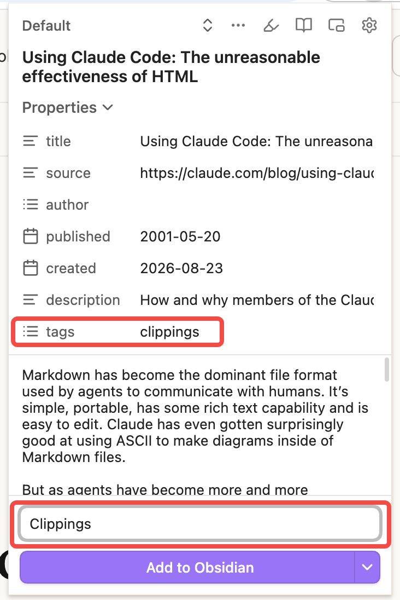
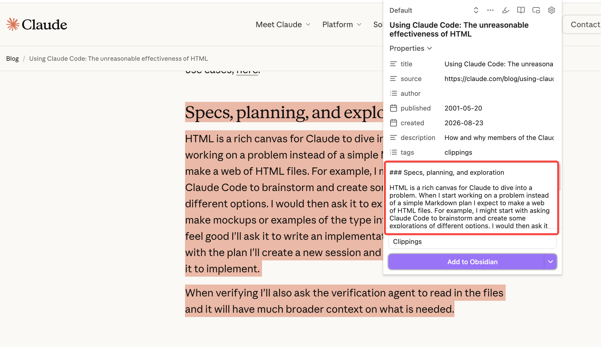
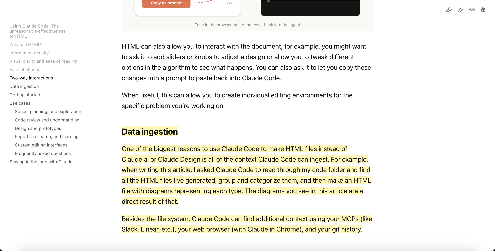

你有没有遇到过这种情况：浏览网页时看到一篇很有用的文章，顺手放进了书签。几个月后想再找出来，却只记得大概内容，完全想不起标题，也不知道当时存进了哪个书签文件夹。

我以前也习惯把文章一股脑放进书签。结果收藏越来越多，真正会重新打开的却很少。后来尝试复制正文到Obsidian，又发现每次都要删除广告和导航栏，再手动补上标题、作者和原文链接，同样很麻烦。

Obsidian Web Clipper就是为了解决这个问题。看到值得留下的网页时，点一下浏览器里的扩展按钮，它就能提取正文和网页信息，转换成Markdown笔记，再保存到你的Vault中。

这样，网页资料就不再只是一个躺在书签里的网址，而是可以搜索、链接和继续整理的Obsidian笔记。


## Obsidian Web Clipper是什么？

[Obsidian Web Clipper](https://obsidian.md/help/web-clipper)是Obsidian官方推出的免费浏览器插件。简单来说，它的作用就是：**把网页变成Obsidian里的Markdown笔记。**

比如，你正在读一篇很长的文章，觉得其中一部分以后还会用到。你可以保存整篇正文，也可以只选中需要的段落，或者一边阅读一边高亮重点。Web Clipper会把这些内容和标题、作者、原文链接等信息一起整理好，再发送到Obsidian。

一个最基础的网页剪藏流程是：

```text
网页 → Web Clipper提取正文和网页信息 → 转换为Markdown → 保存到Obsidian Vault
```



保存完成后，你得到的是一篇普通的Markdown笔记，而不是只能在某个收藏服务里查看的记录。你可以继续添加Properties、标签、双向链接和自己的想法，也可以通过搜索、[Obsidian Bases](https://chloevolution.com/zh-cn/posts/obsidian-bases/)或Dataview整理这些内容。

### Web Clipper可以保存哪些内容？

Web Clipper并不只是把整个网页原样复制过去。根据你正在看的内容，可以选择不同的保存方式：

- **保存网页正文**：自动识别文章主体，尽量排除菜单、页脚和其他无关内容。
- **保存选中的文字**：只保留当前真正需要的段落，而不是收藏整篇文章。
- **高亮文字、图片或内容区块**：阅读时先标记重点，再把高亮内容集中保存到Obsidian。
- **提取网页信息**：自动获取标题、作者、来源网站、网址、描述和发布日期等内容。
- **使用Reader阅读网页**：隐藏干扰元素，在更简洁的界面中阅读和高亮文章。
- **通过模板统一格式**：提前设置文件名、保存目录、Properties和正文结构。
- **使用Interpreter处理内容**：借助语言模型提取信息、生成摘要、翻译或转换格式。

当然，不同网站提供的信息并不一样。有些网页没有正确标记作者或发布日期，这些字段就可能为空。所以第一次剪藏某类网站时，最好先看一眼预览结果，不要默认所有信息都会被准确识别。

### Web Clipper和书签、复制粘贴有什么区别？

这三种方法看起来都能“保存网页”，实际适合的情况并不一样：

| 方法 | 保存的内容 | 优点 | 局限 |
|---|---|---|---|
| 浏览器书签 | 网页标题和网址 | 保存速度快，适合以后重新访问 | 依赖原网页，无法直接搜索正文 |
| 复制粘贴 | 手动选择的网页内容 | 选择自由，不需要额外工具 | 经常需要清理格式和补充来源信息 |
| Web Clipper | 正文、选区、高亮和网页信息 | 自动转换为Markdown，还能用模板统一格式 | 遇到结构复杂的网页时，可能需要手动选择内容或调整模板 |

如果只是想过几天再打开网页，放进书签就够了。如果你希望把内容长期留下来，以后还能搜索、标注并连接到其他笔记，Web Clipper会更合适。

### Web Clipper需要在浏览器里安装

虽然名字里有Obsidian，但Web Clipper并不是从Community plugins市场安装的插件。它是一个浏览器插件，需要安装到Chrome、Edge、Firefox或Safari中。

开始使用前，需要准备好两样东西：

1. 电脑或移动设备上已经装好Obsidian，并且至少创建了一个Vault。
2. 在平时使用的浏览器中安装Web Clipper。

它和Obsidian里的Web viewer也不是同一个功能。Web viewer让你在Obsidian中打开网页；Web Clipper则把网页内容保存成笔记。一个偏向浏览，一个偏向收集。

### 剪藏内容保存在哪里？

剪藏后的笔记会进入你选择的Obsidian Vault，和自己创建的Markdown笔记没有本质区别。根据模板设置，你可以让它：

- 创建一篇新笔记。
- 把内容添加到已有笔记的顶部或底部。
- 把内容添加到当天的Daily Note。

Web Clipper的代码是开源的，官方也说明不会收集使用数据。不过，如果以后启用Interpreter并连接外部语言模型，相关数据会按照所选服务商的规则处理。普通的网页剪藏不需要开启Interpreter，所以刚开始使用时可以先忽略这个功能。

还有一点很容易被忽略：网页里的图片默认不会自动下载到Vault。笔记中通常保存的是原网站的图片链接，所以离线时可能无法显示，原图失效后也会跟着消失。如果希望长期保留，可以在Obsidian中运行`Download attachments for current file`，具体步骤可以参考[Obsidian图片管理指南](https://chloevolution.com/zh-cn/posts/manage-images-in-obsidian/#将网络图片下载为本地附件)。

### Web Clipper适合哪些使用场景？

如果你平时会把网上的内容带回Obsidian继续处理，Web Clipper会很实用。例如：

- 阅读文章、博客和新闻资料。
- 收集论文、技术文档和研究来源。
- 保存食谱及其材料和操作步骤。
- 整理书籍、电影、播客或视频资料。
- 收集写作素材和内容选题。
- 在网页中高亮重点并补充个人笔记。

不过，安装Web Clipper并不代表以后看到什么都要保存。它只是让收集这一步更轻松，剪藏后的内容仍然需要阅读和整理。否则，`Clippings`文件夹很快就会变成另一个越来越大的收藏夹。


## 安装Obsidian Web Clipper

Web Clipper的安装并不复杂，通常几分钟就能完成。它支持Chrome、Edge、Firefox和Safari，也可以在Firefox Mobile以及iPhone、iPad的Safari中使用。

为了避免装到名字相似的第三方插件，建议从[Obsidian Web Clipper官方网站](https://obsidian.md/clipper)选择自己的浏览器，再进入对应的插件商店。

### 安装前需要准备什么？

安装扩展之前，先确认：

- 设备上已经安装Obsidian。
- 至少创建并打开过一个Vault。
- 你知道这个Vault的准确名称。
- 浏览器允许安装扩展。

这里要注意，Vault名称不是文件路径。假设它保存在`/Users/name/Documents/Obsidian/My Notes`，那么Vault名称通常是`My Notes`，而不是前面那一整段路径。后面如果出现无法保存的问题，可以先回来检查这里。

### 不同浏览器应该安装哪个版本？

| 浏览器或设备 | 安装来源 | 说明 |
|---|---|---|
| Chrome | Chrome Web Store | 同样适用于Brave、Arc、Orion、Vivaldi等Chromium浏览器 |
| Microsoft Edge | Microsoft Edge Add-ons | 建议使用Edge官方扩展商店版本 |
| Firefox | Firefox Add-ons | 支持桌面版Firefox和Firefox Mobile |
| Safari | Apple App Store | 支持macOS、iOS和iPadOS |

Brave、Arc、Orion和Vivaldi等浏览器也可以安装Chrome Web Store中的版本，只是菜单名称和固定扩展按钮的位置可能稍有不同。

### 在Chrome、Brave或其他Chromium浏览器中安装

1. 打开[Web Clipper官方介绍页面](https://obsidian.md/clipper)。
2. 点击“Add to Chrome”，进入Chrome Web Store。
3. 确认扩展名称为“Obsidian Web Clipper”，开发者信息与官方页面一致。
4. 点击“Add to Chrome”或“添加至Chrome”。
5. 在浏览器弹出的权限窗口中确认安装。

装好后，点击地址栏旁边的扩展按钮，在列表里找到Obsidian Web Clipper，再点击固定图标。以后看到想保存的网页，就可以直接从工具栏打开它。



### 在Microsoft Edge中安装

1. 从[Web Clipper官方介绍页面](https://obsidian.md/clipper)选择Edge版本。
2. 进入Microsoft Edge Add-ons扩展商店。
3. 点击“Get”或“获取”。
4. 确认浏览器显示的权限请求。
5. 安装后通过Extensions菜单将Web Clipper显示在工具栏上。

Edge虽然也能安装Chrome Web Store中的部分扩展，但既然官方提供了Edge版本，直接使用它会更省事。

### 在Firefox中安装

1. 从[Web Clipper官方介绍页面](https://obsidian.md/clipper)选择Firefox版本。
2. 在Firefox Add-ons页面点击“Add to Firefox”。
3. 阅读权限说明并确认添加。
4. 根据需要允许扩展在隐私窗口中运行。
5. 把扩展图标固定到Firefox工具栏。

Web Clipper也支持Firefox Mobile。打开移动版Firefox的扩展菜单，找到Obsidian Web Clipper并安装即可。不同系统和版本中的入口可能略有区别，如果看不到安装按钮，可以先更新Firefox。

### 在Mac的Safari中安装

Safari版本通过Apple App Store提供：

1. 从[Web Clipper官方介绍页面](https://obsidian.md/clipper)进入Safari版本的App Store页面。
2. 下载并安装Obsidian Web Clipper。
3. 打开Safari，进入“Settings → Extensions”。
4. 在扩展列表中启用Obsidian Web Clipper。
5. 根据提示允许扩展访问当前网站或所有网站。

如果只允许访问个别网站，换到其他网页时，Web Clipper可能无法读取内容。如果准备经常使用，可以根据自己的隐私偏好，把权限改为允许访问所有网站。

### 在iPhone或iPad的Safari中安装

1. 从App Store安装Obsidian Web Clipper。
2. 打开Safari，点击地址栏左侧的页面菜单按钮。
3. 选择“Manage Extensions”，启用Obsidian Web Clipper。
4. 前往“设置 → Apps → Safari → Extensions”。
5. 打开Obsidian Web Clipper，并根据需要允许它访问所有网站。
6. 前往“设置 → Apps → Obsidian”。
7. 将“Paste from Other Apps”设为允许，确保Obsidian可以接收剪藏内容。

使用时，打开目标网页，点击Safari地址栏中的扩展或拼图按钮，再选择Obsidian Web Clipper。


### 为什么Web Clipper需要网页访问权限？

第一次安装时，你可能会看到“读取和更改网站数据”之类的权限提示。这是因为Web Clipper需要读取当前网页，才能识别标题、作者、正文和图片，也需要在页面上提供Highlighter与Reader功能。

如果不希望它一直拥有所有网站的访问权限，可以选择“点击扩展时”或只允许指定网站。不过，每次来到一个没有授权过的网站时，可能需要先手动允许访问。

### 如何确认安装成功？

最后，打开后文会一直使用的Claude官方博客文章：[Using Claude Code: The unreasonable effectiveness of HTML](https://claude.com/blog/using-claude-code-the-unreasonable-effectiveness-of-html)，检查安装是否成功：

1. 打开上面的文章页面。
2. 点击浏览器工具栏中的Obsidian Web Clipper图标。
3. 确认弹出窗口能够显示文章标题、Properties和正文预览。
4. 检查窗口底部是否可以选择Vault和保存文件夹。

如果弹窗里已经出现网页标题和正文预览，说明扩展安装成功了。先不要急着研究模板，下一步我们会直接使用默认设置保存第一篇网页，再回到Obsidian检查结果。


## 第一次把网页保存到Obsidian

第一次使用时，先不要急着改模板。我们只做一件事：用默认设置保存一篇真实文章，确认网页、Web Clipper和Obsidian之间能够正常连接。

本文接下来的操作都使用Claude官方博客中的[Using Claude Code: The unreasonable effectiveness of HTML](https://claude.com/blog/using-claude-code-the-unreasonable-effectiveness-of-html)作为示例。这篇文章介绍Claude Code团队为什么会使用HTML生成更丰富、更容易阅读和分享的内容。

它很适合用来测试Web Clipper，因为页面中既有明确的作者和发布日期，也有多级标题、列表、图片和较长的正文。后面演示整篇保存、选中文本和Highlighter时，我们都会继续使用这个页面。

### 第一步：打开Web Clipper

在浏览器中打开示例文章，然后点击工具栏上的Obsidian Web Clipper图标。


Web Clipper会自动读取当前网页。等待一两秒后，你会在弹窗中看到三个主要部分：

- 顶部可以切换模板、打开Highlighter和Reader，以及进入设置。
- 中间显示从网页中识别出的Properties和笔记正文。
- 底部用来选择Vault、保存文件夹并将内容发送到Obsidian。

Properties和正文都可以在保存前修改。如果标题中带有不需要的网站名称，或者自动提取的描述不准确，可以直接在预览中调整，不会影响原网页。

### 第二步：检查剪藏内容

先看一下正文预览。默认情况下，Web Clipper会尝试保留文章主体，同时去掉顶部菜单、侧栏、页脚和其他与正文无关的内容。

以这篇Claude文章为例，Web Clipper应该能够识别出以下信息：

| 项目 | 预期内容 |
|---|---|
| 标题 | `Using Claude Code: The unreasonable effectiveness of HTML` |
| 作者 | `Thariq Shihipar` |
| 发布日期 | `May 20, 2026` |
| 来源 | Claude官方博客 |
| 原文网址 | 当前文章的完整URL |

实际显示哪些Properties取决于当前模板。如果默认模板没有把作者或发布日期加入Properties，不一定代表识别失败，也可能只是这个字段没有被模板使用。在后续的Web Clipper模板教程中，我们会把这些信息明确加入笔记。

不需要逐字检查整篇文章，但建议确认以下几点：

- 标题是否正确。
- 正文开头和结尾是否完整。
- 作者和发布日期有没有明显错误。
- 原文网址是否已经保留。
- 代码块、表格和引用等特殊格式是否正常。

如果正文缺了一大段，先不要保存。后面会介绍如何通过选中文本或Highlighter指定需要的内容。

### 第三步：选择Vault和保存文件夹

在弹窗底部找到Vault选项，选择要接收网页笔记的Vault。然后在Folder中填写或选择保存目录，例如：

```text
Clippings
```

我建议为网页剪藏单独准备一个文件夹。新保存的内容先统一进入`Clippings`，阅读和整理后，再决定是否连接到项目笔记、移动到其他目录或删除。这样比一开始就为不同网页设计很多文件夹更容易维护。

如果你有多个Vault，要特别留意当前选中的是哪一个。Web Clipper会记住相关设置，下一次打开时不一定自动切换到你当时正在使用的Vault。




### 第四步：点击Add to Obsidian

确认预览和保存位置后，点击“Add to Obsidian”。

第一次操作时，浏览器可能会询问是否允许打开Obsidian，或者系统可能要求确认应用跳转。选择允许后，Obsidian会打开相应的Vault并创建笔记。

如果浏览器以后再次询问，可以根据自己的习惯选择始终允许。不要勾选来路不明网页发出的应用跳转请求；这里确认的应该是由你刚刚点击Web Clipper按钮触发的Obsidian请求。

### 第五步：检查生成的Markdown笔记

回到Obsidian，打开`Clippings`文件夹。你应该能看到一篇以网页标题命名的新笔记：

```text
Using Claude Code The unreasonable effectiveness of HTML.md
```

实际文件名可能会因为默认模板和系统对冒号等字符的处理方式略有不同，但应该能够从标题中清楚识别出这篇文章。

打开后重点检查：

- 笔记顶部是否包含网页Properties。
- 正文是否已经转换为Markdown。
- 标题、列表、链接和图片是否能够正常显示。
- 原文网址是否可以点击打开。

这些内容以后都可以像普通笔记一样编辑。删除某个段落、添加自己的总结或建立双向链接，都不会影响原网页。


## 剪藏整个网页、选中文本与高亮内容

成功保存第一篇文章后，接下来需要决定的不是“能不能剪藏”，而是“这次到底要留下多少内容”。

以刚才的Claude文章为例：你可以把完整文章留在Vault中，也可以只保存作者解释HTML优势的某个段落，还可以在阅读过程中分别标记“Information density”“Visual clarity and ease of reading”和“Ease of sharing”等部分。Web Clipper分别提供了整篇正文、选中文本和Highlighter三种方式。

### 保存整篇文章的正文

如果希望完整保存示例文章，不需要提前选择任何文字，也不要在页面上添加高亮。回到文章开头，直接打开Web Clipper，它会自动识别主要内容并显示在正文预览中。

这里的“整篇文章”并不是保存网页的所有HTML。Web Clipper会尽量排除导航栏、广告、评论区和页脚，只保留它判断为正文的部分。因此，生成的笔记通常比直接复制整个网页干净得多。

这种方式适合：

- 希望离开原网站也能阅读文章主体。
- 需要保留上下文，而不是只有几段摘录。
- 保存教程、研究资料或以后可能反复查阅的长文。

自动识别并不是每次都完美。遇到布局复杂、正文分成多个区域或主要内容通过脚本加载的网页时，预览里可能会缺少部分内容。这时可以手动选中需要的范围，或者使用Highlighter逐段标记。

在这个案例中，可以滚动预览，检查“Why use HTML?”到“Staying in the loop with Claude”等主要章节是否都被保留下来，同时确认网站导航、相关推荐和页脚没有混进正文。

### 只保存选中的文字

假设你并不想保存整篇文章，只对“Why use HTML?”下面关于HTML优势的解释感兴趣。这时可以先在页面上选中对应段落，再打开Web Clipper：

1. 用鼠标选中需要保存的段落。
2. 保持选中状态，点击Web Clipper图标。
3. 检查正文预览是否只包含刚才的选区。
4. 保留原文网址和其他Properties。
5. 点击“Add to Obsidian”。

选中文本会改变当前剪藏的正文范围，但文章标题、作者和原文网址等网页信息仍然可以一起保存。这样既保留了内容出处，也不用把整篇长文放进Vault。

如果需要选择整个页面，可以使用`Ctrl/Cmd + A`，再打开Web Clipper。不过，这种方法可能把菜单、按钮和页脚也一起选中。想要干净的文章正文时，优先让Web Clipper自动提取；只有自动提取缺失内容时，再考虑手动全选。



选中文本适合一次保存连续的一段内容。如果重要段落分散在文章的不同位置，反复复制会很麻烦，这时Highlighter更方便。

### 使用Highlighter标记多个重点

Highlighter可以在同一个网页中标记多段文字、图片和内容区块。你可以先完成阅读和标记，最后一次性把所有重点保存到Obsidian。

继续使用这篇Claude文章，可以尝试标记三个分散的内容：

1. 在“Information density”中，标记HTML可以承载表格、CSS、SVG和交互等丰富信息的部分。
2. 在“Visual clarity and ease of reading”中，标记作者对长篇Markdown可读性的看法。
3. 在“Staying in the loop with Claude”中，标记作者最后总结为什么HTML能帮助他继续参与Claude工作过程的部分。

这三个重点位于文章的不同位置，如果使用普通选区，很难一次完成；Highlighter正适合这种边读边摘录的情况。

使用方法如下：

1. 打开Web Clipper，点击顶部的Highlighter图标。
2. 回到网页，选中想要保留的文字，或点击可以高亮的图片和内容区块。
3. 继续向下阅读，把其他重点依次加入高亮。
4. 再次打开Web Clipper，检查高亮内容。
5. 点击“Add to Obsidian”完成保存。

也可以通过右键菜单或快捷键开启Highlighter。默认快捷键是：

- macOS：`Option + Shift + H`
- Windows和Linux：`Alt + Shift + H`

快捷键可以在Web Clipper Settings的General区域调整，Safari暂不支持修改Web Clipper快捷键。


Highlighter和普通选区最大的区别是：普通选区适合临时保存一段连续内容；Highlighter适合在阅读过程中保留多个分散的重点。创建的高亮还会被Web Clipper记住，以后重新打开同一个网页时仍然可以看到。

### 高亮内容会怎样写入笔记？

打开Web Clipper Settings中的Highlighter设置，可以选择高亮内容如何写入笔记：

- **Highlight the page content**：保留文章正文，并使用`==高亮内容==`标记你选中的部分。
- **Replace the page content**：不保存完整正文，只把高亮内容整理成列表。
- **Do nothing**：保存原始正文，但不在正文中加入高亮标记。

如果你想保留文章上下文，同时在Obsidian中看到重点，选择“Highlight the page content”。如果只想留下摘录，减少笔记长度，则选择“Replace the page content”。


后续创建Web Clipper模板时会用到`{{content}}`变量。它并不永远代表整篇文章：没有选区或高亮时，它通常是自动识别的正文；页面上存在选区或高亮时，它会根据当前剪藏内容和Highlighter设置返回相应结果。

### 三种剪藏方式应该怎么选？

| 需求 | 推荐方式 | 原因 |
|---|---|---|
| 完整保存文章，保留上下文 | 整篇正文 | 自动清理网页中的大部分无关内容 |
| 只需要一个连续段落 | 选中文本 | 操作最快，笔记内容最少 |
| 长文中有多个分散重点 | Highlighter | 可以边读边标记，最后统一保存 |
| 保留全文并标出重点 | Highlighter + Highlight the page content | 正文与重点可以同时保存 |
| 只建立网页索引，不保存正文 | 后续使用自定义模板 | 只保留标题、网址和网页信息 |

刚开始使用时，不必为每个网站建立复杂规则。普通文章先使用整篇正文，偶尔需要一段内容时用选区，认真阅读长文时再打开Highlighter，这三个习惯已经能覆盖大多数网页收集场景。


## 使用Reader阅读模式

Claude示例文章的正文很长，原网页中还有顶部导航、产品入口、相关文章和页脚。如果你的目的不是马上保存，而是想先把文章读完，再决定哪些内容值得留下，可以打开Web Clipper自带的Reader。

Reader会暂时隐藏网页中与阅读无关的部分，只显示标题、作者、发布日期、正文和图片。它不会修改原网页，也不会自动把内容保存到Obsidian；关闭Reader后，页面会恢复原来的样子。

### 如何打开Reader？

打开Claude示例文章，然后使用以下任意一种方法：

- 打开Web Clipper，点击顶部的书本图标。
- 在网页中点击右键，从菜单中打开Reader。
- 使用Reader快捷键：macOS为`Option + Shift + R`，Windows和Linux为`Alt + Shift + R`。

进入Reader后，原来的网页布局会被替换成更简洁的阅读界面。对于包含多个标题的长文，左侧还会生成文章目录。你可以通过目录直接跳到“Why use HTML?”“Getting started”或“Frequently asked questions”等章节，不需要反复滚动寻找。

Reader还会保留正文图片和基本格式，并为代码块提供语法高亮。如果文章中包含脚注，点击后可以直接在当前页面查看。




### 在Reader中使用Highlighter

Reader不只是一个干净的阅读界面，也可以和前面的Highlighter配合使用。

例如，打开左侧目录中的“Information density”，选中你认为重要的段落，然后选择高亮。接着跳到“Visual clarity and ease of reading”和“Staying in the loop with Claude”，继续标记其他重点。

完成后打开Web Clipper，就可以像在原网页中一样把这些高亮保存到Obsidian。对于内容较长、网页元素较多的文章，我更推荐在Reader中阅读和高亮，因为正文范围更清楚，不容易误选菜单或其他无关元素。

### 调整Reader的阅读效果

点击Reader工具栏中的文字设置图标，可以调整字体、字号、行距、行宽、明暗外观和配色主题。也可以进入Web Clipper Settings进一步设置：

| 设置 | 作用 |
|---|---|
| Font | 使用系统中已经安装的字体 |
| Font size | 调整正文字号 |
| Line height | 调整行与行之间的距离 |
| Line width | 限制正文宽度，避免一行文字过长 |
| Appearance | 切换浅色或深色外观 |
| Theme | 更换Reader配色 |
| Custom CSS | 使用CSS进一步调整阅读界面 |

刚开始使用时不需要逐项修改。如果觉得一行文字太长，可以先缩小Line width；如果中文阅读显得拥挤，再适当增加Line height。这两项通常比更换主题更能改善长文阅读体验。


---

Obsidian Web Clipper最实用的地方，不是让你保存更多网页，而是把“看到有用内容”和“放进Obsidian继续整理”之间的步骤缩短了。

如果你发现自己每次都在重复修改文件名、Properties和正文结构，说明已经适合进入下一步：创建Web Clipper模板。模板、Variables、Filters、自动匹配网站和Interpreter会放在单独的进阶教程中介绍。

先从一篇真正想读的文章开始，选择合适的剪藏方式，保存到Obsidian，再补上一两句自己的想法。比起建立一个庞大的网页收藏系统，这条简单流程更容易真正用起来。
