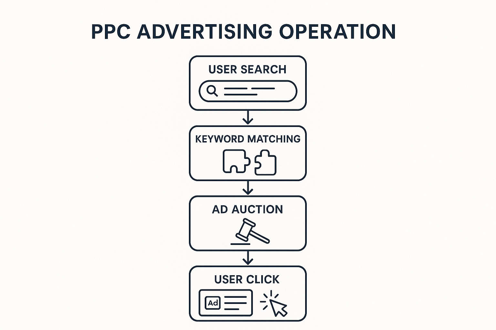
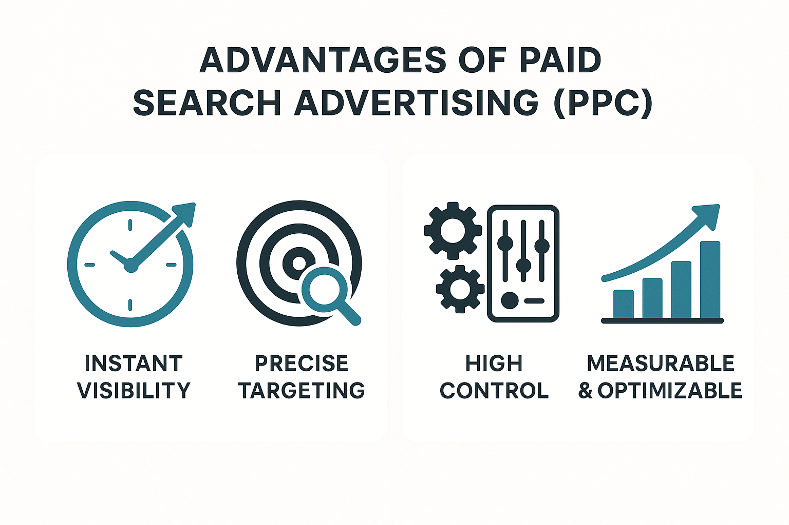
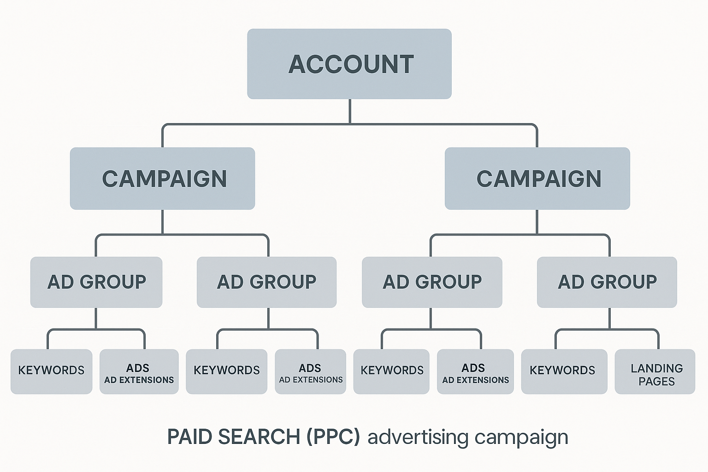
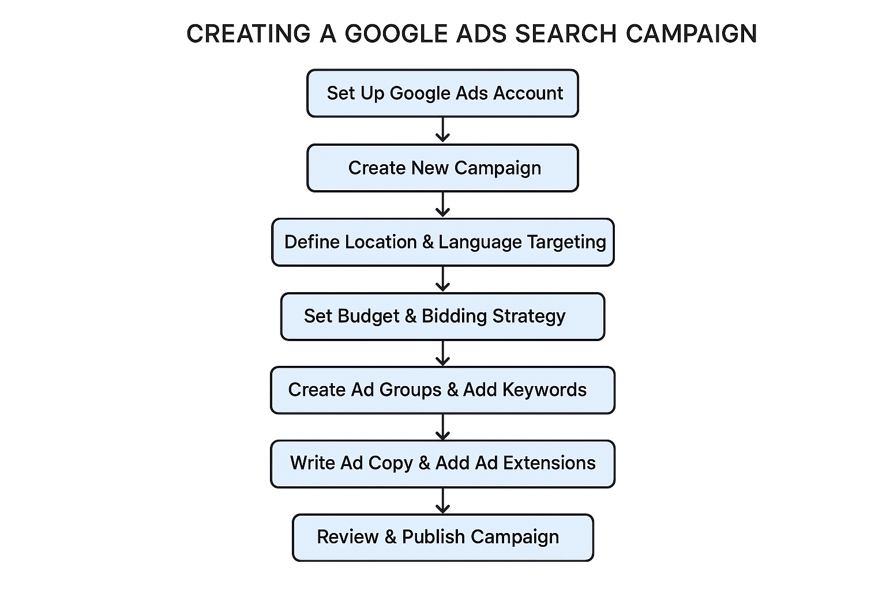
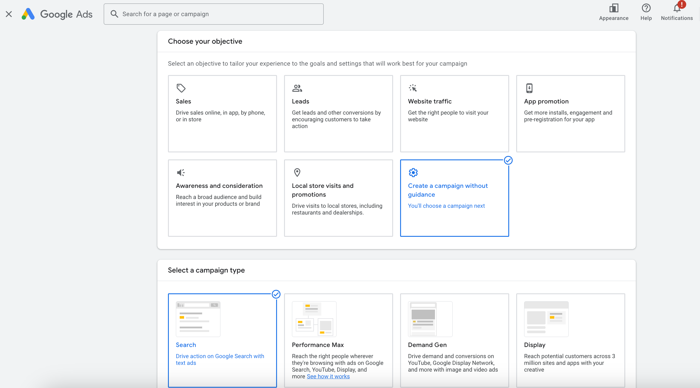
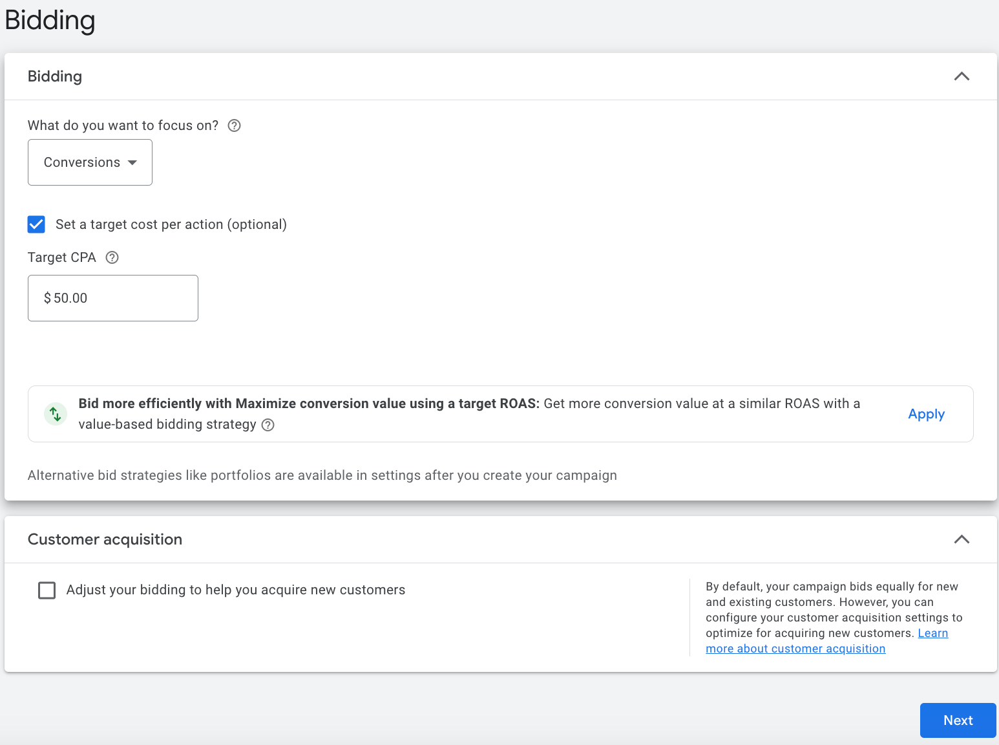
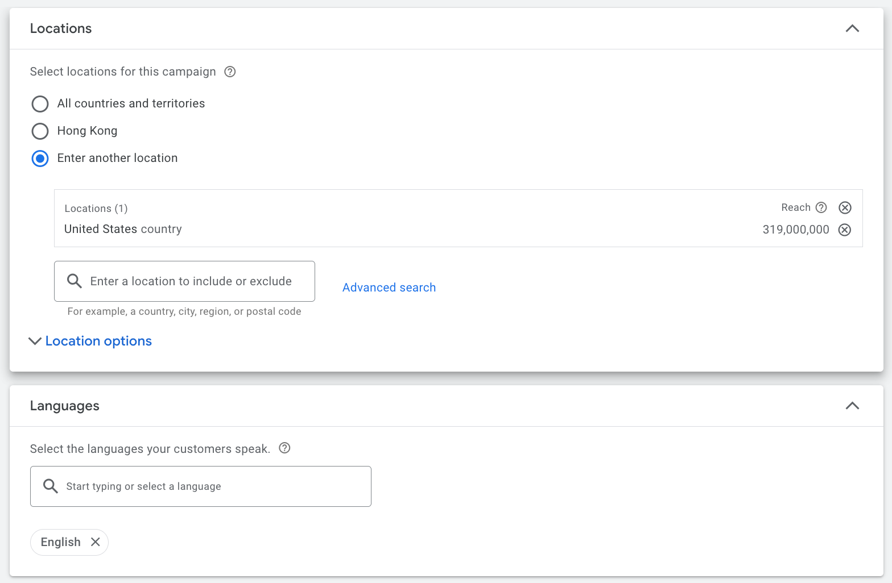
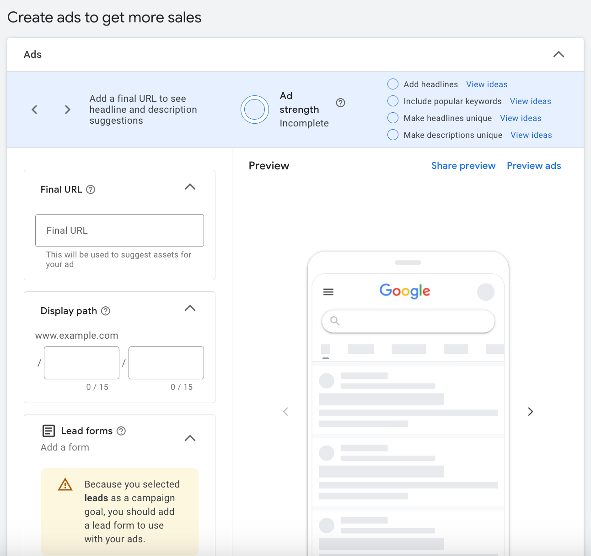
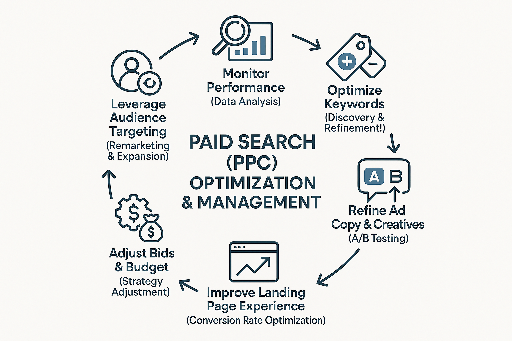

## 什么是付费搜索广告 (PPC)？

在数字营销的世界里，如果你想快速获得搜索引擎的关注，**付费搜索广告 (Paid Search Advertising)** 绝对是你的首选策略。它通常被称为 **PPC (Pay-Per-Click)** 广告，因为顾名思义，你只在有人点击你的广告时才需要支付费用。

简单来说，付费搜索广告是一种通过**在搜索引擎结果页面 (SERP) 上购买广告位**来吸引网站流量和潜在客户的方式。这些广告会以文本、购物列表或视频等形式，出现在用户搜索结果的显眼位置，通常带有“广告”或“赞助商”的明确标识。

### PPC 的运作原理：一场微秒间的“竞价”

付费搜索广告的运作原理可以概括为一个高效的实时“竞价”过程，这个过程在用户每次搜索时都会发生：

1.  **用户搜索**：一切都始于用户的搜索行为。当潜在客户在 Google 或 Bing 等搜索引擎上输入一个**关键词**时，他们就发出了一个明确的需求信号。
2.  **关键词匹配**：搜索引擎会立即扫描所有广告主的广告系列，找出那些与用户搜索词**匹配**的关键词。例如，如果用户搜索“最好的跑步鞋”，那么“跑步鞋”、“运动鞋”等关键词相关的广告就有可能被触发。
3.  **广告竞价 (Ad Auction)**：在找到匹配的广告后，搜索引擎会启动一个**实时竞价系统**。所有符合条件的广告会根据它们的**出价**和**广告质量**进行竞争。请注意，出价高并非是唯一的决定因素，广告的质量（如相关性、落地页体验）也至关重要。
4.  **广告展示**：在竞价胜出的广告中，排名靠前的广告会在 SERP 的顶部、底部或其他显著位置展示给用户。这些广告会带有明显的“广告”或“赞助商”标签，以便用户区分。
5.  **用户点击**：当用户看到你的广告并觉得它有价值时，就会点击进入你的网站。此时，你才需要向广告平台支付费用——这就是“按点击付费”的由来。

### 付费搜索广告的主要平台

目前，主导付费搜索广告市场的两大平台是 **Google Ads** 和 **Microsoft Advertising**。理解它们的特点，有助于你根据目标受众和市场选择合适的平台。

  * **Google Ads** (原 Google AdWords)：

      * **市场份额巨大**：在全球搜索引擎市场占据绝对主导地位，这意味着你可以在 Google 搜索网络及其庞大的合作伙伴网站上触达绝大多数互联网用户。
      * **功能强大且完善**：提供最全面的广告类型、定位选项和数据分析工具，适合各类规模和目标的广告主。
      * **生态系统丰富**：不仅限于搜索广告，还包括展示广告网络、YouTube 视频广告、应用广告等，形成了一个全面的数字营销生态。
      * **推荐使用场景**：如果你的目标是覆盖最广泛的受众，并且需要精细化的广告控制和优化，Google Ads 是首选。

  * **Microsoft Advertising** (原 Bing Ads)：

      * **覆盖微软系用户**：主要在 Bing、Yahoo\! 和 AOL 等搜索引擎上展示广告。虽然市场份额小于 Google，但它能触达微软旗下的忠实用户群体，例如通过 Windows、Xbox、Microsoft Edge 浏览器等。
      * **用户画像独特**：有研究表明，Microsoft Advertising 的用户群体可能年龄略大，收入和教育水平相对较高，这对于特定B2B或高端产品服务来说可能更有价值。
      * **竞争相对较小，成本可能更低**：由于竞争程度低于 Google Ads，一些关键词的 **[每次点击成本 (CPC)](https://chloevolution.com/tools/cpc-calculator/)** 可能会更低，这对于预算有限的广告主来说是个优势。
      * **易于导入 Google Ads 数据**：Microsoft Advertising 平台支持直接导入 Google Ads 的广告系列，方便广告主进行跨平台管理。
      * **推荐使用场景**：作为 Google Ads 的补充，帮助你扩大覆盖范围、触达特定用户群体，并在预算有限时寻找更具成本效益的流量。

这两个平台都提供了强大的工具，帮助广告主管理和优化他们的 PPC 广告系列。对于大多数品牌来说，**同时利用这两个平台**往往能带来更全面的市场覆盖和更好的整体表现。

## 为什么选择付费搜索广告？

在 **[SEM 基础指南](https://chloevolution.com/zh-cn/posts/sem-basics/)** 中，我们已经探讨了付费搜索广告（PPC）的运作方式。现在，你可能会问：面对众多的数字营销策略，为什么我应该优先考虑付费搜索广告？

### 1. 即时可见性与精准流量：快速触达高意向客户

付费搜索广告最大的魅力在于**即时性**。一旦你的广告系列设置完成并获得批准，它就能**立即**出现在搜索引擎结果页（SERP）的顶部。这意味着：

* **快速市场渗透：** 无论是新产品发布、短期促销活动，还是进入新市场，PPC 都能让你迅速获得曝光，无需漫长的等待。
* **精准触达高意向客户：** 用户在搜索引擎上输入关键词，就表明他们有明确的需求和意图。通过深入的 **[关键词研究和定位](https://chloevolution.com/zh-cn/posts/keyword-research-and-targeting/)**，你的广告能直接呈现在那些正在寻找你产品或服务的人面前，确保了流量的**高质量和高相关性**。

### 2. 高度可控性：预算、受众、时间和位置尽在掌握

付费搜索广告平台（如 [Google Ads](https://business.google.com/us/google-ads/)）提供较强的**控制力**，让你能够精细化管理广告活动的方方面面：

* **预算控制：** 你可以设定每日或每月预算上限，确保广告支出不会超支。你可以灵活调整 **[竞价策略](https://chloevolution.com/zh-cn/posts/sem-bidding/)**，决定为每次点击支付多少费用，**更详细的预算和竞价管理可参考我们的[《SEM 广告费用全解析》](https://chloevolution.com/zh-cn/posts/search-engine-marketing-cost/)**。
* **受众与地理定位：** 广告可以根据用户的地理位置、语言、设备，甚至人口统计学特征和兴趣进行投放，确保广告只展示给最相关的潜在客户。
* **时间排程：** 你可以精确地安排广告投放的时间段，例如只在你的业务开放时间或目标客户活跃时展示广告。
* **广告文案与创意：** 对广告标题、描述和广告附加信息拥有完全的控制权，可以随时测试和优化以提高效果，**学习如何撰写高效文案可阅读[《撰写高转化 SEM 文案的关键技巧》](https://chloevolution.com/zh-cn/posts/create-sem-copy/)**。

这种高度可控性意味着你可以最大化营销效率，将资源投入到最有可能产生回报的领域。

### 3. 可衡量性与优化空间：数据驱动的持续增长

付费搜索广告的每一个环节都是**可追踪、可衡量**的。你可以获得详细的数据报告，了解广告的表现：

* **透明的数据洞察：** 从展示次数、点击次数、**[点击率 (CTR)](https://chloevolution.com/tools/ctr-calculator/)** 到 **[每次点击成本 (CPC)](https://chloevolution.com/tools/cpc-calculator/)**、**[转化率 (CVR)](https://chloevolution.com/tools/cvr-calculator/)** 和 **广告支出回报率 (ROAS)**，所有关键指标都清晰可见。
* **数据驱动的优化：** 基于这些数据，你可以迅速识别表现不佳的广告元素，进行 A/B 测试，并持续优化 **[落地页体验](https://chloevolution.com/zh-cn/posts/landing-page-optimization/)** 和竞价策略。这种迭代优化的能力，是实现营销投资最大回报的关键。

想深入了解如何分析这些数据？请阅读我们的 **[《SEM 数据分析全攻略》](https://chloevolution.com/zh-cn/posts/sem-analytics/)** 一文。

### 4. 弥补 SEO 不足与应对 AI 挑战：占据搜索制高点

尽管 SEO 能带来宝贵的免费有机流量，但它通常需要较长的时间才能见效，并且在某些竞争激烈的关键词领域，获得首页排名非常困难。更重要的是，在 **AI 大模型和智能搜索**日益发展的今天，搜索引擎的结果页可能会呈现更多摘要、答案和集成内容，这可能对传统的 **SEO 自然排名造成冲击**，使自然流量获取更具挑战性。

付费搜索广告在这种背景下展现出独特的韧性与优势：

  * **快速占领头部位置：** 即使你的网站在某个关键词上没有良好的自然排名，付费搜索也能让你立即出现在 SERP 的最上方。无论搜索结果页如何演变，付费广告位依然是**最直接、最显眼的流量入口**，确保你的品牌始终处于搜索的“制高点”。
  * **测试与验证：** 你可以通过 PPC 快速测试不同关键词的商业价值和用户意图，将这些宝贵数据反哺给 SEO 策略，指导内容创作，甚至为 AI 生成内容提供方向。
  * **应对市场变化：** 在节假日促销、热门趋势出现时，PPC 能快速响应，抓住转瞬即逝的市场机会。

将付费搜索广告与 SEO 结合，能帮助你的品牌在搜索结果页面上实现更全面的覆盖，最大化你的在线可见度和市场份额，并在未来 AI 驱动的搜索环境中，依然能有效地触达目标客户。

## 付费搜索广告系列结构：搭建你的“广告大厦”

想象一下，你的付费搜索广告系列就像一座精心规划的“广告大厦”。如果地基不稳、结构混乱，这座大厦就难以屹立不倒，更无法有效吸引目标客户。一个清晰、有逻辑的账户结构是高效管理、优化广告系列并最大化投资回报率（ROI）的关键。它能确保你的广告精准地触达用户，并帮助你更好地控制预算。

一般来说，付费搜索广告的结构可以分为几个层级，从最宏观的账户（Account）到最微观的关键词（Keywords），层层递进，环环相扣。

### 1. 账户（Account）：你的品牌总部

**账户**是你的所有付费搜索活动的最高层级，代表着你的品牌或公司。所有广告系列、预算、账单信息和管理权限都归属于这个账户。

  * **唯一性**：每个广告主通常只有一个广告账户（例如一个 Google Ads 账户），它绑定了你的支付信息和业务信息。
  * **权限管理**：你可以在账户层面设置不同用户的访问权限，例如给代理机构管理员权限，给内部团队只读权限。
  * **全局设置**：一些全局性的设置，如时区、付款货币等，也会在账户层面进行配置。

### 2. 广告系列（Campaign）：划分你的营销目标

**广告系列**是账户下的第一层级，也是你根据**不同的营销目标、产品类别或地理区域**来组织广告的场所。在广告系列层面，你主要设置以下内容：

  * **预算（Budget）**：每个广告系列都有独立的每日或总预算，确保你的支出在你掌控之中。你可以根据不同产品线的盈利能力或重要性来分配预算。**关于如何科学分配预算，可参考[《SEM 广告费用全解析》](https://chloevolution.com/zh-cn/posts/search-engine-marketing-cost/)。**
  * **出价策略（Bidding Strategy）**：是选择手动出价、还是让系统自动优化出价以实现点击、转化等目标，都在这个层级设置。
  * **地理位置定位（Location Targeting）**：你可以决定广告仅在特定国家、城市，甚至某个半径范围内展示。这对于本地服务型企业尤为重要。
  * **广告网络选择（Ad Network）**：选择是在搜索网络（Google Search Network）、展示网络（Google Display Network）还是两者兼顾投放。
  * **其他设置**：如语言、设备类型、广告投放时间等。

**举例**：如果你是一个**在线课程平台**，可以创建“前端开发课程”、“AI 编程课程”和“数据分析入门”等不同的广告系列，分别设置独立的预算和目标受众地区。

### 3. 广告组（Ad Group）：聚焦你的细分主题

**广告组**是广告系列下的第二层级，它用于组织**一组高度相关的关键词和对应的广告文案/创意**。一个广告组应该围绕一个非常具体的**主题或产品/服务类别**来构建。

  * **关键词（Keywords）**：每个广告组都应包含一组紧密相关的关键词。高度相关的关键词有助于提高广告质量得分，从而降低每次点击成本（CPC）并提升广告排名。**了解如何进行高效关键词研究，请阅读[《AI 时代下的关键词研究与定位》](https://chloevolution.com/zh-cn/posts/keyword-research-and-targeting/)。**
  * **广告文案与创意（Ads & Creatives）**：每个广告组至少应包含 2-3 个与该组关键词高度相关的广告文案。搜索引擎会自动测试这些文案，选择表现最好的进行展示。**撰写引人注目的广告文案，可参考[《撰写高转化 SEM 文案的关键技巧》](https://chloevolution.com/zh-cn/posts/create-sem-copy/)。**
  * **落地页（Landing Page）**：广告组中的所有广告都应指向一个与关键词和广告文案高度相关的落地页。落地页的相关性和用户体验是提升转化率的关键。**优化你的落地页，请查阅[《广告落地页优化：提升转化率的关键》](https://chloevolution.com/zh-cn/posts/landing-page-optimization/)。**

**举例**：在“前端开发课程”广告系列下，你可以创建“React 框架课程”、“Vue.js 入门”和“JavaScript 进阶”等广告组。在“React 框架课程”广告组中，关键词可以是“React 培训班”、“React 开发教程”，对应的广告文案则侧重强调实战项目、最新版本和就业前景。

### 4. 关键词（Keywords）：指引用户的“搜索灯塔”

**关键词**是广告组下的最低层级，也是你与潜在客户建立联系的 **“搜索灯塔”**。当你选择的关键词与用户的搜索查询匹配时，你的广告就有机会展示。

  * **匹配类型**：关键词并非只有一种形式，它们有不同的**匹配类型**（Match Types），用于控制广告在何种程度上与用户的搜索查询匹配。
      * **广泛匹配（Broad Match）**：覆盖范围最广，可以匹配到相关的短语、同义词、甚至拼写错误。
      * **词组匹配（Phrase Match）**：匹配包含你关键词短语的搜索，但可以在前后添加其他词。
      * **精准匹配（Exact Match）**：只匹配与你关键词完全相同或非常相似的搜索。
      * **否定关键词（Negative Keywords）**：非常重要！这些词可以防止你的广告在不相关的搜索中展示，避免不必要的点击浪费预算。

**举例**：对于关键词“React 培训班”，如果你使用广泛匹配，可能匹配到“最好的前端框架教程”；如果使用词组匹配，可能匹配到“React 培训班在线”；如果使用精准匹配，则只匹配“React 培训班”或“React 线下培训”。而“免费 React 资源”就可以被设置为否定关键词，以避免吸引不付费的用户。

### 5. 广告文案与附加信息（Ads & Ad Extensions）：你的“营销口才”

**广告文案**是用户在搜索结果页看到的具体内容，是你向潜在客户传递价值主张、激发点击的“营销口才”。

  * **标题（Headlines）**：最醒目的部分，通常包含关键词和核心卖点。
  * **描述（Descriptions）**：对标题的补充，提供更多细节和说服力。
  * **显示路径（Display Path）**：美化你的 URL，让用户对点击后的页面有更直观的预期。
  * **广告附加信息（Ad Extensions）**：这些是广告的“额外福利”，可以在不增加点击费用的情况下，为你的广告提供更多信息、增加可见度和点击率。常见的附加信息包括：
      * **附加链接（Sitelink Extensions）**：指向网站内特定页面的链接（如联系我们、产品分类）。
      * **附加宣传信息（Callout Extensions）**：简短的卖点或优势（如“免费试学”、“资深讲师”）。
      * **附加结构化摘要（Structured Snippet Extensions）**：突出你的产品或服务属性（如“课程类型：实战、理论、项目制”）。
      * **附加电话信息（Call Extensions）**：直接显示电话号码，方便用户一键咨询。
      * **附加图片信息（Image Extensions）**：直接在广告中展示与课程相关的图片（如学习界面、证书），更吸引眼球。

**举例**：一个“React 培训班”的广告文案可能包含“React 全栈开发 | 真实项目驱动 | 立即报名”的标题，辅以“资深导师带你从入门到精通，快速掌握核心技术”的描述，并通过附加链接直接指向“课程详情”和“学员案例”页面。

## 创建你的第一个 Google Ads 搜索广告系列

了解了付费搜索广告的原理和结构后，是时候把理论付诸实践了。Google Ads 作为全球最大的搜索引擎广告平台，是你开启付费搜索之旅的首选。接下来一步步创建你的第一个 Google Ads 搜索广告系列，触达潜在客户吧。

### 1. 设置你的 Google Ads 账户

如果你还没有 Google Ads 账户，你需要先创建一个。

1.  **访问 Google Ads 官网**：打开 [Google Ads](https://ads.google.com/) 并点击“立即开始”或“登录”。
2.  **选择你的目标**：Google Ads 会引导你选择一个广告目标（例如，获取更多网站销售/潜在客户、获取更多实体店访问）。对于初学者，可以选择“通过网站提升销售额或潜在客户”，因为这与搜索广告的核心目的最为接近。
3.  **填写业务信息**：输入你的公司名称、网站 URL 等基本信息。
4.  **完成账户设置**：按照提示填写账单信息（包括国家/地区、货币和支付方式）。**这是非常关键的一步，没有有效的支付方式，你的广告将无法投放。**

### 2. 创建新的广告系列

登录账户并完成基本设置后，就可以开始创建你的第一个广告系列了。

1.  **进入“广告系列”页面**：在 Google Ads 界面的左侧导航栏中，点击“广告系列”。
2.  **点击“+ 新建广告系列”**：页面左上角通常会有一个加号图标。
3.  **选择你的广告目标**：
      * **选择目标**：再次选择一个与你业务目标最匹配的选项，例如“销售”（Sales）、“潜在客户”（Leads）或“网站流量”（Website traffic）。选择目标可以帮助 Google Ads 推荐最适合你的广告系列设置和出价策略。
      * **选择广告系列类型**：对于搜索广告，请选择 **“搜索”（Search）**。
4.  **选择你希望实现的目标**：
      * **添加网站网址**：输入你的网站主页或特定的落地页 URL。
5.  **为广告系列命名**：给你的广告系列取一个清晰、有描述性的名称，以便日后识别和管理（例如：“品牌词-搜索-2025Q4”、“产品A-搜索-潜在客户”）。
6.  **选择广告网络**：
      * **Google 搜索网络**：这个选项默认是勾选的，它让你的广告能够显示在 **Google 搜索结果页**以及 **Google 搜索合作伙伴网站**上。对于你的第一个搜索广告系列，**建议保持勾选此选项**。如果你希望更精准地控制广告展示位置，可以在广告系列创建后，在“设置”中选择**仅在 Google 搜索结果页投放，排除搜索合作伙伴**。
      * **Google 展示广告网络**：对于你的第一个搜索广告系列，**建议取消勾选“Google 展示广告网络”**。搜索广告和展示广告的受众意图和表现差异很大，分开管理有助于更精准地优化。

### 3. 设置预算与出价

这是你对广告支出进行控制的核心环节。

1.  **预算**：
      * **设置每日平均预算**：输入你每天愿意为这个广告系列支付的平均金额。Google Ads 可能会在某天超出这个预算，但会确保在整个计费周期内不超过你的月度平均预算（每日预算 × 30.4）。
      * **关于预算分配，可参考[《SEM 广告费用全解析》](https://chloevolution.com/zh-cn/posts/search-engine-marketing-cost/)。**
2.  **出价**：
      * **选择出价策略**：
          * **对于新手**：建议从“**最大化点击次数**”（Maximize Clicks）开始。它会帮助你在预算范围内尽可能获得更多点击，让你快速积累数据。
          * **进阶用户**：当积累足够数据（通常是 15-30 次转化）后，可以考虑切换到“**最大化转化次数**”（Maximize Conversions）或“**目标每次转化费用 (CPA)**”（Target CPA），让 Google Ads 自动优化以实现你的转化目标。
      * **设置点击出价限制（可选）**：如果你选择了“最大化点击次数”并想控制单次点击的最高成本，可以设置一个最高每次点击费用出价限制（Max CPC bid limit）。

### 4. 地理位置与语言定位

精准的定位能确保你的广告只展示给最相关的潜在客户。

1.  **地理位置**：
      * 选择你的目标国家、地区、城市，甚至特定的邮政编码或半径范围。例如，如果你的业务只服务北京客户，就只定位北京。
      * **高级选项**：你可以选择“定位”来包含用户所在或经常前往的区域，或选择“排除”来避免在不相关区域展示广告。
2.  **语言**：选择你的目标客户使用的语言。如果你的客户主要使用中文，就选择“中文”。

### 5. 创建广告组与添加关键词

广告组是组织关键词和广告文案的核心。一个广告组应包含一组高度相关的关键词和对应的广告。

1.  **为广告组命名**：给广告组一个清晰的名称，反映其主题（例如：“React 课程-精准词”、“Vue 入门-广泛词”）。
2.  **添加关键词**：
      * **输入关键词**：把你通过 **[关键词研究](https://chloevolution.com/zh-cn/posts/keyword-research-and-targeting/)** 找到的关键词粘贴进去。
      * **选择匹配类型**：为每个关键词选择合适的匹配类型（广泛、词组或精准）。**初学者建议先从词组匹配和精准匹配开始，以更好地控制流量和成本。**
      * **添加否定关键词**：主动添加你不想触发广告的词语，避免不必要的花费（例如：“免费”、“二手”）。

### 6. 撰写广告文案与附加信息

这是吸引用户点击你的广告的关键。Google Ads 现在主要使用**响应式搜索广告（Responsive Search Ads, RSA）**。

1.  **最终到达网址**：这是用户点击广告后会跳转到的页面 URL。请确保它与广告组的主题高度相关。**关于落地页优化，请参考[《落地页优化终极指南》](https://chloevolution.com/zh-cn/posts/landing-page-optimization/)。**
2.  **显示路径（可选）**：自定义一个在广告中显示的路径，让 URL 更具吸引力。
3.  **撰写标题（Headlines）**：
      * 提供 3-15 个不同的标题选项。Google Ads 会自动测试和组合这些标题，找出效果最好的展示。
      * 每个标题最多 30 个字符。
      * **务必在标题中包含广告组的核心关键词**，并突出你的独特卖点。
4.  **撰写描述（Descriptions）**：
      * 提供 2-4 个不同的描述选项。
      * 每个描述最多 90 个字符。
      * 补充标题，提供更多细节、利益点和号召性用语。
5.  **添加广告附加信息（Ad Extensions）**：
      * 利用附加链接、附加宣传信息、附加电话信息等，为你的广告提供更多信息，提升可见度和点击率。
      * **关于撰写引人注目的广告文案和使用附加信息，请查阅[《撰写高转化 SEM 文案的关键技巧》](https://chloevolution.com/zh-cn/posts/create-sem-copy/)。**

### 7. 审核与发布

完成所有设置后，Google Ads 会对你的广告进行审核，以确保它们符合广告政策。

1.  **检查广告系列概览**：在发布前，仔细检查所有设置，包括预算、定位、关键词和广告文案，确保无误。
2.  **等待审核**：广告通常会在几小时内完成审核。审核通过后，你的广告就会开始展示。
3.  **开启广告系列**：确保你的广告系列状态为“已启用”。

恭喜你！你已经成功创建了你的第一个 Google Ads 搜索广告系列。然而，这仅仅是开始。持续的监控、分析和优化才是实现广告成功的关键。**接下来，你将需要定期查看数据并进行优化，更多详情请见[《SEM 数据分析全攻略》](https://chloevolution.com/zh-cn/posts/sem-analytics/)。**

## 付费搜索广告的持续优化与管理

成功上线你的第一个 Google Ads 搜索广告系列只是付费搜索之旅的开始。要真正实现广告效果的最大化，并确保持续的投资回报，**持续的监控、分析和优化**是不可或缺的。付费搜索广告不是“一劳永逸”的设置，它需要你像园丁打理花园一样，定期浇水、施肥、修剪，才能硕果累累。

### 为什么需要持续优化？

搜索引擎的市场环境瞬息万变：

  * **竞争对手动态**：新的竞争对手进入市场，或现有竞争对手调整了策略和出价。
  * **用户搜索习惯变化**：用户的搜索词、行为模式和需求可能随着时间、季节或热点事件而改变。
  * **平台算法更新**：Google Ads 平台会不断更新其算法和功能，影响广告的展示和效果。
  * **业务目标调整**：你的营销目标可能从品牌曝光转向线索获取，或从线索获取转向直接销售。

持续优化能帮助你适应这些变化，确保广告系列始终保持最佳表现。

### 优化与管理的六大核心策略

#### 1. 监测核心指标，发现问题

定期查看你的 Google Ads 账户，关注以下**核心指标**的趋势和表现。这些数据是发现问题和指导优化的基础。

  * **点击率 (CTR)**：如果广告展示量高但 CTR 低，可能意味着你的**广告文案**不够吸引人，或者**关键词**与广告不够相关。
  * **每次点击成本 (CPC)**：CPC 过高会迅速消耗预算。如果某个关键词的 CPC 异常高，需要分析其竞争程度、质量得分或尝试调整出价。
  * **转化率 (CVR)**：低转化率可能指向**落地页体验不佳**、**产品/服务本身吸引力不足**，或广告触达了错误的用户群体。
  * **广告支出回报率 (ROAS)** 或 **每次转化费用 (CPA)**：这些直接衡量广告盈利能力的指标是最终的试金石。**关于这些指标的详细解读，请阅读[《SEM 数据分析全攻略》](https://chloevolution.com/zh-cn/posts/sem-analytics/)。**

#### 2. 精准优化关键词，提升相关性

关键词是付费搜索广告的核心，对其进行持续优化能显著提升广告效果。

  * **拓展新关键词**：定期进行 **[关键词研究](https://chloevolution.com/zh-cn/posts/keyword-research-and-targeting/)**，发掘新的高意向、低竞争的长尾关键词。你可以从 Google Ads 的“搜索字词报告”（Search Terms Report）中找到用户实际搜索并触发你广告的词语，从中发现新的机会。
  * **添加否定关键词**：这是降低无效花费的利器。定期审查搜索字词报告，将那些与你业务不相关但触发了广告的词语（例如：“免费”、“二手”、“兼职”等）添加到否定关键词列表中。
  * **调整匹配类型**：根据关键词表现，精细调整匹配类型。对于消耗大但转化差的广泛匹配关键词，可以考虑收紧为词组或精准匹配；对于表现好的精准匹配词，可以适当放宽匹配类型以获取更多流量。
  * **暂停低效关键词**：对那些长时间消耗预算但没有带来任何转化或转化成本过高的关键词，果断暂停或删除。

#### 3. 持续优化广告文案与创意

广告文案是吸引用户点击的第一道防线。即使是表现良好的文案，也需要不断测试和迭代。

  * **A/B 测试标题和描述**：利用 Google Ads 的响应式搜索广告（RSA）功能，提供多组标题和描述。平台会自动测试不同组合，并倾向于展示表现最好的。定期替换表现不佳的标题和描述，引入新的卖点或CTA。
  * **更新附加信息**：确保你的 **[广告附加信息](https://chloevolution.com/zh-cn/posts/create-sem-copy/)**（如附加链接、附加宣传信息、附加电话信息）保持最新，并与促销活动或新的服务亮点同步。
  * **与落地页保持一致**：确保广告文案中承诺的内容能在 **[落地页](https://chloevolution.com/zh-cn/posts/landing-page-optimization/)**上得到兑现，提升用户体验和转化意愿。

#### 4. 优化落地页体验，提高转化率

用户点击广告进入落地页后，落地页就是他们决策的“战场”。一个优秀的落地页能将流量高效转化为销售或潜在客户。

  * **提高加载速度**：使用 Google PageSpeed Insights 等工具检测并优化落地页的加载速度。缓慢的加载速度是导致用户跳出的主要原因之一。
  * **强化内容相关性**：确保落地页的内容、图片、视频与用户点击的广告文案和搜索意图高度匹配。
  * **清晰的号召性用语（CTA）**：CTA 按钮要醒目、文案清晰，例如“立即购买”、“免费注册”、“获取报价”。
  * **简化表单**：如果落地页包含表单，尽量减少所需填写的信息，缩短转化路径。
  * **移动端优化**：确保落地页在所有设备（尤其是手机）上都能提供流畅、友好的浏览体验。
  * **关于落地页的深度优化，请查阅[《落地页优化终极指南》](https://chloevolution.com/zh-cn/posts/landing-page-optimization/)**，以及针对特定行业的优化文章，如 **[《电商落地页高效转化秘诀》](https://chloevolution.com/zh-cn/posts/ecommerce-landing-page/)**、**[《分析 SaaS 落地页的核心结构》](https://chloevolution.com/zh-cn/posts/saas-landing-page/)**和 **[《本地化营销的秘密武器：如何打造高转化率的本地化落地页》](https://chloevolution.com/zh-cn/posts/creating-location-specific-landing-pages/)**。

#### 5. 调整出价与预算策略

根据广告表现和业务目标，灵活调整出价和预算。

  * **优化出价策略**：如果你的转化数据稳定，可以从“最大化点击次数”转向“最大化转化次数”或“目标每次转化费用 (CPA)”等智能出价策略，让 Google Ads 自动为你优化转化。
  * **精细化出价调整**：根据设备、地理位置、时间段或受众群体表现，进行出价调整，例如提高在转化率高的设备或时段的出价。
  * **预算分配**：将预算向表现更好的广告系列和广告组倾斜，停止或削减低效部分的预算。**更多关于预算管理，请参考[《SEM 广告费用全解析：自己投放 vs 找 Agency，到底该怎么选？》](https://chloevolution.com/zh-cn/posts/search-engine-marketing-cost/)。**

#### 6. 利用受众定位与再营销

除了关键词，受众定位也是提升广告效果的重要手段。

  * **受众观察**：在广告系列中添加受众群体作为“观察”对象，了解不同受众群体的表现，为后续的定向优化提供数据。
  * **再营销 (Remarketing)**：向那些已经访问过你的网站但未转化的用户再次展示广告。这些人对你的品牌已有一定了解，转化意愿通常更高。
  * **客户匹配（Customer Match）**：上传你的客户邮箱列表，向这些现有客户或潜在客户展示广告，或寻找与他们相似的受众。

通过上述持续的优化和管理策略，你将能确保付费搜索广告系列始终保持高效运行，不断提升 ROI，为你的业务带来稳定且高质量的流量和转化。记住，数据是你最好的朋友，定期分析并据此行动，是你在付费搜索领域取得成功的关键。

## 常见问题解答 (FAQ)

### Q1：付费搜索广告（PPC）和搜索引擎优化（SEO）有什么区别？我应该选择哪个？

**A1：** 付费搜索广告（PPC）和搜索引擎优化（SEO）都是搜索引擎营销（SEM）的一部分，但它们获取流量的方式不同。

  * **PPC (Paid Search Advertising)**：通过**付费**购买广告位，广告带有“广告”或“赞助商”标识，能**即时**获得可见度和流量，但需要持续投入预算。
  * **SEO (Search Engine Optimization)**：通过**优化网站内容和技术**，自然获得更高的搜索排名，流量“免费”且**长期稳定**，但见效通常较慢。

**选择哪个？** 建议**两者结合使用**。PPC 可以快速抢占市场、测试关键词，弥补 SEO 见效慢的不足；而 SEO 则能带来长期、免费且用户信任度高的自然流量。在一个成熟的数字营销策略中，它们是互补而非竞争的关系。**要了解更多，请阅读[《什么是 SEM？新手必看》](https://chloevolution.com/zh-cn/posts/sem-basics/)中关于 SEM 与 SEO 对比的部分。**

### Q2：我应该在 Google Ads 还是 Microsoft Advertising 上投放广告？

**A2：** **建议同时在两个平台投放，或者至少先从 Google Ads 开始。**

  * **Google Ads** 拥有全球最大的搜索市场份额，用户基数庞大，功能完善且强大，是大多数广告主的首选。
  * **Microsoft Advertising** 覆盖 Bing、Yahoo\! 等微软系用户，其用户群体可能年龄和收入水平略高，且竞争相对较小，有时能以更低的成本获得流量。它可以作为 Google Ads 的有效补充，扩大你的受众覆盖。

### Q3：什么是广告质量得分（Quality Score），它为什么重要？

**A3：** **广告质量得分**是 Google Ads 用来衡量你的广告、关键词和落地页相关性与质量的一个诊断工具，得分范围为 1-10 分。它主要受以下三个因素影响：

1.  **预期点击率（Expected CTR）**：你的广告在某个关键词下的预计点击表现。
2.  **广告相关性（Ad Relevance）**：你的广告文案与关键词的相关程度。
3.  **落地页体验（Landing Page Experience）**：你的落地页与广告和关键词的相关性、用户友好度、加载速度等。

**为什么重要？** 高质量得分意味着你的广告更有可能以**更低的每次点击成本（CPC）获得更高的广告排名**。简单来说，它能帮你花更少的钱，获得更好的广告位置。持续优化广告系列，提高质量得分，是提升 ROI 的关键。**更多关于质量得分的详情，请参考[《SEM 数据分析全攻略》](https://chloevolution.com/zh-cn/posts/sem-analytics/)一文。**

### Q4：我的广告系列预算应该设置多少？

**A4：** 广告系列预算的设置取决于你的**业务目标、产品/服务的价值、目标市场的竞争程度**以及**你期望的投资回报**。

  * **没有一个“万能”的数字。** 你可以从小预算开始测试，根据广告表现逐步调整。
  * **考虑每次点击成本 (CPC)**：通过 **[关键词研究工具](https://chloevolution.com/zh-cn/posts/keyword-research-and-targeting/)**估算目标关键词的平均 CPC，结合你期望的点击量来大致估算每日预算。
  * **关注投入产出比**：最终目标是实现正向的投资回报。即使预算有限，只要能带来盈利的转化，就是有效的投入。

**了解更多关于预算规划和管理，请阅读[《SEM 广告费用全解析：自己投放 vs 找 Agency，到底该怎么选？》](https://chloevolution.com/zh-cn/posts/search-engine-marketing-cost/)。**

### Q5：为什么我的广告点击率（CTR）很高，但转化率（CVR）却很低？

**A5：** 这种情况通常表明你的广告文案**很有吸引力**（高 CTR），成功地吸引了用户点击，但用户在访问你的网站或落地页后**未能完成期望的行动**（低 CVR）。可能的原因包括：

  * **落地页体验不佳**：加载速度慢、设计混乱、信息不相关、导航不清晰、移动端不友好等。
  * **广告文案与落地页不匹配**：广告承诺的内容与落地页提供的信息不一致，导致用户感到被误导。
  * **产品/服务吸引力不足**：落地页展示的产品或服务未能满足用户的真实需求或提供足够的价值。
  * **转化路径太复杂**：表单太长、购买流程繁琐等。

解决这个问题需要你**专注于优化你的[落地页](https://chloevolution.com/zh-cn/posts/landing-page-optimization/)**，确保它与广告内容高度相关，并提供流畅的用户体验和清晰的转化路径。
