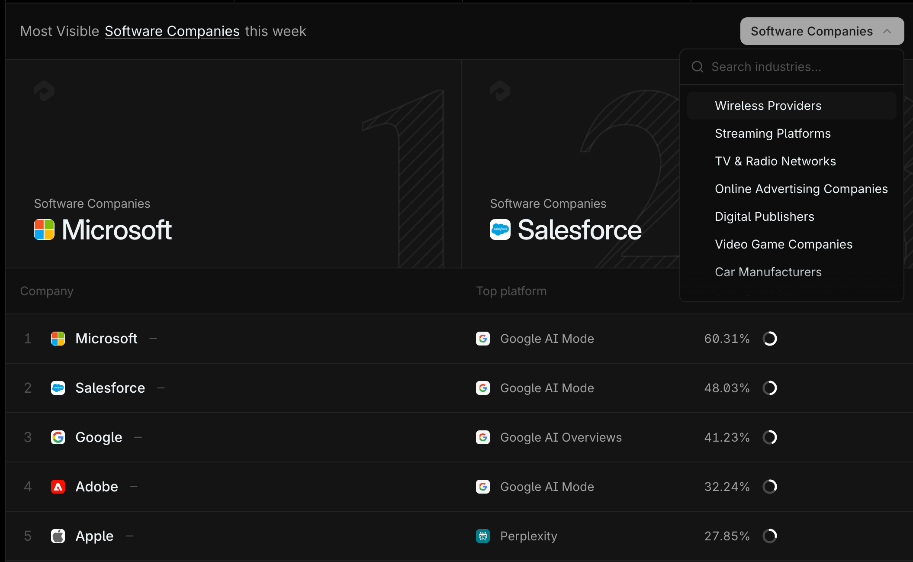

**[Profound](https://www.tryprofound.com/)** 是一款面向**企业品牌和营销**的 **GEO (Generative Engine Optimization)** 工具，专注于帮助品牌在 AI 驱动的搜索和聊天环境（如 **ChatGPT、Google AI Overviews、Perplexity** 等）中**监控和优化**自己的可见性（Visibility）。

## 产品 Slogan

在首屏以动态的形式呈现 **Profound** 的核心价值：

“Get your brand mentioned by”是固定句式，紧接着轮播各 AI chat 工具的名称和 icon，如 **ChatGPT、Perplexity、Claude** 等。这句 Slogan 简洁有力地传达了 **Profound** 帮助品牌**进入 AI 答案**的核心目标。

## 主要功能

目前 **Profound** 共有以下 4 个主要功能，共同构成了其“读/写”AI 优化平台的核心。

### [Answer Engine Insights](https://www.tryprofound.com/features/answer-engine-insights)

该功能旨在提供深入的洞察，回答“AI 引擎如何谈论你的品牌”这一关键问题。

核心能力包括：

  * 查看你的**品牌在 AI 答案中出现的频率**。
  * **了解 AI 对你的品牌和主题的描述**。
  * **找出**哪些**网站**正在**驱动 AI 对你的品牌生成答案**。

它主要通过以下几个维度来辅助评估你品牌的 **AI presence（AI 存在感）**：

  * **Visibility Scores（可见性分数）：** 通过可见性分数和**SOV (Share of Voice)** 指标，衡量你的品牌在 AI 答案中出现的频率。
  * **Sentiment & Keyword Insights（情感与关键词洞察）：** 分析 AI 如何描述你的品牌，识别出**关键主题、话题和反复出现的叙事**。
  * **Citation Authority（引用权威度）：** 查看哪些网站正在**影响 AI 对你品牌生成的答案**，并追踪这些网站的权威度。
  * **Platform Comparisons（平台对比）：** 揭示你的品牌在所有主要的 AI 引擎之间的**可见性、准确性和表现差异**。

### [Agent Analytics](https://www.tryprofound.com/features/agent-analytics)

此功能着眼于技术层面，帮助你了解 **AI 爬虫（AI bots）** 如何与你的网站互动，确保内容能被 AI 有效索引。

核心功能包括：

  * **AI Crawler Visibility（AI 爬虫可见性）：** 追踪 AI 爬虫**何时、多久、以及哪些**正在访问你的内容。
  * **Technical Analysis（技术分析）：** 确保你的网站已为基于 AI 的**索引和检索**进行充分优化。
  * **Attribution & Traffic Insights（归因与流量洞察）：** 衡量有多少**真实用户**是通过 AI 驱动的搜索**转化**而来的。
  * **Content Performance Tracking（内容表现追踪）：** 查看哪些页面**经常被 AI 生成的回答所引用**。

另外，它还支持：**直接将新内容提交给 AI 爬虫**，以实现**更快的发现和索引**。

### [Prompt Volumes](https://www.tryprofound.com/features/prompt-volumes)

如果说 SEMrush 和 ahrefs 是关键词调研工具，那么 **Profound** 这个功能更像是 **prompt（提示词）的调研工具，可以用来探索 AI 平台中的关键词和话题的查询量**。通过了解用户实际向 AI 提出的问题，品牌可以针对性地创建内容，从而提高被 AI 答案引用的机会。

### [Shopping](https://www.google.com/search?q=)

这个功能是基于 **ChatGPT Shopping** 场景的，它让你可以**查看你的产品如何呈现在 ChatGPT Shopping 中**，并帮助你**改善其位置**，从而**带来更多流量和转化**。

具体功能包括：

  * **Shopping Visibility（购物可见性）：** 通过优化你的产品在 **ChatGPT Shopping** 中的出现方式来**增加覆盖范围**。
  * **Shopping Triggers（购物触发词）：** 针对那些会**提示 ChatGPT 在你的品类中展示购物卡片**的关键词进行优化。
  * **Response Analysis（回答分析）：** 通过分析**提及你产品的输出结果**，来**完善你的产品定位**。
  * **Product Analysis（产品分析）：** 通过追踪**可见性、零售商和评论**等信息，来揭示哪些因素正在**驱动产品表现**。

## 转化路径

**Profound** 的转化路径设计，兼顾了传统企业级 SaaS 产品的特点，并创新性地加入了产品互动体验。

它包括 3 种传统的转化入口和 1 种特别的交互方式：

### Get a Demo

“Get a Demo”按钮出现在导航栏最右侧和首屏中央左侧，很明显是 **Profound** 最关注的转化入口。除了位置显眼外，还通过将按钮设计成白色以和黑色背景进行区分，突出其重要性。

点击按钮后，进入的表单页面设计简洁而专业：

表单左侧包括：

  * **表单目的简介**
  * **Demo 内容简介**
  * **客户证言**

右侧表单需填写：用户名称、工作邮箱、公司名称、公司规模、从何处得知 **Profound**，以及需特别勾选“是否为 Agency”。这套信息收集流程符合典型的 **B2B 销售线索**筛选模式，确保了潜在客户的质量。

### Get Started

相较于 Demo 表单直接展示所有需要用户填写的信息，点击“Get Started”后，用户会被引导**首先填写自己的工作邮箱**。

页面右侧设置有多个客户证言轮播，如果你感兴趣，也可以直接通过表单下方的“Schedule a call“（预约通话）预约 Demo 演示。

填写工作邮箱后，**Profound** 会进一步引导用户选择**公司规模**以及告知公司是否为 **Agency**。从下方的进度条不难看出，后面要回答的问题数量不少，这是一个**引导式、多步骤**的注册流程，有助于提升用户完成意愿并收集更详细的用户画像数据。

### Log in

比较意外的是，进入“Log in”按钮的界面和点击“Get Started”后进入的界面是同一个。这表明 **Profound** 通过内置的**逻辑判断**，在同一个页面根据用户输入的邮箱地址来判断其是**新用户（注册）还是老用户（登录）**，提供流畅且集中的入口体验。

### Analyze

以上提到的 3 个按钮都是比较传统的转化入口。如果你有耐心从首页往下滑动鼠标的话，会发现有个特别的交互模块：你可以**输入特定的网址**，然后点击“Analyze”按钮，分析这个网站的 **AI visibility**（AI 可见性）：

它并不要求你证明自己对网站的所有权。我这里以 Shopify 为例进行了测试：

可以看到它会给到一个简要的结论，告诉你这个网站目前所处的位置以及对应的竞争对手。但如果想要了解更多信息或进行下一步优化的操作，则需要**提供工作邮箱**以进入注册或登录环节。这种**免费体验**的设计，是吸引用户、展示产品价值的有效方式。

## 产品案例

**Profound** 目前共有 3 种产品解决方案，分别针对不同的企业职能团队，体现了其对企业营销组织结构的深刻理解：

  * **AEO Teams（问答引擎优化团队）：** 目标是 **Increase AI visibility（提高 AI 可见性）**。
  * **Content Teams（内容团队）：** 目标是 **Create AI-optimized content（创建 AI 优化内容）**。
  * **PR & Brand Teams（公关与品牌团队）：** 目标是 **Shape AI conversations（塑造 AI 对话）**。

## [价格体系](https://www.tryprofound.com/pricing)

**Profound** 提供 2 种收费方案，再次强调了其企业级定位：

  * **Lite：** 每月收费 **499 美元**，如果年付的话，可以享受 **15% 的折扣**。
  * **Enterprise：** 需**联系销售**进行定制报价。

具体功能方面的差异主要体现在：

  * **answer engines tracked**（追踪的问答引擎）的数量
  * **company tracked**（追踪的公司）的数量
  * **prompts tracked**（追踪的提示词）的数量
  * 专属 **Slack support**（Slack 支持）
  * 信息安全相关（**SSO、SOC2** 等）

## 引流方式

除去常规的官网页面之外，**Profound** 通过以下几个特色页面，极大地丰富了其网站内容，并有效地吸引了目标用户和行业关注：

### [Resources -\> Guides](https://www.tryprofound.com/guides)

和“customers”（讲述具体的客户案例）以及“blogs”（宣传产品功能更新）页面不同，“guides”页面介绍了 **GEO** 以及 AI 相关的**流行趋势和调研结论**，对于我们了解 AI 最新的发展状态及动向非常有帮助。这是一种典型的**内容营销**策略，旨在将自己定位为行业思想领导者。

### [AI Visibility Leaderboard](https://www.tryprofound.com/leaderboard)

通过这个页面可以 **View the top 100 most visible brands in AI search, organized by industry and updated weekly**（查看 AI 搜索中可见性最高的 100 个品牌，按行业组织并每周更新）。该榜单的强大之处在于其数据基础：它由 **Profound** 每天发送给所有主要问答引擎的 **300 多万个提示词**所驱动。比如，上周最 **visible**（可见）的软件公司是**微软**，其次是 **Salesforce**。

### [Trending Searches](https://www.tryprofound.com/trending-searches)

通过这个页面可以查看上周在 AI 对话中 **trending**（热门）的 **search**（搜索）：

这个功能巧妙地展示了其 **Prompt Volumes** 数据的价值，使用户能够实时了解 AI 搜索的脉搏。
