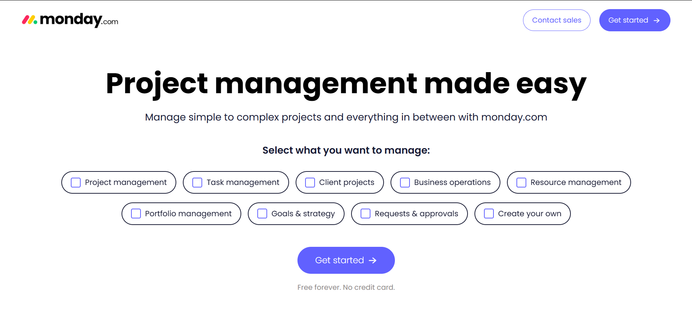
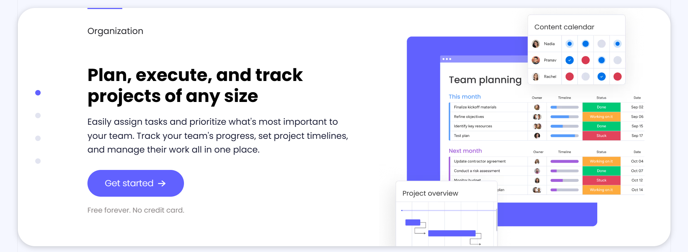
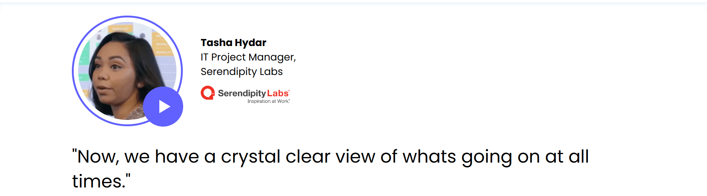
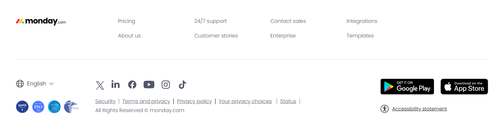
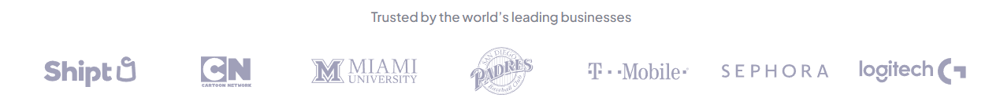
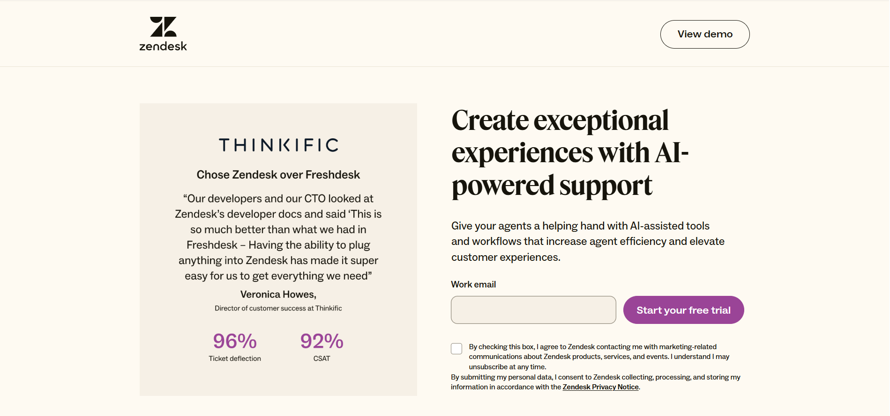
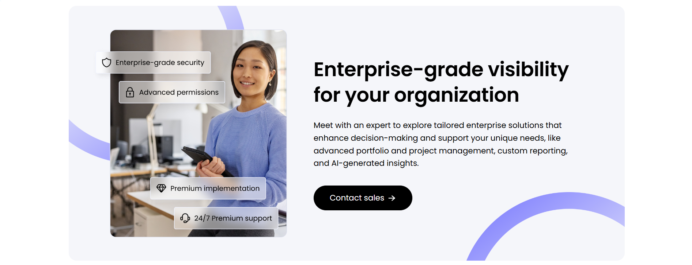

## The first issue to consider: the positioning of the landing page in the site
Considering different business goals, marketing costs and applicable scenarios, there are two forms of landing pages, each with its own advantages and disadvantages:
### Specially built landing pages
- Features:
    - Independent design: customized for specific marketing activities (such as advertising, brand activities, promotions, etc.), consistent with the official website design style, but with more streamlined and focused content
    - No navigation bar interference: usually choose to hide the global navigation bar at the top, only retain the brand logo and important buttons, avoid users jumping to other pages, and expect to guide users to complete the target conversion actions (such as registration, purchase, etc.)
- Advantages:
    - High conversion rate: present as much information as possible in a smaller layout, the content accurately matches user needs, reduces interference, and helps to improve conversion rate.
    - Support fast iteration: because it is a customized page, it has high flexibility in adjusting content and design, and will not affect other businesses.
    - Easy data analysis: the overall CTA logic of the page is basically consistent, the number of user paths is small, and only a small number of channels use this page, which is convenient for subsequent analysis of data effects.
- Disadvantages:
    - Requires additional design and development costs.
    - Weak brand credibility: Users may want to know more about the website, but dedicated landing pages generally do not provide an obvious entrance to other pages.

### Existing pages on the official website
- Features:
    - Reuse existing content: Directly use a page on the official website (such as the homepage, product page, article page) as the landing page.
    - Keep the top navigation bar: Users can understand the general structure of the website through the navigation bar and freely jump to the page they are interested in.
- Advantages:
    - Cost savings: No additional design and development involved.
    - Strengthen brand consistency: Ensure the overall experience of users on the official website, and at the same time have user comments, third-party evaluation certificates and other pages as support for brand credibility.
- Disadvantages:
    - Relatively low conversion rate: The official website content is more brand-oriented, and the information is not focused enough. Users are easily distracted by other content such as navigation bars and internal links.
    - Difficult to iterate quickly and data is mixed: Different channels will use official website pages, and content and design adjustments require the consent of multiple parties before they can be promoted. The multiple behavioral paths of users on the website also increase the difficulty of data analysis.

As for which form or website structure is better, it still depends on the brand's own focus and marketing strategy. Take the landing page of monday.com as an example: it is not difficult to find that monday.com uses the official website homepage ([https://monday.com/](https://monday.com/)) to accept users who search for its brand words, and uses dedicated landing pages (such as [https://monday.com/ap/project-management](https://monday.com/ap/project-management)) to meet users who search for other keywords (here I use project management).

## Basic page structure
### Hero Section
The first screen is the most important content in the landing page. It is the area that users can see without scrolling. It is necessary to let users understand the theme of the page in the shortest time and prompt them to take the next step.
Usually includes: title (usually brand slogan or landing page theme), subtitle (optional, usually a supplement to the title), CTA button, visual elements (such as product pictures, usage scenario pictures, dynamic demonstrations, etc.).

### Product Features (Benefits)
Used to answer the user's question "Why should I choose you" and translate the product features into actual user value.
Usually includes: functional points (clearly display the core functions of the product), user benefits (explain the benefits that product functions may bring through actual use scenarios oriented to results), visual design (assisted explanation through pictures, videos, etc.)

### Social Proof
Used to display content that enhances user trust, usually including: user reviews, success stories, brand logos of well-known customers or partners, media reports and industry awards, data endorsements (such as user numbers, growth rate and other statistical information).
Through third-party information support to reduce user decision-making doubts, thereby improving conversion rates.

### Bottom Navigation
If users still have doubts after browsing the entire page, they can quickly access other content of interest through the bottom navigation bar, and go directly to the main page of the website (such as the homepage, function details page, etc.) with one click.

## Case study
The basic structure of SaaS landing page is briefly introduced through the advertising landing page of Monday.com, ClickUp, Atlassian, Zendesk, Miro:
Note: Due to the update of page content, the content you see when you actually visit the page may be different from the screenshot in the article.
### [Monday.com](https://monday.com/ap/project-management)
#### Hero section

- Navigation bar: The complete navigation bar of the official website is not retained, only the "Contact Sales" (jump to the form page) and "Get Started" (jump to the registration page) buttons are provided
- Title: Emphasize that the product makes "project management" easy
- Subtitle: Highlight that the product can manage both simple and complex projects (making the "easy" in the title more concrete)
- Design elements: The background is blank, no pictures, mainly used to highlight the options related to the "usage scenario" in the center of the home screen, attracting users to interact (after the button is checked, the color will change, indicating that it has been selected)

#### Product features

- Interaction design: Use a card-style design to list the four core product features, and use a paging indicator to indicate the total number of cards (4 dots represent 4 cards). When the user slides down the card, the status of the small dot is updated synchronously
- Content layout:
    - Left-right structure: the left side is the title plus a detailed description, and the right side is the corresponding product UI image
    - The words above the title are very important (the upper left corner is the focus of human vision), which outlines the applicable scenarios of the product functions in the card
    - A unified CTA is set below the description to facilitate interested users to directly click and register
    - The price and payment requirements of the product are supplemented in low-saturation gray below the CTA to further dispel possible user doubts

#### Social proof
There are 4 obvious social proof modules on the entire page, with various forms of display:
1. Customer logo banner (below the first screen)

2. Statistical data on product efficiency improvement, including ROI, hours saved, number of meetings reduced, and net value increased (from the authoritative third party FORRESTER) (below the product function introduction)

3. Customer testimonials (below efficiency statistics)

4. G2 awards, including product usability, industry status, user experience, etc. (below customer testimonials)

#### Bottom navigation bar

Provides multiple entrances to other websites or pages, mainly to improve user experience and enhance brand credibility, including:

- Other important pages of the website, such as pricing page, customer support page, company introduction page, template page, etc.

- Official social media pages, such as YouTube, LinkedIn, TikTok, etc.

- Industry qualification certification, terms of service, privacy policy

- Ease of use function: multi-language selection button, app store download entrance

### [ClickUp](https://clickup.com/lp)
#### Hero section

- Navigation bar: only keep 4 important buttons: brand logo + slogan, contact sales, login, register. The registration button is highlighted with a prominent color
- Title: Emphasizes the usage scenario (when working) and the scope of application (everything)
- Subtitle: Emphasizes that the product can satisfy everyone working on a common platform
- Design elements: The background is blank, the most eye-catching is the "Get Started" button in the center of the screen, and emphasizes "free"

#### Product features

- Interaction design: List the core product features in the form of flat cards (but the number of cards in each row may not be the same)
- Content layout: Each card has a fixed content structure: title, description, corresponding product/concept map, basically no CTA

#### Social proof
1. Customer logo banner (below the first screen)

2. Statistics on the number of product users and features, including: number of completed tasks, number of documents created, number of messages sent, number of automation created, and CTA (this module is placed together with the product feature introduction module)

#### Bottom navigation bar
Very simple, only retains copyright notice, privacy terms, terms of use, etc.

### [Atlassian](https://www.atlassian.com/software/jira?campaign=18442480203&adgroup=140479881486&targetid=kwd-855725830&matchtype=e&network=g&device=c&device_model=&creative=687972959756&keyword=jira&placement=&target=&ds_eid=700000001558501&ds_e1=GOOGLE&gad_source=1&gbraid=0AAAAAD_uzhDFBmyCDfEZwGlrdhTN56y_i&gclid=Cj0KCQjwqv2_BhC0ARIsAFb5Ac8l-8CF1SkxUNzUAO-hB0_Jkt0fSG2emVrYirWB6PFu16IscH4m9wMaAv0OEALw_wcB)
#### Hero section

- Navigation bar: only keep the brand logo
- Title: indirectly and clearly state the applicable objects of the product - team, task, project. No subtitle
- Design elements:
    - Six common team types are listed at the top
    - The overall structure is left and right, with a form on the left. Users can directly fill in their work email address to complete the registration, or choose to log in with a third-party account such as Google or Microsoft.

#### Product features
There are two different content interaction designs at the same time:
1. Tabbed modules:
- Each core function has a separate tab, including: boards, timeline, reports, automation
- Each tab is further introduced with detailed functions and usage scenarios, such as scrum boards and kanban boards under "Boards", and the corresponding product screenshots are provided on the right

2. Left and right tiled structure
- Extract a single function from the above tab and briefly introduce its value in actual business scenarios
- To avoid visual fatigue, the positions of text and pictures are displayed in alternating order

#### Social proof
1. Scrolling customer logo banner (below the registration form)

2. Static customer logo banner (near the end of the page)

#### Bottom navigation bar

It is consistent with the bottom navigation bar of the official website, allowing users to jump to other core pages of the website, including:
- Product details page
- Official resources, such as technical support, pricing page, community, knowledge base, etc.
- Developer documentation, enterprise services, training & certificates, etc.
- Other core pages, such as company introduction, recruitment, recent events, blogs, foundations, etc.

### [Zendesk](https://www.zendesk.com/lp/nb-support-join-the-champions)
#### Hero section

- Navigation bar: The complete navigation bar of the official website is not retained, only the "Contact Sales" (jump to the form page) and "Get Started" (jump to the registration page) buttons are provided
- Title: Emphasize that the product makes "project management" easy
- Subtitle: Highlight that the product can manage both simple and complex projects (making the "easy" in the title more concrete)
- Design elements: The background is blank, no pictures, mainly used to highlight the options related to the "usage scenario" in the center of the home screen to attract users to interact (after the button is checked, the color will change, indicating that it has been selected)

#### Product features
- Compare the key functional differences between Zendesk and other competitors in the form of a table
- Highlight Zendesk's advantages in specific usage scenarios (such as AI and machine learning), which competitors do not support

#### Social proof
1. Customer logo banner + G2 awards (including product usability, industry status, etc.) (located below the home screen)

2. Product efficiency statistics, including support operations visibility, satisfaction, agent productivity (below the product function introduction)

3. Industry awards, such as Capterra, TrustRadius, etc. (below the efficiency statistics)

#### Bottom navigation bar
Only copyright notice, privacy terms, terms of use, etc. are retained.

### [Miro](https://miro.com/)
#### Hero section

- Navigation bar: The complete navigation bar of the official website is not retained, only the "Contact Sales" (jump to the form page) and "Get Started" (jump to the registration page) buttons are provided
- Title: Emphasize that the product makes "project management" easy
- Subtitle: Highlight that the product can manage both simple and complex projects (making the "easy" in the title more concrete)
- Design elements: The background is blank, no pictures, mainly used to highlight the options related to the "usage scenario" in the center of the home screen, attracting users to interact (after the button is checked, the color will change, indicating that it has been selected)

#### Product features

- Interaction design: The whole screen range of the dynamic picture is matched with three tabs, and the corresponding product user interface dynamic picture is displayed when the tab is clicked
- Content layout:
- Three tabs side by side
- Each tab contains a short title and a detailed description (about 3-5 lines)

#### Social proof

Only the customer logo banner, located below the first screen:
- Two rows in total, slowly sliding to both sides
- When the mouse moves to the top, the words "Meet our customers" will be displayed, and click to jump to the customer case page

#### Bottom navigation bar

Similar to the bottom structure logic of Monday.com, it includes other important page entrances, official social media entrances, language switching buttons, app download buttons, etc.

## Element details
### CTA (Call to Action)
It is an interactive element that guides users to perform key operations, and is commonly in the form of buttons and links.

#### Core components:
1. Copy: verb + result (such as "register now", "free download")
2. Visual design: color, shape, size must contrast with the page (such as bright button + white/dark background)
3. Position: frequently appear at key decision points (such as the top of the page, the end of the function description, etc.)

#### Common types:
1. Primary CTA: core conversion goal (such as "free trial", "buy now").
2. Secondary CTA: auxiliary options (such as "watch demo", "contact sales").
3. Text CTA: hyperlink form (such as "click to view case").

### Brand logo in the navigation bar
The top and bottom brand logos have different functions:
- Brand logo in the top navigation bar:
    - Usually fixed in the upper left corner of the page (following the user's reading habit from left to right)
    - The first visual logo that users notice when entering the website is the user's first impression of the brand
- Brand logo in the bottom navigation bar:
    - Usually located in the bottom left corner of the page, often close to copyright information or contact information
    - It is convenient for users to deepen their brand memory after browsing the page and achieve secondary brand exposure

### Whether sales intervention is needed

Based on the characteristics and technical requirements of different SaaS products, individual users can register directly on the website and then purchase. But for team or even enterprise-level customers, dedicated sales and technical consultants are needed to answer related questions. At this time, a dedicated CTA or content module is needed to guide such customers to complete registration or schedule a demonstration.
