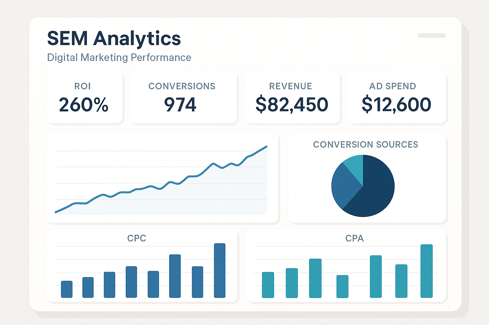
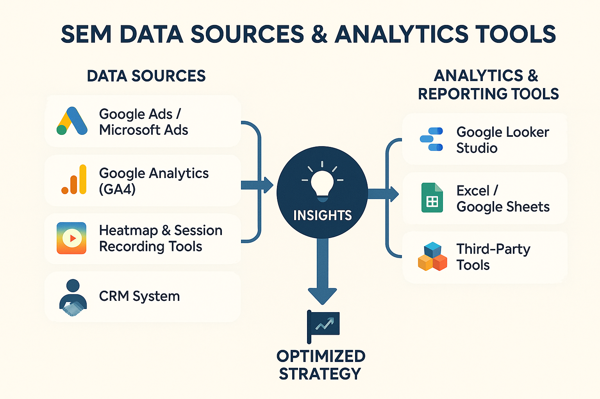

## 什么是 SEM 分析？

在搜索引擎营销（SEM）的战场上，广告投放只成功了一半。真正能让你脱颖而出，甚至超越竞争对手的，是**SEM 分析**。它就像你广告策略的“眼睛”和“大脑”，帮助你理解发生了什么，为什么发生，以及接下来应该怎么做。

简单来说，**SEM 分析是一个系统性地收集、测量、分析和报告搜索引擎营销相关数据的过程。** 这些数据包括但不限于：你的广告被看了多少次（**展示次数**）、被点击了多少次（**点击次数**）、带来了多少次转化（**转化次数**）、以及你为此支付了多少钱（**广告费用**）。通过深入挖掘这些数据，你能全面评估广告活动表现，识别潜在的优化机会，并为未来的营销策略提供坚实的数据支持。

如果你没有做 SEM 分析，那么你的广告投放就像在黑暗中盲目前行。你不知道哪些关键词有效，哪些广告文案吸引人，哪些落地页能促成转化，也不知道每一分钱花得值不值。这不仅意味着巨大的资源浪费，更可能让你错失市场机遇。

## SEM 分析的核心指标：你需要关注什么？

你已经知道 SEM 分析的重要性，但面对 Google Ads 报表里密密麻麻的数字，该从何看起呢？就像医生诊断病情需要关注关键生命体征一样，SEM 分析也有一套**核心指标 (Key Performance Indicators, KPIs)**。了解并持续跟踪这些 **KPIs**，是有效分析和优化广告效果的基础。

这些指标分可以分为几大类：

### 流量指标：广告可见度与吸引力

这些指标主要反映你的广告被看到了多少次，以及用户是否被它吸引并点击。

  * **展示次数 (Impressions)：**
    你的广告在搜索结果页面或其他 Google 网络中被展示的**总次数**。这个指标衡量的是你的**广告可见度**。高的展示次数意味着你的广告有很大的曝光量，但它本身并不直接代表效果。在**品牌知名度推广**阶段，或者当你需要**检查关键词是否有足够的搜索量**时，这个指标尤其重要。

  * **点击次数 (Clicks)：**
    用户实际点击你的广告的**总次数**。这表明用户对你的广告内容或产品/服务产生了兴趣。在**任何广告系列**中，特别是**以获取流量为目标**的广告系列，点击次数都是一个核心指标。

  * **点击率 (CTR - Click-Through Rate)：**
    计算公式：**(点击次数 / 展示次数) x 100%**
    **CTR** 是一个非常重要的指标，它衡量了你的广告对用户的**吸引力与相关性**。高 CTR 表明你的广告文案、关键词定位和广告扩展都做得不错，能够有效吸引目标用户。同时，**CTR 也是影响广告质量得分的关键因素之一**。持续关注 CTR 至关重要，因为**低 CTR 可能意味着广告文案不佳、关键词相关性低，或者广告定位不准**。你可以通过优化 **[《撰写高转化 SEM 文案的关键技巧》](https://chloevolution.com/zh-cn/posts/create-sem-copy/)** 和使用相关的广告扩展来提升它。

### 成本指标：预算效率与位置竞争

这些指标帮助你理解广告花费，以及你在竞价中的位置表现。

  * **每次点击费用 (CPC - Cost Per Click)：**
    计算公式：**总费用 / 点击次数**
    你为每次点击广告所支付的**平均费用**。这是衡量广告**成本效率**的核心指标。高 CPC 会直接吞噬你的预算，降低投资回报。你需要持续关注 CPC，并检查是否能通过提高 **[《SEM 竞价的核心机制：广告评级与质量得分》](https://chloevolution.com/zh-cn/posts/sem-bidding/)** 中提到的质量得分来降低 CPC，或调整竞价策略。

  * **总费用 (Cost)：**
    在特定时间段内，你的广告活动**总共花费的金额**。这是**预算管理**的基础，你需要每日、每周、每月关注它，确保广告支出在预算范围内。

  * **平均排名 / 排名位置 (Avg. Position / Top of Page / Absolute Top)：**

      * **平均排名 (Avg. Position)**：这是 Google Ads 早期使用的指标，表示广告在搜索结果页的平均位置。
      * **首页顶部展示百分比 (Impressions (Top) %)**：你的广告展示在搜索结果首页顶部的百分比。
      * **绝对顶部展示百分比 (Impressions (Abs. Top) %)**：你的广告展示在搜索结果页面第一个位置的百分比。
        这些指标反映了你的广告在页面上的**可见度和竞争力**。越靠前的位置通常意味着更高的 CTR 和更多点击，但可能也意味着更高的 CPC。当你对**广告可见度和位置有明确要求**时，例如在**品牌知名度推广**或在**激烈竞争中争取优势**时，这些指标非常关键。

### 转化指标：广告效果的核心衡量

这些是直接关系到你业务目标的核心指标，反映了广告带来的实际价值。

  * **转化次数 (Conversions)：**
    用户完成你预设的**目标行为**的次数，例如购买产品、填写表单、下载资料、拨打电话等。这是衡量广告系列**业务成果**的最重要指标，你**应该始终关注**它，因为它是广告活动成功的最终体现。

  * **转化率 (Conversion Rate)：**
    计算公式：**(转化次数 / 点击次数) x 100%**
    **转化率**衡量的是你的广告和**落地页**将点击用户转化为目标客户的效率。高转化率意味着你的广告吸引了正确的受众，并且你的落地页能够有效地引导他们完成转化。你需要持续关注转化率，**低转化率可能表明你的广告信息与落地页不符，或者落地页体验不佳**。提升转化率是 **[《落地页优化终极指南](https://chloevolution.com/zh-cn/posts/landing-page-optimization/)** 的核心目标。

  * **每次转化费用 (CPA - Cost Per Acquisition/Action)：**
    计算公式：**总费用 / 转化次数**
    获取一个**转化所需的平均成本**。这是评估广告系列**盈利能力和效率**的关键指标。理想的 CPA 应该低于你通过每次转化所能获得的利润。你需要持续关注 CPA，**确保其在可接受的范围内以保持盈利**。

  * **转化价值 (Conversion Value)：**
    所有**转化所产生的总价值**。对于**电商**或可以为不同转化行为分配价值的业务（例如，高价值产品查询的转化价值高于资料下载），这个指标至关重要。

  * **广告支出回报率 (ROAS - Return On Ad Spend)：**
    计算公式：**(转化价值 / 总费用) x 100%**
    **ROAS** 衡量的是每投入 1 份广告费用，能带来多少份转化价值。它直接反映了广告投入的**盈利能力和效率**。例如，200% 的 ROAS 意味着每花 1 元广告费，能带来 2 元的销售额。ROAS 是**电商和所有以盈利为导向的广告系列**衡量整体效果的终极指标之一。

### 落地页表现指标：用户体验与后端承接

这些指标揭示了用户在点击广告到达落地页后的行为，是评估落地页质量和用户体验的关键。

  * **平均会话时长 (Average Session Duration)：**
    用户在你的落地页上停留的**平均时间**。较长的会话时长通常表明用户对页面内容感兴趣并进行了互动。你需要关注它来**衡量内容吸引力和用户参与度**。过短的停留时间可能意味着页面内容不符预期或难以理解。

  * **跳出率 (Bounce Rate)：**
    用户只访问了你落地页的**一个页面就离开的百分比**。高跳出率通常是一个警示信号，可能表明落地页未能满足用户期望，或存在可用性问题。你需要持续关注跳出率，**因为它会严重影响转化率和广告质量得分**。

  * **退出率 (Exit Rate)：**
    用户在访问了你落地页（以及可能其他页面）后，**从该页面离开网站的百分比**。这个指标可以帮助你**识别用户流程中的断点或内容结束点**，从而优化用户旅程。

  * **页面加载速度 (Page Load Speed)：**
    落地页完全加载所需的时间。**加载速度**是用户体验的基石。缓慢的页面加载会导致用户流失，尤其是在移动设备上，并会负面影响**广告质量得分**。你需要持续监控页面加载速度，并利用 Google PageSpeed Insights 等工具进行检测和优化。提升页面加载速度是 **[《落地页优化终极指南》](https://chloevolution.com/zh-cn/posts/landing-page-optimization/)** 中的重要一环。

### 质量指标：效率提升的杠杆

这个指标虽然不是直接的业务成果，但它对你的成本和排名有着巨大的间接影响。

  * **质量得分 (Quality Score)：**
    Google 对你的**关键词、广告文案和落地页的整体相关性与质量的评分**（1-10分）。高质量得分意味着你的广告系统更符合 Google 为用户提供优质体验的原则，因此 Google 会“奖励”你。**[《SEM 竞价策略全攻略》](https://chloevolution.com/zh-cn/posts/sem-bidding/)** 中详细说明了质量得分如何帮助你以更低的 CPC 获得更好的广告排名，从而降低成本、提升效果。因此，持续关注并**提升质量得分是优化广告效率的重要途径**。

## SEM 数据来源与分析工具

明确了 SEM 分析的核心指标后，下一步就是如何获取和处理这些数据。在 SEM 领域，数据是做出明智决策的基础，而正确的工具能帮助我们将这些原始数据转化为有价值的洞察，从而优化广告效果。

### 主要数据来源

你的 SEM 数据分散在多个平台中，你需要将它们视为一个整体来理解用户行为和广告效果。

  * **Google Ads / Microsoft Ads 平台：**
    这是你**最直接、最全面**的广告数据来源。广告平台内置的报告功能提供了关于你的广告系列、广告组、关键词、广告文案和出价策略的所有核心数据。

      * **提供数据：** 展示次数、点击次数、费用、转化次数、转化率、每次点击费用 (CPC)、每次转化费用 (CPA)、广告排名、搜索词报告、受众数据等。
      * **重要性：** 你在此设置广告、管理预算、选择竞价策略，所有广告执行层面的数据都来源于此。

  * **Google Analytics (GA4)：**
    Google Analytics 是一个强大的**网站行为分析工具**，它提供了广告平台无法提供的**用户在你的网站上做了什么**的深度数据。将 GA4 与 Google Ads 关联后，你可以看到用户点击广告后在网站上的完整旅程。

      * **提供数据：** 用户来源、新用户与回访用户、平均会话时长、跳出率、退出率、用户在站内页面的浏览路径、完成的深度转化（如页面滚动深度、特定按钮点击）、人口统计学信息、兴趣等。
      * **重要性：** 帮助你理解广告流量的质量，**[《落地页优化终极指南》](https://chloevolution.com/zh-cn/posts/landing-page-optimization/)** 中强调的落地页效果数据，大部分都来源于 GA4。通过 GA4 你能看到广告点击如何转化为实际的网站互动和业务价值。

  * **热力图与用户会话录制工具 (例如 Hotjar, Microsoft Clarity)：**
    这些工具提供了**落地页上的用户行为细节**，是定性分析的重要补充。它们将抽象的数据转化为直观的视觉反馈。

      * **提供数据：**
          * **热力图 (Heatmaps)：** 显示用户在页面上的点击位置、滚动深度、鼠标移动轨迹，揭示用户最关注和忽视的区域。
          * **会话录制 (Session Recordings)：** 录制匿名用户的真实浏览过程，让你像看视频一样观察用户如何与页面互动，在哪里遇到困难，在哪里犹豫。
      * **重要性：** 它们直接展示了用户在 **[《落地页优化终极指南》](https://chloevolution.com/zh-cn/posts/landing-page-optimization/)** 中提到的落地页上的体验，帮助你直观发现可用性问题、内容布局缺陷和转化障碍。

  * **客户关系管理 (CRM) 系统：**
    如果你的业务涉及**线下销售、电话销售或需要长期跟进的潜在客户**，CRM 系统是连接线上广告投入与最终业务成果的关键。

      * **提供数据：** 客户的生命周期价值 (LTV)、销售阶段、销售额、客户画像等。
      * **常见 CRM 系统包括：** Salesforce, HubSpot, Zoho CRM 等。
      * **重要性：** 允许你追踪**更高价值的后端转化**，例如从潜在客户到签约客户的转化。通过将 CRM 数据回传到 Google Ads（通常通过离线转化导入），可以为 AI 智能竞价提供更全面的优化依据。

### 分析与报告工具

仅仅拥有数据还不够，你需要工具来处理、整合、分析和可视化这些数据，从中提取有价值的洞察。

  * **Google Ads / Microsoft Ads 报告界面：**
    这些平台内置了强大的报告功能，你可以直接在界面中**定制各种维度和指标的报告**。它们是最便捷的初步分析工具。

      * **优势：** 数据即时、维度丰富，可以直接筛选和对比。
      * **适用场景：** 日常监控、快速检查广告系列表现、关键词分析、搜索词报告。

  * **Google Analytics 报告：**
    GA4 的报告界面允许你**结合广告数据进行全链路分析**，从广告点击到网站行为再到最终转化。它能帮你理解广告带来的用户质量和行为模式。

      * **优势：** 深度用户行为洞察、多渠道归因、自定义事件追踪。
      * **适用场景：** 分析流量质量、用户旅程、落地页效果、网站转化路径。

  * **Google Looker Studio (原 Google Data Studio)：**
    Google Looker Studio 是一款**免费的数据可视化工具**，能将你的各种数据源（如 Google Ads, GA4, Sheets, CRM 等）整合到一个仪表盘中，**创建定制化、自动化、交互式的报告**。

      * **优势：** 强大的数据整合能力、灵活的报表定制、自动化刷新、易于分享。
      * **适用场景：** 构建综合性的 SEM 效果报告、实时监控仪表盘、向客户或管理层展示数据。

  * **Excel / Google Sheets：**
    对于更深度的**数据处理、计算和自定义分析**，传统的电子表格工具仍然不可或缺。你可以导出各个平台的数据，在表格中进行透视分析、高级筛选、自定义公式计算等。

      * **优势：** 极高的灵活性和自定义能力，适用于复杂的数据清洗和建模。
      * **适用场景：** 离线数据分析、临时性数据探索、复杂的财务分析、小规模数据整合。

  * **第三方工具：**
    市场上有许多专业的第三方工具，它们在某些特定领域提供更强大的功能。

      * **数据连接器 (例如 Supermetrics, Funnel)：** 帮助你将各种营销平台的数据自动导入到 Looker Studio, Excel 或其他数据仓库，实现数据整合自动化。
      * **竞品分析工具 (例如 SEMrush, Ahrefs)：** 提供竞争对手的关键词策略、广告文案、预算估算等情报，帮助你进行 **[《SEM 竞价策略全攻略》](https://chloevolution.com/zh-cn/posts/sem-bidding/)** 中提到的竞争对手分析。
      * **更高级的 BI 工具 (例如 Tableau, Power BI)：** 对于拥有大量数据和复杂分析需求的企业，这些工具提供更强大的数据建模和可视化能力。

## 如何从数据中找到优化点？

理解了 SEM 分析的核心指标和数据来源，接下来就是最关键的一步：**如何将这些原始数据转化为可执行的优化策略？** 这就像拥有了一张藏宝图和寻宝工具，你需要知道如何解读地图上的标记，才能找到宝藏。

### 1. 关键词层面的优化：提升流量质量与成本效率

关键词是广告与用户连接的第一道桥梁，也是数据分析和优化的重要切入点。

  * **识别高成本低转化关键词：**
    深入分析你的关键词报告，找出那些**消费高但转化次数极少或转化成本（CPA）过高**的关键词。
      * **应对策略：** 针对这些关键词，你可以选择**暂停投放**、**降低出价**，或者检查其广告文案和落地页是否足够相关。
  * **识别低点击率 (CTR) 关键词：**
    关注那些展示次数高但 CTR 远低于平均水平的关键词。这可能意味着你的广告文案对这些关键词的搜索意图不够吸引人，或者相关性不足。
      * **应对策略：** 尝试**改进广告文案**使其与关键词更匹配，或将其**移动到更相关的广告组**以获得更具针对性的广告。
  * **发现新的高潜力关键词：**
    查看**搜索词报告**（Search Term Report）。这里会显示用户实际搜索了哪些词语触发了你的广告。你可能会发现一些意料之外但相关性高、转化效果好的长尾关键词。
      * **应对策略：** 将这些有价值的搜索词添加为新的**精准关键词**，并创建专门的广告组和文案来捕获这些高质量流量。这部分内容在 **[《AI 时代下的关键词研究与定位》](https://chloevolution.com/zh-cn/posts/keyword-research-and-targeting/)** 中有更详细的探讨。
  * **持续添加否定关键词：**
    在搜索词报告中，你也会发现一些**不相关或转化意图不明确的搜索词**。例如，如果你销售的是新产品，搜索“二手 [你的产品]”的用户就不太可能转化。
      * **应对策略：** 及时将这些词添加为**否定关键词**，可以有效避免广告在不相关搜索中展示，减少不必要的点击浪费，从而提升广告相关性和**质量得分**。

### 2. 广告文案与广告组优化：提升吸引力与相关性

广告文案是直接吸引用户点击的元素，而广告组的结构则影响着广告的相关性。

  * **A/B 测试不同的广告文案：**
    不要满足于现状，持续测试是提升广告效果的王道。
      * **应对策略：** 创建多组不同的标题、描述和广告扩展。通过**A/B 测试**，对比它们的点击率 (CTR)、转化率和 CPA，找出表现最佳的创意。你可以测试不同的**号召性用语 (CTA)**、**独特卖点 (USP)** 或情感诉求。
  * **查看广告效果报告：**
    在广告平台中，通常可以查看每个广告的具体表现。
      * **应对策略：** 识别那些**高 CTR 和高转化率的广告**，并暂停那些表现显著低于平均水平的广告。这能确保你的广告预算只花在最有效的创意上。
  * **确保广告与关键词高度相关：**
    一个好的广告文案应该能直接回应用户的搜索意图。
      * **应对策略：** 检查广告组内的关键词与广告文案（特别是标题和描述）之间是否存在语义上的高度匹配。高相关性不仅能吸引正确的用户，还能**提高广告质量得分**，从而降低你的 CPC。更多技巧请参考 **[《撰写高转化 SEM 文案的关键技巧》](https://chloevolution.com/zh-cn/posts/create-sem-copy/)**。

### 3. 落地页优化：转化漏斗的最终环节

即使广告点击率再高，如果落地页体验不佳，用户也会流失。落地页是转化发生的最终场所。

  * **分析落地页转化率：**
    这是最直接的指标。识别那些**转化率低于平均水平**的落地页。
      * **应对策略：** 对这些页面进行深入分析，找出可能存在的问题。
  * **检查跳出率、平均会话时长和页面加载速度：**
    这些指标反映了用户在落地页上的互动和体验。**高跳出率或短停留时间**可能是落地页内容不符预期、导航不清晰或用户体验差的信号。**缓慢的页面加载速度**会严重损害用户耐心。
      * **应对策略：** 利用 Google Analytics (GA4) 洞察这些数据，并通过**热力图和用户会话录制工具**（如 Hotjar、Clarity）直观了解用户行为。找出用户在哪里受阻、哪里感到困惑。
  * **进行 A/B 测试：**
    对落地页的各个元素进行测试，找出最能提升转化的版本。
      * **应对策略：** 优化落地页的**布局、文案、图片、表单设计、号召性用语 (CTA) 按钮颜色和位置**等。具体方法可以参考 **[《落地页优化终极指南》](https://chloevolution.com/zh-cn/posts/landing-page-optimization/)**。

### 4. 竞价策略与预算优化：提升效率与控制成本

正确的竞价策略和合理的预算分配能确保你的广告以最佳方式参与竞价。

  * **评估智能竞价效果：**
    如果你在使用智能竞价，需要定期检查其是否**达成目标 CPA 或 ROAS**。
      * **应对策略：** 如果效果不达标，可以**调整智能竞价的目标值**（例如，提高目标 CPA 以获取更多转化，或降低目标 ROAS 以提升盈利），或者检查是否有足够的转化数据支持 AI 学习。
  * **分析设备、地理位置、时间报告：**
    用户在不同设备、地理位置或时间段的行为和转化率可能存在显著差异。
      * **应对策略：** 识别这些差异，并设置**出价调整 (Bid Adjustments)**。例如，如果在移动设备上的转化率更高且 CPA 可控，可以提高移动端的出价调整，以获取更多移动流量。更多关于出价调整的细节，请参考 **[《SEM 竞价策略全攻略》](https://chloevolution.com/zh-cn/posts/sem-bidding/)**。
  * **预算分配：**
    持续监控不同广告系列或广告组的**广告支出回报率 (ROAS)** 或**每次转化费用 (CPA)**。
      * **应对策略：** 根据表现动态调整预算分配。将更多预算投入到**高 ROI 或低 CPA** 的广告系列中，并削减那些表现不佳的部分，以最大化整体效益。

### 5. 竞争对手分析：知己知彼，制定更优策略

你的广告表现不是孤立的，它时刻受到竞争环境的影响。

  * **利用竞价洞察报告 (Auction Insights Report)：**
    Google Ads 提供的竞价洞察报告能让你了解竞争对手的**展示份额、重叠率、排名**等数据。
      * **应对策略：** 如果竞争对手的展示份额显著提升而你的下降，你可能需要考虑**提高出价**，或通过优化**质量得分**来提升广告评级。
  * **分析竞品广告创意和落地页：**
    通过搜索你的目标关键词，观察竞争对手的广告文案、广告扩展和落地页。
      * **应对策略：** 学习他们的优点，发现他们的不足，从而优化你自己的广告创意和用户体验，找到**差异化优势**。这些分析能为你提供 **[《SEM 竞价策略全攻略》](https://chloevolution.com/zh-cn/posts/sem-bidding/)** 中的竞争洞察。

## 常见问题解答 (FAQ)

### Q1：如何判断我的广告数据是好是坏？

判断广告数据的好坏，不能简单看一个数字，需要**结合你的业务目标、行业基准和历史表现**来综合评估。

  * **对照业务目标：** 你的广告系列目标是提高品牌知名度、获取潜在客户还是促进销售？
      * 如果目标是**品牌知名度**，你可能更关注**展示次数、点击率 (CTR)**。
      * 如果目标是**潜在客户或销售**，那么**转化次数、转化率、每次转化费用 (CPA) 和广告支出回报率 (ROAS)** 才是核心。如果 CPA 低于你的利润预期，ROAS 远高于投入，那么数据通常是“好”的。
  * **参考行业基准：** 你的行业平均 CTR、CPA、ROAS 是多少？虽然每个账户都独一无二，但行业平均值能提供一个大致的参考范围。你可以通过一些第三方报告或工具（如 Google Ads 提供的基准数据）来了解。此外，你也可以利用我们的 **[计算器工具](https://chloevolution.com/tools/)** 来快速计算和分析你的指标，与行业平均值进行对比。
  * **与历史数据对比：** 对比你的广告数据与上周、上月或去年同期的数据，看是上升还是下降。持续的进步才是真正的“好”。
  * **与其他广告系列对比：** 如果你在运行多个广告系列，可以对比它们的表现。找出效果最好的，分析其成功原因；找出效果最差的，寻找优化点。

### Q2：我应该多久分析一次 SEM 数据？

分析频率取决于你的**广告预算、广告系列类型、变化速度以及团队资源**。没有一刀切的答案，但你可以参考以下建议：

  * **日常监控 (Daily)：** 每天快速查看**核心指标概览**（如费用、点击、转化量、CPA），确保没有异常波动（例如预算超支、转化骤降）。这有助于及时发现问题并采取纠正措施。
  * **每周深入分析 (Weekly)：** 每周进行一次更详细的分析，审查**关键词、广告组、广告文案、搜索词报告**的表现。这是发现优化机会和进行调整（如添加否定关键词、测试新广告、调整出价）的最佳频率。
  * **每月/季度战略回顾 (Monthly/Quarterly)：** 每月或每季度进行一次宏观回顾，评估**整体 ROI、不同广告系列的效果、预算分配是否合理**，并结合业务目标调整长期策略。这是为管理层或客户准备综合报告的好时机。
  * **利用 AI 提升效率：** AI 工具可以帮助你自动化部分监控和报告工作，提供智能洞察和异常预警。

### Q3：Google Ads 和 Google Analytics 数据不一致怎么办？

数据不一致是常见问题，通常是由于不同的数据收集和处理机制造成的。以下是一些常见原因及排查方法：

  * **归因模型不同：** Google Ads 默认使用“最终点击”归因模型（除非你修改），而 Google Analytics 通常使用“数据驱动”或“最终非直接点击”归因模型。不同的归因模型会导致转化计数差异。
  * **数据延迟：** Google Ads 数据通常更快更新，而 Google Analytics 数据可能会有几小时的延迟。
  * **时区设置：** 确保 Google Ads 账户和 Google Analytics 媒体资源的**时区设置一致**。
  * **转化计数方式：**
      * Google Ads 可以在一天内为同一个用户记录多次转化，而 Google Analytics 默认每次会话只记录一次。
      * 检查转化事件在两个平台上的定义是否完全一致。
  * **追踪代码问题：** 确保你的网站正确安装了**Google Ads 转化追踪代码**和 **Google Analytics (GA4) 代码**，并且没有重复或错误。检查是否存在代码冲突。
  * **跨设备/跨域追踪：** 如果用户在不同设备上转化，或跨子域名/不同域名跳转，追踪设置不当可能导致数据丢失。
  * **排查步骤：**
    1.  **检查时区和归因模型设置。**
    2.  **验证转化事件定义和代码安装。** 使用 Google Tag Assistant 等工具进行调试。
    3.  **对比小范围数据。** 选择一天或一周的数据进行详细对比，而非长期累计数据，更容易发现问题。

### Q4：哪些报告是 SEM 优化师必看的？

作为 SEM 优化师，以下几类报告是你日常工作不可或缺的：

  * **搜索词报告 (Search Term Report)：** 最重要的报告之一！它告诉你用户实际搜索了哪些词来触发你的广告。
      * **用途：** 发现新的高潜力关键词，添加否定关键词，优化广告文案。
  * **关键词报告 (Keyword Report)：** 查看每个关键词的点击、展示、转化、费用等表现。
      * **用途：** 调整关键词出价，暂停低效关键词，调整匹配类型。
  * **广告报告 (Ads Report)：** 对比不同广告文案和广告扩展的表现。
      * **用途：** 进行 A/B 测试，暂停表现不佳的广告，识别最佳创意。
  * **广告组报告 (Ad Group Report)：** 了解不同广告组的整体表现。
      * **用途：** 评估账户结构，识别需要优化的广告组。
  * **设备报告 (Device Report)：** 比较广告在不同设备（移动、桌面、平板）上的表现。
      * **用途：** 设置设备出价调整，优化移动端落地页。
  * **竞价洞察报告 (Auction Insights Report)：** 了解你在竞争对手中的表现。
      * **用途：** 评估竞争态势，调整竞价策略。

### Q5：如何向非营销人员解释 SEM 报告？

向非营销人员（如管理层或客户）解释 SEM 报告，关键在于**简洁、直观，并聚焦于业务成果和建议**，而非营销术语。

  * **聚焦业务目标：** 报告开头直接说明“我们的目标是什么？目前进展如何？”（例如：本月销售额增长了 X%，潜在客户成本降低了 Y%）。
  * **使用通俗易懂的语言：** 避免使用“CPC”、“CPA”、“ROAS”等缩写，如果必须使用，一定要解释清楚。例如，可以说“获取一个客户的成本”而不是“CPA”。
  * **强调关键指标：** 只展示与业务成果最直接相关的 3-5 个核心指标，如**转化量、总费用和投资回报率**。避免堆砌过多细节。
  * **可视化呈现：** 多使用**图表、图形**来展示趋势和对比，而非纯数字表格。例如，用趋势图展示销售额增长，用饼图展示不同产品线的贡献。**Google Looker Studio** 是一个非常好的工具，可以创建清晰、自动化的报告。
  * **提供洞察和建议：** 最重要的是，不要只展示数据，要解释数据背后意味着什么，以及基于这些洞察，你**接下来会怎么做**。例如：“我们发现移动端转化率更高，因此下个月我们会增加移动端的预算投入。”

