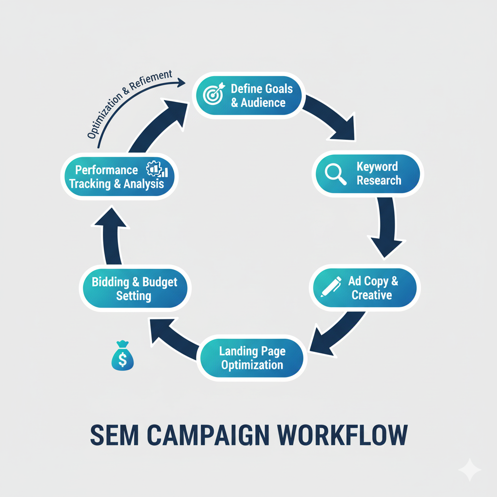
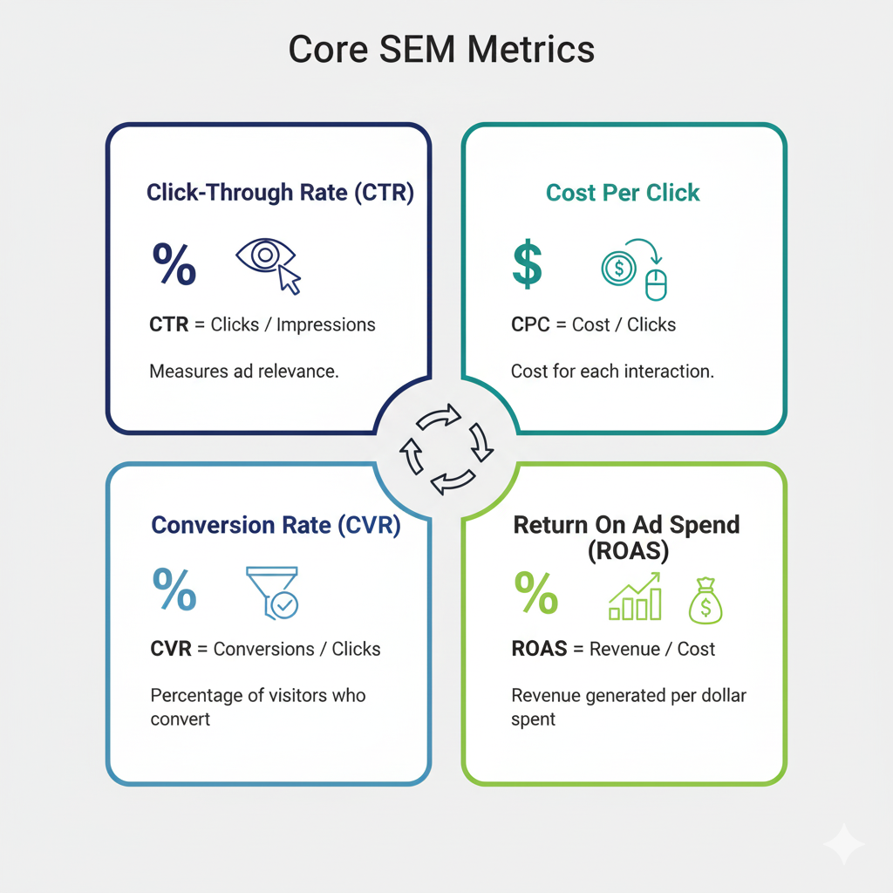

## 什么是 SEM？

如果你曾经在 Google 或 Bing 等搜索引擎上进行过搜索，你一定见过出现在自然结果上方的那些带有 **“广告”** 或 **“赞助商”** 标签的链接。这些付费广告正是 **搜索引擎营销（Search Engine Marketing，简称 SEM）** 的核心。

简单来说，SEM 是一种通过**付费方式**在搜索引擎结果页面（SERP）上获得流量和可见性的数字营销策略。它的最终目标是提高你的网站在搜索引擎上的曝光度，从而吸引更多潜在客户。

### SEM 的核心构成部分

SEM 主要由以下部分组成：

* **付费搜索广告**：这是最常见的 SEM 形式，也常被称为 **PPC（Pay-Per-Click）**，即“按点击付费”。当用户在搜索引擎上输入一个关键词时，你的广告会出现在搜索结果页面的显著位置。你只需要在用户点击你的广告时才支付费用。在我们的 **[付费搜索广告 (PPC) 终极指南](https://chloevolution.com/zh-cn/posts/paid-search/)** 一文中，我们将详细探讨如何搭建你的第一个广告系列。
* **展示广告**：这些广告不出现在搜索结果页面上，而是以图片、视频或文字的形式，出现在与你的产品或服务相关的网站上，扩大品牌曝光。

#### SEM、PPC 和 Display Ads 有何区别？

许多人常常将这三个术语混用，但它们实际上是**包含和被包含**的关系。

* **SEM** 是一个**总称**。它涵盖了所有通过付费方式在搜索引擎上提高可见性的活动。
* **PPC** 是一种**计费模式**，即“按点击付费”。
* **付费搜索**和**展示广告**是两种**广告类型**。

最常见的混淆点在于 PPC。虽然它字面上指的是一种计费方式，但在日常交流中，人们常常用 **PPC** 来特指 **付费搜索广告**。

### 谁提供了 SEM 服务？

SEM 的生态系统中有三个主要角色：

  * **广告平台**：**谷歌**的 [Google Ads](https://business.google.com/us/google-ads/) 和 **微软**的 [Microsoft Advertising](https://ads.microsoft.com/) 等公司是提供 SEM 服务的平台。它们是广告商进行投放的基础设施，决定了广告的展示位置、竞价规则和效果数据。
  * **广告主（需求方）**：任何希望通过 SEM 推广其产品或服务的企业、品牌或个人，都是广告主。
  * **代理机构（服务方）**：SEM 代理机构或专家们为广告主提供专业的服务，包括广告系列管理、优化和数据分析，帮助广告主实现最佳的投资回报率。如果你没有足够的内部资源，通常会选择与他们合作。

## SEM 与 SEO：区别与协同

在数字营销领域，**搜索引擎优化（SEO）** 和 **搜索引擎营销（SEM）** 是两个最常被提及的策略。它们都致力于提高网站在搜索引擎中的可见度，但实现方式、运作机制和短期效果却大相径庭。理解它们之间的区别，以及如何让它们协同工作，是制定高效搜索营销策略的关键。

### 核心差异与优劣势对比

为了更直观地理解 SEM 和 SEO 的不同，以及各自的优势和劣势，我们可以通过以下表格进行对比：

| 特征           | 搜索引擎营销 (SEM)                               | 搜索引擎优化 (SEO)                                   |
| :------------- | :----------------------------------------------- | :--------------------------------------------------- |
| **获取流量方式** | **付费流量**：通过购买广告位获取点击和展示       | **自然流量**：通过优化网站内容和结构，自然获得排名   |
| **见效速度** | **快**：广告一旦投放并审核通过，即可立即展示和获得流量 | **慢**：需要持续优化，排名提升通常需要数周到数月时间 |
| **主要成本** | **按点击/展示付费**：需持续投入广告预算           | **长期投入**：主要包括人力、内容创建、技术优化成本   |
| **可控性** | **高**：可精确控制关键词、受众、预算、广告文案等 | **较低**：排名受搜索引擎算法影响大，结果不易完全控制 |
| **展示形式** | 带有 **“广告”** 或 **“赞助商”** 标识的链接          | 不带任何标识的**自然排名**链接                       |
| **排名稳定性** | 预算充足即可维持，一旦停止付费即消失             | **相对稳定**：一旦获得，可带来持续且“免费”的流量，但需持续维护 |
| **优势** | **快速见效**，精准定位，数据透明，适合短期推广和测试 | **成本效益高**（长期免费流量），用户信任度高，品牌权威性强 |
| **劣势** | **需要持续投入预算**，广告屏蔽风险，用户可能对广告有抵触 | **见效周期长**，结果不确定性高，竞争激烈时优化难度大 |

### 如何在搜索结果中区分 SEM 和 SEO？

当你在 Google 或 Bing 等搜索引擎上进行搜索时，区分 SEM 广告和 SEO 自然结果其实非常简单。主要看以下几个关键标识：

1.  **“广告”或“赞助商”标签**：
      * **SEM 广告**：最明显的特征就是结果旁边会带有明确的 **“广告”**（Ad）、**“赞助商”**（Sponsored）或类似的标识。这些标签通常位于标题的左侧或右侧，颜色和字体可能与普通文本略有不同，但总是清晰可见。这是搜索引擎为了告知用户该结果为付费推广而设置的。
      * **SEO 自然结果**：与之相对，通过 SEO 优化获得的自然搜索结果**不会有任何“广告”标识**。它们是搜索引擎根据算法认为与用户查询最相关、最有价值的页面。
2.  **展示位置**：
      * **SEM 广告**：通常出现在搜索结果页的**顶部（最上方）和底部（最下方）**。在某些情况下，它们也可能出现在右侧栏。这些都是付费的黄金位置。
      * **SEO 自然结果**：位于广告结果下方，通常是页面中间区域的链接。这些排名是算法自然排序的，而不是付费获得的。
3.  **URL 展示**：
      * 虽然不如“广告”标签直接，但有时广告的 URL 可能包含一些追踪参数，与自然结果的简洁 URL 略有不同。不过，**“广告”标签**仍是区分两者的最可靠方式。

### SEM 与 SEO 的协同工作：1+1\>2

尽管 SEM 和 SEO 在操作上有显著差异，但它们并非互相竞争，而是可以**完美协同，发挥出远超单一策略的效果**。一个成熟的数字营销策略，往往会同时采用这两种方法。

以下是它们如何协同工作的一些例子：

  * **数据共享，优化策略**：
      * **SEM 帮助 SEO**：你可以通过 **[关键词研究](https://chloevolution.com/zh-cn/posts/keyword-research-and-targeting/)** 快速测试不同关键词的转化效果和用户意图。那些在 SEM 中表现良好的关键词，往往也值得投入 SEO 资源去优化其自然排名内容。同时，SEM 的 **[广告文案与创意](https://chloevolution.com/zh-cn/posts/create-sem-copy/)** 表现也能为 SEO 的标题标签和元描述提供灵感。
      * **SEO 帮助 SEM**：一个拥有良好 SEO 基础（如快速的网站加载速度、友好的用户体验）的网站，通常也能在 SEM 中获得更高的**广告质量得分**。更高的质量得分意味着你可能以更低的成本获得更好的广告排名，从而降低 **[每次点击成本 (CPC)](https://chloevolution.com/tools/cpc-calculator/)**。
  * **弥补不足，覆盖全面**：
      * **SEM 弥补 SEO 周期长**：对于新产品发布、短期促销活动或竞争激烈的关键词，SEM 能够提供即时可见度，快速抢占市场，弥补 SEO 见效慢的特点。
      * **SEO 弥补 SEM 成本高**：一旦通过 SEO 获得稳定的自然排名，你就不需要为每次点击付费。这为你带来了持续的、免费的流量，长期来看可以有效降低整体的营销成本。
  * **全面占据搜索结果页**：
    当一个品牌在某个关键词的搜索结果页同时拥有付费广告位和自然排名时，其在 SERP 上的**可见度会大大增加**，这不仅能提升点击率，还能增强品牌权威性和用户信任度。这种“双重曝光”策略，能够有效挤压竞争对手的展示空间。

## SEM 的核心价值：为什么品牌需要它？

在理解了 SEM 的基本概念及其与 SEO 的区别之后，你可能会问：为什么我的品牌需要投入 SEM？答案在于 SEM 能够为品牌带来独特且立竿见影的价值，这是许多其他营销策略难以比拟的。它不仅能帮助你快速触达目标客户，还能提供深度洞察，优化营销投入。

### 1. 即时可见性：快速抢占市场

想象一下，你刚推出一款创新产品，或是正在进行一场限时促销活动。传统的 SEO 优化可能需要数周甚至数月才能看到排名提升，而 SEM 能够让你在广告投放后**立即出现在搜索引擎结果页（SERP）的顶部**。类似的效果适用于：

  * **新品发布**：迅速将产品信息呈现在潜在客户面前。
  * **短期促销**：在活动期间最大化曝光和转化。
  * **市场测试**：快速验证关键词、广告文案和产品定位的有效性。

SEM 就像一张快速通行证，让你的品牌在竞争激烈的市场中迅速获得一席之地。

### 2. 精准定位：触达对的受众

SEM 平台（如Google Ads）提供了强大的定位功能，让你能够将广告精准地展示给最相关的潜在客户。你可以根据：

  * **关键词**：当用户搜索特定产品或服务时，你的广告才能出现。
  * **地理位置**：仅向特定城市、地区甚至商铺附近的客户展示广告。
  * **受众特征**：基于用户的年龄、性别、兴趣、行为模式等进行精细化定位。
  * **再营销 (Remarketing)**：向那些已经访问过你网站，但尚未转化的用户再次展示广告。

这种精准性确保了你的营销预算花在刀刃上，避免了无效的广告投放，大大提高了广告的投资回报率。

### 3. 可量化回报：每一分投入都可衡量

与许多传统营销方式不同，SEM 的所有投入和产出都是**高度透明和可追踪的**。你可以清楚地看到：

  * 有多少人看到了你的广告（展示次数）。
  * 有多少人点击了你的广告（点击次数）。
  * 每次点击的成本是多少（**[CPC](https://chloevolution.com/tools/cpc-calculator/)**）。
  * 有多少人完成了购买、注册或下载（转化次数）。
  * 每完成一次转化花费了多少钱（**[CPA](https://chloevolution.com/tools/cpa-calculator/)**）。
  * 你的广告带来了多少销售额和利润（ROAS）。

这些详尽的数据使你能够对广告表现进行深入分析，快速识别问题并进行优化，确保每一分营销预算都能带来最大的价值。关于 **[SEM 的费用构成](https://chloevolution.com/zh-cn/posts/search-engine-marketing-cost/)** 和 **[如何解读数据](https://chloevolution.com/zh-cn/posts/sem-analytics/)**，我们都有专门文章进行探讨。

### 4. 市场洞察：深入理解你的客户和竞争对手

除了直接的流量和转化，SEM 还能提供宝贵的**市场情报**：

  * **关键词趋势**：通过 **[关键词研究工具](https://chloevolution.com/zh-cn/posts/keyword-research-and-targeting/)**，你可以发现用户正在搜索什么，了解他们的需求和痛点。
  * **竞争对手分析**：你可以看到竞争对手在哪些关键词上投放广告，他们的广告文案和落地页是什么样的，从而学习并优化自己的策略。
  * **用户行为模式**：分析不同广告和关键词的表现，可以帮助你更深入地理解目标受众的偏好和购买路径。

这些洞察不仅能指导你的 SEM 策略，还能为你的产品开发、内容营销和整体业务决策提供有价值的参考。

## SEM 的工作流程：如何创建你的第一个广告系列？

理解了 SEM 的价值后，你肯定迫不及待想知道如何将理论付诸实践。下面将为你揭示 SEM 广告系列从构思到上线的基本工作流程。这就像建造一座房子，你需要按部就班地打地基、搭框架、做装修。掌握这些核心步骤，将帮助你高效地创建和管理你的第一个 SEM 广告系列。

### 1. 明确目标与受众：SEM 策略的起点

在动手之前，首先要明确你的营销目标（增加品牌知名度、获取潜在客户还是促进销售）和目标受众。清晰的目标和受众洞察是后续所有广告决策的基础。

### 2. 关键词研究：找到目标客户的“搜索词”

关键词是连接你的广告和潜在客户的桥梁。你需要站在客户的角度思考，他们会用哪些词语来搜索你的产品或服务。这包括识别核心关键词、拓展长尾关键词、分析竞争对手，并使用专业工具辅助。

关于更详细的关键词选择策略，你可以参考我们的 **[《AI 时代下的关键词研究与定位》](https://chloevolution.com/zh-cn/posts/keyword-research-and-targeting/)** 一文。

### 3. 广告文案撰写与创意制作：吸引眼球的关键

有了关键词，接下来就需要创作引人注目的广告文案和创意。这是让潜在客户点击你的广告、而非竞争对手广告的核心。这包括撰写吸引人的标题、有说服力的描述、明确的号召性用语（CTA）以及利用广告附加信息。

学习如何写出高转化率的广告文案，请查阅我们的 **[《撰写高转化 SEM 文案的关键技巧》](https://chloevolution.com/zh-cn/posts/create-sem-copy/)** 一文。

### 4. 落地页优化：承接流量并实现转化

当用户点击你的广告后，他们会进入的第一个页面就是落地页。落地页的质量直接影响转化效果。一个好的落地页应该与广告内容高度相关，提供流畅的用户体验，并引导用户完成你设定的目标。

想了解更多关于如何提升落地页转化率的技巧，请阅读我们的 **[《落地页优化终极指南》](https://chloevolution.com/zh-cn/posts/landing-page-optimization/)** 一文。同时，我们也提供了针对特定行业的深入分析：
* **[《电商落地页高效转化秘诀》](https://chloevolution.com/zh-cn/posts/ecommerce-landing-page/)**
* **[《分析 SaaS 落地页的核心结构》](https://chloevolution.com/zh-cn/posts/saas-landing-page/)**
* **[《本地化营销的秘密武器：如何打造高转化率的本地化落地页》](https://chloevolution.com/zh-cn/posts/creating-location-specific-landing-pages/)**

### 5. 竞价策略与预算设置：控制你的投入与产出

在广告平台上，你需要设定竞价策略和广告预算。这决定了你的广告何时、何地以何种成本展示。这包括设定总体预算、选择合适的竞价策略，并根据表现进行监控与调整。

关于如何有效管理你的广告预算和选择合适的竞价方式，可以参考我们的 **[《SEM 广告费用全解析：自己投放 vs 找 Agency，到底该怎么选？》](https://chloevolution.com/zh-cn/posts/search-engine-marketing-cost/)** 一文。

### 6. 效果跟踪与分析：持续优化，实现增长

广告上线并非万事大吉，持续的跟踪和分析是 SEM 成功的关键。你需要定期检查广告表现数据，并根据数据反馈进行优化，包括监测核心指标、识别问题、进行 A/B 测试以及持续调整策略。

详细的效果评估和优化方法，将在我们的 **[《SEM 数据分析全攻略》](https://chloevolution.com/zh-cn/posts/sem-analytics/)** 一文中进行深入探讨。

## SEM 需要关注的核心指标

广告系列搭建完成并上线后，接下来的关键就是**监测和分析**其表现。SEM 的一大魅力在于其高度的可追踪性，每一个点击、每一次转化都能被量化。但面对海量的数据，哪些指标才是真正值得我们关注的？以下为 SEM 营销活动中最重要的几个核心指标，它们能帮你判断广告表现，优化投放策略，确保每一分钱都花得物有所值。

### 1. 点击率 (CTR)：广告吸引力的晴雨表

**点击率 (Click-Through Rate, CTR)** 是衡量广告**吸引力**和**相关性**的基础指标。它表示看到你广告的用户中有多少比例点击了它。

**计算方式：** `CTR = （点击次数 / 展示次数）x 100%`

**为什么重要？**

* **衡量广告文案和创意的有效性**：高 CTR 表明你的广告文案、标题和创意对目标受众具有吸引力。
* **影响广告质量得分**：在 Google Ads 等平台，CTR 是 **[广告质量得分](https://chloevolution.com/zh-cn/posts/sem-analytics/)** 的一个重要组成部分。质量得分越高，你可能以更低的 **[每次点击成本 (CPC)](https://chloevolution.com/tools/cpc-calculator/)** 获得更好的广告排名。

如果你的 CTR 较低，可能需要优化广告文案、重新进行 **[关键词研究](https://chloevolution.com/zh-cn/posts/keyword-research-and-targeting/)** 或调整广告的受众定位。

### 2. 每次点击成本 (CPC)：控制你的营销开支

**每次点击成本 (Cost Per Click, CPC)** 是你在用户每次点击广告时需要支付的平均费用。

**计算方式：** `CPC = 总花费 / 点击次数`

**为什么重要？**

* **直接影响预算消耗**：CPC 直接决定了你的广告预算能带来多少次点击。
* **评估竞价策略的效率**：了解不同关键词或广告组的 CPC，可以帮助你优化 **[预算与成本管理策略](https://chloevolution.com/zh-cn/posts/search-engine-marketing-cost/)**。

如果你发现 CPC 过高，可能需要提高广告质量得分、调整竞价策略或尝试更具性价比的关键词。

### 3. 转化率 (CVR)：衡量广告的终极目标

**转化率 (Conversion Rate, CVR)** 是衡量广告**实际效果**的关键指标。它表示点击你广告并访问 **[落地页](https://chloevolution.com/zh-cn/posts/landing-page-optimization/)** 的用户中，有多少比例完成了你预设的目标行为，例如购买产品、填写表单、下载资料或注册会员。

**计算方式：** `CVR = （转化次数 / 点击次数）x 100%`

**为什么重要？**

* **直接反映营销 ROI**：高 CVR 意味着你的广告投放不仅带来了流量，还带来了实际的业务成果。
* **评估落地页和产品/服务的吸引力**：低 CVR 可能意味着你的落地页用户体验不佳，或者产品/服务本身吸引力不足。

如果你想提升 CVR，除了优化 **[广告文案](https://chloevolution.com/zh-cn/posts/create-sem-copy/)**，更重要的是优化 **[落地页](https://chloevolution.com/zh-cn/posts/landing-page-optimization/)** 的内容和用户体验。

### 4. 广告支出回报率 (ROAS)：广告活动的“利润表”

**广告支出回报率 (Return On Ad Spend, ROAS)** 是一个高级且至关重要的指标，它直接衡量你的广告投入带来了多少**收益**。简而言之，你每投入 1 块钱广告费，能赚回多少钱。

**计算方式：** `ROAS = （广告带来的总收入 / 广告总花费）x 100%`

**为什么重要？**

* **直接评估广告盈利能力**：ROAS 是衡量广告活动是否盈利的终极指标。一个健康的 ROAS 通常表示你的广告投入是划算的。
* **指导预算分配**：通过对比不同广告系列、广告组甚至关键词的 ROAS，你可以将预算优先分配给那些带来更高回报的广告。

ROAS 的高低直接关系到你的广告活动能否持续。优化 ROAS 通常需要综合考虑 CTR、CPC 和 CVR 等所有指标，并进行持续的 **[数据分析](https://chloevolution.com/zh-cn/posts/sem-analytics)**。

掌握并定期分析这些核心指标，能让你清晰地了解 SEM 广告系列的表现，及时调整策略，并最终驱动你的品牌实现持续增长。别忘了，这些指标是相互关联的，需要结合起来全面评估。