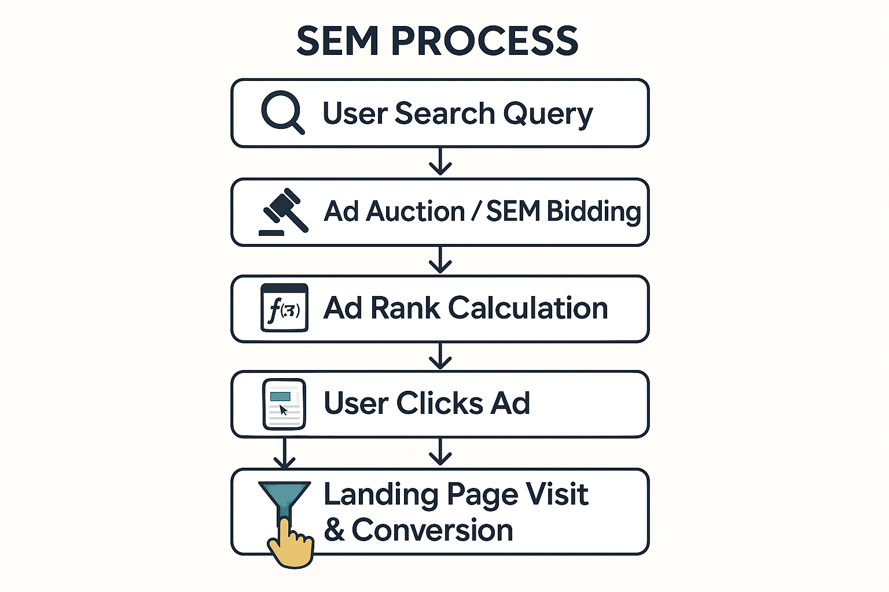
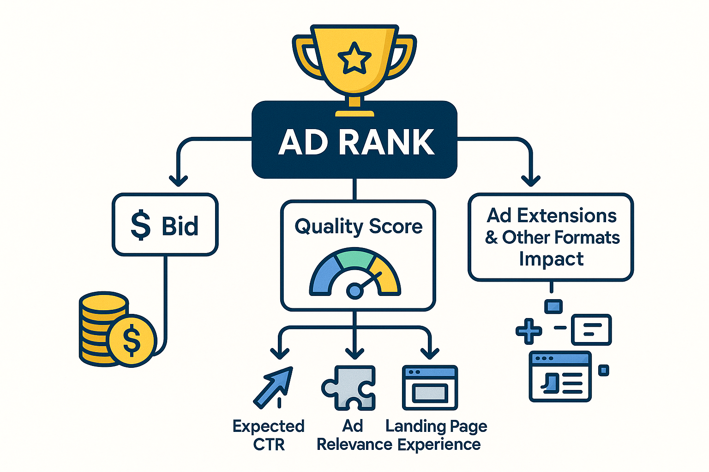

## What is SEM Bidding?

Imagine you're in a bustling digital marketplace, eager to sell your products or services. Customers are looking for specific items, and both you and your competitors want to display your offerings in the most prominent spots. In this market, whoever gets seen first captures the opportunity. In the world of Search Engine Marketing (SEM), this process of "contesting for prominent positions" is called **SEM Bidding**.

Simply put, **SEM bidding refers to the process where advertisers set bids for specific keywords on search engine advertising platforms (like Google Ads, Microsoft Ads) to compete for ad display positions and clicks.** Your bid, along with other factors like ad quality, collectively determines whether your ad appears at the top when a user searches, or if it doesn't appear at all.

Bidding is the core driving force of SEM; it dictates whether your ads can reach potential customers.

### SEM Bidding vs. SEO Differences

To understand SEM bidding, it's essential to highlight its fundamental differences from Search Engine Optimization (SEO). Both aim to gain visibility on search engines, but their methods are distinctly different:

| **Feature Dimension** | **SEM Bidding (Paid Search/PPC)** | **SEO (Organic Search)** |
| :---------------- | :------------------------------------ | :------------------------------------------ |
| **Visibility Source** | **Paid advertising**: Purchasing ad space through bidding; ads usually carry "Ad" or "Sponsored" labels | **Organic ranking**: Gaining rankings for free by optimizing website content, structure, and authority |
| **Speed to Results** | **Immediate**: Ads can display instantly after campaign setup and approval | **Long-term**: Takes weeks, months, or even longer to see ranking effects |
| **Cost Model** | **Pay-Per-Click (PPC)**: Pay each time a user clicks on the ad; costs are controllable | **Free**: But requires investment in labor, time, content creation, and technical optimization costs |
| **Control Level** | **High**: Precise control over ad copy, bids, target audience, and ad scheduling | **Low**: Ranking algorithms are controlled by search engines; rankings cannot be directly purchased |
| **Ad Position** | Typically in **top, bottom, or side** ad slots on the search results page | Usually **below ad slots** on the search results page, i.e., in the organic search results area |

In simple terms, SEM bidding is like renting a high-traffic booth for a one-time event—it's quick but requires continuous payment. SEO, on the other hand, is more like investing in building your own long-term, high-quality physical store—it's slower to show results, but once established, it brings continuous free customer traffic. The two are not mutually exclusive; they can complement each other to enhance your influence on search engines.

### Why Is SEM Bidding So Important?

SEM bidding is not just about placing a bid; it directly relates to your ad performance and whether your overall marketing goals can be achieved. Its importance is reflected in the following aspects:

1.  **Determines Ad Rank and Visibility:**
    On the Search Engine Results Page (SERP), position is everything. Users typically only pay attention to the top-ranking ads. Your bidding strategy directly influences whether your ad appears in these prime positions, where potential customers can see it. Bidding too low might leave your ad unnoticed; bidding too high could waste your budget.

2.  **Effectively Controls Advertising Costs:**
    The core of SEM bidding is to **get as many effective clicks and conversions as possible at the lowest possible cost**. A shrewd bidding strategy can help you balance bids with your budget, reducing your Cost Per Click (CPC), thereby generating a higher Return On Investment (ROI) for your advertising spend. Blindly bidding too high or too low can lead to inefficiency.

3.  **Achieves Specific Marketing Objectives:**
    Different marketing objectives require different bidding strategies. Is it to maximize brand exposure for more clicks? To acquire potential customers by optimizing for conversions? Or to maximize sales revenue by focusing on conversion value? The selection and adjustment of bidding strategies are **core methods** for achieving these specific marketing objectives. It makes your ad campaigns more purposeful and efficient.

4.  **Responds to Market Competition:**
    Your competitors are also actively participating in SEM bidding. Their bids, ad quality, and strategies will directly affect your ad rank and costs. A flexible and data-driven bidding strategy can help you maintain an advantage in fierce market competition, and even find unique breakthroughs.

In summary, SEM bidding is a critical link in digital marketing that connects advertising investment with business results. A deep understanding and optimization of bidding strategies are essential for every marketer.

-----

## The Core Mechanism of SEM Bidding: Ad Rank and Quality Score

Before delving into SEM bidding strategies, we must first understand how search engines decide whether your ad will be shown and where it will appear. This isn't just about how high your bid is; it's determined by two key factors: **Ad Rank and Quality Score**. They are at the heart of the Google Ads auction mechanism, and understanding them is crucial for optimizing your ad performance.

### Ad Rank: The Determinant of Your Ad's Position

**Ad Rank is a comprehensive metric that determines your ad's position on the search results page and whether your ad will be shown at all.** The higher your Ad Rank, the higher your ad will appear, increasing your chances of getting more impressions and clicks.

The Google Ads Ad Rank calculation formula is as follows:

$$\text{Ad Rank} = \text{Bid} \times \text{Quality Score} + \text{Impact of Ad Extensions and Other Formats}$$

Let's break down this formula:

  * **Bid:** This is the maximum amount you're willing to pay for each click. While a higher bid increases your Ad Rank, it's not the only determining factor.
  * **Quality Score:** This is Google's measure of the relevance and quality of your ads, keywords, and landing page. It has a significant impact on Ad Rank, and we'll discuss it in detail in the next section.
  * **Impact of Ad Extensions and Other Formats:** Ad extensions (such as sitelinks, structured snippets, callouts, etc.) can provide more useful information for your ad, taking up more space and thus improving user experience and click-through rates. If an ad includes these extensions and they are expected to improve ad performance, Google will positively consider them in the Ad Rank calculation.

**The significance of Ad Rank is that you don't always need to bid the highest to get the best position.** An ad with a higher Quality Score, even if its bid is slightly lower than a competitor's, may achieve a better ad rank and even win the auction at a lower Cost Per Click (CPC). This is because Google wants to provide users with the most relevant and helpful ads, thereby enhancing the overall search experience.

### Quality Score: More Than Just a High Bid

**Quality Score is a diagnostic tool used by Google Ads to measure the overall quality and relevance of your keywords, ad copy, and landing page.** It's scored on a scale of 1 to 10, with a higher score indicating that Google deems your ad more relevant and useful.

Quality Score is the "invisible lever" of the bidding mechanism. It has a profound impact on your ad performance and costs:

  * **Impacts Ad Rank:** As mentioned above, a higher Quality Score directly increases your Ad Rank, giving you a competitive advantage in the auction.
  * **Lowers Cost Per Click (CPC):** Ads with a high Quality Score can usually win better ad positions at a lower CPC. This means you can get more clicks for the same budget, significantly improving ad efficiency.
  * **Improves Ad Eligibility:** Ads with a Quality Score that is too low may not even be eligible to be shown.

So, what factors specifically influence Quality Score? Google Ads primarily considers these three points:

#### 1\. Expected Click-Through Rate (Expected CTR)

  * **Definition:** Google's prediction of the likelihood that your ad will be clicked when shown. This is primarily based on your ad's historical performance.
  * **Optimization Method:** Write eye-catching **ad copy** that is highly relevant to the user's search intent, and use **ad extensions** to provide more information and value, enhancing the ad's appeal.

For more tips on writing high-CTR ad copy, please refer to **[ "Key Techniques for Writing High-Converting SEM Copy"](https://chloevolution.com/zh-cn/posts/create-sem-copy/)**.

#### 2\. Ad Relevance

  * **Definition:** The degree of relevance between your keywords and your ad copy (including headline, description). Google evaluates whether your ad content accurately responds to the user's search query.
  * **Optimization Method:** Ensure your ad copy directly includes or is closely associated with your targeted **keywords**. Create highly customized **ad groups and ads** for different keyword groups to improve relevance.

For a deeper understanding of keyword selection and targeting, read **[ "Keyword Research and Targeting in the AI Era"](https://chloevolution.com/zh-cn/posts/keyword-research-and-targeting/)**.

#### 3\. Landing Page Experience

  * **Definition:** The quality, relevance, transparency, and usability of the **landing page** that users reach after clicking your ad. Google evaluates whether the landing page provides clear, valuable information consistent with the ad content.
  * **Optimization Method:**
      * **Relevance:** Ensure the landing page content highly matches the ad copy and keywords, fulfilling the promises made in the ad.
      * **Usability:** The page design should be clean and clear, with a logical information structure, making it easy to navigate and find key information.
      * **Transparency:** Provide clear product/service information, contact details, and privacy policies.
      * **Load Speed:** Ensure the landing page loads quickly, especially on mobile devices. Slow load speeds can severely damage user experience.

For detailed information on how to optimize landing pages to improve Quality Score and conversion rates, please refer to **[ "The Ultimate Guide to Landing Page Optimization"](https://chloevolution.com/zh-cn/posts/landing-page-optimization)**.

-----

## Classification and Selection of SEM Bidding Strategies

In the world of SEM bidding, choosing the right bidding strategy is like selecting the correct tires and tuning for your race car. It directly impacts your ad performance, budget efficiency, and the achievement of your ultimate marketing goals. There's no one-size-fits-all "best" strategy, only the strategy most suitable for your current objectives and ad campaigns.

We will delve into two main types of bidding strategies: **Manual Bidding** and **Smart Bidding**, and provide guidance on how to choose between them.

### Manual Bidding: The Art of Fine Control

**Manual bidding, as the name suggests, is when advertisers personally set the maximum Cost Per Click (Max CPC Bid) for each keyword, ad group, or campaign.** This means you need to invest time and effort to meticulously manage each bid and manually adjust it based on performance.

  * **Characteristics:**
      * **High Level of Control:** You can precisely control the maximum amount you're willing to pay for each keyword.
      * **Low Learning Curve:** Easier for beginners to understand and implement.
      * **Suitable for Small Budgets/Testing:** When working with a limited budget or testing new keywords on a small scale, manual bidding offers stricter cost control.
  * **Advantages:**
      * **Precise Budget Management:** Ensures you don't overpay for clicks that aren't worth it.
      * **Quick Adjustments:** You can quickly raise or lower bids for specific keywords based on real-time performance.
      * **Improved Insights:** Forces you to deeply understand the performance of each keyword, cultivating sensitivity to ad effectiveness.
  * **Disadvantages:**
      * **Time-Consuming and Labor-Intensive:** For complex accounts with many keywords, manually managing all bids is almost an impossible task.
      * **Inefficient:** Manual operations cannot respond to market changes and user behavior signals in real-time like AI.
      * **Missed Opportunities:** May fail to timely discover and seize high-value bidding opportunities.
  * **Applicable Scenarios:**
      * **Small Ad Accounts:** Where the number of keywords is manageable, allowing for fine-grained management.
      * **New Accounts or New Keyword Testing Phases:** Requiring strict cost control to gather preliminary data.
      * **Specific marketing campaigns with extremely high control demands over bidding.**

### Smart Bidding: AI-Driven Efficiency Boost

**Smart Bidding is a set of automated bidding strategies provided by Google Ads (and other ad platforms) that leverage AI and machine learning to automatically adjust bids based on real-time data signals to help you achieve specific marketing goals.** These strategies go beyond simple rules, capable of predicting conversion probabilities and optimizing bids at auction time.

  * **Core Advantages:**

      * **Increased Efficiency:** AI can process vast amounts of data and real-time signals, making more accurate and timely bidding decisions than manual efforts.
      * **Optimized Performance:** Aims to help you get more conversions at a lower cost or maximize conversion value.
      * **Time Savings:** Automates tedious bid management, allowing marketers to focus on strategic planning.

  * **Types and Goals of Smart Bidding Strategies:**

      * **Maximize Clicks:** Aims to get the most clicks within your budget.
          * **Goal:** Increase brand awareness, drive high volumes of website traffic.
          * **Applicable Scenarios:** Early-stage brand promotion, content marketing for traffic generation.
      * **Maximize Conversions:** Aims to get the most conversions within your budget.
          * **Goal:** Acquire leads, sell products/services.
          * **Applicable Scenarios:** Most conversion-focused campaigns.
      * **Target CPA (Cost Per Acquisition):** Aims to get as many conversions as possible within your target average CPA.
          * **Goal:** Control conversion costs while maximizing conversion volume.
          * **Applicable Scenarios:** Campaigns with clear conversion cost requirements.
      * **Maximize Conversion Value:** Aims to get the highest conversion value within your budget.
          * **Goal:** Improve Return On Ad Spend (ROAS), acquire high-value customers.
          * **Applicable Scenarios:** E-commerce, high-ticket services, where the value of different conversion actions can be tracked.
      * **Target ROAS (Return On Ad Spend):** Aims to achieve the highest possible conversion value at your target ROAS.
          * **Goal:** Maximize sales or conversion value while ensuring profitability.
          * **Applicable Scenarios:** E-commerce, businesses with strict requirements for advertising ROI.
      * **Target Impression Share:** Aims to achieve your target impression share in specific positions on the search results page (top, first page, or absolute top).
          * **Goal:** Increase brand visibility in key search results.
          * **Applicable Scenarios:** Brand awareness campaigns, or needing to strongly dominate competitors on specific keywords.

### How to Choose the Right Bidding Strategy?

Choosing a bidding strategy is not a one-time decision; it's a dynamic process that requires adjustment based on data. Here are several key considerations:

#### 1\. Define Marketing Objectives

  * **Goals First:** This is the most important step. Do you want to increase website traffic, boost brand awareness, acquire more leads, or directly drive sales? Different objectives correspond to different bidding strategies.
      * **Clicks \> Conversions:** Consider "Maximize Clicks."
      * **Conversions \> Conversion Value:** Consider "Maximize Conversions" or "Target CPA."
      * **Conversion Value \> Conversions:** Consider "Maximize Conversion Value" or "Target ROAS."
      * **Brand Exposure/Position \> Other:** Consider "Target Impression Share."

#### 2\. Consider Account Historical Data and Conversion Tracking

  * **Data is Foundation:** Smart Bidding strategies require **sufficient and accurate conversion data** to learn and optimize. If your account is brand new, or has very few monthly conversions (e.g., less than 30 conversions/month), Smart Bidding may struggle to operate effectively.
  * **Conversion Tracking:** Ensure your **conversion tracking is set up correctly and the data is reliable**, otherwise Smart Bidding will optimize based on erroneous information. For e-commerce, tracking with conversion values needs to be set up.

#### 3\. Budget and Risk Tolerance

  * **Budget Size:** Smart Bidding generally performs better with a relatively ample budget, as it needs a certain amount of traffic and data to "learn."
  * **Risk Assessment:** Smart Bidding may fluctuate during its initial learning phase, requiring time for it to adapt. If your budget is very tight, or you have low tolerance for short-term fluctuations in conversion costs, you might need to start with manual bidding or more conservative Smart Bidding strategies.

#### 4\. Industry Characteristics and Competitive Landscape

  * **Industry Averages:** Understanding average CPAs, ROAS, and other metrics in your industry helps set more realistic goals.
  * **Competitive Intensity:** In highly competitive industries, Smart Bidding can help you stand out better in auctions because it can adjust bids in real-time.

#### 5\. Flexible Application, Dynamic Adjustment

  * **No One-Size-Fits-All:** Market conditions, user behavior, and your business goals are constantly changing. Therefore, bidding strategies also need regular review and adjustment.
  * **Experiment and Test:** Don't be afraid to try different Smart Bidding strategies and use A/B testing to compare their effectiveness.
  * For guidance on effective testing and analysis, refer to **[ "The Complete Guide to SEM Data Analysis"](https://chloevolution.com/zh-cn/posts/sem-analytics/)**.

-----

## Key Factors Influencing SEM Bidding Effectiveness

You've learned about the core mechanisms and types of SEM bidding strategies, but simply setting a bid or choosing a Smart Bidding strategy isn't enough to guarantee ad performance. Successful bidding is the result of multiple interacting factors, much like a complex equation. Neglecting any variable could significantly diminish your ad's effectiveness.

We will delve into several key factors that influence SEM bidding effectiveness, which work synergistically with your bidding strategy to determine whether your ads can stand out in fierce competition.

### 1\. Keyword Selection and Match Types: The Foundation of Traffic Quality

Keywords are the bridge connecting users with your products/services. **Precise keyword selection and appropriate match types are fundamental to ensuring your ads are seen by the right audience and drive high-quality traffic.**

  * **Keyword Precision:**
    Choosing keywords that are highly relevant to your product or service and reflect clear user search intent is crucial. For example, an ad selling "men's athletic shoes" might attract a lot of irrelevant traffic if it only uses a broad term like "shoes."
    For detailed keyword research methods, please refer to **[ "Keyword Research and Targeting in the AI Era"](https://chloevolution.com/zh-cn/posts/keyword-research-and-targeting/)**.
  * **Match Types:**
    Google Ads offers various keyword match types to control which search queries can trigger your ads:
      * **Broad Match:** The widest reach, can trigger searches related to the keyword, misspellings, synonyms, or related concepts. It generates high traffic but may not be precise, requiring the use of negative keywords.
      * **Phrase Match:** Ads will show for searches that include your exact phrase or its close variations. Offers more control than broad match but still provides some flexibility.
      * **Exact Match:** Ads will only show when a user searches for your exact keyword or its close variations. Generates the least traffic but is the most precise, usually yielding the highest conversion rates.
        Proper use of match types helps you balance traffic coverage and precision, thereby optimizing bidding effectiveness.
  * **Negative Keywords:**
    Exclude search terms irrelevant to your product or service. For example, if you sell new items, you can add negative keywords like "used" or "free." This effectively prevents your ads from appearing in irrelevant searches, reduces unnecessary click waste, and thus improves ad relevance and **Quality Score**.

### 2\. Ad Copy and Ad Extensions: Tools to Attract Clicks

Even if your ad is successfully displayed, if the copy isn't appealing enough, users won't click. **High-quality ad copy and rich ad extensions are crucial for improving the ad's Click-Through Rate (CTR), and CTR is a significant factor in determining Quality Score.**

  * **Compelling Ad Copy:**
      * **Highly relevant to keywords:** Ensure ad headlines and descriptions directly address the user's search intent.
      * **Highlight Unique Selling Points (USPs):** Clearly communicate what makes your product or service stand out.
      * **Include a strong Call to Action (CTA):** Clearly tell users what they will get after clicking.
      * **Evoke emotional resonance:** Address user pain points or fulfill their needs.
        For more tips on writing high-converting ad copy, please refer to **[ "Key Techniques for Writing High-Converting SEM Copy"](https://chloevolution.com/zh-cn/posts/create-sem-copy/)**.
  * **Utilizing Ad Extensions:**
    Ad extensions allow you to add extra information below your ad, such as phone numbers, addresses, sitelinks, promotion details, structured snippets, etc.
      * **Advantages:**
          * **Increase Visibility:** Make your ad take up more space on the search results page, making it more prominent.
          * **Provide More Information:** Help users learn more before clicking, improving the quality of clicks.
          * **Improve Quality Score:** Google rewards ads that use ad extensions because they enhance user experience.
          * **Increase Expected CTR:** More information and larger ad real estate typically lead to higher click-through rates.

### 3\. Landing Page Experience: The Ultimate Conversion Battlefield

After users click your ad, your **landing page** is where they first deeply interact with your brand. **An excellent landing page experience not only boosts user willingness to convert but is also one of the key factors influencing Ad Quality Score.**

  * **High Relevance to Ad Content:**
    The landing page content must be highly consistent with the ad copy and keyword promise that the user clicked on. If the ad says "Free trial of XYZ software," the landing page should immediately display a free trial form and relevant information, not a company introduction page. Inconsistencies lead to user confusion and high bounce rates.
  * **Clear Value Proposition and Call to Action (CTA):**
    The landing page needs to clearly tell users what value your product or service can bring them and guide them to complete a clear conversion action. The CTA button should be prominent, and the copy clear.
  * **Excellent User Experience:**
      * **Load Speed:** The faster the page loads, the better. Slow pages will quickly lose users and lower Google's rating of landing page quality.
      * **Mobile-Friendly:** Ensure the landing page displays and functions well on various devices, including mobile phones and tablets.
      * **Simple and Easy to Use:** Avoid too many distracting elements (such as excessive navigation, pop-ups) to keep users focused on conversion.

For a detailed understanding of how to optimize landing pages to improve conversions and Quality Score, please read **[ "The Ultimate Guide to Landing Page Optimization"](https://chloevolution.com/zh-cn/posts/landing-page-optimization/)**.

### 4\. Competitor Analysis: Know Your Enemy, Win Every Battle

In a bidding environment, your performance is not isolated; it's constantly influenced by competitor strategies. **Continuously analyzing competitor movements can help you adjust your own bidding strategy and identify market opportunities.**

  * **Monitor Competitor Bids and Ranks:**
    Use tools like Google Ads' Auction Insights Report to understand which keywords competitors are bidding on, and what their ad ranks and impression shares are. This helps you determine if you need to adjust your own bids.
  * **Analyze Competitor Ad Copy and Landing Pages:**
    Study competitor ad copy and landing pages, learn from their strengths, identify their weaknesses, and then optimize your own ad creatives and user experience.
  * **Find Differentiating Advantages:**
    Through analysis, identify your unique selling points in products, services, or branding, and highlight these differences in your ads and landing pages to avoid falling into a pure price war.

### 5\. Budget and Bid Adjustments: The Wisdom of Fine-Grained Management

Even with a perfect strategy, ad campaigns require continuous monitoring and adjustment. **Reasonable budget management and precise bid adjustments can help you maximize ad effectiveness and avoid resource waste.**

  * **Budget Allocation:**
    Allocate daily or monthly budgets appropriately based on the priority and performance of different campaigns, ad groups, or keywords. Increase budget for well-performing segments, and optimize or cut for underperforming ones.
  * **Bid Adjustments:**
    Google Ads allows you to set bid adjustments for various dimensions, such as:
      * **Device Adjustments:** Adjust bids based on differences in user behavior across mobile phones, tablets, and desktop devices.
      * **Geographic Location Adjustments:** Increase or decrease bids for users in specific regions.
      * **Time/Day Adjustments:** Adjust bids based on the time of day or day of the week.
      * **Audience Adjustments:** Adjust bids for specific user groups (e.g., website visitors, custom audiences).
        These adjustments allow you to invest more resources at the most valuable moments and in front of the most valuable users, thereby improving bidding efficiency and conversion rates.

For more on continuous optimization and management of SEM accounts, please refer to **[ "Continuous Optimization and Management of Paid Search Advertising"](https://chloevolution.com/zh-cn/posts/paid-search/)**.

-----

## Frequently Asked Questions (FAQ)

### Q1: Is Smart Bidding always better than manual bidding?

**Not necessarily.** Smart Bidding can lead to greater efficiency and better performance in most cases, especially for large accounts with sufficient conversion data. It leverages AI to process vast amounts of signals in real-time, making more accurate bidding decisions than manual efforts.

However, in the following scenarios, **manual bidding or more conservative Smart Bidding strategies might be more appropriate:**

  * **Insufficient Data:** If your campaign is brand new, or has very few monthly conversions (e.g., less than 15-30 conversions), Smart Bidding may not have enough data to learn and optimize effectively.
  * **Strict Budget Control:** In some cases, you need extremely strict control over your Cost Per Click, and manual bidding can provide this level of granularity.
  * **Highly Specialized or Niche Markets:** In these markets, Google's AI models might not have enough data to learn effectively.
  * **Initial Testing:** When you are testing new keywords or ad creatives, manual bidding can help you better understand market reactions.

**Best practice is to:** Start with manual bidding or strategies like "Maximize Clicks" to accumulate data. Once you have a sufficient volume of conversions, gradually transition to Smart Bidding strategies like "Maximize Conversions," "Target CPA," or "Target ROAS."

### Q2: How should I set my initial bids?

Setting initial bids is a crucial step in launching an SEM campaign. Here are some suggestions:

  * **Utilize Keyword Planner:** Google Ads' Keyword Planner can provide you with **suggested bid ranges** for keywords, which serve as an excellent starting point.
  * **Refer to Industry Average CPC:** Understanding the average Cost Per Click in your industry can help you set more reasonable expectations. You can also use our **[CPC Calculator tool](https://chloevolution.com/tools/cpc-calculator/)** to estimate and plan initial bids.
  * **Start with a Small Budget:** If you're unsure, you can begin with a relatively low bid that still allows for some impressions. Then, closely monitor data and gradually adjust based on actual performance.
  * **Based on Marketing Goals:**
      * If the goal is to **acquire maximum traffic**, you can set your bids in the medium to high range of the suggested bids.
      * If the goal is to **strictly control costs**, you can start from the low end of the suggested bids and gradually increase them until you achieve satisfactory traffic and conversions.
  * **Monitor and Adjust:** Most importantly, initial bids are not set in stone. After launching your campaign, **continuously monitor keyword performance, Ad Rank, and conversion data**, and adjust based on this information.

### Q3: How do I address insufficient data for Smart Bidding?

The effectiveness of Smart Bidding highly depends on conversion data. If data is insufficient, you can try the following methods:

  * **Choose Broader Conversion Goals:** If high-value conversions (like purchases) are too few, you can start by tracking "micro-conversions," such as:
      * Watching a video
      * Downloading a brochure
      * Signing up for a newsletter
      * Visiting a specific page for more than a certain duration
        These micro-conversions can provide AI with more learning signals, even if they aren't the ultimate goal.
  * **Extend the Learning Period:** Give Smart Bidding more time and budget to accumulate data. During the learning period, avoid frequent changes to settings.
  * **Use "Maximize Clicks" as a Starting Point:** Run a "Maximize Clicks" strategy for a while to acquire enough traffic and ensure conversion tracking accurately records all conversions, laying the groundwork for subsequent Smart Bidding strategies.
  * **Provide Audience Signals:** In campaigns like Performance Max, providing detailed audience signals (e.g., custom audiences, remarketing lists) can help AI identify your target customers faster, even with less conversion data.
  * **Integrate Offline Conversion Data:** If your business involves offline conversions, uploading this data to Google Ads can provide AI with a more comprehensive basis for optimization.

For insights on how to identify problems and optimization directions through data analysis, please refer to **[ "The Complete Guide to SEM Data Analysis"](https://chloevolution.com/zh-cn/posts/sem-analytics/)**.

### Q4: Are Bid Adjustments still useful with Smart Bidding?

**Yes, they are, but their function is different.**

  * **In manual bidding:** Bid adjustments are direct tools for advertisers to precisely control bids. For example, increasing bids by 20% for mobile devices means your manual bid will directly increase by 20%.

  * **In Smart Bidding:** Smart Bidding already leverages AI to automatically consider signals like device, geographic location, time, and audience to optimize bids. Therefore, the bid adjustments you set will not directly modify the AI's bids but rather serve as **guidance signals**.

      * You can set bid adjustments to **express your preference or importance for a certain dimension (e.g., a specific device or audience)**. The AI will incorporate these preferences into its learning model and attempt to optimize for your primary conversion goal while considering these preferences.
      * For example, if you know that mobile users have a higher conversion value, but the Smart Bidding optimization results aren't as expected, you can try increasing the bid adjustment for mobile devices to "tell" the AI about this preference.

When using Smart Bidding, it's generally recommended to let the AI learn freely for a period. If you observe that performance in specific dimensions is not ideal, then try fine-tuning with bid adjustments.

### Q5: What is the "learning period" for a bidding strategy?

**The learning period refers to the time a Smart Bidding strategy needs to collect data, analyze user behavior, and adjust its bidding model after being launched or undergoing significant changes.** During this period, you might observe:

  * **Data Fluctuations:** Metrics like conversion volume, CPA, or ROAS might show significant fluctuations, and performance might not meet expectations.
  * **Bid Changes:** The system will experiment with different bids to find the optimal optimization path.

**Duration of the Learning Period:**

  * It typically ranges from **a few days to several weeks**, depending on your campaign type, budget, and conversion volume. Google Ads generally recommends **5-7 days**, and for Performance Max, it might take longer (e.g., **2-4 weeks**) to fully learn.
  * **Avoid Frequent Changes:** During the learning period, you should try to avoid frequently changing your bidding strategy, budget, ad group settings, or conversion goals. Every significant change can potentially trigger a new learning period.
  * **Be Patient:** Giving Smart Bidding enough time to learn is crucial. Premature intervention or switching strategies might hinder the AI from achieving optimal optimization results.