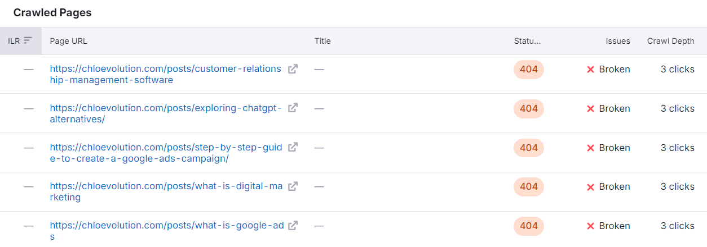
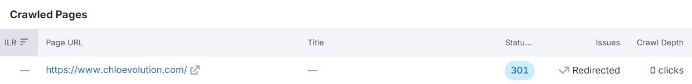
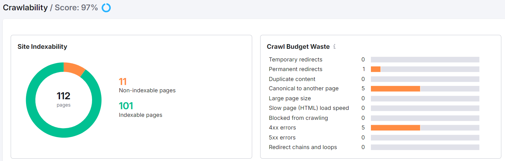
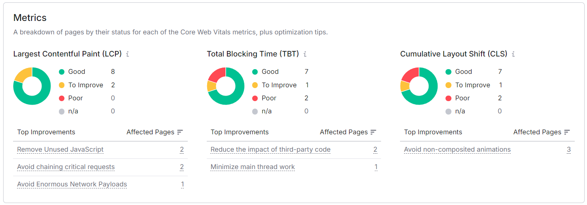
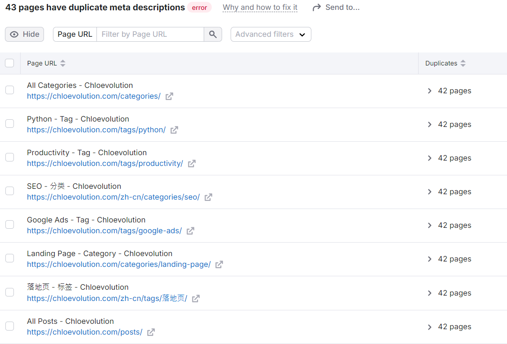
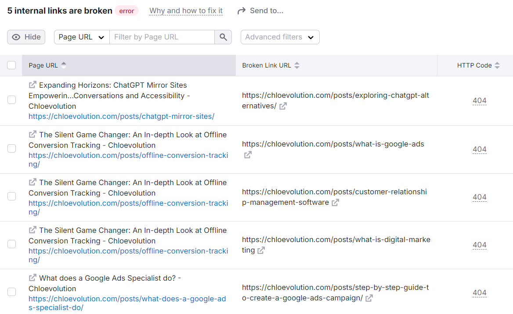

I have been suffering from the index of website pages. I have published new articles, but the number of pages not indexed has increased. So I used SEMrush to audit the website as a whole and made some corrections for specific problems to see if the index situation will improve.

The Site audit function is used. After entering the domain name and setting the number of pages to crawl, wait for about ten minutes and you can get an analysis report:


The core logic between several indicators:
- **Crawlability and Internal Linking**: ensure that the website content is discovered and crawled.
- **HTTPS and Site Performance**: ensure security and loading speed, and provide a good experience for users and search engines.
- **Core Web Vitals and Markup**: directly affect user experience and search engine understanding of content.

Optimization priority suggestions:
- Basic guarantee: prioritize optimization of HTTPS and Crawlability.
- Performance improvement: improve Site Performance and Core Web Vitals.
- Content enhancement: improve Internal Linking and Markup.

## Number of crawled pages


A total of 112 pages were crawled, and most of them showed problems.
- 4 healthy pages: 3 sitemap XML files, 1 robots TEXT file

- 5 broken pages: all are article pages that were deleted after being published, and are in 404 status. However, these pages are no longer visible in the Google Search Console report, so there is no need to deal with them.

- - 1 redirected page: the homepage of the website [https://www.chloevolution.com/](https://www.chloevolution.com/).
 In order to ensure that users can access my website regardless of whether the URL contains www, I declare the canonical homepage to be https://chloevolution.com/. When users visit a website with www, they will automatically redirect to this page. This part also complies with the settings in GSC and does not need to be processed.

- 102 problematic pages: check the problems one by one according to the subdivided evaluation indicators below.

## Crawling and indexing optimization
The score for this part is 97.



- Site index: Most pages have been included, and there are 11 pages that are not included.
- Waste of crawler budget:
    - 1 permanent redirect: The redirection of the website homepage was mentioned in the previous article.
    - 5 4xx errors: The deleted pages mentioned in the previous article.
    - 5 canonical points to other pages: They are all pagination pages of the blog directory page. After checking, it was found that the canonical tags all point to the homepage, but no relevant settings were made before, which needs to be processed.


- Page crawling depth: It can basically be completed within 1 to 2 clicks.
    - Pages that need 3 clicks to complete crawling: 6 in total, 5 of which are deleted pages, one is https://chloevolution.com/zh-cn/posts/how-to-create-bot-on-coze/, which is found but not included in GSC, and the forward page is from GitHub
    - Pages that need 4 or more clicks to complete crawling: 43 in total, all in Chinese.

## Core Web Index Optimization
The score for this part is 40.



The main problems are TBT and CLS. But I don’t know much about technical SEO, so I can only postpone it.

## Internal Link Optimization
The score for this part is 86.


The main problem is still the pages that have been deleted before, which causes the links that still lead to these pages to be broken. In addition, external links cited in some articles also need to be checked regularly to see if they are still accessible.


Other parts that can be optimized include:
- External links with nofollow attributes: The affected links are all https://creativecommons.org/licenses/by-nc/4.0/. This is a page describing the CC BY-NC 4.0 license, indicating that my website uses content licensed under Creative Commons and does not need to be processed.
- Pages with only 1 internal link: The affected pages are all pagination pages of blog directory pages.

## Other issues worth noting


### Meta tag description duplication

Basically, they are all category pages and tag pages. I looked at the source code and found that they all use the same meta description as the homepage, which needs to be modified.

### Duplicate title tags

The title tag fields of the Chinese homepage and the English homepage are the same, so the prompt is duplicated.

### Broken internal image links

Some images were lost when the website was rebuilt before, so although some articles referenced images, the corresponding images could not be displayed on the actual page, and they need to be modified.

## Related problem handling methods
### Blog directory page pagination canonical tag points to the homepage
I randomly checked several pages and found that only the canonical tags of these blog directory page pagination were incorrect, and the others all pointed to the page itself. I built the website with Hugo and GitHub Pages. I can ensure that the canonical tags of all pages correctly point to the URL of the page itself by forcing the correct setting of canonical.
Find the <head> section in layouts/partials/head.html and overwrite it with the following code:
```
<link rel="canonical" href="{{ .Permalink }}" />
```

The principle is: in Hugo, .Permalink is the only permanent link for each page. By using .Permalink, the correct URL of the current page can be dynamically generated and set as canonical.

### Broken internal and external links
The affected links can only be manually found in the relevant blog posts The corresponding anchor text and link, and then delete or replace the link:


