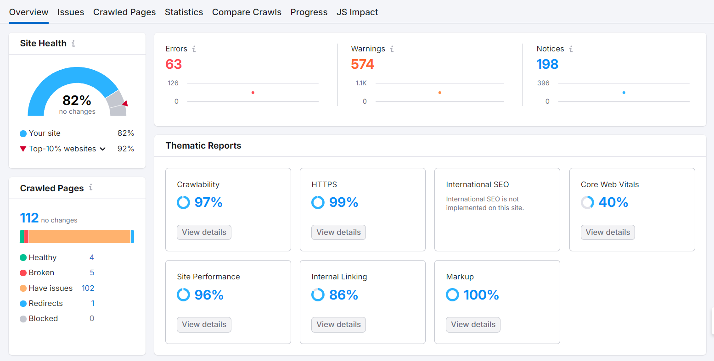
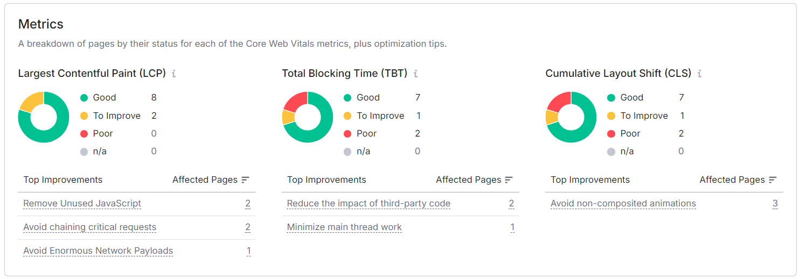
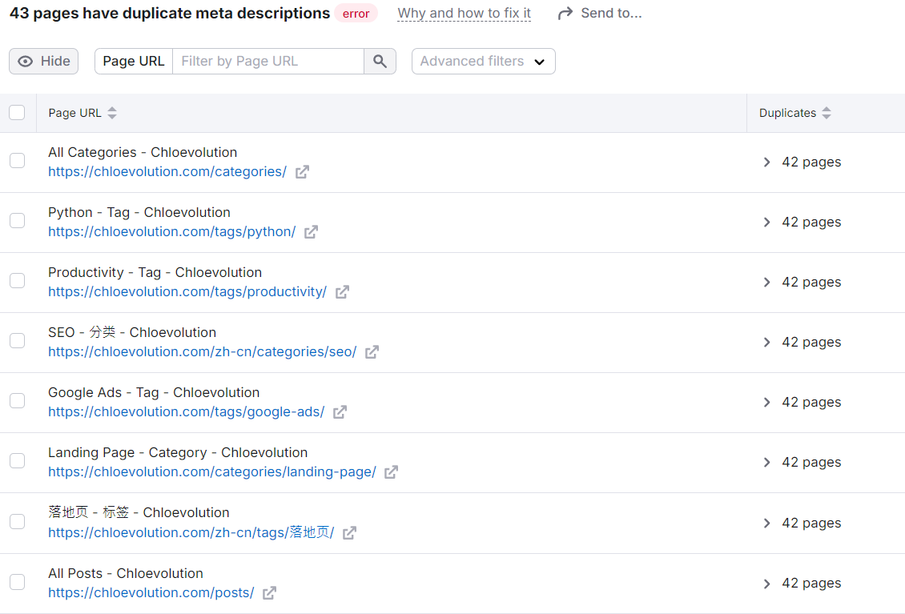
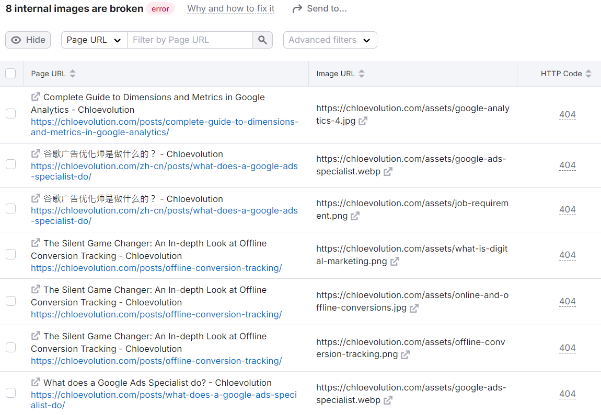

一直苦于网站页面的收录问题，新的文章没有少发，但未收录的页面不减反增。于是专门用SEMrush对网站进行了整体分析，针对特定问题做出了一些修正，看看收录情况会不会有改善。

用到的是Site audit功能，输入域名、设置爬取的页面数量后，等待约十几分钟，就可以收获一份分析报告：


几项指标之间核心逻辑：
- **Crawlability 和 Internal Linking**：确保网站内容被发现和抓取。
- **HTTPS 和 Site Performance**：保障安全性和加载速度，为用户和搜索引擎提供良好体验。
- **Core Web Vitals 和 Markup**：直接影响用户体验和搜索引擎对内容的理解。

优化优先级建议：
- 基础保障：优先优化 HTTPS 和 Crawlability。
- 性能提升：改善 Site Performance 和 Core Web Vitals。
- 内容强化：完善 Internal Linking 和 Markup。


## 爬取页面数


共爬取到112个页面，其中绝大部分页面都显示存在问题。
- 4个健康页面：3个站点地图XML文件、1个robots的TEXT文件

- 5个破裂页面：都是之前发布后删除的文章页面，处于404状态，不过在Google Search Console的报告中已经看不到这几个页面，故无需处理。

- 1个重定向页面：网站首页（[https://www.chloevolution.com/](https://www.chloevolution.com/)）。为了保证用户无论是否在网址中带有www都可以访问我的网站，我声明的canonical首页是[https://chloevolution.com/](https://chloevolution.com/)，当用户访问带www的网站时会自动重定向到这个页面。这部分在GSC中也符合设置，无需处理。

- 102个有问题的页面：根据下面的细分评估指标逐一排查问题。


## 爬取与索引优化
这部分的得分为97。


- 站点收录度：绝大部分页面都已被收录，有11个未收录页面。
- 爬虫预算浪费：
    - 1个永久重定向：前文提到过对网站首页的重定向处理。
    - 5个4xx错误：前文提到的已删除页面。
    - 5个canoncial指向其它页面：都是博文目录页的分页，检查了一下发现canonical标签都指向首页，但之前并未作相关的设置，需要处理。


- 页面爬取深度：基本在1到2次点击内可完成。
    - 需点击3次完成爬取的页面：共6个，其中5个是已删除页面，一个是[https://chloevolution.com/zh-cn/posts/how-to-create-bot-on-coze/](https://chloevolution.com/zh-cn/posts/how-to-create-bot-on-coze/)，在GSC中显示已发现但未收录，前向页面来自GitHub
    - 需点击4次次或以上完成爬取的页面：共43个，全部为中文页面。


## 核心网页指标优化
这部分的得分为40。



主要问题出现在TBT和CLS。但技术SEO这块我不是很了解，只能延后处理。


## 内链优化 
这部分的得分为86。


主要问题还是出现在之前已经删除的页面，导致目前仍引向这些页面的链接处于破裂状态。另外在部分文章中引用的外部链接，也需要定期检查其是否仍支持访问。


另外可以优化的部分包括：
- 外部链接带nofollow属性：受影响链接都为[https://creativecommons.org/licenses/by-nc/4.0/](https://creativecommons.org/licenses/by-nc/4.0/)。这是一个描述 CC BY-NC 4.0 许可的页面，表明我的网站使用了 Creative Commons 许可的内容，无需处理。
- 只有1个内链的页面：受影响的都是都是博文目录页的分页。

## 其它值得关注的问题


### Meta标签描述重复

基本都是分类页、标签页。看了下源代码，都是沿用的首页一样的meta描述，需要修改。

### 标题标签重复

中文首页和英文首页的标题标签字段相同，故提示重复。

### 内部图片链接破裂

之前重建网站时丢失了部分图片，故部分文章中虽然引用了图片，实际页面中无法展示对应的图片，需要修改。


## 相关问题处理方法
### 博文目录页分页canonical标签指向首页
随机检查了几个页面，发现只有这几个博客目录页分页的 canonical 标签不正确，其它都是指向页面本身。我是用Hugo和GitHub Pages搭建的网站，可以通过强制正确设置 canonical，来确保所有页面的 canonical 标签都正确指向该页面本身的 URL。
找到 layouts/partials/head.html 中的 <head> 部分，使用以下代码覆盖：
```
<link rel="canonical" href="{{ .Permalink }}" />
```

原理是：在 Hugo 中，.Permalink 是每个页面的唯一永久链接。通过使用 .Permalink，可以动态生成当前页面的正确 URL，并将其设置为 canonical。

### 破裂的内链和外链
这部分受影响的链接只能手动找到相关博客文章中对应的锚文本和链接，然后删除或替换链接：


