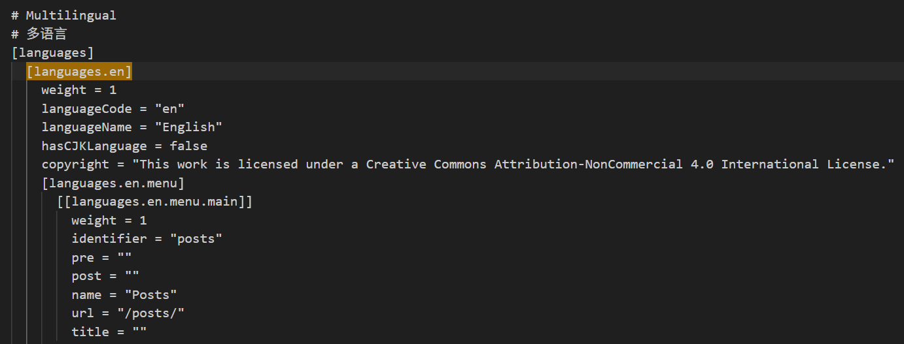

## Hugo 多语言站点未被搜索引擎正确收录的可能原因
我发现近期发布的新文章有个问题：**同一篇文章，谷歌只会收录其中一个语言版本（中文或者英文）**。也存在两个版本同时收录的情况，但很少。于是我开始检查网站是否存在没有正确配置的部分。排查下来存在以下几种可能性：

### 多语言配置问题
- 确保 `config.toml` 或 `config.yaml` 中已正确定义多语言配置，例如：
```toml
       [languages.en]
       weight = 1
       languageName = "English"
       contentDir = "content/en"

       [languages.zh]
       weight = 2
       languageName = "中文"
       contentDir = "content/zh"
```
- 确认每篇文章的 `index.md` 头部包含语言标识，如 `language: en` 或 `language: zh`。

### 缺失 `hreflang` 标签
搜索引擎需要 `hreflang` 标签来识别不同语言版本的页面。若未正确生成，可能导致只索引一种语言。
- 在浏览器中右键查看页面源码，搜索 `hreflang` 标签，确认中英文页面互相指向对方。

### Sitemap 生成问题
- 访问 `yoursite.com/sitemap.xml`，确认其中包含中英文所有页面的 URL。
- 确保 `config.toml` 中未通过 `disableKinds` 禁用 sitemap 生成。

### 内容重复问题（SEO 冲突）
若中英文页面 URL 路径完全相同（如 `/posts/article1`），搜索引擎可能视为重复内容，仅收录其一。

### 爬虫抓取频率限制
新站点或更新频率低的站点，搜索引擎可能尚未抓取所有页面。

### GitHub Pages 部署问题
我的网站是通过Hugo和GitHub Pages搭建的，所以也需要确认GitHub Pages本身的部署是否正确：
- 确认 `public` 文件夹已正确生成两种语言的静态文件（如 `/en/` 和 `/zh/` 目录）。
- 检查 GitHub Pages 的构建日志，确保无错误。

## 排查结果
### 多语言配置问题
`config.toml`文件中已定义英文和中文的多语言配置，但是每篇文章的`inded.md`头部未包含语言标识。


但因为我使用的是Hugo的文件名后缀多语言方案（如 `index.zh-cn.md` 和 `index.md` 作为默认语言），而Hugo默认通过文件名后缀（如 `.zh-cn.md`）自动匹配语言。例如：
- `index.md` → 默认语言（如 `en`）
- `index.zh-cn.md` → 中文（需在 `config.toml` 中定义 `zh-cn` 语言配置）
所以无需在 Front Matter 中添加 language 字段，Hugo会通过后缀自动处理。

### 缺失 `hreflang` 标签
我的网站页面源码中确实没有`hreflang`标签，需要补充配置。

### 其它可能问题
- Sitemap 生成问题：我的sitemap分为en和zh-cn两个，包含对应的中英文所有页面的URL，也未禁用sitemap的生成
- 中英文页面URL路径是否相同以及部署问题：我生成的`public/`目录中各语言内容路径正确（如`public/en/article1/`和`public/zh-cn/article1/`），说明Hugo已正确识别语言并生成对应页面

## Hugo添加hreflang标签

### hreflang是什么？ 
`hreflang` 是HTML中的属性，用于指定网页的不同语言或地区版本。它通过 `<link>` 标签在页面头部声明，帮助搜索引擎（如Google）识别同一内容的多语言/区域变体，从而将用户引导至最合适的版本。例如：
```html
<link rel="alternate" hreflang="en" href="https://example.com/en/page/" />
<link rel="alternate" hreflang="zh-CN" href="https://example.com/zh/page/" />
```

### Hugo + GitHub Pages网站是否需要hreflang？

#### 需要hreflang的情况
1. **多语言内容**：网站有多个语言版本（如英文、中文）。
2. **区域定向**：内容针对不同地区调整（如美国英语 `en-US` 和英国英语 `en-GB`）。
3. **SEO优化需求**：希望避免搜索引擎将多语言页面视为重复内容，并提升目标用户的搜索排名。

#### 无需hreflang的情况
网站仅使用单一语言，无多语言/区域版本。


### 如何在Hugo中添加hreflang标签？

#### 步骤1：配置Hugo多语言支持
在 `config.toml` 中定义支持的语言：
```toml
[languages]
  [languages.en]
    languageName = "English"
    weight = 1
    contentDir = "content/en"
  [languages.zh]
    languageName = "中文"
    weight = 2
    contentDir = "content/zh"
```

#### 步骤2：在模板中添加hreflang标签
在全局头部模板（如 `layouts/partials/head.html`）中插入以下代码：
```html
<head>
  {{ range .Translations }}
  <link rel="alternate" hreflang="{{ .Language.Lang }}" href="{{ .Permalink }}" />
  {{ end }}
  <link rel="alternate" hreflang="{{ .Language.Lang }}" href="{{ .Permalink }}" />
</head>
```
此代码会为当前页面的所有翻译版本生成对应的 `hreflang` 标签。

#### 步骤3：验证实现
- 使用[Google Search Console](https://search.google.com/)的“国际定位”报告检查错误。
- 通过在线工具（如[Screaming Frog](https://www.screamingfrog.co.uk/)）抓取页面，确认标签存在且正确。


