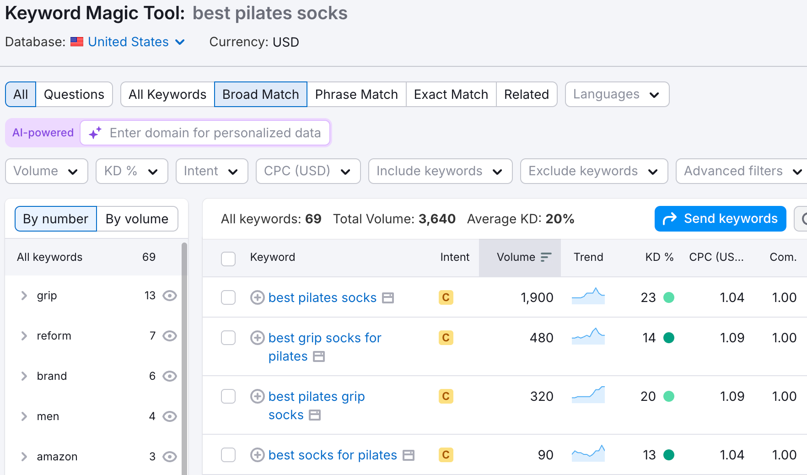

[Swiftbrief](https://www.swiftbrief.com/)是一个基于AI的SEO平台，可用于简化内容创作流程。主要包括以下功能：
1. 通过分析关键词和主题数据，自动创建内容大纲
2. 关键词研究和聚类
3. 整合SEO数据，优化内容质量和效果

## 测试内容
### 注册 & onboarding
在注册环节，有一个不太方便的点在于，要求注册者提供自己的网站地址，且是必填项：

可以发现平台本身也在探索合适的教学方式，会在注册过程中让用户选择自己偏好的学习方式：

注册完成后，会无缝进入到产品试用的界面。不会提示目前是产品的什么功能，而是直接让你开始创作文章内容。
创建内容时需要输入的信息：

- 页面主题（page topic）
- 目标国家（country）
- 目标语言（language）
- 页面类型（page type）
包括：指南型博客(guide blog)、合集型博客(roundup blog)、清单型博客(listicle blog)、对比型博客(VS blog)、评测型博客(review blog)、模板型博客(templates blog)、解决方案页面(solutions page)、合集页面(collection page)、产品页面（product page）

### 选择目标关键词

提供必要信息后，会提供两个后续模式供选择：挑选页面关键词（Page Keyword Selection）和完成页面内容（Page Content Completion）

选择“手动选择关键词”后，之前输入的目标topic会自动生成一个项目，展开项目后可以选择具体的关键词。也可以自己手动添加更多目标关键词：

具体的关键词列表中，主要通过以下几个维度来评估：

| 分类            | 维度名称                           | 简要说明                                 |
| ------------- | ------------------------------ | ------------------------------------ |
| 搜索意图与用户行为  | **搜索意图（Intent）**               | 用户搜索该关键词时的核心目的（如获取信息、购买、比较等）         |
|               | **相关提问（Also Asked）**           | Google 展示的“别人也问了”问题，显示与该关键词相关的其他搜索行为 |
| 关键词与主题相关性  | **主题集群相关性（Cluster Relevance）** | 关键词在多个 SERP 中出现的频率，用于判断与当前主题的相关度     |
|               | **精选摘要（Featured Snippet）**     | SERP 顶部是否存在精选摘要结果，有利于获取更高点击率         |
| 热度与难度指标    | **美国搜索量（US Volume）**           | 关键词在美国市场的月均搜索次数，反映搜索热度               |
|               | **关键词难度（Keyword Difficulty）**  | 关键词的排名难度，基于竞争对手的 SEO 实力计算            |
| 竞争强度与SEO机会 | **流量标记（Traffic Mark）**         | 倒数第二个自然结果的流量估算值，评估最低预期收益             |
|               | **权威度标记（Authority Mark）**      | 倒数第二名结果所属域名的权威评分（DR），反映竞争强度          |
|               | **平均权威度（Average DR）**          | 前10名搜索结果中域名的平均权威度，衡量整体竞争环境           |
| 内容优化指标     | **平均出现频率（Average Frequency）**  | 该关键词在Top 10页面中平均出现的次数，提示自然嵌入密度       |
| 优先级评估工具     | **优先级评分（Priority Score）**      | 综合流量与权威度标记得出的关键词优先级评分，用于排序关键词机会      |

此外，在目标频率（Target Frequency）下，可以设置希望在文章中提及该关键词的频次（平台会有一些自动的预设值，用户可输入的最大值为100），即设置期望的关键词密度。

但我觉得比较奇怪的一点是，所有词的关键词难度都是0，这显然是不合理的。于是我在SEMrush输入了同样的关键词进行比较，发现Swiftbrief展示的美国月均搜索量也要明显更高：

### 生成文章内容

完成关键词选择后，等待了至少半个小时才看到生成的文章：
- 以文本编辑器的形式呈现
- 左侧上方为meta tag，包括标题、描述、URL；下方为主要的SERP竞争对手，列举了对应的链接。另外还可以通过调研助手（research assistant）检索不确定的概念，比如我在这里搜索了“普拉提的起源”
- 右侧为文章正文，下方显示：总字数、标题数目、图片数目

粗略地看了下文章整体结构，不考虑文章实际内容，有以下几点感受：
- 优点：
    - 内容中会适度嵌入网站中已经有的页面，保证内链结构的完整性；除了内链外，还会引用其它网站的页面。但引用的是裸链，如果自动设置合适的锚文本就更好了
    - 涉及对比或列举的内容，会使用表格组织内容
- 缺点：
    - 有配图，但基本和文章内容无关
    - 段落字数过短，大部分都是两到三行，信息比较零碎

如果有觉得不合适的内容，可以直接在编辑器里进行修改，也可以把链接分享给其他人进行内容协作。确认文章内容无问题后，可以直接发布到网站上，但需要先集成对应的平台：

