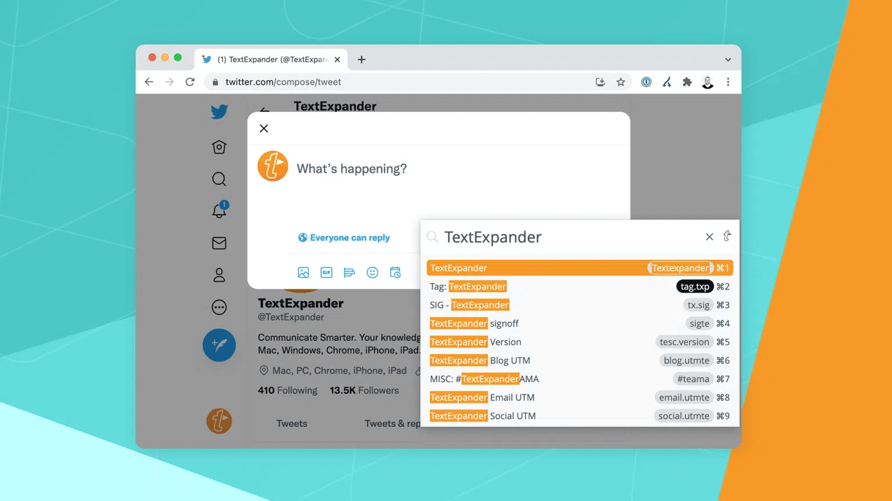
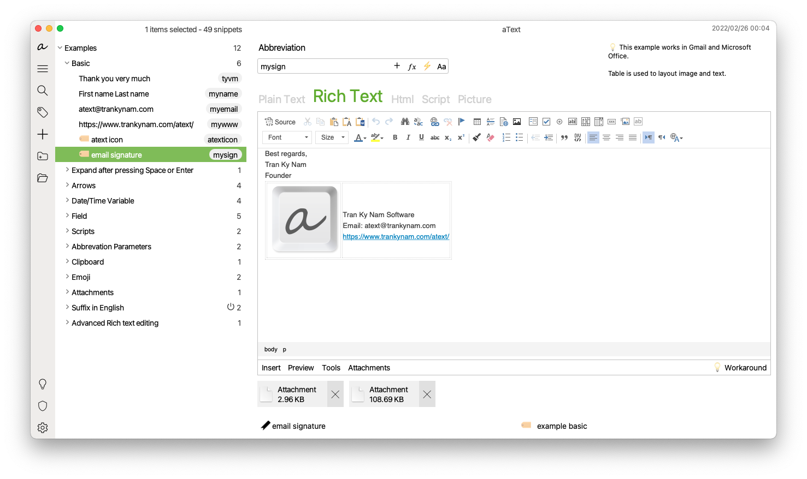
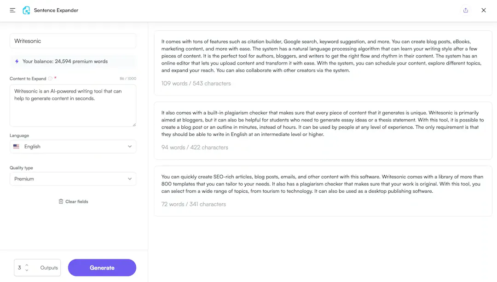
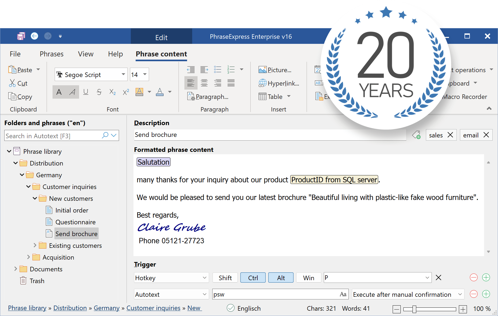

In the quest for peak productivity, text expansion tools are the unsung heroes for professionals across the board. By turning shortcuts into fully formed text, these tools save time and reduce tedium, no matter your field. This article dives into the top text expansion tools, customized for various roles, to help you work smarter, not harder.

## The best text expansion tools for 2025 at a glance

<table>
    <tr>
        <td></td>
        <td>Free trial time</td>
        <td>Pricing</td>
        <td>Supported platform</td>
        <td>Integration</td>
        <td>AI feature</td>
   </tr>
    <tr>
        <td>TextExpander</td>
        <td>30 days</td>
        <td>Start from $3.33/month per user</td>
        <td>Web, Windows, Mac, iOS, Android</td>
        <td>✅</td>
        <td>❌</td>
   </tr>
    <tr>
        <td>Espanso</td>
        <td>free (open-source)</td>
        <td>-</td>
        <td>Windows, Mac, Linux</td>
        <td>✅</td>
        <td>❌</td>
   </tr>
    <tr>
        <td>aText</td>
        <td>21 days</td>
        <td>Start from $4.99/year per individual</td>
        <td>Windows, Mac</td>
        <td>❌</td>
        <td>❌</td>
   </tr>
    <tr>
        <td>Writesonic Sentence Expander</td>
        <td>free forever (Free version)</td>
        <td>Start from $12/month per individual</td>
        <td>Browser, Windows, Mac, iOS, Android</td>
        <td>❌</td>
        <td>✅</td>
   </tr>
    <tr>
        <td>PhraseExpress</td>
        <td>21 days</td>
        <td>Start from $83</td>
        <td>Windows, Mac, iOS</td>
        <td>✅</td>
        <td>✅</td>
   </tr>
</table>

### 1. TextExpander

[TextExpander](https://textexpander.com/) - a highly popular tool known for its robust features, including custom word, sentence, and paragraph text generation with keyboard shortcuts.

**Key Features:**
- Customizable shortcuts for expanding text.
- Works across various platforms including macOS, Windows, iOS, and Chrome.
- Offers analytics to track usage and productivity gains.
- Supports team sharing for snippets.

**Pros:**
- Highly versatile with robust support for various platforms.
- Team functionality is excellent for collaborative environments.

**Cons:**
- Subscription-based pricing can be a downside for individual users.
- Learning curve for advanced features.

**Integration:**
- Integrates with a wide range of software including Trello, Slack, and Gmail.

**Pricing:**
- Starts at $3.33 per month for individuals, with a team plan available.

### 2. Espanso

[Espanso](https://espanso.org/) - an open-source text expander offering basic functionalities expected from an autotext app, suitable for those seeking a free solution.

**Key Features:**
- Open-source and cross-platform (Windows, macOS, Linux).
- Supports custom scripts and forms for dynamic snippets.
- YAML file configuration for creating snippets.

**Pros:**
- Free to use.
- Highly customizable and supports scripting for complex expansions.

**Cons:**
- Configuration through YAML files might be intimidating for non-technical users.
- Lack of a graphical user interface.

**Integration:**
- Being open-source, it can be manually integrated into many environments but lacks direct application integrations.

**Pricing:**
- Free.

### 3. aText

[aText](https://www.trankynam.com/atext/) - a straightforward application designed for text expansion, allowing users to create snippets for repetitive text.

**Key Features:**
- Text expansion for macOS and Windows.
- Supports rich text and images in snippets.
- Simple and straightforward interface.

**Pros:**
- Affordable one-time purchase.
- Lightweight and easy to use.

**Cons:**
- Less feature-rich compared to competitors.
- No direct cloud syncing feature.

**Integration:**
- Works system-wide on supported operating systems but lacks specific application integrations.

**Pricing:**
- $4.99 one-time purchase.

### 4. Writesonic Sentence Expander

Part of Writesonic's suite of AI writing tools, [Writesonic Sentence Expander](https://writesonic.com/sentence-expander) rephrases content with a click, along with other writing assistance features.

**Key Features:**
- Part of an AI writing suite, designed to enhance and expand sentences.
- Uses AI to improve sentence quality and readability.
- Web-based tool compatible with modern browsers.

**Pros:**
- Integrated with other Writesonic AI writing tools.
- Easy to use without installation.

**Cons:**
- Reliant on internet connectivity.
- Usage limited by subscription tier.

**Integration:**
- Primarily a standalone web tool, though it can be used alongside other Writesonic features.

**Pricing:**
- Part of Writesonic plans, starting from $12 per month.

### 5. PhraseExpress

[PhraseExpress](https://www.phraseexpress.com/) is a versatile text expansion tool that allows users to automate repetitive typing tasks by creating custom shortcuts for frequently used text blocks. Available on multiple platforms, including Windows and Mac, it boosts productivity for both personal and professional use with its intuitive interface and powerful features.

**Key Features:**
- Text expansion for Windows, macOS, and iOS.
- Offers macro functions for dynamic snippets.
- Can import data from other text expansion apps.

**Pros:**
- Comprehensive feature set with support for macros.
- Cross-platform compatibility.

**Cons:**
- Can be overwhelming for beginners due to its extensive features.
- The mobile version is more limited than the desktop versions.

**Integration:**
- Integrates with professional environments, offering solutions for medical, legal, and administrative fields.

**Pricing:**
- Free trial supported, with standard licenses starting at approximately $83.

## How to choose the best text expander tool for your needs?

Selecting the ideal text expander tool for your needs requires taking into account a number of criteria to make sure the tool improves productivity and blends in seamlessly with your workflow. Here are some pointers to assist you in making a wise choice:

### 1. **Assess What You Need**

Determine what you require from a text expander tool first. Think about the kinds of words or phrases you use most often and if you require the tool for work in a collaborative setting, for personal use, or for professional business. Advanced capabilities like snippet sharing between teams are available in certain tools, and these could be quite important in teamwork environments.

### 2. **Compatibility Across Platforms**

Make sure the text expander tool works with the programs you frequently use as well as your operating system (Windows, macOS, Linux). While some tools are specifically made for desktop settings, others are browser-based and hence available to everyone.

###3. **Simplicity of Use**

Your process should be made simpler, not more complicated, by a text expander. Seek for equipment that is simple to assemble and operate. Important elements that can improve usability include a simple user interface and the capacity to swiftly create, edit, and arrange snippets.

### 4. **Adaptability and Personalization**

With so much customisation available, the finest text expanders let you make snippets for almost any text that you frequently find yourself typing. Furthermore, check for flexibility when creating triggers (shortcuts) and the capability to add dynamic content to your snippets, like dates or clipboard contents.

### 5. **Skills for Integration**

Think about how well the text expander works with the programs you use the most. While certain solutions are system-wide, others might provide greater interaction with particular apps, which would increase your productivity in those settings.

### 6. **Value and Pricing**

Compare the text expander tool's price to the capabilities and advantages it provides. A free version with limited features is offered by many tools, and it can be adequate for your purposes. On the other hand, advanced features like team sharing, analytics, and priority assistance are frequently included in premium editions. Check to see if the cost is in line with the value you anticipate getting.

###7. **Trial Times and Evaluations**

Use trial periods to experience the functionality and usability of a text expander firsthand. This enables you to determine whether the tool fulfills your needs prior to making a purchase. Reading customer testimonials and reviews can also provide you an understanding of other people's experiences and may even point out advantages and disadvantages you hadn't thought of.

## Recommended text expansion tool for different people
Choosing a text expansion tool can greatly increase productivity, but the best option will frequently rely on your unique needs and function. The following list of suggested text expansion resources is adapted for various work roles:

### 1. **Writers and Content Creators**
- **Tool:** PhraseExpress
- **Why:** Rich text and picture snippet features are helpful for anything that has to be formatted. Its ability to group snippets into folders facilitates the management of a huge library of templates, prefabricated responses, and frequently used words.
- **Key Feature:** Advanced text macro functions for dynamic content creation.

### 2. **Developers and Programmers**
- **Tool:** Espanso
- **Why:** It is perfect for coding environments because it supports shell commands and scripting, enabling the automation of intricate code snippets and even the execution of brief scripts without leaving the text editor.
- **Key Feature:** YAML-based configuration for creating highly customizable snippets.

### 3. **Customer Support Representatives**
- **Tool:** TextExpander
- **Why:**Provides team sharing features that make it simple to guarantee uniform communication amongst customer service teams. By monitoring the most frequently used snippets, analytics can improve efficiency and response times.

- **Key Feature:** Ability to share snippet groups with teams and measure usage statistics.

### 4. **Medical Professionals**
- **Tool:** PhraseExpress (Medical Edition)
- **Why:** With HIPAA compliance in mind, the medical edition provides safe text expansion for prescriptions, patient information, and frequently used medical terms. 

- **Key Feature:** Specialized medical dictionaries and templates.

### 5. **Legal Professionals**
- **Tool:** Breevy
- **Why:** Breevy is well-known for being dependable and user-friendly, and it can manage the intricate and frequently long text needed in contracts, communications, and legal documents. For individuals who are actively involved in the Microsoft Office environment, the option to import AutoCorrect entries from Microsoft Office is a boon.

- **Key Feature:** Seamless integration with Microsoft Office and compatibility with TextExpander snippets.

### 6. **Academics and Researchers**
- **Tool:** aText
- **Why:** Its simplicity and effectiveness make it a great tool for managing citations, repetitive research notes, and academic phrases. The low cost is also a plus for those in academia.
- **Key Feature:** Supports rich text and images, useful for inserting formatted references.

### 7. **Marketing Professionals**
- **Tool:** TextBlaze
- **Why:** TextBlaze is the best tool for creating repeating emails, social media posts, and marketing materials because of its heavy emphasis on templates and automation inside web browsers. These tools may be easily integrated into CRM systems or email marketing platforms.
- **Key Feature:** Conditional logic in snippets, allowing for dynamic content creation based on specific criteria.

