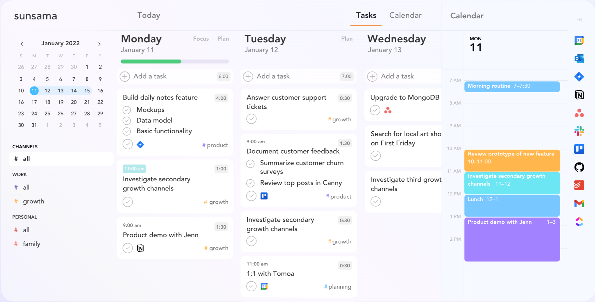
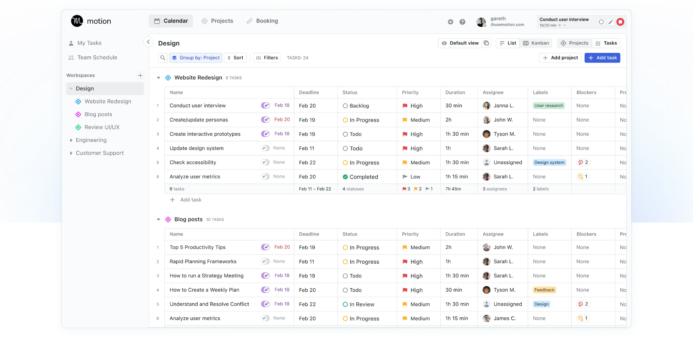
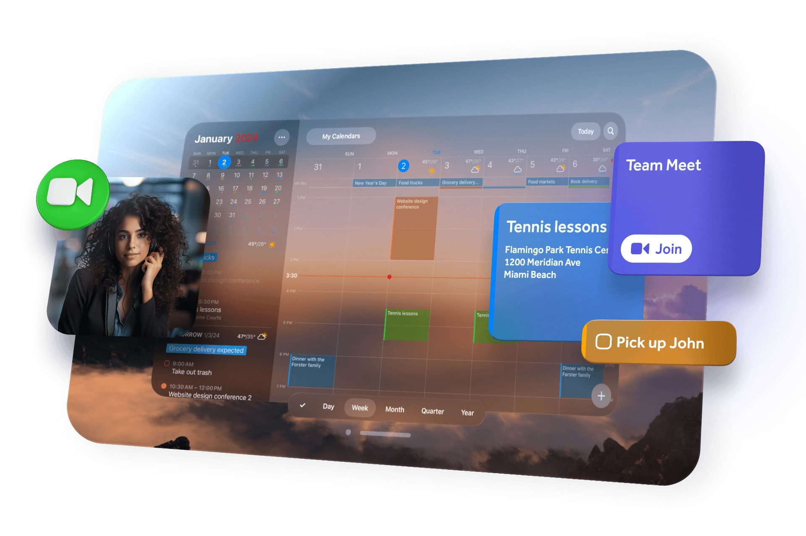
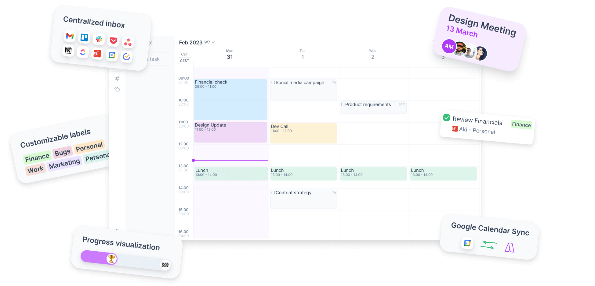
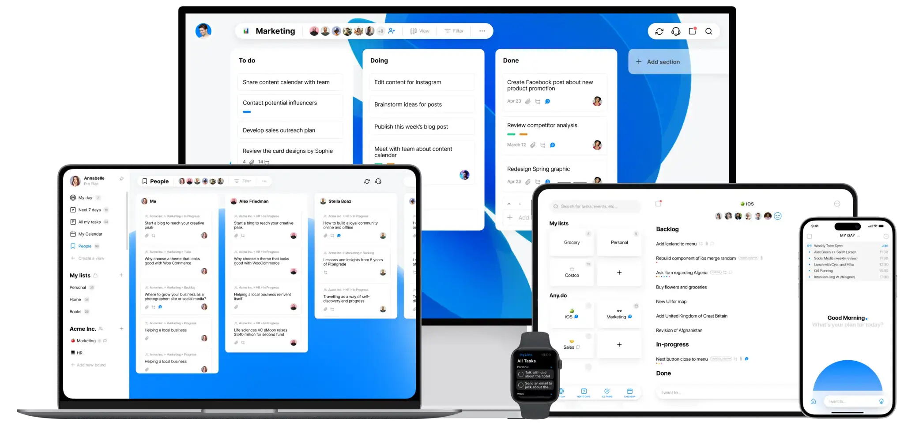
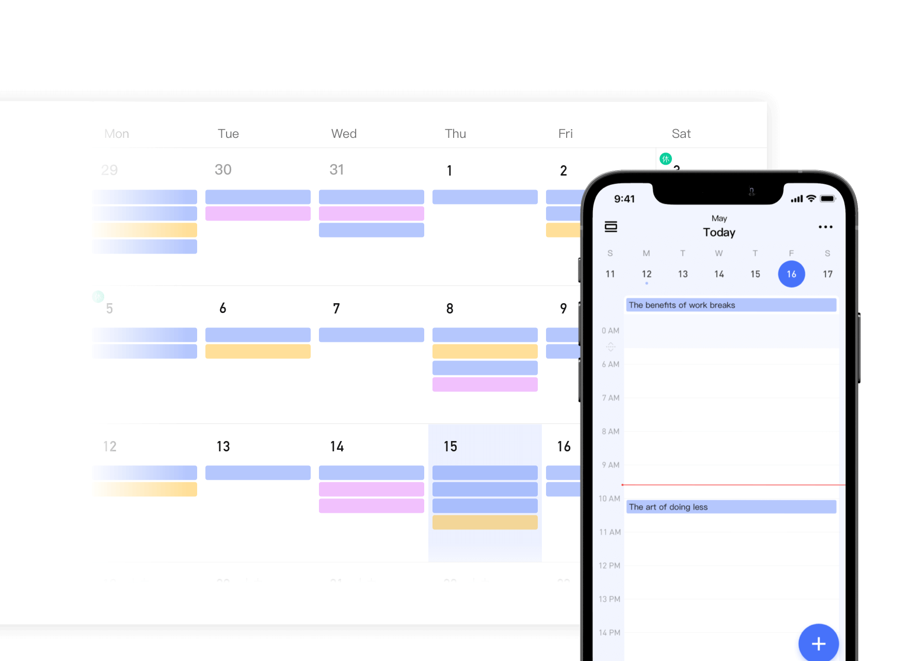
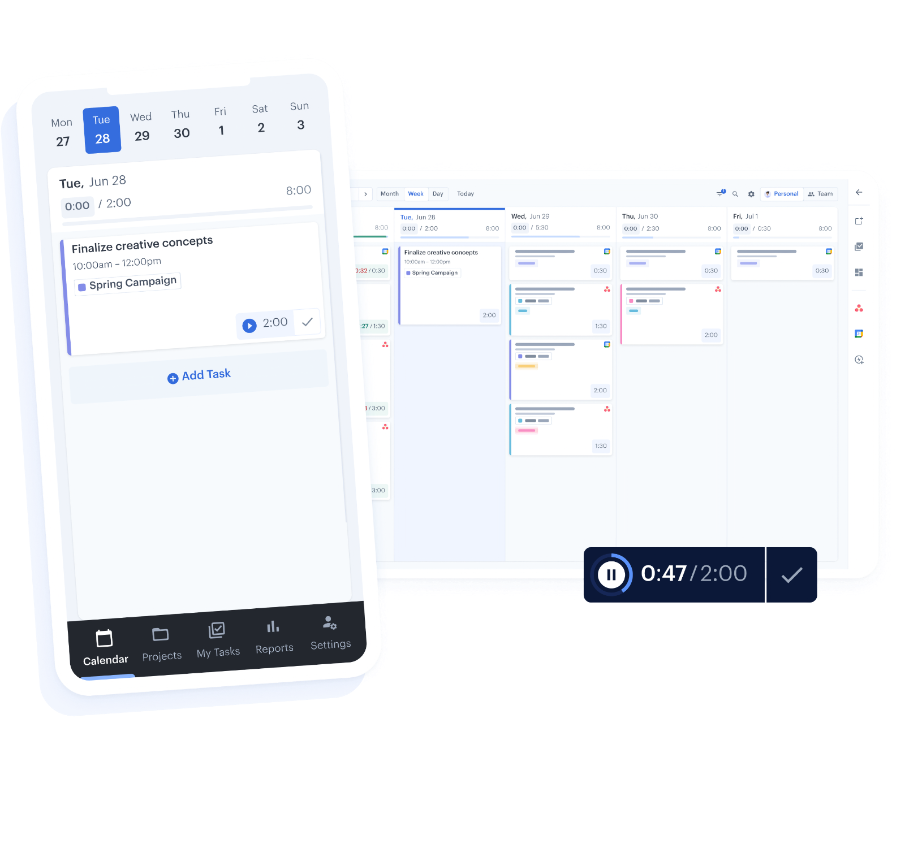
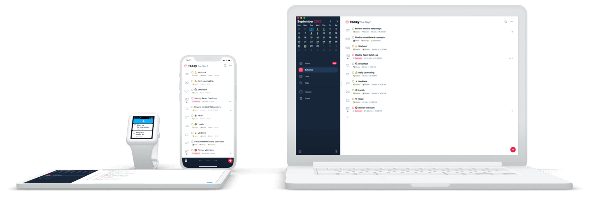
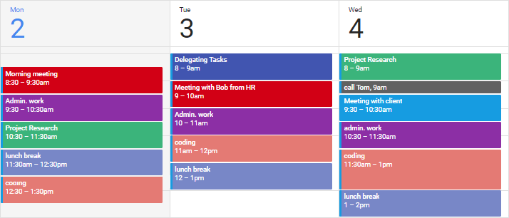
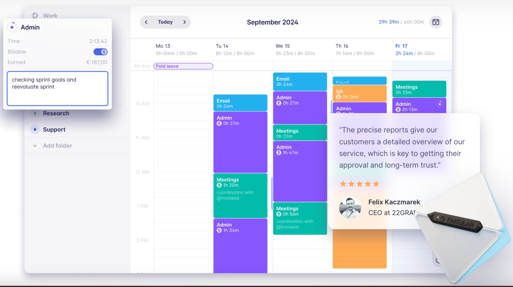

The workplace and productivity environment kept changing quickly in 2023, with a sizable percentage of workers adopting remote or hybrid work arrangements. According to a Pew Research Center research, 59% of American workers who believe they can perform the majority of their work from home also work from home all or most of the time. 

A methodical approach to addressing the day's work is provided by timeboxing, which is the practice of assigning a predetermined amount of time to a particular task or activity before beginning. It aids in work prioritization as well as realistic boundary setting, which lowers the likelihood of burnout and improves work-life balance overall.

## The best timeboxing apps for 2024 at a glance

<table>
    <tr>
        <td></td>
        <td>Free trial time</td>
        <td>Pricing</td>
        <td>Supported platform</td>
        <td>Integration</td>
        <td>AI feature</td>
   </tr>
    <tr>
        <td>Sunsama</td>
        <td>14 days</td>
        <td>Start from $20/month per user</td>
        <td>Browser, Windows, Mac, iOS, Android</td>
        <td>✅</td>
        <td>❌</td>
   </tr>
    <tr>
        <td>Motion</td>
        <td>7 days</td>
        <td>Start from $34/month per individual</td>
        <td>Browser, Windows, Mac, iOS, Android</td>
        <td>✅</td>
        <td>✅</td>
   </tr>
    <tr>
        <td>Fantastical</td>
        <td>14 days</td>
        <td>Start from $4.99/month per individual</td>
        <td>Browser, Windows, Mac, iOS, Android, Watch, Vision Pro</td>
        <td>✅</td>
        <td>❌</td>
   </tr>
    <tr>
        <td>Akiflow</td>
        <td>7 days</td>
        <td>Start from $34/month per individual</td>
        <td>Browser, Windows, Mac, iOS, Android</td>
        <td>✅</td>
        <td>❌</td>
   </tr>
    <tr>
        <td>Any.Do</td>
        <td>forever (Personal version)</td>
        <td>Start from $5/month per individual</td>
        <td>Browser, Windows, Mac, iOS, Android, Watch</td>
        <td>✅</td>
        <td>✅</td>
   </tr>
    <tr>
        <td>TickTick</td>
        <td>forever (non-premium version)</td>
        <td>Start from $3.99/month per individual</td>
        <td>Browser, Windows, Mac, iOS, Android, Watch</td>
        <td>✅</td>
        <td>❌</td>
   </tr>
    <tr>
        <td>HourStack</td>
        <td>14 days</td>
        <td>Start from $12/month per individual</td>
        <td>Browser</td>
        <td>✅</td>
        <td>❌</td>
   </tr>
    <tr>
        <td>Sorted^3</td>
        <td>forever (basic version)</td>
        <td>Start from $14.99/year per individual</td>
        <td>Mac, iOS, Watch</td>
        <td>❌</td>
        <td>❌</td>
   </tr>
    <tr>
        <td>RescueTime</td>
        <td>14 days</td>
        <td>Start from $6.5/month per individual</td>
        <td>Windows, Mac, iOS, Android</td>
        <td>✅</td>
        <td>✅</td>
   </tr>
    <tr>
        <td>Clockify</td>
        <td>free forever (basic version)</td>
        <td>Start from $4.99/month per individual</td>
        <td>Windows, Mac, iOS, Android</td>
        <td>✅</td>
        <td>❌</td>
   </tr>
    <tr>
        <td>TimeBloc</td>
        <td>free</td>
        <td>in-app purchase</td>
        <td>iOS, Android</td>
        <td>✅</td>
        <td>❌</td>
   </tr>
    <tr>
        <td>Timeular</td>
        <td>30 days</td>
        <td>Start from $7.5/month per individual</td>
        <td>Windows, Mac, iOS, Android</td>
        <td>✅</td>
        <td>✅</td>
   </tr>
</table>

### 1. Sunsama

[Sunsama](https://www.sunsama.com/) is designed to facilitate a balanced approach to work-life, emphasizing calmness and focus. It aims to consolidate your tasks into a single, organized view.

**Features:**
- Daily planning tool that integrates with calendar and task management services like Google Calendar, Trello, Asana, and Jira.
- Allows users to drag and drop tasks into a daily schedule.
- Provides analytics on time spent on various activities.

**Pros:**
- Helps users focus on what needs to be done daily, promoting a sense of accomplishment.
- The integration feature makes it easy to manage all tasks and appointments in one place.
- Useful analytics to improve productivity over time.

**Cons:**
- Primarily focused on daily planning, which may not suit those looking for long-term project management features.
- Requires subscriptions to other services for full functionality.

**Pricing:**
- Sunsama offers a 14-day free trial, after which it costs $20/month per user.

### 2. Motion

[Motion](https://www.usemotion.com/) seeks to streamline your day by employing advanced algorithms to automatically plan your schedule, taking into account your priorities and preferences.

**Features:**
- AI-driven task prioritization and calendar optimization.
- Integrates with Google Calendar, Outlook, and more to suggest the best times for meetings and focused work sessions.
- Offers real-time adjustments as priorities change throughout the day.

**Pros:**
- Highly customizable, adapting to the user's working style and priorities.
- Saves time by automatically scheduling tasks and meetings.
- Reduces decision fatigue regarding when to work on what.

**Cons:**
- The AI-driven suggestions might not always align perfectly with personal preferences or unforeseen changes in availability.
- Higher learning curve due to its extensive suite of features.

**Pricing:**
- Motion has a tiered pricing model starting at $34/month for individuals, with custom pricing for teams.

### 3. Fantastical

[Fantastical](https://flexibits.com/fantastical) provides an innovative calendar experience with powerful features, including natural language parsing, making event creation quick and efficient.

**Features:**
- Advanced calendar app with natural language event creation, weather forecasts, and meeting integration.
- Works across macOS, iOS, and iPadOS.
- Supports multiple languages and calendar services like Google Calendar, iCloud, and Exchange.

**Pros:**
- Natural language input makes adding events quick and intuitive.
- Beautiful, customizable interface with robust viewing options.
- Integration with a wide array of apps and services.

**Cons:**
- Mostly beneficial for Apple device users; limited functionality on other platforms.
- Some features, like proposal meetings, are only available in the premium subscription.

**Pricing:**
- Fantastical offers a free version with basic features. The premium version is available for $4.99/month or $39.99/year, which unlocks all features.

### 4. Akiflow

[Akiflow](https://akiflow.com/) is a task management tool that prioritizes speed and integration, allowing users to collect tasks from various sources into a unified command center.

**Features:**
- A task and calendar management tool that consolidates tasks from various platforms (email, Slack, Todoist, Asana) into one place.
- Offers command bar for quick task entry and scheduling.
- Integrates with Google Calendar and Outlook for seamless calendar management.

**Pros:**
- Centralizes tasks and appointments, reducing the need to switch between apps.
- Fast task entry and scheduling save time and boost productivity.
- Helps in prioritizing tasks effectively with its unified view.

**Cons:**
- Primarily designed for individual use, which may limit its functionality for team collaboration.
- Dependency on integrations means users must already be using supported third-party services.

**Pricing:**
- Akiflow offers a 14-day free trial, followed by a subscription fee of $34/month (billed monthly).

### 5. Any.Do

[Any.Do](https://www.any.do/) is centered around simplicity and effectiveness in task management, offering features that help users stay organized and accomplish their daily goals.

**Features:**
- Task management app with features like to-do lists, reminders, and an integrated calendar.
- Offers collaboration tools for shared lists and tasks.
- Voice entry and mobile app widgets for easy task updating.

**Pros:**
- User-friendly interface that’s easy to navigate for beginners.
- Versatile functionality, suitable for both personal and professional use.
- Collaboration features make it great for small teams and family organization.

**Cons:**
- Some advanced features are locked behind the premium version.
- Users have reported occasional sync issues between devices.

**Pricing:**
- Any.Do offers a basic free version. The premium version is available for $5/month, billed annually.

### 6. TickTick

[TickTick](https://ticktick.com/) is designed for task management and personal productivity, featuring a blend of to-do list functions, reminders, and habit-tracking capabilities.

**Features:**
- Comprehensive task management app with to-do lists, reminders, a built-in Pomodoro timer, and habit-tracking features.
- Calendar view for scheduling and task management.
- Supports collaboration with task assignment and sharing capabilities.

**Pros:**
- Wide range of features supports both task management and personal productivity habits.
- Intuitive interface with flexible viewing options, including Kanban boards.
- Cross-platform compatibility ensures access across all devices.

**Cons:**
- Some users may find the abundance of features overwhelming at first.
- Premium features required for full functionality, including some collaboration tools.

**Pricing:**
- TickTick offers a free version with basic functionalities. The premium version costs $35.99/year, providing access to more advanced features and larger attachment uploads.

### 7. HourStack

[HourStack](https://hourstack.com/) presents a visual approach to time management, enabling users to allocate and track time spent on tasks in a straightforward, weekly view.

**Features:**
- Time tracking and scheduling app that allows users to allocate time to tasks and track progress.
- Integrates with popular tools like Asana, Todoist, and Google Calendar.
- Offers detailed reports for personal productivity analysis.

**Pros:**
- Helps in visualizing how much time is spent on tasks, promoting efficient time management.
- Integration with other apps streamlines workflow.
- Customizable reports aid in identifying productivity patterns.

**Cons:**
- Primarily a time tracking tool, may require pairing with another task management app for full functionality.
- Some users may find the reporting features more complex than needed.

**Pricing:**
- Free trial available. Pricing starts at $12/user/month for the Personal plan, with Team plans available for more comprehensive features.

### 8. Sorted^3

[Sorted^3](https://apps.apple.com/us/app/sorted-calendar-notes-tasks/id1306893526) combines tasks, calendar events, and notes in a streamlined, flexible interface, promoting a more productive and organized daily routine.

**Features:**
- Combines tasks, calendar events, and notes in one place with a focus on hyper-scheduling.
- Auto-schedule function to find optimal times for tasks based on priorities and deadlines.
- Supports gestures for quick editing and organizing.

**Pros:**
- Unique auto-scheduling feature helps optimize day planning.
- All-in-one solution for managing tasks, events, and notes.
- User-friendly interface with gesture controls for efficiency.

**Cons:**
- Learning curve associated with mastering auto-scheduling and gesture controls.
- Primarily designed for iOS devices, which may limit accessibility for non-Apple users.

**Pricing:**
- Offers a free version with basic functionalities. Pro features available for $14.99/year, enhancing the scheduling and customization options.

### 9. RescueTime

[RescueTime](https://www.rescuetime.com/) is a powerful productivity tool designed to help individuals and organizations understand and manage their digital habits. It provides users with detailed insights on how they spend their time on various devices, applications, and websites, allowing them to identify areas for improvement and make necessary changes for increased productivity. 

**Features:**
- Automatic time-tracking software that runs in the background of computer and mobile devices.
- Provides detailed reports on how time is spent on apps, websites, and specific activities.
- Offers goal setting and alerts to help users stay focused.

**Pros:**
- Runs unobtrusively in the background, requiring minimal effort from the user.
- Powerful insights into productivity patterns and potential distractions.
- Customizable goals and alerts to keep users on track.

**Cons:**
- Some may find constant tracking intrusive or privacy-concerning.
- Primarily analytics-focused, without direct task management features.

**Pricing:**
- Free Lite version available. Premium version costs $6.5/month, offering advanced reporting and additional features.

### 10. Clockify

[Clockify](https://clockify.me/) offers various features such as detailed reports, reminders, project tracking, and integration with other tools to help users stay organized and focused on their tasks.

**Features:**
- Free time tracker and timesheet app for teams and freelancers.
- Offers project and task tracking, reports, and team management features.
- Integrates with over 50 web apps for seamless workflow.

**Pros:**
- Completely free for basic time tracking and team management functionality.
- User-friendly interface suitable for individuals and teams of any size.
- Flexible integrations enhance productivity across different platforms.

**Cons:**
- Advanced features and detailed reports are behind a paywall.
- Some users report occasional glitches with the browser extension.

**Pricing:**
- Basic plan is free. Premium plans start at $9.99 per user/month, adding features like invoicing, budgeting, and additional integrations.

### 11. TimeBloc

[TimeBloc](https://timebloc.app/) is designed to help users organize their day through time blocking, encouraging a structured approach to task management and daily planning.

**Features:**
- Mobile app designed for time blocking, allowing users to visually plan their day with blocks of time for each task.
- Integrates with iOS calendars for seamless scheduling.
- Provides daily and weekly views to help users organize their schedules effectively.

**Pros:**
- Simple and intuitive interface tailored for time blocking.
- Calendar integration ensures consistency across devices.
- Helps users create a structured and focused daily routine.

**Cons:**
- Currently only available for iOS, limiting access for Android users.
- Lacks some advanced features found in more comprehensive project management tools.

**Pricing:**
- Free to download and use, with in-app purchases for additional features.

### 12. Timeular

[Timeular](https://timeular.com/) focuses on making time tracking interactive and tangible through a physical device that pairs with software, aiming to make time management more engaging.

**Features:**
- Unique approach to time tracking using a physical device (optional) paired with an app for accurate task tracking.
- Offers detailed analytics and customizable reports.
- Supports both manual and automatic tracking modes.

**Pros:**
- The physical tracker offers a novel and engaging way to log tasks.
- Highly detailed analytics help users understand their time usage patterns.
- Versatile tracking options cater to different preferences and needs.

**Cons:**
- The cost of the physical tracker may be prohibitive for some users.
- Some features and in-depth analytics are available only in the paid version.

**Pricing:**
- The app is free with basic tracking features. Pro version is $9/month, offering enhanced analytics and features. The physical tracker is sold separately.

## How does timeboxing app work?

Apps for timeboxing are digital solutions that use the timeboxing approach to increase productivity. With this approach, particular jobs or activities are given regular, uninterrupted time slots, and those times are dedicated to working on those chores or activities only. The main idea behind timeboxing is to establish an organized method of managing tasks, enabling concentrated work sessions that can result in higher productivity and effectiveness.

Timeboxing apps frequently provide extra features like timers, statistics, and reminders to help with this process. With the use of these tools, users may monitor their productivity trends, keep an eye on their schedules, and make required adjustments to increase their efficiency over time.

## Recommend timeboxing app for different people

### For Freelancers: TickTick

TickTick is perfect for freelancers managing their calendars because it has a straightforward layout combined with strong features like task lists, reminders, an integrated Pomodoro timer, and habit monitoring. Timeboxing for various projects and clients is supported by its task management features and calendar view.

### For Software Developers: RescueTime

RescueTime is ideal for software engineers since it has the ability to track time automatically and provides comprehensive data on how time is spent on various apps and websites. It increases productivity by assisting in the identification of distractions and optimizing coding sessions through targeted time blocks.

### For Entrepreneurs: Sunsama

Sunsama is a great tool for entrepreneurs that need to prioritize and manage a wide range of work across multiple projects because of its daily planning approach and integration with other applications (like Trello and Asana). Its emphasis on daily planning facilitates scheduling meetings and strategic planning time.

