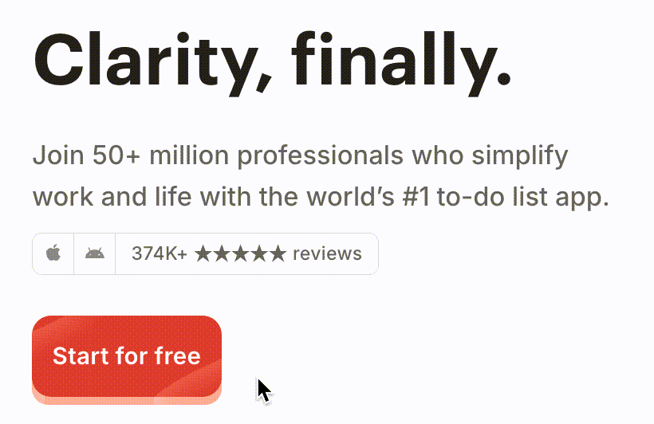
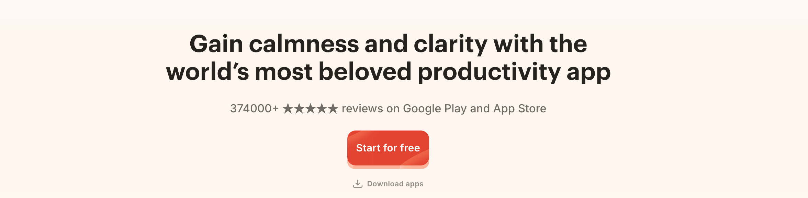
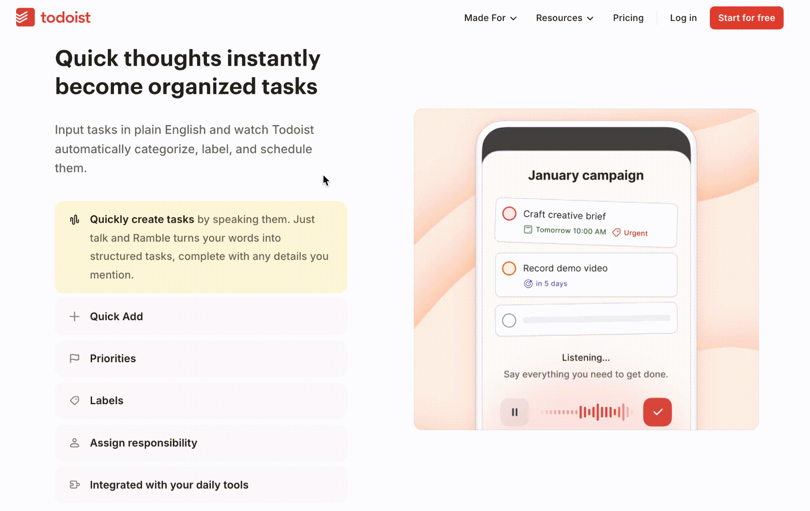
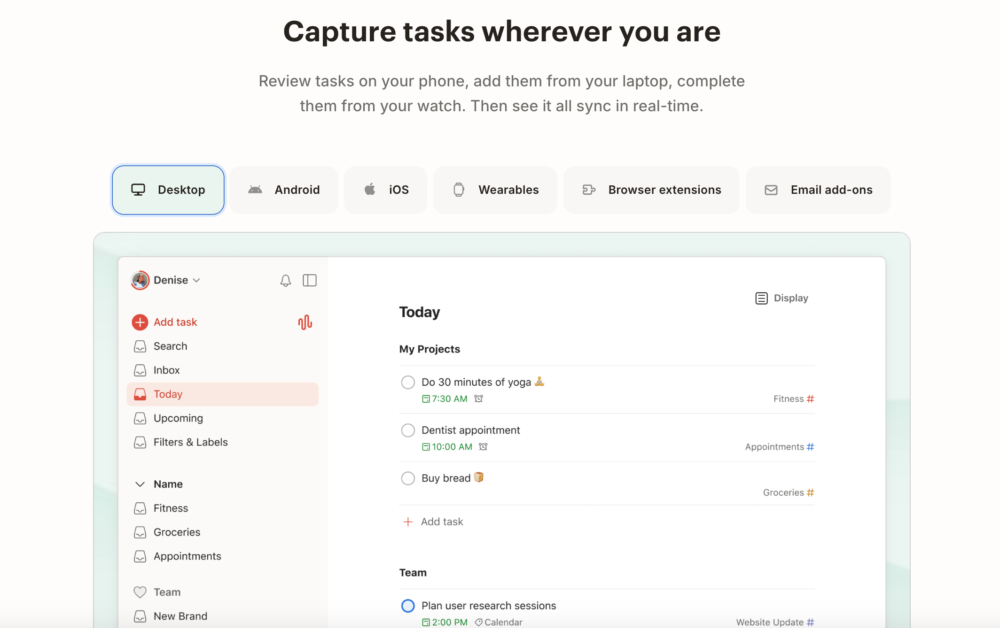
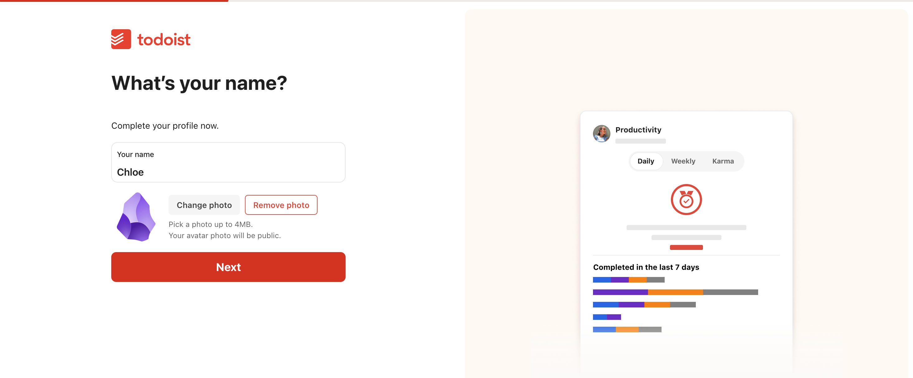
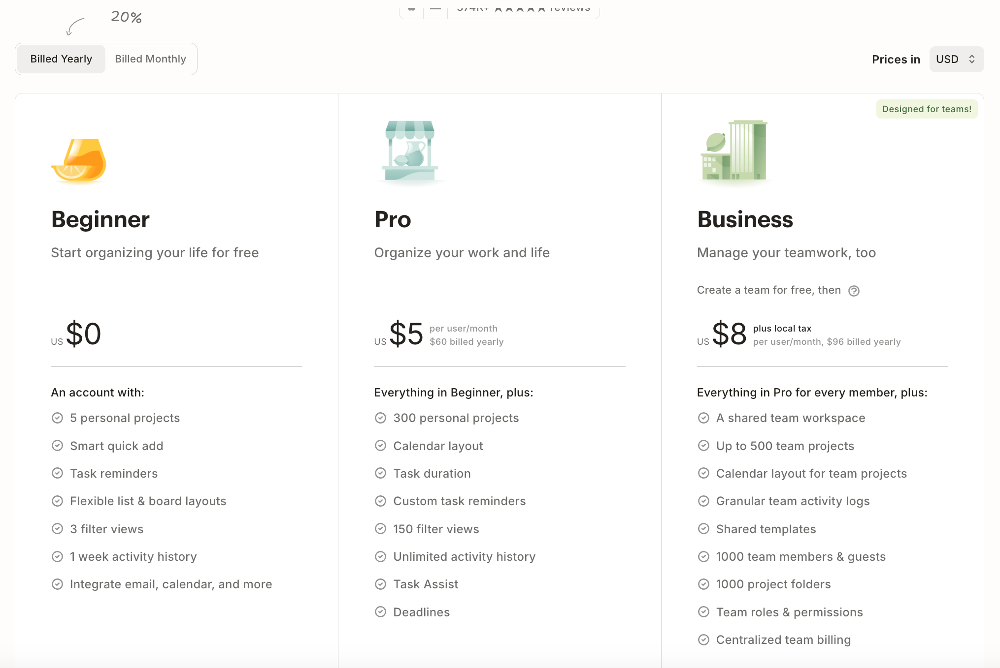

## **Core Positioning**

* **Main headline (Clarity, finally.):** Todoist does not list features in the first sentence (e.g., “the most powerful task manager”). Instead, it directly delivers a **final result**. For people overwhelmed by tasks, “clarity” is an extremely tempting psychological relief.
* **Subheadline (Join 50+ million professionals who simplify work and life with the world’s #1 to-do list app.):** Mentioning “50 million professionals” and “#1 worldwide” is meant to eliminate trust barriers for new users in the shortest time possible. This use of **social conformity psychology** is far more persuasive than self-promotion.

> On your product landing page, the headline should convey *value*, and the subheadline should provide *evidence*.

* **Dual-device icons and screenshots:** By intentionally showing both desktop and mobile screenshots, along with Apple/Android icons, the design subconsciously tells the user: your data is fluid. For a to-do tool, **“use it anywhere”** is a core competitive advantage. If this is not shown, users may worry about sync issues.

> If your product is multi-platform, you must make it “visible at first glance” in the hero section, not buried in technical specs at the bottom.

* **Start for free:** Lowers the entry barrier. The red color is Todoist’s brand color and has strong visual intrusion, forcing attention.
* **Hover/press micro-interaction:** This is a subtle simulation of **“tactile feedback.”**

  * **Psychological hint:** It gives a physical texture to an otherwise virtual interface. This “pressing” visual feedback increases the desire to click, making the action feel more fun and more real.
  * **Reduces friction:** It subconsciously signals that “clicking is safe and responsive.”

> A button is not just a link — it is the endpoint of user interaction. Micro-interactions can significantly increase perceived sophistication and conversion rate.

### **Why does Todoist choose a left–right split layout for its homepage?**

The split layout is a classic pattern in landing page design. Todoist’s choice is not simply aesthetic — it is based on the **F-pattern eye-tracking** logic and the balance between **reason and intuition**.

We can break it down from three deeper dimensions:

#### 1. Left–right cognitive division: Rational vs. intuitive

In human cognition, a split layout often serves distinct functions:

* **Left side (logic & guidance):** People read from left to right. Todoist places its main headline (core value), subheadline (social proof), and CTA (conversion path) on the left to ensure users **first understand what it does and why it's trustworthy**.
* **Right side (visual & associative):** The right side displays product screenshots. After absorbing the left-side copy, the brain needs a concrete image. The screenshot tells the user: “This is what you’re about to use.”
* **Takeaway:** Don’t make users hunt for buttons in a wall of text. Don’t show screenshots without context. Use the left side for rational understanding and the right side to trigger sensory association.

#### 2. Aligned with the F-pattern scanning behavior

Studies show that users typically scan webpages in an **F-shape**: a horizontal scan at the top, another shorter one below, then a vertical sweep down the left.

* **Top-left:** The value proposition ("Clarity, finally.") sits right in the golden starting point.
* **Left vertical path:** As users scan downward, they naturally encounter the CTA.
* **Right side:** Acts as a visual anchor that prevents the left-side copy from feeling too textual or heavy.

> If your product requires quick decision-making (“sign up free”), place the strongest information and action on the left.

#### 3. Responsive layout

Split layouts convert very well to mobile:

* On desktop, the elements sit side-by-side; on mobile, they naturally **stack vertically**.
* Todoist places **copy first, image second** on mobile. This ensures mobile users see the persuasive “Join 50 million professionals” message before the screenshot.
* You’ll also notice the mobile image only shows the mobile UI — adapting the visual for the device.

> When designing a split layout, consider: if stacked vertically, what should go first? Usually, copy takes priority over visuals.

#### 4. Visual balance and breathing room

If Todoist centered all text and images, the page would feel cramped and heavy.

* A split layout creates natural **symmetrical balance**.
* The left-side whitespace makes the red CTA stand out sharply without visual distractions.

> The purpose of layout is to **highlight what matters**. If your button isn’t eye-catching, the issue may be surrounding noise, not the button color.

### Final Conversion Section

* **Cognitive reinforcement:** The top slogan grabs attention; the bottom one summarizes the product’s value (calmness and clarity). It gives users who finished scrolling a psychological closure, reinforcing the idea: “This is exactly the tool I need.”
* **Primary and secondary actions:**

  * **Primary CTA (Start for free):** For new users, using high contrast color to drive registration.
  * **Secondary text link (Download apps):** For returning users or those preferring to install first.
  * **Purpose:** This acts as a **fallback path**. If users don’t want to register yet, guiding them to download the app still captures the lead — preventing traffic loss.
* **Minimalist layout:** All distractions are removed (no heavy backgrounds, no sidebars). The design forces visual focus. At this point, the user has only two actions: read the message or click the button — maximizing conversion.

The homepage’s logic forms a complete loop: it starts by **building first impressions**, transitions into **demonstrating capabilities**, and ends with **trust reinforcement + a clear action command**.

## Trust & Credibility

Right below the hero section, Todoist places media reviews.

### How These Reviews Were Selected

The three media outlets Todoist highlights (The Verge, PC Mag, TechRadar) are not chosen at random.

* **Trust weight:**
  Although the subtitle mentions 50M+ users, individual user reviews tend to be subjective. Evaluations from top-tier tech media like *The Verge* and *PC Mag* act as **industry-level endorsements**.

* **Coverage breadth:**
  These outlets collectively cover consumer tech, professional software/hardware reviews, and broad technology trends.

* **Keyword alignment:**

  * “Simple” addresses beginners’ concerns about **ease of use**
  * “Powerful” meets advanced users’ needs for **depth and features**
  * “The best” gives users comparing alternatives a clear **decision endpoint**

* **Copy length:**
  Do not paste the full media articles. When users scroll, they typically spend **less than one second** per element. What you need is not the full context but **a scannable label**.

> When quoting reviews, avoid repetitive messages—choose ones that collectively support different angles (usability, expertise, market leadership).

### Grayscale Treatment & Visual Hierarchy

If you look closely, the media logos and quotes use grayscale or desaturated colors.

* **Purpose:**
  To keep these elements in the **secondary visual hierarchy**. The primary elements should always be the red CTA button and the bold product headline.

* **Effect:**
  As users scroll quickly, their brains recognize familiar media logos, forming a subconscious impression of credibility—without distracting them from progressing toward the core feature section.

### Mobile Scrolling Interaction Details

* **Desktop layout (full width):**
  With ample horizontal space, displaying all reviews side-by-side creates a powerful sense of consensus. It feels substantial and users receive all the positive signals without needing to interact.

* **Mobile scrolling:**

  * **Avoid clutter:**
    Flat, non-scrollable display would occupy 2–3 screens vertically, exhausting users before they reach the important features.

  * **Implied abundance:**
    Horizontal scrolling implies “there’s more where this came from,” delivering energy and motion without overwhelming the space.

## Feature Presentation

This interaction pattern is often referred to in front-end design and product UX as **scroll detection** or a **sticky scrolling layout**.

The core logic is: **the right-side visual area remains fixed (Sticky) while the left-side text switches upon scroll and triggers corresponding visual changes on the right.**

### Interaction Design Reduces Cognitive Load

* **Visual continuity:**
  Keeping the GIF on the right ensures that while users read each text item on the left, their eyes don’t have to travel far to see the corresponding demo. It’s far more efficient than stacking images and text vertically.

* **Rhythm control:**
  Scroll-triggered transitions give users **control over information pacing**.
  Scroll fast → information updates fast.
  Pause → the GIF loops until the user is ready.
  This asynchronous rhythm aligns well with how users consume feature-rich SaaS content.

> This “left text, right visual, sticky scroll” pattern is now standard in SaaS product sites. If you adopt it, ensure all GIFs load quickly—any blank or delayed visual during scroll is a major UX failure.

### Three-Layer Copywriting Structure

The “small title + main title + description” pattern is a classic **information hierarchy strategy**:

* **Small title (emotion / intent layer):**
  e.g., “Clear your mind.”
  This doesn’t describe the feature—it speaks to the **user’s emotional need**.

* **Main title (action layer):**
  e.g., “Capture tasks…”
  This presents the **core functional ability**.

* **Feature description (technical layer):**
  Adds details such as “Natural language.”
  This satisfies users who want to understand the “how.”

### Feature Order Reflects a Carefully Designed Priority Path

The sequence of four features reveals Todoist’s intended user journey:

1. **Capture:**
   Solve the “get it out of your head” problem—natural language input is the signature strength.

2. **Focus:**
   Solve the “too many tasks, no clarity” problem—filters and views help users enter a focused state.

3. **Plan:**
   Solve “time allocation”—calendar views and recurring tasks.

4. **Teamwork:**
   Solve “organization efficiency”—introducing collaboration.

### Enterprise (B2B) Trust Badging

When introducing “Teamwork,” Todoist highlights its **SOC2 certification**.

Individual consumers may not care about security certifications, but **enterprise decision-makers absolutely do**.

Displaying SOC2 right when collaboration/security concerns surface ensures that the moment a buyer wonders,
“Is my data safe with you?”
the answer appears instantly.

> Put trust badges in the **right context**—security badges belong near collaboration/privacy content, not buried at the bottom of the page.

**“Learn more about teams”** serves as a strategic branching point.
If a visitor is evaluating Todoist for team usage, the brief homepage introduction is not enough.
This link routes high-intent B2B users to the dedicated Teams page—keeping the homepage clean while maintaining a complete conversion flow.

## Site Structure

### Top Navigation Bar

This navigation bar design follows a classic **“needs-based segmentation”** strategy. Its purpose is not to showcase features, but to **shorten the path to a solution** by allowing users to quickly find what they need through categorized browsing.

#### “Made For”: Scenario-Based, Not Feature-Based

The first item in the navigation is not “Features,” but **“Made For.”**

Users usually don’t know which *features* they need—but they do know the *scenarios* they are dealing with (e.g., “I want to break bad habits” or “I need something for my team”).
For example, **Task/Project Management** targets productivity-focused users, **Habit Forming** targets consumer self-improvement users, and **Teamwork** targets enterprise/B2B users.

> Don’t force users to figure out how your features work—tell them directly which problems you solve.

#### “Resources”: Full Lifecycle Support

The dropdown contains many different items, but the logic is clear—it covers the entire user journey, from beginner to expert:

* **Acquisition & conversion:**
  **Templates** and **Productivity Methods**.
  These are high-volume search keywords and attract large numbers of non-users.
  Especially **Quiz**, which recommends productivity methods through interactive assessments—an extremely low-friction acquisition tool.
* **Retention & deeper usage:**
  **Integrations** and **Downloads**, which solve workflow coordination and multi-device accessibility.
* **Support & trust:**
  **Help Center** and **Customer Stories**.

#### Visual Guidance & Interaction Details

* **Role of icons:**
  Using icons like the alarm clock (Time Management) in dropdowns boosts **visual recognition speed**.
  The brain processes images much faster than text, helping users identify their target instantly during a quick scan.

* **CTA priority:**
  Across the entire navigation bar, only **“Start for free”** uses a red filled background.
  Regardless of which menu the user is exploring, that strong red CTA remains visible in peripheral vision. This ensures that opportunities for conversion exist even while browsing.

  Meanwhile, the login button uses a ghost style (text only), and the signup button is solid.
  This visual contrast makes the interface **transparent for returning users but highlighted for new users**—returning users know where to click; new users get pulled toward the colored button.

### Footer Navigation

The footer essentially serves as a **site map** and a **trust anchor**.

#### Multiple Touchpoints for the Core Conversion Path

Notice that under the `Features` column, the first item is **“How It Works,”** and under `Resources`, the first item is **“Download Apps.”**

Footers are where users land when they are lost or have finished scanning the homepage.
Placing “how it works” and “download” first provides essential entry points for users who are still undecided.

> Your core conversion paths (how it works, where to download, pricing) must appear at the top, middle, and bottom of the page so that users never need to scroll back up when they feel ready to convert.

#### A Defensive Strategy for Competitor Comparison: Compare

The `Features` column includes a **“Compare”** option.

The task-management market is intensely competitive (Notion, TickTick, Microsoft To Do).
When users reach the bottom, many are actively comparing alternatives.
By offering an official comparison page, Todoist keeps users on its domain and guides the evaluation using its own criteria (e.g., reliability, NLP accuracy), preventing them from turning to third-party comparison sites.

#### Developer Ecosystem & B2B Expansion: Developer API & Channel Partners

Both appear under `Resources`:

* **Developer API:**
  Signals strong **extensibility**.
  For power users and enterprise buyers, this means Todoist can be integrated into custom workflows—boosting long-term stickiness and defensibility.

* **Channel Partners:**
  Designed for distributors or consulting partners.
  This indicates that Todoist is no longer just a consumer product—it is building a **sales ecosystem**.

> Even if your API is simple, placing it in the footer sends the message: “We are an open and professional platform.”

#### Brand Ecosystem Cross-Promotion: Twist

At the bottom of the `Company` column, there is **“Twist.”**

Twist is an asynchronous communication tool created by the same company (Doist).
Featuring it here leverages Todoist’s massive traffic to drive awareness for its sibling product and strengthen a **multi-product ecosystem**.

#### Why These Four Social Platforms?

* **YouTube:**
  Tutorials—addresses “how to use it.”

* **LinkedIn:**
  Professional credibility for B2B users.

* **Instagram:**
  Brand identity and lifestyle storytelling.

* **Reddit:**
  Core user community—collecting authentic product feedback.

## Scenario Applications

Helping users understand how the product solves real problems.

### Supplemental Content on the Homepage

#### The Special Role of the Video Placement

Right after the breakdown of the “sticky scrolling layout” comes a YouTube video.

Its purpose is this: after reading a series of static or micro-animated feature demos, the user already has a basic idea of the product, but still lacks a bird’s-eye view.
The video (“What’s Todoist”) uses 1–2 minutes of combined visuals and audio to stitch these fragmented features back into a **complete workflow**.

#### Template Matrix: From “Tool” to “Solution”

The core logic behind the template module is to **reduce the user’s “activation friction.”**

Many users avoid task management tools because they “don’t know how to set up a structure.”
Todoist directly states “No need to start from scratch,” which removes the psychological barrier of “this seems complicated.”

**Two-level navigation design:**

* **Primary tabs (Work / Personal...):** Quickly identify the user’s role.
* **Secondary categories (Deep Work / Meeting Agenda...):** Address specific, high-frequency pain points in daily work.

Each template category is essentially a **search (SEO) entry point**.
For example, if someone searches “how to run an effective meeting,” they will find Todoist’s *Meeting Agenda* template, which can then convert them into a user.

The content switches dynamically within the same location, without a page reload.
This **on-the-spot exploration** feels smooth and lets users compare templates across scenarios quickly. It increases time on page and showcases the product’s versatility (“so it can handle finance *and* travel planning”).

At the same time, only a curated selection of templates is shown on the homepage; the rest are on a dedicated page.
This keeps the homepage clean while offering an outlet for “deep search” users.

### Scenario-Specific Pages

#### Detailed Feature Explanations

Take the [task management](https://www.todoist.com/task-management) page as an example.
Building on a layout similar to the homepage’s sticky scroll, the left-hand copy introduces a layered **“local accordion menu” or “secondary linked interaction.”**

This design resolves the conflict between **feature depth** and **page length**.
Users arriving on this page typically have higher intent—they want to know “how exactly do I operate this?”
If Todoist listed every sub-feature in full, the page would become extremely long.

Through collapsible interactions, Todoist fits six concrete actions within one screen height.
It allows users to explore every facet of a feature **without leaving the current context**.

A few details also enhance conversion:

* **Cursor change (arrow → pointer):** Classic UI feedback signaling “this is not just text; it’s interactive,” prompting the user to click.
* **Partially revealed text (pre-reading):** This “half-visible” design leverages the **Zeigarnik effect**—people are naturally curious about unfinished information. The pre-read text acts as a “hook” to draw clicks.
* **Synchronized image switching on the right:** Real-time visual feedback makes users feel “in control,” significantly lowering comprehension effort.

#### Supported Device Types

The biggest fear with a task management tool is:
**When you want to capture something, the tool isn’t with you.**

The sub-headline — “View on mobile, add on desktop, complete on your watch” — describes a complete **cross-scenario loop**.
It reassures users that whether they are commuting, in a meeting, or washing their hands, their task system is always available.

If Todoist merely listed text (iOS, Android...), users wouldn’t feel it.
By showing actual **device screenshots** through tab switching, users can *see* how the UI adapts to an Apple Watch or a Chrome extension.

A heavy Chrome user, for example, will instantly recognize that the browser extension integrates directly into their workflow, accelerating conversion.

Additionally, most competing products only support mobile and desktop.
Todoist emphasizes **wearables** and **email add-ons**, which signals strong **technical depth and ecosystem breadth**.
Even if users don’t use a smartwatch for tasks, seeing that it exists reinforces the perception that Todoist is more professional and reliable than tools that only offer a web app.

## User Journey

### “Low Friction” and “Value Preview” on the Sign-Up Page

After clicking the “Start for free” button, users land on the sign-up page.

* **Multiple quick sign-in options:** Offering Google, Apple, and other third-party logins removes the **“memory burden.”** In SaaS conversion, every additional field increases the dropout rate.
* **“New feature preview” on the right (Dictate with Ramble):** This is a clever move. Sign-up is usually a dull waiting period. By showcasing the latest and coolest features (like voice dictation), Todoist **warms up user excitement**, offsetting the psychological resistance that sign-up naturally creates.

### Verification Success Page: Visual “Stress Relief” and Subtle Psychological Cues

The **animated strike-through effect** is highly intentional. Crossing off a task is the core **dopamine reward** a to-do app provides. Showing this motion *before* the user even enters the product subconsciously communicates:
“Use me, and your chaos will be cleared away just like this.”

The credibility metrics on the right are aligned with the homepage footer—right before users enter an unfamiliar product environment, data like “15 years” and “2 billion tasks” offers **emotional safety**.

### Critical User Segmentation and Early Research (B2C vs B2B)

After entering a name and uploading a photo, users must answer “How do you plan to use Todoist?” with two options:

For myself: I want a personal space to organize my work and life.
With my team: I want a simple yet powerful home for my team’s work.

Asking “For myself” or “With my team” is **top-priority research**.
If you choose “Team,” all subsequent onboarding emphasizes collaboration and member invites; if you choose “Personal,” the guidance shifts toward calendar sync and personal routines.

Next comes: **How do you manage events?**
Two options are offered: Connect Google Calendar / Connect Outlook Calendar.

This is the only step users can skip. The likely reason is that calendar linking involves permissions and privacy—making it a **“high-friction action.”**
Forcing it would create major drop-offs. Todoist places it early because it wants to establish **ecosystem lock-in** as soon as possible (once you connect your calendar, switching tools becomes very costly), but since the action carries high friction, they must offer a skip option.

### Controversial Step: An Early Paywall Pop-Up

Once inside the product, a pop-up appears:

You can choose to watch the YouTube tutorial or simply click “Continue.”

Immediately afterward, another pop-up appears prompting users to “Try Pro for free,” with the right side highlighting Pro plan benefits and the left showing billing cycle, price, and currency.

Personally, I don’t like this design, because I have not yet experienced the value of the product, and you’re already talking to me about paying.

## Business Model & Pricing

Todoist follows the classic **three-tier SaaS pricing structure**.
The core logic is not simply “unlocking features,” but differentiated segmentation based on **usage capacity**, **management efficiency**, and **collaboration boundaries**.
The **20% annual discount** is a SaaS industry standard—designed to **front-load cash flow** and reduce churn for the year.

### Free Plan (Beginner)

* **Pricing philosophy:** Lower the barrier, retain users through core experience.
* **Value strategy:** It now opens up **task reminders**. Previously a paid feature, reminders are now free because they are crucial for **habit formation**. Only when users receive reminders and return to the app does retention increase.
* **Limitations:** Only **5 projects** and **3 filter views**. Even slightly complex personal lives (work, family, study, finance, fitness) will quickly hit the ceiling.

> The free plan delivers the core “wow moments” (e.g., smart input), but restricts “organizational structure,” prompting power users to upgrade.

### Pro Plan

* **Pricing philosophy:** Target “personal productivity enthusiasts,” monetize by removing limits and adding advanced views.

**Value strategy:**

* **Capacity upgrades:** Projects jump from 5 to **300**, filters from 3 to **150**—eliminating almost all space anxiety for personal users.
* **New dimensions (Calendar layout & Task duration):** The free plan offers only lists and boards; Pro adds **calendar view** and **task duration**, enabling users to shift from “recording tasks” to **planning their time**.
* **Automation (Task Assist):** AI capabilities serve as the premium anchor to justify the $5/month psychological price point.

> The Pro plan sells **“a sense of control.”**
> When one week of activity history isn’t enough, or when you need flexible filtering, the $5 feels very worth it.

### Business Plan

* **Pricing philosophy:** Target “team collaboration,” shifting payment from individuals to organizations.

**Value strategy:**

* **Workspace separation (Shared team workspace):** The biggest value point—it solves the problem of having personal and work tasks in the same interface while keeping them logically separate.
* **Administrative controls (Roles & Permissions):** B2B decision-makers care most about **ownership**: who can delete projects, who can view logs (activity logs). These levers justify the $8/user price.
* **Scalability:** Up to 500 team projects and 1,000 team members.

Todoist’s pricing essence is:
**The free plan supports “recording,” Pro supports “planning,” and Business supports “control.”**

## Website Traffic Sources

### Traffic Composition

* **Branded search share (52.2%):** Over half the traffic comes from branded keywords like “Todoist.” This indicates strong brand recognition in the task-management space; the decision journey is short, and dependency on external ads is low.
* **Organic traffic (94.4%):** Out of 692k total visits, only 3.9k come from paid traffic. This implies extremely low CAC, with growth largely driven by SEO and brand reputation.
* **AI Overviews (1.3%):** This reflects how often the site is cited in AI-driven search experiences (e.g., Google SGE).
* **Core market (United States):** Contributes ~25% of traffic and 34% of keyword coverage. The U.S. has strong subscription willingness and is likely the main source of ARR.

### Key Traffic-Driving Pages

* **Homepage dominance (68.41%):** More than two-thirds of traffic goes directly to the homepage. This confirms the earlier conclusion about strong branded search volume. When users search “Todoist,” the homepage becomes the main **filter and conversion engine**. It also explains why every micro-interaction (button press feedback, sticky layout) is so meticulously polished.

* **Productivity method pages: a “pre-funnel” for traffic:**
  Aside from the homepage, the highest-traffic pages are all **Productivity Methods** (Pomodoro, Eisenhower Matrix, GTD, etc.).

This strategy is known as **“sell the method, not the tool.”**

Users may not be looking for Todoist—they may be searching for “how to be more productive” or “what is the Pomodoro Technique.”
By offering high-quality educational content, Todoist intercepts users at the moment they form productivity awareness and naturally introduces the product as the *best implementation tool* for those methods.

> Don’t optimize only for product-feature keywords. Create long-tail content for users’ **problem keywords** and **knowledge keywords**.
