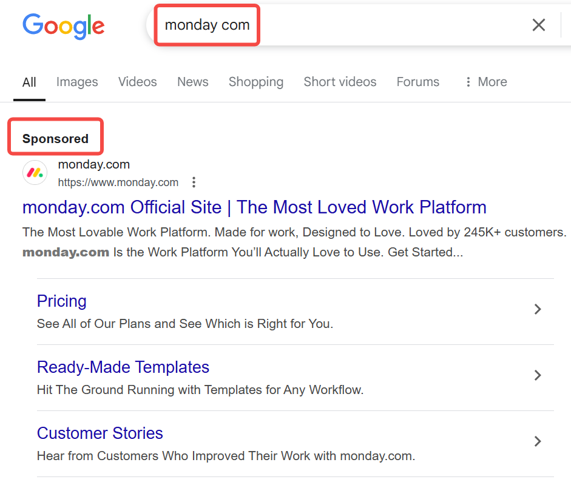
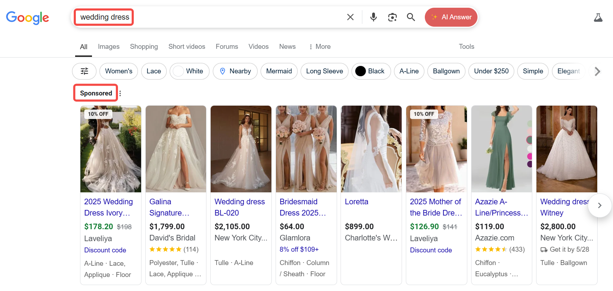
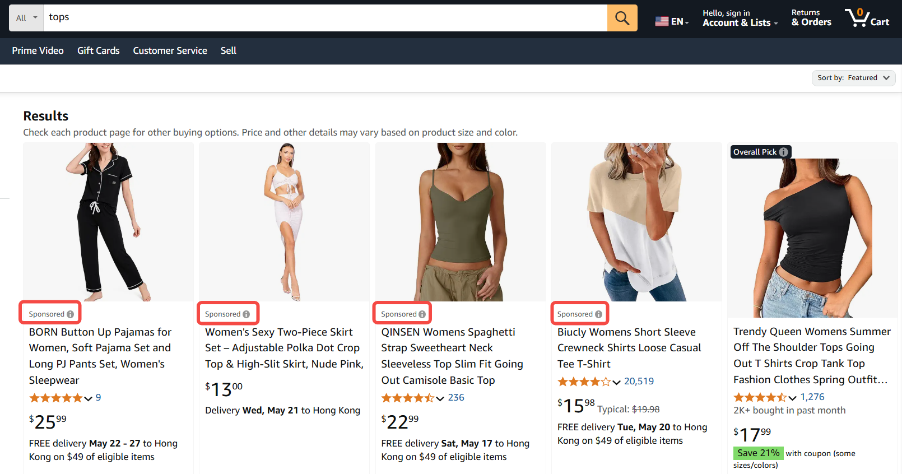

数字广告通过多样化形式触达目标用户。本文按**定义→定位方式→形式细分→主流平台**的结构介绍11类主流广告类型。

## 1. 搜索广告（Search Ads）

搜索广告是基于用户在搜索引擎（如Google、Bing）中输入的关键词触发的文字或动态广告，通常出现在搜索结果页（SERP）的顶部、底部或侧边栏。其核心逻辑是**捕捉用户主动搜索意图**，通过匹配关键词推送相关广告内容。  

### 定位方式
- **关键词匹配模式**：  
  - **精准匹配**：仅当搜索词与关键词完全一致时触发（如关键词“运动鞋”仅匹配“运动鞋”搜索）。  
  - **广泛匹配**：覆盖关键词的近似词、同义词或相关词（如“运动鞋”可能匹配“跑步鞋”“男款运动鞋”）。  
  - **短语匹配**：搜索词需包含关键词完整短语（如“蓝色运动鞋”匹配“2025新款蓝色运动鞋”）。  
- **用户搜索意图分析**：  
  - 通过语义分析区分用户需求类型（如**商业意图**“购买耐克跑鞋” vs. **信息意图**“如何选择跑鞋”）。  

### 形式细分
| 类型                | 特点与示例                                                                 |  
|---------------------|--------------------------------------------------------------------------|  
| **文字广告（Text Ads）** | - 标准格式：标题（2-3个）+ 描述（1-2段）+ 显示链接。 - **示例**：Google Ads文字广告常占据SERP前3位，标注“广告”标签。 - **适用场景**：强调促销信息（如“限时8折”）、产品差异化卖点。 |  
| **动态搜索广告（DSA）** | - 自动抓取网站内容生成广告标题与描述，无需手动设置关键词。 - **优势**：快速覆盖长尾搜索词，适合产品SKU多变的电商。 - **示例**：用户搜索“防水蓝牙耳机”时，自动推送网站内相关商品页广告。 |  
| **购物广告（Shopping Ads）** | - 以商品图片、价格、评价为核心信息（需提交产品Feed）。 - **示例**：Google Shopping广告展示在搜索页顶部图片栏，直接引导至商品页。 |  

### 主流平台与工具 
- **Google Ads**：  
  - 全球最大搜索广告平台，覆盖Google搜索及合作伙伴网站。  
  - 支持[文字广告](https://support.google.com/google-ads/answer/12437745?hl=en&visit_id=638824331428831417-3218832757&rd=1)、[DSA](https://support.google.com/google-ads/answer/2471185?hl=en)、[购物广告](https://support.google.com/google-ads/answer/2454022?hl=en)，提供关键词规划师、智能出价等工具。  
- **Bing Ads（Microsoft Advertising）**：  
  - 触达Windows系统及Edge浏览器用户，CPC通常低于Google。  
  - [文字广告](https://about.ads.microsoft.com/en/solutions/ad-products-formats/search)：关键词匹配逻辑与Google类似，但竞争较低。
  - [购物广告](https://about.ads.microsoft.com/en/solutions/ad-products-formats/retail/shopping-campaigns)：支持微软生态用户（如LinkedIn职业人群定向），适合北美及欧洲市场B2B行业。  
- **[Yahoo Gemini（现为Yahoo Native Ads）](https://www.yahooinc.com/yahoo-ads)**：  
  - 在日本、中国台湾等市场占有率较高，侧重移动端流量，关键词匹配机制简化。  

## 2. 购物广告（Shopping Ads）
购物广告是通过直接展示**商品图片、价格、评价**等核心信息的视觉化广告形式，主要服务于电商场景。其特点是**强转化导向**，用户点击广告后通常直接跳转至商品详情页或购物车，如[Bing购物广告](https://chloevolution.com/zh-cn/posts/bing-shopping-ads/)。

### 定位方式
- **商品目录数据匹配**：  
  广告主需提前上传结构化商品数据（即**商品Feed**，包含标题、价格、库存、图片链接等字段），平台通过算法将商品与用户搜索词或浏览行为自动匹配。  
  **示例**：用户搜索“黑色连衣裙”，系统自动从Feed中提取符合关键词的商品生成广告。  
- **用户购物意图定向**：  
  - **主动搜索意图**：匹配用户在搜索引擎或电商平台的搜索词（如“耐克跑鞋折扣”）。  
  - **行为重定向**：针对浏览过商品页但未购买的用户（如Facebook动态产品广告）。  

### 形式细分 
| 广告形式                  | 特点与定位逻辑                                                                 |  
|--------------------------|-----------------------------------------------------------------------------|  
| **商品橱窗广告**（Google Shopping） | - 以网格形式展示多商品图片和价格，占据搜索引擎结果页顶部。 - **定位逻辑**：依赖商品Feed与搜索词匹配，支持手动设置优先级（如促销商品置顶）。 |  
| **动态产品广告（DPA）**（Facebook/Instagram） | - 根据用户历史行为（如浏览商品、加购未付款）自动推送个性化商品。 - **定位逻辑**：基于用户与网站/APP的互动数据（需安装像素追踪代码）。 |  
| **电商平台推广广告**（Amazon Sponsored Products） | - 在Amazon站内搜索结果和商品页中展示，按点击付费。 - **定位逻辑**：匹配用户搜索词或类似商品属性（如“同类竞品”定向）。 |  

## 3. 展示广告（Display Ads）
展示广告是以**视觉化元素**（图片、动画、视频等）在第三方网站、APP或联盟媒体中展示的广告形式，通常用于品牌曝光、用户再营销或引导点击。与搜索广告不同，其核心逻辑是“主动触达”而非“被动响应搜索”。  

### 定位方式
- **受众定向**：  
  - 基于用户兴趣、年龄、性别等人口统计标签（如“18-24岁游戏玩家”）。  
  - 利用Cookie或设备ID追踪用户行为（如浏览过竞品网站的用户）。  
- **上下文定向**：  
  - 匹配广告与网页内容主题（如在体育新闻网站投放运动鞋广告）。  
- **地理位置定向**：  
  - 针对特定区域用户（如本地餐饮店定向周边5公里人群）。  

### 形式细分
| 广告形式                | 特点与适用场景                                                                 |  
|-------------------------|-----------------------------------------------------------------------------|  
| **横幅广告（Banner Ads）** | - **形式**：静态图片或GIF，常见于网页顶部/底部/侧边栏。 - **定位**：以上下文定向为主（如旅游网站投放酒店广告）。 - **示例**：新闻网站中的“双11促销”横幅。 |  
| **插页广告（Interstitial Ads）** | - **形式**：全屏广告，在APP页面跳转或游戏关卡间强制展示。 - **定位**：基于用户行为（如APP使用频率）或设备类型。 - **示例**：手游中提示“观看广告获取复活机会”。 |  
| **富媒体广告（Rich Media Ads）** | - **形式**：含交互元素（如视频、表单填写、3D旋转视图）。 - **定位**：高价值受众（如奢侈品品牌定向高收入人群）。 - **示例**：汽车广告内嵌“360度看车”功能。 |  

### 主流平台
1. **[Google Display Network (GDN)](https://support.google.com/google-ads/answer/2404190?hl=en)**  
   - **覆盖范围**：全球超200万家网站和APP，包括YouTube、Gmail等自有平台。  
   - **核心功能**：  
     - 支持横幅、富媒体广告，可上传HTML5素材。  
     - 定位方式：受众兴趣、自定义受众列表（再营销）、内容关键词匹配（如“户外运动”）。  
     - 动态再营销：自动展示用户浏览过的商品（需接入Google标签）。  
   - **适用场景**：大规模品牌曝光、电商再营销。  

2. **程序化广告平台**  
   - **[The Trade Desk](https://www.thetradedesk.com/)**：  
     - 侧重开放互联网（非社交媒体）的实时竞价（RTB），支持横幅、视频、音频广告。  
     - 定位技术：跨设备ID映射、第三方数据整合（如信用卡消费数据定向高消费人群）。  
     - 独特功能：Koa™ AI优化工具，自动分配预算至高ROI渠道。  
   - **[Criteo](https://www.criteo.com/)**：  
     - 以动态产品广告（DPA）为核心，自动生成个性化横幅广告（如“您浏览的商品降价10%”）。  
     - 定位逻辑：基于用户跨网站浏览行为，强依赖Cookie（受隐私政策冲击较大）。  

3. **移动广告平台**  
   - **[AppLovin](https://www.applovin.com/)**：  
     - 专注移动应用内广告，支持插页广告、激励视频（用户观看广告获取游戏道具）。  
     - 定位方式：APP类别（如游戏、社交）、用户活跃度（如周打开次数）。  
     - 算法优势：Machine Learning自动优化广告素材与受众匹配。  
   - **[Unity Ads](https://unity.com/products/unity-ads)**：  
     - 游戏开发者生态主导，覆盖超28亿月活游戏用户。  
     - 特色广告形式：可玩广告（Playable Ads），用户试玩片段后引导下载游戏。  
     - 定向逻辑：游戏类型（如策略类、休闲类）、玩家付费行为。  

## 4. 社交媒体广告（Social Media Ads）
社交媒体广告是在社交平台（如Facebook、Instagram、TikTok等）的信息流、故事或互动模块中推送的广告形式，依托平台用户画像数据实现精准定向，兼具品牌曝光、用户互动与直接转化的功能。  

### 定位方式 
- **人口统计定向**：年龄、性别、职业、教育程度（如LinkedIn定向“IT行业经理级用户”）。  
- **兴趣与行为标签**：用户关注的账号、互动内容、购物行为（如“美妆爱好者”“近期网购用户”）。  
- **自定义受众**：上传客户手机号、邮箱或设备ID，匹配平台用户进行重定向。  
- **相似受众扩展**（Lookalike Audience）：基于种子用户特征，自动扩展相似人群。  

### 形式细分 
| 广告形式                | 特点与示例平台                                                                 |  
|-------------------------|-----------------------------------------------------------------------------|  
| **信息流广告（Feed Ads）** | 与用户动态内容混合展示，支持图文、视频、轮播（如Facebook Feed Ads、Twitter Promoted Tweets）。 |  
| **故事广告（Story Ads）**  | 全屏垂直格式（15秒内），用户需主动滑动跳过（如Instagram Stories Ads、Snapchat Ads）。 |  
| **轮播广告（Carousel Ads）** | 单广告位内横向滑动展示多图/视频（如LinkedIn Carousel Ads，适用于产品多卖点展示）。 |  
| **视频广告（Video Ads）** | 自动播放的短视频（6-15秒），侧重情绪共鸣（如TikTok In-Feed Ads、YouTube Shorts Ads）。 |  
| **购物标签广告（Shopping Ads）** | 商品图片+价格直接标注，用户点击跳转购买页（如Instagram Shopping Tags、Pinterest Product Pins）。 |  

### 主流平台
1. **[Meta Ads Manager（Facebook & Instagram）](https://www.facebook.com/business/tools/ads-manager)**  
   - **支持形式**：信息流广告、故事广告、轮播广告、购物标签广告。  
   - **定位方式**：  
     - 人口统计：年龄、职业、婚姻状态。  
     - 兴趣标签：细分至“宠物用品”“瑜伽爱好者”等长尾类目。  
     - 自定义受众：基于网站访客、APP用户或CRM数据。  
   - **独特功能**：动态广告（自动匹配用户浏览过的商品）、AR试妆广告。  

2. **[TikTok Ads](https://ads.tiktok.com/i18n/home)**  
   - **支持形式**：信息流视频广告、品牌挑战赛（Hashtag Challenge）、购物标签广告。  
   - **定位方式**：  
     - 兴趣标签：音乐类型、网红粉丝群体。  
     - 行为定向：视频互动（点赞、评论）、APP下载记录。  
   - **独特功能**：  
     - 挑战赛标签：鼓励用户生成内容（UGC），扩大传播。  
     - 直播间购物：广告引流至品牌直播间即时转化。  

3. **[LinkedIn Ads](https://business.linkedin.com/marketing-solutions/ads)**  
   - **支持形式**：信息流广告、轮播广告、文本广告（右侧栏）、InMail直邮广告。  
   - **定位方式**：  
     - 职业属性：职位级别、公司规模、所属行业。  
     - 技能标签：编程语言、管理经验等。  
   - **独特功能**：  
     - Lead Gen Forms：用户无需跳转即可提交信息，适合B2B获客。  

4. **[Pinterest Ads](https://ads.pinterest.com/)**  
   - **支持形式**：商品图钉广告（Product Pins）、轮播广告、视频广告。  
   - **定位方式**：  
     - 兴趣标签：家居设计、婚礼策划等视觉导向类目。  
     - 关键词搜索：匹配用户主动搜索词（如“北欧风客厅灵感”）。  
   - **独特功能**：  
     - 购物心愿单：用户可直接保存商品至个人看板，长期种草。  

## 5. 视频广告（Video Ads）
视频广告是以**视频内容**为核心载体的广告形式，通过流媒体平台（如YouTube）、社交媒体信息流（如TikTok）或联网电视（CTV）投放，利用视觉与听觉的双重刺激传递品牌信息，适用于品牌叙事、产品演示或用户互动场景。  

### 定位方式
- **人口统计**：年龄、性别、地域、语言。  
- **兴趣与行为**：用户观看的频道/视频类型（如“美妆教程”“科技评测”）、互动行为（点赞、收藏）。  
- **上下文匹配**：关联视频内容主题（如烹饪视频中投放厨具广告）。  
- **重定向**：针对观看过视频但未转化的用户二次触达。  

### 形式细分
| 广告形式                | 特点与定位逻辑                                                                 |  
|-------------------------|-----------------------------------------------------------------------------|  
| **前贴片广告（Pre-roll Ads）** | 视频播放前强制展示（5-30秒），适合高曝光需求，定位依赖视频内容主题（如电影预告片前投放零食广告）。 |  
| **可跳过广告（Skippable Ads）** | 用户5秒后可跳过（如YouTube TrueView），侧重吸引注意力，需前5秒设计强钩子。 |  
| **信息流视频广告（In-Feed Ads）** | 融入用户浏览的信息流（如TikTok、Facebook），依赖兴趣标签与互动预测算法。 |  
| **可玩广告（Playable Ads）** | 用户试玩互动片段后引导下载（常见于手游推广），定向游戏类兴趣人群。 |  
| **直播广告（Live Stream Ads）** | 在直播中插播或品牌冠名（如Twitch直播、淘宝直播），实时互动提升转化。 |  

### 主流平台
1. **YouTube Ads**  
   - **核心形式**：前贴片广告、可跳过广告（TrueView）、视频发现广告（搜索结果页）。  
   - **定位方式**：  
     - 关键词匹配（与搜索广告逻辑相似）。  
     - 受众定向（兴趣、自定义受众列表）。  
     - 内容关联（匹配相似主题视频）。  
   - **独特功能**：  
     - 导视广告（6秒不可跳过）：高频次洗脑曝光。  
     - 视频行动广告（片尾叠加CTA按钮）。  

2. **TikTok Ads**  
   - **核心形式**：信息流视频广告、品牌挑战赛（Hashtag Challenge+）、TopView（开屏首刷广告）。  
   - **定位方式**：  
     - 兴趣标签（音乐、舞蹈、美食等）。  
     - 用户互动行为（评论、转发过同类视频）。  
     - 设备与地理位置定向。  
   - **独特功能**：  
     - Spark Ads：直接投放热门UGC内容为广告，降低用户排斥感。  
     - 购物车直链：视频内嵌商品链接，即时跳转购买。  

3. **Facebook/Instagram Video Ads**  
   - **核心形式**：信息流视频广告、故事视频广告（15秒全屏）、Reels短视频广告。  
   - **定位方式**：  
     - 人口统计+兴趣标签（与Meta社交广告共用数据库）。  
     - 自定义受众（重定向网站访问者或视频观看者）。  
   - **独特功能**：  
     - 动态创意优化：自动组合视频片段、文案和受众群体。  
     - AR视频广告：用户通过摄像头互动试妆、试穿。  

4. **联网电视广告（CTV Ads）**  
   - **代表平台**：Hulu、Roku、Amazon Fire TV。  
   - **核心形式**：15-30秒品牌广告（不可跳过）、暂停界面广告。  
   - **定位方式**：  
     - 家庭属性（收入、地理位置）。  
     - 观看内容偏好（如追剧类型）。  
   - **独特功能**：  
     - 增量触达：补充传统电视未覆盖的年轻用户。  
     - 数据回流：通过设备ID关联线上行为，优化效果追踪。  

## 6. 原生广告（Native Ads） 
原生广告是与**平台内容形式、风格无缝融合**的广告类型，弱化传统广告的“推销感”，通过模仿自然内容（如文章、视频、信息流）降低用户排斥，实现“广告即内容”的传播效果。  

### 定位方式
- **上下文匹配**：根据页面/用户浏览内容主题推送相关广告（如科技博客中嵌入耳机评测广告）。  
- **用户兴趣标签**：基于历史行为（如阅读、观看、搜索）定向相似兴趣群体。  
- **设备与环境适配**：自动调整广告样式以适配移动端、PC端或APP界面。  

### 形式细分
| 广告形式                | 特点与示例                                                                 |  
|-------------------------|---------------------------------------------------------------------------|  
| **信息流原生广告**       | 嵌入社交媒体或新闻信息流，与用户动态内容同格式（如Twitter Promoted Tweets、Facebook Feed Ads）。 |  
| **内容推荐广告**         | 在文章底部或侧边栏以“推荐阅读”形式展示（如Outbrain、Taboola的“你可能喜欢”）。 |  
| **赞助文章/视频**        | 品牌定制内容，标注“赞助”标签（如BuzzFeed品牌故事、YouTube品牌合作视频）。 |  
| **搜索原生广告**         | 搜索结果页中与自然结果样式一致的广告（如Google的AMP广告、亚马逊Sponsored Products）。 |  

### 主流平台
1. **Outbrain & Taboola**  
   - **核心形式**：内容推荐广告（“推荐阅读”小标题+缩略图）。  
   - **定位逻辑**：  
     - 上下文匹配：分析页面语义关联广告内容（如旅游博客推荐行李箱广告）。  
     - 用户兴趣：跨媒体追踪用户阅读历史，推送同类内容。   

2. **社交媒体信息流广告**  
   - **代表平台**：Facebook Feed Ads、X（Twitter）Promoted Posts、LinkedIn Sponsored Content。  
   - **定位逻辑**：  
     - 兴趣标签（如“健身爱好者”）。  
     - 职业属性（LinkedIn定向行业/职位）。  

3. **谷歌AMP原生广告**  
   - **核心形式**：加速移动页面（AMP）中的自适应广告，与文章排版一致。  
   - **定位逻辑**：  
     - 关键词匹配（页面内容主题）。  
     - 用户搜索历史。  

4. **Pinterest Promoted Pins**  
   - **核心形式**：与用户收藏的“图钉”样式一致，标注“推广”。  
   - **定位逻辑**：  
     - 兴趣标签（如家居装饰、婚礼策划）。  
     - 视觉相似度：匹配用户已保存图钉的风格。  

## 7. 电子邮件广告（Email Ads）  
电子邮件广告是通过**电子邮件渠道**向订阅用户发送的营销内容，以图文、链接或动态模板形式传递促销信息、产品更新或客户关怀内容，强调高打开率和精准触达。  

###  定位方式
- **订阅列表细分**：  
  - 基于用户属性（如性别、地域、会员等级）。  
  - 基于行为数据（如购买记录、邮件点击历史）。  
- **触发式自动化**：  
  - 用户行为触发（如放弃购物车后自动发送提醒邮件）。  
  - 时间节点触发（如生日祝福邮件、订阅周年优惠）。  
- **动态内容插入**：  
  - 根据用户画像展示个性化商品或文案（如“为您推荐的冬季外套”）。  

### 形式细分
| 广告形式                | 特点与适用场景                                                                 |  
|-------------------------|-----------------------------------------------------------------------------|  
| **促销邮件**            | 突出折扣、限时活动（如“黑五全场5折”），设计强视觉CTA按钮，常用于电商。       |  
| **新闻简报（Newsletter）** | 定期发送品牌动态、行业洞察（如每周精选文章），用于用户留存与品牌忠诚度培养。 |  
| **再营销邮件**          | 针对未完成购买的用户（如“购物车商品即将售罄”），通常含专属优惠码。          |  
| **事务性邮件**          | 包裹通知、账户更新等“服务型”邮件中嵌入推荐商品（如“您的订单已发货，搭配购买配件”）。 |  

### 主流平台 
1. **Mailchimp**  
   - **核心功能**：  
     - 拖拽式邮件模板编辑，支持动态内容。  
     - 自动化流程（如欢迎邮件序列、弃购提醒）。  
   - **定位工具**：  
     - 用户标签系统（手动/自动打标）。  
     - A/B测试（标题、发送时间优化）。  
   - **适用场景**：中小型企业、电商独立站。  

2. **HubSpot**  
   - **核心功能**：  
     - 与CRM深度整合，基于用户行为自动触发邮件。  
     - 个性化内容推荐（如“根据浏览历史推荐产品”）。  
   - **定位工具**：  
     - 客户旅程阶段划分（潜在客户→忠诚用户）。  
     - 营销漏斗分析（邮件参与度关联转化率）。  
   - **适用场景**：B2B企业、长周期客户培育。  

3. **Klaviyo**  
   - **核心功能**：  
     - 电商数据集成（Shopify、Magento），自动同步订单、商品信息。  
     - 预测性发送（算法计算用户最佳打开时间）。  
   - **定位工具**：  
     - RFM模型（最近购买、频率、金额）细分高价值用户。  
     - 弃购挽回自动化流程。  
   - **适用场景**：DTC品牌、高客单价电商。  

4. **SendGrid（Twilio）**  
   - **核心功能**：  
     - 高吞吐量邮件发送（适合超大规模企业）。  
     - API驱动，支持深度技术集成。  
   - **定位工具**：  
     - 实时分析（退信率、垃圾邮件投诉监控）。  
     - IP信誉管理（确保邮件送达率）。  
   - **适用场景**：技术团队较强的企业、交易通知类邮件。  

## 8. 联盟广告（Affiliate Ads）
联盟广告是基于**效果付费（CPS/CPA）**的合作推广模式，广告主通过第三方合作伙伴（如博主、网站、网红）推广产品或服务，仅在实际产生销售、注册或点击时支付佣金。其核心逻辑是“风险共担，收益共享”。  

### 定位方式
- **合作伙伴受众匹配**：选择与品牌目标人群高度重合的推广者（如美妆品牌合作美妆博主）。  
- **内容关联性**：在相关主题内容中嵌入广告（如健身博客推广蛋白粉）。  
- **关键词/商品匹配**：通过算法将推广链接与用户搜索词或浏览商品关联（如亚马逊联盟商品推荐）。  

### 形式细分
| 广告形式                | 特点与适用场景                                                                 |  
|-------------------------|-----------------------------------------------------------------------------|  
| **产品测评推广**        | 博主发布使用体验（图文/视频），附带专属购买链接（如YouTube科技博主推广耳机）。 |  
| **优惠券分发**          | 通过合作网站或博主提供独家折扣码，追踪使用率（如“订阅送10%优惠码”）。         |  
| **链接追踪推广**        | 在内容中嵌入可追踪的短链或图片广告，按点击或转化付费（如博客侧边栏横幅广告）。 |  
| **联盟内容整合**        | 平台聚合多推广者资源，自动匹配商品与内容（如亚马逊联盟的商品推荐插件）。       |  

### 主流平台
1. **Amazon Associates**  
   - **核心形式**：商品链接嵌入、网站横幅广告、定制化推荐插件。  
   - **定位逻辑**：  
     - 自动匹配用户浏览或搜索过的亚马逊商品。  
     - 推广者手动选择高佣金商品定向（如电子类3-8%佣金）。  
   - **适用场景**：电商独立站、测评类博客。  

2. **ShareASale**  
   - **核心形式**：Banner广告、文字链接、优惠券分发。  
   - **定位逻辑**：  
     - 推广者从2000+品牌库中选择商品（覆盖服饰、软件、服务等）。  
     - 支持按品类（如家居、美妆）筛选高转化率品牌。  
   - **独特功能**：  
     - 数据报告：实时跟踪点击、转化、退款数据。  
     - 二级联盟：推广者发展下级分佣，扩大推广网络。  

3. **CJ Affiliate（Commission Junction）**  
   - **核心形式**：动态广告（自动适配用户兴趣）、深度链接跳转。  
   - **定位逻辑**：  
     - 品牌方提供受众标签（如“高端旅行用户”），推广者按需选择。  
     - 支持重定向用户（如弃购用户二次触达）。  
   - **适用场景**：大型品牌（如沃尔玛、微软）、高客单价商品。  

4. **Shopify Affiliate Program**  
   - **核心形式**：SaaS工具推广（如主题、插件）、建站教程植入。  
   - **定位逻辑**：  
     - 面向创业者、独立站运营者，内容垂直性强。  
     - 推广者按用户订阅或消费分佣（最高2000美元/单）。  
   - **独特功能**：提供品牌素材包（Logo、文案模板），降低创作成本。  

## 9. 音频广告（Audio Ads） 
音频广告是通过**声音内容**（如音乐、播客、有声书）传递品牌信息的广告形式，主要在音乐流媒体平台、播客节目或智能音箱中播放，依赖听觉刺激与场景化触达用户，适用于品牌曝光或伴随性消费引导。  

### 定位方式
- **听众兴趣标签**：根据用户常听的音乐类型、订阅的播客主题（如“科技”“健康”）。  
- **播放场景定向**：通勤、健身、居家等场景（如早晨推送咖啡广告）。  
- **人口统计**：年龄、性别、地理位置。  
- **设备类型**：智能音箱（家庭场景） vs. 移动端（个人场景）。  

### 形式细分
| 广告形式                | 特点与适用场景                                                                 |  
|-------------------------|-----------------------------------------------------------------------------|  
| **插播音频广告**         | 音乐或播客播放前/中插入的固定时长广告（如Spotify每30分钟插播一条15秒广告）。 |  
| **播客口播广告**         | 由主播口播定制文案，与节目内容自然融合（如“本节目由XX品牌赞助”）。          |  
| **品牌定制音频内容**     | 品牌制作专题播客或音乐歌单，间接传递品牌理念（如红牛极限运动主题播客）。    |  
| **互动语音广告**         | 用户通过语音指令交互（如“Alexa，了解更多优惠”），常见于智能音箱。           |  

### 主流平台
1. **Spotify Ads**  
   - **核心形式**：插播音频广告、视频伴音广告（播放时展示品牌图片）、歌单定制广告。  
   - **定位方式**：  
     - 音乐偏好（如“流行音乐听众”）。  
     - 播放场景（健身、工作、派对）。  
   - **独特功能**：  
     - 动态广告插入：根据用户实时行为（如重复播放某歌手歌曲）调整广告内容。  
     - 免费版用户强制收听，付费版用户可选择跳过。  

2. **Apple Podcasts**  
   - **核心形式**：播客口播广告、节目订阅推荐广告。  
   - **定位方式**：  
     - 播客类别（如商业、教育）。  
     - 用户订阅历史与收听时长。  
   - **独特功能**：  
     - 动态广告插入：根据用户地理位置或时间更新广告内容（如雨天推送雨伞广告）。  
     - 无缝跳转：点击广告直接跳转品牌官网或APP。  

3. **Amazon Alexa（智能音箱）**  
   - **核心形式**：语音互动广告、购物指令触发广告（如“购买纸巾”后推荐品牌）。  
   - **定位方式**：  
     - 家庭画像（如家有儿童定向玩具广告）。  
     - 历史购物记录（如定期购买耗材的品牌推荐）。  
   - **独特功能**：  
     - 语音购物快捷下单：用户可通过语音直接完成购买。  
     - 场景化响应（如用户询问“晚餐食谱”后推送食材品牌）。  

## 10. 内容联合广告（Content Syndication）
内容联合广告是将品牌制作的**高质量内容**（如文章、白皮书、视频）分发至第三方合作平台（如垂直媒体、行业网站），通过扩大内容曝光触达目标受众，常用于B2B营销、长周期用户教育或SEO流量补充。  

### 定位方式
- **目标平台受众匹配**：选择与品牌目标人群重合度高的合作媒体（如IT品牌选择科技博客）。  
- **内容主题关联性**：匹配平台内容分类（如医疗行业报告投放在健康资讯网站）。  
- **用户行为数据**：基于用户历史阅读/观看偏好定向（如常读“数字化转型”文章的用户）。  

### 形式细分
| 广告形式                | 特点与适用场景                                                                 |  
|-------------------------|-----------------------------------------------------------------------------|  
| **文章转载**            | 将品牌深度内容（如行业趋势分析）授权合作媒体发布，标注来源（如“本文由XX品牌提供”）。 |  
| **白皮书/报告推广**     | 在专业平台提供白皮书下载（如SlideShare），换取用户联系信息（Leads生成）。       |  
| **视频多平台分发**      | 将品牌视频同步至YouTube、B站、行业媒体视频频道，扩大长尾流量。                 |  
| **信息图嵌入**          | 将可视化信息图植入合作媒体文章，增强内容说服力（如数据新闻合作）。              |  

### 主流平台
1. **Outbrain & Taboola**  
   - **核心形式**：内容推荐插件（“推荐阅读”“你可能喜欢”）。  
   - **定位逻辑**：  
     - 语义分析匹配页面内容与推荐内容主题。  
     - 用户跨平台阅读行为追踪（如常读“AI技术”文章的用户）。  
   - **适用场景**：低成本流量获取，适合内容导向的B2C品牌。  

2. **LinkedIn Sponsored Content**  
   - **核心形式**：品牌文章/视频通过企业号发布，付费推广至目标用户信息流。  
   - **定位逻辑**：  
     - 职业属性（职位、行业、公司规模）。  
     - 技能标签（如“云计算”“数字营销”）。  
   - **独特功能**：  
     - Lead Gen Forms：用户无需离开LinkedIn即可提交信息，适合B2B获客。  

3. **SlideShare（Powered by LinkedIn）**  
   - **核心形式**：白皮书、PPT报告上传与推广。  
   - **定位逻辑**：  
     - 关键词搜索匹配（如用户搜索“2024营销趋势”）。  
     - 行业分类（如技术、教育、金融）。  
   - **适用场景**：专业内容沉淀，吸引决策层用户（如企业高管、采购负责人）。  

4. **Medium Partner Program**  
   - **核心形式**：品牌专栏文章付费推广至相关话题标签下（如“人工智能”“创业”）。  
   - **定位逻辑**：  
     - 读者兴趣标签（基于关注话题与阅读历史）。  
     - 内容质量权重（高互动文章获得更多推荐）。  
   - **独特功能**：  
     - 内置数据分析：阅读完成率、粉丝增长追踪。  
     - 付费墙合作：用户付费订阅后可阅读完整品牌内容。  

## 11. 网红广告（Influencer Ads）
网红广告是通过**关键意见领袖（KOL）或内容创作者**在其自有社交平台（如Instagram、YouTube、TikTok）上推广品牌产品或服务的广告形式，利用网红与粉丝的信任关系实现品牌曝光或直接转化，强调内容原生性与精准触达。  

### 定位方式
- **粉丝画像匹配**：选择与品牌目标人群重合的网红受众（如年龄、性别、兴趣标签）。  
- **垂直领域聚焦**：根据网红内容主题筛选（如科技、美妆、健身）。  
- **互动数据驱动**：参考粉丝互动率（点赞、评论、分享）、内容完播率、历史转化效果（如CPM/CPA）。  

### 形式细分
| 广告形式                | 特点与适用场景                                                                 |  
|-------------------------|-----------------------------------------------------------------------------|  
| **软性植入（Organic Integration）** | 自然融入网红日常内容（如穿搭博主展示品牌服饰），弱化广告属性。 |  
| **开箱测评（Unboxing/Review）** | 深度评测产品功能（如科技博主评测手机），适合高客单价或技术型商品。 |  
| **品牌挑战赛（Hashtag Challenge）** | 发起话题标签（如#BrandChallenge），鼓励用户生成内容（UGC）。 |  
| **联名定制（Co-branded Content）** | 网红参与产品设计或内容共创（如联名款服饰），提升粉丝认同感。 |  
| **直播带货（Live Shopping）** | 实时演示产品并引导购买（如Instagram Live购物功能），强即时转化。 |  

### 主流平台
1. **Instagram**  
   - **核心形式**：图文帖、Stories快拍、Reels短视频、直播购物。  
   - **定位逻辑**：  
     - 粉丝兴趣标签（如“旅行”“美妆”）、地理位置（本地品牌合作区域网红）。  
     - 内容垂直度（如时尚、美食、生活方式）。  
   - **独特功能**：  
     - **购物标签（Product Tags）**：用户点击帖子中的商品标签直接跳转购买页。  
     - **品牌合作管理工具（Meta Creator Marketplace）**：通过粉丝画像、互动率等数据筛选匹配网红。  

2. **YouTube**  
   - **核心形式**：视频植入、冠名赞助、商品链接（视频描述区）。  
   - **定位逻辑**：  
     - 观众订阅偏好（如科技频道受众定向3C产品）。  
     - 视频内容主题（如美妆教程中推广化妆品）。  
   - **转化工具**：  
     - **Super Thanks**：粉丝付费支持创作者，品牌可联合推出限定福利。  
     - **商品展示架（Product Shelf）**：在视频下方展示相关商品（需开通YouTube Shopping）。  

3. **TikTok**  
   - **核心形式**：短视频挑战赛、品牌特效滤镜、直播带货。  
   - **定位逻辑**：  
     - 网红粉丝活跃度（视频平均播放量、分享率）。  
     - 内容标签匹配（如“#OOTD”关联服饰品牌）。  
   - **独特功能**：  
     - **Branded Mission**：品牌发起任务，创作者投稿内容争夺流量奖励。  
     - **TikTok Shop**：视频内直接挂载商品链接（支持欧美、东南亚等市场）。  

4. **Twitter (X)**  
   - **核心形式**：品牌话题互动、网红推文推广、直播对话（Twitter Spaces）。  
   - **定位逻辑**：  
     - 实时热点绑定（如体育赛事期间合作运动博主）。  
     - 粉丝讨论关键词（如“#TechNews”定向科技爱好者）。  
   - **独特功能**：  
     - **Branded Hashtags**：定制话题标签，追踪用户参与度。  
     - **Amplify Pre-roll**：在网红视频内容前插入品牌前贴片广告。  

5. **Twitch**  
   - **核心形式**：直播赞助、游戏内品牌植入、订阅者专属福利。  
   - **定位逻辑**：  
     - 游戏/电竞垂直领域（如合作《英雄联盟》主播推广外设）。  
     - 观众互动行为（如弹幕高频词、打赏习惯）。  
   - **独特功能**：  
     - **品牌表情包（Custom Emotes）**：观众在聊天中使用品牌定制表情。  
     - **直播弹窗广告（Mid-Roll Ads）**：在直播中途插入品牌互动内容。  

6. **Pinterest**  
   - **核心形式**：灵感图板（Branded Boards）、商品图钉（Product Pins）。  
   - **定位逻辑**：  
     - 用户收藏内容（如家居设计、婚礼策划）。  
     - 视觉风格匹配（如极简风品牌定向同类Pin图受众）。  
   - **独特功能**：  
     - **Pinterest TV**：网红直播展示商品使用场景（如DIY教程）。  
     - **购物心愿单（Shop the Look）**：用户点击图片中的商品直接购买。  
