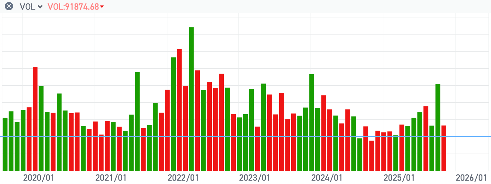
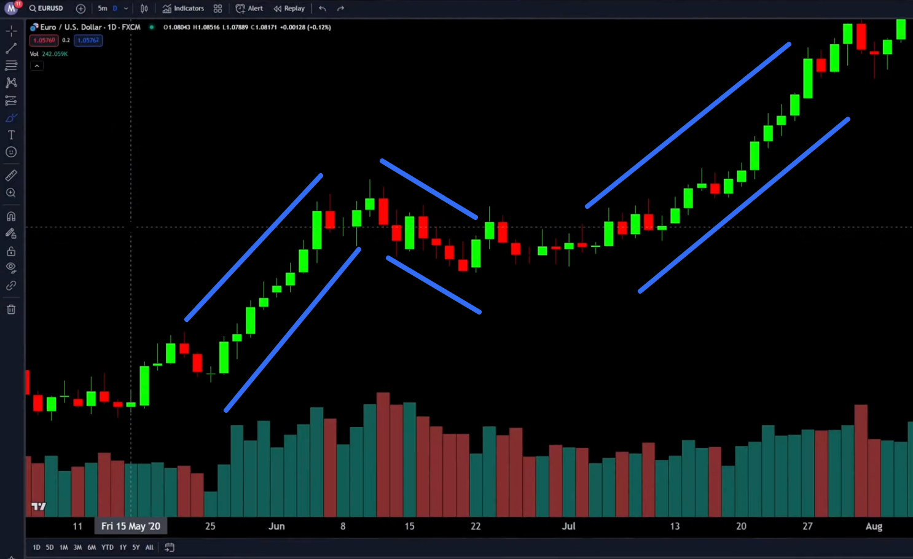
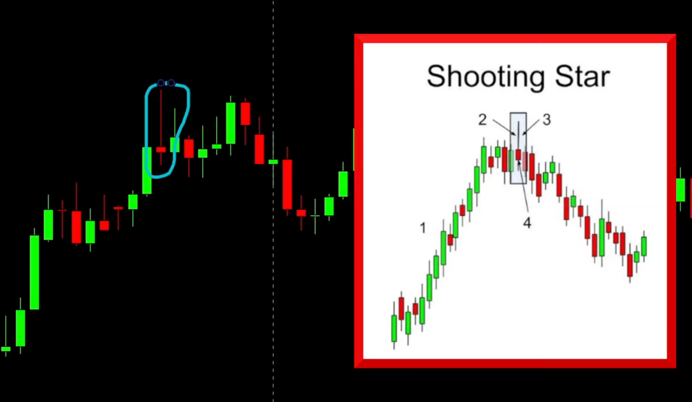

When you open any financial chart, your eyes will undoubtedly be drawn first to the fluctuations in price. However, while most beginners focus on price, they often overlook another critical foundational element on the chart — **volume**.

In professional market analysis, **price** and **volume** are the two core pillars for determining market trends. Price tells us “what has changed,” while volume reveals the “strength behind the move” and the **market consensus**. A price move without the support of volume is like a rumor without factual basis — it can reverse at any time.

Tracking volume serves the following two core purposes:

1. **Anticipate price movements:** By observing significant increases in volume, you can detect large-scale price movements before they happen.
2. **Confirm trend strength:** When a trend is accompanied by **continuously increasing volume**, it indicates that new capital is consistently entering the market, and the trend is likely to continue.
   If price continues rising while volume declines, it indicates weakening buying pressure and suggests the trend may soon end or reverse.

## What is Volume

Simply put, volume is the **total number of units of an asset** (such as a stock, cryptocurrency, or currency pair) that have actually been traded or changed hands during a specific time period (such as a day, an hour, or five minutes).

Volume measures **market activity** and **trading scale**. When price moves, volume reveals how many market participants support or oppose that move, reflecting the **strength** behind the price signal. The larger the volume, the more reliable the signal.

On stock charts, volume typically appears below the main price chart as a series of vertical bars.

| Element                | Meaning                                                                                                                              |
| :--------------------- | :----------------------------------------------------------------------------------------------------------------------------------- |
| **Bar height**         | Represents total trading volume during that period. The taller the bar, the greater the volume, and the more active the market.      |
| **Bar color**          | Color corresponds to the color of the candlestick in the same period to distinguish buying and selling pressure.                     |
| **Green bar (up day)** | Price closed higher during the period. Green bars represent **buying interest**, showing how many buyers supported the upward move.  |
| **Red bar (down day)** | Price closed lower during the period. Red bars represent **selling interest**, showing how many sellers supported the downward move. |

**【Core Principle】**

Any sharp price movement must be accompanied by large volume to confirm its **validity and reliability**. A price move supported by high volume has significantly stronger signal reliability and continuation potential than one with low volume.

### What is Turnover / Change of Hands

“Change of hands” is a descriptive concept referring to the process in which ownership of an asset transfers between buyers and sellers.

In essence, “change of hands” simply means **trading or transacting**. It means a stock has transferred ownership from the seller to the buyer. Volume is the total number of such “changes of hands” during a specific period.

### What is Turnover Rate

Turnover rate is a quantitative indicator used to measure a stock’s **trading activity** during a given period. It is the percentage of trading volume relative to the **free-floating shares** during a specific period (usually one day).

$$\text{Turnover Rate} = \frac{\text{Trading Volume}}{\text{Free-floating Shares}} \times 100%$$

**Free-floating shares:** The shares that a company has issued and are freely tradable in the market.

The turnover rate is an important reference for judging a stock’s activity and market sentiment. A high turnover rate typically indicates **high liquidity**, meaning investors can easily buy or sell the stock. However, an extremely high turnover rate also suggests high volatility and higher risk.

| Turnover Level                      | Market Interpretation                  | Meaning                                                                                     |
| :---------------------------------- | :------------------------------------- | :------------------------------------------------------------------------------------------ |
| **Low turnover** (e.g., below 1%)   | Low trading and lack of attention.     | Poor liquidity; buyers and sellers are inactive; not favored by mainstream capital.         |
| **Moderate turnover** (e.g., 3%–7%) | Active trading and moderate attention. | Good liquidity; normal activity range.                                                      |
| **High turnover** (e.g., above 7%)  | Very active, heavily watched.          | Indicates heavy buying or selling pressure; high volatility and intense market speculation. |

## How to Use Volume for Analytical Judgement

Learn to use volume to verify the **reliability** of price signals.

### Assess Trend Health

Determine whether an uptrend or downtrend has sustainable momentum.

* **Healthy trend criteria (example: healthy uptrend):**

  * During the **impulse (rally) phase**: volume must **increase**.
  * During the **pullback (consolidation) phase**: volume should **decrease**.
* **Weakness signal:** Price rises while volume consistently declines — indicates lack of supporting capital and risk of trend failure.

### Distinguish Real vs. False Breakouts

Determine whether a price breakout of a key support or resistance level is a **valid breakout** or a **false signal**.

* **✅ Valid breakout:** Volume must **surge significantly** at the moment of breakout. High volume confirms a shift in market forces.
* **❌ False breakout (fakeout):** Volume shows **no clear increase or even declines**. This warns that the breakout lacks capital support and price may fall back.

#### Example: Shooting Star

The “Shooting Star” is an important **bearish reversal** candlestick pattern in technical analysis. It usually appears after a clear **uptrend**, signaling that buyers may be exhausted and price is about to top and fall.

**1. Visual Characteristics of a Shooting Star**

| Feature               | Description                                                                                                                                |
| :-------------------- | :----------------------------------------------------------------------------------------------------------------------------------------- |
| **Small body**        | The real body (between open and close) is very small; color does not matter (green or red), but red bodies are typically stronger signals. |
| **Long upper shadow** | A long upper wick at least **twice the length** of the body.                                                                               |
| **Lower shadow**      | Almost **none** or very short.                                                                                                             |
| **Location**          | Must appear near the **top of an uptrend** to have reversal significance.                                                                  |

**2. Market Psychology**

A Shooting Star reflects intense battle during that period:

1. **Attempt by bulls:** Buyers push price to new highs (creating the long upper shadow).
2. **Counter by bears:** Sellers overpower buyers and push price back near the open.
3. **Conclusion:** Market rejects higher prices; bears begin to dominate — a bearish signal.

**3. How to Increase Signal Reliability (Confirmation)**

* **Volume confirmation:** A Shooting Star accompanied by **exceptionally high volume** greatly strengthens the signal. High volume means **many traders sold near the highs**.
* **Next candle:** Ideally, the following candle should be a **red (bearish)** candle that breaks below the body of the Shooting Star.

> **Note:** The Shooting Star resembles the **Inverted Hammer**, but differs in location:
> Shooting Star = **top of uptrend**, bearish reversal
> Inverted Hammer = **bottom of downtrend**, bullish reversal

### Identify Potential Reversals

* **High-volume reversal patterns:** A reversal candle accompanied by **surging volume** increases the likelihood of a true reversal.
* **Volume-price divergence:** If price makes higher highs while volume declines (divergence), upward momentum is weakening and reversal risk increases.

## Advanced Analysis: The Power of Institutions

Understanding volume is not enough; investors must learn the difference between institutional and retail behavior to greatly improve the accuracy of price-signal interpretation.

### Institutional Power and Volume Records

Large institutional funds control about 80% of market capital. Because of their strong research ability and massive capital, they are seen as “smart money.”

* **Source of volume:** Institutional buying or selling involves hundreds of millions or billions. These massive orders **cannot be hidden** and always leave clear **volume spikes** on the chart.
* **Investment meaning:** These spikes are evidence of institutional consensus at specific price levels.

### Distinguishing Institutional vs. Retail Behavior

Although all trades are anonymous, we can infer the dominant force based on **volume patterns** and **where they appear**:

| Feature            | Institutional (Strategic)                                        | Retail Collective (Emotional)                                    |
| :----------------- | :--------------------------------------------------------------- | :--------------------------------------------------------------- |
| **Volume pattern** | **Sudden, exceptionally large spikes**, far above average.       | **Gradual increase**, lacks explosiveness, unsustainable.        |
| **Price impact**   | Strong price movement with large-bodied candles (high momentum). | High volatility but smaller or messy candles.                    |
| **Location**       | At key **support/resistance** or major events.                   | Occurs during normal daily trend progression, emotional chasing. |

### Multi-Indicator Confirmation

Beginners should not rely solely on volume; they must combine it with:

#### 1. Candlestick Patterns and Price Action

Observe candle body size during high volume:

* **High volume + large body:** Strong directional conviction; most reliable signal.
* **High volume + small body (e.g., doji):** Indicates disagreement among institutions or large-scale **transfer of ownership** (distribution or accumulation).

#### 2. Support and Resistance (S/R) Levels

Institutions act with discipline and prefer key technical levels.

* **Validation:** When price tests major S/R levels with a **volume spike**, the signal carries strategic importance.
* **Timeframe:** Focus on **daily or weekly** charts to filter out retail noise.

**Summary:** Volume provides “scale,” candlesticks provide “intent,” and S/R levels provide “location.” Only by combining all three can we track smart money and confirm the reliability of price signals.

---

source:

[STOP Trading Until You Learn VOLUME ANALYSIS](https://www.youtube.com/watch?v=hWM2Gw36FlU)

