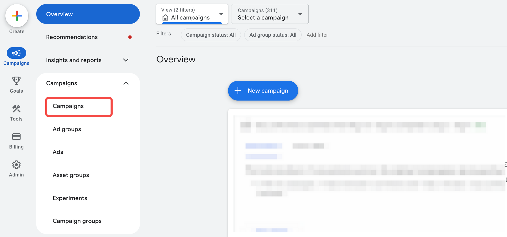
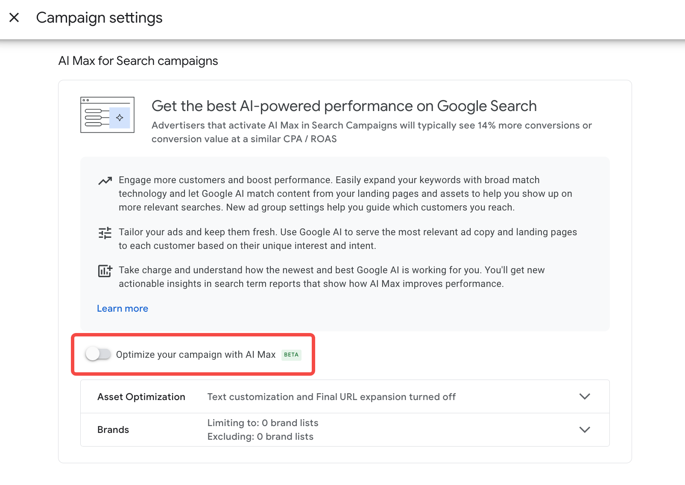
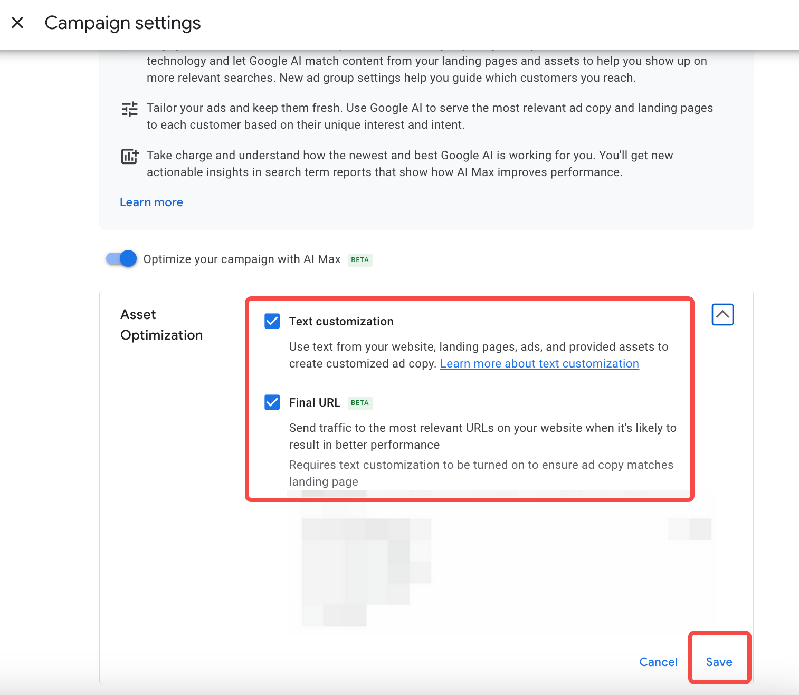
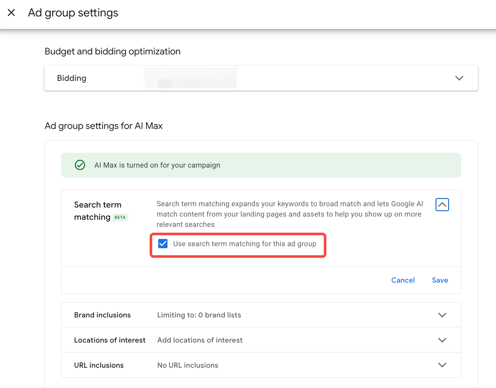
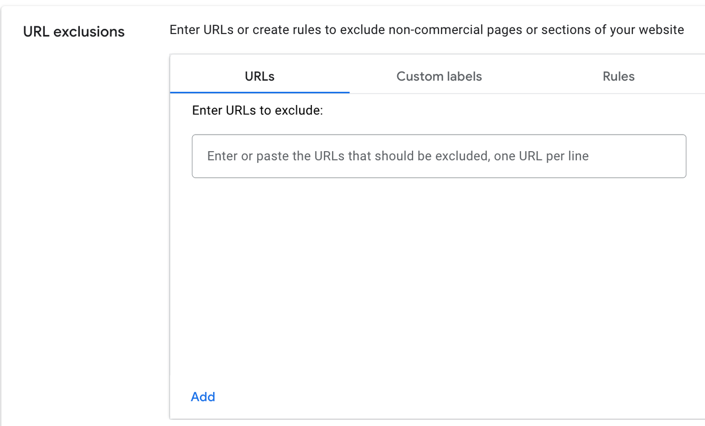
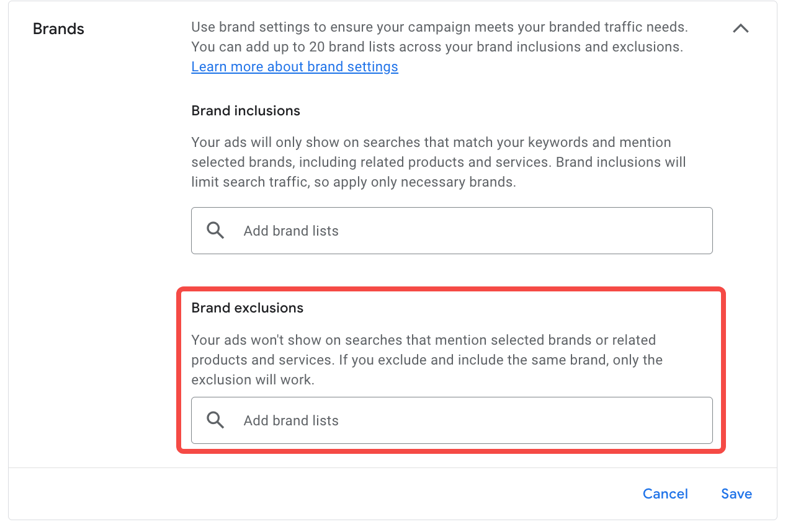

If you’re running search ads, you’re probably familiar with this scenario: you open Google Ads in the morning, and your account is full of keywords to optimize. Some keywords have spent a lot but brought no conversions, while some long-tail searches you never thought of are showing up in the reports. You spend half a day adding and excluding keywords, yet it feels like you can never keep up with changing search behavior.

This is the reality of search advertising today—competition is fierce, keyword prices are rising, and advertisers need to spend more effort just to maintain performance.

Meanwhile, AI is quietly changing how ads are managed. It can automatically generate ad copy, understand the intent behind searches, and even help you select the most relevant audiences.

Against this backdrop, Google launched **AI Max for Search**.

## What is Google AI Max for Search?

If you spend your days tweaking keywords, editing ad copy, and checking landing pages but still feel like you’re missing opportunities, you’ll understand why Google introduced **AI Max for Search**.

It’s not a new campaign type, but a set of AI-powered enhancements embedded within existing search ads.

Its core goal is simple: help you reach more potential customers with less manual work.

* **Optimized Matching**: AI understands user search intent and shows your ads to more relevant audiences.
* **Optimized Creative**: Automatically generates or adjusts ad headlines and descriptions based on your assets and landing pages.
* **Optimized Landing Pages**: Intelligently selects the most relevant pages to improve conversions, instead of being limited to a single fixed URL.

Compared to traditional keyword-based search campaigns, AI Max emphasizes **coverage + automation**. It’s not meant to replace your keyword strategy but to make your existing campaigns smarter and more efficient.

## Core Features of AI Max

Imagine you’re an e-commerce company that just launched a new smartwatch. You want to reach potential customers quickly while saving time on ad optimization. AI Max’s three core features can help you achieve this:

### 1. Expanded Query Matching

AI Max automatically captures user search intent, even if the search terms don’t exactly match your keyword list.
**Use case**: Ideal for advertisers seeking new traffic, especially for long-tail opportunities or testing new markets.
**Example**: If someone searches “best sports watches” or “smartwatch for running,” AI Max will still show your ad. Your ad reaches more long-tail search terms, bringing in new customers without manually adding every possible keyword.

### 2. Text Customization / Automatically Created Assets

AI Max can automatically generate or optimize ad headlines and descriptions based on your existing ad assets and landing pages, making copy more relevant to users.
**Use case**: Great for advertisers who need to quickly expand ad copy and boost click-through rates, saving significant manual writing time.
**Example**: Your original headline is “New Smartwatch Available.” AI might generate “Must-have smartwatch for runners—grab yours today with a discount.” Multiple copy variations run simultaneously, increasing CTR without extra effort.

### 3. Final URL Expansion

When a user clicks an ad, Google can direct them to the most relevant landing page, rather than a single manually set URL.
**Use case**: Perfect for websites with rich content and multiple landing pages, without needing to assign a page for every ad manually.
**Example**: A user searches for “smartwatch for swimming,” and AI directs them to the product feature page rather than the homepage, improving conversion rates.

## How to Enable AI Max

Enabling AI Max is flexible because it’s a set of enhancements for existing search ads, not a new campaign type. You can turn each feature on or off in your **Search campaign settings**, testing them individually.

AI Max has three main toggles:

1. **Expanded Query Matching**
2. **Text Customization / Automatically Created Assets**
3. **Final URL Expansion**

You can start with the simplest feature, such as just enabling Expanded Query Matching, and then gradually turn on the other features once you’re familiar with the system. Here’s how:

1. **Open Google Ads and access your Search campaign**
   Log in, go to **Campaigns** → select the Search campaign where you want to apply AI Max.

   

2. **Go to AI Max Settings**
   In campaign settings, find **Optimize your campaign with AI Max**. Note that toggling it on automatically saves your choice.

   

3. **Choose which features to enable**
   Besides the master toggle, you can decide whether to enable “Automatically Created Assets” and “Final URL Expansion.” Both are on by default; if you make changes, remember to save.

   

   The Expanded Query Matching toggle isn’t available at the campaign level, but can be set at the ad group level:

   

4. **Set exclusions**
   Not every page is suitable for ads, and not every matched keyword is desirable. Use exclusions to filter traffic and pages:

   * **URL exclusions**: Google supports excluding by URL, uploaded page feed, or custom rules.
     
   * **Brand exclusions** (account-level; generally not recommended, as it affects brand campaigns within the same account)
     
   * Regular exclusions, such as negative keywords or asset removals

## Why AI Max is Worth Trying

AI Max isn’t meant to replace your existing keyword strategy—it enhances Google Search campaigns. By leveraging AI, advertisers can maintain control while reaching potential customers more efficiently.

The benefits of AI Max for advertisers include:

* **Higher efficiency**: Automatically matches search intent, generates ad copy, and selects the most relevant landing pages, saving manual work.
* **Expanded coverage**: Captures long-tail searches and potential customers, increasing ad reach.
* **Data-driven optimization**: System-driven improvements provide more actionable data to inform future campaigns.

The next article will dive into **how to view AI Max data and use it to optimize ad performance**, helping you turn AI Max’s potential into tangible results.

