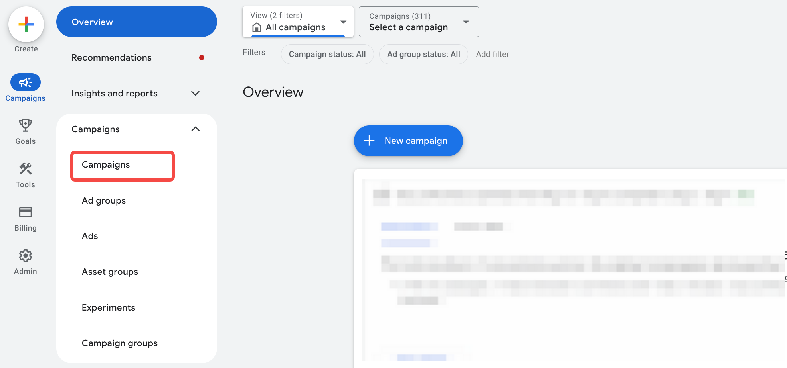
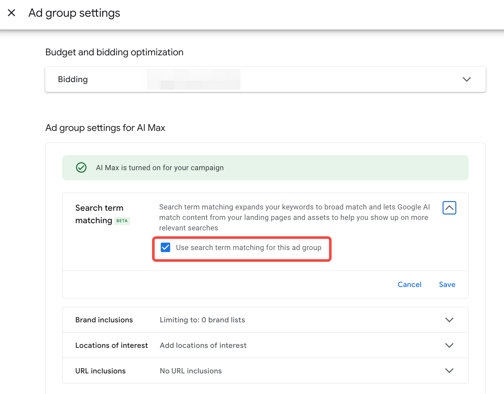

如果你正在投放搜索广告，大概对这种场景不陌生：早上打开 Google Ads，账户里堆满了要优化的关键词。有些词花了不少钱却没转化，有些长尾搜索根本没想到过，却硬生生跑进了报告里。你花了大半天加词、否词，仍觉得总是追不上用户搜索行为的变化。

这就是当下搜索广告的常态——竞争越来越激烈，关键词价格水涨船高，而广告主却要花更多精力维持效果。

与此同时，AI 正在悄悄改变广告投放的方式。它能自动生成文案，理解搜索背后的意图，甚至帮你挑选更合适的受众。

在这样的背景下，Google 推出了 **AI Max for Search**。

## 什么是 Google AI Max for Search？

如果你每天都在忙着调整关键词、修改广告文案、检查落地页，却总觉得流量机会总是漏掉，那么你会理解为什么 Google 推出了 **AI Max for Search**。

它不是一个全新的广告系列，而是一组嵌入在现有搜索广告里的 AI 增强功能。

它的核心目标很简单：帮你用更少的手动操作，抓住更多潜在客户。

* **优化匹配**：AI 会理解用户搜索意图，把广告展示给更相关的受众。
* **优化创意**：根据你的素材和落地页，自动生成或调整广告标题和描述。
* **优化落地页**：智能选择最相关的页面，提高转化机会，而不是固定单一 URL。

相比传统基于关键词的搜索广告，AI Max 更强调 **覆盖+自动化**。它不是要替代你的关键词策略，而是帮你在原有基础上，做得更聪明、更高效。

## AI Max 的核心功能

假设你是一家电商公司，刚推出一款新款智能手表。你希望快速获取潜在客户，同时节省广告优化时间。AI Max 的三大核心功能可以帮助你实现这一目标：

### 1. 扩展匹配（Expanded Query Matching）

AI Max 自动捕捉用户的搜索意图，即便这些搜索词没有完全匹配你的关键词列表。
**使用场景**：非常适合希望获取新流量的广告主，尤其是想覆盖长尾搜索机会或测试新市场的情况。
**例如**：有人搜索“运动手表推荐”或“适合跑步的智能手表”，AI Max 也会将广告展示给他们。结果，你的广告覆盖了更多长尾搜索词，新客户流量明显增加，而无需手动添加每一个可能的关键词。

### 2. 文本定制（Text Customization / Automatically Created Assets）

基于你的现有广告素材和落地页内容，AI Max 能自动生成或优化广告标题和描述，让文案更贴合用户需求。
**使用场景**：适合需要快速扩充广告文案、提高点击率的广告主，节省大量人工撰写时间。
**例如**：原本广告标题是“新款智能手表上市”，AI 自动生成文案可能是“跑步爱好者必备智能手表，今日抢购享折扣”。多个文案组合同时投放，点击率提升，同时无需额外写大量标题。

### 3. 最终 URL 扩展（Final URL Expansion）

在用户点击广告时，Google 可以选择最相关的落地页，而不是仅限于你手动设置的单一 URL。
**使用场景**：适合网站内容丰富、落地页众多，但不想为每条广告逐一配置页面的广告主。
**例如**：用户搜索“适合游泳的智能手表”，AI 会直接引导到产品功能页，而不是默认主页。结果是转化率提升，广告主也不用手动设置每条广告的落地页。

## 如何启用 AI Max？

开启 AI Max 非常灵活，因为它本质上是现有搜索广告的一组增强功能，而不是全新的广告系列。你可以在 **Search campaign 设置**中逐项启用或关闭，每一项功能都可以单独尝试。

AI Max 主要有三个开关：

1. **扩展匹配（Expanded Query Matching）**
2. **自动素材生成（Text Customization / Automatically Created Assets）**
3. **最终 URL 扩展（Final URL Expansion）**

这意味着你可以先从最简单的功能开始测试，比如仅启用扩展匹配，看看效果如何。等熟悉了系统的运作方式，再逐步开启自动素材生成或最终 URL 扩展。具体步骤如下：

1. **打开 Google Ads 并进入你的 Search campaign**
登录账户后，在左侧导航栏选择 **广告系列** → 点击你想应用 AI Max 的 Search campaign。

2. **进入 AI Max 设置**

在广告系列设置里，找到 **Optimize your campaign with AI Max** 的选项。需要注意的是，开关打开后便会自动保存。

3. **x选择性启用功能**

除了总开关外，你还可以选择是否开启“自动素材生成”和“最终URL扩展”。默认是两项都打开的，如果你有修改，记得保存设置。

campaign层级不支持开关**扩展匹配**功能，但你可以在ad group层级进行设置：

4. **排除条件设置**

并不是所有的页面都适合用于广告投放，也不是所有匹配出的关键词都是广告主想要的。所以我们可以通过一些排除条件来进行流量和页面的筛选：

- URL exclusions：
目前谷歌支持三种排除方式：URL、上传页面feed、自定义规则

- Brand exclusions（account级别，建议不用，会影响到同账户下的品牌词campaign）

- 常规的排除条件设置，如negative keywords list、asset removals

## 为什么 AI Max 值得尝试？

AI Max 并不是为了取代你现有的关键词策略，而是对 Google Search 广告的一种增强。它利用 AI 技术，让广告主在保持原有控制力的同时，更高效地触达潜在客户。

对于广告主来说，AI Max 的价值在于：

* **提高效率**：自动匹配搜索意图、生成文案、选择最合适的落地页，节省大量手动操作时间。
* **扩大覆盖**：抓住长尾搜索词和潜在客户，提高广告触达范围。
* **数据驱动**：通过系统自动优化，你可以获得更多有效数据，为后续广告策略提供参考。

下一篇文章将会详细讲解 **如何查看 AI Max 数据，以及如何用数据优化广告表现**，帮助你把 AI Max 的潜力转化为实际效果。
