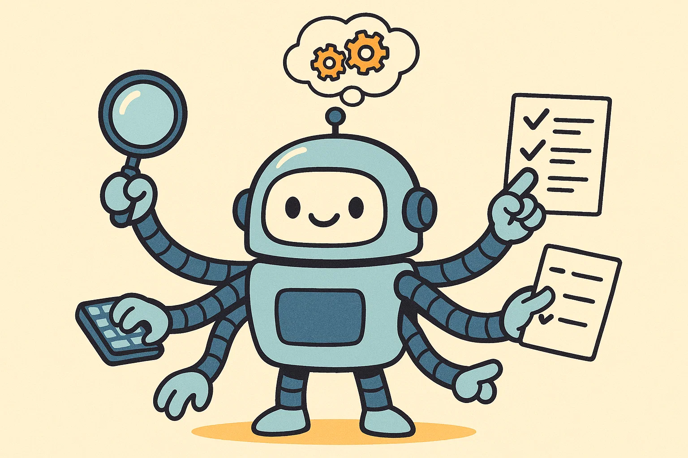
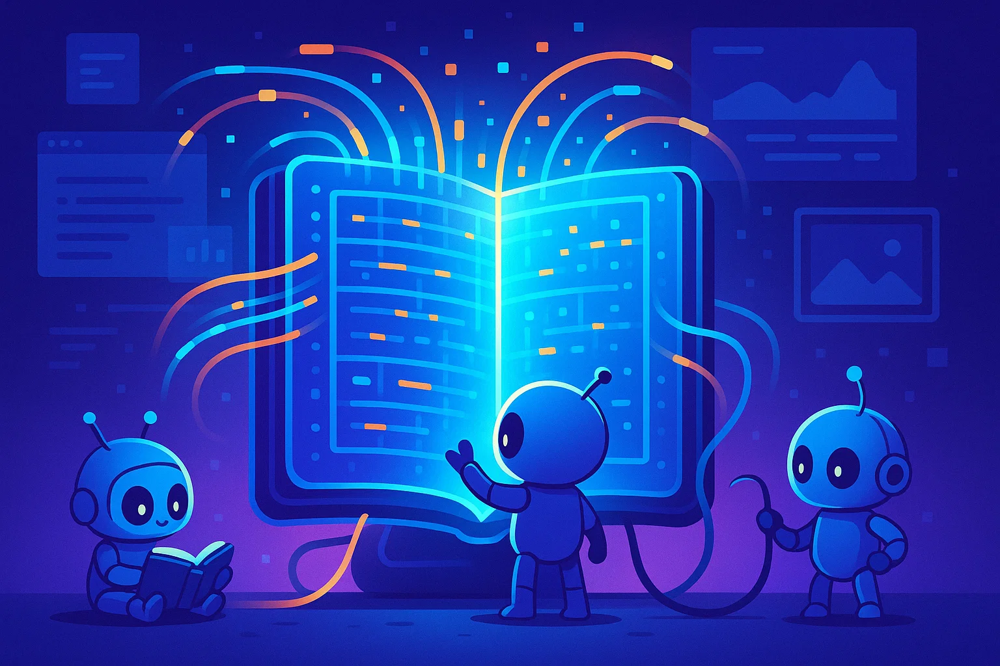
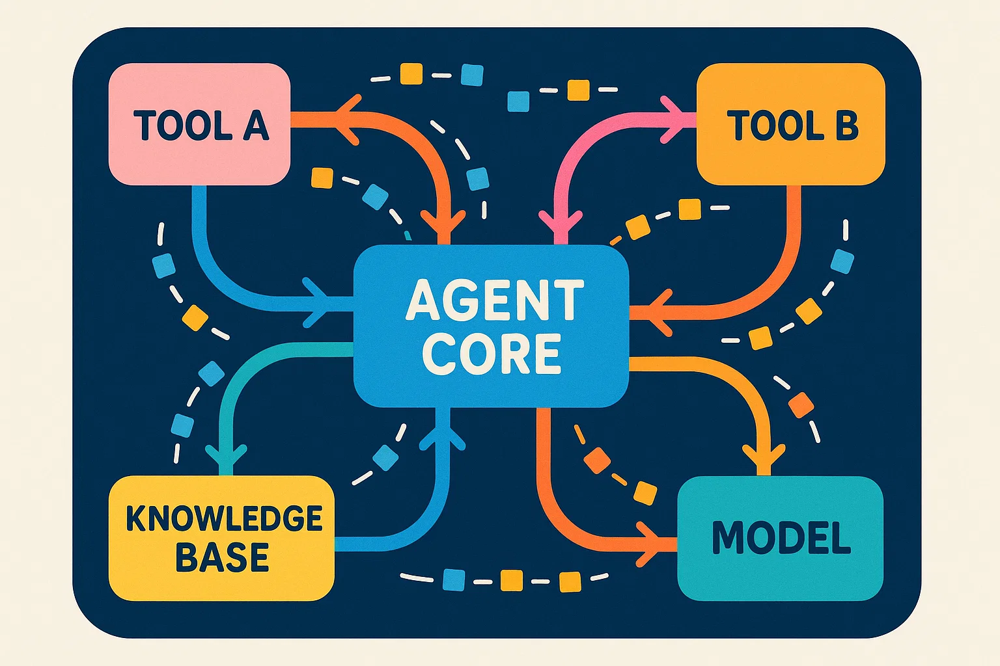

# AI Glossary for Beginners

Have you noticed that **AI (Artificial Intelligence)** seems to be everywhere these days? It’s embedded in the tools and products we use every day. However, once discussions dive into the technical side—terms like **Agent**, **Knowledge Base**, and **MCP**—things can get confusing.

**This article is for you—the AI beginner.** My goal is to help you build a clear and reliable understanding of essential AI terminology. I’ll explain each concept in **simple, straightforward language** so you can grasp their real-world functions.

Once you master these basics, you’ll be able to understand AI news, product features, and confidently join the conversation.

## Agent

### One-Sentence Definition

An **Agent** is like a “**goal-oriented digital helper that figures out how to get things done on its own**.”
It’s not just a Q&A bot—it’s a program capable of planning and executing a series of complex actions autonomously.

### How It Works

An AI agent is called “intelligent” because it exhibits **autonomy**, following four core steps:

1. **Goal Setting:** Receives your command, e.g., “Plan a five-day trip to Tokyo with a ¥10,000 budget.”
2. **Planning & Decomposition:** Breaks the task into smaller steps—search flights → filter hotels → design daily itinerary → book activities.
3. **Action & Execution:** Uses external tools (like browsers, map APIs, or booking systems) to complete each step.
4. **Reflection & Correction:** Constantly checks whether results match expectations. If something fails (e.g., a hotel booking), it re-plans and finds an alternative.

Think of it as your **personal assistant**—you give a broad request, and it independently thinks, uses tools, and completes the process.

**Applications:**

* **Workflow Automation:** Automating complex, repetitive business processes such as data aggregation and report generation.
* **AI Coding Assistants:** Understanding a functional requirement and autonomously completing coding, testing, and debugging tasks.

### Technical Core

An Agent’s autonomy relies on three key components:

1. **Large Language Model (LLM):** The **“brain”**—handles reasoning, planning, and decision-making.
2. **Memory:** Prevents “forgetfulness.”

   * *Short-term memory* keeps conversational context.
   * *Long-term memory* stores past learnings and experiences.
3. **Tooling:** The **“hands and feet.”** Agents use tools like search engines, code interpreters, or APIs to act on their plans.

### Product Examples

* **Digital Enterprise Agents:** Automating HR, finance, and customer service workflows.
* **Personal Automation Agents:** Managing calendars, emails, and tasks across multiple apps.
* **General Agent Platforms:** Frameworks for developers to build customized agents for specific tasks.

## Knowledge Base

### One-Sentence Definition

A **Knowledge Base** is an AI system’s **external long-term memory and professional reference library**.
It stores structured facts and domain knowledge to keep AI responses **accurate and up to date**.

### Why It Matters

LLMs have two major limitations:

1. **Knowledge Cutoff:** Training data stops at a specific date (e.g., early 2023).
2. **Limited Domain Expertise:** Hard to retain deep, industry-specific information.

A knowledge base solves these by letting AI **query external data in real time**, ensuring precise, current answers.

Imagine a **super-smart friend**:

* The **friend (LLM)** can reason and communicate fluently.
* The **encyclopedia (Knowledge Base)** lets them reference the latest information to give factual, reliable answers.

### Technical Core — RAG (Retrieval-Augmented Generation)

1. **Retrieve:** AI searches the knowledge base for relevant documents.
2. **Augment:** The retrieved “evidence” is combined with the question.
3. **Generate:** The LLM produces an answer based on verified information—**fact-driven, not fabricated**.

### Applications

* **Smart Customer Support:** Pulling from FAQs, manuals, and policies.
* **Internal Knowledge Assistants:** Helping employees query company processes and project data.
* **Legal/Medical Q&A:** Referencing up-to-date laws or research papers.

## MCP (Model Context Protocol)

### One-Sentence Definition

**MCP (Model Context Protocol)** is a **set of rules and standards** that dictate how an AI system (like an Agent) should **organize, exchange, and maintain all contextual information** during task execution.

### Why It Matters

MCP addresses the challenges of **memory continuity and data communication** in AI workflows:

1. **Workflow Coherence:** Keeps multi-step tasks consistent and connected.
2. **Data Uniformity:** Ensures seamless information exchange between Agents, tools, and databases.
3. **Efficiency:** Manages LLM context limits efficiently by prioritizing key information.

Imagine an Agent as a **project manager** who maintains a “**Project Execution Protocol (MCP)**” log—defining goals, completed steps, issues, and next actions. Every team member (tools, other agents) must update the log in a consistent format, ensuring smooth collaboration.

Technically, MCP defines **data schemas** and **communication formats** (e.g., JSON) to structure Agents’ short-term memory and tool usage logs.

### Applications

* **Multi-Agent Collaboration:** Enabling agents to hand off tasks seamlessly.
* **RAG Optimization:** Structuring retrieved data and metadata for precise LLM integration.
* **Long-Form Automation:** Supporting workflows that span dozens of steps while retaining full task context.

