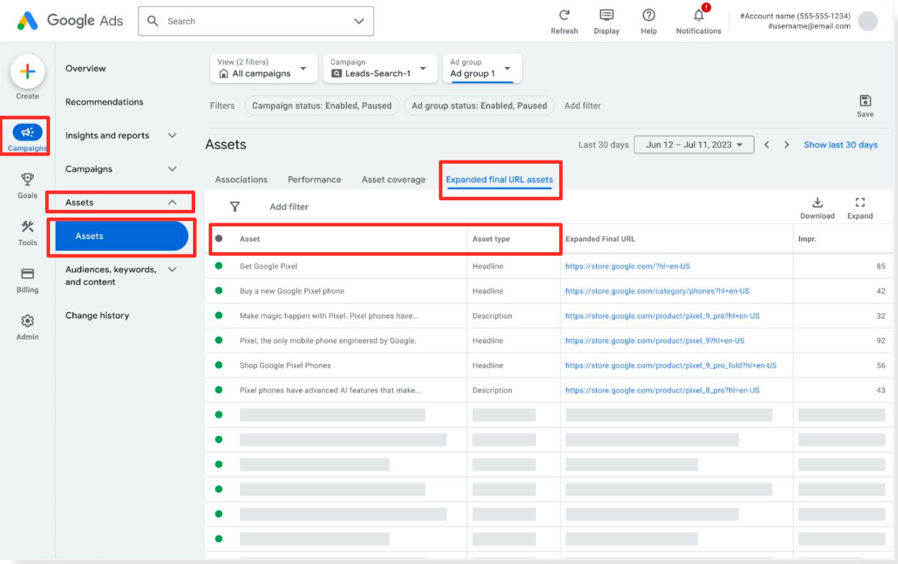

# Using AI Max for Ad Copy? Beware of These 2 Key Risks

In a previous article, we explored how [AI Max's keyword matching works](https://chloevolution.com/posts/ai-max-search-keyword-insights/) and found that it's independently opening up new traffic channels. But AI Max’s capabilities go far beyond that; it can also automatically generate ad copy and headlines.

So, the question is: Where do these automatically-generated creatives come from? And while they offer convenience, what risks are hidden within?

## Types and Frequency of AI-Generated Creatives

AI Max primarily generates two types of creatives: **titles** and **descriptions**. In my test account, AI-generated creatives were mostly titles, making up as much as **80%** of the total.

This ratio is very significant. It suggests that AI Max's creative strategy favors **high-frequency title testing**. Titles are the most visible element of an ad and have the biggest impact on CTR. By generating a large volume of different titles, the AI can rapidly A/B test to find the copy that best resonates with users.

The AI generates about **12 new** titles or descriptions per day. I even observed that **some AI-generated titles significantly exceeded the traditional 30-character limit** for Google Ads. This indicates that AI Max is using an independent creative system with its own rules, separate from the traditional ones.

This also explains why AI Max's automatically-generated creatives **do not appear in the same backend data tables as the ones advertisers provide**. They are completely isolated in a different data stream, which means AI Max is not just a simple creative tool but a parallel system with its own logic and rules.

## The Mechanisms Behind AI Creative Generation

Since AI Max can generate such a large volume of unique creatives, how does it do it? Through my observations, I found that creative generation relies on two core mechanisms.

### **Directly Pulling from Landing Page Text**

AI Max will directly extract text from your **landing page** and use it for an ad title or description. This is a straightforward yet efficient way to generate creatives. The richer and more organized your landing page content is, the more likely the AI is to extract valuable copy from it.

### **Matching and Generating Based on Semantics**

AI Max doesn't just copy and paste. I observed that some generated creatives didn't directly quote landing page text but were highly relevant to the page's theme. This indicates that the AI can perform a deep **semantic understanding** and generate new, more compelling copy based on that comprehension.

Furthermore, I speculate that the AI has a tendency to recognize **text within images**. This suggests that AI Max may be "smarter" than we think when it comes to gathering information, as it tries to understand all available content on a page.

However, this mechanism also presents a typical "black box" problem. While we can see what copy the AI has generated, we **don't know exactly what part of the landing page it came from** or how it was sourced. What's more, we can currently only see the **impressions** for these creatives, not critical metrics like clicks or cost. This data asymmetry makes it challenging to evaluate their performance.

## Risks and Challenges of AI-Generated Creatives

While AI Max's creative generation provides us with a lot of convenience, this "black box" is far from perfect. In my tests, I also found two risks and challenges to be wary of.

### Uncontrollable Content

The AI's generation logic can sometimes be unpredictable. I observed that the AI would pull copy from the landing page that was **not intended for marketing**. For example, from a blog page about a company's philosophy, the AI might grab a famous quote and use it as an ad headline.

While this copy comes from your page, it might be irrelevant to your marketing goals or even seem nonsensical. This lack of control is the biggest risk of AI-generated copy and requires constant vigilance.

### Latency and Lack of Real-time Sync

Another risk is **the lag in creative updates**. AI-generated copy doesn't update in real time with the landing page. For example, even if you updated your landing page on August 1st and removed certain phrases, the AI might still generate copy containing that old information on August 2nd.

This latency can cause a mismatch between your ad and your landing page, confusing users. This not only hurts the user experience but can also lower your conversion rate.

What's more, these risks add to our workload. To ensure the accuracy and consistency of our ad copy, we have to regularly check the AI-generated creatives and manually remove those that don't meet our standards. This contradicts AI Max's original purpose of reducing workload.

The most direct value of AI Max's ad creative generation is its ability to act as an endless creative engine, continuously generating new headlines and descriptions that significantly reduce the manual work of writing ad copy. This automated content generation, based on landing page content, also gives us new creative directions.

However, this "black box" is far from perfect. It introduces the risks of uncontrollable content, update lag, and data opacity. To ensure ad consistency and marketing effectiveness, we have to spend extra time reviewing and correcting the AI's output. This contradicts its initial purpose of being a fully automated tool.

Therefore, our role must change. We are no longer mere copywriters but managers and supervisors of AI-generated creatives.

My final recommendations are:

1.  **Provide high-quality input**: Give the AI clear, precise, and highly relevant landing page content, as this is key to guiding it toward generating effective creatives.
2.  **Maintain continuous monitoring**: Regularly check the AI-generated copy and promptly remove irrelevant or ambiguous content.
3.  **Understand and accept its limitations**: The AI's automation is powerful, but it still requires human supervision and correction to ensure accuracy and maximize its value.
