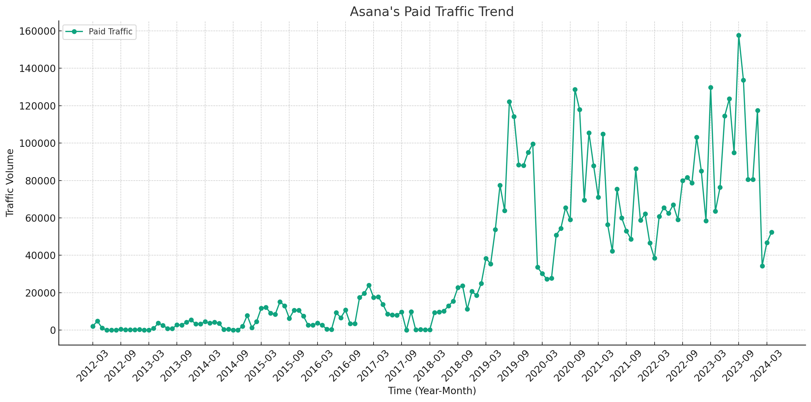

# Asana SEM Strategy Analysis (2024)

## Takeaways

- **SEM Trend**: From 2020 to 2023, Asana's average SEM traffic increased from 72,321 to 79,865, indicating a growth trend in paid traffic.
- **SEM Keyword Strategy**: The decrease in traffic from 92,970 to 49,549 between September 2023 and April 2024 suggests a need to reevaluate keyword strategies.
- **SEM URL Traffic Distribution**:  In March 2024, the top landing pages indicated a diversified approach, targeting various user intents—from general campaign pages to specific feature pages.

Note: The data used in this article is only for the desktop side in the US market. All data are taken from third-party platforms, this site does not guarantee the accuracy of the data.

Here is the analysis of the traffic trends for Asana's Paid Traffic over the specified time points and phases:

| Phase             | Average Traffic | Trend       |
|-------------------|-----------------|-------------|
| 2019-08 to 2020-10 | 72,321          | Increasing  |
| 2020-10 to 2023-09 | 79,865          | Increasing  |
| 2023-09 to 2024-03 | 92,970          | Decreasing  |
| 2024-03 to 2024-04 | 49,549          | Increasing  |

## Analysis:
- **2019-08 to 2020-10**: Paid Traffic started increasing, indicating a positive response to the campaigns or improved strategies in this early phase.
- **2020-10 to 2023-09**: The trend continued to increase over this long period, suggesting sustained success in the paid traffic strategy, possibly due to optimizing campaigns or increasing budget allocation.
- **2023-09 to 2024-03**: There was a decrease in the traffic trend, which could indicate changes in strategy, market conditions, or competition influencing the paid traffic performance.
- **2024-03 to 2024-04**: Although this is a very short phase, there is an indication of an increasing trend again, possibly due to adjustments made after observing the previous decrease.

See more about [Asana's SEO strategy](https://chloevolution.com/posts/asana-seo-strategy-analysis).

## Asana's SEM Strategy in November 2020

### Paid Keyword Strategy

| Keyword Topic     | Keyword Example       | Traffic | Traffic (%) | Average CPC (USD) |
|-------------------|-----------------------|---------|-------------|-------------------|
| Other             | N/A                   | 51,199  | 41.90%      | 7.47              |
| Competitor Brand  | trello                | 34,344  | 28.11%      | 1.43              |
| Product-Related   | asana                 | 32,207  | 26.36%      | 1.71              |
| Feature-Based     | project management    | 4,440   | 3.63%       | 16.29             |

**Classification Rules:**
- **Product-Related**: Keywords directly associated with Asana's product (e.g., "asana").
- **Competitor Brand**: Keywords related to competitor brands (e.g., "trello", "confluence").
- **Feature-Based**: Keywords focused on specific features or functions (e.g., "project management").
- **Industry-Specific**: Keywords related to specific industries (not explicitly shown in the provided data but included in classification logic).
- **Other**: Keywords that do not fit into the above categories.

### URL Traffic Distribution
The traffic distribution across different URLs shows which landing pages are most effective. Here are the top 5 URLs by traffic:

| URL                                         | Traffic | Traffic (%) |
|---------------------------------------------|---------|-------------|
| http://www.asana.com/                       | 36,509  | 29.88%      |
| http://www.asana.com/compare/trello         | 28,992  | 23.73%      |
| http://www.asana.com/compare/confluence     | 11,270  | 9.22%       |
| http://www.asana.com/project-mgmt/get-started | 9,602  | 7.86%       |
| http://www.asana.com/compare/microsoft      | 5,167   | 4.23%       |

### Summary of Asana's SEM Strategy in August 2019
- **Keyword Focus**: Asana primarily targeted competitor brand keywords and its own brand, making up a significant portion of the traffic. This indicates a strong competitive positioning strategy in SEM.
- **Traffic Concentration**: A significant percentage of traffic was directed towards Asana's main site and comparison pages with competitors, highlighting a strategy to convert users comparing different tools.
- **Cost Consideration**: Although the 'Other' category had the highest average CPC, it also accounted for the largest share of traffic, suggesting that Asana may have invested in high-cost keywords outside typical categories to capture broader traffic.
- **Effective Landing Pages**: The comparison pages with competitors like Trello and Confluence were particularly effective, indicating a strategy to target users considering these specific competitors.

## Asana's SEM Strategy in October 2020

### Paid Keyword Strategy

Here's the summary table for keyword topics:

| Keyword Topic     | Keyword Example       | Traffic | Traffic (%) | Average CPC (USD) |
|-------------------|-----------------------|---------|-------------|-------------------|
| Other             | N/A                   | 52,933  | 41.12%      | 22.31             |
| Product-Related   | asana                 | 42,441  | 32.97%      | 8.90              |
| Competitor Brand  | trello                | 30,180  | 23.44%      | 6.40              |
| Feature-Based     | project management    | 3,182   | 2.47%       | 8.51              |

**Classification Rules:**

The keywords have been classified into several topics:
- **Product-Related**: Directly associated with Asana's own brand (e.g., "asana").
- **Competitor Brand**: Related to competing brands (e.g., "trello", "monday").
- **Feature-Based**: Focused on specific features that Asana offers (e.g., "project management").
- **Other**: Keywords that do not fit into the above categories or general terms related to project management tools.

### URL Traffic Distribution
Here are the top 5 URLs by traffic in October 2020:

| URL                                                | Traffic | Traffic (%) |
|----------------------------------------------------|---------|-------------|
| https://asana.com/go/asana-vs-trello-compare       | 29,700  | 23.07%      |
| https://www.asana.com/                             | 17,473  | 13.57%      |
| https://asana.com/campaign/fac/do                  | 15,376  | 11.94%      |
| https://asana.com/campaign/pac/think               | 14,474  | 11.24%      |
| https://asana.com/compare/asana-vs-microsoft-proj...| 10,885  | 8.46%       |

### Summary of Asana's SEM Strategy in October 2020:
- **Competitive Focus**: A significant part of the strategy involved targeting competitor brands, indicating a strong competitive positioning strategy. This helps attract users from competing services by directly comparing features.
- **High Cost Keywords**: The 'Other' category, which likely includes high-competition general industry keywords, has the highest average CPC, suggesting Asana was bidding aggressively on broad but relevant terms.
- **Product Branding**: The high traffic percentage for product-related keywords shows a focus on strengthening brand recognition and driving direct searches for Asana.
- **Effective Landing Pages**: The URLs with the highest traffic were comparison pages with competitors and specific campaign landing pages, indicating targeted efforts to convert users from specific ad campaigns.
  

## Asana's SEM Strategy in September 2023

### Paid Keyword Strategy

Here's the summary table for keyword topics:

| Keyword Topic     | Keyword Example       | Traffic | Traffic (%) | Average CPC (USD) |
|-------------------|-----------------------|---------|-------------|-------------------|
| Other             | N/A                   | 107,679 | 68.32%      | 3.31              |
| Product-Related   | asana                 | 32,207  | 20.43%      | 12.74             |
| Competitor Brand  | trello                | 16,856  | 10.69%      | 9.32              |
| Feature-Based     | project management    | 867     | 0.55%       | 6.78              |

The keywords have been classified into several topics based on their relevance:
- **Product-Related**: Directly associated with Asana's own brand (e.g., "asana").
- **Competitor Brand**: Related to competing brands (e.g., "trello", "[monday](https://chloevolution.com/posts/monday-com-ads)", "[notion]https://chloevolution.com/posts/notion-sem-strategy-analysis", "[clickup](https://chloevolution.com/posts/clickup-sem-strategy-analysis)", "[jira](https://chloevolution.com/posts/atlassian-sem-strategy-analysis)", "[wrike](https://chloevolution.com/posts/wrike-sem-strategy-analysis)").
- **Feature-Based**: Focused on specific features that Asana offers (e.g., "project management").
- **Other**: Keywords that do not fit into the above categories or general terms related to project management tools.
- **Engagement**: Topics intended to engage users with content (e.g., "ice breaker questions").

### URL Traffic Distribution
Here are the top 5 URLs by traffic in September 2023:

| URL                                               | Traffic | Traffic (%) |
|---------------------------------------------------|---------|-------------|
| https://asana.com/campaign/fac/do                 | 22,381  | 14.20%      |
| https://asana.com/uses/team-calendar              | 20,656  | 13.11%      |
| https://asana.com/campaign/uc/do-2                | 17,864  | 11.33%      |
| https://asana.com/go/asana-vs-trello-compare      | 17,534  | 11.12%      |
| https://asana.com/uses/to-do-list                 | 11,920  | 7.56%       |

### Summary of Asana's SEM Strategy in September 2023
- **Broad Keyword Coverage**: The 'Other' category dominates the traffic, indicating a broad and possibly diverse set of keywords beyond typical categories, aiming to capture a wide audience.
- **Strong Brand Focus**: A significant portion of the strategy involves promoting Asana's brand directly, with high investment in CPC for these keywords, reflecting a focus on strengthening brand recognition and conversion.
- **Competitor Targeting**: Competitive keywords, especially those comparing Asana with direct competitors like Trello, are also a key part of the strategy, indicating ongoing efforts to attract users from competitors.
- **Feature Highlighting**: Although contributing a small percentage, feature-based keywords are used to highlight specific functionalities, possibly aiming at niche markets or specific use cases.
- **Effective Landing Pages**: The URLs with the highest traffic are focused on campaign-specific and utility pages, indicating targeted efforts to convert users from specific ads, with landing pages optimized for specific teams and tasks.

## Asana's SEM Strategy in March 2024

### Paid Keyword Strategy

| Keyword Topic           | Keyword Example | Traffic | Traffic (%) | Average CPC (USD) |
|-------------------------|-----------------|---------|-------------|-------------------|
| Other                   | N/A             | 32,576  | 69.72%      | 4.39              |
| Product-Related         | asana           | 14,147  | 30.28%      | 10.73             |

The keywords have been classified into several relevant topics:
- **Product-Related**: Directly associated with Asana's own brand (e.g., "asana", "asana login").
- **Feature-Based**: Focused on specific features that Asana offers (e.g., "to do list", "gantt chart").
- **Leadership and Management**: Related to broader managerial or leadership themes (e.g., "leadership styles").
- **Other**: Keywords that do not fit into the above categories or are more generic in nature.

### URL Traffic Distribution
Here are the top 5 URLs by traffic in March 2024:

| URL                                      | Traffic | Traffic (%) |
|------------------------------------------|---------|-------------|
| https://asana.com/campaign/fac/do        | 16,063  | 34.38%      |
| https://asana.com/go/timeline            | 4,894   | 10.47%      |
| https://asana.com/uses/team-calendar     | 4,570   | 9.78%       |
| https://asana.com/uses/to-do-list        | 4,548   | 9.73%       |
| https://asana.com/uses/task-management   | 3,904   | 8.36%       |

### Summary of Asana's SEM Strategy in March 2024
- **Focused Keyword Strategy**: A significant portion of traffic comes from a small number of product-related keywords, indicating a focused strategy on brand reinforcement and feature promotion.
- **High Average CPC for Brand Keywords**: The high average CPC for product-related keywords suggests that Asana is willing to invest significantly in maintaining top positions for its brand keywords, indicating the value of direct brand searches to their strategy.
- **Diverse Landing Pages**: The URLs with the highest traffic indicate a diversified approach, targeting different user intents—from general campaign pages to specific feature pages, enhancing user engagement and conversion opportunities.
- **Effective Use of Feature Keywords**: Feature-based keywords like "to do list" and "gantt chart" highlight Asana's strategy to attract users based on specific tool functionalities, catering to users' direct needs.

## Summary

To examine the similarities and differences among the periods (August 2019, October 2020, September 2023, and March 2024) in Asana's SEM strategy, we'll look into the available data concerning paid keyword strategy, URL traffic distribution, and overall strategic emphasis based on the detailed keyword and URL data for each period. Here’s a summary comparison:

### Similarities:
1. **Brand Focus**: Across all periods, Asana consistently targets keywords directly related to its brand ("asana"). This shows a continuous effort to strengthen brand recognition and attract users directly searching for Asana.
2. **Feature Advertising**: Each period includes some focus on specific features of Asana, such as "task management," "gantt charts," and "to-do lists." This indicates a strategy aimed at highlighting unique functionalities and tools within the Asana platform.
3. **Competitor Comparison**: Asana regularly uses competitor-related keywords ("trello," "monday") in its SEM strategy. This competitive targeting suggests an ongoing effort to position Asana as a superior alternative to these competitors, which is evident in all periods analyzed.

### Differences:
1. **Keyword Diversification**:
   - **2019.8**: The keyword strategy included a mix of product and competitor brand keywords.
   - **2020.10**: There was an emphasis on both brand and competitor keywords, with a significant use of high-cost keywords indicating an aggressive approach.
   - **2023.9**: The strategy included a broader range of topics, from management styles to feature-based terms.
   - **2024.3**: The keyword focus shifted towards more diverse terms, including leadership styles and management themes, indicating a pivot towards more general management advice beyond just software features.

2. **CPC and Traffic Cost**:
   - Over the years, the average CPC (Cost Per Click) varied, with some periods showing higher investments per click, especially in March 2024, where product-related keywords had a higher CPC, reflecting possibly increased competition or a higher valuation of direct brand queries.

3. **URL Traffic Distribution**:
   - **2019.8 and 2020.10**: High traffic concentration on specific comparison and product pages.
   - **2023.9 and 2024.3**: More distributed traffic across various pages, including resource and informational pages, suggesting a strategy to leverage content marketing more heavily and engage users at different stages of the customer journey.

