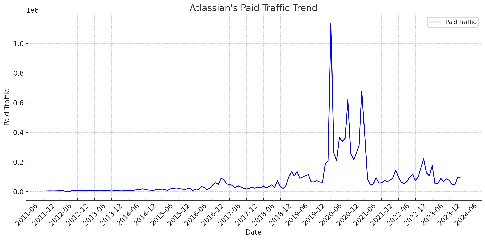

# Atlassian SEM Strategy Analysis (2024)

## Takeaways

- **SEM Trend**: From January 2012 to March 2024, Atlassian's paid traffic grew significantly, peaking in December 2020 with 471,348 average traffic but showed a decreasing trend by March 2024 with only 114,669 average traffic.
- **SEM Keyword Strategy**: By March 2024, Atlassian strategically balanced its keyword focus, achieving a notable traffic share of 35.54% from product-related keywords, with an average CPC of $5.85.
- **SEM URL Traffic Distribution**: As of March 2024, Atlassian's targeted URL strategy successfully directed 51.07% of its traffic to its main Jira product page, indicating a refined focus on product-specific engagements.

Note: The data used in this article is only for the desktop side in the US market. All data are taken from third-party platforms, this site does not guarantee the accuracy of the data.

The analysis of traffic trends for Atlassian's "Paid Traffic" over the specified phases is summarized in the table below. Each phase shows the average traffic and the observed trend:

| Phase               | Average Traffic | Trend      |
|---------------------|-----------------|------------|
| 2012-01 to 2020-06  | 44,667          | Increasing |
| 2020-06 to 2020-12  | 471,348         | Decreasing |
| 2020-12 to 2021-05  | 391,004         | Increasing |
| 2021-05 to 2024-03  | 114,669         | Decreasing |

- **From January 2012 to June 2020**: The average traffic was relatively low and showed an increasing trend.
- **From June 2020 to December 2020**: A significant rise in average traffic occurred, but the trend within this period was decreasing.
- **From December 2020 to May 2021**: Again, the traffic was high, and the trend reversed to increasing.
- **From May 2021 to March 2024**: The average traffic significantly dropped and continued to decrease over this period.

See more about [Atlassian's SEO strategy](https://chloevolution.com/posts/atlassian-seo-strategy-analysis).

## Atlassian's SEM Strategy in June 2020

### Paid Keyword Strategy:

| Keyword Topic     | Keyword Example                        | Traffic   | Traffic (%) | Average CPC |
|-------------------|----------------------------------------|-----------|-------------|-------------|
| Other             | spanish translator                     | 1,120,525 | 98.35%      | $3.41       |
| Product-Related   | confluence                             | 13,359    | 1.17%       | $2.49       |
| Feature-Related   | scrum                                  | 5,147     | 0.45%       | $3.39       |
| Competitor Brand  | asana tutorial                         | 188       | 0.02%       | $8.30       |
| Industry Term     | wordpress project management plugin    | 74        | 0.01%       | $3.34       |

**Explanation of Classification**:
- **Product-Related**: Directly mentions Atlassian products.
- **Competitor Brand**: References competitors' products.
- **Industry Term**: General terms associated with the industry.
- **Feature-Related**: Specific features or methodologies.
- **Other**: Keywords that don't fit the above categories, often broader or unrelated terms.

### URL Traffic Distribution:
The traffic is highly concentrated on a few URLs, mostly Atlassian's main site. Here are the top 5 URLs by traffic:

| URL                                         | Traffic   | Traffic (%) |
|---------------------------------------------|-----------|-------------|
| http://www.atlassian.com/                   | 1,127,545 | 98.97%      |
| http://marketplace.atlassian.com/           | 8,125     | 0.71%       |
| http://marketplace.atlassian.com/pi_planning| 670       | 0.06%       |
| http://www.atlassian.com/confluence         | 586       | 0.05%       |
| http://www.atlassian.com/jira               | 554       | 0.05%       |

### Summary of Atlassian's SEM Strategy:
- **High Traffic Concentration**: Atlassian's strategy is highly effective with a significant concentration of traffic directed towards their main website, indicative of strong brand awareness and targeted marketing.
- **Efficient Keyword Usage**: Most traffic is generated from a broad range of keywords under the "Other" category, suggesting a wide net of keyword targets that likely includes high-volume, generic terms.
- **Product Focus**: A smaller but notable portion of the traffic is targeted towards product-specific terms, ensuring visibility in searches directly related to their offerings.
- **Cost-Effective CPC**: The average CPC across different keyword topics shows a relatively cost-effective approach, especially given the high traffic volumes.

## Atlassian's SEM Strategy in December 2020

### Paid Keyword Strategy:
The keywords have been classified into topics using a MECE approach, ensuring no overlap between categories, with product names grouped under "Product-Related". Here’s the summarized data:

| Keyword Topic     | Keyword Example                       | Traffic   | Traffic (%) | Average CPC |
|-------------------|---------------------------------------|-----------|-------------|-------------|
| Other             | giraffe                               | 552,852   | 88.99%      | $5.81       |
| Competitor Brand  | github                                | 40,326    | 6.49%       | $1.96       |
| Product-Related   | jira                                  | 25,959    | 4.18%       | $2.10       |
| Feature-Related   | continuous integration                | 1,485     | 0.24%       | $6.29       |
| Industry Term     | what is agile project management      | 605       | 0.10%       | $6.85       |

**Classification Explanation**:
- **Product-Related**: Direct references to Atlassian products.
- **Competitor Brand**: Keywords that mention competitor brands directly, e.g. [ClickUp](https://chloevolution.com/posts/clickup-sem-strategy-analysis), [Asana](https://chloevolution.com/posts/asana-sem-strategy-analysis), [Wrike](https://chloevolution.com/posts/wrike-sem-strategy-analysis), [Notion](https://chloevolution.com/posts/notion-sem-strategy-analysis), [Monday.com](https://chloevolution.com/posts/monday-com-ads), etc.
- **Industry Term**: Keywords related to industry concepts and practices.
- **Feature-Related**: Keywords related to specific product features or functionalities.
- **Other**: Keywords that do not neatly fit the other categories, potentially more generic or indirect.

### URL Traffic Distribution:
Traffic is focused on specific product pages, reflecting targeted advertising strategies. Here are the top 5 URLs by traffic:

| URL                                                         | Traffic   | Traffic (%) |
|-------------------------------------------------------------|-----------|-------------|
| https://www.atlassian.com/software/jira                     | 231,077   | 37.20%      |
| https://www.atlassian.com/software/confluence               | 84,598    | 13.62%      |
| https://www.atlassian.com/software/jira/service-desk        | 56,997    | 9.17%       |
| https://www.atlassian.com/software/opsgenie/what-is-opsgenie| 51,870    | 8.35%       |
| https://www.atlassian.com/                                  | 48,667    | 7.83%       |

### Summary of Atlassian's SEM Strategy:
- **High Traffic Concentration on Few Keywords**: The "Other" category dominates traffic, indicating a broad targeting strategy perhaps focused on high-volume, generic terms.
- **Strategic Product Placement**: Significant traffic is directed towards specific product pages, like Jira and Confluence, highlighting a product-centric advertising approach.
- **Cost-Effective Spend on Competitor Keywords**: Investing in competitor brand keywords like "github" showcases a tactical approach to attract users searching for alternatives.
- **Diverse CPC Strategy**: The average CPC varies significantly among categories, reflecting strategic bidding based on keyword value and expected ROI.

## Atlassian's SEM Strategy in May 2021

### Paid Keyword Strategy:

| Keyword Topic     | Keyword Example                  | Traffic | Traffic (%) | Average CPC |
|-------------------|----------------------------------|---------|-------------|-------------|
| Other             | find my phone                    | 565,993 | 83.41%      | $3.98       |
| Competitor Brand  | github                           | 80,950  | 11.93%      | $3.12       |
| Product-Related   | jira                             | 29,049  | 4.28%       | $12.95      |
| Feature-Related   | agile scrum                      | 2,037   | 0.30%       | $4.20       |
| Industry Term     | project management software      | 564     | 0.08%       | $8.91       |

**Classification Explanation**:
- **Product-Related**: Direct references to Atlassian products like Jira.
- **Competitor Brand**: Keywords that mention competitor brands directly, like GitHub.
- **Industry Term**: Keywords related to industry concepts and practices.
- **Feature-Related**: Keywords related to specific product features or methodologies.
- **Other**: Keywords that do not neatly fit the other categories, potentially more generic or indirect.

### URL Traffic Distribution:
Traffic is focused on specific product and feature pages. Here are the top 5 URLs by traffic:

| URL                                                         | Traffic | Traffic (%) |
|-------------------------------------------------------------|---------|-------------|
| https://www.atlassian.com/software/opsgenie/what-is-opsgenie| 235,736 | 34.74%      |
| https://www.atlassian.com/software/jira                     | 201,078 | 29.63%      |
| https://www.atlassian.com/                                  | 42,679  | 6.29%       |
| https://www.atlassian.com/software/confluence               | 41,966  | 6.18%       |
| https://www.atlassian.com/bitbucket/vs-github               | 31,956  | 4.71%       |

### Summary of Atlassian's SEM Strategy:
- **High Traffic Concentration on Few Keywords**: A significant portion of traffic (83.41%) is captured by a broad category termed "Other", suggesting a strategy focused on capturing high-traffic, generic keywords.
- **Strategic Product and Competitor Targeting**: Notable traffic from both product-specific keywords and competitors’ brand names (like GitHub), indicating a dual focus on enhancing product visibility and capturing competitor searches.
- **Focused Landing Page Strategy**: The traffic is strategically directed towards specific product pages like OpsGenie, Jira, and Confluence, ensuring that potential customers land on relevant product information, enhancing the conversion potential.
- **Diverse CPC Management**: Varying CPC rates reflect a strategic approach to bidding based on expected traffic value and keyword competition.

## Analysis of Atlassian's SEM Strategy in March 2024

### Paid Keyword Strategy:

| Keyword Topic     | Keyword Example                  | Traffic | Traffic (%) | Average CPC |
|-------------------|----------------------------------|---------|-------------|-------------|
| Other             | pdf editor                       | 53,319  | 57.22%      | $5.54       |
| Product-Related   | jira                             | 33,115  | 35.54%      | $5.85       |
| Feature-Related   | kanban board                     | 4,391   | 4.71%       | $5.01       |
| Industry Term     | software development             | 2,074   | 2.23%       | $8.28       |
| Competitor Brand  | project management software monday| 287     | 0.31%       | $13.99      |

**Classification Explanation**:
- **Product-Related**: Direct references to Atlassian products like Jira.
- **Competitor Brand**: Keywords that mention competitor brands directly.
- **Industry Term**: Keywords related to industry concepts and practices.
- **Feature-Related**: Keywords related to specific product features or methodologies.
- **Other**: Keywords that do not neatly fit the other categories, potentially more generic or indirect.

### URL Traffic Distribution:
Traffic is focused on specific product pages. Here are the top 5 URLs by traffic:

| URL                                                         | Traffic | Traffic (%) |
|-------------------------------------------------------------|---------|-------------|
| https://www.atlassian.com/software/jira                     | 47,586  | 51.07%      |
| https://www.atlassian.com/software/confluence               | 25,593  | 27.46%      |
| https://www.atlassian.com/                                  | 12,867  | 13.81%      |
| https://www.atlassian.com/software/jira/service-desk        | 2,094   | 2.25%       |
| https://www.atlassian.com/software/jira/pricing             | 1,262   | 1.35%       |

### Summary of Atlassian's SEM Strategy:
- **High Traffic Concentration on Few Keywords**: The "Other" category still dominates the traffic, which might suggest a broad targeting strategy, potentially leveraging high-traffic, generic terms like "pdf editor."
- **Strategic Product Placement**: Significant traffic is directed towards product-specific URLs, particularly for Jira and Confluence, showing a clear focus on promoting key products.
- **High Traffic and High CPC for Competitor Brands**: Investing in competitor-related keywords such as "project management software monday" despite low traffic shows strategic intent to capture searches related to competitors, even at higher costs.
- **Focused CPC Management**: Average CPC varies based on the strategic value of keywords, with higher costs for competitor brand and industry terms, indicating a calculated investment based on keyword competitiveness and potential return.

## Summary

To analyze the similarities and differences in Atlassian's SEM strategy across the four time periods—June 2020, December 2020, May 2021, and March 2024—I'll summarize the key metrics and strategic elements from the data previously discussed for each period. Here are the points of comparison:

### Keyword Topic Distribution
The distribution of traffic across different keyword topics can indicate shifts in strategic focus:
- **June 2020** saw a significant portion of traffic from a broad category termed "Other," indicating a strategy that potentially included a wide range of generic keywords.
- **December 2020** similarly showed dominance of the "Other" category, but there was a noticeable presence of competitor brand keywords.
- **May 2021** continued the trend of "Other" dominating, yet with substantial allocation towards product-related keywords, reflecting a more product-focused strategy.
- **March 2024** saw a significant balance between product-related and other keywords, indicating a strategic shift towards more specific, product-focused advertising.

### Traffic and CPC
The management of traffic and cost-per-click (CPC) provides insights into efficiency and spending:
- **June 2020** had very high traffic concentration on a few URLs, particularly Atlassian's main website, with a diversified CPC among keywords.
- **December 2020** saw a similar trend in high traffic concentration with a more even distribution of CPC, indicating more strategic bidding.
- **May 2021** continued with high traffic concentration and saw the highest average CPC for product-related keywords, suggesting a strategic push for high-value keywords.
- **March 2024** demonstrated the highest diversity in keyword topic traffic distribution and showed a noticeable increase in CPC for competitor and industry terms, reflecting a competitive and mature market positioning.

### URL Traffic Distribution
Traffic concentration on URLs shows where Atlassian aimed to direct potential customers:
- **June 2020** had a significant focus on the main website.
- **December 2020** and **May 2021** showed increased traffic to specific product pages like Jira and Confluence, indicating a targeted approach.
- **March 2024** showed even further refinement in directing traffic to specific product and feature pages.

### Summary of Strategic Shifts
- **From 2020 to 2024**, Atlassian’s SEM strategy shows a gradual shift from using broad, high-traffic keywords to more targeted, product-specific keywords. This shift suggests a move towards maximizing product visibility and capturing more qualified leads.
- **CPC Trends** show increasing willingness to invest more in keywords as the strategy becomes more focused and competitive.
- **URL Focus** has shifted from general brand awareness on the main page to more targeted engagement on specific product pages, reflecting a more nuanced approach to customer acquisition.

