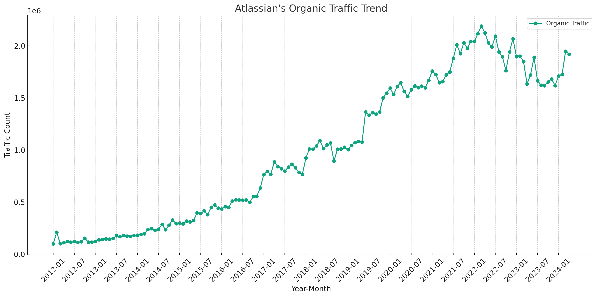

# Atlassian SEO Strategy Analysis (2024)

## Takeaways

- **SEO Trend Perspective**: 
  - Phase 1 (Jan 2012 - Mar 2022) showed an increasing trend in organic traffic.
  - Phase 2 (Mar 2022 - Dec 2023) displayed a decreasing trend in organic traffic.
  - Phase 3 (Dec 2023 - Mar 2024) again shows an increasing trend.

- **SEO Keyword Strategy Perspective**:
  - The brand keyword 'Atlassian' drives significant traffic, indicating strong brand recognition.
  - Traffic from competitor brand keywords is relatively low, suggesting limited competitive keyword targeting.

- **SEO URL Traffic Distribution Perspective**:
  - A major portion of traffic is associated with product-related searches, highlighting the SEO strategy’s focus on individual product visibility.
  - Opportunities exist in enhancing traffic for feature-related and help/support keywords to attract broader queries and support needs.

Note: The data used in this article is only for the desktop side in the US market. All data are taken from third-party platforms, this site does not guarantee the accuracy of the data.

Analysis of traffic trends for Atlassian's "Organic Traffic" over the specified phases is organized in the table below, showing each phase, the average traffic, and the observed trend:

| Phase                        | Average Traffic  | Trend      |
|------------------------------|------------------|------------|
| Phase 1 (2012-01 to 2022-03) | 825,655.6        | Increasing |
| Phase 2 (2022-03 to 2023-12) | 1,853,268        | Decreasing |
| Phase 3 (2023-12 to 2024-03) | 1,749,966        | Increasing |

- **Phase 1** started from January 2012, the first month with non-zero data, and shows an increasing trend through March 2022.
- **Phase 2** continues from March 2022 to December 2023 with a decreasing trend.
- **Phase 3** from December 2023 to March 2024 again shows an increasing trend.

See more about [Atlassian's SEM strategy](https://chloevolution.com/posts/atlassian-sem-strategy-analysis).

## Atlassian's SEO Strategy in March 2022
### Organic Keyword Analysis

| Keyword Topic      | Keyword Example           | Traffic   | Traffic (%) |
|--------------------|---------------------------|-----------|-------------|
| Brand-related      | atlassian                 | 1,068,793 | 51.63%      |
| Product-related    | jira                      | 959,888   | 46.37%      |
| Feature-related    | agile project management  | 12,825    | 0.62%       |
| Help & Support     | atlassian support         | 12,160    | 0.59%       |
| Industry-specific  | bamboo software           | 10,656    | 0.51%       |
| Competitor brand   | tagging github            | 5,726     | 0.28%       |

**Classification Rules:**
- **Brand-related**: Keywords directly related to the company's brand name.
- **Product-related**: Keywords specifically associated with Atlassian's products.
- **Competitor brand**: Keywords pertaining to competitors' brand names, e.g. [ClickUp](https://chloevolution.com/posts/clickup-seo-strategy-analysis), [Asana](https://chloevolution.com/posts/asana-seo-strategy-analysis), [Wrike](https://chloevolution.com/posts/wrike-seo-strategy-analysis), [Notion](https://chloevolution.com/posts/notion-seo-strategy-analysis), [Monday.com](https://chloevolution.com/posts/monday-com-seo-strategy-analysis), etc.
- **Feature-related**: Keywords associated with features of products.
- **Industry-specific**: Keywords relating to the broader industry or sector.
- **Help & Support**: Keywords related to user support and guides.

### URL Traffic Distribution

| URL                                                     | Traffic | Traffic (%) |
|---------------------------------------------------------|---------|-------------|
| [https://www.atlassian.com/](https://www.atlassian.com/) | 95,322  | 4.60%       |
| [https://www.atlassian.com/software/jira](https://www.atlassian.com/software/jira) | 95,243  | 4.60%       |
| [https://www.atlassian.com/software/confluence](https://www.atlassian.com/software/confluence) | 65,542  | 3.17%       |
| [https://www.atlassian.com/blog/productivity/how-to-write-effective-meeting-minutes](https://www.atlassian.com/blog/productivity/how-to-write-effective-meeting-minutes) | 62,285  | 3.01%       |
| [https://id.atlassian.com/](https://id.atlassian.com/)   | 52,816  | 2.55%       |

### Summary of Atlassian's SEO Strategy

- **Strong Brand Focus**: Significant traffic is drawn by the brand keyword 'atlassian', indicating robust brand recognition and targeted search interest.
- **Product-Centric SEO**: A major portion of traffic is associated with product-related searches, emphasizing the SEO strategy’s alignment with promoting individual product visibility and utility.
- **Diverse Content Strategy**: Top URLs include both product pages and content-rich articles, suggesting a strategy that balances direct product promotion with value-driven content aimed at engagement.
- **Limited Competitor Focus**: Relatively low traffic from competitor brand keywords, indicating either limited competitive keyword targeting or lesser comparative search volume for these terms.
- **Expansion Opportunities**: Limited emphasis on feature-related and industry-specific terms, which could be areas for growth in attracting a more diversified search audience.

## Atlassian's SEO Strategy in December 2023
### Organic Keyword Analysis

| Keyword Topic      | Keyword Example        | Traffic  | Traffic (%) |
|--------------------|------------------------|----------|-------------|
| Other              | smart goals            | 828,559  | 53.15%      |
| Product-related    | jira                   | 539,957  | 34.64%      |
| Brand-related      | atlassian              | 159,521  | 10.23%      |
| Feature-related    | version control        | 15,301   | 0.98%       |
| Industry-specific  | bamboo software        | 9,310    | 0.60%       |
| Help & Support     | it management support  | 4,352    | 0.28%       |
| Competitor brand   | monday meme            | 1,872    | 0.12%       |

**Classification Rules:**
- **Brand-related**: Includes direct mentions of "atlassian" and terms closely associated with the company's brand identity.
- **Product-related**: Keywords directly linked to specific products like Jira, Confluence, etc.
- **Competitor brand**: Pertains to competitors' brands or products, "monday meme", "[smartsheet](https://chloevolution.com/posts/smartsheet-seo-strategy-analysis)", etc.
- **Feature-related**: Related to specific features or functionalities within Atlassian’s product lineup.
- **Industry-specific**: Keywords related to the broader software and technology industry.
- **Help & Support**: Terms related to support and guides for users.

### URL Traffic Distribution

| URL                                                     | Traffic | Traffic (%) |
|---------------------------------------------------------|---------|-------------|
| [https://www.atlassian.com/blog/productivity/how-to-set-smart-goals](https://www.atlassian.com/blog/productivity/how-to-set-smart-goals) | 93,690  | 6.01%       |
| [https://www.atlassian.com/software/jira](https://www.atlassian.com/software/jira) | 89,374  | 5.73%       |
| [https://www.atlassian.com/](https://www.atlassian.com/) | 65,522  | 4.20%       |
| [https://id.atlassian.com/](https://id.atlassian.com/)   | 44,358  | 2.85%       |
| [https://www.atlassian.com/software/confluence](https://www.atlassian.com/software/confluence) | 33,676  | 2.16%       |

### Summary of Atlassian's SEO Strategy

- **Strong Brand Visibility**: Atlassian maintains robust visibility with a significant portion of traffic directed towards brand-related keywords, reflecting strong brand authority in the search landscape.
- **Product Focus**: A considerable focus on product-specific keywords highlights Atlassian’s strategic effort to optimize search presence around key products like Jira and Confluence.
- **Selective Competitor Engagement**: Minimal traffic from competitor brand keywords indicates a selective or limited approach to direct competitor comparison in SEO tactics.
- **Opportunities in Features and Support**: Lower traffic for feature-related and help/support keywords suggests potential areas for enhancing content and SEO strategies to attract broader queries and support needs.

