# 14 Best Mind Mapping Software for Mac in 2024 (Features, Pros, Cons, Pricing)

The capacity to efficiently organize ideas, thoughts, and tasks is more important than ever in today's fast-paced and increasingly complicated work contexts. With its visual and user-friendly approach to brainstorming, planning, and collaboration, mind mapping applications have become indispensable tools for professionals in a wide range of industries.

There is a mind mapping tool designed specifically for your needs and workflows, whether you operate as a project manager managing complex initiatives, a software developer designing fresh solutions, an educator molding young minds, or a creative professional realizing creative ideas.

This article explores the top mind mapping apps for Mac users, offering specialized suggestions for various positions to help boost output and foster innovation in the workplace.

## The best mind mapping software for Mac for 2024 at a glance

<table>
    <tr>
        <td></td>
        <td>Free trial time</td>
        <td>Pricing</td>
        <td>Supported platform</td>
        <td>Integration</td>
        <td>AI feature</td>
   </tr>
    <tr>
        <td>MindNode</td>
        <td>free forever (Free version)</td>
        <td>Start from $2.99/month</td>
        <td>Mac, iOS</td>
        <td>❌</td>
        <td>❌</td>
   </tr>
    <tr>
        <td>ClickUp</td>
        <td>free forever (Free version)</td>
        <td>Start from $7/month</td>
        <td>Web, Windows, Mac, iOS, Android</td>
        <td>✅</td>
        <td>✅</td>
   </tr>
    <tr>
        <td>Zenkit</td>
        <td>free forever (Free version)</td>
        <td>Start from $9/month</td>
        <td>Web, iOS, Android</td>
        <td>✅</td>
        <td>❌</td>
   </tr>
    <tr>
        <td>SimpleMind</td>
        <td>free forever (Free version)</td>
        <td>Start from $27.49/user</td>
        <td>Windows, Mac, iOS, Android</td>
        <td>❌</td>
        <td>❌</td>
   </tr>
    <tr>
        <td>Xmind</td>
        <td>free forever (Free version)</td>
        <td>Start from $4.99/month</td>
        <td>Windows, Mac, iOS, Android</td>
        <td>❌</td>
        <td>✅</td>
   </tr>
    <tr>
        <td>Coggle</td>
        <td>free forever (Free version)</td>
        <td>Start from $5/month</td>
        <td>Windows, Mac, iOS, Android</td>
        <td>❌</td>
        <td>❌</td>
   </tr>
    <tr>
        <td>MindManager</td>
        <td>30 days</td>
        <td>Start from $99/year</td>
        <td>Windows, Mac</td>
        <td>❌</td>
        <td>❌</td>
   </tr>
    <tr>
        <td>Mindomo</td>
        <td>free forever (Free version)</td>
        <td>Start from $5.5/monthl</td>
        <td>Windows, Mac, iOS, Android</td>
        <td>✅</td>
        <td>❌</td>
   </tr>
    <tr>
        <td>Visio</td>
        <td>no (requires a Microsoft 365 subscription)</td>
        <td>Start from $5/month per user</td>
        <td>Windows, Mac</td>
        <td>✅</td>
        <td>❌</td>
   </tr>
    <tr>
        <td>Miro</td>
        <td>free forever (Free version)</td>
        <td>Start from $8/month</td>
        <td>Web, Windows, Mac, iOS, Android</td>
        <td>✅</td>
        <td>❌</td>
   </tr>
    <tr>
        <td>Creately</td>
        <td>free forever (Free version)</td>
        <td>Start from $5/month</td>
        <td>Web, Windows, Mac, iOS, Android</td>
        <td>✅</td>
        <td>✅</td>
   </tr>
    <tr>
        <td>Lucidspark</td>
        <td>free forever (Free version)</td>
        <td>Start from $7.95</td>
        <td>Web, Windows, Mac, iOS, Android</td>
        <td>✅</td>
        <td>✅</td>
   </tr>
    <tr>
        <td>Ayoa</td>
        <td>free forever (Free version)</td>
        <td>Start from $10/month</td>
        <td>Web, Windows, Mac, iOS, Android</td>
        <td>✅</td>
        <td>❌</td>
   </tr>
    <tr>
        <td>Whimsical</td>
        <td>free forever (Free version)</td>
        <td>Start from $10/month</td>
        <td>Web, Windows, Mac, iOS, Android</td>
        <td>❌</td>
        <td>❌</td>
   </tr>
</table>

### 1. MindNode

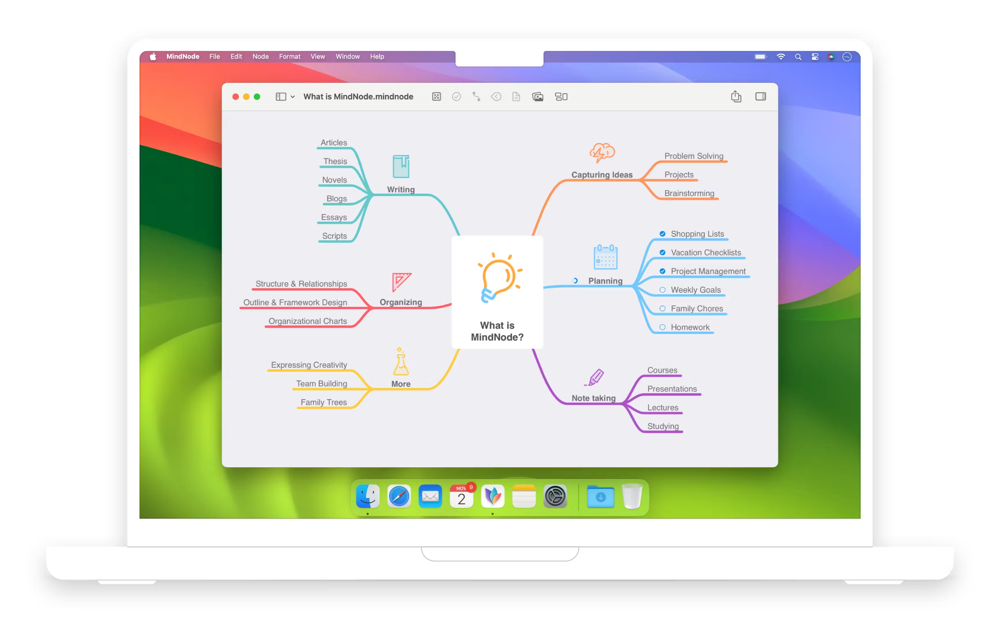

Known for its delightful brainstorming capabilities, [MindNode](https://www.mindnode.com/) offers a clear and intuitive way to capture thoughts and ideas on Mac and iOS devices.

**Key Features:**
- Intuitive Interface: MindNode features a clean, user-friendly design that makes it easy to start mapping your thoughts.
- iCloud Integration: Seamless syncing across all your devices using iCloud.
- Visual Tags: Enhance your mind maps with visual tags to categorize and prioritize ideas.
- Focus Mode: Helps you concentrate on one part of your mind map at a time.

**Pros:**
- Very user-friendly, making it accessible for beginners.
- High-quality export options.

**Cons:**
- May lack some advanced features desired by power users.
- Primarily designed for Apple ecosystem users.

**Integration:**
- Works seamlessly with other Apple apps and services.
- Offers integration with Things, OmniFocus, and the Reminders app for task management.

**Pricing:**
- Offers a free version with basic features.
- Paid plans start from $2.49 per month (billed annually).

### 2. ClickUp

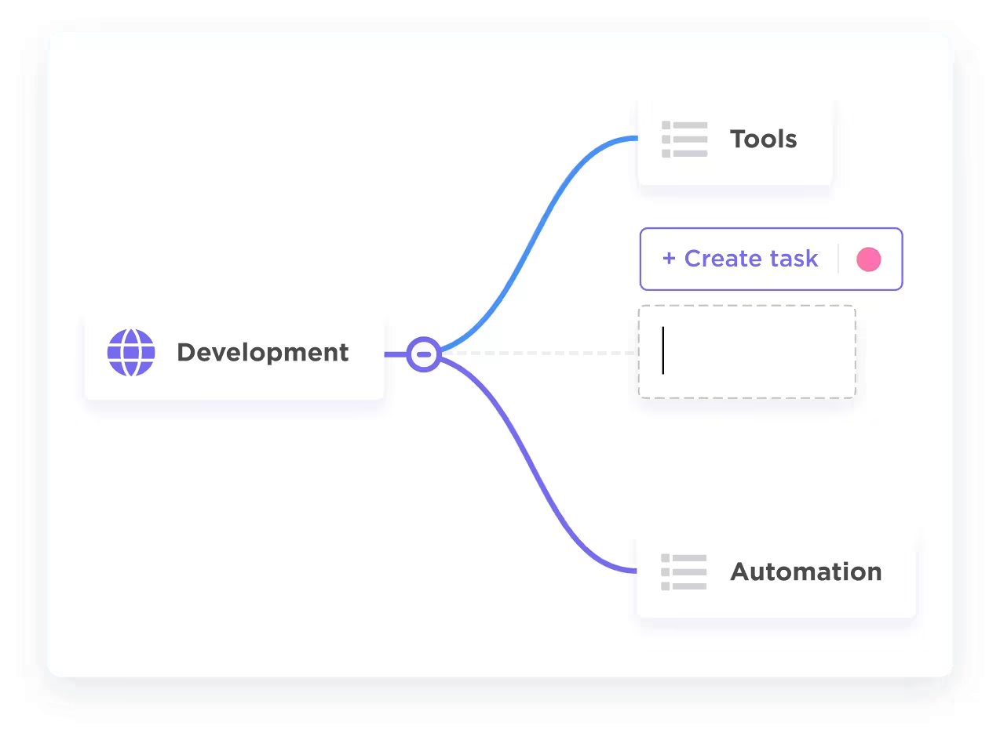

[ClickUp](https://clickup.com/features/mind-maps) is not just a project management tool but also offers robust mind mapping features suitable for Mac users looking to organize their thoughts and projects.

**Key Features:**
- Versatile Project Management: Includes tasks, docs, goals, and more along with mind mapping.
- Mind Map View: Transform tasks into mind maps with ease.
- Collaboration Tools: Real-time editing, comments, and sharing options.
- Customizable: Highly customizable to fit various workflows and projects.

**Pros:**
- All-in-one tool for project management and mind mapping.
- Extensive customization and integration options.

**Cons:**
- The wide array of features may overwhelm new users.
- Some users report a steep learning curve.

**Integration:**
- Integrates with over 1,000 tools including Slack, Google Drive, and GitHub.

**Pricing:**
- Offers a generous free forever plan.
- Paid plans start at $5 per user/month.

### 3. Zenkit

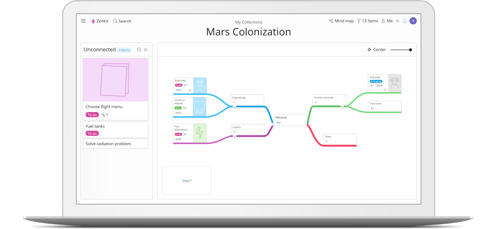

[Zenkit](https://zenkit.com/en/projects/solutions/mind-map/) provides a versatile set of tools including mind mapping, making it a good choice for those who appreciate having all their organizational tools in one place.
**Key Features:**
- Unified Workspace: Offers task management, mind mapping, databases, and more in one place.
- Flexible Mind Maps: Create and customize mind maps to visualize ideas.
- Team Collaboration: Share mind maps and collaborate in real-time.
- Multiple Views: Switch between mind map, kanban, list, table, and calendar views.

**Pros:**
- Versatile platform for managing all aspects of a project.
- Easy switching between different organizational views.

**Cons:**
- May be more than needed for users looking for just a mind mapping tool.
- The variety of features can be overwhelming at first.

**Integration:**
- Integrates with popular tools like Google Drive, Dropbox, and Zapier.

**Pricing:**
- Free plan available with basic features.
- Paid plans start at $9 per user/month.

### 4. SimpleMind

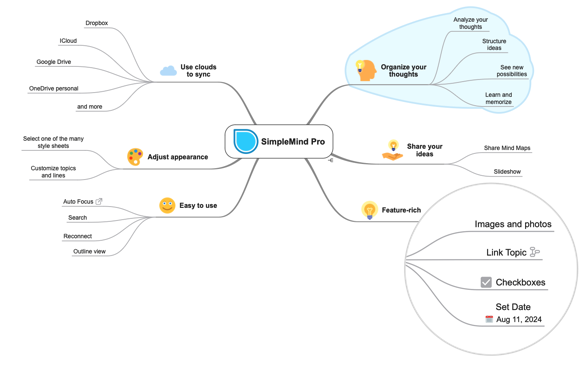

[SimpleMind](https://simplemind.eu/) offers a beautiful, intuitive app for mind mapping that helps users organize thoughts, remember information, and generate new ideas.
**Key Features:**
- Cross-Platform: Available on Mac, Windows, iOS, and Android.
- Unlimited Mind Maps: Create as many mind maps as you need without restrictions.
- Customizable Layouts: Adjust the style, colors, and fonts of your mind maps.
- Media Attachments: Add images, videos, and links to your mind maps.

**Pros:**
- Simple, no-frills interface focused on mind mapping.
- One-time purchase option available.

**Cons:**
- Lacks some advanced features found in other software.
- Limited collaboration features compared to competitors.

**Integration:**
- Limited integration capabilities, focused on standalone functionality.

**Pricing:**
- Offers a free trial.
- Full version is a one-time purchase starting at $24.99.

### 5. Xmind

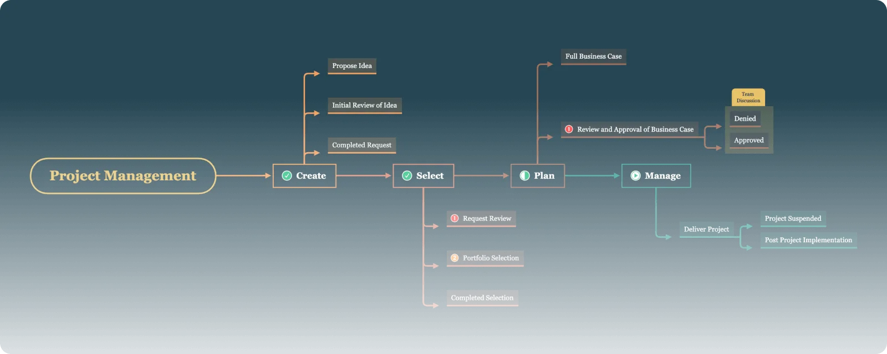

[Xmind](https://xmind.app/) is a popular choice among Mac users for its powerful features and flexibility in creating complex mind maps.
**Key Features:**
- Rich Diagram Types: Beyond mind maps, create fishbone diagrams, timelines, and more.
- Brainstorming Mode: A special mode to facilitate idea generation.
- Themes and Structures: Customize your mind maps with various themes and structures.
- Cloud Syncing: Sync your maps across devices with Xmind Cloud.

**Pros:**
- Supports complex diagrams beyond traditional mind maps.
- Cross-platform with support for Mac, Windows, iOS, and Android.

**Cons::** 
- Some users find the interface less intuitive than competitors.
- Subscription model might not appeal to all users.

**Integration:**
- Limited direct integration, focuses on exporting to various file formats for use in other applications.

**Pricing:**
- Free version available with limited features.
- Paid subscription starts at $59.99/year.

### 6. Coggle

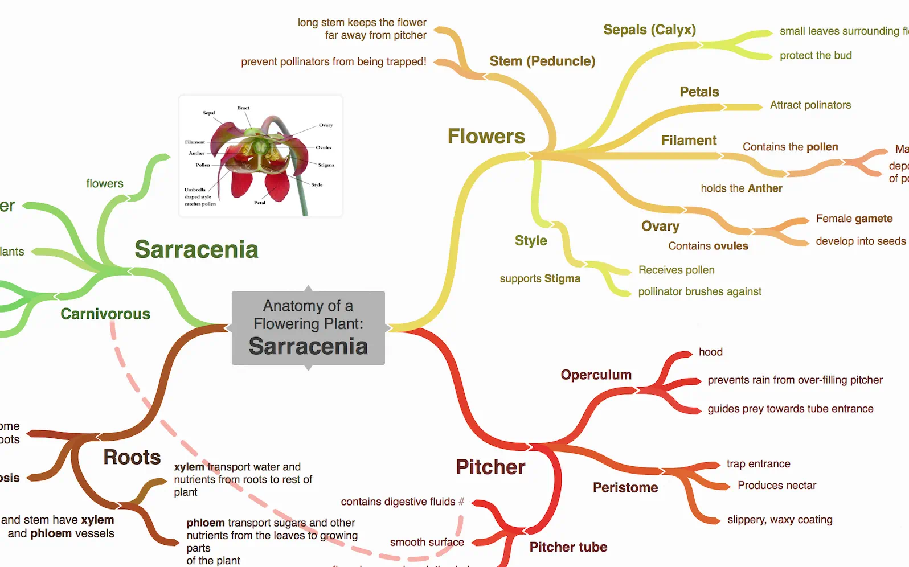

[Coggle](https://coggle.it/) is an online mind mapping tool that's simple yet powerful, offering real-time collaboration features.
**Key Features:**
- Real-Time Collaboration: Work simultaneously with team members on the same mind map.
- Unlimited Mind Maps: Create as many mind maps as you need with the paid plans.
- Branch Looping and Merging: Unique feature that allows for more complex diagramming.
- Colorful and Intuitive Interface: Makes it easy to differentiate between ideas and organize thoughts.

**Pros:**
- Very user-friendly, suitable for beginners and professionals alike.
- Strong collaboration features make it ideal for team projects.

**Cons:**
- The free version is somewhat limited in features compared to paid versions.
- Lacks some advanced customization options available in other tools.

**Integration:**
- Integrates with Google Drive for easy storage and management of mind maps.

**Pricing:**
- Offers a basic free version.
- Paid plans start at $5 per month.

### 7. MindManager

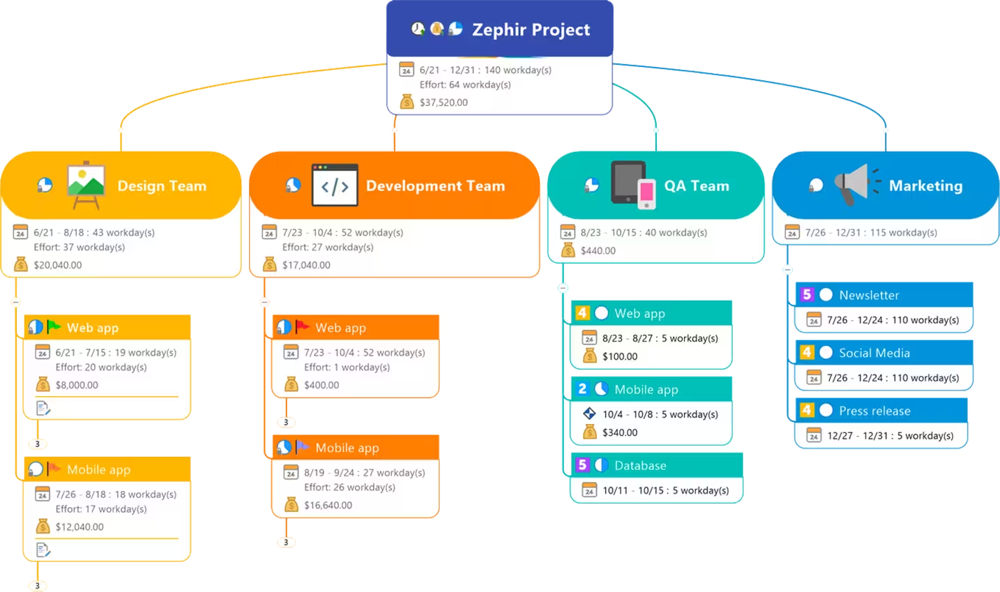

[MindManager](https://www.mindmanager.com/en/) is known for its comprehensive features that go beyond basic mind mapping to include project management and planning tools.
**Key Features:**
- Comprehensive Project Management Tools: Beyond mind mapping, it includes Gantt charts, flowcharts, timelines, and more.
- Information Management: Organize links, notes, files, and documents in one place.
- Brainstorming Mode: Facilitates idea generation and organization.
- Integration with Microsoft Office: Seamless workflow with Word, PowerPoint, Outlook, and Excel.

**Pros:**
- Robust toolset for detailed project planning and management.
- Highly customizable for various business needs.

**Cons:**
- Steeper learning curve due to its extensive features.
- Price point may be higher than other mind mapping tools.

**Integration:**
- Extensive integration with Microsoft Office suite.
- Supports exporting to PDF, HTML, image formats, and more.

**Pricing:**
- Free trial for 30 days.
- Pricing starts at $349 for a perpetual license.

### 8. Mindomo

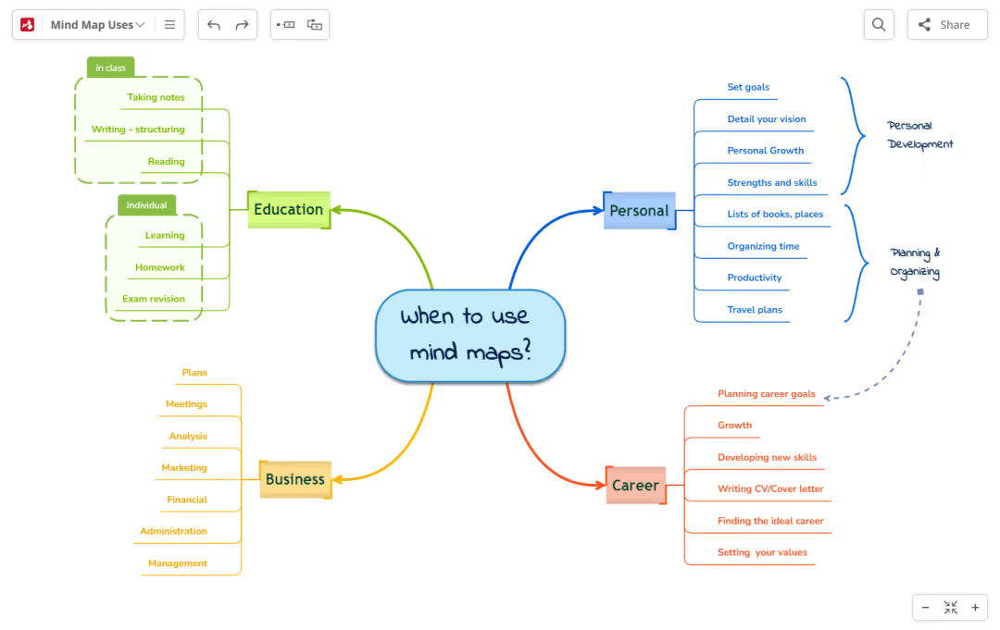

[Mindomo](https://www.mindomo.com/) offers a flexible mind mapping tool that is both user-friendly and capable of creating complex diagrams.
**Key Features:**
- Flexible Diagramming: Create mind maps, concept maps, outlines, and Gantt charts.
- Offline Mode: Work on your mind maps even without an internet connection.
- Assignment Feature: Makes it easy to use in educational settings for assignments and group projects.
- Presentation Mode: Turn your mind map into a slideshow presentation.

**Pros:**
- Versatile tool suitable for education, business, and personal use.
- User-friendly interface with drag-and-drop functionality.

**Cons:**
- Some advanced features are only available in the premium versions.
- Offline mode is only available on desktop apps.

**Integration:**
- Integrates with Google Drive, Dropbox, and FTP for cloud storage.
- Supports importing from and exporting to various file formats.

**Pricing:**
- Free version available with basic features.
- Paid plans start at $6 per month (billed annually).

### 9. Visio

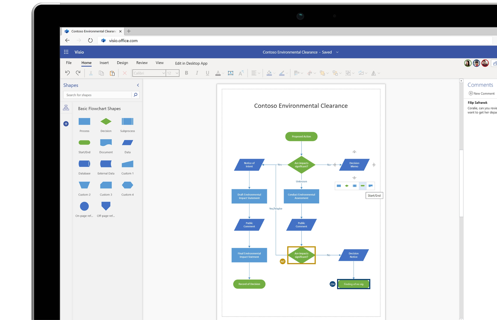

While traditionally associated with Windows, [Visio](https://www.microsoft.com/en/microsoft-365/visio/flowchart-software?rtc=1?rtc=1) offers mind mapping capabilities that can be accessed by Mac users through various means.
**Key Features:**
- Advanced Diagramming: Offers a wide range of diagram types including flowcharts, org charts, floor plans, and more.
- Collaboration: Allows multiple users to work on a document simultaneously (with a Microsoft 365 subscription).
- Data Linking: Connect diagrams to live data from internal and external sources.
- Detailed Customization: Extensive shape and template libraries tailored for professional use.

**Pros:**
- Powerful tool for detailed and complex diagramming.
- Strong integration with Microsoft ecosystem.

**Cons:**
- Primarily a Windows application; Mac users need to use it through a web app or Windows emulation.
- Can be expensive for individual users or small teams.

**Integration:**
- Deep integration with other Microsoft products and services.
- Supports data linking with SQL databases, Excel files, and SharePoint lists.

**Pricing:**
- No free version; requires a Microsoft 365 subscription starting at $5/user/month.
- Standalone licenses start at $280 for Visio Standard.

### 10. Miro

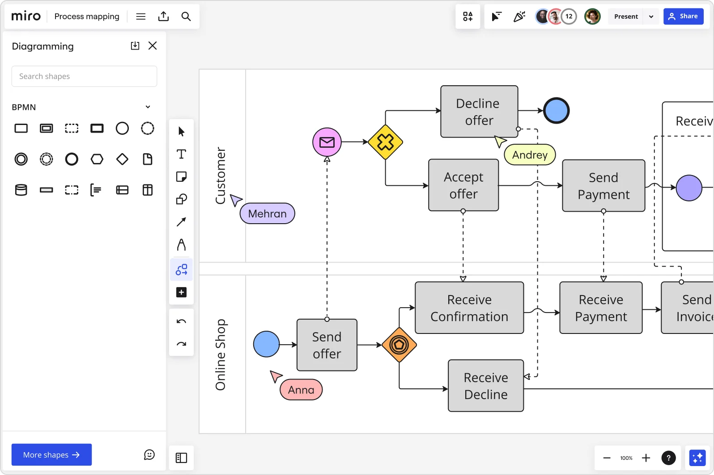

[Miro](https://miro.com/) is a collaborative whiteboarding platform that includes mind mapping among its array of visual collaboration tools.
**Key Features:**
- Collaborative Whiteboarding: Offers an infinite canvas for mind mapping, brainstorming, and project planning.
- Templates: Access to a wide range of templates for different use cases.
- Integration: Works with popular apps like Slack, Google Suite, Jira, and more.
- Interactive Widgets: Includes polls, timers, and voting for interactive sessions.

**Pros:**
- Highly collaborative platform suitable for remote teams.
- User-friendly interface with a gentle learning curve.

**Cons:**
- Some advanced features require premium subscriptions.
- Performance can lag with very large boards and numerous collaborators.

**Integration:**
- Strong integration capabilities with tools like Asana, Microsoft Teams, and Trello.
- API access for custom integrations in paid plans.

**Pricing:**
- Offers a free plan with basic features.
- Paid plans start at $8 per member/month.

### 11. Creately

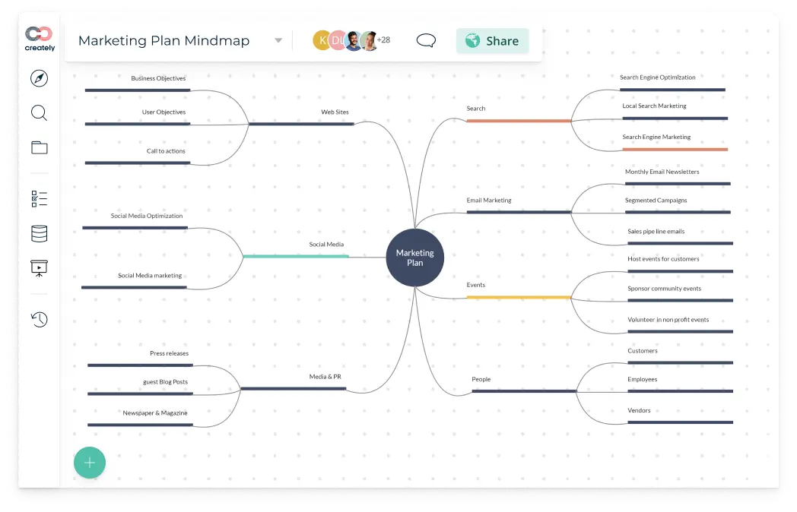

[Creately](https://creately.com/) is a diagram and flowchart software with strong mind mapping capabilities, suitable for Mac users.
**Key Features:**
- Diverse Diagramming Tools: Offers tools for creating flowcharts, mind maps, UML diagrams, and more.
- Real-Time Collaboration: Enables teams to work together on diagrams in real time.
- Pre-made Templates: A wide selection of templates to get started quickly.
- In-App Video Conferencing: Allows for discussion and collaboration without leaving the app.

**Pros:**
- Versatile tool suitable for various diagramming needs beyond mind mapping.
- Intuitive interface makes it easy to use for beginners.

**Cons:**
- The abundance of features can be overwhelming for users who need simple mind mapping.
- Some users report occasional lag with complex diagrams.

**Integration:**
- Integrates with Google Drive, Slack, Confluence, and more for seamless workflow.

**Pricing:**
- Free plan available with basic features.
- Paid plans start at $6 per month per user.

### 12. Lucidspark

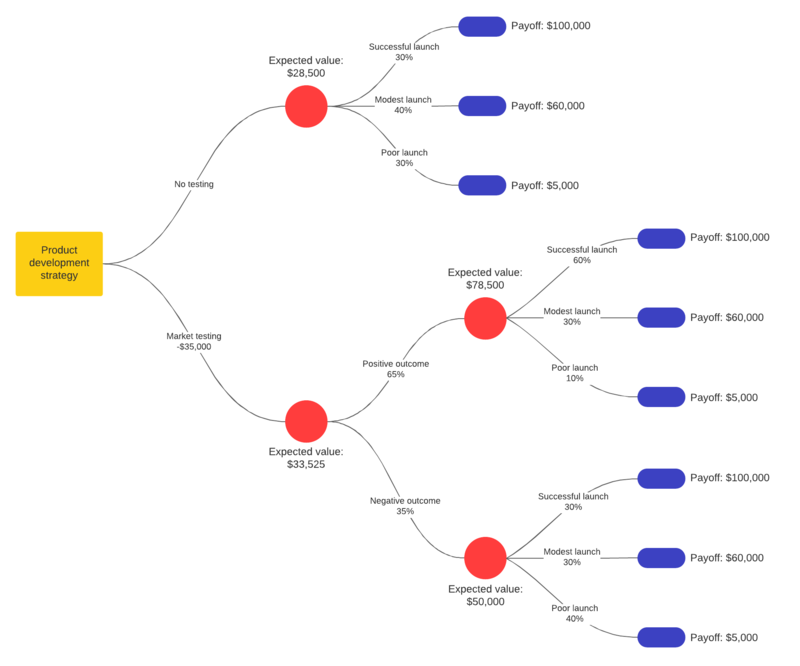

[Lucidspark](https://lucidspark.com/) is a browser-based virtual whiteboard where teams can bring their best ideas to light, including mind mapping.
**Key Features:**
- Infinite Canvas: Provides an expansive workspace for brainstorming and organizing ideas.
- Collaborative Features: Team members can comment, chat, and react to ideas in real time.
- Integration with Lucidchart: Allows for easy transition from brainstorming to formalizing diagrams.
- Voting and Timer Tools: Facilitate focused brainstorming sessions and decision-making.

**Pros:**
- Highly collaborative, making it ideal for remote and distributed teams.
- User-friendly with a minimal learning curve.

**Cons:**
- Some advanced features are locked behind higher subscription tiers.
- Can become expensive for larger teams.

**Integration:**
- Offers integration with Slack, Microsoft Teams, Google Drive, and more.
- Lucidchart integration enhances diagramming capabilities.

**Pricing:**
- Offers a basic free version.
- Paid plans start at $7.95 per user/month.

### 13. Ayoa

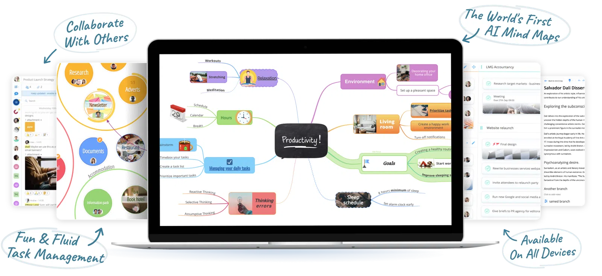

[Ayoa](https://www.ayoa.com/) combines mind mapping with task management features, offering a unique approach to organizing thoughts and projects.
**Key Features:**
- Integrated Mind Mapping and Task Management: Unique blend of visual brainstorming and project tracking.
- AI Idea Generation: Uses artificial intelligence to help generate new ideas.
- Public Mind Maps: Ability to share mind maps publicly for broader collaboration.
- Whiteboard Functionality: Combines the flexibility of mind mapping with the organization of traditional task boards.

**Pros:**
- Combines creativity with productivity, making it a comprehensive tool for project management.
- Encourages collaboration with team members and external stakeholders.

**Cons:**
- The variety of features might make it less intuitive for users looking for a straightforward mind mapping tool.
- Pricing can be a bit steep for small teams or individual users.

**Integration:**
- Integrates with Google Calendar, Evernote, and Dropbox.
- Offers API for custom integrations.

**Pricing:**
- Offers a free version with limited features.
- Paid plans start at $10 per user/month.

### 14. Whimsical

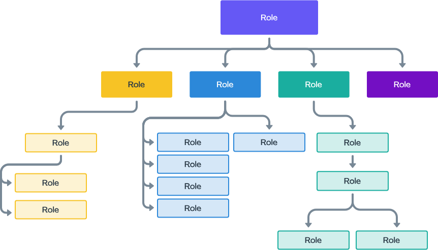

[Whimsical](https://whimsical.com/) offers a suite of collaboration tools, including mind maps, designed for fast and efficient idea generation.
**Key Features:**
- Clean Interface: Designed for quick idea capture and organization.
- Collaboration Tools: Real-time collaboration, commenting, and document sharing.
- Comprehensive Toolset: Includes mind maps, wireframes, sticky notes, and flowcharts.
- Keyboard Shortcuts: Extensive shortcuts for efficient navigation and editing.

**Pros:**
- All-in-one platform for various aspects of project planning and design.
- Very fast and responsive, even with complex diagrams.

**Cons:**
- Limited customization options for mind maps compared to dedicated mind mapping tools.
- Lacks some advanced collaboration features found in competitors.

**Integration:**
- Basic integration with Slack for notifications.
- Primarily standalone with focus on simplicity and speed.

**Pricing:**
- Free plan available for up to 4 projects.
- Paid plans start at $10 per user/month.

## Recommended mind mapping tool for different people

### For Project Managers: MindManager

MindManager's comprehensive feature set goes beyond basic mind mapping to include project management and planning tools. It offers Gantt charts, timelines, and integration with Microsoft Office, making it an excellent choice for project managers who need to oversee complex projects and communicate plans effectively.

### For Software Developers: Lucidspark

Lucidspark's browser-based platform and its integration with Lucidchart make it a great tool for software developers. The collaborative features facilitate brainstorming and planning software architecture with team members in real-time. Its infinite canvas and integration capabilities support complex system designs and workflow diagrams.

### For Educators and Students: Mindomo

Mindomo offers a blend of simplicity and functionality with features like assignment tracking, an intuitive interface, and educational templates. Its flexibility in creating mind maps, concept maps, and outlines makes it suitable for educational purposes, facilitating both teaching and learning processes.

### For Creative Professionals: Miro

Miro's collaborative whiteboarding platform is ideal for creative professionals, offering an infinite canvas that supports freeform idea generation, design thinking sessions, and visual brainstorming. Its extensive template library and interactive widgets encourage creativity and collaboration among team members.

### For Business Analysts: Visio

Although not exclusively a mind mapping tool, Visio's advanced diagramming capabilities make it suitable for business analysts. Its ability to link diagrams to live data and its comprehensive shape libraries support detailed process mapping, organizational charts, and data visualization, crucial for business analysis.

### For Freelancers and Solopreneurs: SimpleMind

**Why**: SimpleMind's straightforward and no-frills approach to mind mapping makes it an excellent choice for freelancers and solopreneurs who need a reliable tool for organizing thoughts and ideas. Its cross-platform compatibility ensures they can work on their projects whether they're at their desk or on the go.

### For Startup Teams: Coggle

Coggle's simplicity, combined with powerful real-time collaboration features, makes it well-suited for startup teams. The ability to create unlimited mind maps and share them publicly or privately facilitates the fast-paced, iterative brainstorming process typical in startups.

### For Design Teams: Whimsical

Whimsical stands out for design teams due to its clean interface and comprehensive suite of collaboration tools, including mind maps, wireframes, and flowcharts. Its emphasis on fast and efficient idea generation and the ability to create visually appealing designs make it a favorite among designers.

