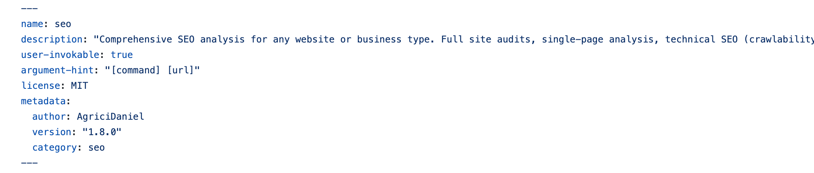
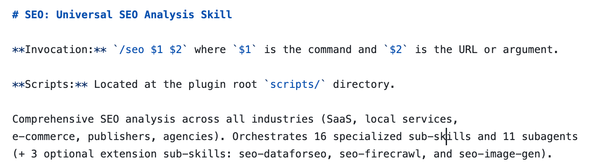
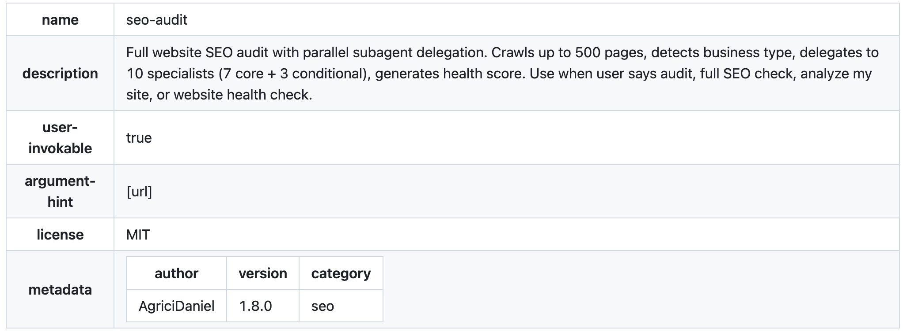

# From “Chatbox” to “Workflow”: Deconstructing Claude Code SEO Skills


Have you ever tried typing “please help me optimize this title” into the web versions of ChatGPT or Claude for SEO purposes? In that mode, AI is merely an **“advanced copywriting assistant”**—limited by outdated training data and completely unaware of your website’s real technical details.

With the emergence of **Claude Code** and its **Skills system**, AI is no longer just sitting on the other side of the screen chatting with you. It now effectively “lives” in your terminal, picks up crawling tools, and begins auditing your code like a seasoned SEO expert.

This article analyzes one of the most comprehensive SEO skill libraries currently on GitHub:
[https://github.com/AgriciDaniel/claude-seo](https://github.com/AgriciDaniel/claude-seo)
This architecture transforms Claude from a hallucination-prone “tool” into an autonomous **SEO agent** capable of independent decision-making.

## What Are Claude Code SEO Skills?

Before diving deeper, it’s important to understand the positioning of SEO Skills within the Claude Code ecosystem.

**Claude Code SEO Skills are a specialized toolkit for SEO built on top of the Claude Code Skills system.** If general-purpose Skills are about “teaching AI how to execute standardized workflows,” then SEO Skills are about **“packaging an SEO expert’s diagnostic logic into reusable instruction sets.”**

Taking the `AgriciDaniel/claude-seo` project as an example, it demonstrates several defining characteristics of professional-grade SEO Skills:

**1. Hardcoded domain expertise**

* Built-in support for the latest Google algorithm guidelines (e.g., the September 2025 QRG update)
* Enforces industry best practices through `Quality Gates`
* Example: explicitly marking “HowTo Schema is deprecated” to prevent outdated recommendations

**2. Deep toolchain integration**

* Connects to professional crawlers like Firecrawl and DataForSEO via the MCP protocol
* Enables real-time HTML crawling and accurate search volume queries
* Instead of relying on “internet snapshots from two years ago” in training data

**3. Multi-agent collaborative architecture**

* Breaks down complex audits across 12+ specialized sub-agents (e.g., `seo-technical` for technical diagnostics, `seo-content` for content strategy)
* Uses parallel execution: while a technical agent checks `robots.txt`, a content agent evaluates E-E-A-T signals
* Final output is aggregated into a unified report by a central controller

**4. Quantitative evaluation system**

* Outputs standardized SEO health scores (0–100)
* Classifies recommendations into four priority levels: Critical (immediate action) to Low (backlog)
* Provides a trackable, prioritized action list

This design upgrades AI from a “chatbot that answers SEO questions” into an **expert system capable of executing full SEO audits**. Next, let’s break down how this system works technically.

## Decoupled Architecture of Claude Code SEO Skills

Before analyzing the architecture, we need to clarify what SEO tasks this system can automate:

**Technical layer:**

* Crawlability checks (robots.txt, sitemap.xml validation)
* Core Web Vitals testing (including the INP metric introduced in 2024)
* Structured data (Schema.org) validation
* Mobile responsiveness and adaptive design checks

**Content layer:**

* E-E-A-T signal detection (author credibility, citations, first-hand data)
* Content depth analysis (topic coverage vs word count)
* AI citation readiness (for Google AI Overviews, ChatGPT, etc.)
* Thin content detection

**Strategy layer:**

* Competitor content gap analysis
* Keyword clustering and search intent mapping
* Internal linking optimization
* Local SEO audits (e.g., Google Business Profile)

These capabilities are powered by a three-layer architecture:

### 1. Instruction Layer – `SKILL.md`

Traditional AI prompts often try to tell the model everything at once, which quickly leads to overload.

This project adopts a **Progressive Disclosure** strategy. Its main entry file is extremely lightweight (typically under 200 lines). It does not preload any specific SEO logic—instead, it acts as an interface.

Only when you input `/seo audit` does it dynamically call the relevant sub-skills. This design dramatically reduces context window usage.

A key architectural choice here is the separation of:

* **Identity entry point (`seo.md`)**
* **Logic orchestration (`seo_audit.md`)**

Benefits of this design:

* High cohesion: `seo.md` focuses purely on identity and menu structure
* Scalability: adding new features (e.g., local SEO) only requires adding a new module (e.g., `seo_local.md`) and registering it

### 2. Orchestration Layer – Sub-agents

At this level, complex SEO tasks are distributed across **12+ specialized sub-agents** (e.g., `seo-technical`, `seo-content`).

Each agent can use different AI models depending on the task:

* Reasoning models for logic-heavy analysis
* General-purpose models for content generation

These agents operate under a **parallel processing** paradigm. For example:

* A technical agent audits `robots.txt`
* A content agent evaluates E-E-A-T signals

They work independently and are later aggregated into a unified report.

### 3. Execution Layer – MCP & Tools

SEO without data is just guesswork.

This system connects Claude to real-time tools like Firecrawl and DataForSEO via the **MCP (Model Context Protocol)**.

This gives AI the ability to:

* Crawl live web pages and retrieve HTML
* Query real search volume data through APIs

At this point, AI gains:

* The “eyes” to observe the live internet
* The “hands” to operate code and systems

## From Global Identity to Modular Workflow Orchestration

([seo](https://github.com/AgriciDaniel/claude-seo/blob/main/skills/seo/SKILL.md) & [seo-audit](https://github.com/AgriciDaniel/claude-seo/blob/main/skills/seo-audit/SKILL.md))

One noticeable pattern is that all Skills follow a **“folder/SKILL.md” naming convention**.

In early AI workflows, everything was often crammed into a single `.md` file. But in production-grade systems, **folder-based encapsulation** turns each Skill into an independent, atomic unit.

Why does this matter?

Because each Skill folder can include not just `SKILL.md`, but also:

* Scripts
* Reference datasets
* Sub-templates

This enables **high cohesion and low coupling**, making the system far more scalable and maintainable.

### seo/SKILL.md

Through three parts of code, Claude forms a logical closed loop of **“retrieve → locate → execute”** during reasoning:

**1. Opening section (YAML Metadata): Skill “registration and indexing”**
This part is designed for Claude’s **routing system**, determining the **execution boundaries** of the skill. If this section is poorly written, no matter how powerful the rest of the code is, Claude won’t load it at the right time.

* **`description` and `keywords`**: This is the most critical part. Claude performs semantic retrieval on user input in the background. If your description includes terms like `EEAT`, `GEO`, and `INP`, only then will Claude “activate” this large skill package when users mention those concepts.
* **`argument-hint`**: Defines the command syntax (e.g., `[command] [url]`), ensuring Claude doesn’t fail due to incorrect parameters during execution.



**2. H1 section: Skill “identity anchoring”**

Located under `# SEO: Universal SEO Analysis Skill`, this section is designed for Claude’s **metacognition**, establishing the global context and invocation protocol. It defines Claude’s “expert persona” and the scope of its toolkit.

* **Invocation rules (`Invocation`)**: Clearly instruct how to use variables (e.g., `$1`, `$2`), serving as an operational guide during execution.
* **Scale declaration**: By mentioning “orchestrating 16 sub-skills and 11 sub-agents,” it signals to Claude that this is a **complex task**, prompting it to allocate more computational resources for orchestration.



**3. Multiple H2 sections: Skill “execution SOP”**

This is the core **engineering logic layer**, where each block represents an independent business logic module. Through **modularization**, the massive SEO knowledge base is broken down into manageable constraints and task flows.

* **`Quick Reference` (interaction layer)**: Converts natural language instructions into machine-recognizable command mappings.
* **`Orchestration Logic` (execution engine)**: The **most critical component**. It defines task priorities and trigger conditions (e.g., only activate `seo-local` when a local business is detected), solving the problem of scattered, inconsistent AI execution.
* **`Industry Detection` (adaptive context switching)**: Enables AI to dynamically adjust analysis modes based on webpage characteristics.
* **`Quality Gates` (hard constraints)**: Encodes expert knowledge directly. It explicitly defines what is “wrong” (e.g., deprecated HowTo Schema), enforcing up-to-date 2026 standards and preventing outdated recommendations.
* **`Scoring/Sub-skills` (data structure)**: Defines quantitative output standards, ensuring consistent scoring logic across reports.


### seo-audit/SKILL.md: Multi-task pipeline orchestration

`seo-audit/SKILL.md` translates the global intent defined in `seo.md` into a concrete **algorithmic workflow**.

If `seo.md` acts as a “router” that distributes requests, then `seo-audit/SKILL.md` is the “logic core” that handles complex computation. Together, they form the system’s **control layer**.


**1. Opening section (YAML Metadata): Resource budgeting and execution boundaries**

This defines the system’s **processing capacity** (e.g., crawling up to 500 pages) and **resource allocation** (e.g., 10 specialists).

From an engineering perspective, this is crucial. It sets a clear “budget expectation,” preventing Claude from exhausting tokens on infinitely large websites.



**2. H1 section: Audit state machine**

This establishes task order and dependency relationships.

Under `# Full Website SEO Audit`, the defined `Process` is a standard **sequential workflow**:

1. `Fetch` (data retrieval) →
2. `Detect` (industry identification) →
3. `Crawl` (site traversal) →
4. `Delegate` (assign tasks to specialists)

It leverages the LLM’s ability to follow ordered steps. In step 4, it explicitly defines delegation logic for 11 sub-agents. This “top-down decomposition” is a standard industrial practice for multi-agent systems.


**3. Multiple H2 sections: Hard constraints and standardized output**

These sections define fine-grained execution parameters and structured output:

* **`Crawl Configuration` (runtime parameters)**: Hardcodes crawler behavior (e.g., concurrency = 5, delay = 1s). This effectively injects traditional **rate limiting** logic into AI behavior, preventing overload on target websites.
* **`Scoring Weights` (evaluation model)**: Defines the weight matrix for SEO health scoring (e.g., Content = 23%, Technical = 22%), enforcing quantitative consistency.
* **`Report Structure` (output schema)**: Essentially defines a **Markdown interface protocol**, specifying required sections in the final report. This ensures consistent, professional output regardless of intermediate analysis complexity.
* **`Optional Integrations` (conditional logic)**: Uses `If...spawn...` patterns for **feature modularity**. For example, advanced audits are only triggered if Google API or DataForSEO keys are detected. This ensures graceful degradation when external tools are unavailable.

## Specialized Task Execution (using [seo-content](https://github.com/AgriciDaniel/claude-seo/blob/main/skills/seo-content/SKILL.md) as an example)

At the execution layer, the `seo-content` module demonstrates how abstract “content quality” is transformed into AI-executable, quantifiable logic.

### 1. Opening (YAML Metadata)

The `description` explicitly defines the applicable scenarios (E-E-A-T, content auditing, readability checks). The most critical element is that it marks **Version 1.7.0** in the metadata, implying that this skill continuously evolves alongside search algorithm updates (such as the September 2025 QRG update), giving it strong **time sensitivity**.

### 2. Top-level heading

Following `# Content Quality & E-E-A-T Analysis`, the skill references external files. This “external linking” pattern informs Claude that:
**“My judgment is not based on outdated memory, but on this evaluation framework updated in September 2025.”**

### 3. Multiple second-level headings

This Skill does not analyze content through simple keyword matching. Instead, it builds an auditing model across four key dimensions:

**A. Dimension 1: Digitalization of E-E-A-T principles**

The core capability of this Skill lies in transforming Google’s abstract principles—“Experience, Expertise, Authoritativeness, Trustworthiness”—into **detectable signal points**.

* Through detailed instructions under subsections, Claude is forced to extract signals such as “first-hand research,” “author bios,” “physical addresses,” and “citation sources.”
* It is not merely “reading” text, but actively searching for **trust validation signals**. For example, it checks whether `Organization` or `Person` structured data is present. This upgrades the AI’s output from “I think this article is good” to “this page lacks first-hand experimental data, resulting in a lower Experience score.”


**B. Dimension 2: Engineering metrics and non-dogmatic constraints**

This dimension reflects deep integration of SEO evolution principles, avoiding the common “data-only bias” seen in traditional tools.

Although word count thresholds are defined for different page types (e.g., 1500 words for blogs), the `Important` notes under subsections explicitly force AI to prioritize **topic coverage completeness over raw word count**.

It introduces the Flesch readability metric, while simultaneously embedding the constraint that “Google does not directly use this metric for ranking,” preventing AI from recommending ineffective optimizations.

This **“weighted metric analysis”** ensures that recommendations are grounded in user intent rather than rigid word counts or density rules.


**C. Dimension 3: GEO (Generative Engine Optimization) and AI citation readiness**

This is the most cutting-edge dimension distinguishing this Skill from all previous SEO tools, deeply adapted for **Google AI Mode (2025–2026)**.

It evaluates whether content contains clear, LLM-extractable statistics and factual statements. It also checks H1→H3 hierarchy flow and “answer-first” structure to ensure content can be accurately retrieved by generative engines such as ChatGPT and Perplexity.

**Model selection for different tasks:**

The effectiveness of these analysis dimensions depends heavily on choosing the correct model type. For structured data extraction and E-E-A-T signal detection, a [reasoning model](https://chloevolution.com/posts/inference-model-vs-general-purpose-model/) performs best due to its logical reasoning strengths. For rewriting and creative optimization suggestions, a general-purpose model is more suitable. Understanding this distinction helps optimize both execution speed and output quality.

This shifts the definition of visibility from “ranking” to “citation.” Through the `AI Citation Readiness` metric, it guides users to improve **Entity Clarity** in order to gain traffic in the AI search era.


**D. Dimension 4: Quantified scoring and prioritized action roadmap**

As an execution-layer tool, its final output is not subjective evaluation but a **standardized data interface**, including:

* **Weighted scoring system**: decomposes content quality into four sub-dimensions, each contributing 25 points.
* **Task prioritization logic**: classifies recommendations into four levels from Critical (must fix immediately) to Low (backlog tasks), based on potential ranking impact.

This “quantifiable outcome” design enables Claude to generate a professional report containing SEO health scores, detailed E-E-A-T breakdown tables, and an actionable implementation roadmap.


### How to use Skills to optimize GEO?

This project implements Google AI Overviews optimization through the `seo-geo` sub-agent. Usage steps:

1. **Trigger audit**: Run `/seo geo [your URL]` in Claude Code
2. **AI crawler detection**: Skills check whether your website allows access from AI crawlers such as GPTBot and Google-Extended
3. **Citation format analysis**: evaluates whether content meets “Passage-level Citability” standards:

   * Whether clear data points exist (e.g., “According to a 2025 study, conversion rates increased by 34%”)
   * Whether H2/H3 headings directly answer user questions
   * Whether an “answer-first” inverted pyramid structure is used
4. **Entity clarity check**: verifies whether key entities (people, products, places) are properly marked with structured data
5. **Generate optimization report**: outputs a Markdown document containing an “AI visibility score” and specific improvement recommendations

**Difference from traditional SEO**:
Traditional SEO aims for “ranking first,” while GEO aims to be “cited by AI.” This Skill evaluates whether your content has the characteristics required to be referenced as a source by systems like ChatGPT and Perplexity.


## Design philosophy of Claude Code SEO Skills

I also analyzed an SEO Skills implementation on MCP Market: [SEO Specialist](https://mcpmarket.com/tools/skills/seo-specialist-1). It shows a fundamentally different design philosophy from `AgriciDaniel/claude-seo`, offering two distinct directions for designing SEO-related Skills.

If the GitHub project represents an **“industrial-grade multi-module system,”** then this code is more like a **“universal monolithic tool.”**


We can analyze how `seo-specialist-1` acts as an “expert system” through two dimensions:

**Dimension 1: Flattened and atomic instruction structure**

Unlike the “orchestrator + sub-agent” layered architecture in `AgriciDaniel`, this implementation uses a **single-file instruction set**.

It combines keyword research, on-page optimization, and technical diagnostics into one unified prompt. It does not delegate tasks, but instead requires Claude to complete all reasoning within a single context window.

This structure is more suitable for **instant tasks**. For example, when you only need to quickly evaluate a title or meta description, this monolithic tool responds faster because it does not need to load a complex skill tree.

**Dimension 2: From “process-driven” to “persona-driven”**

This implementation relies heavily on **persona definition**.

It spends significant effort defining the mindset and tone of an “SEO expert,” but lacks strict constraints such as `Crawl Configuration` or `Quality Gates` found in `seo-audit`.

It relies more on Claude’s internal reasoning ability rather than external scripts or hardcoded weighting systems.

The GitHub project enforces stability through **code constraints**, while this MCP Market version relies on **advanced prompting** to stimulate model creativity.


| Dimension       | `AgriciDaniel/claude-seo` (GitHub)           | `seo-specialist-1` (MCP Market)                      |
| :-------------- | :------------------------------------------- | :--------------------------------------------------- |
| Architecture    | Modular / multi-agent                        | Monolithic / single prompt                           |
| Core strength   | Rigorous, scalable, enterprise SEO workflows | Lightweight, fast, good for single-page analysis     |
| Data access     | Strong dependency on external MCP tools      | Relies on built-in model knowledge or basic scraping |
| Best use case   | Full-site audits, enterprise SEO systems     | Quick content checks, instant SEO advice             |
| Error tolerance | Very low (strict Quality Gates)              | Higher (relies on model self-correction)             |

## Optimizing Skills Through Model Selection

When building or customizing SEO Skills, understanding the strengths of different AI models is crucial:

* **Technical audits** (`seo-technical`, `seo-schema`): Use [inference models](https://chloevolution.com/posts/inference-model-vs-general-purpose-model/), as they excel at logical analysis and structured output
* **Content generation** (`seo-content`, keyword suggestions): Use general-purpose models to leverage their creativity and natural language fluency
* **Hybrid tasks** (E-E-A-T analysis, GEO optimization): Combine both—inference models handle scoring logic, while general-purpose models generate recommendations

This strategic model allocation can reduce execution time by 30–40% while improving output accuracy.

## Frequently Asked Questions (FAQ)

### Can Claude Code perform SEO audits?

Yes, Claude Code can perform comprehensive SEO audits. Taking the `AgriciDaniel/claude-seo` project as an example, it can handle:

**Technical audits**: Checking robots.txt, sitemap.xml, Core Web Vitals (including INP), structured data, and mobile responsiveness
**Content audits**: Analyzing E-E-A-T signals, content depth, AI citation readiness, and identifying thin content
**Strategic audits**: Competitor analysis, keyword clustering, internal linking structure, and local SEO

The key difference from traditional tools is that Claude Code doesn’t just detect issues—it can **understand context** and provide specific remediation suggestions. For example, instead of simply saying “Schema markup is missing,” it might say, “Consider adding Person Schema to the author section, including `name`, `jobTitle`, and `sameAs` properties.”

### Can Claude Code crawl live websites and perform SEO analysis?

**Yes, but it requires MCP server configuration.**

**Basic crawling capabilities** (without MCP):

* Claude Code can fetch HTML from individual pages using `curl` or `wget`
* Suitable for small-scale analysis (1–10 pages)
* Limited by rate restrictions and anti-bot mechanisms

**Advanced crawling capabilities** (requires MCP):

* **Firecrawl MCP**: Supports large-scale crawling (up to 500 pages), automatically handles JavaScript rendering, and respects robots.txt
* **DataForSEO MCP**: Provides real-time SERP data, keyword search volume, and competitor analysis
* **Graceful degradation**: If MCP is not configured, Skills automatically switch to “standard audit mode” and use local tools for baseline analysis

**Technical limitations**:

* Cannot bypass login walls or paywalled content
* For large websites (10,000+ pages), it is recommended to preprocess data using dedicated crawling tools
* Must comply with the target site’s robots.txt rules and rate limits

### Is Claude Code beginner-friendly for SEO newcomers?

**Yes, but there is a learning curve.**

**Beginner-friendly aspects**:

1. **Natural language interaction**: No need to memorize complex commands—just say “Check this page for SEO issues”
2. **Explanatory output**: It not only identifies problems, but explains *why* they matter and *how* to fix them
3. **Progressive learning**: Start with simple single-page analysis and gradually move toward full-site audits
4. **Built-in best practices**: Skills encode the latest Google algorithm guidelines, helping users avoid outdated recommendations

**Challenges to overcome**:

1. **Command-line environment**: Requires basic terminal operation skills
2. **Technical concepts**: Requires understanding of foundational concepts like HTML, Schema, and robots.txt
3. **MCP configuration**: Advanced features require external server setup (which has a learning cost)
4. **Interpreting results**: Requires judgment to prioritize which recommendations to implement first

**Compared to other tools**:

* **Yoast SEO**: Easier to use (WordPress plugin), but more limited in capability
* **Ahrefs**: Powerful, but has a steeper interface learning curve and higher cost
* **Claude Code**: Moderate difficulty, highly flexible, and cost-effective

### Can Claude Code replace SEO tools like Ahrefs?

**Not entirely, but in certain scenarios it may be the better choice.**

**Claude Code’s strengths**:

| Feature               | Claude Code                              | Ahrefs                                  |
| --------------------- | ---------------------------------------- | --------------------------------------- |
| **Technical audits**  | ✅ Deep analysis, customizable            | ✅ Standardized reports                  |
| **Content analysis**  | ✅ Context-aware, E-E-A-T evaluation      | ⚠️ Basic metrics (word count, keywords) |
| **Schema validation** | ✅ Detailed diagnostics + code generation | ⚠️ Basic checks                         |
| **Cost**              | ✅ Pay-as-you-go ($0.5–$12/audit)         | ❌ $99–$999/month subscription           |
| **Customization**     | ✅ Custom Skills supported                | ❌ Fixed functionality                   |

**Ahrefs’ strengths**:

| Feature                 | Claude Code                | Ahrefs                                           |
| ----------------------- | -------------------------- | ------------------------------------------------ |
| **Backlink analysis**   | ❌ Requires MCP extension   | ✅ Industry-leading (trillions of links database) |
| **Keyword research**    | ⚠️ Requires DataForSEO MCP | ✅ Built-in extensive keyword database            |
| **Competitor analysis** | ⚠️ Basic functionality     | ✅ Deep traffic analysis and content gap insights |
| **Rank tracking**       | ❌ Not supported            | ✅ Automated daily tracking                       |
| **Historical data**     | ❌ No historical records    | ✅ Multi-year trend analysis                      |

**Recommended use cases**:

**Choose Claude Code when**:

* Performing technical audits and Schema optimization
* Conducting deep content quality analysis (E-E-A-T, GEO)
* Working on one-off projects or under budget constraints
* Needing highly customized audit workflows

**Choose Ahrefs when**:

* Building backlinks and researching competitors
* Conducting keyword research and rank tracking
* Requiring historical data and trend analysis
* Supporting team collaboration and client reporting

### Does Claude Code support Programmatic SEO?

**Yes, and it is particularly well-suited for it.**

**What is Programmatic SEO?**
Programmatic SEO involves using templates and databases to generate large numbers of pages targeting long-tail keywords (for example, Zapier’s “App A + App B integration” pages or Nomad List’s “city + digital nomad” pages).

**Claude Code’s advantages**:

**1. Template generation**

```bash
# Example: Generate SEO pages for 100 cities
/seo-programmatic plan
```

Claude can:

* Analyze the structure of existing high-ranking pages
* Extract template patterns (title formulas, content frameworks, Schema structures)
* Generate reusable template code

**2. Content differentiation**
A common issue with traditional Programmatic SEO is that “templated content” is often viewed by Google as low quality. Claude can:

* Generate unique introductory paragraphs for each page
* Dynamically adjust content depth based on data (e.g., popular cities = longer content)
* Add localized details instead of simply replacing variables

**3. Schema automation**

```javascript
// Claude can generate structured data at scale
{
  "@type": "Place",
  "name": "{{city_name}}",
  "description": "{{dynamic_description}}",
  "geo": {
    "@type": "GeoCoordinates",
    "latitude": "{{lat}}",
    "longitude": "{{lng}}"
  }
}
```

**4. Quality control**

* Automatically detect duplicate content
* Evaluate each page’s E-E-A-T signals
* Identify thin-content pages and flag them for manual enrichment

**Limitations**:

**What Claude Code is less suited for**:

* **Large-scale data processing**: For generating 10,000+ pages, using Python scripts with the Claude API is recommended
* **Real-time data updates**: Requires integration with CI/CD workflows for automation
* **Performance optimization**: Generated HTML may still require manual optimization for loading speed

