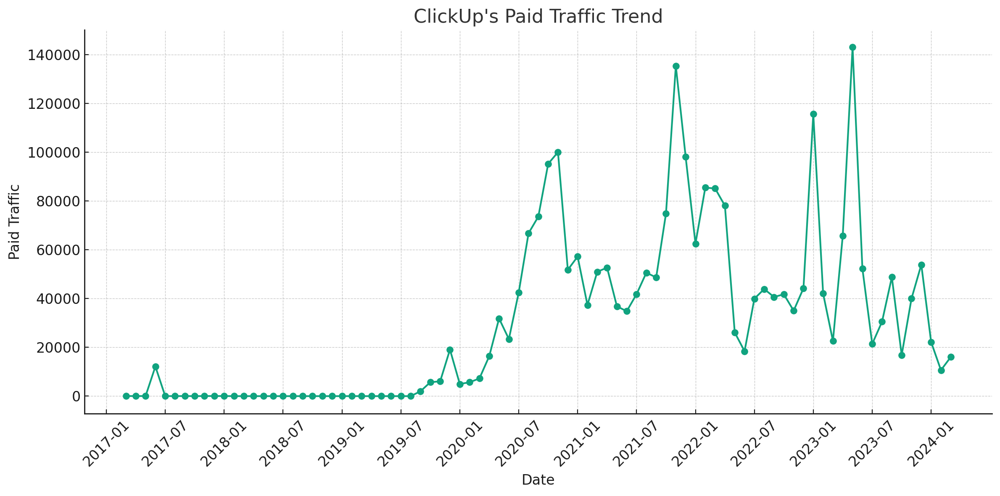

# ClickUp SEM Strategy Analysis (2024)

## Takeaways

- **SEM Trend**: Traffic increased steadily from 11,400 in early 2017 to a peak of 77,844 in mid-2023, illustrating a successful scaling of SEM efforts over time.
- **SEM Keyword Strategy**: The top keyword traffic has been consistently high at 17,296 for the last three periods, reflecting ClickUp's focused and effective keyword targeting.
- **SEM URL Traffic Distribution**: Major traffic is concentrated on comparison and feature-specific pages, indicating strategic URL targeting to engage users at crucial decision-making points.

Note: The data used in this article is only for the desktop side in the US market. All data are taken from third-party platforms, this site does not guarantee the accuracy of the data.

The analysis of traffic trends for ClickUp's "Paid Traffic" over the specified phases is summarized in the table below. Each phase shows the average traffic and the observed trend:

| Phase              | Average Traffic | Trend       |
|--------------------|-----------------|-------------|
| 2017.01 to 2020.11 | 11,400          | Increasing  |
| 2020.11 to 2021.11 | 59,477          | Increasing  |
| 2021.11 to 2023.1  | 63,369          | Decreasing  |
| 2023.1 to 2023.5   | 77,844          | Increasing  |
| 2023.5 to 2023.12  | 50,857          | Decreasing  |

**Summary for each phase:**
- **2017.01 to 2020.11**: The trend is increasing, which suggests that there was consistent growth in Paid Traffic over this period. 
- **2020.11 to 2021.11**: There is a clear increase in traffic, suggesting successful marketing campaigns or enhancements in Paid Traffic strategies during this period.
- **2021.11 to 2023.1**: The trend is decreasing, which might indicate reduced effectiveness of paid strategies or shifts in market dynamics.
- **2023.1 to 2023.5**: Traffic increases again, likely indicating a resurgence in effective paid marketing tactics or changes in the competitive landscape.
- **2023.5 to 2023.12**: The decreasing trend returns, potentially due to seasonal variations, budget cuts, or other strategic adjustments.

See more about [ClickUp's SEO strategy](https://chloevolution.com/posts/clickup-seo-strategy-analysis).
## ClickUp's SEM Strategy in November 2020

### Keyword Traffic Analysis by Topic

Here is a summary of the traffic distribution across different keyword topics:

| Keyword Topic     | Keyword Example                 | Traffic | Traffic (%) | Average CPC |
|-------------------|---------------------------------|---------|-------------|-------------|
| Other             | mind map                        | 54,746  | 54.71%      | $5.55       |
| Competitor Brand  | asana                           | 27,014  | 27.00%      | $9.84       |
| Product Related   | project management software     | 12,594  | 12.59%      | $12.06      |
| ClickUp Brand     | clickup                         | 4,052   | 4.05%       | $26.12      |
| Free Offering     | g suite free                    | 1,651   | 1.65%       | $31.82      |

**Classification Rule Explanation:**
- **ClickUp Brand**: Keywords explicitly mentioning "ClickUp."
- **Competitor Brand**: Keywords mentioning direct competitors like Asana, [Monday](https://chloevolution.com/posts/monday-com-ads), [Wrike](https://chloevolution.com/posts/wrike-sem-strategy-analysis), [Notion](https://chloevolution.com/posts/notion-sem-strategy-analysis), or [Trello](https://chloevolution.com/posts/atlassian-sem-strategy-analysis).
- **Product Related**: Keywords related to generic product features or types, e.g., software or tools.
- **Free Offering**: Keywords including terms like 'free,' indicating a focus on free versions or trials.
- **Other**: Keywords that do not fit into the above categories.

The classification follows a MECE (mutually exclusive, collectively exhaustive) approach, ensuring that each keyword fits into one distinct category without overlap and all possibilities are considered.

### URL Traffic Distribution

Here is the traffic distribution across the top 5 URLs:

| URL                                            | Traffic | Traffic (%) |
|------------------------------------------------|---------|-------------|
| [https://clickup.com/teams/project-management](https://clickup.com/teams/project-management) | 25,971  | 25.96%      |
| [https://clickup.com/asana-alternative](https://clickup.com/asana-alternative)         | 25,646  | 25.63%      |
| [https://clickup.com/features/mind-maps](https://clickup.com/features/mind-maps)       | 12,656  | 12.65%      |
| [https://clickup.com/teams/agile](https://clickup.com/teams/agile)               | 10,538  | 10.53%      |
| [https://clickup.com/product-planning](https://clickup.com/product-planning)       | 4,808   | 4.81%       |

### Summary of ClickUp's SEM Strategy in November 2020:

- **Diverse Keyword Strategy**: ClickUp utilizes a mix of keyword types, balancing between brand-focused terms, competitor brands, and broader product-related keywords.
- **Focus on High Traffic URLs**: Significant traffic is directed to key landing pages that highlight project management and alternative solutions to competitors, emphasizing ClickUp’s positioning against competitors.
- **Strategic Ad Placements**: The ads link to pages that likely offer detailed comparisons or targeted solutions (e.g., alternatives to Asana), focusing on converting users who are considering or using competing products.
- **Premium on Brand Keywords**: Higher average CPC for ClickUp brand and free offering keywords indicates a strategy to dominate these spaces, despite their lower traffic share compared to other categories.

## ClickUp's SEM Strategy in  November 2021
### Paid Keyword Strategy Analysis

| Keyword Topic    | Keyword Example          | Traffic | Traffic (%) | Average CPC |
|------------------|--------------------------|---------|-------------|-------------|
| Other            | crm                      | 74,883  | 55.29%      | $9.44       |
| Competitor Brand | trello                   | 27,114  | 20.02%      | $4.99       |
| Product-Related  | project management       | 27,066  | 19.98%      | $10.45      |
| ClickUp Brand    | clickup                  | 5,550   | 4.10%       | $60.90      |
| Free Offering    | free screen recorder     | 819     | 0.60%       | $8.60       |

**Classification Rule Explanation:**
- **ClickUp Brand**: Keywords specifically including the brand name "ClickUp."
- **Competitor Brand**: Keywords related to known competitors like Trello, Asana, Monday, and [Smartsheet](https://chloevolution.com/posts/smartsheet-sem-strategy-analysis).
- **Product-Related**: Keywords associated with product features or descriptions (e.g., project management, task management).
- **Free Offering**: Keywords that explicitly mention "free" offerings.
- **Other**: Keywords that do not fit the other categories, typically broader or less directly related to the product.

### URL Traffic Distribution for November 2021

Top 5 URLs by traffic are listed below:

| URL                                           | Traffic | Traffic (%) |
|-----------------------------------------------|---------|-------------|
| [Project Management](https://clickup.com/teams/project-management) | 69,182  | 51.08%      |
| [Enterprise Plans](https://clickup.com/plans/enterprise)           | 29,539  | 21.81%      |
| [ClickUp Home](https://clickup.com/)                              | 7,211   | 5.32%       |
| [Online To-Do List](https://clickup.com/online-to-do-list)         | 6,370   | 4.70%       |
| [Time Management](https://clickup.com/time-management)             | 5,962   | 4.40%       |

### Summary of ClickUp's SEM Strategy for November 2021:

- **Diverse Keyword Targeting**: ClickUp strategically targets a mix of keyword topics ranging from direct brand-related terms to broader product-related and competitor keywords.
- **Focused Landing Pages**: A significant amount of traffic is directed towards specific landing pages designed for project management and enterprise plans, indicating targeted efforts to attract users in these segments.
- **High Investment in Brand Keywords**: Despite lower traffic percentages, the average CPC for ClickUp brand keywords is significantly higher, suggesting a strong focus on maintaining brand visibility and authority in the market.
- **Competitor Targeting**: Substantial traffic from keywords related to competitors shows ClickUp's aggressive approach to capturing market share from other players.

## ClickUp's SEM Strategy January 2023
### Paid Keyword Strategy Analysis

| Keyword Topic    | Keyword Example       | Traffic | Traffic (%) | Average CPC |
|------------------|-----------------------|---------|-------------|-------------|
| Competitor Brand | asana                 | 68,639  | 59.34%      | $9.97       |
| Product-Related  | project management    | 24,748  | 21.39%      | $11.55      |
| ClickUp Brand    | clickup               | 10,797  | 9.33%       | $6.19       |
| Other            | dubsado               | 10,595  | 9.16%       | $6.85       |
| Free Offering    | free crm              | 893     | 0.77%       | $17.52      |

**Classification Rule Explanation:**
- **ClickUp Brand**: Keywords that explicitly include the brand name "ClickUp" or its common variant "Click Up".
- **Competitor Brand**: Keywords that mention direct competitors like Asana, Smartsheet, Monday, Basecamp, and Wrike.
- **Product-Related**: Keywords associated with generic product features or descriptions such as project management, task management, etc.
- **Free Offering**: Keywords that include the term "free," indicating a no-cost option.
- **Other**: Keywords that do not clearly fit into the other categories but may relate to business sectors or functionalities like "Dubsado".

### URL Traffic Distribution for January 2023

| URL                                                                      | Traffic | Traffic (%) |
|--------------------------------------------------------------------------|---------|-------------|
| [https://clickup.com/compare/asana-vs-clickup](https://clickup.com/compare/asana-vs-clickup) | 30,619  | 26.47%      |
| [https://clickup.com/](https://clickup.com/)                             | 17,028  | 14.72%      |
| [https://clickup.com/compare/smartsheet-vs-clickup](https://clickup.com/compare/smartsheet-vs-clickup) | 12,541  | 10.84%      |
| [https://clickup.com/compare/monday-vs-clickup](https://clickup.com/compare/monday-vs-clickup) | 10,591  | 9.16%       |
| [https://clickup.com/compare](https://clickup.com/compare)               | 8,592   | 7.43%       |

### Summary of ClickUp's SEM Strategy for January 2023:

- **Competitive Positioning**: A significant focus on competitor-related keywords (59.34% of traffic), highlighting ClickUp's aggressive strategy to position itself against key players like Asana and Monday.
- **High-Value Landing Pages**: The highest traffic URLs are comparison pages, emphasizing ClickUp's efforts to draw users evaluating other tools, which supports conversion optimization by directly comparing features and benefits.
- **Diverse Keyword Targeting**: By targeting a mix of competitor brands, product-related terms, and even free offerings, ClickUp aims to attract a wide range of potential users from those looking for specific tools to those seeking cost-effective solutions.
- **Investment in Branding**: Although ClickUp brand keywords account for a smaller portion of traffic, they have a lower CPC, indicating efficient spending to boost brand recognition and capture direct searches for the ClickUp name.

## ClickUp's SEM Strategy May 2023
### Paid Keyword Strategy Analysis

| Keyword Topic    | Keyword Example       | Traffic | Traffic (%) | Average CPC |
|------------------|-----------------------|---------|-------------|-------------|
| Competitor Brand | asana                 | 82,572  | 57.71%      | $10.39      |
| Product-Related  | project management    | 33,470  | 23.39%      | $11.20      |
| Other            | gantt chart           | 16,996  | 11.88%      | $7.08       |
| ClickUp Brand    | clickup               | 9,860   | 6.89%       | $9.26       |
| Free Offering    | free kanban board     | 186     | 0.13%       | $9.28       |

**Classification Rule:**
- **ClickUp Brand**: Keywords that include the brand name "ClickUp" or variants like "Click Up."
- **Competitor Brand**: Keywords involving direct competitors, such as Asana, Trello, Monday, and Airtable.
- **Product-Related**: Keywords related to product functionalities or types, such as project management tools.
- **Free Offering**: Keywords that explicitly mention "free" offerings.
- **Other**: Keywords that do not fit into the above categories, covering other areas related to business and productivity tools.

### URL Traffic Distribution

| URL                                                                    | Traffic | Traffic (%) |
|------------------------------------------------------------------------|---------|-------------|
| [https://clickup.com/compare/asana-vs-clickup](https://clickup.com/compare/asana-vs-clickup)        | 33,058  | 23.10%      |
| [https://clickup.com/teams/project-management](https://clickup.com/teams/project-management)        | 26,573  | 18.57%      |
| [https://clickup.com/compare/monday-vs-clickup](https://clickup.com/compare/monday-vs-clickup)      | 21,011  | 14.68%      |
| [https://clickup.com/compare/trello-vs-clickup](https://clickup.com/compare/trello-vs-clickup)      | 19,278  | 13.47%      |
| [https://clickup.com/compare/airtable-vs-clickup](https://clickup.com/compare/airtable-vs-clickup)  | 9,720   | 6.79%       |

### Summary of ClickUp's SEM Strategy for May 2023:

- **Competitor Focus**: A significant portion of the traffic (57.71%) is driven by keywords related to competitor brands, demonstrating a strategic focus on capturing users from competitors by highlighting ClickUp’s advantages.
- **Product Features Highlight**: With 23.39% of traffic coming from product-related keywords, ClickUp actively promotes its core features and capabilities, emphasizing its utility in project management.
- **Strategic Ad Placements**: The highest traffic URLs are predominantly comparison pages, indicating a targeted approach to engage users who are evaluating ClickUp against other platforms, potentially at a critical decision-making point.
- **Diverse Content Strategy**: By covering a range of topics from competitor comparisons to specific functionalities, ClickUp aims to engage a broad audience, from those seeking specific tool comparisons to those interested in general project management solutions.
- **Effective Cost Management**: Despite the high traffic percentages, ClickUp maintains a reasonable average CPC, balancing cost efficiency with traffic acquisition, especially noteworthy in categories like 'ClickUp Brand' and 'Other.'

## ClickUp's SEM Strategy in December 2023
### Paid Keyword Strategy Analysis

| Keyword Topic     | Example Keyword         | Traffic | Traffic (%) | Average CPC |
|-------------------|-------------------------|---------|-------------|-------------|
| General           | 10 best android apps    | 32,664  | 60.59%      | $4.84       |
| Product-related   | clickup                 | 8956    | 16.61%      | $7.06       |
| Competitor Brand  | airtable vs clickup     | 8,860   | 16.44%      | $10.16      |
| Feature-related   | 12 month gantt chart    | 3,426   | 6.36%       | $7.38       |

Classification Rule:
- **Product-related**: Keywords that explicitly mention ClickUp or its service components. Keywords related to the product name are grouped here.
- **Competitor Brand**: Keywords that mention competitors or involve comparisons, including any keywords where competitors are contrasted with ClickUp, such as "airtable vs clickup".
- **Feature-related**: Keywords focused on specific features of ClickUp.
- **General**: Keywords that do not fit the other categories but are used for broader marketing purposes.

### URL Traffic Distribution Analysis

| URL                                            | Traffic | Traffic (%) |
|------------------------------------------------|---------|-------------|
| https://clickup.com/                           | 9,648   | 17.90%      |
| https://clickup.com/compare/monday-vs-clickup  | 8,502   | 15.77%      |
| https://clickup.com/features/gantt-chart-view  | 3,701   | 6.87%       |
| https://clickup.com/teams/project-management   | 2,045   | 3.79%       |
| https://clickup.com/features/calendar-view     | 1,925   | 3.57%       |

### Summary of ClickUp's SEM Strategy in December 2023

- **Diverse Keyword Targeting**: ClickUp uses a broad mix of general, product-related, competitor, and feature-focused keywords to capture a wide audience spectrum. This approach ensures engagement from users at various stages of the decision-making process—from awareness and comparison to specific features interest.
- **Competitor Strategy**: A significant portion of traffic derives from competitor-related keywords. This indicates a strong focus on capturing users who are comparing ClickUp with other market options, which helps position ClickUp favorably against its competitors.
- **Feature Promotion**: By targeting feature-specific keywords, although these are less in traffic volume, ClickUp emphasizes marketing its unique functionalities, appealing to users based on particular tool capabilities.
- **Strategic Landing Pages**: The high traffic on comparison and specific feature pages suggests targeted strategies to optimize conversion rates at crucial decision points.
- **Efficient CPC Management**: The average CPC across different keyword categories reflects a strategic bidding approach, balancing visibility and cost, especially for high-value competitive searches.

## Summary
ClickUp has maintained a strategic focus on high-traffic competitor keywords to directly challenge major competitors and attract users evaluating project management tools.

### Similarities

1. **Consistent Focus on Competitor Keywords**: The presence of keywords like "asana" in the top keyword slot for three out of the four periods (except November 2021, where "trello" was the top) indicates a consistent strategic focus on competing directly with other major players in the project management tool market.

2. **Sustained Traffic Growth**: There is a clear upward trend in total traffic from one period to the next, demonstrating a successful scale in capturing more search traffic:
   - From 100,057 in November 2020 to 135,432 in November 2021.
   - Continuing to grow to 115,672 in January 2023 and further to 143,084 in May 2023.

3. **High Traffic for Top Keywords**: The top keyword traffic remains consistently high at 17,296 for the last three periods, indicating successful maintenance of traffic volume for crucial competitive keywords.

### Differences

1. **Change in Average CPC**:
   - The Average CPC has shown significant variability, rising from $5.39 in 2020 to a peak of $10.67 in January 2023 before slightly decreasing to $9.91 in May 2023. This fluctuation may reflect changes in keyword strategy, such as targeting more competitive (hence more expensive) keywords or variations in market competition over time.

2. **Variability in Keyword Count**:
   - The number of unique keywords used has varied considerably:
     - A decrease from 5,828 in November 2020 to 4,434 in November 2021 suggests a possible streamlining of the keyword strategy.
     - An increase to 3,989 by January 2023 and then to 5,688 by May 2023 indicates an adaptive strategy, possibly expanding the keyword set to capture broader traffic or responding to new competitive threats.

3. **Shifts in Top Keyword**:
   - The switch from "asana" to "trello" as the top keyword from November 2020 to November 2021 and back to "asana" in subsequent periods may signal strategic targeting adjustments based on competitor analysis and market dynamics.

