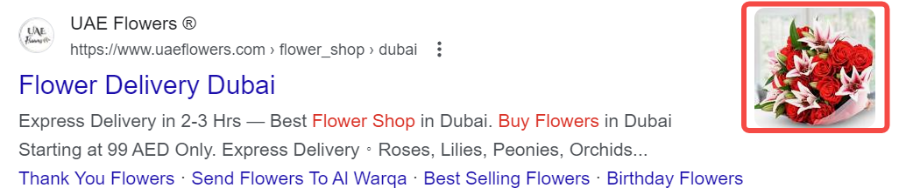

# How to Write SEM Copy That Converts: From Ad Text to Landing Page

## What is SEM Copy?  

SEM (Search Engine Marketing) copy refers to text content specifically created for online ads, designed to attract clicks and boost conversion rates. SEM copy must not only catch attention but also be practical, guiding potential users to take action—directly impacting ad performance and ROI.  

### Understanding SEM Ad Structure: Three Key Elements  

  

1. **Headline**: The first element users see in search results. A compelling headline effectively grabs attention and sparks click-through desire.  

2. **Description**: The text below the headline, detailing product/service features and benefits. It should address user needs and clearly communicate value propositions.  

3. **URL**: The displayed link address, influencing user decisions. Clear and relevant URLs build trust and improve click-through rates.  
   - **Display URL**: The shortened, ad-relevant link shown to users.  
   - **Final URL**: The actual webpage users land on after clicking.  

## What Makes SEM Copy Persuasive?  

Effective SEM copy isn’t about stuffing keywords or showcasing your brand—it’s about using limited characters to deliver a clear, compelling, and credible promise to users with specific intent, then guiding them to act.  

For practicality, we’ll use a fictional product as an example throughout:  

> **Product Context**: You’re the marketing manager for **TimeFlow**, an online time-management tool with core selling points: minimalist interface, automatic calendar sync, and team collaboration features. Target users are SMEs and freelancers.  

### 1. Capture Search Intent, Don’t Just Talk About Yourself  

SEM ads aren’t a stage for monologues—they’re “real-time conversations” responding to user needs. Adjust your copy based on search intent, tailoring language strategies for users at different stages.  

**Search Intent vs. Copy Strategy:**  

| Purchase Stage | User Search Example               | Recommended Copy Strategy  | Example (TimeFlow)               |  
| -------------- | --------------------------------- | ------------------------- | --------------------------------- |  
| **Awareness**  | “Best time management tools”      | Highlight value, guide exploration | “The ultimate tool for busy professionals” |  
| **Consideration** | “Notion vs Todoist vs TimeFlow” | Emphasize differentiation + trust | “Lighter & faster than Notion—built for teams” |  
| **Conversion** | “TimeFlow subscription” / “TimeFlow pricing” | Urgency + clear CTA       | “Start 30-day free trial—no credit card needed” |  

**Tip**: Avoid vague claims like “We’re the best.” Instead, address users’ actual search goals.  

### 2. Highlight Unique Value, Not Generic Claims  

For TimeFlow, avoid fuzzy terms like “comprehensive” or “efficient.” Focus on tangible benefits:  

> ❌ Generic: “An all-in-one time management solution”  

> ✅ Persuasive: “Save 2 hours daily—eliminate scheduling conflicts”  

To craft strong value propositions, ask:  
1. **What pain point do we solve?**  
2. **What makes us different?**  
3. **Can we quantify or exemplify it?**  

### 3. Use Clear, Powerful Language  

Great copy is precise, action-driven, and avoids jargon. With tight character limits (e.g., Google Ads: 30 chars for headlines, 90 for descriptions), every word counts. Use this cheat sheet:  

| Scenario      | Recommended Phrases          | Avoid               |  
| ------------- | ---------------------------- | ------------------- |  
| Value         | “Save time,” “Auto-sync”     | “Efficient,” “Optimized workflow” |  
| Social Proof  | “Trusted by 100K+ users,” “4.8★” | “Industry-recognized,” “Popular” |  
| CTA           | “Start now,” “Free trial”    | “Learn more,” “Get info” |  
| Trust         | “No credit card needed,” “Cancel anytime” | “Flexible plans,” “Great service” |  

**Pro Tip**: Verb + specific result = SEM copy gold.  

### 4. Include Strong CTAs  

A clear Call-to-Action drives conversions. Industry-specific examples:  

| Industry       | Top CTAs                     |  
| -------------- | ---------------------------- |  
| **SaaS**       | “Start free trial” / “Book demo” |  
| **E-commerce** | “Buy now” / “Shop deals”     |  
| **Education**  | “Get free lesson” / “Enroll today” |  
| **Finance**    | “Get quote” / “Calculate rates” |  
| **B2B**        | “Contact us” / “Download case study” |  

For TimeFlow, persuasive SEM copy combines all four principles:  

| Principle       | Example                              |  
| --------------- | ------------------------------------ |  
| Match intent    | “Top time management tools”          |  
| Unique value    | “Save 2 hours/day, auto-sync calendars” |  
| Concrete language | “Used by 100K+ teams” (not “Popular”) |  
| Clear CTA       | “Start free trial—no credit card”     |  

> **Remember: Users don’t care how great your brand is—they care if you solve their problem, clearly and credibly.**  

## Ad-to-Landing Page Consistency: The Conversion Key  

Many SEM issues occur **after the click**. Users bounce because the landing page fails to deliver what the ad promised—creating a “psychological gap.”  

**Core principle**: Whatever you promise in the ad, fulfill it immediately.  

Here’s how TimeFlow maintains consistency across campaigns:  

### 1. Message Alignment: Echo the Ad Instantly  

**Ad Example**:  
- Headline: “Save 2 hours daily with TimeFlow”  
- Description: “Auto-sync calendars, team collaboration. Start free trial.”  

❌ **Weak Landing Page**: Opens with “Founded in 2017, TimeFlow advances digital efficiency...” (Irrelevant to the user’s goal.)  

✅ **Strong Landing Page**:  
- Headline: “Save 2 hours daily—try TimeFlow now”  
- Subhead: “Auto-sync schedules, seamless collaboration for busy professionals”  
- CTA: “Free trial—no credit card”  

### 2. Visual/Structural Continuity  

Maintain design coherence to avoid disorientation:  
- **Colors/fonts**: If the ad uses clean blue/white/gray, don’t switch to chaotic branding.  
- **Tone**: Match the ad’s rational style—no sudden emotional pitches.  
- **CTA Placement**: If the ad says “Free trial,” the button must be front-and-center.  

Consistency = A seamless, trustworthy experience.  

### 3. Frictionless Action Path  

Ads set user expectations for next steps. Mismatched CTAs cause drop-offs.  

| Ad CTA          | Landing Page Match                | Pitfalls to Avoid          |  
| --------------- | --------------------------------- | -------------------------- |  
| “Free trial”    | Prominent “Start trial” button    | Hidden or vague CTAs        |  
| “Get pricing”   | Clear pricing form with “Get quote” | Form redirects to unrelated page |  
| “Book demo”     | Simple “Schedule demo” form       | Buried forms or excessive fields |  

### Why Consistency Affects Costs Too  

Google’s **Quality Score** (impacting ad rank and CPC) evaluates:  
1. Expected CTR  
2. Ad/keyword relevance  
3. Landing page experience  

Poor consistency hurts #2 and #3, lowering scores and increasing costs.  

## Ad Extensions: Boosting Ad Performance  

Beyond core copy, **ad extensions** enhance visibility and CTR by adding supplementary info:  

### What are Ad Extensions?
Ad extensions refer to additional information provided by search advertising platforms such as Google Ads and Microsoft Ads that can be appended alongside the main ad copy, including:

- **Sitelinks**: Display additional page links to help users quickly navigate to specific sections of a website

- **Callout Extensions**: Used to highlight unique selling points, such as "Free shipping" or "24/7 customer service"

- **Structured Snippet Extensions**: List product or service categories to enhance product information display

- **Call Extensions**: Directly display contact phone numbers, suitable for businesses requiring phone consultations

- **Location Extensions**: Show business addresses and provide map links in ads to help users locate physical stores

- **Price Extensions**: Display product or service prices in ads to help users quickly understand cost information

- **Promotion Extensions**: Highlight current promotions or discount information to incentivize immediate action

- **Image Extensions**: Add high-quality images to ads to make them more vivid and visually appealing

### Why Use Extensions?  
- **Larger ad footprint**: More SERP real estate.  
- **Richer info**: Supplement core messaging.  
- **Higher CTR**: Extensions statistically boost clicks.  
- **Better Quality Score**: Improved user experience lowers CPC.  

### Best Practices:  

| Extension    | Ideal Use Case           | Tips                      |  
| ------------ | ------------------------ | ------------------------- |  
| Sitelinks    | Multi-page sites          | Link to high-value pages   |  
| Call         | Phone-driven conversions  | Verify number + hours      |  
| Callout      | Key differentiators       | Be concise, avoid fluff    |  
| Snippet      | Diverse product lines     | Use clear categories       |  

## How AI is Transforming SEM Copywriting  

AI is revolutionizing SEM copy through:  

| Application       | Function                      | Benefit                    |  
| ----------------- | ----------------------------- | -------------------------- |  
| **Multi-variant Generation** | Creates diverse copy versions | Saves time, enables A/B testing |  
| **Intent Analysis**   | Deciphers user search patterns | Higher CTR/conversions      |  
| **Real-time Optimization** | Auto-tests headline/desc combos | Adapts to dynamic trends     |  
| **Smart Landing Page Sync** | Recommends aligned LP content  | Closes click-to-conversion loop |  

Tools like Google’s **AI Max Search** integrate AI across SEM workflows—from keyword matching to copy creation—delivering smarter, more efficient campaigns.  

## FAQ  

### How is SEM different from general advertising?  
SEM focuses specifically on promoting via search engines (e.g., paid ads on Google, SEO). Advertising is broader, covering all marketing channels (TV, social media, billboards).  

### Is SEM the same as AdWords?  
No. SEM encompasses all search-based marketing (paid + organic). AdWords (now Google Ads) is a paid SEM tool for Google searches.  

### Are Google Ads SEO or SEM?  
Google Ads fall under SEM (paid search). SEO improves organic rankings without paid placements.
