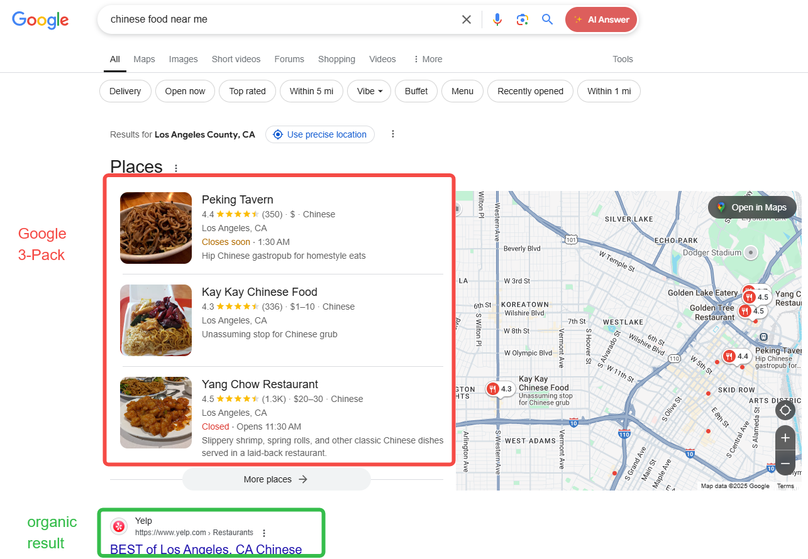
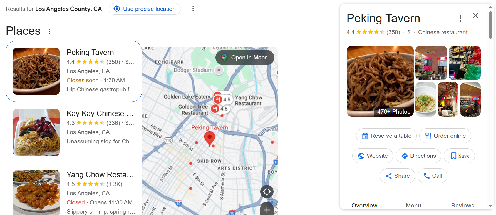
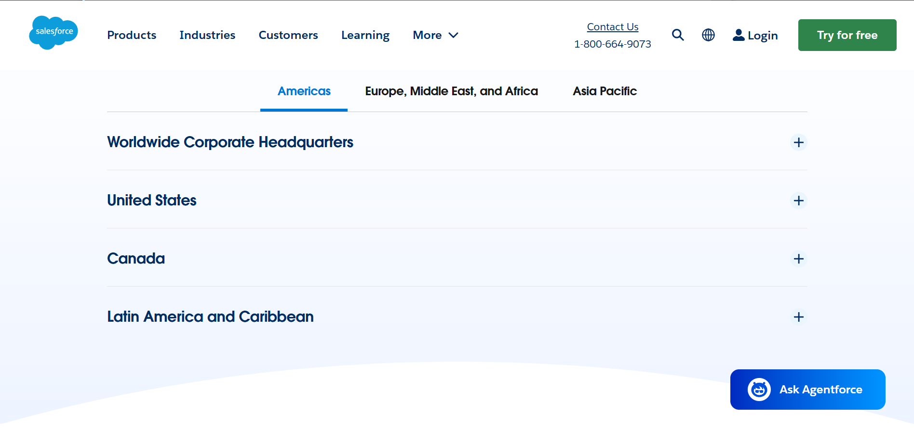
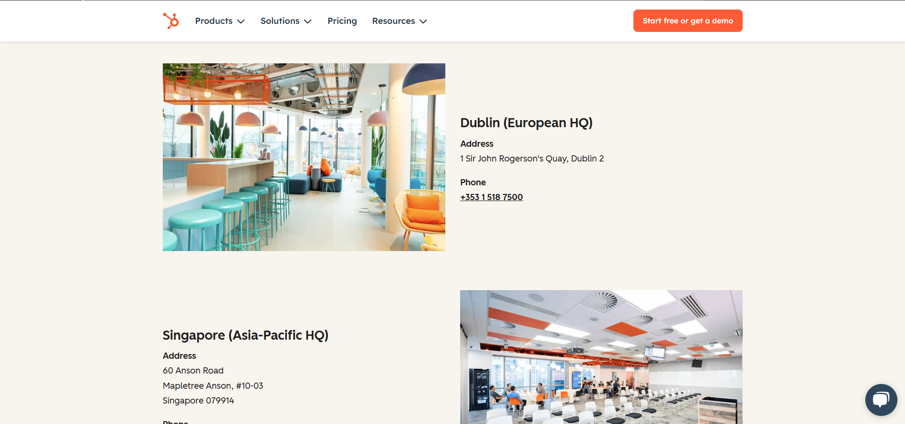
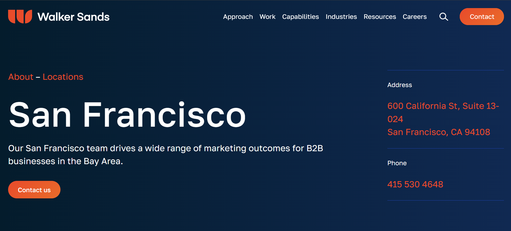
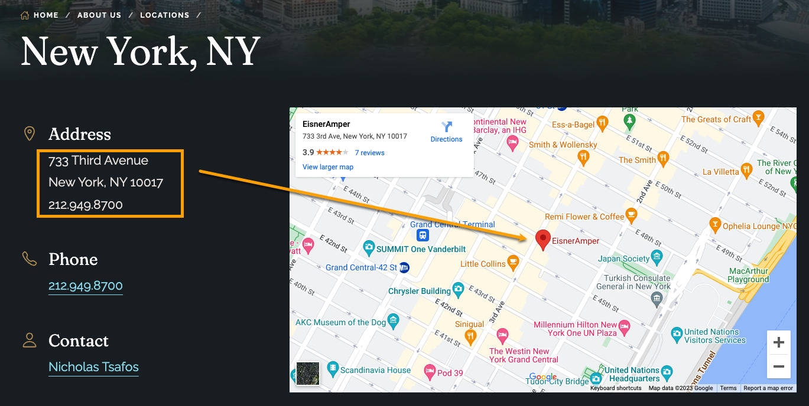

# How to Create Effective Location-Specific Landing Pages? 8 Key Elements

According to Google’s algorithm mechanics, the search results you receive on Google vary based on your geographic location (or the geographic preferences implied in your search terms). For businesses with physical local stores or those offering location-specific services, creating landing pages tailored to specific regions is essential. These pages not only help search engine crawlers better retrieve and understand your content but also enable visitors to quickly grasp what products or services are available near their residence.

## How Search Engine Crawlers Process "Geographic Location" Information  
The core goal of search engines is to deliver the most relevant and localized results to users. Crawlers achieve this by matching user search intent with actual results through the following two aspects:  

### User Search Queries  
#### Keyword Parsing and Intent Recognition  
- **Geographic Entity Recognition**: Using Natural Language Processing (NLP) and Named Entity Recognition (NER) technologies to identify place names (e.g., "Beijing," "Manhattan"), postal codes, or regional keywords (e.g., "downtown," "East District").  
- **Ambiguous Geographic Intent**: Handling vague descriptions (e.g., "coffee shops nearby") by combining real-time user location (via IP address or device GPS) or search history to infer the specific range.  
- **Multilingual/Multi-Region Adaptation**: For example, when a user searches for "München," it may cater to German-speaking users or those in Germany, automatically associating it with "Munich."  

#### Geolocation and Personalized Ranking  
- **IP Address and Device Location**: Prioritizing local results for the user’s region (e.g., searching "weather" directly displays forecasts for the current location).  
- **Regionalized Ranking Strategies**: The same query yields different results in different regions (e.g., "food delivery platform" shows DoorDash in New York and Demae-can in Tokyo).  
- **Multi-Location Intent**: Users may explicitly specify non-local regions (e.g., a Beijing user searching for "Shanghai travel guide"), requiring intent differentiation.  

### Website Page Content  
#### Extraction of Geographic Signals from Page Content  
- **Explicit Geographic Information**:  
  - Structured data (e.g., Schema markup like `LocalBusiness` or `GeoCoordinates`).  
  - Addresses, phone area codes, or administrative division names in the page text.  
- **Implicit Geographic Associations**:  
  - Localized content (e.g., "Sydney Opera House transportation guide" implies relevance to Sydney).  
  - Regional phrases or cultural references (e.g., "National Day Golden Week" targets Chinese users).  
- **Technical Signals**:  
  - Server location (a secondary reference, though CDNs may weaken this signal).  
  - Country-code top-level domains (e.g., `.de`, `.jp`) or subdirectories (e.g., `example.com/de/`).  

#### Geographic Relevance Evaluation and Indexing  
- **Regionalized Indexing**: Pages are categorized and stored by geographic relevance (e.g., "Japan travel" pages are filed under the Asia index partition).  
- **Local SEO Weighting**:  
  - Google My Business profile completeness, local backlinks (e.g., citations from regional media).  
  - Density of local keywords on the page (e.g., repeated mentions of "San Francisco Bay Area remodeling company").  
- **Multi-Region Targeting**:  
  - Use `hreflang` tags to differentiate language/region versions.  
  - Separate domains by region (e.g., `example.co.uk` vs. `example.com.au`).  

## Exposure of Location-Specific Landing Pages in Search Results  
Your landing page may appear in two key sections: the **Google 3-Pack** and **organic search results** (below the 3-Pack):  
  

### Google 3-Pack  
The Google 3-Pack is a core feature for local searches (e.g., "restaurants nearby" or "plumbing services"). It displays the three most relevant local businesses or service providers, typically positioned at the top (below the map) or middle of search results. This is a critical battleground for local SEO visibility.  
Its standard format includes:  
- Business name, star rating, and review count.  
- Address, contact number, and operating hours (partial display).  
- Distance from the user’s current location (e.g., "1.2 miles away").  
- Feature tags: e.g., "Online booking available" or "Offers delivery."  
- Business photos or Google Maps street view thumbnails.  

Clicking a business name auto-centers the map on its location and displays additional details like booking links, online ordering, or direct calls. You can set your landing page URL as the website link to gain exposure (though not all businesses secure a spot in the 3-Pack):  
  

### Organic Search Results  
The other, less prominent exposure area is the organic search results below the 3-Pack, effectively ranking fifth, sixth, or lower. Paid search results above the 3-Pack can further push rankings down. Information density here is also lower, primarily showing page titles and meta descriptions.  

## Types of Location-Specific Landing Pages  
1. **Global Scale**  
   Example: [Salesforce](https://www.salesforce.com/company/locations/) lists offices by continent (then by country):  
     
2. **Country/State/City Level**  
   Example: [HubSpot](https://www.hubspot.com/company/contact) displays office addresses and contact details by city/country:  
     
3. **Single-Location Focus**  
   Example: [Walker Sands](https://www.walkersands.com/about/locations/san-francisco/) dedicates individual pages to each office, embedding maps for precise locations:  
     

## 8 Essentials for Effective Location-Specific Landing Pages  
### 1. Use Localized URL Structures  
Before creating content, plan the number of location-specific pages and their site hierarchy.  
- **Flat Structure**:  
  e.g., `www.example.com/new-york-sightseeing-ticket` (only one level below the homepage). Not recommended for multiple location pages, as it flattens site architecture, harming UX and crawlability.  
- **Parent-Child Structure (Recommended)**:  
  Group subpages under parent pages to aid navigation and crawling.  
  - For services offered across regions: `www.example.com/service/location`  
  - For diverse local services: `www.example.com/location/service`  

### 2. Craft Compelling Titles  
Optimize HTML `title` and `H1` tags—the first elements users see. Use this formula:  
**[Brand] | [City/Region] + [Primary Product/Service Keyword]**  
Examples:  
- *Chicago Moving Services | Full-Coverage Insurance, 200% Damage Compensation*  
- *Santa Monica Divorce Lawyer | 20 Years of Family Law Expertise in Coastal Communities*  
- *Seattle Smart Home Installation | Amazon Alexa-Certified Team*  
- *Philadelphia Waste Removal | $79/Month for Small Apartments*  

### 3. Answer Basic Customer Questions  
Most local-page visitors seek fundamental details like addresses and operating hours. Present this information upfront, optionally via an FAQ section.  
Example: List driving, public transit, and walking directions to your location.  

### 4. Integrate Local Keywords  
Leverage tools like Google Trends to identify region-specific high-intent keywords, such as:  
- Branded queries: "Costco near me," "Starbucks nearby"  
- Comparisons: "Best Spanish restaurants," "Top 10 pasta places"  
- Reviews: "Japanese restaurant reviews," "Best burgers in [city]"  
- Specific services: "London hotels," "NYC day tours"  
- Proximity searches: "Chinese restaurants near me," "auto repair nearby"  

### 5. Link to Other Site Pages  
Internal linking boosts SEO and helps users explore further. Link to:  
- Product pages or catalogs  
- Seasonal promotions (e.g., Black Friday deals)  
- Career pages (for potential job applicants)  

### 6. Showcase Unique, High-Quality Photos  
Build trust with authentic visuals:  
- Exterior/interior shots of your store/office  
- Team members in action  
- Service close-ups or videos  
  

### 7. Embed Maps  
Add Google Maps links or plugins with pinned locations to help users gauge proximity. Mention other branches if relevant.  
  

### 8. Social Proof & Reviews  
Enhance credibility by displaying:  
- Third-party ratings (Google Reviews, Yelp)  
- Industry certifications (e.g., Michelin stars)  
- Government licenses (ISO, trade-specific permits)  
- Employee profiles with LinkedIn links  
- Case studies or before/after comparisons  

## Pitfalls to Avoid  
1. **Prioritizing Quantity Over Quality**  
   Low-value pages waste resources and fail to address user needs.  
2. **Creating Pages for Non-Existent Locations**  
   This risks customer complaints if services aren’t available.  
3. **Duplicating Content with Only Location Swaps**  
   Search engines may penalize thin or repetitive content, harming visibility.  

