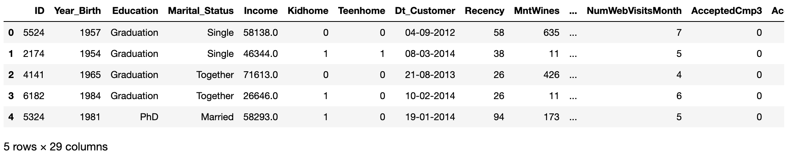
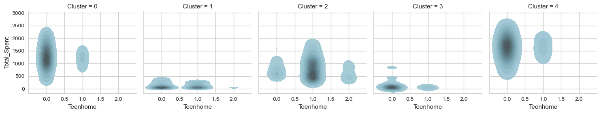
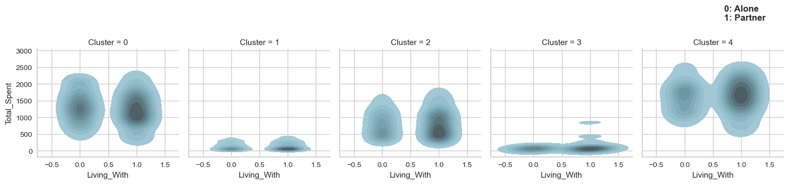
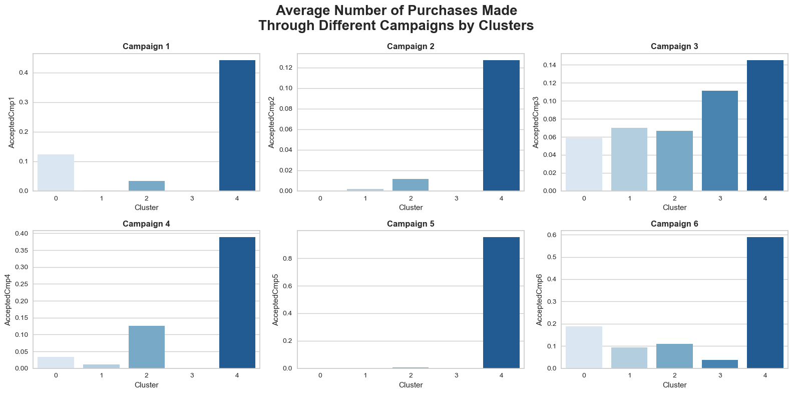

# Customer Profiling & Segmentation with Python (Source code)


The sample data and analysis code used in this article are from Kaggle. However, because the actual running results are different from [original author](https://www.kaggle.com/code/mfaaris/customer-segmentation-insights-profiling), there are slight differences in the analysis part.

The specific analysis process includes:

1. Data Preparation
2. Data Cleaning
3. Data Visualization
4. Data Processing
5. Cluster Analysis
6. Customer Profiling and Segmentation

## 1. Data Preparation

Use the KMeans clustering algorithm to divide the data into K clusters:

```python
import numpy as np
import pandas as pd
import seaborn as sns
import matplotlib.pyplot as plt
from pandas import get_dummies
from sklearn.cluster import KMeans
from sklearn.preprocessing import StandardScaler, LabelEncoder
from yellowbrick.cluster import KElbowVisualizer

import warnings
warnings.filterwarnings('ignore')
```

### ModuleNotFoundError: No module named ‘yellowbrick’


The reason for this error is that the Yellowbrick library is not installed locally.

Yellowbrick is a machine learning visualization library that mainly relies on the sklearn machine learning library and can provide visualization of a variety of machine learning algorithms.

Yellowbrick has two main dependencies: scikit-learn and matplotlib. Yellowbrick is a Python 3 package that works with version 3.4 or higher.

installation method:
```
pip install yellowbrick
```
Check the basic situation of the data, there are 29 columns:

```python
#sep is the delimiter, character type, and the default value is ','. '\t' is tab separated
#If there is a space before the data, or there is a space between the delimiter and the data, if skipinitialspace is specified as True, this space will be skipped before reading the data. If the value is False, spaces will not be skipped, but spaces will be read as part of the data. The default value of skipinitialspace is False
df_dataset = pd.read_csv('marketing_campaign.csv', sep='\t', skipinitialspace = True)

#Return the first n rows of the object based on the position, the default is the first 5 rows
df_dataset.head()
```



Check the numerical type and null value of each column:

```python
#info() function is used to print a brief summary of the DataFrame, displaying information about the DataFrame, including the data type of the index, the data type of the column, the number of non-null values, and memory usage.
df_dataset.info()
```


## 2. Data Cleaning

It is known that the type of customer registration time (Dt_Customer) is Object. In order to facilitate subsequent splitting into year, month, and day, it needs to be converted into date and time format.

At the same time, use `date()` to view the time span of the data. It can be seen that the customer registration time in the data set is 2012-2014:

```python
#to_datetime() converts parameters into date and time format
#The original format of Dt_Customer is Object, not the time format and needs to be converted.
df_dataset['Dt_Customer'] = pd.to_datetime(df_dataset['Dt_Customer'], dayfirst = True)

print("The oldest record on customer's enrollment:", min(df_dataset['Dt_Customer']).date())
print("The newest record on customer's enrollment:", max(df_dataset['Dt_Customer']).date())
```


### ValueError: time data doesn’t match

The default date parsing order of to_datetime() is month, day, and year, and the date format in the data set is day, month, and year, so the value of dayfirst needs to be specified:


Optimize some attributes to facilitate subsequent analysis:

- Age: The most recent time recorded by the customer is 2014. Use this as the anchor point and subtract the customer’s date of birth.
- Education: reduced to 3 categories: Graduate, Postgraduate, Undergraduate
- Marriage status (Living_With): reduced to 2 categories: Partner, Alone
- Number of children (Total_Children): new attribute, combining "Kidhome" and "Teenhome", indicating the total number of children in the customer's home (children + teenagers)
- Customer registration time (Dt_Customer): split into days, days of the week, months, and years
- Whether you are a parent (Is_Parent): a new attribute that indicates the customer’s parenting status
-Total_Spent: the customer’s total spending
- The remaining characteristic attributes remain unchanged

```python
df_dataset['Age'] = 2014 - df_dataset['Year_Birth']
df_dataset['Education'] = df_dataset['Education'].replace({'Graduation':'Graduate', 'PhD':'Postgraduate', 'Master':'Postgraduate', '2n Cycle':'Postgraduate', 'Basic':'Undergraduate'})
df_dataset['Living_With'] = df_dataset['Marital_Status'].replace({'Married':'Partner', 'Together':'Partner', 'Single':'Alone', 'Divorced':'Alone', 'Widow':'Alone', 'Absurd':'Alone', 'YOLO':'Alone'})
df_dataset['Total_Children'] = df_dataset['Kidhome'] + df_dataset['Teenhome']

#Split the customer registration time into specific days, months, years and corresponding days of the week
#Lambda function is also called an anonymous function, that is, a function without a specific name. The format is: lambda parameter: operation (parameter)
#With the colon as the dividing line, the left side is the input variable, and the right side is the operation performed on the variable.
#Using the combination of lambda and apply function, you can operate on a row or column of DataFrame
df_dataset['Day'] = df_dataset['Dt_Customer'].apply(lambda x: x.day)
df_dataset['Dayofweek'] = df_dataset['Dt_Customer'].apply(lambda x: x.day_name())
df_dataset['Month'] = df_dataset['Dt_Customer'].apply(lambda x: x.month)
df_dataset['Year'] = df_dataset['Dt_Customer'].apply(lambda x: x.year)

#If there is a child, the value is 1, otherwise it is 0
df_dataset['Is_Parent'] = df_dataset['Total_Children'].apply(lambda x: 1 if x != 0 else 0)
df_dataset['Total_Spent'] = df_dataset['MntWines'] + df_dataset['MntFruits'] + df_dataset['MntMeatProducts'] + df_dataset['MntFishProducts'] + df_dataset['MntSweetProducts'] + df_dataset['MntGoldProds']

#Simplify attribute names
#The role of the inplace parameter: when it is True, no new object is created, and the original object is modified directly; when it is False, the data is modified, and a new object is created and returned to carry the modification results.
df_dataset.rename(columns={'MntWines':'Wines', 'MntFruits':'Fruits', 'MntMeatProducts':'Meats', 'MntFishProducts':'Fish', 'MntSweetProducts':'Sweets', 'MntGoldProds':'Golds'}, inplace=True)
df_dataset.rename(columns={'NumWebPurchases':'Web', 'NumCatalogPurchases':'Catalog', 'NumStorePurchases':'Store'}, inplace=True)

#dropna() can find the null value of DataFrame type data, delete the row/column where the null value is located, and return the new DataFrame as the return value
#drop() can delete a row or column in the table without changing the data in the original DataFrame, but returns another DataFrame to store the deleted data.
#drop() deletes rows by default. If you want to delete columns, you need to add 'axis = 1'
df_dataset.dropna(inplace=True)
df_dataset.drop(['ID', 'Dt_Customer', 'Year_Birth', 'Marital_Status', 'Z_CostContact', 'Z_Revenue'], axis=1, inplace=True)

#copy() creates a new list containing the same elements
df = df_dataset.copy()
```

Sort by customer's income and age in ascending order, read the last 5 rows to confirm whether there are any outliers

Delete outliers: age greater than or equal to 80, income too high

```python
#sort_values() can sort the Dataframe's data set according to the data in a certain field. The default is ascending order.
#tail() reads the last specific line of the file
print('Income:')
print(df['Income'].sort_values().tail(5))

print('\nAge:')
print(df['Age'].sort_values().tail(5))

#Remove outliers
df = df.drop(2233)
df = df[df['Age'] < 80]
```


## 3. Data Visualization

```python
#Set chart color system
sns.color_palette('Blues')
```

Draw a scatter matrix diagram to initially observe the correlation between several characteristics such as "age", "income", "total expenditure", "consumption frequency", and "whether you are a parent":

```python
data = ['Age', 'Income', 'Total_Spent', 'Recency', 'Is_Parent']

#pairplot is a scatter matrix plot, used to show the relationship between two features. On the diagonal is the histogram (distribution diagram) of each attribute, and on the off-diagonal is the correlation diagram between two different attributes.
#hue performs color classification for a certain field, and palette controls the hue.
#suptitle() is used to add a centered title to the figure, y is the y position of the text in the figure coordinates
plot = sns.pairplot(df[data], hue='Is_Parent', palette='Blues')
plot.fig.suptitle('Feature Relationship', y=1.05, weight='bold', fontsize=16)
```


As can be seen from the chart:

- The income, consumption amount, and consumption frequency of non-parents are significantly higher than those of parents
- The higher the income, the more willing people are to spend money

### Error: Only title appears, no picture

If you use Jupyter Notebook, you need to add it at the beginning of the code
`%matplotlib inline`

The function is to display images in Notebook without explicitly calling plt.show(). For specific principles, please refer to [Stackoverflow](https://stackoverflow.com/questions/21176731/automatically-run-matplotlib-inline-in -ipython-notebook)


Observe the time distribution of customers registering as members through a bar chart:

```python
#Create a 2*2 grid on the figure
#flatten() reduces the dimension of the array and returns a copy. Modifications to the copy will not affect the original matrix.
#axes.flatten() expands the subgraph and assigns it to axes, then axes[0] is the first subgraph, axes[1] is the second subgraph, and so on.
fig, axes = plt.subplots(2,2, figsize=(15,8))
axes = axes.flatten()
fig.suptitle("When Did the Customer Enrolled To be a Member", weight='bold', fontsize=16)

#sns.countplot is used to draw frequency bar charts of category features
#order sorts the fields of x or y, and the sorting method is a list
#ax is used to specify the coordinate system
sns.countplot(df['Dayofweek'], order=['Monday', 'Tuesday', 'Wednesday', 'Thursday', 'Friday','Saturday', 'Sunday'], palette='Blues', ax=axes[0])

sns.countplot(df['Day'], palette='Blues', ax=axes[1])

sns.countplot(df['Month'], palette='Blues', ax=axes[2])

sns.countplot(df['Year'], palette='Blues', ax=axes[3])
```


As can be seen from the chart:

- Most consumers register as members on Mondays and Wednesdays
- Significantly more registrations on the 12th day of each month
- August has the largest number of registrations, followed by May, October, and March, all with more than 200 people
- 2013 had the largest number of registrations (but there is a problem of missing data, this data set does not include data for the first half of 2012 and the second half of 2014)

Divide "age" into different intervals, with a span of 10:

```python
#pd.cut divides a set of data into discrete intervals. By default, the left side is the open interval and the right side is the closed interval.
group = pd.cut(df['Age'], [10, 20, 30, 40, 50, 60, 70, 80])

#value_counts()用于查看表格中有多少个不同值
group.value_counts()
```


Copy a new data table and replace "age" with the processed interval data:

```python
df2 = df.copy()

#Replace the Age column with the split data
df2['Age'] = group

#Category customer spending according to age, and sum and average respectively
sum_group = df2[['Total_Spent', 'Age']].groupby('Age').sum()
mean_group = df2[['Total_Spent', 'Age']].groupby('Age').mean()

fig, axes = plt.subplots(1,2,figsize=(14,8))
axes = axes.flatten()

#barplot draws a histogram, ci is the size of the confidence interval, and orient is the drawing direction.
sns.barplot(x=sum_group['Total_Spent'], y=sum_group.index, palette='Blues', ci=None, orient='h', ax=axes[0])
axes[0].set_title('Total Spent on Products\nby Age Groups', weight='bold', fontsize=16)

#enumerate() Combines a traversable data object into an index sequence, listing both the data subscript and the data
#plt.text() is used to set text descriptions
#'$ {}'.format(v) adds currency symbols to all amounts
for i,v in enumerate(sum_group['Total_Spent']):
    if i == 0 or i ==6:
        axes[0].text(v+30000, i, '$ {}'.format(v), horizontalalignment='center', verticalalignment='center', weight='bold', color='black', fontsize=12)
    else:
        axes[0].text(v-40000, i, '$ {}'.format(v), horizontalalignment='center', verticalalignment='center', weight='bold', color='white', fontsize=12)

sns.barplot(x=mean_group['Total_Spent'], y=mean_group.index, palette='Blues', ci=None, orient='h', ax=axes[1])
axes[1].set_title('Average Spent on Products\nby Age Groups', weight='bold', fontsize=16)

#round(v,2) retains two decimal places of floating point numbers
for i,v in enumerate(mean_group['Total_Spent']):
    axes[1].text(v-130, i, '$ {}'.format(round(v,2)), horizontalalignment='center', verticalalignment='center', weight='bold', color='white', fontsize=12)
```


As can be seen from the chart:

- Consumption distribution is obviously polarized. The total number of people in the age range at both ends does not exceed 20, resulting in a significant gap in total consumption amount
- The average consumption amount of people over 70 years old is the highest, exceeding US$1,000, which is equivalent to twice the average consumption amount of people aged 30-40 years old

Observe the consumption preferences of different age groups for different products and the contribution of each category to the company's revenue:

```python
fig, axd = plt.subplot_mosaic([[0,1,2],[3,4,5], [6,6,7], [6,6,7], [6,6,7]],
                              constrained_layout=True, figsize=(18,10))

fig.suptitle("Customer's Average Spent on Products\nby Age Groups", weight='bold', fontsize=20)

#Draw a bar chart and set the corresponding chart namesns.barplot(data=df, x=group, y='Wines', palette='Blues', ci=None, ax=axd[0])
axd[0].set_title('Wines', weight='bold')
sns.barplot(data=df, x=group, y='Fruits', palette='Blues', ci=None, ax=axd[1])
axd[1].set_title('Fruits', weight='bold')
sns.barplot(data=df, x=group, y='Meats', palette='Blues', ci=None, ax=axd[2])
axd[2].set_title('Meats', weight='bold')
sns.barplot(data=df, x=group, y='Fish', palette='Blues', ci=None, ax=axd[3])
axd[3].set_title('Fish', weight='bold')
sns.barplot(data=df, x=group, y='Sweets', palette='Blues', ci=None, ax=axd[4])
axd[4].set_title('Sweets', weight='bold')
sns.barplot(data=df, x=group, y='Golds', palette='Blues', ci=None, ax=axd[5])
axd[5].set_title('Gold', weight='bold')

#Draw a pie chart, sum each product category and then sort it in ascending order
data = df[['Wines', 'Fruits', 'Meats', 'Fish', 'Sweets', 'Golds']].sum().sort_values()

#Set the color of the pie chart
palette = sns.color_palette('Blues')
#wedges is a list containing fan objects, texts is a list containing text label objects, and autotexts is a list containing automatically generated text label objects.
#autopct sets the display format of each sector percentage in the pie chart. '%.2f%%' is a percentage with two decimal places. textprops is a dictionary type, used to specify the attributes of text labels, such as font size, font color, etc.
wedges, texts, autotexts = axd[6].pie(x=data, labels=data.index, autopct='%.2f%%', colors=palette, textprops=dict(fontsize=12));
axd[6].set_title("\n\nPercentage of Company's Profit\nfrom Products", weight='bold', fontsize=20, x=1.2)

#Set the color and font of the text label object
for autotext in autotexts:
    autotext.set_color('white')
    autotext.set_weight('bold')
    
#Set the label text description on the right side of the pie chart
The #enumerate function provides a counter i
The #zip function packs the index of the data and the corresponding value into a tuple (name, value) for each iteration in the loop.
#The x coordinate is fixed at 2.3, while the y coordinate starts from 0.5 and moves downward by 0.2 each time (calculated from 0.5-0.2*i) to arrange the text vertically
#r"$\bf{" + name + "}$" displays name in bold, "\t:" inserts a tab character and colon as delimiters, "\$" + str(value) displays a dollar sign and value converted to string
for i, (name, value) in enumerate(zip(data.index, data)):
    axd[6].text(2.3, 0.5-0.2*i, r"$\bf{" + name + "}$" + "\t:" + " \$" + str(value), fontsize=14)
    
#Hide the axis of the subgraph with key 7 in the axd dictionary
axd[7].axis('off')
```


It can be seen from the chart:

- Except for fruits, candies, and gold, in other categories, people over 70 years old have the highest spending amount. Among them, their average consumption amount on alcoholic products exceeds 600 US dollars.
- Liquor is the company's highest-selling product, followed by meat and gold. Liquor contributed US$675k in sales in 3 years, accounting for 50.27% of the company's total revenue

### How to use plt.subplot_mosaic

plt.subplot_mosaic can be used to create multiple different subplots at the same time, using a list to represent the orientation of axes, returning a figure and multiple axes

Parameters [[0,1,2],[3,4,5], [6,6,7], [6,6,7], [6,6,7]]: This parameter defines the subgraph layout. Here, we provide a list of lists (or a matrix), where each sublist represents a row in the graph, and each element in the list represents a subgraph position in that row. By repeating numbers, we indicate that certain subplots span multiple rows or columns. In this example, the number 6 appears in three rows and two columns, indicating that there is a subgraph spanning these positions.

According to this code, the final layout will have 8 subgraphs, and the layout is as follows:

There are three subgraphs in the first row, identified as 0, 1, and 2 respectively.
The second row also has three sub-pictures, labeled 3, 4, and 5 respectively.
Beginning on the third row, there is a larger subfigure labeled 6, which spans the third to fifth rows and takes up two columns of space. Next to it is a smaller subplot identified as 7

Observe the shopping channels preferred by people of different age groups, as well as the company’s overall order sources:

```python
fig, axd = plt.subplot_mosaic([[0,1,2], [3,3,4], [3,3,4]],
                               constrained_layout=True, figsize=(18,8))
fig.suptitle("Average Number of Purchases Made\nThrough Different Methods by Age Groups", weight='bold', fontsize=20)

#Specify the range of the y-axis from 0 to 8
#plt.setp() sets the range of the y-axis in the subgraph
custom_ylim = (0, 8)
plt.setp(axd[0], ylim=custom_ylim)
plt.setp(axd[1], ylim=custom_ylim)

#After classifying according to "Purchase methods", draw a bar chart
sns.barplot(data=df, x=group, y='Web', palette='Blues', ci=None, ax=axd[0])
axd[0].set_title('Web', weight='bold')
sns.barplot(data=df, x=group, y='Catalog', palette='Blues', ci=None, ax=axd[1])
axd[1].set_title('Catalog', weight='bold')
sns.barplot(data=df, x=group, y='Store', palette='Blues', ci=None, ax=axd[2])
axd[2].set_title('Store', weight='bold')

#According to the "purchase methods", calculate the sum and draw a pie chart
data = df[['Web', 'Catalog', 'Store']].sum().sort_values()

#Set pie chart color and details
palette = sns.color_palette('Blues')
wedges, texts, autotexts = axd[3].pie(x=data, labels=data.index, autopct='%.2f%%', colors=palette, textprops=dict(fontsize=12));
axd[3].set_title('\n\nPercentage of Purchases Made\nThrough Different Methods', weight='bold', fontsize=20, x=1.35)
    
for autotext in autotexts:
    autotext.set_color('white')
    autotext.set_weight('bold')
    
#Set the position and display form of pie chart data labels
for i, (name, value) in enumerate(zip(data.index, data)):
    axd[3].text(2.3, 0.3-0.2*i, r"$\bf{" + name + "}$" + "\t:" + str(value) + " times", fontsize=14)

#Hide unused images
axd[4].axis('off')
```


It can be seen from the figure:

- Among the three different purchase channels, the consumption amount of people over 70 years old is the highest, although there are only 8 people in this group. Once again, it reflects that their consumption amount is significantly higher than that of other age groups.
- Nearly half of sales come directly from stores, accounting for 46.2% of total purchases


```python
#Change the column name from 'Response' to 'AcceptedCmp6' to calculate the campaign accepted by the customer
#inplace=True parameter ensures that changes are made directly on the original DataFrame rather than returning a new DataFrame
df.rename(columns={'Response':'AcceptedCmp6'}, inplace=True)

plt.figure(figsize=(9,4))
plt.title('Percentage of Customer Who Accepted the nth Offer', weight='bold', fontsize=16)

#df.sum() calculates the sum of all columns
#len(df) returns the number of rows in the DataFrame df, which actually calculates the sum of each selected column as a percentage of all rows in the DataFrame
percent = df.sum()[['AcceptedCmp1', 'AcceptedCmp2', 'AcceptedCmp3', 'AcceptedCmp4', 'AcceptedCmp5', 'AcceptedCmp6']]*100/len(df)

#Plot percent data through bar graphs and line graphs respectively
#Marked points are added via the style='o-' parameter, which means that the data points are marked with circles ('o') and connected by straight lines ('-')
ax = percent.plot.bar(color='#6495ED')
percent.plot(style='o-', colormap='copper')

plt.setp(ax, ylim=(0, 18))

#x coordinate is the index i of the data point, aligning the text with the corresponding data point
#y coordinate is the value v of the data point plus 1.2. This is done to place the text a certain distance above the data point and avoid overlapping the text with the data point or other elements of the chart.
for i,v in enumerate(percent):
    plt.text(i, v+1.2, '{:.2f}%'.format(v), horizontalalignment='center', weight='bold', color='Black', fontsize=10)
```


It can be seen from the figure:

- Only 6.42% of people were willing to accept the first campaign, and even plummeted to 1.36% for the second time.
- The sixth campaign clearly attracted a large number of customers, with an acceptance rate as high as 15.05%

Observe the distribution of people who use discounts for shopping and the impact of the factor "whether they have become a parent":

```python
plt.figure(figsize=(9,4))
plt.title('Average Number of Purchases Made with a Discount\nby Age Groups', weight='bold', fontsize=16)

#Observe the use of discounts for shopping according to "whether they have become a parent"
sns.barplot(data=df, x=group, y='NumDealsPurchases', hue='Is_Parent', ci=None, palette='Blues')
```


It can be seen from the figure:

People who have become parents are significantly more likely to be attracted by discounts and then make purchases

Observe the correlation between "numeric" type attributes through the heat map. The darker the color, the stronger the correlation:

```python
#Select all numerical columns from df and return the column names of these columns
data = df.select_dtypes(include=[np.number]).columns

plt.figure(figsize=(12,10))
plt.title('Feature correlation', weight='bold', fontsize=16, y=1.05)

#Plot the correlation coefficient matrix between numerical columns, showing the correlation through the color gradient of the heat map
sns.heatmap(df[data].corr(), cmap='Blues')
```


It can be seen from the figure:

- "Monthly official website visits", "Total number of children", "Whether they are a parent" have little correlation with customer consumption amount
- Income and product category will significantly affect customer consumption amount
## 4. Data Processing

Process the categorical features (i.e. non-numeric features) in the df, convert them into dummy variables (also known as dummy variables or indicator variables), and then create a new DataFrame (`df_final`) containing the original numerical features and the newly generated dummy variable:

```python
#Select non-numeric features in df and return the corresponding column names
obj_feat = df.select_dtypes(exclude=[np.number]).columns

#get_dummiesConvert non-numeric features into dummy variables
#drop_first=True parameter means that for each feature, the dummy variable of the first category is dropped to avoid the dummy variable trap (i.e. complete multicollinearity)
#concat function merges the original DataFrame (df) and the DataFrame (dummies) containing dummy variables along the column (axis=1) direction.
#drop method removes the original non-numeric feature columns in df_final. inplace=True means modifying df_final in place without creating a new DataFrame.
#df.shape gets the shape of df_final, that is, its number of rows and columns
dummies = get_dummies(df[obj_feat], drop_first=True)
df_final = pd.concat([df, dummies], axis=1)
df_final.drop(obj_feat, axis=1, inplace=True)
df_final.shape
```

The result is: (2212, 38)

Standardize the data using `StandardScaler` from `sklearn.preprocessing` and then convert the processed data back to Pandas DataFrame format:

```python
#StandardScaler is a preprocessing class in the Scikit-learn library that scales features to a distribution with mean 0 and standard deviation 1
#fit_transform calculates the mean and standard deviation of each feature, and then uses these parameters to standardize the data.
scaler = StandardScaler()
scaled = scaler.fit_transform(df_final)

#DataFrame constructor converts the scaled array back to DataFrame format
#In order to maintain the consistency of column names, use df_final.columns as the column names of the new DataFrame
#So df_final_scaled is a new DataFrame that contains standardized data and retains the column names of the original DataFrame
df_final_scaled = pd.DataFrame(scaled, columns=df_final.columns)
df_final_scaled.head()
```


After normalization, the value of a data point represents the deviation of the original value from the mean, in units of standard deviation. For example, a processed value of 2 means that the original value of the data point is two standard deviations above the mean.

Use `LabelEncoder` to encode and convert non-numeric features in DataFrame (`df`) to facilitate subsequent data visualization:

```python
le = LabelEncoder()

#Traverse all elements in obj_feat (except the last element) through a for loop
#First fit the data in obj, find all the unique categories in the feature and their corresponding integer codes, and then convert these unique categories into integer codes
#The current column (obj) in the original DataFrame is replaced with the trans column containing the converted integer encoding
for obj in obj_feat[:-1]:
    trans = le.fit_transform(df[obj])
    df[obj] = trans
```

## 5. Cluster Analysis

The "Elbow method" is used here for cluster analysis

### Principle of "Elbow method"

1. Calculate SSE (sum of squared errors): For each value of k (i.e. number of clusters), we calculate the sum of squares of the Euclidean distances of all points to their assigned cluster centers, which is called SSE. As the value of k increases, the size of each cluster generally decreases, and therefore the distance of each point to its cluster center decreases, resulting in a decrease in SSE.
2. Find the "elbow point": Ideally, we want to find a small k value while keeping the SSE relatively small. When we plot the SSE corresponding to different k values, as the k value increases, the decline rate of SSE will slow down, and the curve will show an "elbow" shape. This "elbow point" is often considered the optimal number of clusters, as adding more clusters after this point does not significantly improve model fit (i.e., decrease in SSE)

Taking into account the impact of random initialization:

The KMeans algorithm randomly selects k clustering centers at the beginning, which may cause the algorithm results to be affected by the initial selection, making the final clustering result somewhat random. In order to obtain consistent results across multiple runs or different environments, we can set a random state.

Here, by setting `random_state=123`, we ensure that the initial random selection of cluster centers is the same every time we run KMeans, making the results reproducible.

### Why does SSE decrease as k increases?

1. Increase in cluster centers: When we increase the number of clusters k, it means that more cluster centers can be used to represent data points. As the number of cluster centers increases, each data point is more likely to be assigned to a cluster center that is closer to it, so the average distance of each point to its cluster center will decrease, resulting in lower SSE.
2. Decrease in cluster size: As the k value increases, the number of data points contained in each cluster usually decreases. Smaller clusters make data points within the cluster closer, reducing the distance between data points and their cluster centers, further reducing SSE.
3. Extreme cases: In extreme cases, if the value of k is equal to the total number of data points, then each data point is its own cluster center, and the SSE will be 0. But this situation has no actual clustering significance and just illustrates why SSE will continue to decrease as k increases.

```python
#Use the KMeans clustering algorithm and specify the maximum number of clusters to test as 10
#KElbowVisualizer will evaluate k values from 1 to 10 to decide which k value is the best choice
#Call the fit method to train the KMeans model
elbow = KElbowVisualizer(KMeans(random_state=123), k=10)
elbow.fit(df_final_scaled)
elbow.show()
```

The result of the run is a graph of different k values (number of clusters) and the corresponding SSE (sum of squared errors). The purpose of the elbow plot is to help us visually see how the SSE changes as the value of k increases. Ideally, SSE decreases as the k value increases, but the rate of decrease will slow down significantly at a certain point. This point is the so-called "elbow point" and is considered the optimal number of clusters.


As can be seen from the figure, the "elbow point" is k=5

```python
#Based on the results in the above figure, create a clustering object and set the number of clusters to 5. That is, the ultimate goal is to divide the data points into 8 clusters.
model = KMeans(n_clusters=5, random_state=123)

#fit_predict uses the preprocessed and standardized data set to train (fit) the KMeans model and returns the cluster labels assigned to each data point. These labels are stored in the yhat variable
yhat = model.fit_predict(df_final_scaled)

#Add the clustering results to the original DataFrame, allowing you to see which cluster each original data point belongs to
df['Cluster'] = yhat
```

```python
#Plot the number of occurrences of each cluster label
sns.countplot(data=df, x='Cluster', palette='Blues')
```


## 6. Customer Profiling and Segmentation

Analyze the relationship between income and total consumption, distinguish according to the clustering results, and draw scatter plots and violin plots:

```python
#constrained_layout=True ensures that the layout of the graphic is automatically adjusted to avoid overlap
fig, axd = plt.subplot_mosaic([[0,0],[1,2]], constrained_layout=True, figsize=(14,8))
fig.suptitle('Income vs Total Spent', weight='bold', fontsize=16)

sns.scatterplot(data=df, x='Income', y='Total_Spent', hue='Cluster', palette='Blues', ax=axd[0])
sns.violinplot(data=df, x='Cluster', y='Total_Spent', palette='Blues', ax=axd[1])
sns.violinplot(data=df, x='Cluster', y='Income', palette='Blues', ax=axd[2])
```


It can be seen from the figure:

Cluster 0: High Consumption & High Income

Cluster 1: Low Consumption & Low Income

Cluster 2: Average Consumption & Average Income

Cluster 3: Lowest consumption & lowest income

Cluster 4: Highest consumption & highest income

### What do you think of the violin diagram?

1. **View Width**: The shape of the violin plot can reveal the characteristics of the data distribution. For example, if the violin plot is particularly wide at one end, it indicates that the data points are denser around that value.
2. **Analysis Box Plot**: The embedded box plot provides a five-number summary of the data, helping us understand the distribution range of the data and the location of the median.

Plot the kernel density estimate (KDE) of "age" and "total cost":

```python
g = sns.FacetGrid(data=df, col='Cluster')
g.map(sns.kdeplot, 'Age', 'Total_Spent', color='#95C8D8', fill=True)
```


### How to analyze the kernel density estimation chart

The kernel density estimation plot (KDE plot) is a graph used to display the distribution of variables. It can be regarded as a smoothed version of the histogram. Through the KDE chart, we can intuitively understand the distribution of data, including the central tendency, dispersion and skewness of the data. Here are a few key points on how to interpret kernel density estimation plots:

1. **Peaks**: The peaks on the KDE chart represent the mode area in the data, that is, there are more data points near this value. There can be multiple peaks on a plot, indicating that the data distribution may be multimodal (i.e., there are multiple modes).
2. **Width**: The width of the graph reflects the variability or dispersion of the data. A kernel density plot with a larger width indicates that the data points are more dispersed; conversely, a plot with a narrower width indicates that the data points are more concentrated.
3. **Skewness**: If the KDE plot is not completely symmetrical, the data distribution may be skewed. If the graph extends longer to the right, the data is positively skewed (right-skewed), that is, more data values are to the left of the mean; if the graph extends longer to the left, the data is negatively skewed (left-skewed), That is, more data values are to the right of the mean.
4. **Tails**: The tail of the KDE plot can tell us the tail behavior of the data distribution, such as whether there is a long tail or extreme values. A long tail is when one end of the graph extends very far, indicating that there are some extreme high or low values.
5. **Overlay Plot**: Sometimes, researchers will draw multiple KDE plots on the same graph to compare the data distribution of different subsets. At this time, you can understand the distribution differences between different subsets by observing which areas overlap more and the shape differences of each graph.
6. **Kernel density estimation and actual data**: It should be noted that the kernel density estimation graph represents an estimate of the data distribution, not the actual data distribution. Therefore, it is useful for revealing overall trends in the data, but may not be suitable for precise statistical testing.

Plot the kernel density estimates of "parent or not" and "total spent":

```python
g = sns.FacetGrid(data=df, col='Cluster')
g.map(sns.kdeplot, 'Is_Parent', 'Total_Spent', color='#95C8D8', fill=True)

plt.text(0.6,3900, '0: Non Parent\n1: Parent', weight='bold', fontsize=12)
```


Plot the kernel density estimates of "number of children" and "total spent":

```python
g = sns.FacetGrid(data=df, col='Cluster')
g.map(sns.kdeplot, 'Kidhome', 'Total_Spent', color='#95C8D8', fill=True)
```


Plot the kernel density estimates of "number of teenagers" and "total spent":

```python
g = sns.FacetGrid(data=df, col='Cluster')
g.map(sns.kdeplot, 'Teenhome', 'Total_Spent', color='#95C8D8', fill=True)
```



Plot the kernel density estimates of "total children" and "total spent":

```python
g = sns.FacetGrid(data=df, col='Cluster')
g.map(sns.kdeplot, 'Total_Children', 'Total_Spent', color='#95C8D8', fill=True)
```


Plot the kernel density estimates of "relationship status" and "total spent":

```python
g = sns.FacetGrid(data=df, col='Cluster')
g.map(sns.kdeplot, 'Living_With', 'Total_Spent', color='#95C8D8', fill=True)

plt.text(0.7,3900, '0: Alone\n1: Partner', weight='bold', fontsize=12)
```



Draw a scatter plot of "education status" and "total spent":

```python
g = sns.FacetGrid(data=df, col='Cluster')
g.map(sns.scatterplot, 'Education', 'Total_Spent', color='#95C8D8')

plt.text(0.6,3400, '0: Graduate\n1: Postgraduate\n2: Undergraduate', weight='bold', fontsize=12)
```


### How to analyze a scatter plot?

1. Correlation

Positive correlation: If an increase in one variable is accompanied by an increase in the other variable, then there is a positive correlation between the two variables. In a scatter plot, this appears as a general trend of the set of points from lower left to upper right.
Negative correlation: If an increase in one variable is accompanied by a decrease in the other variable, then there is a negative correlation between the two variables. In a scatter plot, this appears as a general trend of the set of points from upper left to lower right.
No correlation: If there is no obvious linear relationship between the two variables, the point set is relatively evenly distributed on the graph and there is no obvious trend.

2. Clusters

The points on a scatter plot sometimes form one or more clusters, indicating the presence of distinct subgroups in the data. These clusters may represent different categories, groups, or data points with similar characteristics.

3. Outliers

In a scatter plot, points that are far away from other data points are called outliers. These points may represent data entry errors, measurement errors, or actual data distribution properties.

4. Trend Line

Sometimes a trend line (such as a linear regression line) is added to a scatter plot to more clearly show the main trend between variables. The slope and direction of a trend line provide a visual representation of the relationship between variables.

5. Distribution density

In some scatter plots, the density of points reflects the concentration of data in that area. Areas with denser points indicate that there are more data points there.

Plot a bar chart between "customer category" and "customer last purchase time":

```python
plt.figure(figsize=(9,4))
plt.title("Average Number of Days Since Customer's Last Purchase\nby Clusters", weight='bold', fontsize=16)
sns.barplot(data=df, x='Cluster', y='Recency', palette='Blues', ci=None)
```


Observe the average consumption of different customer groups (Cluster) in different product categories (such as wine, fruit, meat, etc.):

```python
fig, axes = plt.subplots(2,3, figsize=(16,8))
fig.suptitle("Customer's Average Spent on Products\nby Clusters", weight='bold', fontsize=20)
axes = axes.flatten()

sns.barplot(data=df, x='Cluster', y='Wines', palette='Blues', ci=None, ax=axes[0])
axes[0].set_title('Wines', weight='bold')
sns.barplot(data=df, x='Cluster', y='Fruits', palette='Blues', ci=None, ax=axes[1])
axes[1].set_title('Fruits', weight='bold')
sns.barplot(data=df, x='Cluster', y='Meats', palette='Blues', ci=None, ax=axes[2])
axes[2].set_title('Meats', weight='bold')
sns.barplot(data=df, x='Cluster', y='Fish', palette='Blues', ci=None, ax=axes[3])
axes[3].set_title('Fish', weight='bold')
sns.barplot(data=df, x='Cluster', y='Sweets', palette='Blues', ci=None, ax=axes[4])
axes[4].set_title('Sweets', weight='bold')
sns.barplot(data=df, x='Cluster', y='Golds', palette='Blues', ci=None, ax=axes[5])
axes[5].set_title('Gold', weight='bold')

#Adjust the layout of the subfigures to ensure there is enough space between subfigures and that the titles and axis labels do not overlap.
plt.tight_layout()
```


Observe the average number of purchases by different customer groups in different sales channels:

```python
fig, axes = plt.subplots(1,3, figsize=(16,5))
fig.suptitle("Average Number of Purchases Made\nThrough Different Methods by Clusters", weight='bold', fontsize=16)
axes = axes.flatten()

custom_ylim = (0, 8)
plt.setp(axes[0], ylim=custom_ylim)
plt.setp(axes[1], ylim=custom_ylim)

sns.barplot(data=df, x='Cluster', y='Web', palette='Blues', ci=None, ax=axes[0])
axes[0].set_title('Web', weight='bold')
sns.barplot(data=df, x='Cluster', y='Catalog', palette='Blues', ci=None, ax=axes[1])
axes[1].set_title('Catalog', weight='bold')
sns.barplot(data=df, x='Cluster', y='Store', palette='Blues', ci=None, ax=axes[2])
axes[2].set_title('Store', weight='bold')

plt.tight_layout()
```


Observe the average number of purchases by different customer groups in different marketing campaigns:

```python
fig, axes = plt.subplots(2,3, figsize=(16,8))
fig.suptitle("Average Number of Purchases Made\nThrough Different Campaigns by Clusters", weight='bold', fontsize=20)
axes = axes.flatten()

sns.barplot(data=df, x='Cluster', y='AcceptedCmp1', palette='Blues', ci=None, ax=axes[0])
axes[0].set_title('Campaign 1', weight='bold')
sns.barplot(data=df, x='Cluster', y='AcceptedCmp2', palette='Blues', ci=None, ax=axes[1])
axes[1].set_title('Campaign 2', weight='bold')
sns.barplot(data=df, x='Cluster', y='AcceptedCmp3', palette='Blues', ci=None, ax=axes[2])
axes[2].set_title('Campaign 3', weight='bold')
sns.barplot(data=df, x='Cluster', y='AcceptedCmp4', palette='Blues', ci=None, ax=axes[3])
axes[3].set_title('Campaign 4', weight='bold')
sns.barplot(data=df, x='Cluster', y='AcceptedCmp5', palette='Blues', ci=None, ax=axes[4])
axes[4].set_title('Campaign 5', weight='bold')
sns.barplot(data=df, x='Cluster', y='AcceptedCmp6', palette='Blues', ci=None, ax=axes[5])
axes[5].set_title('Campaign 6', weight='bold')

plt.tight_layout()
```



Observe how different customer groups use discounts for consumption:

```python
plt.figure(figsize=(9,4))
plt.title('Average Number of Purchases Made with a Discount\nby Clusters', weight='bold', fontsize=16)
sns.barplot(data=df, x='Cluster', y='NumDealsPurchases', ci=None, palette='Blues')
```


Based on the above charts, we can summarize the following five types of user portraits:

Cluster 0:

- High consumption & high income
- Across all ages
- Most have never become parents
- Become a parent with 1 teenager at home

Cluster 1:

- Low consumption & low income
- Across all ages
- Most have become parents
- Maximum 3 children

Cluster 2:

- Average consumption & average income
- relatively older
- Almost all of them are parents, except for a few
- Maximum 3 children, mainly teenagers
- Passionate about purchasing with discounts

Cluster 3:

- Lowest consumption & lowest income
- Relatively younger
- Maximum 2 children, mainly children

Cluster 4:

- Highest consumption & highest income
- Across all ages
- Most have never become parents
- Actively participated in 6 marketing campaigns
