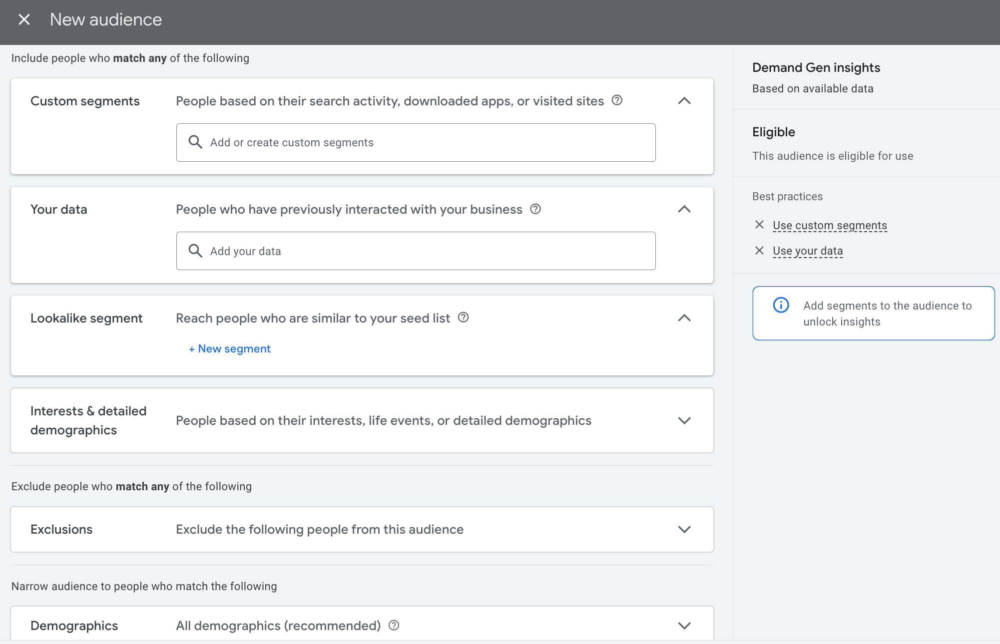
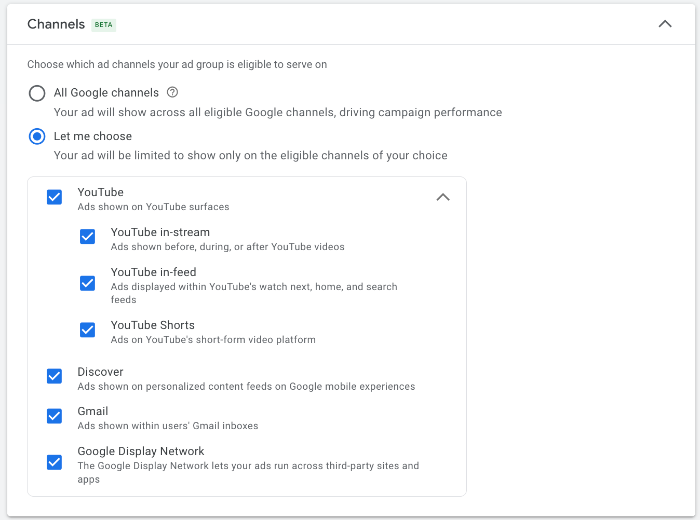

# When to Use Performance Max vs. Demand Gen?

## What’s the Difference Between Performance Max and Demand Gen Campaigns?

**Performance Max (PMax)** is a fully automated campaign type by Google that allows advertisers to run a single campaign across all Google-owned channels—Search, Display, YouTube, Gmail, Discover, Maps, and more. It serves as a **complement to Search Ads**, helping advertisers reach more potential customers across multiple touchpoints.

**Demand Gen Campaigns**, on the other hand, are designed for visually engaging platforms like YouTube and Google Discover. They focus on **sparking interest and creating demand** through short-form videos and in-feed content—ideal for attracting new audiences to your brand or products.

While both campaign types have their advantages, they differ significantly in areas like placements, funnel stage focus, targeting control, automation, creative handling, and reporting transparency.

## Where Do Performance Max and Demand Gen Ads Appear?

* **PMax Exclusive Channels**: Search, Shopping, Maps – ideal for direct response.
* **Demand Gen Exclusive Channels**: YouTube Shorts, YouTube Feed – designed for immersive, social-like engagement.
* **Shared Channels**: YouTube (long-form), Gmail, Discover – targeting interest-based discovery.

**Think of it this way**:
PMax = *Full Google Network*
Demand Gen = *Short Video + Social Feeds*

| Campaign Type       | **Performance Max**          | **Demand Gen**                        |
| ------------------- | ---------------------------- | ------------------------------------- |
| **Unique Channels** | Google Search (Text Ads)     | YouTube Shorts (Short-form Video Ads) |
|                     | Google Display Network (GDN) | YouTube Feed (In-Feed Ads)            |
|                     | Google Shopping              | YouTube In-Feed (Suggested Video Ads) |
|                     | Google Maps                  | –                                     |
| **Shared Channels** | YouTube (Video Ads)          | YouTube (Video Ads)                   |
|                     | Google Discover              | Google Discover                       |
|                     | Gmail Ads                    | Gmail Ads                             |

## Which Funnel Stages Are Best for Each Campaign Type?

* **PMax** is optimized for **Lower to Mid Funnel** (Conversions & Consideration). Ideal for performance-driven goals like e-commerce or lead generation.
* **Demand Gen** focuses on **Upper to Mid Funnel** (Awareness & Interest). Best for brand storytelling, engagement, and demand creation.
* **Used Together**: Attract audiences with **Demand Gen** on YouTube Shorts/Discover, then retarget or convert via **PMax** across Search or Shopping.

| Funnel Stage     | **Marketing Objective** | **Performance Max**                      | **Demand Gen**                              | **Placements & Examples**                                                                                                                                                             |
| ---------------- | ----------------------- | ---------------------------------------- | ------------------------------------------- | ------------------------------------------------------------------------------------------------------------------------------------------------------------------------------------- |
| **Upper Funnel** | Awareness               | ❌ Not ideal (unless using brand assets)  | ✅ *Best fit* (visual and social engagement) | **Demand Gen**: • YouTube Shorts (Brand Videos) • Discover (Native Ads) • Gmail (Visual Emails) **Example**: Product launch teasers, brand story content                  |
| **Mid Funnel**   | Consideration           | ✅ Effective (dynamic product ads)        | ✅ *Core use case* (deepening interest)      | **PMax**: • YouTube (Product Ads) • Discover (Recommendations) **Demand Gen**: • YouTube Feed • Discover (Interactive ads) **Example**: Reviews, limited-time deals |
| **Lower Funnel** | Conversion              | ✅ *Main strength* (drive direct actions) | ❌ Less effective (unless remarketing)       | **PMax**: • Google Search • Shopping • Maps **Example**: “Buy Now” CTAs, countdown deals                                                                                  |
|                  | Retention               | ✅ Supports (remarketing lists)           | ✅ Supports (brand loyalty content)          | **PMax**: • GDN (Loyalty Campaigns) **Demand Gen**: • YouTube (VIP content) **Example**: Member discounts, customer stories                                               |

## How Much Audience Control Do You Have?

* **PMax** is highly automated. You can provide “audience signals,” but the system ultimately decides who sees your ads.
* **Demand Gen** gives advertisers more manual control over targeting, including interests, behaviors, custom audiences, and remarketing logic.

| Targeting Option             | **Performance Max**                                                      | **Demand Gen**                                                          |
| ---------------------------- | ------------------------------------------------------------------------ | ----------------------------------------------------------------------- |
| **Control Level**            | Low (System-determined)                                                  | Medium (Advertiser-defined)                                             |
| **Audience Definition**      | Not fully supported – only directional “signals”                         | Full control over interests, remarketing, custom audiences              |
| **Keyword/Intent Targeting** | ❌ Not supported                                                          | ✅ Supported via custom intent audiences (e.g., “looking to buy iPhone”) |
| **Lookalike Audiences**      | Auto-generated by system                                                 | Manually adjustable with similarity levels                              |
| **Remarketing Logic**        | Limited (basic list upload only)                                         | Highly detailed (time-based, URL path, session behavior)                |
| **Exclusion Capabilities**   | Limited (e.g., can’t exclude “visited product page but didn’t purchase”) | Granular (e.g., exclude “clicked ad but didn’t sign up”)                |
| **AI Learning Dependency**   | Very high (minimal manual override)                                      | Moderate (manual inputs significantly shape results)                    |

Demand Gen allows detailed audience setup:

And supports custom placement selection:

## How Automated Are These Campaign Types?

* **PMax** is Google’s most automated campaign type. It suits advertisers who want wide reach and trust Google’s AI to optimize.
* **Demand Gen** retains more manual control—better for brands who want to stay in charge of creative presentation and audience precision, especially in mid-to-upper funnel stages.

| Feature                      | **Performance Max**                             | **Demand Gen**                                            |
| ---------------------------- | ----------------------------------------------- | --------------------------------------------------------- |
| **Overall Automation**       | Very High                                       | Medium to High                                            |
| **Bidding**                  | Fully automated (e.g., tROAS, tCPA only)        | Smart Bidding by default, with some manual options        |
| **Placement Selection**      | Fully automated across all channels             | Limited to YouTube, Discover, Gmail only                  |
| **Audience Targeting**       | System-inferred from signals                    | Manually selected (interests, custom intent, remarketing) |
| **Creative Assembly**        | System mixes and matches assets automatically   | Advertiser controls full ad format                        |
| **Creative Testing**         | System tests combinations (no detailed results) | Performance metrics available (e.g., CTR, view rate)      |
| **Learning Curve**           | Longer (AI needs more data)                     | Shorter (quicker initial results)                         |
| **Manual Input Flexibility** | Very low                                        | Moderate                                                  |

## What Are the Creative Requirements?

| Aspect                    | **Performance Max**                                                                                   | **Demand Gen**                                                                                       |
| ------------------------- | ----------------------------------------------------------------------------------------------------- | ---------------------------------------------------------------------------------------------------- |
| **Asset Structure**       | Upload separate assets (headlines, images, etc.)                                                      | Upload full ads (image, carousel, or video formats)                                                  |
| **Supported Formats**     | Images, videos, headlines, descriptions, long headlines, logos                                        | Single images, carousels, short videos, YouTube videos                                               |
| **Image Dimensions**      | Must upload multiple sizes: • 1200×628 (horizontal) • 300×300 (square) • 960×1200 (vertical) | Recommended: • 1200×628 (horizontal) • 1080×1080 (square) • 960×1200 (vertical)             |
| **Video**                 | Optional YouTube video link (recommended) May auto-generate if not provided                        | Supports local upload or YouTube link No auto-generation                                          |
| **Headline Requirements** | Up to 5 short headlines Up to 5 long headlines (max 90 characters)                                 | Varies: • Single image: 1 main headline • Carousel: 1 per slide • Video: no headline needed |
| **Descriptions**          | Up to 5 (max 90 characters each)                                                                      | Typically 1 short description per ad format                                                          |
| **Recommended Quantity**  | Upload as many variants as possible for AI to mix                                                     | Limited number per format – avoid duplicates                                                         |
| **Dynamic Ad Assembly**   | ✅ Yes – assets combined automatically                                                                 | ❌ No – fixed layout, full control                                                                    |
| **CTA Button**            | Auto-generated (not customizable)                                                                     | Selectable CTAs (e.g., "Buy Now", "Learn More")                                                      |
| **Preview Option**        | Simulation previews only (not full final ad view)                                                     | Full preview available for each ad format                                                            |

## What’s the Difference in Reporting Transparency?

| Aspect                      | **Performance Max**                                          | **Demand Gen**                                        |
| --------------------------- | ------------------------------------------------------------ | ----------------------------------------------------- |
| **Overall Transparency**    | Low                                                          | Medium to High                                        |
| **Channel-Level Data**      | Not broken out (only shows aggregate results)                | Viewable by sub-channel (YouTube, Gmail, Discover)    |
| **Ad Group Performance**    | Yes                                                          | Yes                                                   |
| **Audience-Level Data**     | Not available                                                | View click-through and conversion by audience segment |
| **Asset-Level Reporting**   | Only shows rating: “Best / Good / Low” – no click/view stats | Full metrics (CTR, views, interactions)               |
| **Ad Combination Results**  | Not visible                                                  | Individual ad units are fully trackable               |
| **Remarketing Data**        | Not separated from prospecting                               | Can segment new vs. returning users                   |
| **Device/Geo/Time Reports** | Basic reporting supported                                    | Supported as well                                     |
| **Conversion Attribution**  | Limited visibility – black-box style modeling                | Clearer – shows contribution of each ad type          |

## Final Question: If PMax Covers All Google Channels, Why Use Demand Gen?

Because **PMax is like autopilot** across the Google network, while **Demand Gen is a custom billboard in high-traffic social spaces**. They’re **not substitutes—they’re complementary**.

| Key Dimension          | **Performance Max**                                           | **Demand Gen**                                               |
| ---------------------- | ------------------------------------------------------------- | ------------------------------------------------------------ |
| **Channel Control**    | Fully automated (can’t prioritize or exclude specific ones)   | Manually choose where ads appear (YouTube, Gmail, Discover)  |
| **Creative Control**   | Assets are auto-assembled; no control over final combinations | Full control over ad format and visual consistency           |
| **Data Transparency**  | Limited – only basic asset ratings and no channel breakdown   | Rich insights by audience, channel, and creative performance |
| **Optimization Goals** | System prioritizes conversions only                           | Supports multiple goals like clicks, views, and engagement   |
| **Ad Strategy Style**  | AI-first, automation-led                                      | Creative-led, brand-controlled                               |

