# Dreamflow Review: AI Mobile App Builder

[DreamFlow](https://dreamflow.app/) is an **AI mobile app builder** designed to make the app development process **automated**, **visual**, and **code-based**. Its goal is to let users create **production-ready applications** faster than ever — combining the **speed of AI** for rapid prototyping and iteration with **full control over the underlying code**, ensuring that the final output is high-quality, scalable, and commercially viable.

How users build with Dreamflow:

1. **Describe your app**
   Use natural language to tell the system what you want to build.

2. **Adjust in canvas or code**
   Ask the **AI Agent** to make changes, fine-tune designs visually, or edit the code directly.

3. **Ship or export**
   Instantly deploy or export a full **Flutter** project.

## Product Slogan

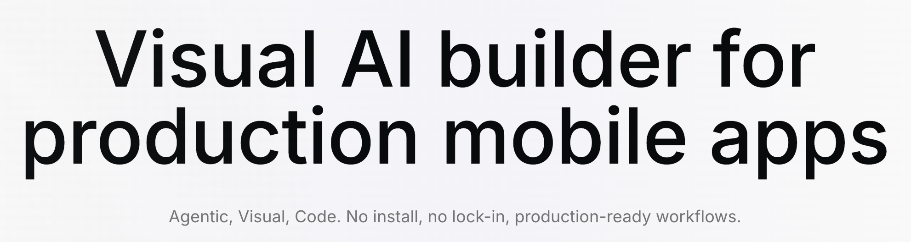

The **Dreamflow** slogan has two parts:

* **Dynamic carousel slogans** with three main lines:

  * **Visual AI builder for production mobile apps**
  * **Build apps like you're from the future**
  * **Canvas ↔ Code, seamlessly synced**

* **Static tagline** displayed below:
  **Agentic**, **Visual**, **Code**.
  **No install, no lock-in, production-ready workflows.**

## Key Features

### Tri-Surface Editing

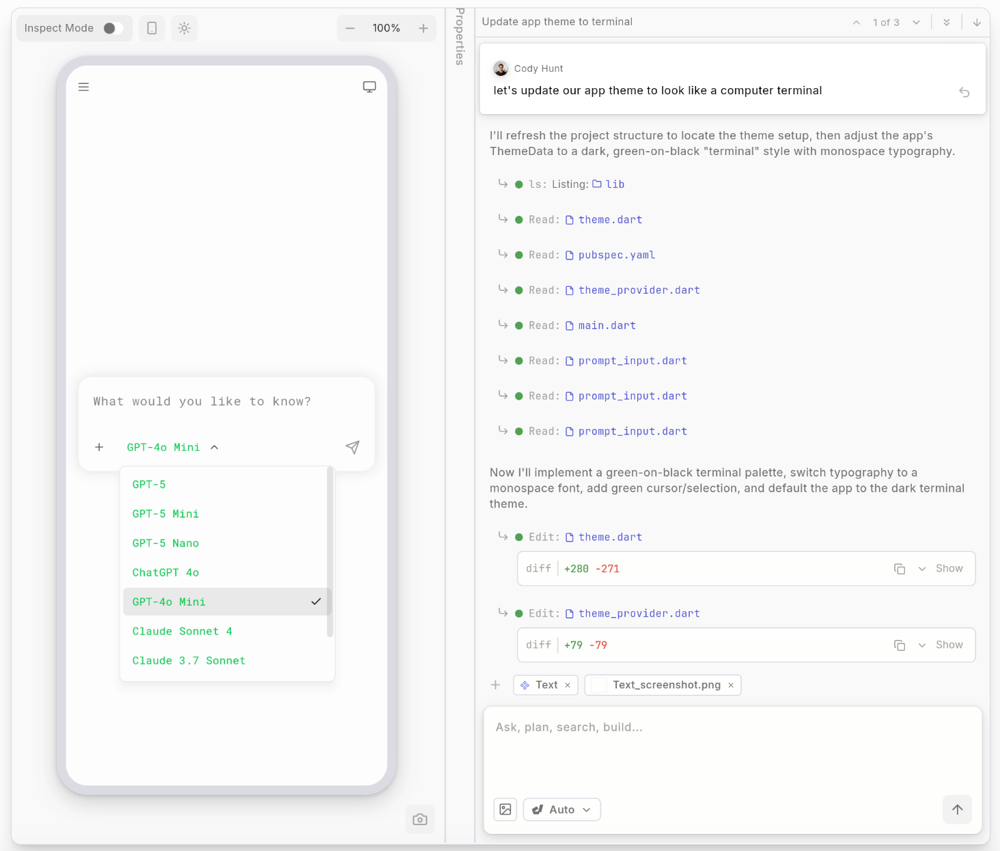

**Dreamflow** allows simultaneous editing across three dimensions: **Agentic (AI-driven)**, **Visual**, and **Code**.
It provides a seamless editing experience between **AI prompts**, **visual canvas**, and **source code** on a single screen. For example, modifying a **prompt** instantly updates the visual preview — dramatically improving efficiency and feedback speed.

### AI-Powered

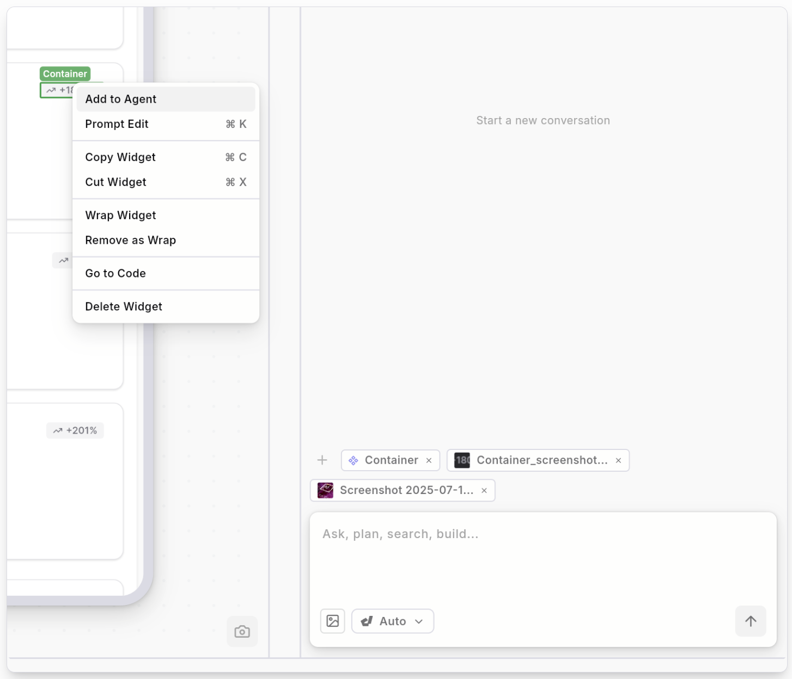

**Dreamflow** comes with robust **AI capabilities**. Users can edit directly on existing prototypes.
It supports **context-aware generation**, meaning the **AI** understands design patterns and best practices to structure features properly. This ensures that generated results follow industry standards — the AI doesn’t just write code, it writes **good** code.

### Build for Any Screen

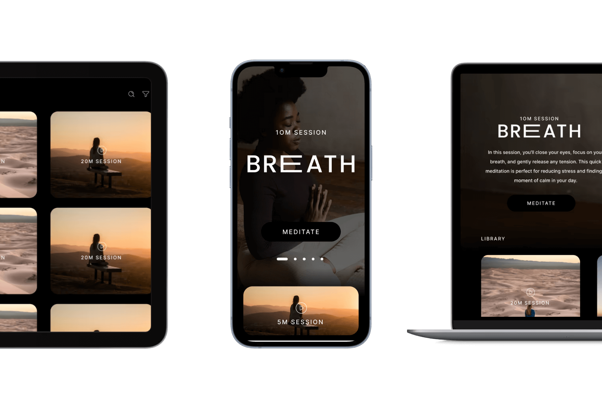

Powered by the **Flutter** framework, Dreamflow supports fully responsive design for any device size.
It helps users build robust, adaptive apps that can be deployed on the **App Store**, **Play Store**, or **Web**.

### Backend Integrations

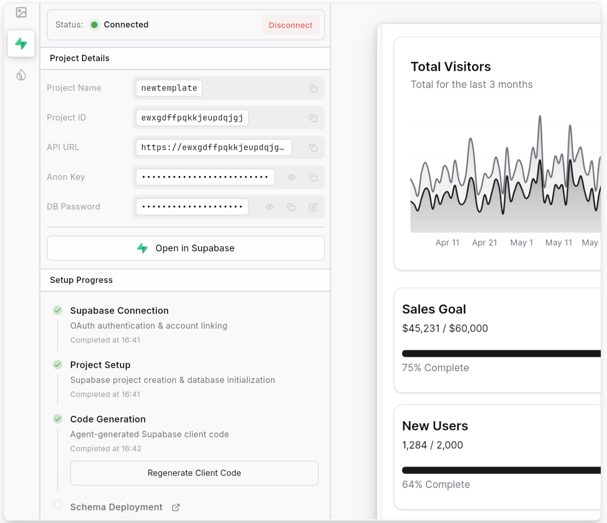

Dreamflow integrates seamlessly with backend services such as **Supabase** and **Firebase**, offering ready-to-use support. This enables users to build scalable full-stack apps right from day one.

## Conversion Path

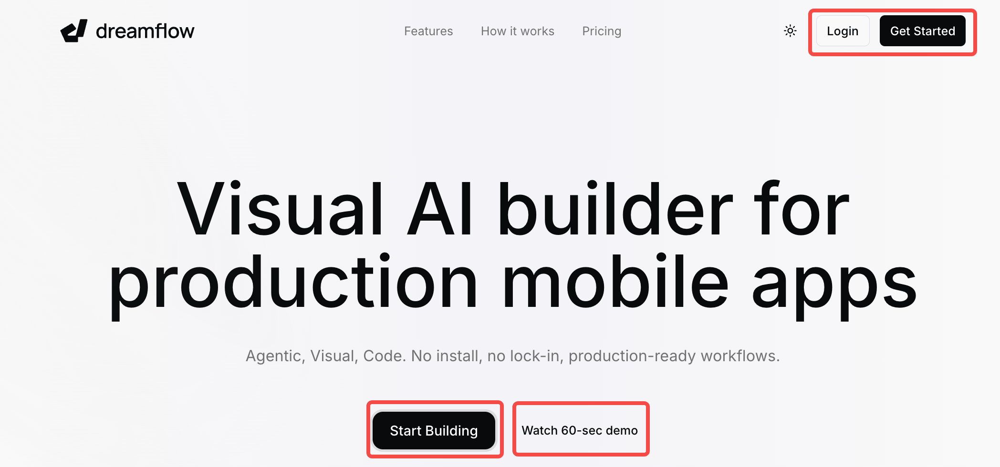

Dreamflow’s website conversion path includes four key buttons:
**“Start Building”**, **“Watch 60-sec demo”**, **“Login”**, and **“Get Started.”**
Among them, **“Start Building”** and **“Get Started”** stand out with bold black styling to attract clicks.

In practice, all buttons except **“Watch 60-sec demo”** redirect users to the same login page:
`https://app.dreamflow.com/login`.

### Login Page

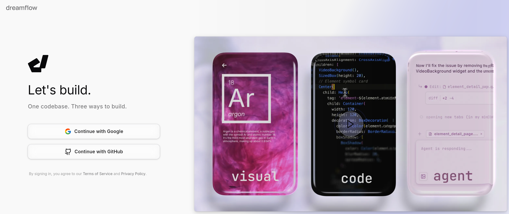

The login page supports two main sign-in options: **Google** and **GitHub**.
A promotional video on the right-hand side introduces the product’s features and value.

After signing in with a Google account, users enter an onboarding flow with three steps:

1. Choose the reason or goal for using **Dreamflow**.
2. Describe their role — preset options include **Engineer**, **Product**, **Designer**, **Founder**, or a custom role.
3. Select company size (ranging from 1–10 up to 5000+ employees).

Once completed, users can start using the product immediately.

### Watch 60-sec Demo

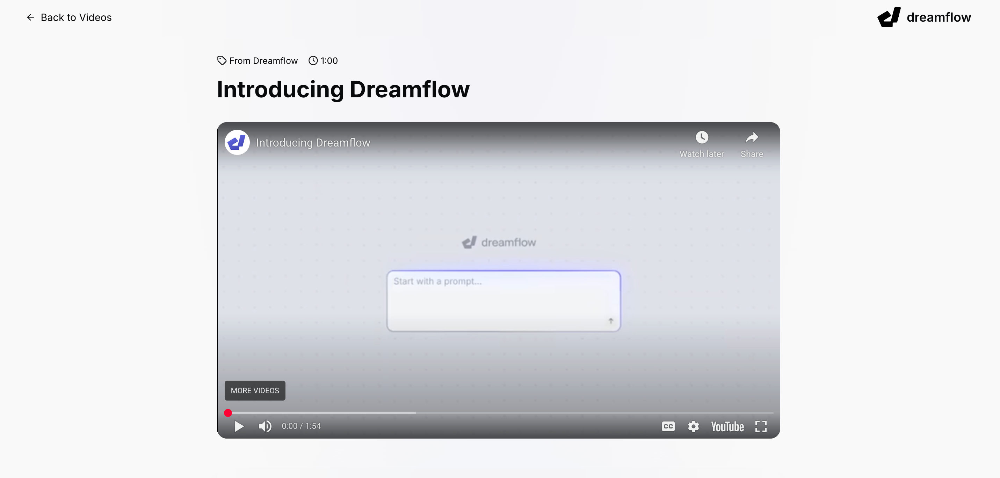

This button leads to a dedicated page containing a short introduction video.
The video briefly explains what **Dreamflow** is and why users should try it.

## Product Ecosystem

**Dreamflow** offers a rich ecosystem of tutorials and learning resources to help users master the platform.

### [Documentation](https://docs.dreamflow.com/)

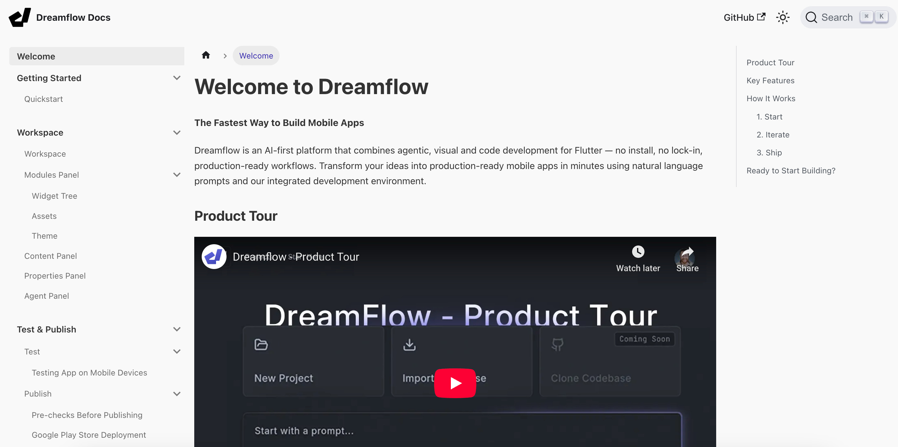

The product documentation is detailed and multimedia-friendly, combining text instructions, annotated screenshots, and **YouTube** tutorials for an enhanced learning experience.

### [Tutorial Videos](https://dreamflow.app/videos)

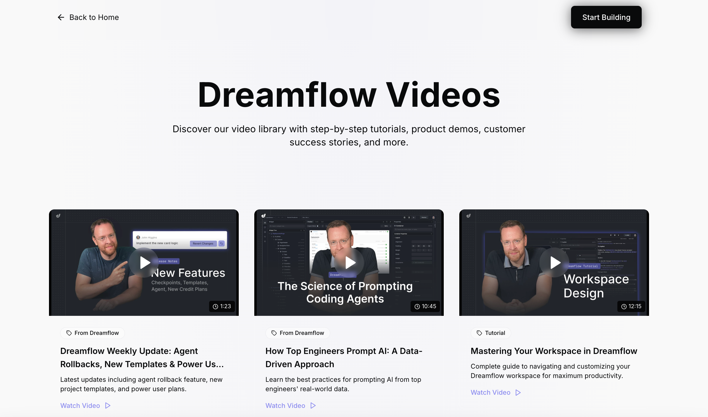

The **Dreamflow** website also features a dedicated video section compiling all official tutorials, making it easy for users to systematically learn the tool.

### [Reddit Community](https://www.reddit.com/r/DreamFlow/)

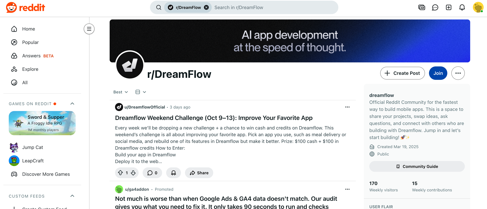

**Dreamflow** has its own **Reddit** community where users share experiences, showcase projects, and provide feedback.
It serves as an important hub for product-user interaction and community growth.

## Pricing

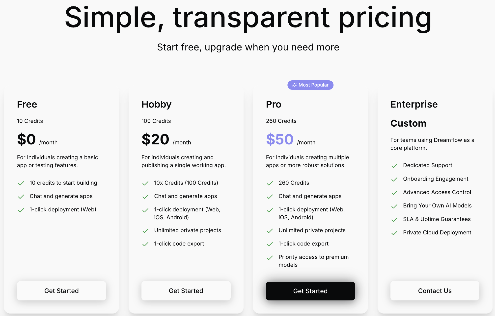

**Dreamflow** offers four pricing tiers based on available **credits** and feature access.

**Free users** get 10 **credits per day** and can deploy once on the **web**.
However, to unlock advanced features — such as exporting code or deploying to mobile (App Store / Play Store) — users must upgrade to a paid plan.

A key differentiator is that **higher-tier users get access to more advanced AI models**, which can directly influence the **quality, complexity, and completeness** of generated apps and code. This makes model access one of the most critical aspects of the pricing structure.

## Page Interaction

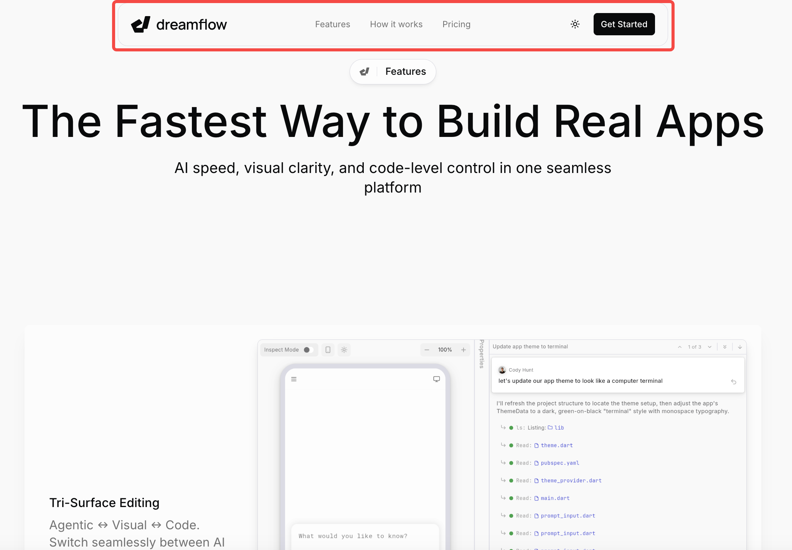

Finally, it’s worth noting the **interaction design** of the Dreamflow website.
The site intentionally keeps a minimal number of pages, consolidating all essential information into a single main page to reduce user drop-off during navigation.

Thus, the top navigation menu — **Features**, **How it works**, and **Pricing** — doesn’t lead to new pages but uses URL **anchors (`#`)** to smoothly scroll to each section.

Additionally, the navigation bar remains **sticky** at the top as users scroll, ensuring quick access to other sections and improving the single-page navigation experience.

