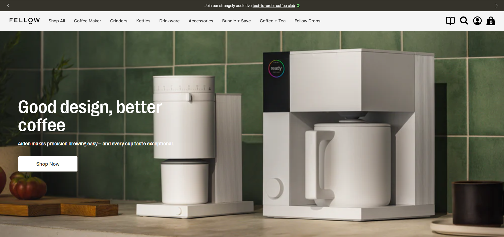
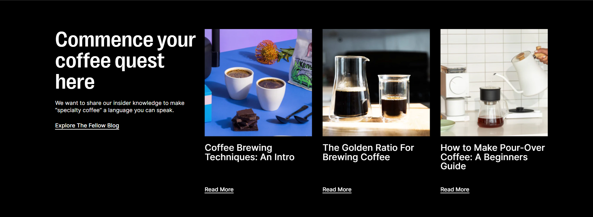
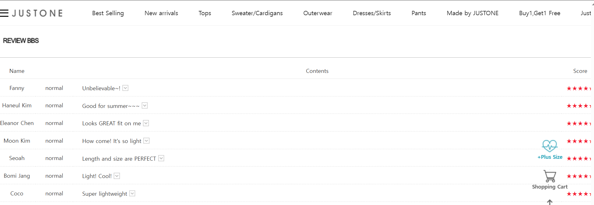
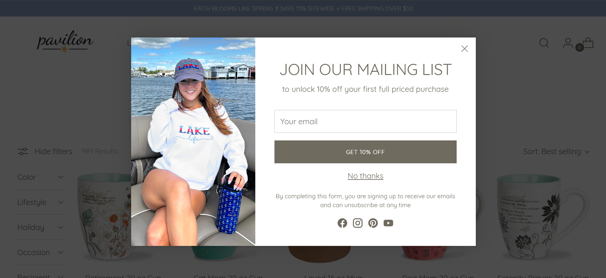

# E-commerce Landing Page Conversion Secrets: How to Drive Sales Effectively

## What is an E-commerce Landing Page?
### Definition  
**An independent page accessed directly by users through ads/external links**  
- **Direct Access Point**: Users click from external channels like ads, social media links, or search results, jumping directly to this page without passing through the homepage or intermediate pages.  
- **Independent Design**: Content focuses entirely on a single theme, with no navigation links to other pages.  

### Core Objectives  
**Address specific user needs and drive targeted actions**  
- **Demand Matching**: Directly display content related to user interests (e.g., "Women's Jeans Limited-Time Offer" in ad copy) to avoid information mismatch.  
- **Action Guidance**:  
  - **Direct Conversion**: Immediate purchases after clicking ads.  
  - **Indirect Nudging**: Guide membership sign-ups (for remarketing) or coupon claims (to boost future purchases).  

## E-commerce Landing Page vs Homepage vs Product Page  
Key functional and design differences between these pages:  

### Homepage: Brand Showcase & Navigation Hub  
- **Core Functions**  
  - Display brand identity, product categories, and promotional overviews.  
  - Guide users to other sections (e.g., product categories, campaign pages).  
- **User Intent**  
  - Users may be casually browsing or initially exploring the brand.  
- **Design Features**  
  - Diverse information: Brand story, new arrivals, navigation menus.  
  - Weak CTAs: Users self-direct their next steps (e.g., clicking categories).  
- **Example Scenario**  
  - Users manually enter the brand's URL, then navigate to "Women's Section".  

### Product Page: Single Item Details  
- **Core Functions**  
  - Display detailed product information (specs, pricing, inventory, reviews).  
  - Directly drive purchases of the item.  
- **User Intent**  
  - Interested in a product but need more details to decide.  
- **Design Features**  
  - Vertical content: Multi-angle images, spec comparisons.  
  - Strong CTAs: Prominent "Buy Now" or "Add to Cart" buttons.  
- **Example Scenario**  
  - Users click "Men's Running Shoes Model X" from search results, check sizing charts, then purchase.  

### Landing Page: Hyper-Focused Conversion Machine  
- **Core Functions**  
  - Address specific needs from targeted channels (ads/emails) to drive conversions.  
  - Eliminate distractions by removing unrelated content.  
- **User Intent**  
  - Attracted by ads/links but need final persuasion.  
- **Design Features**  
  - Single-goal design: Entire page focuses on one action (e.g., purchase/coupon claim).  
  - Context alignment: Content perfectly matches the source link (e.g., ad copy).  
- **Example Scenario**  
  - Users click a "Buy 1 Get 1 Free Spring Shirts" ad, see product styles/promotion rules instantly, and complete checkout within 30 seconds.  

### Side-by-Side Comparison  
| **Dimension**       | **Homepage**                | **Product Page**            | **Landing Page**            |  
|----------------------|-----------------------------|------------------------------|------------------------------|  
| **Entry Source**     | Direct URL/Bookmark         | Site Search/Category Links   | Ads/External Links           |  
| **User State**       | Exploratory/No Clear Goal   | Initial Product Interest     | Clear Demand from Ads        |  
| **Core Content**     | Branding & Navigation       | Single Product Details       | Targeted Offer + CTA         |  
| **Page Flow**        | Guide Exploration           | Encourage On-Page Purchase   | Eliminate Distractions       |  
| **Key Elements**     | Navigation Bars, Banners    | Product Images, Specs        | Countdowns, Coupon Popups    |  

## 4 Types of E-commerce Landing Pages & Use Cases  
### Top of Funnel (ToF) Landing Page  
- **Target Users**: First-time visitors (e.g., via ads/social media).  
- **User Profile**: Unfamiliar with the brand, vague needs (e.g., "Looking for a thermos but unsure about brands").  
- **Design Focus**:  
  - **Value Proposition**: Simplify brand strengths (e.g., "10 Years in Baby Products").  
  - **Lower Barriers**: Free trials, samples, or educational content.  
- **Strategies**:  
  - Educational content: "How to Choose the Right Baby Bottle".  
  - Risk-free offers: "Free Sample - Pay Only If Satisfied".  
- **Example**: [Fellow](https://fellowproducts.com/) uses its homepage as a brand keyword landing page. The hero section states: "Good design, better coffee":  
  
An education section shares coffee expertise (e.g., roasting techniques) to build authority:  
  

### Mid-Funnel (MoF) Landing Page  
- **Target Users**: Engaged prospects (e.g., viewed products/signed up but didn't buy).  
- **User Profile**: Interested but skeptical (e.g., concerns about quality/price).  
- **Design Focus**:  
  - **Resolve Doubts**: Show certifications, reviews, comparison charts.  
  - **Build Trust**: Highlight guarantees (e.g., "7-Day Returns").  
- **Strategies**:  
  - Customer review sections with photos.  
  - Comparison guides: "Thermos Model A vs B Performance Sheet".  
- **Example**: [JUSTONE](https://justonekorea.kr/Product/Detail/view/pid/57502/cid/827) details product features (quick-dry, lightweight), size charts, and care instructions, with authentic reviews at the bottom:  
  

### Bottom-Funnel (BoF) Landing Page  
- **Target Users**: High-intent users (abandoned carts/repeated visits).  
- **User Profile**: Ready to buy but need final push (e.g., price hesitation).  
- **Design Focus**:  
  - **Urgency Triggers**: Limited-time discounts, low-stock alerts.  
  - **Simplified Flow**: One-click buttons, hidden navigation.  
- **Strategies**:  
  - Countdown timers: "02:19:36 Left for 50% Off".  
  - Auto-applied coupons on page entry.  
- **Example**: [Pavilion](https://paviliongift.com/collections/mugs-cups) shows a 10% discount popup for first-time visitors who provide emails:  
  

### Already Purchased Landing Page  
- **Target Users**: Repeat customers (e.g., skincare product buyers).  
- **User Profile**: Brand-loyal with potential cross-sell needs (e.g., replenishables).  
- **Design Focus**:  
  - **Loyalty Building**: VIP tiers (e.g., "Gold Member Free Shipping").  
  - **Personalized Recommendations**: "Customers who bought A also bought B".  
- **Strategies**:  
  - Replenishment reminders: "Your Shampoo Will Run Out in 30 Days".  
  - Exclusive member events: "Double Points Every Tuesday".  

#### Landing Page Alignment with User Journey  
| **Stage**       | **User Mindset**           | **Landing Page Goal**         |  
|------------------|----------------------------|--------------------------------|  
| ToF (Awareness) | "What is this brand?"      | Educate & Lower Barriers       |  
| MoF (Consideration)| "Is this product good?"    | Provide Proof & Build Trust    |  
| BoF (Decision)  | "Is now the best time?"    | Create Urgency                 |  
| Retention       | "When to repurchase?"      | Encourage Repeat Purchases     |  

## User Segmentation & Targeted Delivery Strategies  
### Key Segmentation Dimensions  
#### 1. Behavioral Data (Dynamic Actions)  
Track real-time interactions to gauge intent:  
- **Engagement Metrics**:  
  - Page types viewed (product/blog/help center), dwell time, bounce rate.  
  - Click heatmaps (e.g., video plays, comparison tools).  
  - Scroll depth (content attractiveness assessment).  
- **Purchase Behavior**:  
  - Cart abandonment frequency/duration.  
  - Order frequency (high/low).  
  - Return rates by category (e.g., apparel sizing issues).  
- **Content Preferences**:  
  - Product categories (e.g., beauty/electronics).  
  - Content formats (video/text/UGC).  
  - Discount responsiveness.  

#### 2. Traffic Sources (Channel Attributes)  
Match content to channel characteristics:  
- **Paid Ads**:  
  - **Search Ads (Google)**: Keyword-driven demand → Direct product displays.  
  - **Social Ads (Meta/TikTok)**: Visual appeal → Interactive elements (short videos).  
  - **Retargeting Ads (Criteo)**: Highlight abandoned actions (e.g., price drops).  
- **Organic Traffic**:  
  - **SEO**: Long-tail queries (e.g., "best budget laptop") → Comparison guides.  
  - **Social Organic**: KOL/content hashtags → Source-aligned pages.  
- **Direct Traffic**:  
  - Loyal users → Member-exclusive content.  

#### 3. User Attributes (Static Traits)  
Demographic-based targeting:  
- **Demographics**: Age, gender, occupation, income.  
- **Geographics**:  
  - Location/climate (e.g., winter gear for Nordic users).  
  - Cultural factors (language, holidays, taboos).  
- **Device Data**:  
  - Mobile (simplified flows) vs Desktop (information density).  
  - Browser language → Auto-translated pages.  

#### Implementation Principles  
1. **Cross-Dimension Analysis**: Combine tags (e.g., "high-value + social traffic + mobile") for hyper-personalization.  
2. **Dynamic Updates**: Adjust segments based on behavior changes (e.g., new → repeat buyer).  
3. **Priority Order**: Behavior > Traffic Source > User Attributes (real-time intent first).  

### Landing Page Matching Strategies  
#### New Users → ToF Landing Pages  
**Goal**: Build trust & reduce friction.  
- **Identification**:  
  - First-time visitors (no cookies/ID history).  
  - From brand ads or branded searches.  
- **Design**:  
  - Trust signals: "Featured in Forbes", "1M+ Customers Served".  
  - Low-commitment CTAs: Free trials, no-questions returns.  
  - Minimal navigation.  
- **Channels**: Google Brand Ads, Meta Brand Awareness Ads, Welcome Emails.  

#### Returning Visitors → MoF/BoF Pages  
**Goal**: Accelerate decision-making.  
- **Interest Stage (Viewed 3+ Items)**:  
  - Content: Product comparisons, expert reviews.  
  - Hook: Free eBook download for email capture.  
- **Decision Stage (Cart Abandoners)**:  
  - Content: Limited stock alerts, one-click checkout.  
  - Hook: Auto-displayed discount codes.  
- **Channels**: Meta Dynamic Ads, Cart Abandonment Emails.  

#### Loyal Customers → Retention Pages  
**Goal**: Increase lifetime value.  
- **Identification**:  
  - ≥1 historical order + active cycle (e.g., skincare repurchases every 3 months).  
  - Loyalty program members.  
- **Design**:  
  - AI-powered recommendations ("Bought A? Try B!").  
  - VIP perks: Free shipping, point redemptions.  
  - Replenishment reminders.  
- **Channels**: Loyalty Emails, App Notifications.  

## Integration with Marketing Ecosystem  
### 1. Cross-Channel Consistency  
- **Ad-to-Page Alignment**:  
  - Ensure promises (e.g., "50% Off") are immediately visible on landing pages.  
  - Maintain visual continuity (colors, fonts, imagery).  
- **Unified User Journey**:  
  - Example flow:  
    1. User clicks TikTok ad → Landing Page.  
    2. If no purchase, send Klaviyo email with BoF page link.  
    3. Post-purchase → Redirect to upsell page.  
  - Multilingual consistency: Match ad/email/page languages.  

### 2. Data Integration & Tracking  
- **CRM Synchronization**:  
  - Record user actions (views, cart adds, form fills) via Salesforce/HubSpot.  
  - Auto-tag users (e.g., "Cart Abandoner").  
- **UTM Parameter Tracking**:  
  - Tag ad links (e.g., `utm_source=google_ads`).  
  - Analyze version performance via Google Analytics 4.  
  - Optimize based on conversion rates (e.g., video ads outperform images by 30%).  

### 3. Long-Term Journey Management  
- **Dynamic Page Allocation**:  
  - Use CRM data to serve stage-specific pages (e.g., post-registration → MoF page).  
  - Tools: CDPs like Segment for real-time updates.  
- **Post-Purchase Flow**:  
  - Auto-redirect to upsell pages (e.g., "Phone Buyers → Recommended Earphones").  
  - Dormant user reactivation: Retarget with "Exclusive Comeback Offers".  
