# 13 Best Habit Tracker App in 2024 (Features, Pros, Cons, Pricing)

Healthy habits are more important than ever for achieving both personal and professional progress in today's fast-paced world. Selecting the best habit tracker app might be overwhelming due to the large number of options available.
 There is an app for every type of user, be it a data enthusiast who wants to examine every aspect of your progress, a gamer who wants to add a playful element to work, or someone who wants to make routine creation simple. 
This article examines the top habit tracker applications in a variety of categories, including information on their salient characteristics, advantages, disadvantages, and role-fitness. Find the ideal app to help you on your path to improved habits and increased productivity, whether you're a minimalist or a gamification enthusiast.

## The best habit tracker apps for 2024 at a glance

<table>
    <tr>
        <td></td>
        <td>Free or not</td>
        <td>Supported platform</td>
   </tr>
    <tr>
        <td>Habit Tracker</td>
        <td>Free - Offers In-App Purchases</td>
        <td>Mac, iOS</td>
   </tr>
    <tr>
        <td>Streaks</td>
        <td>$5.99</td>
        <td>Mac, iOS</td>
   </tr>
    <tr>
        <td>HabitNow</td>
        <td>Free - Offers In-App Purchases</td>
        <td>Mac, iOS</td>
   </tr>
    <tr>
        <td>Way of Life</td>
        <td>Free - Offers In-App Purchases</td>
        <td>Mac, iOS</td>
   </tr>
    <tr>
        <td>Loop Habit Tracker</td>
        <td>Free</td>
        <td>Android</td>
   </tr>
    <tr>
        <td>Habit Tracker - Habit Diary</td>
        <td>Free - Offers In-App Purchases</td>
        <td>Android</td>
   </tr>
    <tr>
        <td>Habitify</td>
        <td>Free - Offers In-App Purchases</td>
        <td>Mac, iOS, Android</td>
   </tr>
    <tr>
        <td>Superhabit</td>
        <td>Free - Offers In-App Purchases</td>
        <td>iOS, Android</td>
   </tr>
    <tr>
        <td>Habitica</td>
        <td>Free - Offers In-App Purchases</td>
        <td>iOS, Android</td>
   </tr>
    <tr>
        <td>Conjure Habits</td>
        <td>Free - Offers In-App Purchases</td>
        <td>Web, Windows, Mac, iOS, Android</td>
   </tr>
    <tr>
        <td>HabitBull</td>
        <td>Free - Offers In-App Purchases</td>
        <td>iOS, Android</td>
   </tr>
    <tr>
        <td>Strides</td>
        <td>Free - Offers In-App Purchases</td>
        <td> iOS</td>
   </tr>
    <tr>
        <td>Productive</td>
        <td>Free - Offers In-App Purchases</td>
        <td>iOS, Android</td>
   </tr>
</table>

### 1. Habit Tracker (iOS)

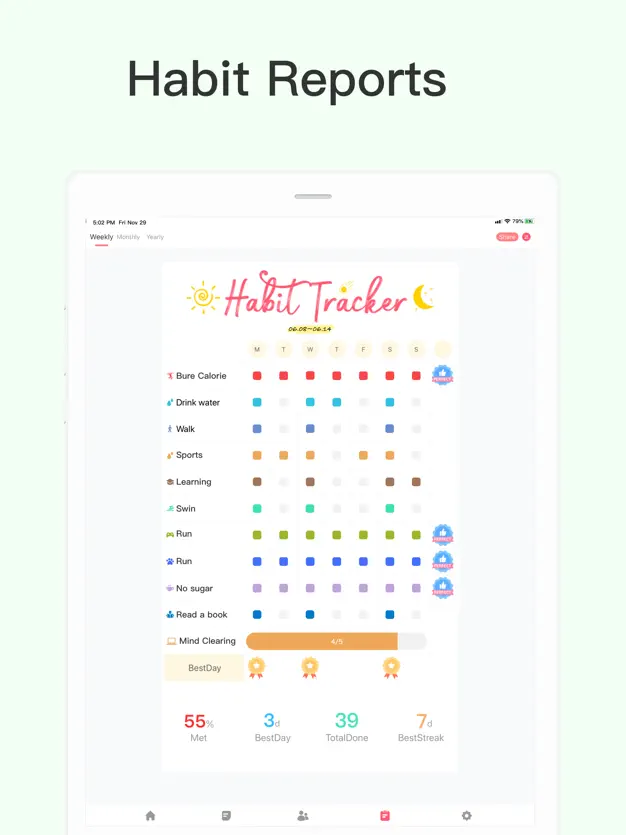
[Habit Tracker (iOS)](https://apps.apple.com/us/app/habit-tracker/id1438388363) - A versatile app designed to help users build habits and reach goals with reminders, stats, and notes.
**Key Features:**
- Customizable habit tracking
- Reminders to keep you on track
- Statistics to monitor progress
- Note-taking for each habit

**Pros:**
- User-friendly interface
- Customization options enhance personal tracking experience
- Integrated note-taking provides context for your progress

**Cons:**
- iOS only, limiting access for Android users
- May lack advanced analysis features found in some competitors

**Integration:**
- Primarily standalone; no major third-party integrations mentioned

**Pricing:**
- Often offers a free version with basic features; premium features may require a purchase or subscription. Exact pricing should be checked in the App Store.

### 2. Streaks (iOS)

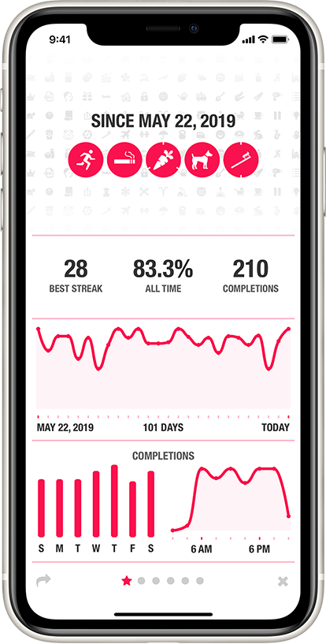

[Streaks (iOS)](https://streaksapp.com/) is Ideal for iPhone users looking to maintain long streaks in their habit formation with a minimalist interface.
**Key Features:**
- Track up to 12 tasks you want to complete each day
- Simple, minimalist interface
- Task icons and customization
- Integration with Health app (for fitness-related tasks)

**Pros:**
- Focus on maintaining long streaks can be very motivating
- Health app integration is great for fitness goals
- Highly intuitive design

**Cons:**
- Limited to 12 tasks might not be enough for power users
- Only available on iOS

**Integration:**
- Integrates with Apple's Health app

**Pricing:**
- Paid app - $5.99.

### 3. HabitNow (Android)
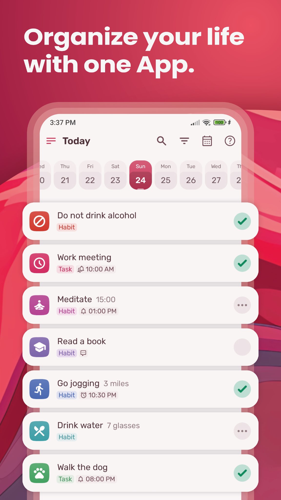

[HabitNow (Android)](https://play.google.com/store/apps/details?id=com.habitnow&hl=en_US) - a comprehensive habit tracker for Android users, focusing on daily routines and goal setting.
**Key Features:**
- Daily routine and goal setting
- Detailed statistics and habit tracking
- Backup and restore options
- Customizable reminders

**Pros:**
- Comprehensive tracking and planning tools
- Android focus caters to users outside the iOS ecosystem
- Robust backup features ensure data safety

**Cons:**
- Lack of iOS version limits user base
- UI may feel cluttered due to extensive features

**Integration:**
- Standalone with no significant third-party integrations advertised

**Pricing:**
- Offers both a free version and a premium upgrade. The premium version's cost can be checked on Google Play.

### 4. Way of Life
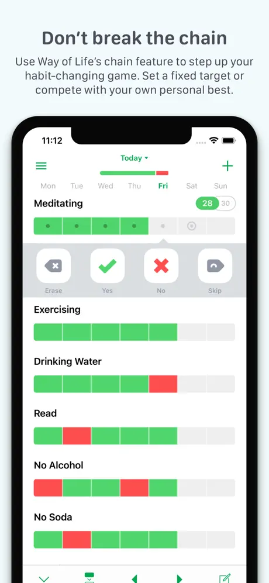

[Way of Life](https://wayoflifeapp.com/) offers extensive data analysis of your habits, making it perfect for those who love detailed tracking.
**Key Features:**
- Extensive data analysis and tracking
- Customizable journaling feature
- Chain building for habit streaks
- Green/red success-failure visualization

**Pros:**
- In-depth tracking suitable for data enthusiasts
- Flexible journaling enhances habit context
- Visual feedback system is easy to understand

**Cons:**
- The detailed approach may be overwhelming for beginners
- Subscription model can be costly over time

**Integration:**
- Limited information on third-party integrations

**Pricing:**
- Free version available
- Premium features available through subscription:
Habify Pro - $8.99
Habit Pro. - $3.49
Habit Promo - $3.99

### 5. Loop Habit Tracker (Android)
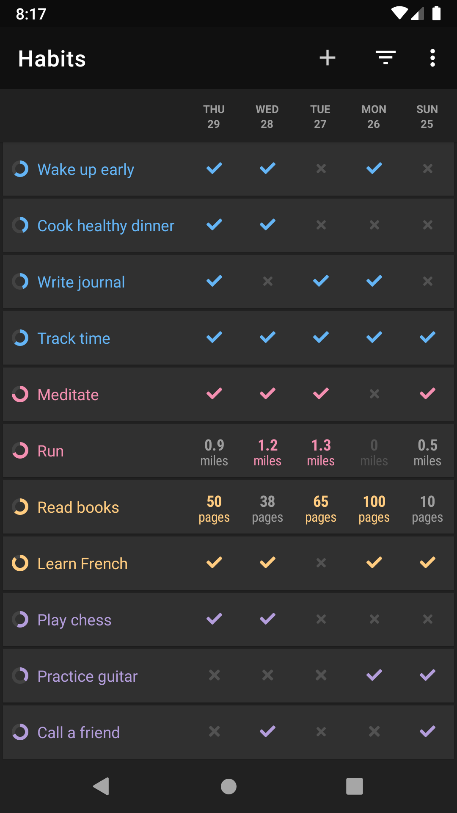

[Loop Habit Tracker (Android)](https://play.google.com/store/apps/details?id=org.isoron.uhabits&hl=en_US) helps create and maintain good habits with detailed charts and statistics for progress tracking.
**Key Features:**
- Open-source and ad-free
- Simple, clean interface
- Detailed graphs and statistics
- Habit score calculation to measure consistency

**Pros:**
- Completely free to use with no ads
- Open-source nature allows for community contributions
- Focus on simplicity while still offering depth in tracking

**Cons:**
- Android only, excluding iOS users
- Lacks integration with other apps or services

**Integration:**
- As an open-source project, it doesn't natively integrate with commercial services but offers export options.

**Pricing:**
- Free

### 6. Habit Tracker - Habit Diary (Android)
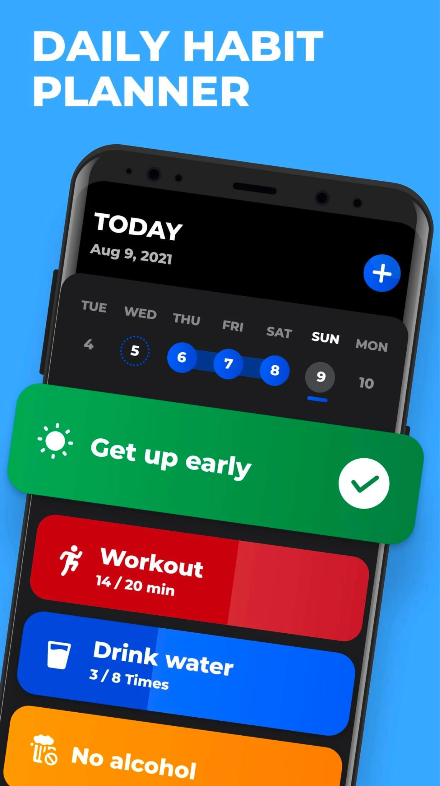

[Habit Tracker - Habit Diary (Android)](https://play.google.com/store/apps/details?id=habittracker.todolist.tickit.daily.planner&hl=en_US) provides intuitive and useful statistics to track and analyze progress, boosting motivation with streaks and rewards.

**Key Features:**
- Intuitive statistics for tracking progress
- Motivational streaks and rewards system
- Customizable reminders

**Pros:**
- User-friendly interface makes it easy to navigate
- Motivation boosted through rewards and streaks

**Cons:**
- Limited to Android users
- May lack some advanced features for power users

**Integration:**
- Mainly standalone with no significant third-party integrations

**Pricing:**
- Free to use, but may offer in-app purchases for additional features

### 7. Habitify
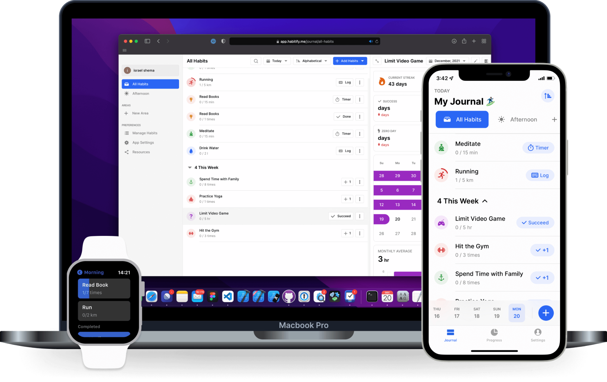

[Habitify](https://www.habitify.me/) - a cross-platform habit tracker that is free to use, offering organization, tracking, and motivational tools.

**Key Features:**
- Cross-platform availability (iOS, Android, Mac, Web)
- Organizational tools for tracking habits
- Motivational tools including reminders and progress stats

**Pros:**
- Available on multiple platforms, offering wide accessibility
- Simple, clean interface

**Cons:**
- Some advanced features might require a premium subscription
- May not be as feature-rich as some specialized apps

**Integration:**
- Offers some integration, especially for Apple ecosystem products

**Pricing:**
- Free version available
- Premium features accessible through subscription:
1 Month Premium - $4.99
Lifetime Premium Membership - $59.99
One Year Premium - $27.99
Lifetime Premium Membership - $29.99
One Year Premium - $17.49
Lifetime Premium Membership - $47.99
One Year Premium - $34.99
Lifetime Premium Membership - $49.99
3 Months Premium - $10.99
Lifetime Premium Membership - $39.99

### 8. Superhabit
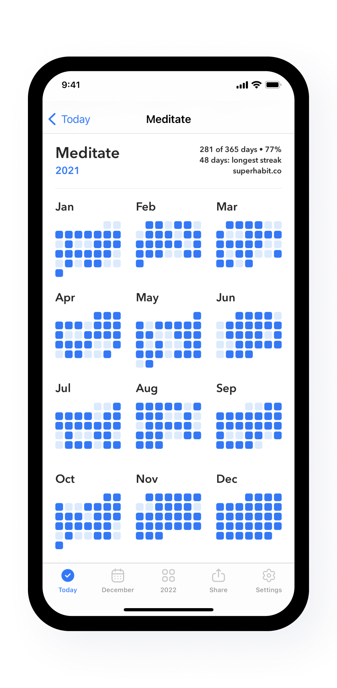

[Superhabit](https://www.superhabit.co/) focuses on building super habits with a user-friendly interface and motivational systems.

**Key Features:**
- User-friendly interface
- Motivational systems including progress tracking

**Pros:**
- Focus on building "super habits" can be very motivating
- Simple to use

**Cons:**
- Newer on the market, so may have fewer features than established apps
- Limited information on cross-platform availability

**Integration:**
- Primarily standalone; no major third-party integrations mentioned

**Pricing:**
- Free version available
- Subscription option:
Super Habit Premium Yearly - $19.99
Super Habit Premium Lifetime - $39.99
Super Habit Premium Monthly - $5.99
Super Habit Premium - $8.99
Super Habit Premium Lifetime - $8.99
Super Habit Premium Monthly - $5.99
Super Habit Premium - $19.99
Super Habit Premium Lifetime - $19.99
Super Habit Premium Monthly - $5.99
Super Habit Premium Yearly - $19.99

### 9. Habitica
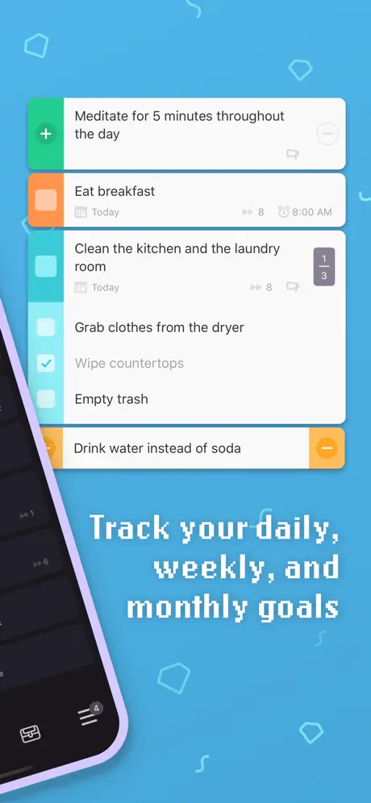

[Habitica](https://habitica.com/) gamifies your habit-tracking experience, turning daily goals into a fun RPG game to keep you engaged.

**Key Features:**
- Gamification of habit tracking
- RPG elements like avatars, battles, and quests
- Community features for support and motivation

**Pros:**
- Makes habit tracking fun and engaging
- Strong community support

**Cons:**
- The game aspect might be distracting for some users
- Could be complex for users looking for a simple tracker

**Integration:**
- Integrates with some productivity apps and services

**Pricing:**
- Free to use with optional in-app purchases for customization and advanced features:
1 Month Subscription - $4.99
4 Gems - $0.99
21 Gems - $4.99
3 Months Subscription - $14.99
42 Gems - $9.99
84 Gems - $19.99
12 Months Subscription - $47.99
6 Months Subscription - $29.99
For 1 Month - $4.99
For 12 Months - $47.99

### 10. Conjure Habits
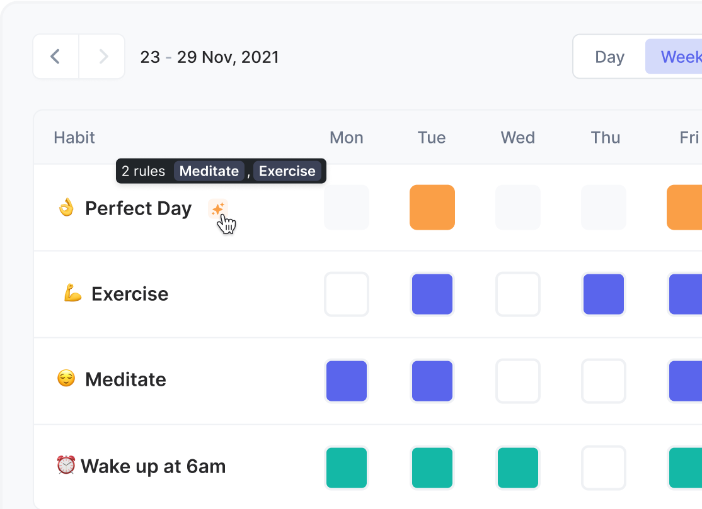

[Conjure Habits](https://conjure.so/) offers unique tools and interfaces to make habit formation feel magical and rewarding.

**Key Features:**
- Unique, magical-themed interface
- Tools and features designed to make habit formation engaging

**Pros:**
- Innovative approach to habit tracking
- Engaging interface and concept

**Cons:**
- Niche appeal may not suit everyone
- Limited information on features and integration

**Integration:**
- Mainly standalone; specific integration features are not detailed

**Pricing:**
- Pricing details are scarce; check the app store for updates.

### Not Boring Habits

Designed to make habit tracking engaging and fun, ensuring that routine doesn't turn monotonous.

**Key Features:**
- Engaging and fun interface
- Designed to make habit tracking less monotonous

**Pros:**
- Focus on making routine activities engaging
- User-friendly design

**Cons:**
- Details on features and cross-platform availability are limited
- Might lack depth for those seeking detailed analytics

**Integration:**
- Appears to be standalone without major integrations

**Pricing:**
- Free Plan available.
- Paid plan from $8/month

### 11. HabitBull
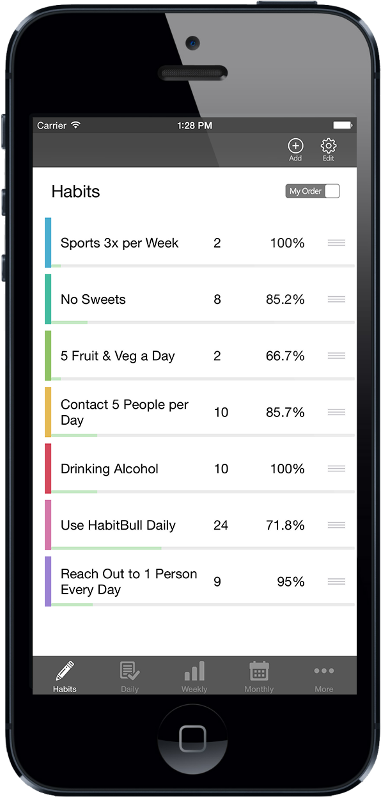

[HabitBull](https://www.habitbull.com/) provides detailed tracking options and motivational tools across multiple platforms.

**Key Features:**
- Detailed tracking and motivational tools
- Available on multiple platforms

**Pros:**
- Comprehensive tracking options
- Supports a wide range of habits and goals

**Cons:**
- Interface might feel overwhelming due to the abundance of features
- Some users report sync issues across devices

**Integration:**
- Limited information on third-party integrations

**Pricing:**
- Offers a free version; premium features are available through subscription:
1 year subscription - USD 19.99
Premium - USD 5.99

### 12. Strides
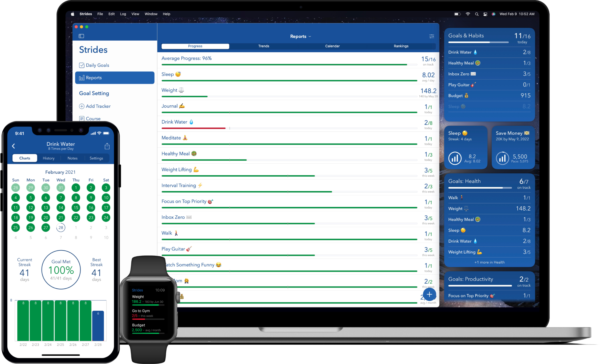

[Strides](https://www.stridesapp.com/) - a flexible and powerful tracker for setting and tracking any kind of habit or goal.

**Key Features:**
- Flexible tracking for any kind of habit or goal
- Powerful reminders and alerts

**Pros:**
- Highly customizable to fit various tracking needs
- Offers both habit and goal tracking

**Cons:**
- Primarily available on iOS, limiting access for Android users
- Some advanced features locked behind a paywall

**Integration:**
- Limited information on integrations

**Pricing:**
- Free version available; Strides Plus offers more features with a subscription model, starting from $4.99.

### 13. Productive
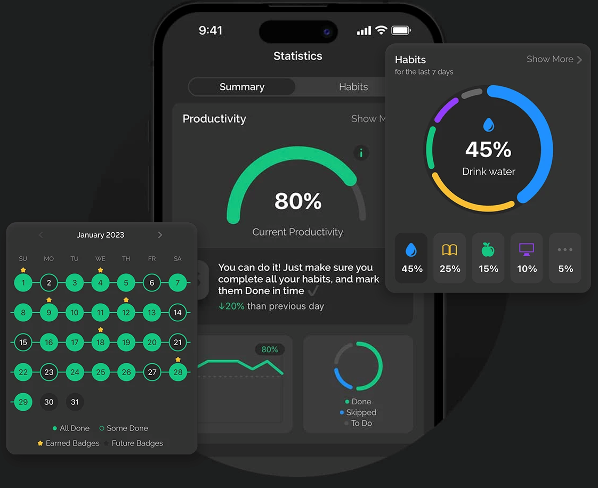

[Productive](https://productiveapp.io/) offers scheduling and reminders for habits, helping users be more productive and maintain daily routines.

**Key Features:**
- Scheduling and reminders for habit consistency
- Insightful statistics to monitor progress

**Pros:**
- Helps users maintain daily routines effectively
- Intuitive and visually appealing interface

**Cons:**
- Advanced features require a subscription
- Availability may be limited to iOS

**Integration:**
- Primarily standalone, with minimal external integrations

**Pricing:**
- Free version available; premium subscription offers more features, starting from $10.99.

## Recommended habit tracker app for different people

Based on the context provided by recent web and news searches, here is a breakdown of recommended habit tracker apps for different roles or needs, leveraging insights from various sources:

### For Gamification Enthusiasts: Habitica
**Key Features:** Habitica turns your daily tasks and habits into a role-playing game, providing motivation through rewards and penalties to keep you on track. It's ideal for those who thrive on games and competition.
- **Pros:** Engaging RPG elements; strong community for support and accountability.
- **Cons:** The gamified approach might not appeal to everyone.

### For Detailed Analytics: HabitBull
**Key Features:** Offers comprehensive tracking options and detailed analytics across multiple platforms, making it suitable for those who love diving into data to monitor their progress.
- **Pros:** Extensive customization and analytics; cross-platform support.
- **Cons:** May be overwhelming for beginners due to its depth of features.

### For Simplicity and Ease of Use: HabitNow
**Key Features:** Takes a straightforward, no-frills approach to habit tracking, focusing on simplicity while still offering essential features like setting daily, weekly, or monthly goals.
- **Pros:** User-friendly interface; flexibility in habit scheduling.
- **Cons:** Lacks some of the more advanced features found in other apps.

### For Cross-Platform Users: Strides
**Key Features:** Strides is praised for its flexibility and power in tracking any kind of habit or goal, with robust reminders and alerts to keep you on track.
- **Pros:** Highly customizable; offers both habit and goal tracking.
- **Cons:** Primarily available for iOS, which may limit Android users.

### For Time Tracking: Clockify
**Key Features:** Best for those interested in tracking the time spent on their habits and tasks, Clockify provides insights into how you allocate your time throughout the day.
- **Pros:** Excellent for productivity and time management; free to use.
- **Cons:** Focuses more on time tracking than on habit formation itself.

### For Building Daily Routines: DailyHabits
**Key Features:** Focuses on integrating habits seamlessly into your lifestyle, with customizable tracking options to fit personal preferences and routines.
- **Pros:** Customizable and flexible; designed to fit habits into your daily life.
- **Cons:** Specific details on features and platform availability are limited.

### For Minimalists: Streaks
**Key Features:** Streaks is an award-winning app that helps you build habits with a clean, minimalist interface, limiting you to track up to twelve tasks a day.
- **Pros:** Simple, intuitive design; integration with Health app for fitness tasks.
- **Cons:** Limited number of tasks may not be sufficient for power users.

### For Productivity: Productive
**Key Features:** Offers scheduling and reminders for habits, helping users be more productive and maintain daily routines with an intuitive and visually appealing design.
- **Pros:** Encourages routine maintenance; insightful stats.
- **Cons:** Premium features require a subscription.

