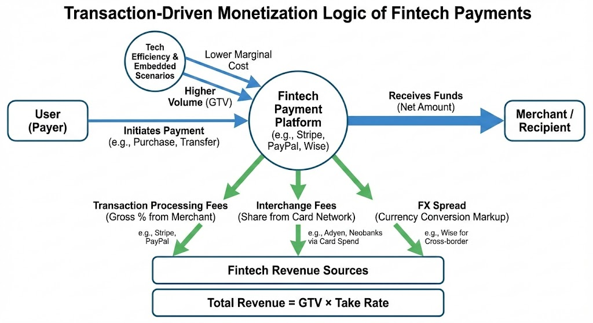

# How Does Fintech Make Money?

Although financial technology (Fintech) has transformed the way financial services are delivered, it has not fundamentally changed the underlying logic of monetization. The profit model of Fintech companies can be summarized as: **“the essence of financial services + cost reduction, efficiency gains, and traffic monetization enabled by technology.”**

Despite typically being packaged as highly digitalized apps or platforms, their core revenue models are still deeply rooted in the traditional “three pillars” of finance: **payments, credit, and wealth management**.

* **Payments:** Generating revenue through transaction fees, interchange fees, or foreign exchange spreads by providing efficient clearing and settlement services.
* **Credit:** Monetizing the time value of money through interest income, late fees, or loan origination and facilitation fees.
* **Wealth Management:** Earning asset management fees, trading commissions, or distribution commissions by helping users preserve and grow their capital.

## Payments: A Transaction-Driven Monetization Model

Payments sit at the starting point of all financial activities and represent the Fintech segment with the highest user touch frequency and the deepest data accumulation. The core monetization logic of payments lies in **rate-based revenue extracted from the flow of funds**.

The general revenue formula is:
**Revenue = GTV (Gross Transaction Volume) × Take Rate**

### Core Revenue Sources

* **Transaction Processing Fees:**
  This is the most fundamental revenue stream. When a consumer completes a payment at a merchant, the acquiring bank or payment gateway charges a percentage fee on the transaction amount.
  **Case: Stripe and PayPal.** By offering simple and developer-friendly integration (technology-driven efficiency), they attract millions of merchants of all sizes and generate massive revenue through per-transaction percentage fees (typically around 2.9% plus a fixed fee).

* **Interchange Fees:**
  Within card network clearing systems (such as Visa and Mastercard), transaction fees are distributed among participating parties. As card issuers or digital wallet providers, Fintech companies can capture a portion of these fees.
  **Case: Adyen and various neobanks.** When users pay with virtual or physical cards issued by these platforms, part of the merchant service fee flows back to them.

* **Foreign Exchange (FX) Spread:**
  In cross-currency settlement scenarios, platforms typically add a spread on top of the mid-market exchange rate.
  **Case: Wise (formerly TransferWise).** While Wise is known for transparent pricing, its core profitability still comes from large-scale cross-border transfer fees—significantly lower than traditional banks—and competitive FX conversion margins.

### Technology-Driven Leverage Effects

* **Scalable Reduction in Marginal Costs:**
  Traditional banks rely on complex clearing layers and manual reconciliation. Fintech companies, through cloud-native payment infrastructures, achieve near-flat system operating costs whether processing one transaction or one million. This ultra-low marginal cost enables high profitability through scale.

* **Traffic Monetization via Embedded Payments:**
  Technology allows payments to be invisibly embedded into non-financial scenarios.
  **Case: Grab.** As a Southeast Asian super app, Grab accumulates massive payment volume through ride-hailing and food delivery via GrabPay. By embedding payments within its ecosystem, Grab reduces internal fund-processing costs while monetizing scenario traffic by offering acquiring services to external merchants.

* **Higher Take Rates via Value-Added Services:**
  Pure payment channel fees are becoming increasingly transparent and standardized. Fintech companies enhance overall value by offering add-on services such as fraud detection, automated reconciliation, and tax calculation, allowing them to charge premiums above basic processing fees.

Payments are inherently a **high-frequency, low-margin** business. As a result, mature payment-focused Fintech companies rarely stop at transaction fees alone. Instead, they leverage the **high-frequency user touchpoints and capital float** generated by payments to drive higher-margin credit or wealth management products. This shift—from traffic entry point to value center—is critical to achieving long-term profitability.

## Credit Business: Balance Sheet Management and Risk Pricing Monetization

Credit is the segment with the most significant profit potential within the Fintech industry. Its core business logic lies in leveraging the time value of money while using technology to optimize risk costs.

Before analyzing credit profitability, it is necessary to understand the following key metrics:

* **Net Interest Margin (NIM):**
  This refers to the ratio of net interest income—calculated as loan interest income minus deposit interest expenses (or funding costs)—to earning assets. It directly reflects the profitability of credit operations.

* **OPEX (Operating Expenses):**
  Operating expenses refer to the costs required to sustain daily business operations, including expenditures such as R&D personnel salaries, server maintenance, and administrative expenses.

* **Alpha Returns:**
  In the credit context, Alpha refers to excess returns above the industry average, achieved through more precise risk control and underwriting algorithms.

The core profit logic follows the formula below:
**Profit = Interest Income − Funding Cost − Risk Cost (Bad Debt) − Operating Expenses (OPEX)**

### Main Revenue Sources

* **Interest Spread Income:**
  This is the most traditional profit model. Fintech companies raise low-cost funds (such as customer deposits or bond issuance) and lend them out at higher interest rates.
  **Representative case: SoFi.** The platform absorbs deposits through a digital banking license and provides student loans or personal loans to specific customer segments. Its key advantage lies in shortening capital turnover cycles through fully digitalized processes.

* **Multi-Sided Revenue from Buy Now, Pay Later (BNPL):**
  Credit is deeply embedded into consumption scenarios, allowing platforms to charge both sides of the transaction.
  **Representative cases: Affirm and Klarna.** Their revenues typically consist of merchant-side transaction fees (paid by merchants to boost sales conversion) and consumer-side interest and service fees generated from longer installment plans or late payments.

* **Loan Facilitation and Technology Service Fees:**
  The platform does not directly provide funding, but instead acts as an intermediary connecting borrowers with licensed financial institutions.
  **Representative case: Upstart.** By offering AI-driven credit risk models, the platform charges financial institutions technology service fees based on the volume of successfully originated loans. Under this model, Fintech companies do not bear the core credit risk, making it a capital-light operation.

### Profit Optimization Enabled by Technology

* **More Precise Risk Pricing (Alpha Generation):**
  Traditional financial institutions primarily rely on static credit bureau reports, whereas Fintech platforms evaluate borrowers using dynamic, real-time data such as in-app transaction flows and behavioral signals.
  **Impact:** This capability significantly reduces **risk costs (i.e., default rates)** and enables platforms to identify high-quality borrowers who have repayment capacity but are overlooked by traditional banks, thereby capturing excess risk pricing premiums.

* **OPEX Reduction Through Automation:**
  AI-driven credit approval and automated post-loan management substantially compress per-loan processing costs.
  **Impact:** Traditional banks face extremely high labor costs when processing small-ticket loans, often resulting in negative unit economics. In contrast, Fintech platforms incur nearly identical marginal operating costs when processing loans of RMB 1,000 and RMB 1,000,000.

Credit businesses are highly cyclical, with profitability strongly influenced by macroeconomic fluctuations. To stabilize earnings, mature Fintech companies often adopt **asset-backed securitization (ABS)**. This involves pooling illiquid loan assets with predictable future cash flows and converting them into securities tradable in capital markets, enabling early capital recovery and partial risk transfer.

This approach allows Fintech companies to relieve balance sheet pressure and shift their business focus from “earning interest spreads with capital” to “earning service fees with technology.”

## Wealth Management: Monetizing Asset Scale and Commissions

Wealth management is the segment through which Fintech companies generate revenue by providing users with asset allocation services, trading tools, and advisory solutions. The core profit logic lies in **expanding Assets Under Management (AUM) and increasing user trading activity**.

Before deeper analysis, the following key concepts should be clarified:

* **AUM (Assets Under Management):**
  The total market value of assets managed or custodied on behalf of clients by the platform. This is a critical indicator of a wealth management platform’s value.

* **Robo-Advisors:**
  Algorithm- and model-driven services that automatically provide asset allocation recommendations based on users’ risk preferences.

* **PFOF (Payment for Order Flow):**
  A practice where brokers route customer buy and sell orders to specific market makers for execution, in exchange for compensation paid by the market makers.

The core revenue formula can be expressed as:
**Total Revenue = AUM × Management Fee Rate + Trading Volume × Commission Rate (or PFOF) + Margin Balance × Interest Spread**

### Core Revenue Sources

* **Asset Management Fees (AUM-Based Fees):**
  Platforms charge annual fees as a percentage of the total assets held in users’ accounts.
  **Representative case: Betterment.** As a leading robo-advisor platform, Betterment replaces traditional high-cost human advisors with algorithms, allowing it to serve mass-market customers at relatively low annual fees (typically around 0.25%). Its profitability is highly dependent on the continuous expansion of AUM.

* **Trading Commissions and Payment for Order Flow (PFOF):**
  **Traditional commission model:** Charging a fixed fee or a percentage per securities transaction.
  **PFOF under the zero-commission model:** Represented by **Robinhood**. While users pay no trading commissions, the platform monetizes large-scale order flow by routing it to market makers in exchange for rebates. This model effectively uses technology to convert “user trading behavior” into a monetizable data asset.

* **Margin Interest:**
  Platforms lend funds or securities to users engaging in leveraged trading and earn interest income.
  **Representative case: Futu.** During periods of high market activity, interest spreads from margin financing often become a core profit driver for such brokerage platforms.

### Profit Optimization Enabled by Technology

* **Long-Tail Effects from the “Democratization” of Financial Services:**
  Technology significantly lowers the barriers to investing. For example, through **fractional shares**, users can invest very small amounts into high-priced stocks.

This allows platforms to reach young users or small-scale investors that traditional banks are unwilling to serve, at extremely low marginal costs. Although individual ARPU is relatively low, a massive user base (PC) can ultimately translate into substantial AUM.

* **Lower Operating Costs Through Automated Asset Allocation:**
  Robo-advisory systems enable automatic portfolio rebalancing and tax-loss harvesting.

Compared with traditional wealth management firms, Fintech platforms do not require large relationship manager teams, resulting in ultra-low marginal operating costs. Once AUM surpasses the breakeven point, incremental assets largely convert into pure profit.

* **Algorithm-Driven Retention and Cross-Selling:**
  By analyzing users’ investment behaviors, platforms can precisely recommend suitable fund products or insurance services.

This increases capital retention within the platform and enhances overall take rates through diversified wealth management offerings.

Wealth management profitability is highly dependent on **market conditions**. In bull markets, increased trading activity and asset appreciation generate dual revenue growth; in bear markets, shrinking AUM and declining trading volumes directly compress revenues.

As a result, mature Fintech wealth platforms often seek to pivot toward **cash management** or **bank-like models**, such as offering high-yield savings accounts, in order to retain user funds during periods of market volatility and maintain earnings stability.

## Technology Enablement and B2B Infrastructure: Monetization via SaaS and APIs

As customer acquisition costs continue to rise in the B2C market, many Fintech companies have shifted toward the B2B segment, monetizing by providing technical infrastructure to financial institutions and enterprises. Revenue under this model is typically more stable than retail-facing businesses and features strong customer stickiness.

Before analyzing this model, the following core concepts should be clearly defined:

* **API (Application Programming Interface):**
  A set of rules that allows different software systems to communicate with one another. Fintech companies use APIs to enable clients to access financial capabilities as easily as “plugging into utilities” such as water or electricity.

* **SaaS (Software as a Service):**
  A cloud-based delivery model in which clients do not need to purchase hardware or build underlying infrastructure. Instead, they access financial systems—such as clearing or compliance platforms—through subscriptions.

* **White-Label Services:**
  A model in which a Fintech company develops a complete financial product (e.g., a banking app) that other companies can rebrand and operate commercially under their own names.

The core revenue logic follows the formula below:
**Total Revenue = Unit Price × Usage Volume (API Calls) + Subscription Fees + Implementation Fees**

### Main Revenue Sources

* **API Usage Fees (Usage-Based Pricing):**
  Revenue scales automatically with the growth of clients’ business volumes.
  **Representative case: Plaid.** Acting as a data connectivity layer, Plaid allows apps to securely access users’ bank data. Each time a third-party app initiates an account verification or data synchronization, Plaid charges an API call fee.

* **SaaS Subscriptions and Licensing Fees:**
  For complex backend systems, Fintech providers typically adopt monthly or annual fixed-fee pricing models.
  **Representative case: Mambu.** Mambu offers a cloud-native core banking system. Traditional banks do not need to build their own data centers; instead, they can run deposit and lending operations directly on Mambu’s platform by paying a subscription fee.

* **White-Label Technology Licensing and Integration:**
  Enabling non-financial companies to quickly acquire financial capabilities, serving as the technical backbone of **embedded finance**.
  **Representative case: Marqeta.** Marqeta provides card-issuing infrastructure. For example, if a food delivery platform wants to issue instant-settlement debit cards to couriers, it can simply integrate Marqeta’s white-label solution instead of applying for financial licenses on its own.

### Profit Optimization Enabled by Technology

* **Extremely High Scalability:**
  Under the B2B model, platforms maintain a single standardized codebase and API layer. Marginal costs—the additional cost of processing incremental business—decline sharply as client scale increases, enabling exceptionally high profit margins.

* **Lowering Industry Entry Barriers:**
  Traditional financial system development cycles often span years. By exporting mature, modularized technology components, Fintech companies compress this cycle to months or even weeks. This efficiency gain translates directly into stronger pricing power.

* **High Switching Costs:**
  Once a client’s business logic is deeply embedded within a specific API or SaaS system, switching vendors entails significant data migration costs and operational disruption risks. This creates highly resilient long-term cash flows for the platform.

Under the B2B model, Fintech companies no longer directly manage **financial risk**, but rather **technology services**. Their profit and loss performance is no longer directly exposed to macro-level default rate fluctuations, but instead depends on the **stability, security, and standard-setting capabilities of their technology**.

The ultimate objective of this model is to transform complex financial functionalities into foundational public infrastructure—much like cloud services in the internet era.

## Conclusion: The Sustainability of Fintech Business Models

The success of Fintech business models does not stem from “disrupting” the essence of finance, but from **digitally restructuring financial logic**. By placing traditional **payments, credit, and wealth management** businesses on top of a technological foundation, companies have achieved exponential gains in operational efficiency. However, long-term profitability requires Fintech firms to strike a balance between technological expansion and financial risk.

### 1. From Scale Expansion to Unit Economics

In the early stages of industry development, many companies relied on heavy subsidies to acquire users (PC). Sustainable profitability, however, depends on achieving positive **unit economics**.

* **CAC (Customer Acquisition Cost):**
  The marketing and channel expenses required to acquire a paying customer.

* **LTV (Lifetime Value):**
  The net profit a user contributes to the platform over their entire lifecycle.

* **Unit Economics:**
  A framework used to determine whether each transaction or customer is profitable.

The formula for sustainable profitability is as follows:

Only when technology continuously increases **ARPU** (Average Revenue Per User) while reducing operating costs—resulting in LTV significantly exceeding CAC—can a Fintech business model achieve true commercial sustainability.

### 2. Compliance as a Competitive Moat, Not a Cost Center

As regulatory environments become increasingly stringent, **compliance costs**—including expenditures related to legal requirements, anti-money laundering, and data protection—have become unavoidable for Fintech companies.

* **Regulatory Sandboxes:**
  Innovation frameworks offered by many markets that allow companies to test new models within controlled environments.

* **License Value:**
  Holding banking, payment, or brokerage licenses is not merely a market entry requirement, but also a powerful trust endorsement.

Future sustainable profitability will belong to companies that can automate and digitize compliance processes and transform them into trust assets for users.

### 3. The “Invisible” and Ecosystem-Based Nature of Financial Services

The ultimate form of Fintech monetization is **embedded finance**. Financial services no longer exist as standalone apps, but instead fade into the background of e-commerce, social networking, logistics, and everyday life scenarios.

* **Scenario-Driven Monetization:**
  Profit generation will no longer rely on actively selling financial products, but will emerge naturally from resolving friction points within specific contexts—such as installment payments at checkout or real-time currency conversion during payments.

* **Ecosystem Synergy:**
  High-frequency data generated through payments can power low-frequency but high-margin credit and wealth management services, creating a self-reinforcing profit cycle within the ecosystem.

At its core, the Fintech business model is about **leveraging technological efficiency to capture financial interest spreads and commissions**. After the early-stage battle for traffic, industry winners will be those capable of continuously optimizing risk pricing, reducing marginal operating costs, and deepening user value within compliant frameworks.

Technology makes finance lighter and faster—but finance’s fundamental requirements for stability and trust remain unchanged.

