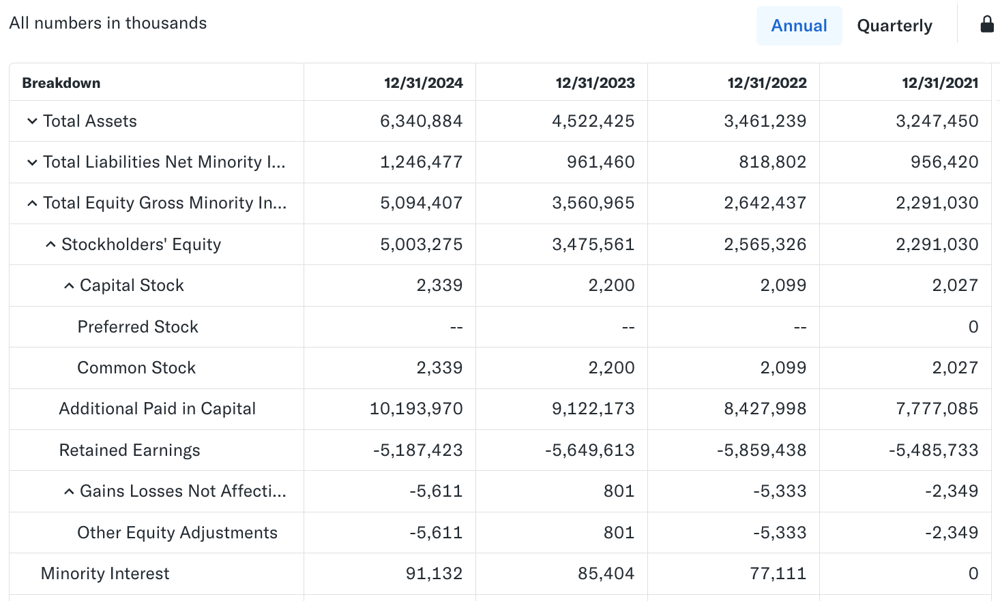

# How to Analyze a Balance Sheet?

The balance sheet is the foundation for understanding a company’s financial health. Its structure is elegantly designed and must always remain balanced.

## Definition and Purpose of the Balance Sheet
The Balance Sheet is one of the three primary financial statements (the other two are the Income Statement and the Cash Flow Statement).  
Its uniqueness lies in the fact that it presents the company’s financial position at a **specific point in time** (for example: December 31, 2025).

> **It is a “snapshot”:** Unlike the income statement, which covers a period of time (such as a quarter), the balance sheet is like a photo, capturing what the company owns and owes at that exact moment.

The core purpose of the balance sheet is to show managers, investors, and creditors a company’s **financial strength** and **net worth**.

* **For investors:** To assess solvency risk and whether the asset structure is healthy.  
* **For creditors:** To evaluate whether the company has the ability to repay loans.

## The Three Components of a Balance Sheet

The balance sheet groups all financial information into three interconnected elements: **assets, liabilities, and shareholders’ equity**.

| Element | Core Question | Simple Definition |
| :--- | :--- | :--- |
| **Assets** | **What does the company own?** | Resources arising from past transactions that will bring future economic benefits. |
| **Liabilities** | **Whom does the company owe?** | Obligations arising from past transactions that require future repayment with assets. |
| **Equity** | **How much do shareholders own?** | Net value belonging to owners after subtracting liabilities from assets. |

## The Core Accounting Equation: Everlasting Balance

The balance sheet gets its name because it always follows the fundamental accounting equation:

$$\text{Assets} = \text{Liabilities} + \text{Equity}$$

### The Meaning of Balance

This equation means that all of a company’s assets must be funded by one of two sources:

1. **External liabilities:** Bank loans, payables, etc. (money owed to outsiders).  
2. **Internal equity:** Shareholder capital or accumulated profits (money owed to shareholders).

Thus, the **total value of assets** always equals the total of **liabilities + equity**, keeping the two sides of the table in perfect balance.

Next, we will introduce the components using [Palantir’s balance sheet](https://finance.yahoo.com/quote/PLTR/balance-sheet/) as an example.

### Classification of Assets

In a balance sheet, assets are ordered by **liquidity** (how quickly they can be converted into cash) from high to low. They are divided into:

* **Current Assets:** Expected to be converted to cash within one year (e.g., cash, receivables). This section supports **short-term operations**—paying bills and daily working-capital needs.  
  For Palantir, these include cash & short-term investments and accounts receivable.

* **Non-Current Assets:** Long-term assets with useful lives exceeding one year, such as fixed assets and goodwill. This represents **long-term investment** and **business model characteristics**.  
  For example, software companies rely heavily on intangibles such as patents; manufacturers rely on PPE.

* **Formula:**  
  $$\text{Total Assets} = \text{Current Assets} + \text{Non-Current Assets}$$

Simply looking at the numbers is meaningless. We must interpret them using two analytical methods: **trend analysis** and **common-size analysis**.

#### 1. Trend Analysis

**Method:** Calculate **year-over-year growth rates (YoY)** for each item.  
**Purpose:** To see whether the company’s scale and structure are expanding, shrinking, or transforming.

#### 2. Common-Size Analysis

**Method:** Calculate the percentage of each asset relative to **total assets**.  
**Purpose:** To understand whether the asset structure is healthy.  
For example: high cash proportion = safer; unusually high receivables proportion = potential risk.

Now we apply these methods to interpret Palantir’s data (all numbers in thousands USD):

#### A. Overall Scale and Growth

We first examine the growth in **Total Assets**:

| Year | 2021 | 2022 | 2023 | 2024 |
| :--- | :--- | :--- | :--- | :--- |
| **Total Assets** | $3.25B | $3.46B | $4.52B | $6.34B |
| **YoY Growth** | N/A | 7% | 31% | 40% |

Palantir experienced explosive asset growth after 2022, nearly doubling its total assets in four years, with particularly strong acceleration in 2023 and 2024 (over 30%).  
This indicates not only expansion but **increasing speed of expansion**, a strongly positive signal.

### B. Financial Safety and Liquidity

We now look at the most important asset: **Cash, Cash Equivalents & Short-Term Investments**.

**Formula:**  
$$\text{Cash-to-Total-Assets Ratio} = \frac{\text{Cash \& Short-Term Investments}}{\text{Total Assets}}$$  
**Purpose:** Measures **liquidity strength**. For a fast-growing tech company like Palantir, cash is the lifeline.

| Year | Cash & Short-Term Investments | Total Assets | Cash Ratio |
| :--- | :--- | :--- | :--- |
| **2021** | $2.52B | $3.25B | **78%** |
| **2024** | $5.23B | $6.34B | **82%** |

Palantir is a **financial fortress**: its cash ratio has remained between **76% and 82%**, which is extremely high.  
This indicates **strong resilience**, able to fund R&D, acquisitions, or buybacks without borrowing.  
For investors, this means a **wide margin of safety**.

### C. Revenue Quality and Operating Activity

Now we examine **Accounts Receivable**:

| Year | Receivables | YoY Growth |
| :--- | :--- | :--- |
| **2021** | $191M | N/A |
| **2024** | $575M | **58%** (2023→2024) |

Receivables have grown significantly, with almost 60% growth in the most recent year.  
This reflects **rapid sales expansion**—typical for enterprise software companies with invoice-and-collect cycles.

* **Note:** Receivables carry credit risk, but Palantir’s **cash reserve is multiple times larger**, offsetting this risk almost entirely.

### D. Business Model Analysis

We examine **Net PPE**, which reveals the company’s reliance on physical assets.

**Formula:**  
$$\text{Net-PPE Ratio} = \frac{\text{Net PPE}}{\text{Total Assets}}$$  
**Purpose:** Measures **capital intensity**. For tech companies, this ratio should be low.

| Year | Net PPE | Total Assets | PPE Ratio |
| :--- | :--- | :--- | :--- |
| **2021** | $248M | $3.25B | **8%** |
| **2024** | $240M | $6.34B | **4%** |

As the company grew, PPE as a percentage of assets **declined**, confirming a **light-asset software model**.  
Growth is driven by software and IP, not heavy investment in physical assets—implying scalability and high potential margins.

**From Palantir’s asset data, the key analytical takeaways are:**

1. **Look at total asset growth** → determines expansion quality and strength.  
2. **Look at cash ratio** → determines liquidity and financial security.  
3. **Look at receivables growth** → identifies revenue growth and credit risk (cross-checked with cash).  
4. **Look at PPE ratio** → identifies whether the company is light-asset or capital-intensive.

## Classification of Liabilities

Liabilities are usually classified according to their **maturity** (the urgency of repayment):

* **Current Liabilities:** Debts expected to be repaid within one year (such as short-term loans, accounts payable). For Palantir, this refers to: accounts payable, accrued expenses (unpaid wages or bills), and **current deferred revenue**.
* **Non-Current Liabilities:** Long-term debts with a repayment period longer than one year. For Palantir, this includes: **long-term debt** and **non-current deferred revenue**.

Liabilities also have different natures. For technology companies, we must distinguish between **financial debt** and **operational obligations**:

* **Traditional financial debt (“bad debt”):** Debt that requires interest payments, such as bank loans or bonds (e.g., “debt and capital lease obligations” in the example).
* **Deferred revenue (“good debt”):** Money that customers pay the company in advance before the services are delivered (e.g., a customer prepays for a one-year software subscription). Although recorded as a liability, it actually represents **locked-in future revenue**, which is positive.

We will combine Palantir’s liabilities with asset data to calculate three important indicators:

### 1. Short-Term Solvency: Current Ratio

The current ratio measures a company’s ability to cover **current liabilities** (debts due within one year) with **current assets** (cash or assets that can be converted into cash within a year). It is the gold standard for evaluating short-term financial safety.

**Formula:**
$$\text{Current Ratio} = \frac{\text{Total Current Assets}}{\text{Total Current Liabilities}}$$

| Year                  | 2021  | 2022  | 2023  | 2024  |
| :-------------------- | :---- | :---- | :---- | :---- |
| **Current Ratio (x)** | **4** | **5** | **6** | **6** |

Palantir’s current ratio falls between **4 and 6**.

* **Industry Standard:** Most investors consider **1.5 to 2.0** to be healthy.
* **Palantir’s Performance:** A ratio of 6 means Palantir’s current assets are **six times** its short-term liabilities. This confirms the conclusion drawn from the asset side: the company has **extremely high financial safety**, with virtually no short-term repayment risk.

### 2. Core Debt Status: Net Cash

Net cash measures the company’s **actual financial leverage**. If a company’s cash exceeds its total debt, then in practical terms, it is essentially “debt-free.”

**Formula:**
$$\text{Net Cash} = \text{Cash and Short-Term Investments} - \text{Total Debt}$$

| Year     | Cash & Short-Term Investments | Total Debt | Net Cash  |
| :------- | :---------------------------- | :--------- | :-------- |
| **2021** | 2.52B                         | 0.26B      | **2.26B** |
| **2024** | 5.23B                         | 0.239B     | **4.99B** |

Not only does Palantir hold substantial cash, but its **net cash** increased from 2.26B in 2021 to **4.99B** in 2024.

Thus, Palantir’s cash reserves exceed its total debt by **more than 20 times**. In financial analysis, companies with such huge net cash positions are considered **“debt-free” or “net-debt-negative,”** a textbook **financial fortress**. This means operational risk is extremely low, and the company is almost entirely funded by shareholder equity.

### 3. Nature of Liabilities: Proportion of Deferred Revenue

We calculate the percentage of **deferred revenue** relative to **total liabilities** to determine whether the company’s liabilities come from traditional financial borrowing or from customer prepayments for future services.

**Formula:**
$$\text{Deferred Revenue Ratio} = \frac{\text{Total Deferred Revenue}}{\text{Total Liabilities}}$$

| Year     | Total Deferred Revenue | Total Liabilities | Deferred Revenue Ratio |
| :------- | :--------------------- | :---------------- | :--------------------- |
| **2021** | 463M                   | 956M              | **48%**                |
| **2024** | 566M                   | 1.25B             | **45%**                |

Between **41% and 51%** of Palantir’s total liabilities consist of deferred revenue.

This indicates that Palantir’s liabilities are mainly **operational obligations** (a commitment to deliver services), rather than **interest-bearing financial debt**. An increase in deferred revenue is positive because it represents customer trust and prepaid funds, locking in future revenue.

Combining both assets and liabilities, we arrive at the following conclusions:

1. **Financial Safety:** **Extremely high.** Current ratio at 6, net cash close to $5B.
2. **Business Model:** Classic **asset-light software model**. About 80% of total assets are cash, and little physical capital is required (net PPE extremely low).
3. **Growth Quality:** **Healthy.** Assets and accounts receivable are growing rapidly, signaling expanding sales. A significant portion of liabilities comes from **deferred revenue**, securing future income.

In summary, Palantir’s balance sheet demonstrates **robust** financial health, providing ample capital buffer and flexibility for its high-growth, high-risk business strategy.

## Classification of Equity

Shareholders’ equity represents the portion of the company’s **net assets** that belongs to the owners (shareholders).
In simple terms, equity shows that a company’s net assets come from two primary sources: **capital contributed by shareholders** and **profits earned and retained by the company**, reflecting both its **historical value accumulation** and **future growth model**.

Equity is categorized as follows:

### 1. Contributed Capital

This is the capital that shareholders directly or indirectly contribute to the company.

* **Common Stock or Share Capital:**

  * **Definition:** The amount invested by shareholders when the company issues shares for the first time, usually recorded at **par value** or statutory value.
  * **Meaning:** Represents the shareholders’ initial investment.
* **Additional Paid-in Capital (APIC):**

  * **Definition:** The amount shareholders pay above the stock’s par value.
  * **Meaning:** In modern corporations, APIC is usually much larger than common stock and represents most of the real capital invested by shareholders.

| Year     | APIC (thousands USD) | Source of Growth (Methodology)                          |
| :------- | :------------------- | :------------------------------------------------------ |
| **2021** | 7.78B                | Accumulated contributed capital and equity compensation |
| **2024** | 10.19B               |                                                         |

Palantir’s APIC continues to grow steadily, increasing by more than $2.4B from 2021 to 2024. This indicates that Palantir’s equity growth is driven primarily by **contributed capital** (including stock-based compensation), rather than retained earnings.

For companies like Palantir, APIC growth does not always come from direct cash investment by shareholders. A large portion is driven by **Stock-Based Compensation (SBC)**.
When the company issues stock to employees as compensation, it is recorded as an **expense** in the income statement but increases **shareholders’ contributed capital** on the balance sheet. This increases capital without cash inflow but **dilutes existing shareholders**.

### 2. Retained Earnings

This is the profit that the company **earns through operations** and retains internally.

* **Definition:** The cumulative total of a company’s **net profits** since its founding, minus all **dividends** paid out.
* **Meaning:** The ultimate indicator of profitability and reinvestment success. If a company is consistently profitable, this number typically grows. If it’s negative, it’s called an “accumulated deficit.”

| Year     | Retained Earnings (thousands USD) | Change     | Meaning (Methodology)                    |
| :------- | :-------------------------------- | :--------- | :--------------------------------------- |
| **2021** | -5.48B                            | N/A        | **Large historical losses**              |
| **2022** | -5.86B                            | -0.37B     | Continued losses                         |
| **2023** | -5.65B                            | **+0.21B** | **First year of positive net income**    |
| **2024** | -5.19B                            | **+0.46B** | Growing profitability, deficit shrinking |

* **Historical status:** Retained earnings were deeply negative for all years (still -$5.19B in 2024), showing Palantir accumulated **massive historical losses**.
* **Key turning point:** Starting in 2023, retained earnings became **positive in annual change** (+210M and +460M). Since Palantir pays no dividends, the change equals net income. This confirms the company achieved **net profitability** in 2023 and 2024.
* **Conclusion:** Although cumulative losses remain large, Palantir has achieved a structural improvement in profitability and is steadily filling its historical deficit.

### 3. Treasury Stock

Treasury stock is a special item—it is a **deduction** from shareholders’ equity.

* **Definition:** Shares that the company has **repurchased** from the market using cash.
* **Meaning:** Repurchasing stock reduces assets (cash) and equity. Buybacks are usually seen as positive because they signal confidence from management that the stock is undervalued and return capital to shareholders. Treasury stock normally appears as a **negative number** on the balance sheet.

### 4. Accumulated Other Comprehensive Income (AOCI)

This is a relatively complex item that records **gains and losses that bypass the income statement** but still affect equity.

* **Definition:** Primarily unrealized gains/losses, such as changes in value of long-term investments that haven’t been sold yet, and foreign currency translation adjustments.
* **Meaning:** Helps maintain the accounting equation’s balance but is separated because it does not come from core operating activities.

In summary, shareholders’ equity consists of:

$$\text{Equity} = \text{Common Stock} + \text{Additional Paid-in Capital} + \text{Retained Earnings} + \text{AOCI} - \text{Treasury Stock}$$

This total represents the company’s net worth and balances the equation **Assets = Liabilities + Shareholders’ Equity**.

## Summary of Palantir’s Balance Sheet Analysis

With assets, liabilities, and equity combined, Palantir’s financial profile becomes clear:

| Dimension               | Key Metric                         | Trend & Value (2024) | Financial Safety / Business Model Conclusion                                     |
| :---------------------- | :--------------------------------- | :------------------- | :------------------------------------------------------------------------------- |
| **Asset Safety**        | Cash & Short-Term Investments      | $5.23B               | Massive liquidity, an **extremely safe** “financial fortress.”                   |
| **Short-Term Solvency** | Current Ratio                      | **6×**               | Far above healthy norms (1.5–2.0), short-term risk **negligible**.               |
| **Debt Status**         | Net Cash                           | **$4.99B**           | Negative net debt—effectively **debt-free**.                                     |
| **Liability Nature**    | Deferred Revenue Ratio             | ~45%                 | Liabilities mainly consist of **customer prepayments**, securing future revenue. |
| **Business Model**      | Net PPE Ratio                      | ~4%                  | A **light-asset** software company with high scalability.                        |
| **Value Accumulation**  | Retained Earnings Turning Positive | Since 2023           | Growing profitability is offsetting historical losses.                           |

Palantir possesses an **exceptionally strong and safe** balance sheet.
It has accumulated large capital through equity compensation, maintains enormous cash reserves, carries minimal traditional debt, and has achieved a major profitability breakthrough in recent years.

## Other Metrics on the Balance Sheet

These items are commonly referred to as **“supplementary metrics”** or **“key derivative indicators.”**
They are not fundamental components of the balance sheet itself (assets, liabilities, equity). Instead, they are calculated or extracted from those core components to help investors **quickly assess** specific financial aspects of a company.

For beginners in finance, these derivative indicators serve as “shortcuts” that significantly improve analysis efficiency.

### 1. Liquidity and Efficiency Metrics

| Supplementary Metric    | Definition & Formula                                     | Purpose & Importance                                                                                                                                      | Palantir Interpretation (2024)                                                                                                                                                                                                             |
| :---------------------- | :------------------------------------------------------- | :-------------------------------------------------------------------------------------------------------------------------------------------------------- | :----------------------------------------------------------------------------------------------------------------------------------------------------------------------------------------------------------------------------------------- |
| **Working Capital**     | **Current Assets − Current Liabilities**                 | Measures **short-term solvency and operational flexibility**. A larger positive value means more abundant short-term resources and smoother operations.   | **$4.94 billion (2024)**. **Extremely large and continuously rising.** This confirms Palantir’s very high current ratio and its complete lack of short-term liquidity pressure.                                                            |
| **Net Tangible Assets** | **Total Assets − Total Liabilities − Intangible Assets** | Measures the **real physical value** that shareholders could receive if the company were liquidated. Excludes goodwill, patents, and other “soft assets.” | **$5.0 billion (2024)**. Since Palantir has almost no goodwill or intangibles (or treats them as effectively zero), this number closely mirrors shareholders’ equity, indicating the company’s value is **“hard” rather than intangible.** |
| **Tangible Book Value** | **Shareholders’ Equity − Intangible Assets**             | Measures the per-share value of net tangible assets.                                                                                                      | **$5.0 billion (2024)**. Conceptually identical to Net Tangible Assets but more commonly used for per-share calculations (Tangible Book Value Per Share).                                                                                  |

### 2. Capital Structure and Debt Metrics

| Supplementary Metric          | Definition & Formula                                                                                   | Purpose & Importance                                                                                                                                             | Palantir Interpretation (2024)                                                                                                                                                                           |
| :---------------------------- | :----------------------------------------------------------------------------------------------------- | :--------------------------------------------------------------------------------------------------------------------------------------------------------------- | :------------------------------------------------------------------------------------------------------------------------------------------------------------------------------------------------------- |
| **Total Capitalization**      | **Total Debt + Shareholders’ Equity**                                                                  | Measures the **total capital** available for operations and investment. Used to evaluate the capital structure (e.g., debt-to-capital ratio).                    | **$5.0 billion (2024)**. This figure matches shareholders’ equity (~$5.003B), confirming that Palantir **has virtually no traditional debt** and its capital structure is almost entirely equity-funded. |
| **Invested Capital**          | **Total Debt + Shareholders’ Equity** (or **Total Assets − Non-interest-bearing Current Liabilities**) | Similar to total capitalization; measures the total capital deployed to generate operating returns. Basis for calculating **ROIC (Return on Invested Capital)**. | **$5.0 billion (2024)**. With minimal debt, this shows that returns are driven almost entirely by equity.                                                                                                |
| **Total Debt**                | **Current Debt + Non-current Debt** (typically interest-bearing obligations)                           | Measures the total amount of interest-bearing funds owed to external creditors.                                                                                  | **$239 million (2024)**. This amount has remained stable from 2021–2024 and is far below Palantir’s $5.2B in cash. This **reconfirms Palantir’s extremely safe financial position.**                     |
| **Capital Lease Obligations** | **Current Capital Leases + Non-current Capital Leases**                                                | The main component of total debt. Accounting treats capital leases as asset purchases financed by debt—commonly for office space or equipment.                   | **$239 million (2024)**. Matches total debt, meaning Palantir’s debt consists **entirely of financing leases**, not traditional bank loans.                                                              |

### 3. Equity and Dilution Metrics

| Supplementary Metric       | Definition & Formula                                           | Purpose & Importance                                                 | Palantir Interpretation (2024)                                                                                                                                          |
| :------------------------- | :------------------------------------------------------------- | :------------------------------------------------------------------- | :---------------------------------------------------------------------------------------------------------------------------------------------------------------------- |
| **Shares Issued**          | **Total number of shares the company has issued historically** | Used to compute earnings per share, book value per share, etc.       | **2.339 billion shares (2024)**. Continues to increase.                                                                                                                 |
| **Ordinary Shares Number** | **Same as Shares Issued**                                      | Measures the total outstanding common shares.                        | **2.339 billion shares (2024)**. Identical to shares issued.                                                                                                            |
| **Treasury Shares Number** | **Number of shares repurchased by the company**                | Indicates how many shares have been removed from market circulation. | **0 shares**. Palantir has **not conducted buybacks** during these years. Growth in equity is driven by APIC (equity compensation), not by reducing outstanding shares. |

