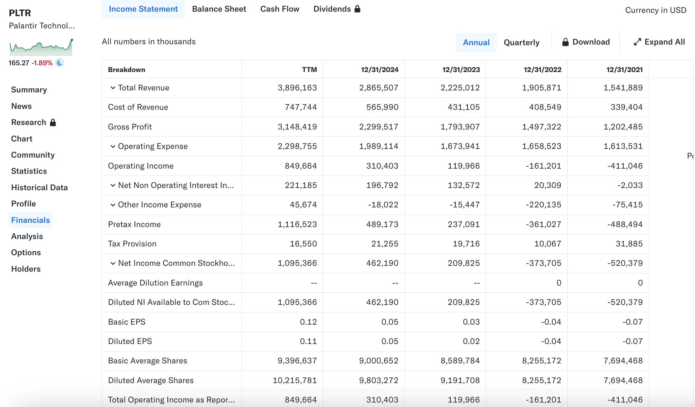

# How to Analyze an Income Statement?

The income statement (also called the Profit & Loss statement or P&L) is like your **monthly budget report or ledger** that records your **entire year** of income and expenses.

| Feature              | Income Statement                                                                                  | Comparison: Balance Sheet                                                                       |
| :------------------- | :------------------------------------------------------------------------------------------------ | :---------------------------------------------------------------------------------------------- |
| **Time dimension**   | **Over a period of time** (e.g., January 1, 2024 to December 31, 2024).                           | **At a specific point in time** (e.g., December 31, 2024) as a snapshot of assets.              |
| **What it measures** | Measures the company’s **operating results** over that period (did it make money or lose money?). | Measures the company’s **financial position** at a moment (how much it owns, how much it owes). |
| **Core question**    | “How much **did we earn** this quarter/year?”                                                     | “How much am I **worth right now**?”                                                            |

## Core accounting equation: the essence of profit

The income statement answers only one question: **After offsetting revenues and expenses, how much is left?**

$$\text{Revenue} - \text{Expenses} = \text{Profit (or Net Income)}$$

* **Revenue:** All the money the company **earns** from selling products or providing services.
* **Expenses:** All the money the company **spends** to operate and earn revenue (including raw materials, wages, rent, taxes, etc.).
* **Profit (Net Income):** The final amount remaining.

## "Top line" and "Bottom line"

Analysts commonly call the top and bottom lines the “top line” and the “bottom line.” They correspond to the first and the last major numbers on the income statement and represent the company’s **scale** and **ultimate profitability**, respectively.

| Concept         | Corresponding Item        | What it measures                                                                                                        |
| :-------------- | :------------------------ | :---------------------------------------------------------------------------------------------------------------------- |
| **Top Line**    | **Total Revenue / Sales** | The company’s **growth rate and market scale**. Top-line growth is the first step in company expansion.                 |
| **Bottom Line** | **Net Income**            | The company’s **final profitability**. This is the money remaining for shareholders after all costs and taxes are paid. |

## Income statement structure: three-layer profit breakdown

To understand **where** a company makes money and **where** it spends money, the income statement deducts costs step by step, producing three key profit layers:

1. **Gross Profit:** The most basic profit. It reflects the product/service’s **“factory-level”** profitability.
   *Example:* If selling coffee brings $1,000 revenue and coffee beans + cups cost $300 (COGS), gross profit = $700.

2. **Operating Profit:** Money earned from the company’s **core business** after subtracting day-to-day operating expenses.
   *Example:* $700 (gross profit) minus store rent, staff wages, marketing, etc. = **operating profit**. This is the best measure of whether the core business is healthy.

3. **Net Income:** The company’s **final profit**.
   *Example:* Operating profit minus interest on debt and taxes = **net income**.

In short:

* **Gross Profit** answers: Does the product itself make money?
* **Operating Profit** answers: Does the company’s core business make money?
* **Net Income** answers: After everything is paid, how much did I earn for shareholders?

| Profit Layer            | Formula                                 | Expenses Deducted                                                                                        | What it measures                                                                          |
| :---------------------- | :-------------------------------------- | :------------------------------------------------------------------------------------------------------- | :---------------------------------------------------------------------------------------- |
| **1. Gross Profit**     | **Revenue − Cost of Goods Sold (COGS)** | **COGS:** Direct costs to produce the product or deliver the service (raw materials, production labor).  | Measures the profitability and pricing power of the **product/service itself**.           |
| **2. Operating Profit** | **Gross Profit − Operating Expenses**   | **Operating Expenses (OpEx):** Costs related to daily core operations (R&D, Sales/SG&A, rent, wages).    | Measures the health and management efficiency of the **core business**.                   |
| **3. Net Income**       | **Operating Profit − Interest − Taxes** | **Non-operating items:** Debt interest expense, income taxes, etc. (costs unrelated to core operations). | Measures the final profit **attributable to shareholders** (the company’s “bottom line”). |

## How to analyze the income statement?

When analyzing the income statement, the focus is on **trends** and **ratios**, not absolute dollar figures. We continue with [Palantir’s income statement](https://finance.yahoo.com/quote/PLTR/financials/) as an example:

Before analysis, note that all amounts are in **millions of USD** (for example, 2021 revenue 1,541 ≈ $1.541 billion). **TTM (Trailing Twelve Months)** is the cumulative data for the **past 12 months**—it represents the company’s most recent annualized performance and is timelier than the full fiscal year number.

### Top line (Revenue) and growth trend

Start with **Total Revenue** to track the company’s scale and expansion speed.

| Item                             | 2021  | 2022      | 2023      | 2024      | TTM       |
| :------------------------------- | :---- | :-------- | :-------- | :-------- | :-------- |
| **Total Revenue (USD millions)** | 1,541 | 1,905     | 2,225     | 2,865     | 3,896     |
| **YoY Growth Rate**              | --    | **23.6%** | **16.8%** | **28.8%** | **36.0%** |

Growth rates are not printed directly in financial statements; we compute **year-over-year growth** to assess revenue trends.

$$\text{YoY Growth Rate} = \frac{\text{Current Period Revenue} - \text{Prior Period Revenue}}{\text{Prior Period Revenue}}$$

Observations:

* **Trend:** Palantir’s revenue has grown from $1.541B (2021) to $3.896B (TTM), more than doubling in three years.
* **Acceleration:** Growth accelerated from 16.8% (2023) to 36.0% (TTM). This indicates demand for Palantir’s products (notably its AI platform) is significantly accelerating.

### Profitability and efficiency (margin analysis)

We evaluate two core margins to judge the quality and efficiency of Palantir’s earnings.

#### 1. Gross Margin

Assessment: pricing power and cost control

$$\text{Gross Margin} = \frac{\text{Gross Profit}}{\text{Total Revenue}}$$

| Item                            | 2021      | 2022      | 2023      | 2024      | TTM       |
| :------------------------------ | :-------- | :-------- | :-------- | :-------- | :-------- |
| **Gross Profit (USD millions)** | 1,202     | 1,497     | 1,793     | 2,299     | 3,148     |
| **Gross Margin**                | **78.0%** | **78.6%** | **80.6%** | **80.2%** | **80.8%** |

Palantir’s gross margin stays around **80%**, which is an **excellent** level for software. A high gross margin implies the product or service commands high prices or has very low direct delivery costs—evidence of a **strong moat and pricing power**.

#### 2. Operating Margin

Assessment: core business health and economies of scale

$$\text{Operating Margin} = \frac{\text{Operating Income}}{\text{Total Revenue}}$$

| Item                                | 2021       | 2022      | 2023     | 2024      | TTM       |
| :---------------------------------- | :--------- | :-------- | :------- | :-------- | :-------- |
| **Operating Income (USD millions)** | -411       | -161      | 119      | 310       | 849       |
| **Operating Margin**                | **-26.7%** | **-8.5%** | **5.4%** | **10.8%** | **21.8%** |

* Operating income is gross profit minus all operating expenses; it measures whether the **core business** is profitable.
* **Analysis:** Palantir’s operating margin shows a dramatic V-shaped recovery.

  * 2021–2022: the company lost money at the operating level (negative margins), common for growth-stage tech companies.
  * 2023: turned positive.
  * TTM: operating margin reached **21.8%**, well above the commonly cited 15% threshold for “excellent.”
* **Conclusion:** Palantir has achieved not just profitability but first-class operational efficiency; its business model appears sustainable and highly profitable.

#### 3. Operating expense efficiency (economies of scale)

Assessment: expense control

We compute operating expenses as a percentage of total revenue:

$$\text{Expense Ratio} = \frac{\text{Operating Expenses}}{\text{Total Revenue}}$$

| Item                                  | 2021       | 2022      | 2023      | 2024      | TTM       |
| :------------------------------------ | :--------- | :-------- | :-------- | :-------- | :-------- |
| **Operating Expenses (USD millions)** | 1,613      | 1,658     | 1,673     | 1,989     | 2,298     |
| **Expense Ratio**                     | **104.6%** | **87.0%** | **75.2%** | **69.4%** | **59.0%** |

* **Analysis:** Expense ratio fell dramatically from 104.6% (2021) to 59.0% (TTM).
* **Economies of scale:** Expenses are growing much slower than revenue—this is classic operating leverage. It shows that as Palantir scales, each additional dollar of revenue contributes more to profit.

### Shareholder-return perspective & key trends

We examine net income after taxes and interest, and per-share performance.

#### 1. Quality of Net Income

* **Pretax Income:** Operating income adjusted by non-operating income/expense (e.g., interest).
* **Tax Provision:** Amount set aside to pay income taxes.

| Item                                          | 2021 | 2022 | 2023 | 2024 | TTM   |
| :-------------------------------------------- | :--- | :--- | :--- | :--- | :---- |
| **Non-operating Net Interest (USD millions)** | -2   | 20   | 132  | 196  | 221   |
| **Net Income (USD millions)**                 | -520 | -373 | 209  | 462  | 1,095 |

Net income follows operating income’s recovery. Note that **net interest** has become a meaningful contributor (from $-2M to $221M), driven by income from cash holdings—this is not core software revenue.

#### 2. Earnings Per Share (EPS) and dilution

* **Diluted EPS** is the relevant EPS to watch. It assumes conversion of all potentially dilutive securities (options, convertibles), giving a conservative per-share earnings metric.

| Item                                  | 2021      | 2022      | 2023     | 2024     | TTM      |
| :------------------------------------ | :-------- | :-------- | :------- | :------- | :------- |
| **Diluted EPS**                       | **-0.07** | **-0.04** | **0.02** | **0.05** | **0.11** |
| **Diluted Average Shares (millions)** | 7,694     | 8,255     | 9,191    | 9,803    | 10,215   |

Diluted EPS has turned positive and is rising—evidence that profitability is translating into shareholder returns.

* **Caveat:** Diluted share count increased from 7.694B to 10.215B. Rapid share dilution can offset per-share gains: if net income grows but share count grows faster, EPS may remain muted. Palantir has issued shares (largely via stock-based compensation), so investors should monitor dilution.

**In short:** Palantir’s core business clearly generates profits; the remaining question is when share dilution will be controlled so per-share profits fully benefit shareholders.

| Summary                                              | Financial facts                                                      | Investment implication                                                                                                                                      |
| :--------------------------------------------------- | :------------------------------------------------------------------- | :---------------------------------------------------------------------------------------------------------------------------------------------------------- |
| **Profitability (Excellent)**                        | Gross margin ~80%, operating margin 21.8%.                           | Product is highly competitive; core operations are very efficient.                                                                                          |
| **Operational efficiency (Significant improvement)** | Operating expenses ratio declined from 104% to 59%.                  | Economies of scale are in effect; company is shifting from burn to profitability.                                                                           |
| **Shareholder returns (Watch out)**                  | Diluted EPS is positive, but diluted shares keep increasing quickly. | Earnings quality is high, but shareholder ownership is being diluted; controlling share issuance is necessary to convert high profits into per-share value. |

