# How to Create a Workflow in Coze

## What is a workflow?
A workflow is a set of predefined, standardized steps that can be used to complete a specific task. A workflow contains multiple nodes, each of which completes a fixed task.

To give an example that is not very appropriate but easy to understand, we are all familiar with the brain teaser "How many steps does it take to put an elephant in the refrigerator?" The answer is three steps: open the refrigerator, put the elephant in, and close the refrigerator. In this scenario, these three steps constitute the nodes of the workflow "Put the elephant in the refrigerator".

## Why do you need to use a workflow?
In the previous article about [How to create a bot in Coze](https://chloevolution.com/zh-cn/posts/how-to-create-bot-on-coze/), there is a step to select the LLM model that your bot expects to use. The capability boundary of the LLM model is limited by the "context". The more information you input to the bot and the more complex the problems it is required to solve, the lower the quality of the answer returned by the bot. I believe you have had similar feelings when using ChatGPT or Claude directly.

In the short term, it is difficult for us to require large language models to achieve significant improvements in context processing capabilities. Then another solution is to decompose the complex tasks input to the Bot into multiple simple subtasks to ensure the quality of the Bot output content.

## Introduction to Coze workflow functions
Nodes are the basic units that make up a workflow, and a workflow consists of multiple nodes. Nodes in Coze can be divided into two categories, one is the fixed nodes that are automatically generated by default, and the other is the optional basic nodes:
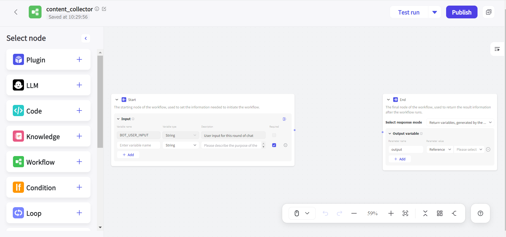

### Fixed nodes that are automatically generated by default
- **Start node**: The starting node of the workflow, which can contain user input information
- **End node**: The end node of the workflow, used to return the running results of the workflow

### Optional basic nodes
Currently, Coze provides a total of thirteen basic nodes:
<table>
<tr>
<td>Node name</td>
<td>Description</td>
</tr>
<tr>
<td>Plugin</td>
<td>Plugin node. Used to use external real-time data and process tasks</td>
</tr>
<tr>
<td>LLM</td>
<td>Large Language Model node. Supports selecting different AI models to process text generation tasks</td>
</tr>
<tr>
<td>Code</td>
<td>Code node. Write code through IDE to process input parameters and return output values</td>
</tr>
<tr>
<td>Knowledge</td>
<td>Knowledge base node. Recall data from the associated knowledge base based on input parameters and return</td>
</tr>
<tr>
<td>Workflow</td>
<td>Workflow node. Add published workflows and execute subtasks</td>
</tr>
<tr>
<td>Condition</td>
<td>if-else logic node. If the set conditions are met, the if branch is run, otherwise the else branch is run</td>
</tr>
<tr>
<td>Loop</td>
<td>Loop node. Repeat a series of tasks by setting the logic and number of loops</td>
</tr>
<tr>
<td>Intent recognition</td>
<td>Intent recognition node. Used to recognize the intent of user input and match it with the preset intent options</td>
</tr>
<tr>
<td>Text Processing</td>
<td>Text processing node. Used to process multiple string type variables</td>
</tr>
<tr>
<td>Message</td>
<td>Message node. Supports message output in the intermediate process, supporting streaming and non-streaming methods</td>
</tr>
<tr>
<td>Question</td>
<td>Question node. Supports asking questions to users during the conversation, with both preset options and open questions</td>
</tr>
<tr>
<td>Variable</td>
<td>Variable node. Used to read and write variables in Bot</td>
</tr>
<tr>
<td>Database</td>
<td>Database node. Users can read and write data in a database controlled by the developer. A table must be added to the Bot's database in advance</td>
</tr>
</table>

### Nodes and parameters
Different nodes may require different parameters to be entered. Input parameters are divided into two categories: Reference and Input:

- **Reference parameter**: refers to the parameter value of the previous node

- **Input parameter**: supports setting custom parameter values

## How to create a workflow with Coze
This article will introduce a case where I used Coze to build a keyword research Bot. It can query and summarize relevant information in Google based on the target keywords entered by the user, and comes with corresponding content links.

1. First, we need to create a Bot (if you are not sure how to create one, you can read [a previous article](https://chloevolution.com/zh-cn/posts/how-to-create-bot-on-coze/)), then click the "+" sign after "Workflow":

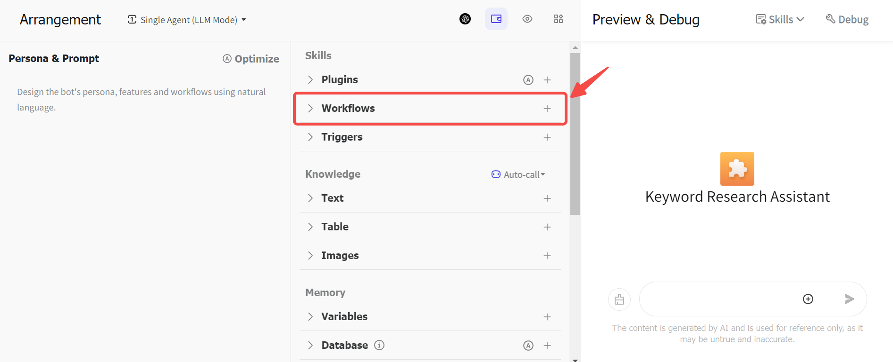

2. Enter the name and description of the workflow. Note that the name can only contain letters, numbers, and underscores, and must start with a letter. Then click "Confirm":
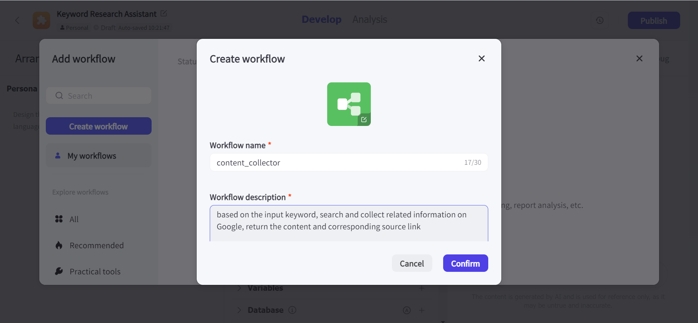

3. After that, enter the workflow editing page, and you can see that Coze will automatically generate the Start node and End node. On the left is the optional basic node mentioned above:

4. First, we need to determine how to get the information we want from Google. In the past, we used to access the API directly by writing code to collect the information we need. In Coze, you can directly use plug-ins to complete this task.

Click the "Plugin" button on the left, then select the Google Web Search plug-in and add it:
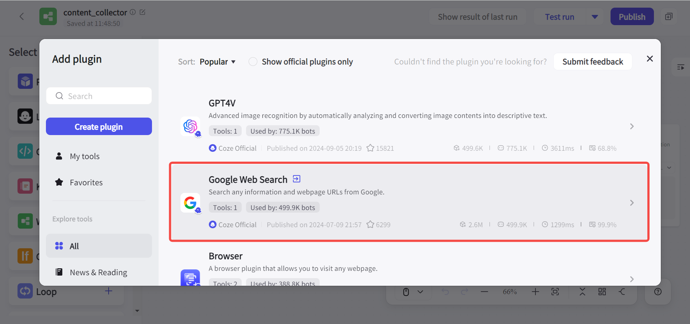

5. The trigger of this workflow is the keyword entered by the user, so we need to configure a string type parameter in the Start node to receive the input text, named query here:
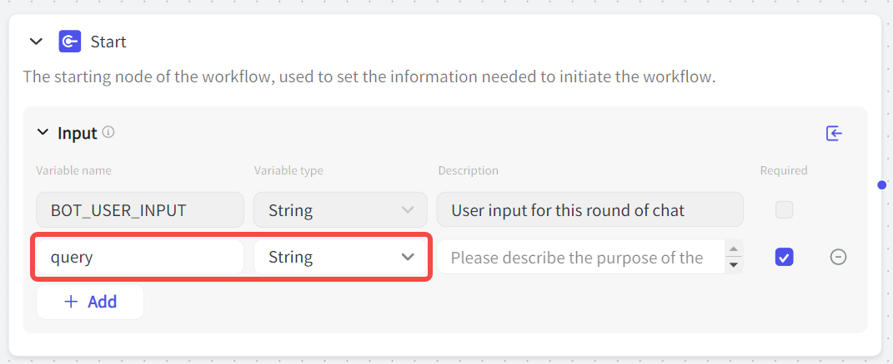

6. The keyword information needs to flow to the Google Web Search plug-in, which completes the text processing and retrieval tasks. The operations here include:
- Set it to query in the previous step
- Connect the right side of the start node and the left side of the plug-in node to indicate the order between tasks
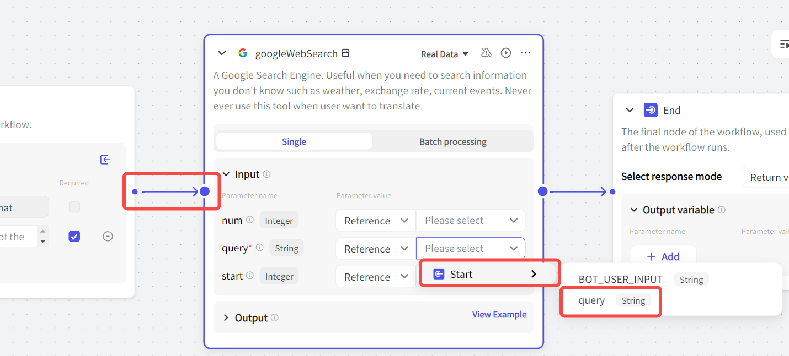

In addition, we can also set two other parameters:
- **num parameter**: defines the maximum number of search results returned, the default is 10
- **start parameter**: sets the number of pages to be searched, the default is 0, that is, the first page of search results

7. At this time, we can first click "Test run" in the upper right corner to test the output effect. Here we input "chatgpt" as an example, and you can see that Coze took 3 seconds to successfully run this workflow. Click "Display result" in the upper right corner of the plug-in node to view the specific results of its processing task:

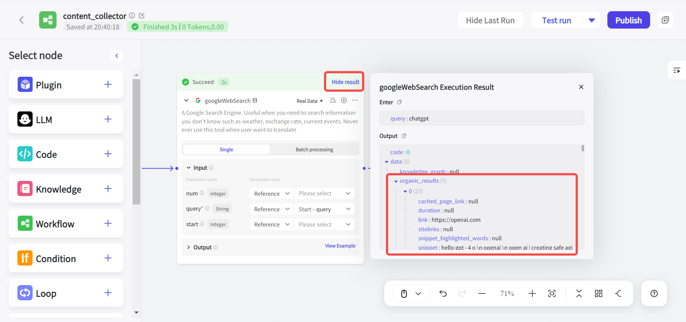

8. I hope that the final output of this workflow includes: the title, description, and corresponding link of each search result. This information is mixed in the output results of the Google Web Search plug-in, so I need a Code node to extract this information.

After placing the Code node between the plug-in node and the End node, set the input parameter to the output result of the plug-in node, and then click Edit in IDE to enter the code editing page:

9. Currently, the Code node supports two languages ​​​​— Python and JavaScript. If you don't know how to write code, you can also let the AI ​​write it for you by entering a natural language prompt in the built-in AI. After writing, click "Test Code" to test whether the code can run normally:
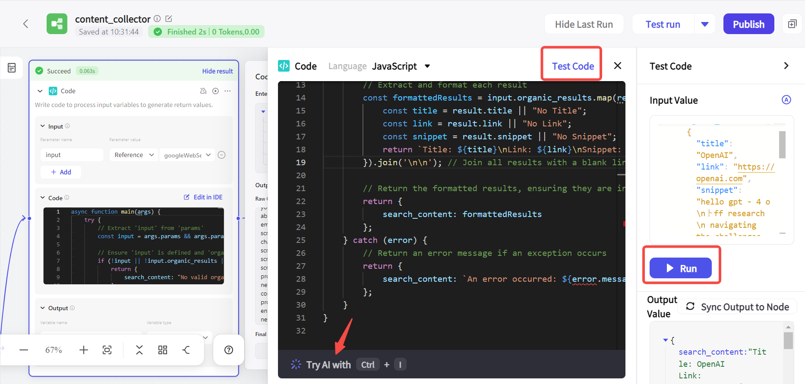

10. After confirming that the code runs normally, we can test the operation of the entire workflow again. Although we can extract the corresponding result title, link, and summary from Google search results at this point, all the information is piled together, so we still need an LLM node to help us organize the information. In order to ensure the quality of the output results, the background information should be as clear as possible in the prompt:
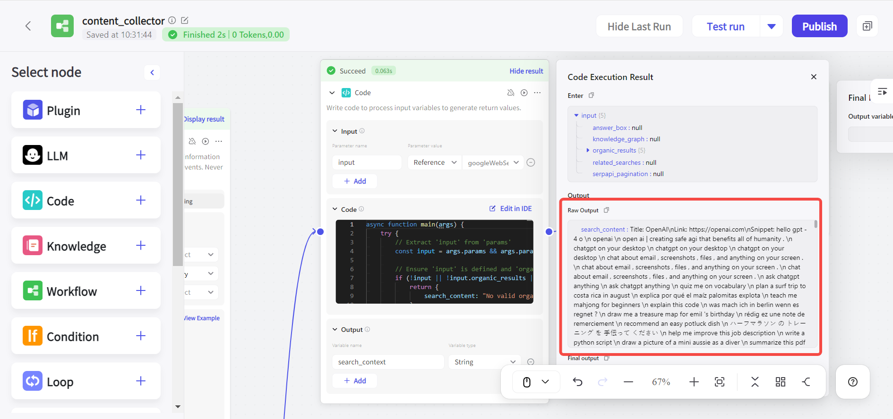

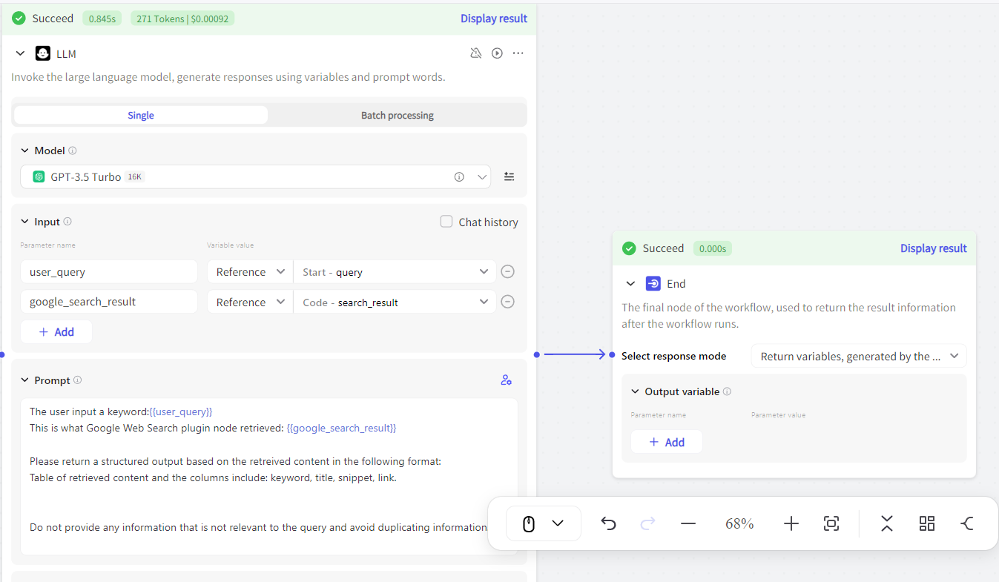

## How to apply workflows in Coze Bot
After testing that the workflow can run normally, we can click the "Publish" button in the upper right corner to publish it, and then add this workflow to the Bot (Note: the workflow needs to be published before it can be added to the Bot):
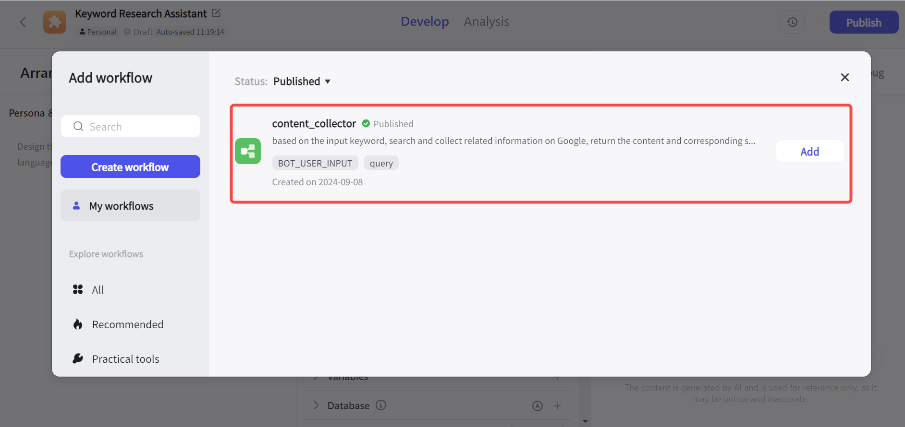

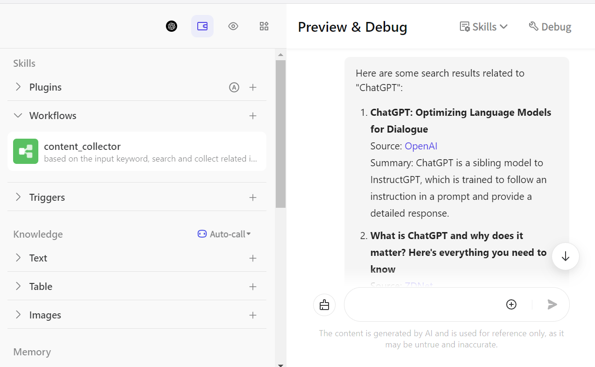
