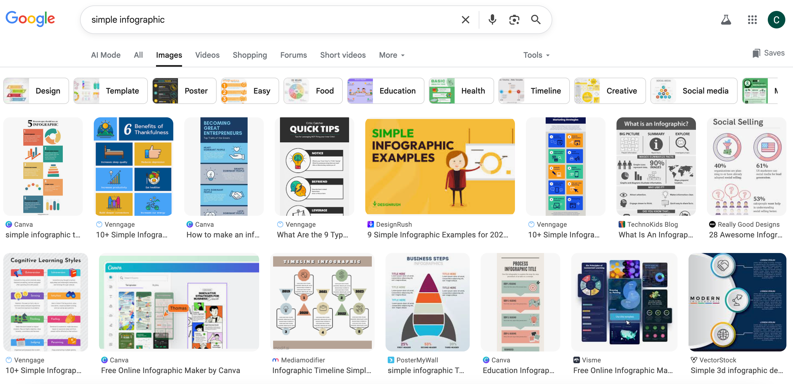
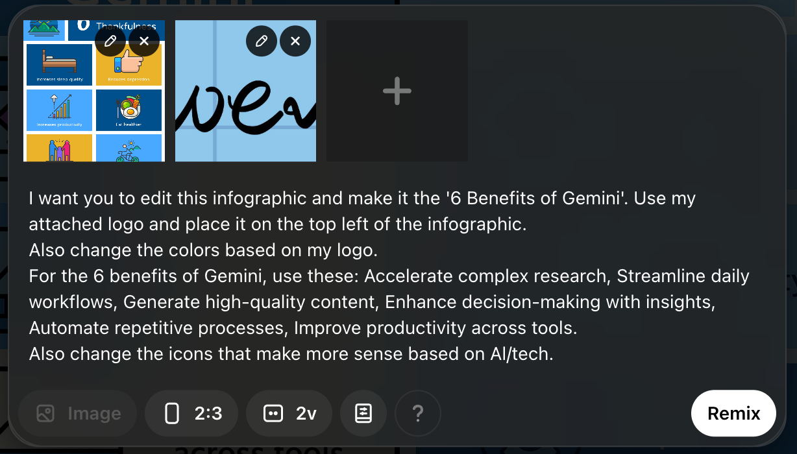
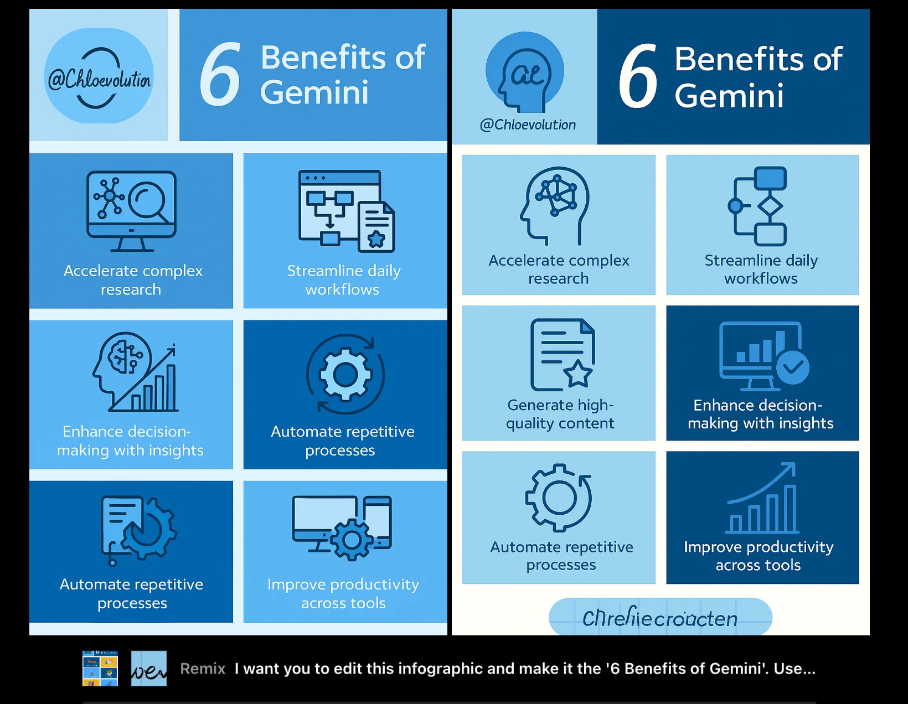

# How to Create Infographics with AI?


**Infographics** have become a key element for elevating content quality and increasing user engagement. Whether deepening a blog reader’s understanding or boosting the shareability of social media posts, a well-designed infographic can effectively visualize complex ideas, making them more persuasive and professional.

## Method 1: Reusing Existing Infographics

This is the fastest and most intuitive starting method, especially if you already have an idea of the design style you want, or simply want to save time on building a layout from scratch.

The essence of this method is leveraging AI’s image recognition and editing capabilities. You provide a **visual template** (an existing infographic), then with well-crafted prompts, instruct AI to retain the template’s **structural layout** while replacing all **content, colors, and branding** elements with the information you need.

### 1. Find a suitable “template”

* **Principle:** Search on Google Images and pick an existing infographic with a **simple design and clear structure**.
* **Selection criteria:** Avoid overly complex designs (those with heavy text or complicated flowcharts). Choose samples with **basic layouts and moderate text volume**, as these allow AI to more easily identify and replace elements.



### 2. Upload your assets and start AI

In addition to uploading the **existing infographic image** to serve as a template, you also need to upload your **brand logo or avatar** for color extraction and branding.

### 3. Write a precise prompt

Here, I’m using Sora as the demonstration.

The key to success is providing **detailed and specific instructions**. AI needs to know which elements to keep, which to replace, and what the replacement content should be.

| Key Prompt Component    | Purpose & Example Instruction                                                                              |
| :---------------------- | :--------------------------------------------------------------------------------------------------------- |
| **Content replacement** | Tell the AI to remove the old topic and list all the new content. **(This is the most important detail!)** |
| **Brand colors**        | Ask AI to extract colors from your uploaded logo and apply them to the infographic.                        |
| **Brand placement**     | Ask AI to place your logo/avatar in a designated position (e.g., top left).                                |
| **Icon adjustments**    | Ask AI to change icons so they match the new theme (e.g., “AI technology” or “marketing”).                 |

Prompt example:

```
I want you to edit this infographic and make it the '6 Benefits of Gemini'. Use my attached logo and place it on the top left of the infographic. 
Also change the colors based on my logo.
For the 6 benefits of Gemini, use these: Accelerate complex research, Streamline daily workflows, Generate high-quality content, Enhance decision-making with insights, Automate repetitive processes, Improve productivity across tools.
Also change the icons that make more sense based on AI/tech.
```



Let’s examine how well Sora’s generated images match the reference template and our prompt:



1. Layout: It closely follows the reference template — logo at the top left, title at the top right, and six elements evenly distributed below.
2. Text elements: Both generated images have issues. The left image is missing “Generate high-quality content,” and “Automate repetitive processes” appears twice. The right image has no text errors but introduces an unintended warped pattern at the bottom resembling a distorted logo.

### Advantages & Things to Watch Out For

| Advantages                 | Caveats                                                                                     |
| :------------------------- | :------------------------------------------------------------------------------------------ |
| **Extremely fast**         | AI-generated results may include **minor text errors** (like misspellings or misnumbering). |
| **Keeps layout structure** | You must ensure the original template’s strong structural design is preserved.              |
| **Requires proofreading**  | Minor imperfections may require final adjustments in **Canva or Photoshop**.                |
| **Easy branding**          | Uploading your logo allows automatic recoloring and fast brand consistency.                 |

**Summary:**
This method is ideal for quickly producing branded infographics based on clear list-style structures. However, the more detail you try to embed (especially precise text), the worse AI’s results tend to get.


## Method 2: Converting Existing Written Content (e.g., Blog Posts) Into Infographics

Unlike Method 1 (visual-template-based), Method 2 is **content-driven**. You provide long-form text (such as a blog post), and Sora interprets the core information and generates an infographic layout, text summary, and appropriate icons **from scratch**.

The advantages are:

* **Maximized content value:** A blog-to-infographic conversion lets you repurpose content for social media, email, or article summaries, expanding reach and reuse.
* **Time-saving:** AI extracts the key points and designs the layout automatically, saving significant time and effort.
* **Accuracy and consistency:** Since the information comes directly from your article, the resulting infographic better preserves content accuracy and logic.

### 1. Prepare your written content

Choose a blog post, report summary, or any structured long-form text you want converted.

Copy the **full text** of the selected content. Ensure the text is clear and logically structured so AI can interpret and summarize effectively.

### 2. Upload brand assets and provide the prompt

Upload your brand logo. This not only adds brand presence but also allows AI to extract your **brand color palette**.

Provide clear instructions specifying your goals:

| Key Prompt Component    | Purpose & Example Instruction                      |
| :---------------------- | :------------------------------------------------- |
| **Task instruction**    | Tell AI the main task is to create an infographic. |
| **Brand identity**      | Ask AI to use your uploaded logo and color scheme. |
| **Infographic title**   | Provide the exact title.                           |
| **Design requirements** | Emphasize readability and cohesive visual layout.  |
| **Content inclusion**   | Paste the full article into the prompt.            |

Prompt example:

```
I want you to create a simple infographic based on the blog post I provide. 
Use the attached logo and title it 'How to Evaluate B2B Marketing?'. Make sure everything looks nice and fits inside the image. Here's the blog post: [Paste Blog Content Here].
```


At first glance the result looks decent, but the details reveal several issues:

1. It confuses the logo and title.
2. Text is distorted, garbled, or clipped.
3. Content is too dense, resulting in cropped visuals and truncated text.


## Method 3: Generating Content & Design From Scratch (AI-Driven Ideation)

This method relies entirely on AI’s generative abilities. You provide only a topic or key question, and AI handles everything — research, summarization, layout, and design.

AI plays two roles:

1. **Content researcher:** AI gathers information around your topic and identifies key points.
2. **Visual designer:** AI creates a matching layout, icons, and text placement based on the summarized information.

Advantages include:

* **Fully automated:** No input text or template needed — AI handles end-to-end creation.
* **Ideal for new topics:** Perfect when working with unfamiliar or emerging subjects.
* **Simple and direct:** Prompts are short; you only need to specify the topic.

### 1. Choose your topic or question

Pick something clear and focused, like:
“How to balance remote work and life?”
or “Top 5 content marketing trends for 2025.”

### 2. Write a prompt (simple but specific)

Your prompt should tell AI **what to research** and **how to present the result**.

| Key Prompt Component | Purpose & Example Instruction                                                                       |
| :------------------- | :-------------------------------------------------------------------------------------------------- |
| **Topic research**   | Ask AI to collect and summarize key points: “What are five best practices for [topic]?”             |
| **Task instruction** | Ask AI to create an infographic: “Using what you know about [topic], create a helpful infographic.” |
| **Design details**   | Require relevant visual elements: “Include five best practices with one flat icon for each.”        |

Prompt example:

```
Using the information you know about Google Ads, can you create a helpful infographic with five best practices, with one corresponding flat icon image for each best practice.
```


Infographics generated entirely from scratch tend to have excellent visual quality — no typos, distortions, or missing pieces. The biggest limitation is that the **content may feel generic or too high-level**.

### 3. Optimize for a specific audience or style

When you specify target audience or style, the output quality increases significantly.

| Audience/Style      | Prompt Example                                                                                                                          | Success Factor                                                                    |
| :------------------ | :-------------------------------------------------------------------------------------------------------------------------------------- | :-------------------------------------------------------------------------------- |
| **Early education** | "Can you create an infographic that explains photosynthesis to 5-year-olds?"                                                            | Simple language, high-contrast cartoon icons, basic layout suitable for children. |
| **Health/Wellness** | "Create an infographic about gut health. Tone and style should be medical themed. Focus on foods to eat and avoid."                     | Clear “eat/avoid” lists with matching food icons, clean and professional design.  |
| **Niche topics**    | "Generate an infographic titled 'The Secret Life of House Dust'. Visualize the microscopic ecosystem (mites, bacteria, fungi, pollen)." | AI produces accurate proportions and icons for microscopic elements.              |
| **General topics**  | "Create an infographic with five facts about the Roman Empire."                                                                         | AI lists five authoritative facts with historically themed icons.                 |


## Optimizing Your Workflow

Although AI can quickly generate complete infographics, producing complex or error-free designs requires an optimized workflow.

### 1. Break down tasks: split complex designs into components

AI often struggles with large amounts of content, leading to cropped text or messy layouts.
The solution is to divide a complex infographic into **small, manageable modules**.

* **Problem:** Asking AI to generate a long vertical infographic with six detailed sections often results in text chaos or cropping.
* **Solution:** Ask AI to **focus on one module at a time**:

  * Prompt example:
    “Create a professional visual module for the ‘Paid Ads’ section of my infographic. Include an icon, a short title, a description, and one pro tip.”
* **Result:** Each module (“Paid Ads,” “Content Creation,” etc.) looks cleaner and more accurate, avoiding full-design collapse.

### 2. Generate refined assets

AI excels at producing relevant, stylistically consistent icons.
You can ask it to create a custom icon set for later manual assembly in tools like Canva.

* **Use case:** When manually assembling your infographic, you need a consistent icon library.
* **Prompt example:**
  “Create 10 flat-design marketing icons. The style should match the icons in this attached image.”
* **Result:** AI produces a **cohesive icon pack** you can screenshot or download and then place precisely in your design tool.

### 3. Assemble and polish externally

This is the final step for achieving “zero error” and professional brand polish.

* **Fixing AI weaknesses:** AI occasionally leaves issues like misnumbered steps (1,3,5…), reversed arrows, or small typos.
* **Assemble modules:** Import the individual high-quality AI-generated modules into your design tool.
* **Professional finishing touches:** In Canva, you can:

  * unify background and brand colors
  * apply your brand fonts
  * fix misalignment or misspellings
  * place your logo accurately
  * add copyright or website details

**Conclusion:**
The optimal workflow — **AI-generated modules + AI-generated icons + external assembly** — yields infographics that are fast to produce, visually polished, and free of errors.


