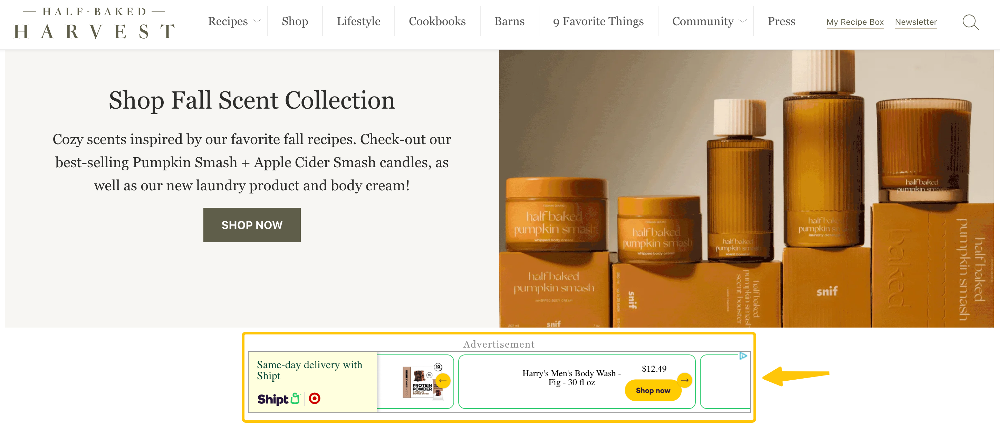
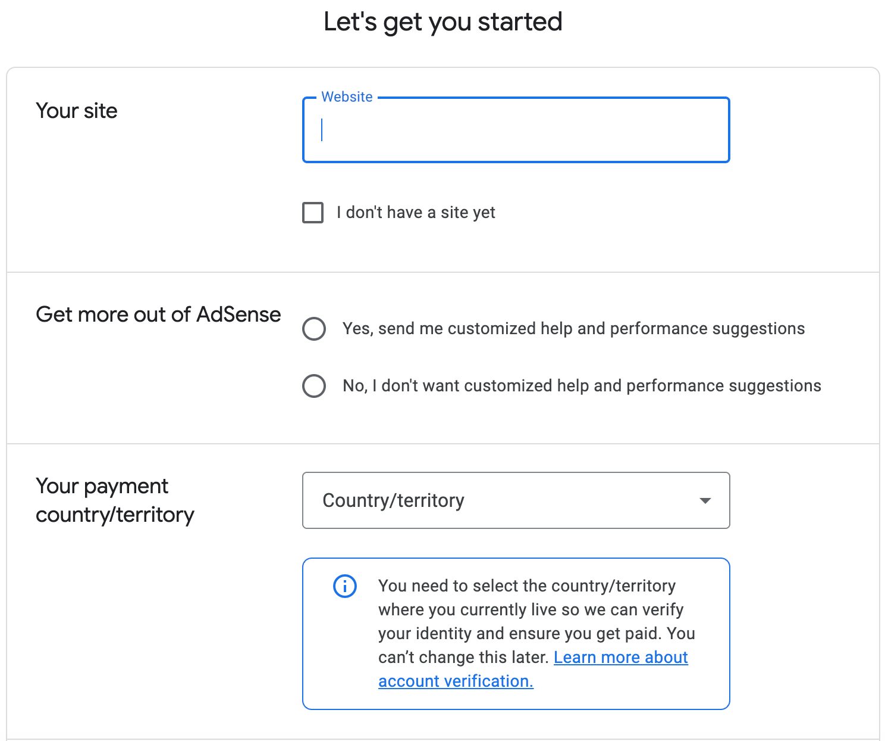
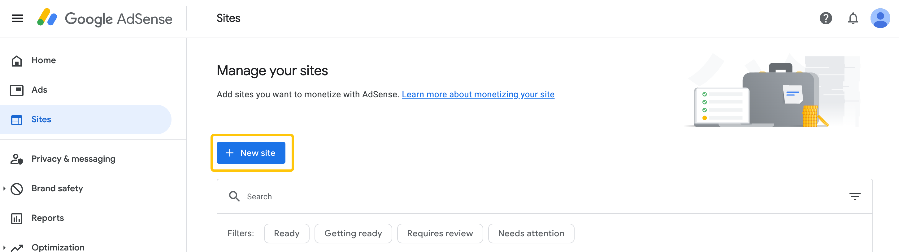
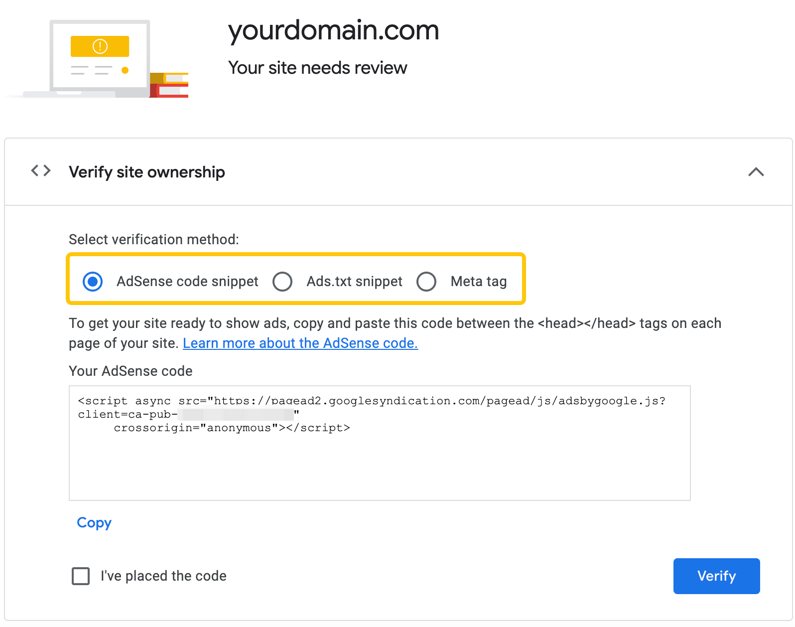
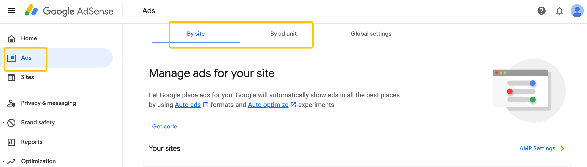
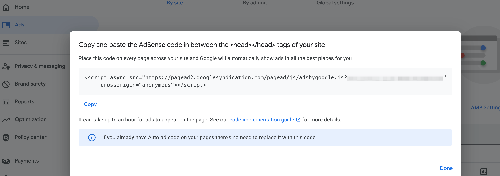
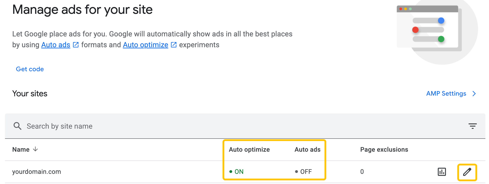
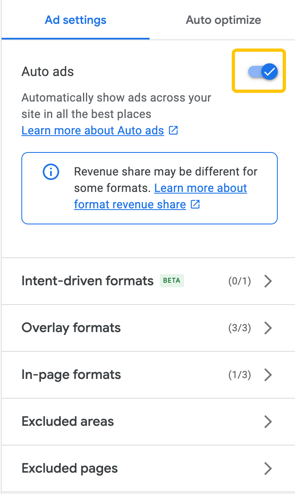

# Complete Practical Guide - How to Earn Money with Google AdSense?

Have you ever thought that your website or YouTube channel could be more than just a hobby platform and actually generate a steady, ongoing income? For beginner content creators, figuring out how to monetize traffic is often the top concern.

Among many options, **Google AdSense** is arguably the most common and beginner-friendly tool. It allows you to earn revenue by displaying ads while you focus on creating content, without requiring complex operations.

This article will take you from zero, help you fully understand how AdSense works, and provide detailed guides for website and YouTube application and setup, helping you gradually start your own online earning journey.

## What is AdSense?

**Google AdSense** is an ad revenue-sharing program offered by Google. It allows website owners, bloggers, or YouTube creators to display ads on their platforms and earn money through ad clicks or impressions. In simple terms, it “rents out” part of your website or channel space to advertisers, while Google helps match the most relevant ads. For example, there’s an AdSense ad at the bottom of this food website:

### The Three Key Roles

The AdSense ecosystem can be understood as a three-party system:

1. **Advertisers**: They pay to promote their products or services.
2. **Publishers**: That’s you, providing space on your website or YouTube channel for ads.
3. **Google**: Acts as the intermediary, managing ad placement, matching, revenue sharing, and ensuring ad quality and compliance.

Google collects fees from advertisers and shares a portion with publishers.

Simply put, AdSense works in three steps:

1. **Provide ad space**: Place AdSense code on your website to create ad slots.
2. **Ads compete to display**: Advertisers bid for your ad space, and the highest bid with the best relevance gets shown.
3. **Earn revenue**: You earn money from Google whenever the ads are shown or clicked.

### AdSense Revenue Sources

Your revenue mainly depends on two ad pricing models:

* **CPC (Cost Per Click)**: You earn when users click on the ad.
* **CPM (Cost Per Mille)**: You earn a fixed amount for every 1,000 ad impressions.

Factors that affect AdSense earnings include:

* Website/channel topic (finance and tech usually have higher CPC; entertainment and lifestyle are lower).
* Audience location (advertising costs are generally higher in Western countries).
* Traffic quality and click-through rate (CTR).

### Website AdSense vs. YouTube AdSense

Although both websites and YouTube can monetize through AdSense, the application requirements and revenue models differ:

* **Website AdSense**

  * **Requirements**: Must have an independent website with original content that complies with Google policies.
  * **Review**: Google manually or automatically reviews content quality.
  * **Revenue**: Primarily CPC and CPM, depending on traffic and content topic.

* **YouTube AdSense (officially YouTube Partner Program, YPP)**

  * **Requirements**: Must meet certain conditions (usually ≥1,000 subscribers + ≥4,000 public watch hours in the past 12 months, or ≥10 million Shorts views).
  * **Review**: YouTube reviews the channel for monetization eligibility.
  * **Revenue**: In addition to ad revenue, may include channel memberships, Super Chat, etc.

In short, if you have a website, you earn via AdSense ads; if you are a video creator, you earn through the YouTube Partner Program integrated with AdSense. Both are essentially the same, but their application requirements and revenue composition differ.

### Difference Between AdSense and Google Ads

#### 1. Core Purpose

| Item             | Google AdSense                             | Google Ads                         |
| ---------------- | ------------------------------------------ | ---------------------------------- |
| **Role**         | Publisher                                  | Advertiser                         |
| **Purpose**      | Earn money by displaying ads               | Promote products/services via ads  |
| **Users**        | Website owners, bloggers, YouTube creators | Businesses, marketers, individuals |
| **Revenue/Cost** | Earn from ad clicks or impressions         | Spend on ad campaigns              |

In short: **AdSense is a money-making tool** (monetize traffic), while **Google Ads is a spending tool** (acquire traffic or sales).

#### 2. How They Work

* **AdSense**

  * Publishers place ad slots on their websites or videos.
  * Google automatically matches ads; publishers earn revenue based on clicks (CPC) or impressions (CPM).

* **Google Ads**

  * Advertisers create ads and bid for placements.
  * Ads can appear in search results (Search), websites (Display), videos (YouTube), etc.
  * Payment methods usually include CPC, CPM, or CPA (per conversion).

#### 3. Relationship

* Advertisers use Google Ads to place ads.
* Google distributes the ads to eligible websites or channels.
* Publishers receive ad placements and revenue through AdSense.
* Thus, AdSense and Google Ads are two ends of the same advertising ecosystem: **one spends money, the other earns money**.

## Complete Guide to Website AdSense Application and Setup

If you have a website and want to start monetizing via **Google AdSense**, you need to ensure your website meets the requirements, then complete the application and ad setup.

### Requirements Before Applying

Before submitting your application, your website must meet the following:

1. **Original content**: Google values high-quality, independently created content; avoid plagiarism or copying.
2. **Complete website structure**: Clear navigation, About, Privacy Policy, Contact pages.
3. **Traffic quality**: No strict traffic requirement, but brand-new sites with almost no visitors often fail.
4. **Domain age**: Some regions require domains to be registered for at least 6 months (e.g., India/China).
5. **Policy compliance**: Cannot contain prohibited content (adult, gambling, illegal downloads, etc.).
6. **Code ownership**: You must have the right to modify your website’s code.
7. **AdSense availability**: Currently only available in [specific countries/regions](https://support.google.com/adsense/answer/13402307?hl=en&ref_topic=1319753&sjid=16003503132913952597-NC).

💡 **Tip**: Before applying, check with Google Search Console to ensure your site is indexed and has some traffic.

### Application Process

1. **Register an AdSense account**

Sign in with your Google account at [Google AdSense](https://www.google.com/adsense) and fill in:

* Website URL (can skip if your site isn’t ready yet)
* Payment address country/region (must be verifiable; can only set once)

2. **Add website and verify ownership**

In the “Sites” section, you can add a new website:

Three ways to verify ownership:

* **AdSense code snippet**: Copy the ad code and paste it in the `<head>` of every page.
* **Ads.txt snippet**: Upload an `ads.txt` file to the root directory to authorize ads.
* **Meta tag**: Paste a `<meta>` tag in the `<head>` of every page.

The first method is recommended as it is also needed for ad placement configuration later. Click **Verify** and wait for Google confirmation.

3. **Website review**

Review usually takes 1–2 weeks, sometimes 2–4 weeks. In AdSense, check your site status:

* **Getting ready**: Google is reviewing; typically a few days, sometimes 2–4 weeks.
* **Ready**: Approved, ads can display; must comply with policies.
* **Requires review**: Not yet reviewed; click Request review.
* **Needs attention**: Issues detected; fix before displaying ads.

### Setting Up Ads After Approval

Once approved, you can start showing ads and earning:

1. **Create ads**

In AdSense, click **Ads → By ad unit** or **By site**.

2. **Get ad code**

For beginners, use **By site**. Click “Get code” and paste it in `<head></head>`.

If you used the first verification method, no additional setup is needed.

Also, ensure **Auto Ads** is ON:

3. **Wait for ads to appear**

Initial display may take an hour. Google automatically matches ads; no manual selection needed.

Check ads via:

* **Page source**: Confirm AdSense script exists.
* **Incognito mode**: Avoid cache/personalization issues.
* **AdSense dashboard**: Check impressions to ensure ads are running.

### FAQs

* **Why was my application rejected?**

  * Too little or non-original content → add high-quality content and reapply.
  * Incomplete website structure → add About and Privacy Policy pages.
  * Abnormal or non-compliant traffic → check traffic sources.

* **When will I see revenue?**

  * Ads start counting as soon as live and receiving traffic.
  * Earnings depend on traffic and ad clicks.

* **How do I get paid?**

  * After reaching the minimum payout threshold (usually **\$100**), Google pays via bank transfer or check.

