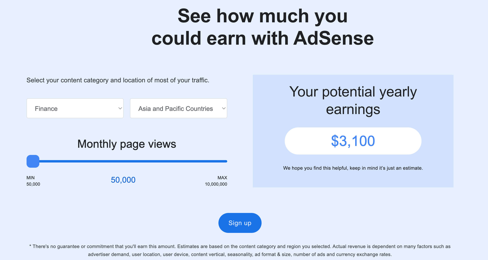
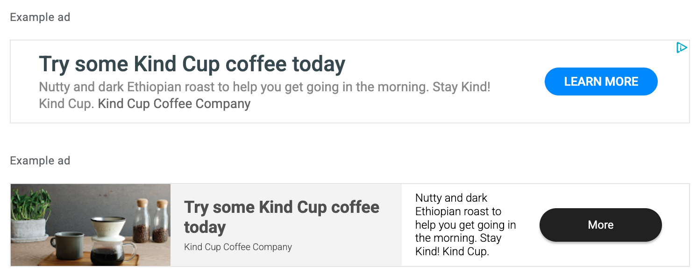
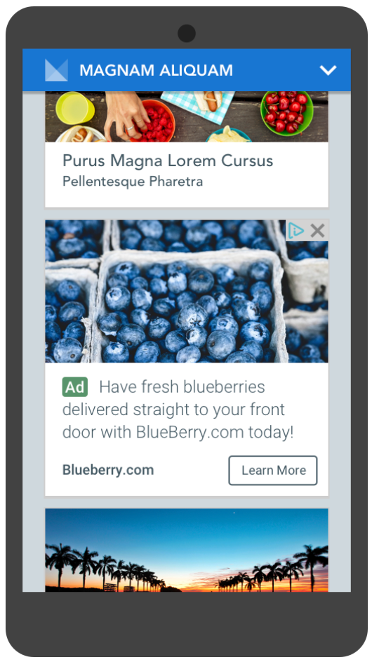
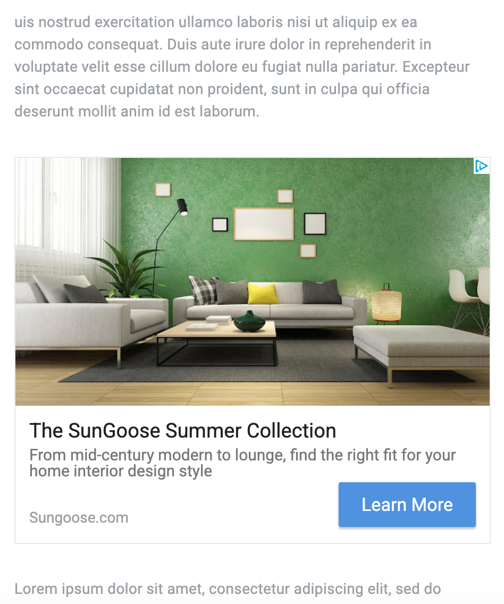
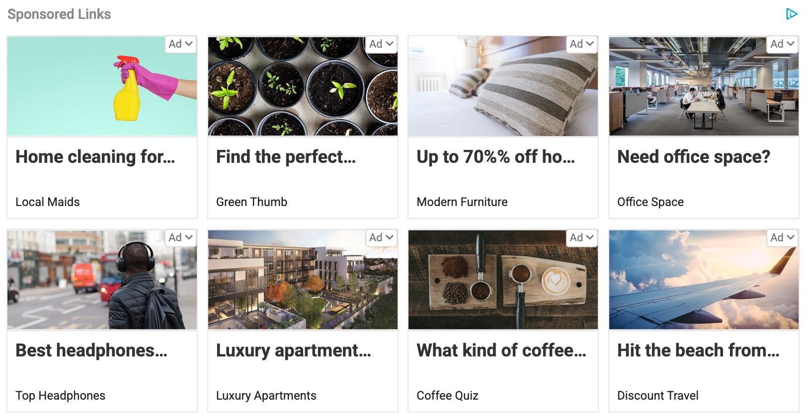
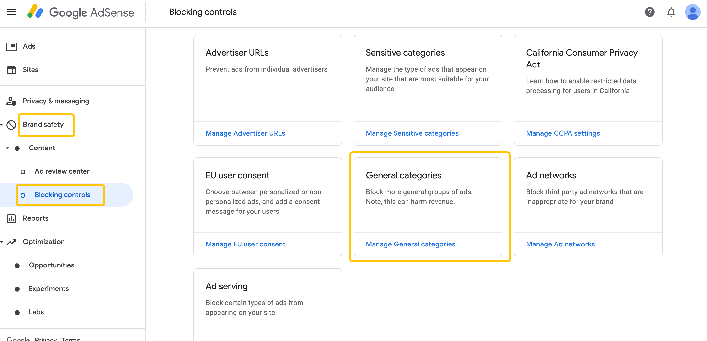

# How to Maximize AdSense Revenue?

If you have already followed the [previous guide](https://chloevolution.com/posts/how-to-earn-money-with-adsense/) and successfully placed **Google AdSense** ads on your website, congratulations — you’ve taken the first step toward earning! However, many new site owners find that **traffic comes, but revenue is not ideal**. At this point, improving AdSense revenue becomes crucial.

## Understanding AdSense Revenue Mechanism

Before optimizing revenue, it’s essential to understand **how AdSense makes money**. Simply put, your website traffic and ad interactions determine revenue, which mainly comes from **ad impressions (RPM)** and **ad clicks (CPC)**.

### Two Sources of Ad Revenue

| Revenue Type                            | Description                                                                           | Example                                     |
| --------------------------------------- | ------------------------------------------------------------------------------------- | ------------------------------------------- |
| **RPM (Revenue per 1,000 impressions)** | Each pageview counts as an ad impression. Revenue is calculated per 1,000 impressions | If RPM is \$2, 1,000 pageviews earn you \$2 |
| **CPC (Cost per Click)**                | Revenue generated when a user clicks an ad                                            | If CPC is \$0.5, each ad click earns \$0.5  |

Total ad revenue can be understood as:

**Total Revenue = (RPM × Pageviews ÷ 1000) + (CPC × Clicks)**

In other words, the higher your website traffic, the more ad impressions and clicks you get, and the higher your revenue.

### Key Metrics: CTR and RPM

* **CTR (Click-Through Rate)**: Clicks ÷ Ad Impressions

  * A higher CTR means the ad is more engaging, increasing CPC revenue potential.
* **RPM (Revenue per 1,000 impressions)**: Average revenue per 1,000 ad impressions

  * RPM helps measure overall revenue efficiency, influenced by traffic and ad pricing.

These two metrics complement each other: CTR drives click revenue, RPM drives impression revenue, and together they determine your site’s overall performance.

### Ad Rates Depend on Region and Industry

Ad rates (RPM and CPC) are not fixed; they mainly depend on your website’s **industry** and **visitor location**.

### High-Revenue Countries

| Rank | Country    | Avg CPC (USD) | CTR   | Official Language     | Second Language |
| ---- | ---------- | ------------- | ----- | --------------------- | --------------- |
| 1    | Iceland    | \$0.83        | 0.55% | Icelandic             | English         |
| 2    | Albania    | \$0.65        | N/A   | Albanian              | English         |
| 3    | Luxembourg | \$0.65        | 0.55% | Luxembourgish, French | German, English |
| 4    | USA        | \$0.61        | 0.75% | English               | Spanish         |
| 5    | Australia  | \$0.57        | 0.72% | English               | N/A             |

Source: [World Population Review](https://worldpopulationreview.com/country-rankings/adsense-cpc-rates-by-country)

### High-Revenue Industries

| Rank | Industry        | Avg RPM (USD) | Example Topics                                      |
| ---- | --------------- | ------------- | --------------------------------------------------- |
| 1    | Finance         | \$20–\$50     | Personal loans, credit cards, insurance             |
| 2    | Real Estate     | \$20–\$40     | Property listings, market trends, investment advice |
| 3    | Legal Services  | \$20–\$50     | Personal injury law, legal consultation             |
| 4    | Tech & Software | \$15–\$40     | SaaS tools, software reviews, tech products         |
| 5    | Education       | \$10–\$30     | Online courses, certifications, learning resources  |

Source: [Ranktracker](https://www.ranktracker.com/blog/which-niches-have-the-highest-rpm-in-adsense)

💡 To increase AdSense revenue, you can either **increase traffic** or **optimize your website’s niche and target visitor regions** to improve ad rates.

Google also offers an [AdSense Revenue Calculator](https://adsense.google.com/intl/en_us/start/), allowing you to estimate potential earnings by selecting industry and location:

## Types of AdSense Ads

Before boosting revenue, it’s important to understand the different ad types. Each ad type varies in display format, placement, and revenue potential, and choosing the right type can help you monetize more efficiently.

### Display Ads

Display ads can be square, banner, or vertical. They automatically resize to fit your site but can also have fixed dimensions for consistent layout. Suitable for sidebars, footers, or between article paragraphs, they maintain good visual appeal and functionality across desktop and mobile, making them the most common and beginner-friendly ad type.

### In-Feed Ads

In-feed ads are native ads embedded within article lists or product lists, blending seamlessly with surrounding content. Especially effective on mobile, they don’t interrupt browsing and can be customized to match your site’s style, providing both aesthetic and functional value.

### In-Article Ads

In-article ads are also native ads, placed between paragraphs of content and adapting to the text flow. They work well on desktop and mobile, providing good monetization without disrupting reading, particularly in long-form content.

### Multiplex Ads

Multiplex ads display multiple ad blocks within one unit, usually in a grid format. They can be horizontal or vertical and are ideal for article endings or sidebars, concentrating attention from users who have finished reading. Multiplex ads can also be customized to match your site’s design, increasing exposure effectively.

💡 **Tips**:

* Beginners should start with **Display Ads** and **In-Article Ads** for ease of use and stable revenue.
* **In-Feed Ads** suit pages with rich content lists.
* **Multiplex Ads** work best on high-traffic pages, boosting clicks and revenue.

## Ad Layout and Placement Optimization

Ad placement and layout directly impact revenue. Proper placement can improve CTR and impressions while maintaining user experience.

### 1. Place Ads Naturally with Content

* **Display Ads**: Ideal for sidebars, footers, or between paragraphs. Horizontal banners work well at the bottom; square ads fit sidebars.
* **In-Feed Ads**: Embed within article/product lists to blend with content.
* **In-Article Ads**: Place 1–2 per article to avoid disruption.
* **Multiplex Ads**: Suitable for article endings or sidebars to increase exposure.

### 2. Keep Pages Clean, Avoid Ad Overload

* Too many ads can slow page load, harming UX and SEO.
* Google scores page experience, and excessive ads can reduce revenue potential or cause penalties.

### 3. Prioritize High-Revenue Ads

* Use Auto Ads to let Google intelligently place ads based on behavior and layout.
* Combine with manual placement to ensure high-traffic pages display ads in optimal positions (top, middle, end).

### 4. Test Different Placements and Formats

* Experiment with ad types, sizes, and positions; monitor CTR and RPM.
* Analyze backend data regularly to find top-performing combinations and optimize other pages.
* Manually block ad categories that take up too much space and disrupt reading:
  

### 5. Mobile Optimization

* Ensure ads don’t block content or break layout on mobile.
* Banner and In-Feed Ads perform well on phones, increasing clicks.

💡 **Pro Tip**: Space ads naturally with content to avoid disrupting reading while allowing ads to appear seamlessly, improving both experience and revenue.

## Common Mistakes and Precautions

When using AdSense, some common mistakes and precautions can lead to revenue loss or account suspension if violated.

### 1. Avoid Incentivized or Fraudulent Clicks

* **Do not encourage users to click ads**: e.g., “Click here to earn money” or “Support our ads” pop-ups.
* **Do not use automated click tools**: Scripts, plugins, or services that artificially increase clicks are strictly prohibited.
* **Keep clicks natural**: AdSense revenue should come from genuine user interest, not manipulation.

### 2. Don’t Overload Ads, Maintain UX

* Excessive ads disrupt layout and drive visitors away.
* Carefully set ad number and placement, keeping content readable.
* Match ad type with page content, e.g., In-Article Ads between paragraphs, rather than filling the page.

### 3. Regularly Check Site Compliance

* Review content to avoid adult, gambling, or illegal download material.
* Ensure ad codes are intact and functioning.
* Monitor AdSense Policy Center notifications and address potential issues promptly to prevent revenue loss.

