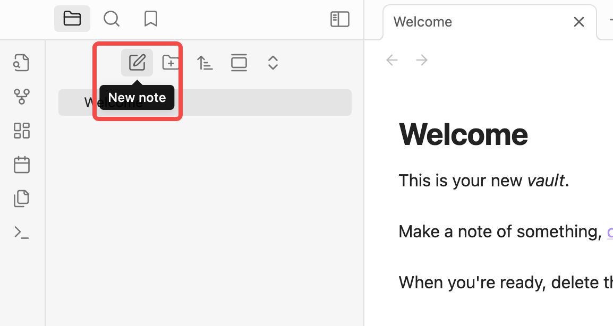
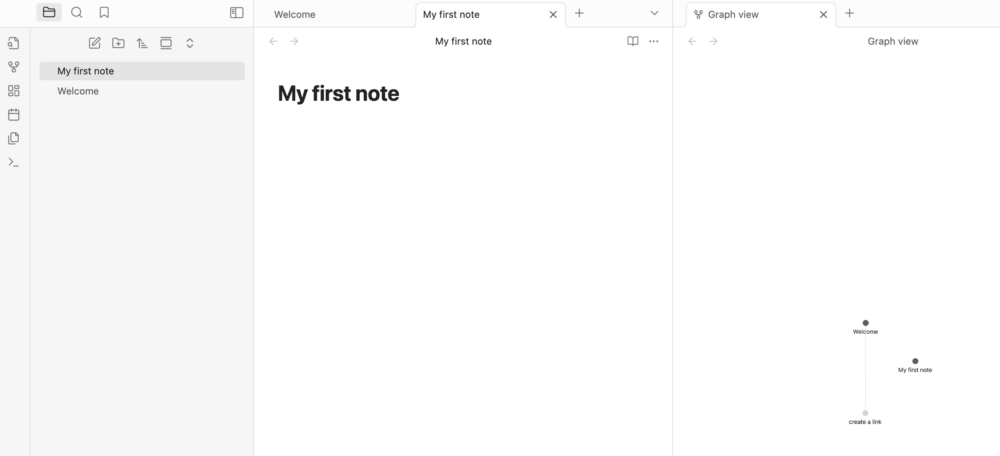
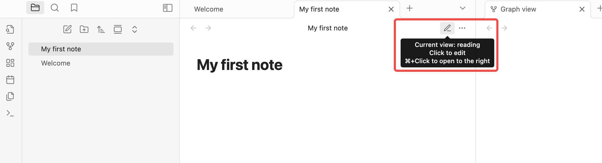
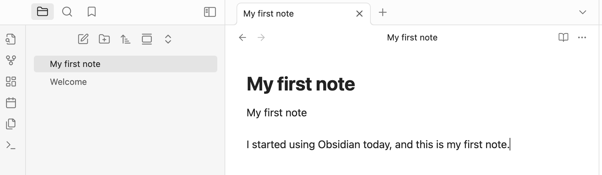
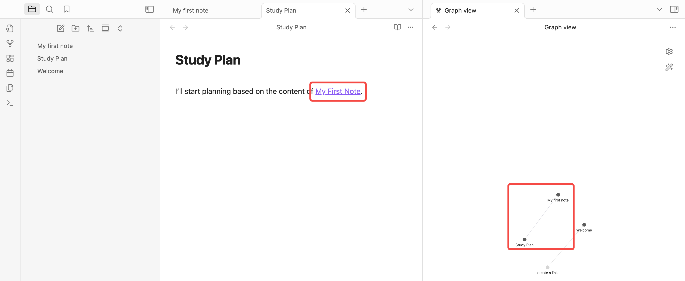
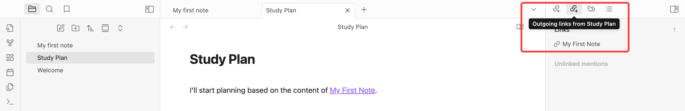
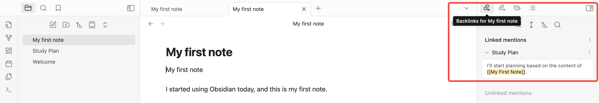

# Complete Guide to Installing and Getting Started with Obsidian


In the era of information overload, more and more people are realizing that organizing and consolidating knowledge is more important than acquiring it. [Obsidian](https://obsidian.md/), a note-taking app focused on **local knowledge management**, has rapidly gained popularity among productivity enthusiasts and knowledge workers in recent years. It is not just another cloud-based note-taking tool but a "second brain" system that emphasizes **local storage, Markdown formatting, and linked thinking**.

## The Core Philosophy of Obsidian

At its core, Obsidian is about building a knowledge network that you control. Unlike traditional linear note-taking, Obsidian advocates for **nonlinear linked notes**. By linking different notes, you can create a multidimensional, interconnected knowledge graph.

Its design is partly inspired by the Zettelkasten (slip-box) method, encouraging users to record atomic units of information and naturally organize them into a network structure through bidirectional links (backlinks).

## Key Features of Obsidian

### 1. Local Markdown Editing

Every note in Obsidian is saved as a local `.md` file. This means you have complete control over your data, with no reliance on the cloud. Notes can be version-controlled, encrypted, synced, or even opened with other Markdown editors.

Markdown is a lightweight markup language designed to make it easier for humans to read and write formatted text while also being convertible to well-structured HTML (web language). Its syntax is simple and intuitive, requiring no complex formatting operations, making it ideal for writing notes, documentation, blogs, or even books.


### 2. Bidirectional Linking and Backlinks

In your notes, you can quickly reference other notes using `[[Note Title]]`. Obsidian automatically generates a "reference record" in the linked note. This greatly enhances the connectivity between notes, fostering the organic growth of your knowledge network.

### 3. Graph View

The Graph View visually displays the connections between all your notes. This view isn't just aesthetically pleasing—it helps you identify missing knowledge nodes and potential connections.

### 4. Plugin Ecosystem

Obsidian offers a rich plugin interface, with both official and community-contributed plugins. Whether you need task management, calendars, Kanban boards, full-text search, highlighting, or writing aids, you'll find a plugin to suit your needs.

### 5. Offline-First, Privacy-Focused

All of Obsidian's features work locally, meaning you can use it without an internet connection. For users who prioritize data security and privacy, this is a highly attractive feature.

## Who Is Obsidian For?

* Students and researchers looking to systematically organize knowledge
* Content creators building personal knowledge bases
* Programmers and writers who prefer Markdown
* Users who value privacy and data sovereignty
* Those seeking a local alternative to cloud-based note-taking tools like Notion or Evernote

## How to Install Obsidian?

### Step 1: Download Obsidian

Based on your computer's operating system, visit the [Obsidian website](https://help.obsidian.md/install) to download the appropriate version by clicking "Download":


Obsidian supports **Windows**, **macOS**, and **Linux** desktop platforms, as well as **iOS** and **Android** mobile platforms. Below, we'll detail the installation steps for macOS, while users on other platforms can refer to the official documentation.

### Step 2: Detailed macOS Installation Guide

#### 1. Choose the Correct Installation Package

The download page will automatically recommend the version for your system, but you should also confirm:

- **Apple Silicon (M1/M2/M3/M4 chips)**: Select the "Apple Silicon" version
- **Intel chips**: Select the "Intel" version

If you're unsure which chip your Mac has, click the  icon in the top-left corner → "About This Mac" → check the "Chip" or "Processor" information.

After downloading, you'll get a `.dmg` file (e.g., `Obsidian-1.x.x-arm64.dmg`).

#### 2. Install to the Applications Folder

1. **Double-click the downloaded `.dmg` file**  
   The system will mount the disk image and open an installation window.

2. **Drag the Obsidian icon to the Applications folder**  
   Following the window's instructions, drag the Obsidian icon to the Applications folder icon on the right.

3. **Wait for the copy to complete**  
   The system will automatically copy Obsidian to `/Applications/Obsidian.app`, which is the standard location for macOS applications.

4. **Eject the disk image**  
   Once copying is complete, right-click the Obsidian disk icon on your desktop and select "Eject."

#### 3. First Launch and Permission Setup

1. **Open Obsidian**  
   You can launch it using any of these methods:
   - Find the Obsidian icon in **Launchpad** and click it
   - Go to **Finder → Applications**, find Obsidian, and double-click
   - Use **Spotlight Search** (press `Cmd + Space`, type "Obsidian")

2. **Handle the "Cannot Verify Developer" prompt**  
   On first launch, macOS may display: "Cannot open Obsidian because the developer cannot be verified."
   
   **Solution**:
   - Click "Cancel"
   - Open "System Settings" → "Privacy & Security"
   - Scroll to the bottom, where you'll see a prompt about Obsidian
   - Click the "Open Anyway" button
   - In the confirmation dialog, click "Open"

3. **Grant necessary permissions**  
   Obsidian may request the following permissions:
   - **File and folder access**: Required, as Obsidian needs to read and write your note files
   - **Notifications** (optional): For reminders and plugin notifications
   
   It's recommended to grant these permissions for the full experience.

#### 4. Vault Storage Location Recommendations

While Obsidian itself installs to the `/Applications` folder, your **note data (Vault) can be stored anywhere**.

Recommended storage locations:

| Storage Location | Advantages | Best for |
|-----------------|-----------|----------|
| `~/Documents/Obsidian` | Local storage, fast access | Single-device use, no sync needed |
| `~/Library/Mobile Documents/iCloud~md~obsidian/` | Automatic iCloud sync | Syncing between multiple Apple devices |
| `~/Dropbox/Obsidian` | Dropbox sync | Cross-platform sync (Mac/Windows/Linux) |
| External drive/USB | Portable use | Moving notes between different computers |

**Note**: You choose the Vault location when creating your note repository, and you can change it later.

### Other Platform Installation Instructions

#### Windows Users

The Windows version offers two installation methods:

- **User Installer**: Installs to `%AppData%\Local\Obsidian`, doesn't require admin privileges
- **System Installer**: Installs to `C:\Program Files\Obsidian`, requires admin privileges

Download the `.exe` installer, double-click to run, and follow the wizard to complete the installation.

**Install via package managers** (optional):
```powershell
# Using Scoop
scoop bucket add extras
scoop install obsidian

# Using Chocolatey
choco install obsidian
```

#### Linux Users

Linux supports multiple installation methods:

- **AppImage**: Download, add execute permissions, and run—no installation needed
- **Snap**: `sudo snap install obsidian --classic`
- **Flatpak**: `flatpak install flathub md.obsidian.Obsidian`

For detailed steps, refer to the [official Obsidian installation documentation](https://help.obsidian.md/Getting+started/Download+and+install+Obsidian).

### Installation Types and Location Options Explained

Understanding the different installation options before installing Obsidian can help you make the best choice for your needs.

#### 1. Installation Type Comparison (Windows Users)

The Windows version of Obsidian offers two installation types with the following key differences:

| Comparison | User Install | Install for All Users |
|-----------|--------------|----------------------|
| **Installation Location** | `%AppData%\Local\Obsidian` | `C:\Program Files\Obsidian` |
| **Admin Privileges** | ❌ Not required | ✅ Required |
| **Accessibility** | Only available to the current Windows user | Available to all Windows users on the computer |
| **Use Cases** | Personal computers, restricted work computers | Shared family computers, multi-user environments |
| **Update Permissions** | Current user can update independently | Requires admin privileges to update |

**Recommended Choices**:
- **Personal computer or work computer without admin access**: Choose **User Install**
- **Computer shared by multiple users**: Choose **Install for All Users**

#### 2. Default Installation Paths

The Obsidian **application** installs to the following default locations on different platforms:

| Platform | Default Installation Path |
|----------|--------------------------|
| **Windows (User Install)** | `C:\Users\YourUsername\AppData\Local\Obsidian\` |
| **Windows (All Users)** | `C:\Program Files\Obsidian\` |
| **macOS** | `/Applications/Obsidian.app` |
| **Linux (AppImage)** | No installation needed, can be placed anywhere |
| **Linux (Snap)** | `/snap/obsidian/` |

**Important Notes**:
- The paths above are for the **Obsidian application itself**
- Your **note data (Vault)** is stored separately and can be placed anywhere you want
- These two are completely separate, which is one of Obsidian's core design principles

#### 3. Can You Customize the Installation Location?

**Application Installation Location**:

- **Windows**: Some installers allow you to choose a custom path in the installation wizard, but using the default path is usually fine
- **macOS**: The application must be installed in the `/Applications` folder (this is macOS standard practice)
- **Linux (AppImage)**: Can be placed anywhere, as AppImage is portable

**Vault (Note Repository) Storage Location**:

✅ **Completely Free Choice!** You can create your Vault in:
- Any folder on your system drive
- External hard drive
- Network drive (not recommended, may affect performance)
- Cloud sync folders (Dropbox, iCloud, OneDrive, etc.)

#### 4. Portable Installation: Can You Install to an External Drive/USB?

If you need to carry Obsidian and your notes between different computers, here are several options:

**Option 1: Carry Only the Vault (Recommended)**
- **Method**: Place the Vault folder on an external drive/USB
- **Usage**: Install Obsidian normally on each computer, then open the Vault from the external device
- **Pros**: Simple, reliable, good performance
- **Cons**: Requires installing the Obsidian app on each computer

**Option 2: Portable App + Vault (Fully Portable)**
- **Windows**:
  - Download the portable version (available from third-party sources; not officially provided)
  - Or use User Install and copy the entire Obsidian folder to a USB drive
- **macOS**:
  - Copy `/Applications/Obsidian.app` to the external drive
  - Also place the Vault on the external drive
  - ⚠️ Note: First run on other Macs may require handling security permissions
- **Linux (AppImage)**:
  - Place the AppImage file and Vault together on the external drive
  - This is the ideal portable solution

**Option 3: Cloud Sync (Most Convenient)**
- Use cloud services like Dropbox, iCloud Drive, or OneDrive to sync your Vault
- Install Obsidian on each device and point it to the cloud sync folder
- No need to physically move storage devices

**⚠️ USB Drive Usage Considerations**:
- When using a **USB drive**, Obsidian's performance may be affected (especially USB 2.0)
- Recommend using **USB 3.0+ external SSD** for better experience
- Back up regularly! Portable storage devices have risks of loss and damage

#### 5. Do You Need Administrator Privileges?

| Platform | Admin Privileges Required | Notes |
|----------|--------------------------|-------|
| **Windows (User Install)** | ❌ Not required | Installs to current user directory |
| **Windows (All Users)** | ✅ Required | Installing to Program Files requires admin privileges |
| **macOS** | ❌ Not required | Dragging to Applications doesn't require admin password |
| **Linux** | Depends | AppImage doesn't require; Snap/Flatpak may need sudo |

**Using Obsidian in Restricted Environments**:

If you don't have administrator privileges on a company or school computer:

1. **Windows**: Choose the User Install version, which installs to the user directory
2. **macOS**: Usually won't encounter permission issues
3. **Alternative**: Use AppImage (Linux) or portable version, run directly from USB drive

**Common Questions**:

> **Q: I can't install Obsidian on my university computer. What should I do?**  
> A: Try these methods:
> - Download the User Install version (doesn't require admin privileges)
> - Use the portable version, run from a USB drive
> - Contact IT department to request installation permission
> - Use your personal laptop

> **Q: Where should I place my Vault?**  
> A: Depends on your needs:
> - **Single-device use**: `~/Documents/Obsidian`
> - **Multi-device sync**: iCloud, Dropbox, or other cloud sync folders
> - **Privacy-first**: Encrypted external hard drive
> - **Team collaboration**: Shared network drive (note: watch for sync conflicts)

### Common Installation Issues and Solutions

During the Obsidian installation process, users may encounter various issues. Below are common problems and their solutions.

#### Issue 1: Cannot Install Obsidian on Windows 10

**Symptoms**:
- No response after double-clicking the installer
- Installer crashes or displays an error
- Message stating "Cannot run this app" or "This app can't run on your PC"

**Possible Causes and Solutions**:

**Cause 1: Insufficient System Permissions**
- **Solution**:
  1. Download the **User Install version** instead of the System Install version
  2. Right-click the installer → Select "Run as administrator"
  3. If on a restricted company/school computer, try using a portable version or running from a USB drive

**Cause 2: Windows Defender or Antivirus Software Blocking**
- **Solution**:
  1. Temporarily disable Windows Defender or your antivirus software
  2. Add the Obsidian installer to the whitelist
  3. Re-download the installer from the official website (ensure file integrity)

**Cause 3: Outdated System Version**
- **Solution**:
  1. Check your Windows 10 version (Settings → System → About)
  2. Obsidian requires Windows 10 version 1809 or higher
  3. Update Windows to the latest version

**Cause 4: Corrupted Installation File**
- **Solution**:
  1. Delete the downloaded installer
  2. Clear browser cache
  3. Re-download the complete installer from the official website
  4. Try downloading with a different browser (Chrome, Firefox, Edge)

**Cause 5: Missing Required System Components**
- **Solution**:
  1. Install the latest [Visual C++ Redistributable](https://aka.ms/vs/17/release/vc_redist.x64.exe)
  2. Install [.NET Framework 4.7.2 or higher](https://dotnet.microsoft.com/download/dotnet-framework)
  3. Restart your computer and try installing again

#### Issue 2: Cannot Install Obsidian on University/Company Computers

**Symptoms**:
- "Administrator privileges required" prompt but you don't have the admin password
- IT department restricts third-party software installation
- Network proxy prevents downloading or verification

**Solutions**:

**Solution 1: Use User Install Version (Recommended)**
1. Download the **User Installer** version of Obsidian
2. This version installs to your user directory `%AppData%` and doesn't require admin privileges
3. Installation path: `C:\Users\YourUsername\AppData\Local\Obsidian`

**Solution 2: Use Portable Version**
1. Find the Obsidian Portable Version
2. Copy the portable version to a USB drive or personal folder
3. Run directly without installation

**Solution 3: Install via Package Manager (If Allowed)**
If your computer allows Scoop or Chocolatey:
```powershell
# Using Scoop (doesn't require admin privileges)
scoop bucket add extras
scoop install obsidian

# Using Chocolatey (requires admin privileges)
choco install obsidian
```

**Solution 4: Resolve Proxy Issues**
If the problem is caused by network proxy:
1. **Download offline installer**:
   - Download the complete installer on a home or accessible network
   - Transfer to the restricted computer via USB drive
2. **Configure proxy settings**:
   - Ask IT department for proxy server address and port
   - Configure proxy in Windows settings (Settings → Network & Internet → Proxy)
3. **Use mobile hotspot**:
   - Temporarily use mobile hotspot to bypass company/school network restrictions

**Solution 5: Request IT Department Permission**
1. Submit a software installation request to the IT department
2. Explain that Obsidian is a local note-taking app with no data upload
3. Emphasize Obsidian's security and privacy protection features
4. Provide official website and software documentation

**Final Alternative**:
- Use your personal laptop
- Use Obsidian mobile version (iOS/Android) on your phone

#### Issue 3: How to Reinstall Obsidian

Sometimes you may need to reinstall Obsidian to resolve issues or change the installation type. Here are the reinstallation steps:

**Complete Uninstallation Steps (Windows)**:

1. **Uninstall the application**:
   - Open "Settings" → "Apps" → "Apps & features"
   - Find "Obsidian"
   - Click "Uninstall"

2. **Delete residual files** (optional, for thorough cleanup):
   - Delete installation directory:
     - User Install: `C:\Users\YourUsername\AppData\Local\Obsidian`
     - System Install: `C:\Program Files\Obsidian`
   - Delete configuration files: `C:\Users\YourUsername\AppData\Roaming\obsidian`
   - ⚠️ **Note**: This won't delete your Vault (note data), as Vaults are stored separately

3. **Re-download and install**:
   - Download the latest version from the official website
   - Follow the normal installation process

**Complete Uninstallation Steps (macOS)**:

1. **Delete the application**:
   - Open Finder → Applications
   - Find Obsidian.app
   - Drag to Trash (or right-click → Move to Trash)

2. **Delete configuration files** (optional, for thorough cleanup):
   - Open Finder, press `Cmd + Shift + G`
   - Enter `~/Library/Application Support/obsidian`
   - Delete that folder
   - ⚠️ **Note**: This won't delete your Vault data

3. **Empty Trash and reinstall**

**Complete Uninstallation Steps (Linux)**:

```bash
# AppImage (directly delete file)
rm ~/Downloads/Obsidian-*.AppImage

# Snap
sudo snap remove obsidian

# Flatpak
flatpak uninstall md.obsidian.Obsidian

# Delete configuration files (optional)
rm -rf ~/.config/obsidian
```

**Restoring Data After Reinstallation**:
- Your Vault (note data) won't be affected
- After reopening Obsidian, select "Open folder as vault"
- Point to your original Vault folder

#### Issue 4: Upgrade Install vs Clean Install

**Upgrade Install (Overlay Installation)**

**Definition**: Install a new version directly over the existing installation, retaining all settings and plugins.

**When to Use**:
- Updating Obsidian to a new version
- Fixing corrupted installation files
- Don't want to reconfigure all settings

**How to Do It**:
1. Download the latest version installer
2. Run the installer directly
3. The installer will automatically detect and overlay the existing installation

**Pros**:
- ✅ Retains all plugins and settings
- ✅ Retains theme and appearance configuration
- ✅ Vault completely unaffected
- ✅ Simple and fast operation

**Cons**:
- ❌ May not fully resolve configuration issues from old version
- ❌ Some deep cache issues may persist

**Clean Install (Fresh Installation)**

**Definition**: Completely uninstall the old version (including configuration files), then install the new version.

**When to Use**:
- Obsidian experiencing severe errors or crashes
- Plugin conflicts preventing normal use
- Want to thoroughly clean configuration and start fresh
- Switching installation types (User Install ↔ System Install)

**How to Do It**:
1. Backup important configurations (if needed):
   - Plugin settings: `config_folder/.obsidian/plugins/`
   - Themes: `config_folder/.obsidian/themes/`
   - Custom CSS: `config_folder/.obsidian/snippets/`
2. Completely uninstall Obsidian (refer to uninstallation steps above)
3. Delete configuration folder
4. Re-download and install Obsidian
5. Reconfigure or restore backed-up settings

**Pros**:
- ✅ Resolves deep configuration issues
- ✅ Clears all cache and temporary files
- ✅ Gets a clean "factory settings" state
- ✅ Good for troubleshooting plugin conflicts

**Cons**:
- ❌ Need to reinstall all plugins
- ❌ Need to reconfigure all settings
- ❌ More time-consuming

**Comparison Summary**:

| Comparison | Upgrade Install | Clean Install |
|-----------|----------------|---------------|
| **Settings Retained** | ✅ Retained | ❌ Cleared |
| **Plugins Retained** | ✅ Retained | ❌ Need reinstall |
| **Vault Data** | ✅ Unaffected | ✅ Unaffected |
| **Resolves Deep Issues** | ❌ May be ineffective | ✅ Effective |
| **Operation Time** | ⚡ Fast | 🐢 Slower |
| **Recommended Scenario** | Routine updates | Troubleshooting |

**Recommended Strategy**:
1. **Routine updates**: Use upgrade install
2. **Encountering problems**: Try upgrade install first
3. **Problem persists**: Then perform clean install
4. **Switching installation types**: Must use clean install

#### Issue 5: Cannot Start or Crashes After Installation

**Symptoms**:
- Obsidian closes immediately after opening
- Stuck on loading screen during startup
- Displays white screen or black screen

**Solutions**:

**Method 1: Clear Cache and Restart**
```bash
# Windows
# Delete cache folders
%AppData%\obsidian\Cache
%AppData%\obsidian\GPUCache

# macOS
~/Library/Application Support/obsidian/Cache
~/Library/Application Support/obsidian/GPUCache

# Linux
~/.config/obsidian/Cache
~/.config/obsidian/GPUCache
```

**Method 2: Disable Hardware Acceleration**
1. Find Obsidian's startup file
2. Right-click → Properties → Target
3. Add after the target path: `--disable-gpu`
4. Example: `"C:\...\Obsidian.exe" --disable-gpu`

**Method 3: Start in Safe Mode**
- Windows: Hold `Ctrl + Shift` and double-click the Obsidian icon
- macOS: Hold `Cmd + Shift` and double-click the Obsidian icon
- This disables all community plugins, helping diagnose plugin conflicts

**Method 4: Check System Compatibility**
- Ensure system meets minimum requirements
- Update graphics card drivers
- Update operating system to the latest version

#### Getting More Help

If none of the above methods resolve your issue:

1. **Check official documentation**: [Obsidian Help](https://help.obsidian.md/)
2. **Visit official forum**: [Obsidian Forum](https://forum.obsidian.md/)
3. **Join Discord community**: [Obsidian Discord](https://discord.gg/obsidianmd)
4. **Check GitHub Issues**: [Obsidian GitHub](https://github.com/obsidianmd)
5. **Contact official support**: support@obsidian.md

**When submitting an issue, remember to include**:
- Operating system and version
- Obsidian version number
- Detailed description of the problem
- Error message screenshots or logs
- Solutions already attempted

### Step 3: Create or Open a Vault

After installation, open Obsidian. You'll see the following three options:


This is Obsidian's prompt for "how to get started" upon first launch. In simple terms, a **Vault is your note repository**, corresponding to a local folder where all your Markdown (`.md`) files are stored:

### 1. Create a New Vault

**Meaning**: Start from scratch by creating a new note folder. Obsidian will manage all your notes in that folder.

**Ideal for**:
* First-time Obsidian users
* Those who want a clean, independent note space (e.g., "Work Notes" or "Study Notes")

### 2. Open Folder as Vault

**Meaning**: You already have a folder containing Markdown files and want to use it directly as your Obsidian vault.

**Ideal for**:
* Users who previously stored `.md` files locally with other tools
* Those who don't want to move or copy existing content and prefer to manage it in place

### 3. Open Vault from Obsidian Sync

**Meaning**: You've used Obsidian Sync (Obsidian's paid sync feature) on another device and want to pull that synced vault onto your current machine.

**Ideal for**:
* Users who have subscribed to Obsidian Sync
* Those who sync data across multiple devices

**If you haven't subscribed to Sync**, you can ignore this option.

Since this is my first time using Obsidian, I'll create a new note folder by naming it and selecting a storage location:


## Getting Started After Installation

After creating or opening a Vault, it's recommended to configure some basic settings to make Obsidian better suited to your workflow. These settings will help you get started faster and avoid common confusion.

### 1. Interface Language Settings

Obsidian automatically selects the interface language based on your system language, but you can also change it manually:

**Setup Steps**:
1. Click the **Settings icon** (gear icon) in the bottom-left corner
2. Find **"General"** in the left menu
3. In the **"Language"** dropdown menu, select **"English"** or your preferred language
4. Restart Obsidian for the changes to take effect


**Tip**: Language settings affect the display language of the entire interface, menus, and help documentation.

### 2. Appearance Theme Selection

Obsidian offers two base themes—light and dark—as well as a rich collection of community themes.

**Change Base Theme**:
1. Open **Settings → Appearance**
2. Under **"Base color scheme"**, select:
   - **Light**: Suitable for daytime use, easier on the eyes
   - **Dark**: Suitable for nighttime use, reduces blue light exposure
   - **Adapt to system**: Automatically switches based on your operating system's dark mode

**Install Community Themes** (optional):
1. In **Settings → Appearance**, click the **"Manage"** button
2. Browse the community theme library and find a theme you like
3. Click **"Install and use"**

**Popular Theme Recommendations**:
- **Minimal**: Minimalist style, excellent performance
- **Things**: Inspired by the Things task management app
- **Shimmering Focus**: Elegant transition effects
- **AnuPpuccin**: Soft color scheme, eye-friendly

### 3. Automatic File Saving Mechanism

Many new users ask: "**Do I need to manually save after editing a Markdown note?**"

**The answer is: No!**

Obsidian notes **save automatically**—you don't need to press `Ctrl+S` or `Cmd+S` to save files.

**How Automatic Saving Works**:
- When you type content in the editor, Obsidian automatically writes changes to the corresponding `.md` file **within a few seconds**
- You can see the file's modification time update in real-time in the file explorer
- Even if Obsidian closes unexpectedly, your content won't be lost (at most a few seconds of input may be lost)

**How to Verify Automatic Saving**:
1. Create a new note and enter some content
2. Open your system's file manager (Finder or File Explorer)
3. Navigate to your Vault folder
4. Open the corresponding `.md` file with a text editor
5. You'll see the content you just typed in Obsidian has already been saved

**Manual Save Shortcut** (optional):
Although manual saving isn't required, if you're used to pressing the save key, you can still press `Ctrl+S` (Windows/Linux) or `Cmd+S` (Mac) without any side effects.

### 4. Essential Core Plugin Recommendations

Obsidian plugins are divided into two categories:
- **Core Plugins**: Built-in by the official team, some enabled by default
- **Community Plugins**: Third-party developed, require manual installation

For beginners, it's recommended to familiarize yourself with the following core plugins:

#### Recommended Core Plugins to Enable

Go to **Settings → Core plugins** and ensure the following plugins are enabled:

| Plugin Name | Function | Recommended |
|-------------|----------|-------------|
| **File explorer** | File browser for managing notes and folders | ✅ Essential (enabled by default) |
| **Search** | Global search functionality | ✅ Essential (enabled by default) |
| **Quick switcher** | Quickly switch between notes (shortcut `Ctrl/Cmd+O`) | ✅ Highly recommended |
| **Graph view** | Visualize note link relationships | ✅ Recommended |
| **Backlinks** | Display backlinks | ✅ Recommended |
| **Outgoing links** | Display current note's outgoing links | ✅ Recommended |
| **Tag pane** | Tag panel | ✅ Recommended |
| **Page preview** | Hover to preview note content | ✅ Recommended |
| **Templates** | Note template functionality | ✅ Recommended (advanced use) |
| **Daily notes** | Daily notes functionality | ✅ Recommended (detailed intro later) |
| **Slash commands** | Slash command quick input | ⭐ Optional |
| **Command palette** | Command palette (shortcut `Ctrl/Cmd+P`) | ✅ Highly recommended |

**How to Enable Core Plugins**:
1. Open **Settings → Core plugins**
2. Find the plugin you want to enable
3. Click the toggle button on the right to enable

#### Getting Started with Community Plugins (Optional)

If you want to explore more features, you can install community plugins:

1. Open **Settings → Community plugins**
2. Click **"Turn on community plugins"**
3. Click the **"Browse"** button to view available plugins
4. Search for and install the plugins you need

**Beginner-Friendly Community Plugin Recommendations**:
- **Calendar**: Calendar view, works well with Daily notes
- **Kanban**: Kanban view for task management
- **Excalidraw**: Draw hand-drawn style diagrams in notes
- **Advanced Tables**: Enhanced Markdown table editing experience

⚠️ **Note**: Don't install too many plugins at once. It's recommended to familiarize yourself with the basic features first, then gradually add plugins as needed.

### 5. Recommended Configuration After Creating a Vault

After completing the basic settings above, you can also adjust the following configurations based on your personal needs:

#### (1) Editor Settings

Go to **Settings → Editor**:

- **Spellcheck**: Enable as needed
- **Line numbers**: If you're used to writing code, you can enable line numbers
- **Readable line length**: Limits text width per line, improves reading experience (recommended)
- **Strict line breaks**: Markdown line break rules, beginners should keep this disabled

#### (2) Files and Links Settings

Go to **Settings → Files & Links**:

- **Default location for new notes**:
  - Select **"In the folder specified below"** to specify a default folder (e.g., `Notes/`)
  - This prevents new notes from scattering in the Vault root directory
  
- **New link format**:
  - Recommend using **"Shortest path when possible"**
  - This makes links more concise, like `[[Note Name]]` instead of `[[Folder/Note Name]]`

- **Use [[Wikilinks]]**:
  - Recommend enabling—this is Obsidian's core linking method
  - If you need compatibility with standard Markdown, you can disable this and use `[text](link)` format instead

#### (3) Folder Structure Suggestions

After creating a Vault, you can establish some basic folders to organize your notes:

```
My Vault/
├── 00-Inbox/          # Inbox for temporary ideas and content to organize
├── 01-Projects/       # Project notes
├── 02-Areas/          # Long-term focus areas (e.g., work, study, health)
├── 03-Resources/      # Reference materials, book notes, article excerpts
├── 04-Archives/       # Completed or inactive content
├── Templates/         # Note templates
└── Attachments/       # Images, PDFs, and other attachments
```

**Tip**: Folder structure isn't mandatory. Many users prefer "flat" management, relying entirely on links and tags to organize notes. Choose the method that works best for you.

### 6. Quick Start Tips

After completing the setup, try these operations to familiarize yourself with Obsidian:

1. **Create your first note**: Click the "New note" icon in the top-left corner
2. **Use the quick switcher**: Press `Ctrl/Cmd+O`, type a note name to jump quickly
3. **Open the command palette**: Press `Ctrl/Cmd+P` to see all available commands
4. **Try creating a link**: Type `[[` to trigger note link autocomplete
5. **View the graph**: Click the "Graph view" icon in the top-right corner to see connections between notes

**Next Steps**: After completing the setup, you can start creating notes and exploring bidirectional linking features. Next, we'll detail how to use Obsidian's core functionality.

## Basic Obsidian Interface Structure


After opening a vault, Obsidian's interface is divided into the following areas:

### 1. Left Sidebar (Side Pane)

This is your primary navigation area. You can toggle its visibility using the icon in the top-left corner.

Common modules include:
* **File Explorer**: Displays all your notes and folders. Here, you can create new notes or folders, rename, move items, etc.
* **Search**: Supports full-text search. Enter keywords to find matches across all notes.
* **Tags** (visible if you use tags): Shows all tags used in your notes. Click to view all notes with a specific tag.
* **Backlinks**: Displays which notes "mention the current note," helping you build connections.
* **Graph View**: Visualizes links between notes. Beginners can explore this feature later.

You can manage plugins, themes, and extensions by clicking the icons in the bottom-left corner.

### 2. Central Editing Area (Main Editor)

This is the main workspace for writing and reading notes. You can:
* Double-click to open any note
* Open multiple notes simultaneously (as tabs or split views)
* "Pin" important notes using the pin icon in the top-right corner
* Switch viewing modes (reading, editing, split view, etc.) in the top title bar

### 3. Right Sidebar

Similar to the left sidebar, the right sidebar can display:
* Backlinks for the current note
* Plugin extensions (e.g., calendar, tasks)

### 4. Bottom Status Bar

The gray bar at the bottom shows the current mode (editing/reading), word count, cursor position, and other information.

## How to Start Using Obsidian
### Creating Your First Note

Let’s create a new note and add content:

1. **Click the "New Note" Button**
   In the left sidebar, click the "paper +" icon (hovering shows `New note`).



2. **Name Your Note**
   The system auto-generates a name like "Untitled." Change it to `My First Note.md` and press Enter.

3. **Start Editing**
   You can now edit the note content. If you find you can only edit the title but not the body, check the top-right corner for a "pencil" or "book" icon, representing "edit" and "reading" modes, respectively. In "reading" mode, you can't edit—click to switch:
   
   
   Start typing:

   ```
   My First Note

   Today, I started using Obsidian. This is my first note.
   ```

   Notes save automatically—no manual saving required. Your first note is complete!
   

### Trying Bidirectional Linking

#### What Are Bidirectional Links?
First, let’s understand the concept of bidirectional links in Obsidian:
Bidirectional links (**Backlinks**) are one of Obsidian's most core and valuable features. Their significance lies in:

> **Not only can you "reference" other notes, but Obsidian also automatically shows you "which notes mention the current one."**

This "mutual awareness" is what sets Obsidian apart from traditional note-taking tools:
You don’t manually organize structure—notes "build networks" on their own.

For example, suppose you have two notes:
* Note A: `What is Markdown?`
* Note B: `Obsidian Features Overview`

In Note B, you write:

```
Obsidian supports [[What is Markdown?]] format.
```

What did you do? You **linked Note A in Note B**.

Obsidian automatically displays a "backlink" in Note A:

> "This note is referenced by **Obsidian Features Overview**."

Compare "forward links" and "backlinks":

| Type       | Concept                          | Example               |
| ---------- | -------------------------------- | --------------------- |
| Forward Link | Manually linking another note with `[[ ]]` | In B, type `[[A]]`    |
| Backlink   | Obsidian shows you which notes mention this one | In A, see: "Referenced by B" |

In other words:
* Forward links are you saying, "I reference who"
* Backlinks are the system telling you, "Who references me"

#### Why Are Bidirectional Links Important?

Traditional notes are tree-structured (category → subcategory → file), which easily becomes messy.

Obsidian’s bidirectional links let you build a **networked knowledge structure**, where notes freely connect and cross-reference. This helps you:
* String ideas together
* Rediscover forgotten content
* Build your "second brain"

#### How to View Backlinks in Obsidian?

When you open a note:
* In the bottom-right or right sidebar, there’s a "Backlinks" panel
* It shows "which notes mention this one"
* You can click these notes to quickly jump to their context

In summary:

> **Bidirectional links = Automatically building a knowledge network, no longer taking isolated notes, but letting information interconnect to form a system.**

#### How to Create Bidirectional Links

Let’s try a simple demo:

1. **Create Another New Note**
   Follow the earlier steps to create a note named `Study Plan`

2. **Add the Following Content**:

   ```
   I’ll start planning based on the content of [[My First Note]].
   ```

Now, you’ll see "My First Note" highlighted and clickable. In the right panel, you’ll see a line connecting "Study Plan" and "My First Note":


In the link view, you can also see "Study Plan" linking to "My First Note":


"My First Note" has a backlink from "Study Plan":


3. **Click `[[My First Note]]`**
   You’ll jump to that note.

Now you’ve built a bidirectional link structure, where notes can jump between each other like web pages and automatically track references.

The first time you open Obsidian, it might feel empty, but once you get used to linking notes, it becomes increasingly engaging. Next, I’ll cover more practical uses, like plugin recommendations, search tips, and daily writing organization. If you’re also using Obsidian, let’s explore it together.
