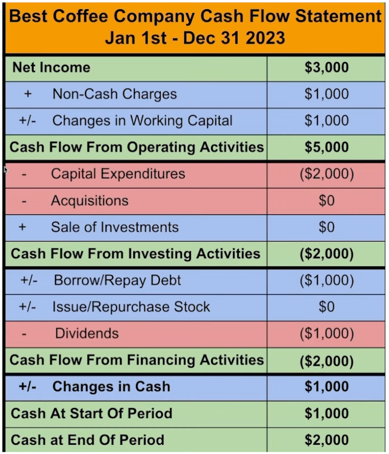

# How to Read Financial Statements of a Company?

Financial statements are reports that companies prepare periodically (usually quarterly or annually) to **summarize and report** their business activities and financial performance.

Warren Buffett has referred to financial statements as the **“language of business.”** For investors, managers, and creditors, they are essential tools for understanding a company’s financial health, profitability, and ability to meet its obligations.

There are three core financial statements, and together they provide a complete view of a company from different perspectives:

1. **Balance Sheet (B/S):** Answers the question, “**What does the company own and what does it owe?**” It is a **snapshot at a specific point in time**, showing the company’s net worth on a given date.
2. **Income Statement (I/S):** Answers the question, “**Did the company make a profit during a period of time?**” It measures the company’s revenues and expenses over a specific accounting period, ultimately yielding net income.
3. **Cash Flow Statement (CFS):** Answers the question, “**How much cash did the company actually generate or use?**” It tracks the real movement of cash during a specific accounting period.

## Balance Sheet (B/S)

The Balance Sheet answers the question: “**What does the company currently own, and what does it owe to others?**” It is similar to a personal net-worth statement.

### Key Features

* **Time frame:** It is a **snapshot at a point in time**. It reflects the company’s financial position only on a specific date (for example, December 31).
* **Basic formula:** This is the core of the B/S and must **always balance**:
  $$\text{Assets} = \text{Liabilities} + \text{Shareholders' Equity}$$

### Main Components

#### 1. Assets

Assets are resources a company **owns** that are expected to bring future economic benefits.

* **Definition:** Assets are the resources a company uses to operate and generate revenue.
* **Classification basis:** Assets are typically classified by **liquidity (speed of conversion to cash or usage)**:

  | Category             | Definition                                                                              | Examples                                                                        |
  | :------------------- | :-------------------------------------------------------------------------------------- | :------------------------------------------------------------------------------ |
  | **Current Assets**   | Assets expected to be converted into cash, sold, or used within one year.               | Cash, inventory (goods), accounts receivable (money customers owe the company). |
  | **Long-Term Assets** | Assets with a useful life of more than one year, contributing to long-term development. | Buildings, equipment, patents, goodwill (acquisition premium).                  |

#### 2. Liabilities

Liabilities are obligations the company **owes** that must be settled in the future through assets or services.

* **Definition:** Liabilities represent the **creditor-funded** portion of the company’s capital.
* **Classification basis:** Liabilities are typically classified by **repayment term**:

  | Category                  | Definition                                                   | Examples                                                                          |
  | :------------------------ | :----------------------------------------------------------- | :-------------------------------------------------------------------------------- |
  | **Current Liabilities**   | Debts or obligations expected to be settled within one year. | Accounts payable (money owed to suppliers), short-term bank loans, wages payable. |
  | **Long-Term Liabilities** | Debts with repayment periods longer than one year.           | Long-term bank loans, corporate bonds.                                            |

#### 3. Shareholders’ Equity

Shareholders’ equity is the company’s **net assets**, representing the portion of assets **belonging to the owners (shareholders)** after deducting liabilities.

* **Definition:** Shareholders’ equity represents the **owner-funded** portion of the company’s capital.
* **Main sources:**

  | Source                    | Definition                                                                                                                                  |
  | :------------------------ | :------------------------------------------------------------------------------------------------------------------------------------------ |
  | **Capital Contributions** | Funds initially invested in the company by shareholders (e.g., money used to purchase common or preferred stock).                           |
  | **Retained Earnings**     | Cumulative profits earned from operations that were **not paid out as dividends**, but kept within the company for reinvestment and growth. |

The Balance Sheet tells you: how much wealth the company owns (assets), how much of that wealth comes from **borrowing (liabilities)**, and how much comes from **shareholder investment and accumulated profits (shareholders’ equity)**.

## Income Statement (I/S)

The Income Statement (also called the Profit and Loss Statement) answers the question: “**Did the company make a profit during the past period?**” It measures the company’s operating performance over a period of time.

### Key Features

* **Time frame:** Measures performance over a **period of time** (e.g., a quarter or a year).
* **Accounting method:** Uses **accrual accounting**.

To understand the Income Statement, you must understand **accrual accounting**:

* The Income Statement recognizes revenue and expenses **when earned or incurred**, not when cash is actually received or paid. For example, if a company completes a sale this month (thus **earning** the revenue) but the customer will pay next month, the revenue is still recorded this month.

Because of this, “net income” on the Income Statement often differs from the actual “cash” received by the company — which is why the **Cash Flow Statement (CFS)** is necessary to track real cash flow.

### Main Components

The Income Statement is usually organized from **top to bottom**, starting with total revenues and subtracting costs and expenses step by step to arrive at net income.

#### 1. Revenue

Revenue is the **top line**, representing total sales generated through the company’s core business during the accounting period.

#### 2. Costs and Expenses

These are all expenditures that must be deducted for revenue to become profit. They are often grouped by nature:

| Type                              | Definition                                                            | Examples                                                        |
| :-------------------------------- | :-------------------------------------------------------------------- | :-------------------------------------------------------------- |
| **Cost of Goods Sold (COGS)**     | **Direct costs** of producing goods or delivering services.           | Raw materials, direct labor.                                    |
| **Operating Expenses**            | **Indirect costs** necessary to maintain day-to-day operations.       | Salaries (non-production), rent, R&D expenses, marketing costs. |
| **Non-Operating Income/Expenses** | Revenue or expenses not directly related to core business activities. | Interest paid or received, gains or losses from selling assets. |
| **Income Taxes**                  | Taxes owed to the government.                                         |                                                                 |

#### 3. Profit Measures

After subtracting different categories of expenses, several layers of profit metrics appear, each reflecting profitability at different stages:

| Profit Metric                | Formula                                        | Meaning                                                                                     |
| :--------------------------- | :--------------------------------------------- | :------------------------------------------------------------------------------------------ |
| **Gross Profit**             | Revenue − COGS                                 | Reflects pricing power and production efficiency.                                           |
| **Operating Income**         | Gross Profit − Operating Expenses              | Shows operating efficiency from **core business activities**, excluding interest and taxes. |
| **Net Income**               | Operating Income ± Non-Operating Items − Taxes | The **bottom line**, representing total profit after all expenses and taxes.                |
| **EPS (Earnings Per Share)** | Net Income ÷ Shares Outstanding                | Shows how much net income corresponds to each share; widely used for valuing stocks.        |

## Cash Flow Statement (CFS)

The Cash Flow Statement answers the question: “**How much cash did the company actually receive and spend during the period?**” It focuses on the actual movement of money. The CFS is the **only** statement that tracks real cash flow and reveals the company’s ability to generate cash and manage liquidity.

### Key Features

* **Time frame:** Measures activity over a **period of time**.
* **Accounting method:** Uses **cash accounting**.

  > **Explanation:** Cash accounting records activity only when cash is **actually received or paid**. This complements the accrual-based Income Statement and bridges the gap between “paper profits” and real cash.

### Main Components: Cash Flow Categories

The Cash Flow Statement breaks all cash movements into three independent sections based on their sources and uses:

#### 1. Operating Activities

This is the **most important** section of the CFS. It reflects cash inflows and outflows from the company’s **core operations**.

* **Definition:** Cash activities directly related to selling products, providing services, and daily management.
* **Main contents:** Net income (the bottom line of the Income Statement) is the starting point, followed by adjustments (adding back non-cash expenses like depreciation, adjusting for working capital changes) to convert accrual-based net income into actual cash inflow or outflow.
* **Meaning:** A company that consistently generates **positive** operating cash flow has healthy core operations and strong self-sustaining ability.

#### 2. Investing Activities

This section reflects cash activities related to **investing in future growth**.

* **Definition:** Cash flows related to the purchase and sale of long-term assets.
* **Main contents:** Capital expenditures (e.g., equipment, buildings), purchases or sales of other companies’ stocks or bonds.
* **Meaning:** Growing companies often show **net outflows** here because they are investing to expand.

#### 3. Financing Activities

This section reflects cash activities related to **raising and repaying capital**.

* **Definition:** Cash flows involving creditors (banks) and owners (shareholders).
* **Main contents:** Issuing new shares, issuing or repaying long-term debt, paying dividends, repurchasing stock.
* **Meaning:** Whether cash flow is positive or negative depends on the company’s stage: early-stage companies often show **net inflows**, while mature companies may show **net outflows**.

Adding up cash flow changes from these three activities yields the **net increase or decrease in cash** during the reporting period. Adding this figure to the beginning cash balance gives the ending cash balance, which appears under “Assets” on the Balance Sheet.

---

source:

[How To Read Financial Statements In 9 Minutes](https://www.youtube.com/watch?v=fb7YCVR5fIU)

