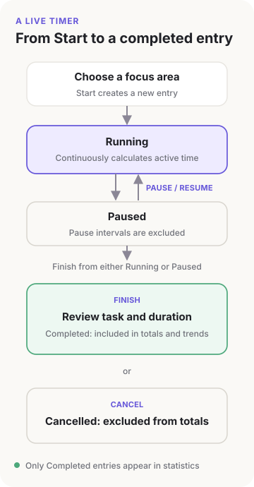
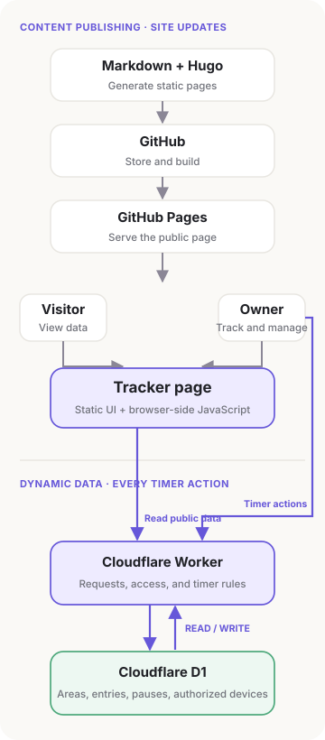
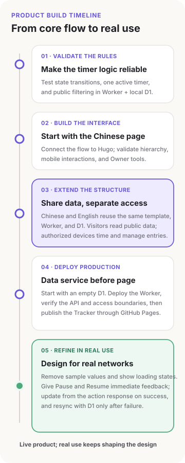
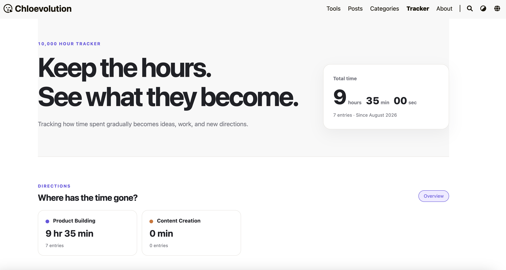

# I Built a 10000 Hour Tracker

The idea for the 10,000 Hour Tracker came from the widely known “10,000-hour rule.” It is often reduced to a simple claim: spend 10,000 hours in a field, and you can become an expert.

I was already familiar with the idea. A few weeks ago, I came across it again while quickly flipping through a new book. It kept resurfacing in my mind over the days that followed.

At the time, I was starting to learn SEO again. I had lost count of how many times I had started over, and it was difficult not to be hard on myself: Why was I still studying the same material? Why did I always seem to stay on the surface?

The 10,000-hour rule came back to me. I often felt that I had been working hard, only to forget when I had quietly stopped halfway and then regret repeating the cycle the next time. This time, I decided to quantify the time: How much had I actually invested? Where had that time gone? What had I learned along the way? That was how the 10,000 Hour Tracker began.

## First, Decide What the Tracker Should Record

Once I had the idea, the first question was what the Tracker should actually record. Each block of time needed to connect to a broader focus area, a specific task, and anything it eventually produced. Without that context, there would not be enough information to make a later review useful.

A complete entry ultimately contains the following fields:

| Field | Required? | Definition and how it is captured |
| --- | --- | --- |
| Focus area | Required | The long-term area the time belongs to, such as SEO, product building, or content creation. Selected when starting a timer or adding time manually. |
| Entry date | Required | The date to which the work belongs, used in the entry list and monthly trend. Derived from the start time for a live timer and selected for a manual entry. |
| Start and end time | Required for live timers | The boundaries of a timer session. The start is saved automatically, the end is set on completion, and both can be corrected later. |
| Pause intervals | Optional | Each pause and resume period, used to exclude paused time from the total. |
| Active duration | Required | The time that ultimately counts toward totals and trends. Calculated for a live timer and entered directly for a manual entry. |
| Task | Optional | What I did during that block of time. Public entries store separate Chinese and English task names. |
| Notes | Optional | Context, findings, or details that do not fit in the task name. |
| Related articles | Optional | Links the time invested to a Chloevolution article that emerged later. |
| Entry method | Set by the system | Distinguishes a live timer from a manually added entry. |
| Status | Set by the system | Whether the entry is running, paused, completed, or cancelled. Only completed entries count toward totals. |
| Visibility | Required | Determines whether the entry appears in the public page’s total time, trends, and recent activity. |

Start and end times and pause intervals define the boundaries of a session. Focus areas and tasks explain where the time went, while notes and related articles preserve what eventually came from it. When I look back, I can see what I read, which questions I investigated, and what actually made its way into my work and writing.

Defining these fields also clarified what the Tracker could not answer.

Hours can show how much time I invested, but they cannot be converted proportionally into ability. The [original study of deliberate practice by Ericsson, Krampe, and Tesch-Römer](https://doi.org/10.1037/0033-295X.100.3.363) did not define 10,000 hours as a universal threshold for expertise. A [meta-analysis by Macnamara, Hambrick, and Oswald](https://doi.org/10.1177/0956797614535810) also found that the amount of performance variation explained by practice differs across domains.

The Tracker therefore shows accumulated time, but it does not display progress such as `126 / 10,000`, calculate the hours remaining, reward streaks, or impose fixed review milestones. The page presents only the time I actually spent.

## Designing How a Timer Session Works

Once the fields were defined, the next question was how an entry would be created.

A live entry begins by selecting a focus area. Clicking Start moves the entry into a running state, and the task can be added while the timer is active. Pause opens a pause interval; Resume closes that interval and continues accumulating time. Finish opens a confirmation screen where the task, duration, and other fields can be reviewed before the entry is saved as completed. Cancel preserves the session without including it in the totals.

There were initially two needs: visitors needed a way to see my long-term investment, while I needed a convenient place to record it. During the mobile wireframing process, those needs gradually converged on the same Tracker page. Visitors see accumulated time, focus areas, trends, and recent activity. An authorized Owner device can start timers, add time manually, and manage entries from the same page.

| Capability | Visitor | Owner |
| --- | --- | --- |
| View total time, focus areas, trends, and recent activity | Yes | Yes |
| Start, pause, resume, finish, or cancel a timer | — | Yes |
| Add, edit, or delete time entries | — | Yes |
| Create, edit, or archive focus areas | — | Yes |
| View and manage non-public entries | — | Yes |

That introduced another problem: the page might be closed, but the timer could not stop with it. Reopening the page—or opening it on another device—needed to restore the previous running or paused state.

## Adding a Dynamic Layer to a Static Blog

Chloevolution was already generated with Hugo and published through GitHub Pages. That setup could provide the Tracker interface, but it could not save an entry that was still running. Rebuilding the site every time I started, paused, or finished a timer would not work for daily use.

I decided to keep the existing static site and place the frequently changing parts in a separate data service. Because the site’s domain was already managed through Cloudflare and the Tracker’s personal usage would be small, I chose a Cloudflare Worker and D1.

A Cloudflare Worker is a lightweight backend service that runs on Cloudflare’s network without a separate server to maintain. D1 is Cloudflare’s relational database. In the Tracker, the Worker receives page requests, verifies Owner devices, and applies the timer rules. D1 stores focus areas, time entries, pause intervals, and authorized devices.

Once the technical approach was decided, the interaction path for a timer became clear. When Start is clicked, the browser sends the focus area and current time zone to the Worker. The Worker verifies the device and current timer state, creates a `running` entry in D1 using server time, and returns the result to the page. A database constraint allows only one running or paused entry at a time, preventing me from accidentally starting two timers on different devices.

Pause and Resume also go through the Worker. Pausing creates a pause interval in D1 and changes the entry to `paused`; resuming closes that interval and returns the entry to `running`. The page uses the start time and pause history returned by the Worker to display the current active duration.

Clicking Finish initially opens only the confirmation screen. Once I confirm and save, the Worker calculates the active duration and changes the entry to `completed`. The page then requests fresh totals, focus-area summaries, monthly trends, and recent entries. The Chinese and English pages read the same entry and share its duration, focus area, and status, while storing separate Chinese and English task names.

The browser displays information and sends actions, the Worker applies the rules, and D1 holds the source of truth. Closing the page does not stop the timer. When the page is opened again, it reads the start time and pause history from D1 through the Worker and reconstructs the current active duration.

This creates two independent data flows. When an article or page changes, Markdown goes to GitHub and Hugo builds the version published on GitHub Pages. When a timer starts, pauses, or finishes, the browser calls the Worker directly; the Worker updates D1 and returns the latest state. A timer action never requires a Git commit or a new site deployment.

This separation preserves the simplicity of the static blog while allowing timer data to update continuously. If the Tracker’s dynamic service becomes temporarily unavailable, the rest of the blog remains accessible. Both language versions share the same D1 data: switching languages changes the interface and task name, but it does not create a second set of accumulated hours.

## From Working Software to a Product I Could Use

After settling on the technical approach, I validated the core flow in a standalone Worker project before building the complete page. Start, Pause, Resume, Finish, and Cancel all needed to update the entry state correctly. Only one active timer could exist at a time. Only completed entries could enter the totals, and all other statuses and non-public entries had to be filtered out. Once those rules worked reliably with a local D1 database, I connected them to the Hugo page.

I built the Chinese interface first to establish the information hierarchy and mobile interactions. Once it worked, the English version reused the same page template, browser script, Worker, and D1 database. Both language versions share time and status, while task names are stored separately in Chinese and English. I am the only person who can write data, so the Tracker does not need a full registration and login system. A device is activated once with an Owner Key, after which the Worker recognizes the authorized browser. Regular visitors always have read-only access to public data.

Production began with an empty D1 database. I deployed the Worker first and verified the API, device access, and public-data boundaries before publishing the Tracker page through the existing GitHub Pages flow. Test entries, test devices, and local keys never entered production.

Once the page was live, real production conditions quickly exposed problems that local testing had not shown. The initial HTML still contained sample data from the wireframing stage, which was replaced only after the API responded. On a slower connection, visitors briefly saw totals and entries that did not exist.

Pause and Resume initially sent two requests in sequence: one to change the state and another to fetch the complete entry again. A production request could take around two seconds, so waiting on two consecutive requests made a simple action feel sluggish. Later, the button began showing its processing state immediately, and the page used the entry returned by the action endpoint to update the timer. It fetched the state from D1 again only when a request failed.

---

When the Tracker went live, its first seven entries all documented its own creation: defining the product scope, drawing wireframes, validating the Worker and D1, connecting the Chinese and English pages, deploying the system, and fixing the issues that appeared after launch. Together, they added up to 9 hours and 35 minutes. The Tracker first captured how an idea in my head became a real product.

I will continue using it to record product building, content creation, and other long-term efforts. I want to see which directions endure and which gradually disappear—and whether something I read or research stays in that moment or later becomes an article, a piece of code, a product decision, or a new question.

Those changes may take months or even years to become visible. But the next time I feel that I have been learning the same thing over and over, I can open the [10,000 Hour Tracker](/10000-hour-tracker/) and see whether the effort really happened—and where it took me.

