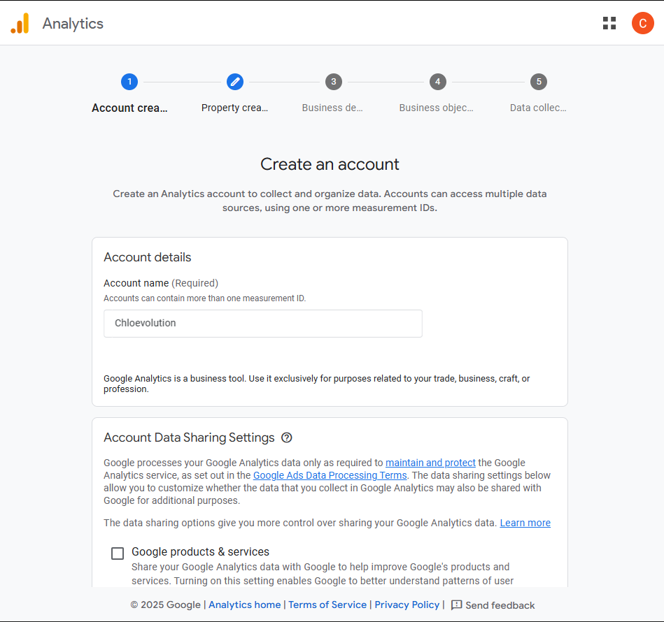

# Integrate Google Analytics with Hugo Website


After setting up your personal blog site [using Hugo and GitHub Pages](https://chloevolution.com/posts/hugo-github-pages/), you can integrate Google Analytics to monitor SEO performance and track detailed traffic metrics.

## Configuration Steps
### 1. Log into Google Analytics 4 and Create a New Account  
Sign in with your Google account on the [official website](https://marketingplatform.google.com/about/analytics/) and create a new Google Analytics 4 (GA4) account.  
**Note:** Google has fully transitioned to GA4, and the legacy Google Universal Analytics (UA) is deprecated.  
  

### 2. Set Up a New Property in the Account  
Configure the property name, time zone for data collection, and currency type (if your website sells products or services).  
  

### 3. Provide Basic Business Information  
This helps Google Analytics better understand your website's context.  
  

### 4. Select "Traffic" as the Business Objective  
Different businesses prioritize distinct conversion goals. You can select multiple objectives, but limit them to two for simplicity. For new blogs, focus on traffic growth over sales.  
  

### 5. Enter Your Website URL to Configure the Data Source  
Choose your data collection source (Web, Android App, or iOS App), then input your website URL and assign a name to the data stream.  

### 6. Install GA4 Tracking Code on Your Website  
Google offers two installation methods:  
- **Install via CMS or Website Builder:**  
  If your site is built using mainstream platforms like WordPress, Shopify, or Wix, select the corresponding platform for automated code integration.  
    

- **Manual Installation**  
  For Hugo + GitHub Pages sites, manually embed the code. Each site has a unique GA4 ID (starting with "G"), which must be added to your website's code.  
    

**For the [LoveIt Theme](https://github.com/dillonzq/LoveIt):**  
1. **Update Base Configuration**  
   In the `<code>your_site/config.toml</code>` file, locate `<code>[params.analytics]</code>`, set `enable` to `true`, and enter your GA4 ID under `<code>[params.analytics.google]</code>`:  
     

2. **Modify Template Files**  
   Copy `<code>your_site/themes/LoveIt/layouts/partials/head/seo.html</code>` to `<code>your_site/layouts/partials/head/</code>`. In the copied file, locate `<meta name="google-site-verification" content="{{ . }}" />` and append the following code:  
   ```html
    <!-- Google tag (gtag.js) -->
    <script async src="https://www.googletagmanager.com/gtag/js?id={{ . }}"></script>
    <script>
        window.dataLayer = window.dataLayer || [];
        function gtag(){dataLayer.push(arguments);}
        gtag('js', new Date());
        gtag('config', '{{ . }}');
    </script>
   ```  
   Redeploy your blog to GitHub Pages. Google Analytics will begin collecting data.  

## Verify Configuration  
After setup, allow up to 48 hours for Google Analytics to process initial data. Once active, you’ll see traffic metrics in your GA4 dashboard.
