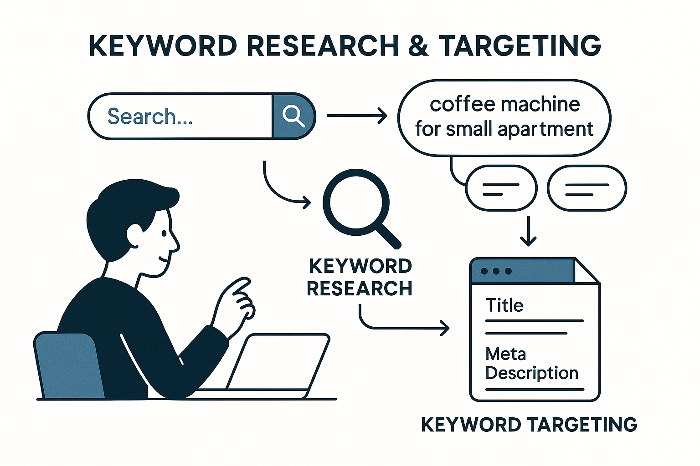
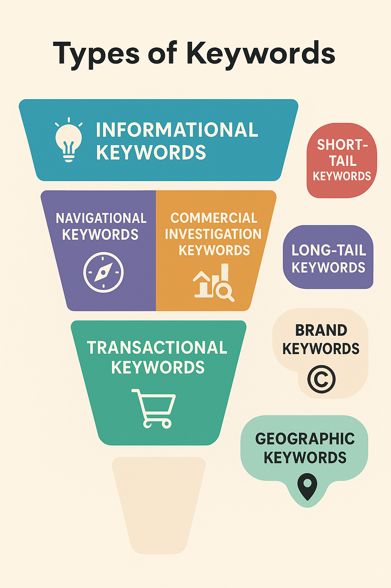
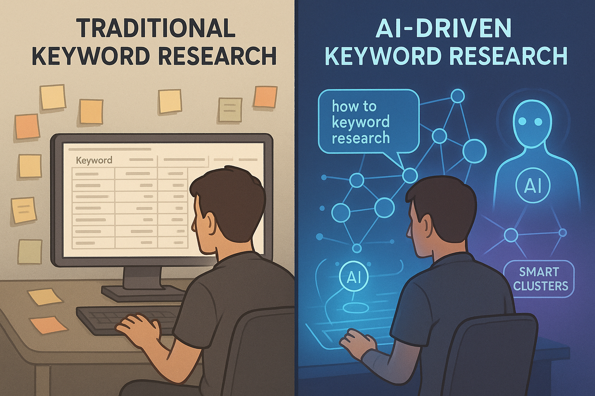

# Keyword Research and Targeting in the AI Era

## What is Keyword Research and Targeting?

Through keyword research, we can understand what potential users truly care about, their preferences, and their ways of expression, thereby creating content that better aligns with their search habits. Good keyword research makes content more relevant to actual searches, increasing the chances of being recommended by search engines, and **is crucial for both improving organic rankings (SEO) and optimizing [paid advertising (SEM)](https://www.google.com/search?q=https://chloevolution.com/zh-cn/posts/sem-basics/)**.

### Keyword Research: Understanding How Users Search

Keyword research involves analyzing data to find terms or phrases commonly used by users in search engines. These keywords are often not just single words, but more commonly **search phrases with clear intent**, such as:

  * "Best coffee machine for small apartments"
  * "High-performance laptops 2025"
  * "Which baby stroller brand is good"

Through keyword research, we can understand what potential users truly care about, their preferences, and their ways of expression, thereby creating content that better aligns with their search habits. Good keyword research makes content more relevant to actual searches, increasing the chances of being recommended by search engines.

### Keyword Targeting: Helping Search Engines Understand Your Content Better

Keyword targeting is the process of **naturally integrating** the researched keywords into **key positions on a page** to improve the page's visibility in search results. Keyword placement should not be about awkward repetition, but rather about making the page's topic clear to both search engines and users.

Keywords should typically appear in the following locations:

  * Page Title
  * Beginning of paragraphs
  * URL links
  * Meta Description
  * Alt attributes of images
  * Appropriate natural positions within the content

For example, when a user searches for "portable washing machine for renters," and you happen to offer a related product, then your page title, content, and description should clearly include this phrase, rather than just vaguely saying "washing machine recommendations."

Precise keyword targeting not only helps search engines understand your content but also provides readers with the answers they are looking for.

## Types of Keywords

Keywords play different roles in SEO and SEM strategies. Based on their length, purpose, and user intent, keywords can be divided into various types:

| **Classification Dimension** | **Keyword Type** | **Definition** | **Examples (using "coffee machine")** |
| ------------------------ | ------------------- | ------------------------------------------------------ | -------------------------------------------------------- |
| **By Search Intent** | Informational       | User wants to get information or learn about a topic   | Coffee machine mechanism, how to use a coffee machine, how to clean a coffee machine |
|                          | Navigational        | User wants to directly visit a brand, website, or product page | De'Longhi coffee machine official website, Nespresso capsule coffee machine review on Xiaohongshu |
|                          | Transactional       | User has a clear purchase or comparison intent, often with words like "recommend," "buy" | Coffee machine recommendations 2025, best home coffee machine, coffee machine price comparison |
| **By Keyword Length & Structure** | Head Keyword      | Usually a single word or short phrase, broad coverage, high competition | Coffee machine                                           |
|                          | Long-tail Keyword   | More specific, longer phrases with clear search intent, often including usage scenarios, needs, or attributes | Small apartment coffee machine recommendation, portable coffee machine for renters |
| **By Brand Attribute** | Branded Keyword     | Keywords containing a specific brand name or model     | De'Longhi coffee machine review, Nespresso capsule coffee machine |
|                          | Competitor Keyword  | Keywords containing competitor brand names or comparison terms | De'Longhi vs Philips coffee machine, Nespresso vs Starbucks coffee machine |
| **By Geographic Feature** | Local Keyword       | Keywords including a geographical location, reflecting users' localized search intent | Shanghai coffee machine repair shop, Beijing coffee machine physical store |
| **By Question Format** | Question Keyword    | Questions in the form of "how to," "which kind," "is it worth buying," common in conversational search | How to choose a coffee machine? Is a coffee machine worth buying? |

## Which Platforms Require Keyword Research and Targeting?

| **Platform Type** | **Example Platform Names** | **Purpose of Keyword Research (Summary)** |
| ------------------- | ------------------------------------------------- | -------------------------------------------------------------------------------- |
| **Search Engines** | Google, Bing, Baidu, 360 Search                   | - SEO optimization (organic ranking) \<br\>- Ad keyword bidding & targeting (SEM) \<br\>- Understand user search behavior and trends |
| **E-commerce Platforms** | Amazon, eBay, Etsy, Tmall, Taobao, JD.com         | - Optimize product titles & keywords \<br\>- Increase internal search visibility \<br\>- Identify user purchase intent & hot product categories |
| **Video Platforms** | YouTube, Douyin (TikTok), Bilibili                | - Optimize video titles, tags, & descriptions \<br\>- Improve internal search ranking & recommendation weight \<br\>- Discover trending topics & expressions |
| **Social Content Platforms** | Pinterest, Reddit, Quora, Twitter, Xiaohongshu, Zhihu, Weibo | - Capture authentic user language \<br\>- Discover question-based, pain-point keywords \<br\>- Identify hot topics & content creation opportunities |
| **Content Publishing Platforms** | Medium, WordPress, WeChat Official Accounts, Baijiahao, Toutiaohao | - Plan content structure & title keywords \<br\>- Improve indexing & organic traffic \<br\>- Achieve high content-to-search intent match |
| **Ad Placement Platforms** | Google Ads, Microsoft Ads, Baidu Promotion, Tencent Ads, Juxu Eyewear | - Precisely control ad targeting scope \<br\>- Improve click-through rate & conversions \<br\>- Reduce invalid clicks & costs |
| **App Store Platforms** | Apple App Store, Google Play, Huawei AppGallery, Xiaomi App Store | - Optimize app name, subtitle, & keyword fields \<br\>- Improve search ranking & download conversion rate \<br\>- Implement app ASO strategy |

## Important Metrics for Keyword Research and Targeting

When conducting keyword research and targeting, selecting appropriate keywords depends not only on their relevance but also on a series of key metrics to judge their value. However, different platforms have different criteria and methods for evaluating keywords:

### General Keyword Research Metrics

| **Metric Name** | **Description** |
| ------------------------ | ------------------------------------------------------ |
| Search Volume            | Average monthly search frequency of the keyword, measuring potential traffic scale |
| Keyword Difficulty       | The level of competition for the keyword, usually related to the number of existing content, domain authority, etc. |
| Keyword Length/Structure | Long-tail vs. head keywords, affecting precision and competition |
| Trend Hotness            | Time-series trend of search volume, helps determine if it's seasonal or viral keyword |
| Search Intent Type       | Informational, navigational, transactional, question-based, etc., crucial for content or ad matching |

### Platform-Specific Keyword Research Metrics

| **Platform Type** | **Proprietary Metric Name** | **Description** |
| ----------------- | -------------------------------------------- | -------------------------------------------------------------- |
| **Search Engines** | CPC (Cost Per Click)                         | Common on SEM platforms, measures the competition level of paid keywords |
|                   | SERP Features                                | Whether rich text blocks are triggered, such as FAQs, images, videos, etc. |
| **Video Platforms** | Tag Click-Through Rate, Watch Time Associated Keywords | Used in YouTube/Douyin (TikTok) for algorithm to determine content relevance and recommendation weight |
|                   | Title/Thumbnail Click-Through Rate (CTR)     | Evaluation of the attractiveness of video thumbnails and titles for search recommendations |
| **E-commerce Platforms** | Category Hot Words (Browsing Terms)          | Hot terms in common buyer browsing paths and classification tags |
|                   | Conversion Keywords (Purchase Trigger Terms) | Keywords that lead to order placement, such as "discount," "limited edition" |
| **Social Platforms** | Hashtag Volume                               | Frequency and popularity of specific tags, such as \#coffeelover |
|                   | User Questions and Comments Language         | Real language data from communities like Reddit, Zhihu, suitable for question-based or colloquial keyword mining |
| **App Stores** | ASO Keyword Weight                           | Differences in weighting of name, subtitle, and keyword fields for search ranking |
|                   | Install Conversion Rate Associated Keywords  | Which keywords lead to higher download conversion rates        |

On the surface, search engines, e-commerce platforms, and app stores have similar search behaviors: users enter keywords → the system returns matching results.
However, they have **fundamental differences** in **search goals, ranking logic, and user intent**, so the reference metrics for keyword research will have a **combination of overlap + differences**:

| **Dimension** | **Search Engines (e.g., Google)** | **E-commerce Platforms (e.g., Amazon)** | **App Stores (e.g., App Store)** |
| ----------------------- | ------------------------------------------- | ------------------------------------------------- | --------------------------------------------- |
| **User Search Intent** | Primarily "getting information," also includes navigation, transactions, etc. | Strong transactional orientation (finding something to buy) | Finding a specific app, or fulfilling a specific usage need |
| **Core Ranking Mechanism** | Relevance + Authority + User Behavior Signals | Relevance + Sales Data + Price + Reviews + Conversion Rate | Relevance + Downloads + Ratings + Retention Rate + Keyword Match |
| **Keyword Research Goal** | Capture search volume, difficulty, semantic relevance, optimize content structure | Target transactional keywords, competitor differentiator keywords, high-purchase-intent phrases | Identify high-converting function words, competitor terms, category terms, long-tail demands |
| **Keyword Lifecycle** | Long-term or short-term coexistence (e.g., trending topics) | Closely related to product inventory, promotion cycles | Dynamically adjusts with version updates, feature changes, user feedback |
| **Keyword Reference Metric Differences** | Search volume, difficulty, intent, trends       | Search volume, competition \<br\> + Conversion keywords, category hot words, conversion rate words | Search volume \<br\> + ASO keyword weight, install conversion rate, user feedback keywords |

## How to Conduct Keyword Research?

With the rise of generative AI, many content creators and SEO practitioners are revisiting an old question: how exactly should we do keyword research?
Past practices were well-established—selecting seed keywords, analyzing search volume, expanding long-tail keywords, controlling keyword density... the process was clear, the tools defined.
But today, user search behavior has changed, becoming more conversational, more semantic, and more difficult to exhaustively enumerate.

Below, let's compare the key differences between traditional keyword research methods and AI-driven approaches:

| **Dimension** | **Traditional Keyword Research Methods** | **AI-Driven Keyword Research Methods** |
| ---------------------------- | ---------------------------------------------------------------------------- | ---------------------------------------------------------------------------------------------------------------- |
| **Starting Point** | Based on **user behavior data** + seed keyword expansion \<br\> Data sources include search engine auto-suggestions, tool recommendations, user search logs, etc. | Based on **natural language input and semantic modeling**, AI can automatically identify keyword networks and search intent from a description/goal |
| **Keyword Expansion Mechanism** | Starting from seed keywords, **rule-driven** automatic recommendation or manual filtering expansion | Starting from semantics, **context-driven**, can generate question-based, conversational, scenario-based keywords (non-explicit match terms) |
| **Keyword Analysis Dimensions** | Focus: search volume, competition, CPC, keyword structure (head/long-tail)    | Enhanced: intent recognition, contextual relevance, search tone, user sentiment, conversational style, language variations |
| **Keyword Structure Understanding** | Relatively flat structure, emphasizing head keywords + long-tail keywords     | More semantic structure: e.g., "functional terms," "question terms," "negative intent terms," "pain point expressions," "scenario-specific terms" |
| **Keyword Generation Method** | Based on user behavior/platform historical data statistics, leans towards static libraries | Based on LLM generation: can generate semantic combinations and question-based expressions that users have not searched for but are **highly potential** |
| **Tool Representatives (not absolute division)** | Ahrefs, SEMrush, Google Keyword Planner, AlsoAsked, AnswerThePublic, etc. | Above tools + Frase, SEO.ai, ChatGPT (for keyword suggestions), WriterZen, NeuronWriter, Perplexity, etc.          |
| **Tool Capability Differences** | Relies on **inputting keywords** to trigger recommendation results, more for data query and filtering | Can **generate keywords and build content structure by inputting goals or user intent**, supports intelligent clustering and summarization |
| **Keyword-Content Connection** | Keywords → article structure (word frequency, headings, paragraph placement)   | User intent → search path → content phrasing, emphasizing natural language expression and semantic coverage    |
| **Keyword Research Role Change** | SEO specialist/content planner leads                                        | Planner + AI operator equally important, content creators can directly invoke AI to generate keyword frameworks |
| **Keyword Coverage Efficiency** | Long-tail keywords rely on manual supplementation or tool enumeration       | AI can **automatically generate rich semantic variations** and user language versions, improving efficiency several times over |
| **Keyword Content Match** | Emphasizes technical parameter matching (e.g., word frequency, density)      | More emphasis on semantic fluency and user intent response, stressing **naturalness, conversationality, pragmatic consistency** |

-----

## How to Target Keywords?

Finding keywords is just the first step. What truly determines content effectiveness is **how these words are used on the page**, and whether they accurately respond to user search intent. In the past, we relied on experience to control the placement and frequency of keywords. Today, AI is beginning to help us understand "what users actually want to see" and embed keywords naturally into content:

| **Dimension** | **Traditional Keyword Targeting Methods** | **AI-Driven Keyword Targeting Methods** |
| ------------------------- | -------------------------------------------------------------------------- | ------------------------------------------------------------------------------------------------------ |
| **Core Targeting Logic** | Based on **keyword-to-page content match**, optimizing placement and frequency | Based on **user search intent and content semantic fit**, optimizing context and experience. **AI can even predict what a user might search for next, enabling proactive keyword placement.** |
| **Keyword Distribution Method** | Manual control of keyword placement in **title, H tags, first paragraph, first sentence of paragraphs, URL, meta description**, etc. | AI automatically determines where keywords should appear in **which paragraphs, tones, and phrasing** based on semantic structure, aiming for natural language integration |
| **Page Matching Method** | Keyword → page content, "write around the keyword"                         | User intent → content → covering related keyword clusters, "problem-solving centered"                    |
| **Keyword-Intent Adaptation** | Rely on experience to judge the intent behind keywords, prone to subjective bias | LLM models can identify **intent levels** (e.g., informational/comparative/transactional) and generate matching phrasing |
| **User Search Path Understanding** | Understand needs on a keyword-by-keyword basis                             | Understand needs on a search path basis (e.g., "learn → compare → choose → buy") and dynamically adjust keyword placement |
| **Content Type Matching** | One keyword per page, multiple landing pages for different keywords         | One page, multiple intents, supporting coexistence of multiple keywords. AI can recommend modular content structures (e.g., FAQ + product comparison + review aggregation) |
| **Targeting in Ad Campaigns** | Selected keywords + bidding, matching ad copy with landing pages           | AI can generate the most relevant keyword sets and ad copy based on ad goals and user intent (e.g., Performance Max + AI animated content) |
| **Adapting Content Forms** | Primarily for text-based pages                                             | Adapts to **rich media, short videos, voice search, AI assistant search**, supports cross-media expression consistency |
| **Monitoring and Optimization** | Manually observe keyword ranking changes and click data                    | AI can track keyword → content → behavior paths, automatically identify "semantic off-track points" and suggest optimization |

-----

## Frequently Asked Questions (FAQ)

### Q1: Should I primarily focus on head keywords or long-tail keywords?

**A1:** **You should focus on both, but with different strategies.**

  * **Head Keywords:** High search volume, intense competition, can bring significant potential traffic, but achieving rankings and conversions is difficult and costly. Typically used for brand building and acquiring high-value traffic.
  * **Long-tail Keywords:** Relatively smaller search volume, but more precise search intent, less competition, and usually higher conversion rates. Cumulatively, they can bring considerable targeted traffic.

**Recommendation:** Initially, focus on **long-tail keywords** to more quickly achieve rankings and conversions. As website authority increases and budget allows, gradually compete for head keywords.

### Q2: Is keyword research only useful for Google Search?

**A2:** **No.** The core principle of keyword research is understanding user needs and search behavior, which applies to any platform with search functionality. Whether it's search engines like Google and Baidu, e-commerce platforms like Amazon and Taobao, video platforms like YouTube and Douyin (TikTok), or app stores like Apple App Store, users employ keywords to find information, products, or services.

### Q3: Will AI tools completely replace manual keyword research?

**A3:** **Not in the short term, but AI will become an indispensable assistant.**
AI has a huge advantage in rapidly generating large numbers of keywords, identifying semantic connections, analyzing search trends, and understanding user intent, greatly improving efficiency. However, human **strategic judgment, industry insight, understanding of brand context, and capturing subtle user emotions** are still aspects that AI cannot fully replace. The best approach is to **use AI as a powerful assistant**, allowing human experts to focus on higher-level strategic decisions and creative content.

### Q4: How often should I conduct keyword research and update my content?

**A4:** Keyword research and content updates are continuous processes with no fixed schedule, but here are some guiding principles:

  * **Before initial content publication**: Conduct thorough and in-depth keyword research.
  * **Regular review (every 3-6 months)**: Check keyword rankings, traffic, and conversion data to see if new popular keywords have emerged, or if existing keywords are performing poorly.
  * **When market or product changes occur**: When new products are launched, business expands, or significant market trends emerge, keyword research needs to be revisited.
  * **Competitor dynamics**: Pay attention to which keywords competitors are performing well on, and look for new opportunities.

Continuous keyword optimization is key to maintaining content competitiveness and acquiring traffic.
